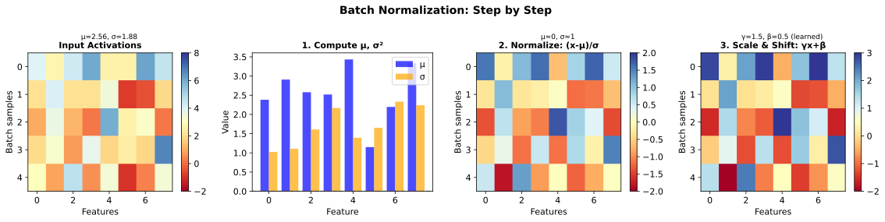
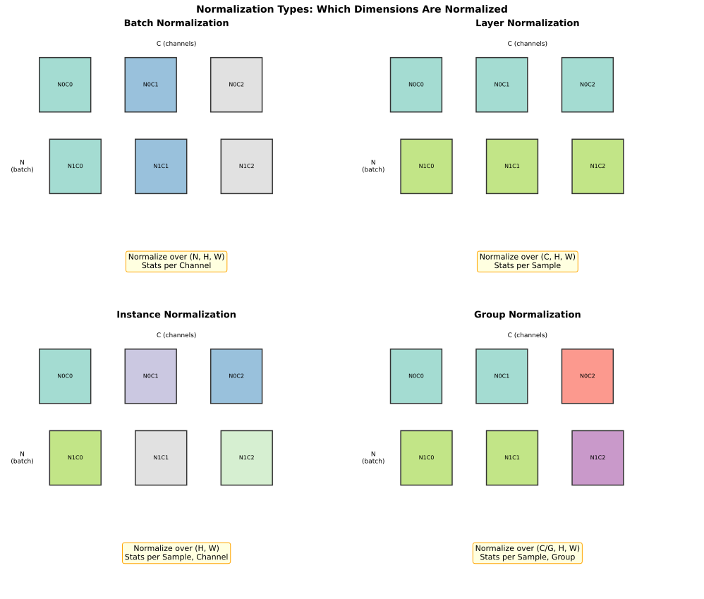
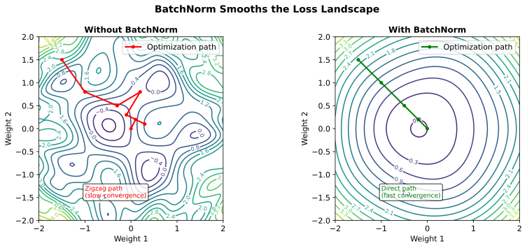

# Normalization

> **Stabilizing training** — BatchNorm, LayerNorm, and when to use each

---

## Why Normalization?

During training, the distribution of each layer's inputs changes as the weights of preceding layers update. This is called **internal covariate shift**.

### The Problem

- Layer 2 learns to process outputs from Layer 1
- Layer 1's weights change → Layer 1's output distribution changes
- Layer 2 must constantly adapt to a moving target

### The Solution

Normalize activations to have consistent statistics (zero mean, unit variance), making optimization easier.

---

## Batch Normalization (BatchNorm)

BatchNorm normalizes across the **batch dimension** — computing mean and variance over all samples in a mini-batch for each feature.

### Algorithm

For a mini-batch $\mathcal{B} = \{x_1, x_2, \ldots, x_m\}$:

**Step 1**: Compute batch statistics
$$\mu_{\mathcal{B}} = \frac{1}{m}\sum_{i=1}^{m} x_i$$
$$\sigma^2_{\mathcal{B}} = \frac{1}{m}\sum_{i=1}^{m} (x_i - \mu_{\mathcal{B}})^2$$

**Step 2**: Normalize
$$\hat{x}_i = \frac{x_i - \mu_{\mathcal{B}}}{\sqrt{\sigma^2_{\mathcal{B}} + \epsilon}}$$

**Step 3**: Scale and shift (learnable)
$$y_i = \gamma \hat{x}_i + \beta$$



### Learnable Parameters

$\gamma$ (scale) and $\beta$ (shift) allow the network to **undo** normalization if needed:
- If $\gamma = \sigma$ and $\beta = \mu$, we recover the original distribution
- The network learns the optimal amount of normalization

### Training vs Inference

| Phase | Mean/Variance Source |
|-------|---------------------|
| **Training** | Current mini-batch statistics |
| **Inference** | Running average accumulated during training |

**Why different?** Inference may be single samples (no batch), and we want deterministic outputs.

```python
# During training
running_mean = momentum * running_mean + (1 - momentum) * batch_mean
running_var = momentum * running_var + (1 - momentum) * batch_var

# During inference
y = gamma * (x - running_mean) / sqrt(running_var + eps) + beta
```

---

## Layer Normalization (LayerNorm)

LayerNorm normalizes across the **feature dimension** — computing mean and variance over all features for each sample independently.

### Comparison with BatchNorm



For a 4D tensor (N, C, H, W):

| Normalization | Dimensions Normalized | Statistics Per |
|--------------|----------------------|----------------|
| **BatchNorm** | (N, H, W) | Channel |
| **LayerNorm** | (C, H, W) | Sample |
| **InstanceNorm** | (H, W) | Sample, Channel |
| **GroupNorm** | (C/G, H, W) | Sample, Group |

### When to Use LayerNorm

- **Transformers**: Self-attention has no batch dimension in attention computation
- **RNNs**: Sequence length varies, batch statistics are unstable
- **Small batch sizes**: When batch statistics are too noisy
- **Online learning**: Single-sample processing

### LayerNorm in Transformers

```python
# Transformer layer with LayerNorm
x = x + self_attention(layer_norm(x))  # Pre-norm
x = x + ffn(layer_norm(x))
```

---

## Group Normalization (GroupNorm)

GroupNorm divides channels into groups and normalizes within each group.

### Motivation

BatchNorm fails with small batches (noisy statistics). LayerNorm may not capture channel-wise patterns in vision tasks. GroupNorm is a compromise.

### Algorithm

Split C channels into G groups, normalize within each group:

```python
# Reshape (N, C, H, W) -> (N, G, C//G, H, W)
# Normalize over (C//G, H, W) dimensions
```

### When to Use

- **Object detection/segmentation**: Small batch sizes (1-2) due to high-resolution images
- **Vision + small batches**: When BatchNorm fails but you want channel structure
- **Example**: Mask R-CNN uses GroupNorm

---

## Instance Normalization

Normalizes each sample, each channel independently.

### Use Case

**Style transfer**: Want to normalize away style while preserving content structure.

```python
# Normalize over (H, W) only
for each sample:
    for each channel:
        normalize(x[sample, channel, :, :])
```

---

## Effects on Training

### Smoother Loss Landscape

BatchNorm makes the loss landscape significantly smoother, enabling:
- Higher learning rates
- Faster convergence
- More stable training



### Regularization Effect

BatchNorm adds noise through batch statistics, acting as regularization:
- Each sample's normalization depends on other samples in the batch
- Different batches produce different normalizations
- Similar to dropout's noise injection

### Allows Higher Learning Rates

Without normalization, large learning rates cause:
- Activations to explode
- Gradients to explode
- Training to diverge

With normalization:
- Activations are bounded
- Gradients are more stable
- Larger learning rates are safe

---

## Comparison Summary

| Method | Normalizes Over | Batch Size Dependent | Best For |
|--------|-----------------|---------------------|----------|
| **BatchNorm** | (N, H, W) per channel | Yes | CNNs with batch size > 16 |
| **LayerNorm** | (C, H, W) per sample | No | Transformers, RNNs |
| **GroupNorm** | (C/G, H, W) per sample | No | CNNs with small batch |
| **InstanceNorm** | (H, W) per channel, sample | No | Style transfer |

### Decision Flowchart

```
What architecture?
├── Transformer
│   └── LayerNorm
├── RNN/LSTM
│   └── LayerNorm
├── CNN
│   ├── Batch size >= 16?
│   │   └── BatchNorm
│   └── Batch size < 16?
│       └── GroupNorm
└── Style Transfer
    └── InstanceNorm
```

---

## Implementation Details

### Where to Place Normalization

**Post-activation** (original BatchNorm paper):
```
Linear → BatchNorm → ReLU
```

**Pre-activation** (common in modern architectures):
```
BatchNorm → ReLU → Linear
```

For transformers, **Pre-LayerNorm** is common:
```
x = x + Attention(LayerNorm(x))
```

### Affine Parameters

Most implementations have `affine=True` by default:
```python
nn.BatchNorm2d(channels, affine=True)  # learns gamma, beta
nn.LayerNorm(dim, elementwise_affine=True)
```

Setting `affine=False` removes learnable scale/shift.

---

## Interview Questions

### Q1: "Explain the difference between BatchNorm and LayerNorm."

> **BatchNorm** normalizes across the **batch dimension**:
> - Computes mean/variance over all samples for each feature
> - Statistics: Per channel (for CNNs) or per feature
> - Requires batch of samples; behavior differs train vs inference
>
> **LayerNorm** normalizes across the **feature dimension**:
> - Computes mean/variance over all features for each sample
> - Statistics: Per sample
> - Independent of batch size; same behavior train and inference
>
> **When to use each**:
> - BatchNorm: CNNs with batch size >= 16
> - LayerNorm: Transformers (no batch in attention), RNNs (variable sequence length), small batches
>
> **Key insight**: BatchNorm depends on batch composition; LayerNorm depends only on the current sample.

### Q2: "Why does BatchNorm behave differently during training vs inference?"

> **During training**: Uses mini-batch statistics (mean, variance computed over current batch)
> - Each sample's normalization depends on other samples in the batch
> - Provides stochastic regularization
>
> **During inference**: Uses running averages accumulated during training
> - Deterministic output (same input → same output)
> - Works with single samples (no batch needed)
> - Running stats: $\mu_{running} = \alpha \mu_{running} + (1-\alpha) \mu_{batch}$
>
> **Why different?**
> 1. Inference may be single samples — no batch to compute statistics from
> 2. We want deterministic predictions for deployment
> 3. Batch statistics would vary based on what else is in the batch
>
> **Gotcha**: Must call `model.eval()` before inference to use running stats!

### Q3: "When would you use GroupNorm over BatchNorm?"

> **Use GroupNorm when batch size is small** (typically < 16):
>
> **The problem with small batches**:
> - BatchNorm statistics become noisy
> - High variance in mean/variance estimates
> - Training becomes unstable
>
> **GroupNorm solution**:
> - Normalizes within groups of channels per sample
> - No dependence on batch size
> - Stable statistics even with batch size = 1
>
> **Common use cases**:
> - Object detection (Mask R-CNN) — high-resolution images limit batch size to 1-2
> - Semantic segmentation — same reason
> - Multi-GPU training with small per-GPU batch
>
> **Trade-off**: GroupNorm may be slightly worse than BatchNorm when batch size is large, but the difference is small.

---

## Key Takeaways

1. **Normalization stabilizes training** by ensuring consistent activation statistics.

2. **BatchNorm** normalizes over batch dimension — great for CNNs with large batches.

3. **LayerNorm** normalizes over feature dimension — essential for transformers and RNNs.

4. **GroupNorm** bridges the gap — works for CNNs with small batch sizes.

5. **Training vs inference**: BatchNorm uses batch stats during training, running averages during inference.

6. **Secondary effects**: Smoother loss landscape, regularization, allows higher learning rates.
