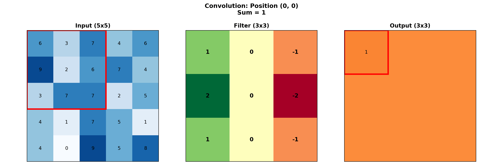
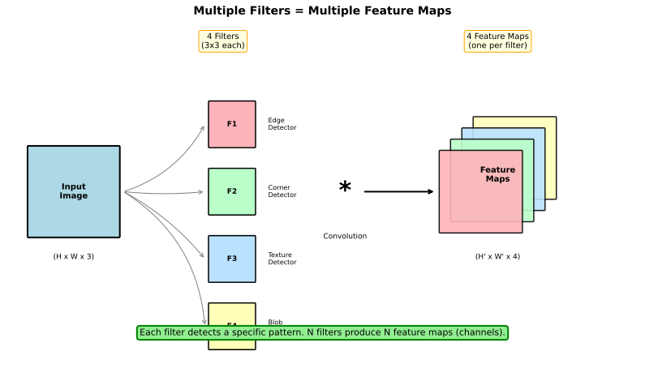
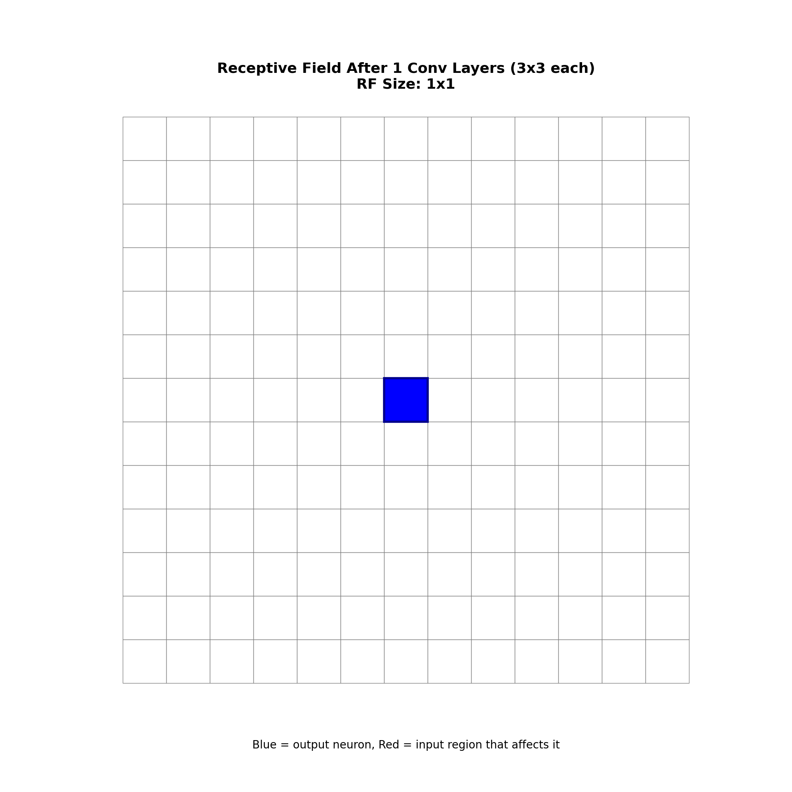
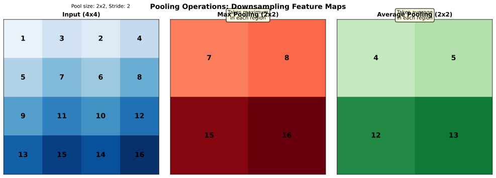
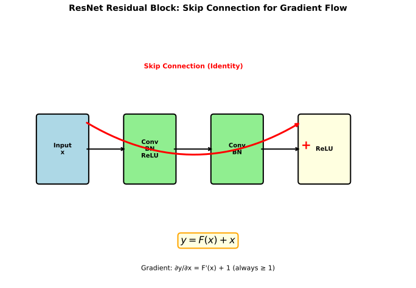

# Convolutional Neural Networks (CNNs)

> **The architecture for vision** — leveraging spatial structure through convolutions

---

## Why Not Fully Connected for Images?

A 224x224 RGB image has 150,528 pixels. A fully connected layer to 1000 hidden units needs 150 million weights — just for one layer.

### Problems with FC for Images

| Issue | Description |
|-------|-------------|
| **Too many parameters** | Memory and computation explosion |
| **No spatial structure** | Treats adjacent pixels same as distant ones |
| **Not translation invariant** | Cat in corner vs center requires different weights |
| **Overfitting** | Huge parameter count with limited data |

### CNN Advantages

- **Parameter sharing**: Same filter applied everywhere
- **Local connectivity**: Each neuron sees only a small region
- **Translation equivariance**: Features detected regardless of position

---

## The Convolution Operation

A convolution slides a small **filter/kernel** over the input, computing element-wise products and sums.

### Mathematical Definition

For 2D input $I$ and filter $K$:

$$(I * K)[i,j] = \sum_m \sum_n I[i+m, j+n] \cdot K[m,n]$$

### Example: 3x3 Filter on 5x5 Input



```
Input (5x5)          Filter (3x3)         Output (3x3)
┌─────────────┐      ┌───────┐           ┌───────┐
│ 1 2 3 4 5   │      │ 1 0 1 │           │ 21 27 │
│ 6 7 8 9 10  │  *   │ 0 1 0 │     =     │ 39 45 │
│ 11 12 13 14 │      │ 1 0 1 │           │ ...   │
│ 16 17 18 19 │      └───────┘           └───────┘
│ 21 22 23 24 │
└─────────────┘
```

### Stride and Padding

**Stride**: How many pixels to move the filter each step
- Stride 1: Output slightly smaller than input
- Stride 2: Output half the size (used for downsampling)

**Padding**: Adding zeros around the input
- "Valid": No padding, output shrinks
- "Same": Pad to keep output same size as input

**Output size formula**:
$$\text{Output} = \left\lfloor \frac{\text{Input} + 2 \cdot \text{Padding} - \text{Filter}}{\text{Stride}} \right\rfloor + 1$$

---

## Key CNN Concepts

### Multiple Filters = Multiple Feature Maps

Each filter detects one type of feature. A layer with 64 filters produces 64 feature maps.



### Channels/Depth

- Input: 3 channels (RGB)
- After conv layer with 64 filters: 64 channels
- Filter shape: (height, width, input_channels)
- Output shape: (height, width, num_filters)

### Receptive Field

The receptive field is the input region that affects a particular output neuron.



- Each conv layer increases receptive field by (kernel_size - 1)
- Deep networks have large receptive fields
- Important for capturing context (e.g., for segmentation)

---

## Pooling Layers

Pooling reduces spatial dimensions while preserving important features.

### Max Pooling vs Average Pooling



```
Input (4x4)              Max Pool (2x2)     Avg Pool (2x2)
┌───────────────┐        ┌───────┐          ┌───────┐
│ 1  3  2  4    │        │ 7  8  │          │ 4  5  │
│ 5  7  6  8    │   →    │ 13 16 │          │ 11 13 │
│ 9  11 10 12   │        └───────┘          └───────┘
│ 13 15 14 16   │
└───────────────┘
```

**Max pooling**: Takes maximum value — preserves strongest activation
**Average pooling**: Takes mean — smoother downsampling

### Why Pool?

1. **Reduce computation**: Smaller feature maps = faster processing
2. **Translation invariance**: Small shifts don't change max
3. **Larger receptive field**: Fewer pixels cover same input region

### Modern Alternative: Strided Convolutions

Many modern architectures replace pooling with stride-2 convolutions:
- More learnable (filter weights vs fixed pooling)
- Smoother downsampling
- Used in ResNet, EfficientNet

---

## Classic Architectures

### LeNet (1998)

The original CNN for digit recognition:
```
Input → Conv → Pool → Conv → Pool → FC → FC → Output
```

### AlexNet (2012)

Won ImageNet, sparked deep learning revolution:
- 5 conv layers, 3 FC layers
- ReLU activation (not sigmoid)
- Dropout for regularization
- GPU training

### VGG (2014)

Simple principle: stack 3x3 convolutions
```
Two 3x3 convs have same receptive field as one 5x5
But fewer parameters and more non-linearity
```

### ResNet (2015)

Introduced **skip connections** to train very deep networks.



---

## Skip Connections (Residual Blocks)

The key innovation of ResNet:

$$y = F(x) + x$$

Instead of learning $y = F(x)$, learn the **residual** $F(x) = y - x$.

### Why Skip Connections Work

**Gradient flow**: Even if $F'(x) \approx 0$, gradient can flow through the skip:
$$\frac{\partial y}{\partial x} = F'(x) + 1$$

**Easier optimization**: Learning $F(x) = 0$ (identity) is easy — just set weights to zero.

**Enables depth**: ResNet-152 (152 layers) trains successfully; plain networks fail beyond ~20 layers.

### Types of Skip Connections

| Type | Formula | Used In |
|------|---------|---------|
| **Residual** | $y = F(x) + x$ | ResNet |
| **Dense** | $y = F([x_1, x_2, \ldots, x_n])$ | DenseNet |
| **Highway** | $y = F(x) \cdot T(x) + x \cdot (1-T(x))$ | Highway Networks |

---

## Modern Convolution Variants

### 1x1 Convolutions

A 1x1 conv is a **channel mixer** — combines channels without spatial processing:

```python
# 256 channels → 64 channels (dimension reduction)
nn.Conv2d(256, 64, kernel_size=1)
```

**Uses**:
- Reduce channels (bottleneck in ResNet)
- Increase channels cheaply
- Add non-linearity between large convolutions

### Depthwise Separable Convolutions

Split convolution into:
1. **Depthwise**: One filter per input channel (spatial only)
2. **Pointwise**: 1x1 conv to mix channels

**Efficiency**: Much fewer parameters than standard conv
**Used in**: MobileNet, EfficientNet

### Dilated/Atrous Convolutions

Insert gaps in the filter to increase receptive field without more parameters:

```
Standard 3x3:     Dilated 3x3 (rate=2):
[X X X]           [X . X . X]
[X X X]           [. . . . .]
[X X X]           [X . X . X]
```

**Used in**: Semantic segmentation (DeepLab)

---

## CNN for Different Tasks

| Task | Output | Architecture |
|------|--------|--------------|
| **Classification** | Single label | CNN → Global Pool → FC → Softmax |
| **Detection** | Boxes + labels | CNN → Region proposals → FC |
| **Segmentation** | Pixel labels | Encoder → Decoder (U-Net) |

### Transfer Learning

Pre-trained CNNs (on ImageNet) transfer well:
1. Load pre-trained weights
2. Replace final FC layer for new task
3. Fine-tune with lower learning rate

---

## Interview Questions

### Q1: "Why do we use convolutions instead of fully connected layers for images?"

> **Three key reasons**:
>
> 1. **Parameter efficiency**: A 3x3 conv has 9 parameters per channel pair. FC connecting 224x224 to 1000 units needs 150M parameters. Convolutions share weights across spatial positions.
>
> 2. **Spatial locality**: Images have local structure — nearby pixels are related. Convolutions capture this with local receptive fields. FC treats all pixels equally, ignoring spatial relationships.
>
> 3. **Translation equivariance**: The same filter applied everywhere detects features regardless of position. A cat detector works whether the cat is in the corner or center. FC would need separate weights for each position.
>
> **Result**: CNNs need fewer parameters, generalize better, and are computationally tractable for high-resolution images.

### Q2: "Explain skip connections and why they help."

> **Skip connections add the input directly to the output**:
> $$y = F(x) + x$$
>
> **Why they help**:
>
> 1. **Gradient highway**: The gradient flows directly through the skip: $\frac{\partial y}{\partial x} = F'(x) + 1$. Even if $F'(x) \approx 0$ (vanishing gradient), the +1 ensures gradient reaches early layers.
>
> 2. **Easier optimization**: The network only needs to learn the residual $F(x) = y - x$. If the identity is optimal, just learn $F(x) = 0$ (set weights to zero). This is easier than learning the full transformation.
>
> 3. **Enables depth**: Without skip connections, plain networks beyond ~20 layers degrade (not just overfit — training error increases). With skips, ResNet-152 trains successfully.
>
> **Key insight**: Skip connections change the problem from "learn y" to "learn how y differs from x."

### Q3: "What is the receptive field and why does it matter?"

> **Receptive field**: The region of input that influences a particular output neuron.
>
> **How it grows**:
> - Each conv layer increases by (kernel_size - 1)
> - Each pooling/stride-2 layer doubles it
> - Dilated convolutions increase it without more parameters
>
> **Why it matters**:
>
> 1. **Context**: For classification, the receptive field should cover the whole object. For segmentation, it should capture context around each pixel.
>
> 2. **Architecture design**: Too small = can't see enough context. Too large = may be wasteful.
>
> 3. **Depth requirement**: A network needs enough layers for its receptive field to cover relevant input regions.
>
> **Example**: A 7-layer network with 3x3 convs has receptive field of 15x15. This may be too small for 224x224 ImageNet images — need deeper networks or dilated convolutions.

---

## Key Takeaways

1. **Convolutions exploit spatial structure** through local connectivity and weight sharing.

2. **Pooling/striding** reduces spatial dimensions while increasing receptive field.

3. **Skip connections enable very deep networks** by providing gradient highways.

4. **1x1 convolutions** mix channels efficiently — crucial in modern architectures.

5. **Receptive field determines context** — must be large enough to capture relevant input regions.

6. **Modern CNNs** use depthwise separable convs, efficient blocks, and transfer learning.
