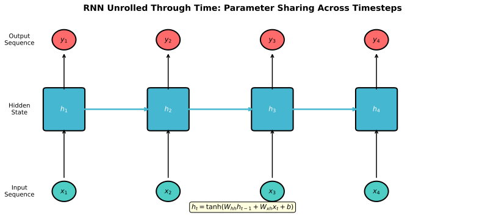
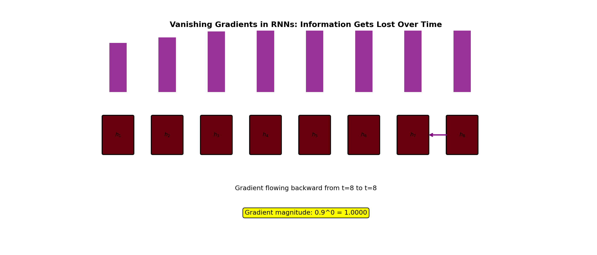
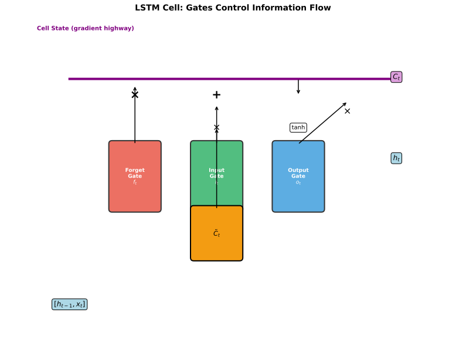
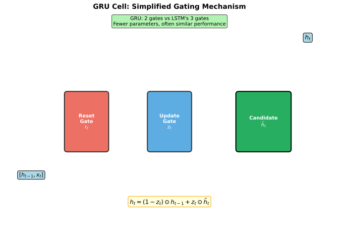

# RNNs, LSTM, and GRU

> **Processing sequences** — from vanilla RNNs to gated architectures

---

## The Sequential Data Problem

Many problems involve sequences: text, speech, time series, video. Standard neural networks fail because:

1. **Variable length**: Sentences have different numbers of words
2. **Order matters**: "dog bites man" ≠ "man bites dog"
3. **Long-range dependencies**: "The cat, which sat on the mat, was..."

### Why MLPs Fail

- Fixed input size (can't handle variable length)
- No parameter sharing across positions
- No notion of temporal order

---

## Vanilla RNN

RNNs maintain a **hidden state** that gets updated at each timestep, creating a "memory" of previous inputs.

### Architecture



At each timestep $t$:
$$h_t = \tanh(W_{hh} h_{t-1} + W_{xh} x_t + b_h)$$
$$y_t = W_{hy} h_t + b_y$$

Where:
- $x_t$ = input at time $t$
- $h_t$ = hidden state at time $t$
- $y_t$ = output at time $t$
- $W_{hh}, W_{xh}, W_{hy}$ = weight matrices (shared across time)

### Parameter Sharing

The same weights are used at every timestep — this is what enables handling variable-length sequences.

### Backpropagation Through Time (BPTT)

Unroll the RNN and apply standard backpropagation:

```
x₁ → x₂ → x₃ → ... → xₜ
↓     ↓     ↓           ↓
h₁ → h₂ → h₃ → ... → hₜ
↓     ↓     ↓           ↓
y₁    y₂    y₃         yₜ
```

Gradient flows backward through all timesteps.

---

## The Vanishing Gradient Problem in RNNs

RNNs struggle with long sequences because gradients vanish (or explode) over many timesteps.

### Why Gradients Vanish

The gradient from timestep $T$ to timestep $1$:

$$\frac{\partial L_T}{\partial h_1} = \frac{\partial L_T}{\partial h_T} \cdot \prod_{t=2}^{T} \frac{\partial h_t}{\partial h_{t-1}}$$

Each term $\frac{\partial h_t}{\partial h_{t-1}} = W_{hh}^T \cdot \text{diag}(\tanh'(z_t))$

- If largest eigenvalue of $W_{hh}$ < 1: gradients shrink exponentially
- If largest eigenvalue of $W_{hh}$ > 1: gradients explode



### Consequence

Early timesteps receive near-zero gradients — the RNN can't learn long-range dependencies. "The cat [100 words later] was hungry" — RNN forgets about "cat."

---

## LSTM: Long Short-Term Memory

LSTMs solve vanishing gradients with a **cell state** that acts as a highway for gradient flow, controlled by **gates**.

### Architecture



Three gates + cell state:
- **Forget gate** $f_t$: What to discard from cell state
- **Input gate** $i_t$: What new information to add
- **Output gate** $o_t$: What to expose to the next layer

### LSTM Equations

**Forget gate** (what to forget):
$$f_t = \sigma(W_f \cdot [h_{t-1}, x_t] + b_f)$$

**Input gate** (what to update):
$$i_t = \sigma(W_i \cdot [h_{t-1}, x_t] + b_i)$$

**Candidate values** (new information):
$$\tilde{C}_t = \tanh(W_C \cdot [h_{t-1}, x_t] + b_C)$$

**Cell state update**:
$$C_t = f_t \odot C_{t-1} + i_t \odot \tilde{C}_t$$

**Output gate** (what to expose):
$$o_t = \sigma(W_o \cdot [h_{t-1}, x_t] + b_o)$$

**Hidden state**:
$$h_t = o_t \odot \tanh(C_t)$$

### Why LSTM Solves Vanishing Gradients

The cell state update is **additive**:
$$C_t = f_t \odot C_{t-1} + i_t \odot \tilde{C}_t$$

Gradient through cell state:
$$\frac{\partial C_t}{\partial C_{t-1}} = f_t$$

If $f_t \approx 1$ (forget gate open), gradients flow unchanged through many timesteps — the cell state acts as a **gradient highway**.

---

## GRU: Gated Recurrent Unit

GRU simplifies LSTM with 2 gates instead of 3, and no separate cell state.

### Architecture



**Reset gate** (how much past to forget):
$$r_t = \sigma(W_r \cdot [h_{t-1}, x_t])$$

**Update gate** (how much to update):
$$z_t = \sigma(W_z \cdot [h_{t-1}, x_t])$$

**Candidate hidden state**:
$$\tilde{h}_t = \tanh(W \cdot [r_t \odot h_{t-1}, x_t])$$

**Final hidden state**:
$$h_t = (1 - z_t) \odot h_{t-1} + z_t \odot \tilde{h}_t$$

### LSTM vs GRU

| Aspect | LSTM | GRU |
|--------|------|-----|
| **Gates** | 3 (forget, input, output) | 2 (reset, update) |
| **States** | Cell state + hidden state | Hidden state only |
| **Parameters** | More (~4x hidden²) | Fewer (~3x hidden²) |
| **Performance** | Often better for complex sequences | Comparable, sometimes better |
| **Training speed** | Slower | Faster |

**Rule of thumb**: Start with GRU (faster), try LSTM if GRU underperforms.

---

## Bidirectional RNNs

Process sequence in both directions to capture future context:

```
Forward:   h₁ → h₂ → h₃ → ... → hₜ
Backward:  h₁ ← h₂ ← h₃ ← ... ← hₜ
Output:    [h₁→;h₁←] [h₂→;h₂←] ...
```

### When Bidirectional Helps

- **NLP**: Understanding "bank" requires future context ("river bank" vs "bank account")
- **Speech**: Pronunciation depends on following sounds
- **NOT for**: Real-time prediction (can't see future)

---

## RNNs vs Transformers

| Aspect | RNNs | Transformers |
|--------|------|--------------|
| **Processing** | Sequential (can't parallelize) | Parallel (all positions at once) |
| **Complexity** | O(T) sequential steps | O(T²) attention, but parallelizable |
| **Long-range** | Struggles despite gates | Direct attention to any position |
| **Memory** | O(1) hidden state size | O(T) keys/values |
| **Inductive bias** | Sequential, local | None (learns from data) |

### Where RNNs Still Matter

1. **Streaming/online**: Process tokens one at a time
2. **Edge devices**: Lower memory than storing all keys/values
3. **Very long sequences**: Linear complexity vs O(T²) attention
4. **Causal modeling**: Natural fit for sequential generation

**Reality**: Transformers have largely replaced RNNs for NLP, but RNNs remain relevant for specific use cases.

---

## Implementation Tips

### Gradient Clipping

Essential for RNN training:
```python
torch.nn.utils.clip_grad_norm_(model.parameters(), max_norm=1.0)
```

### Packed Sequences

Handle variable-length sequences efficiently:
```python
packed = nn.utils.rnn.pack_padded_sequence(x, lengths, batch_first=True)
output, hidden = rnn(packed)
output, _ = nn.utils.rnn.pad_packed_sequence(output, batch_first=True)
```

### Dropout for RNNs

Apply dropout to non-recurrent connections:
```python
nn.LSTM(input_size, hidden_size, dropout=0.2)  # between layers
```

---

## Interview Questions

### Q1: "Explain why LSTMs solve the vanishing gradient problem."

> **The cell state acts as a gradient highway.**
>
> In vanilla RNNs, gradients multiply through $W_{hh}$ at each timestep. If eigenvalues < 1, gradients vanish exponentially.
>
> In LSTMs, the cell state update is **additive**:
> $$C_t = f_t \odot C_{t-1} + i_t \odot \tilde{C}_t$$
>
> The gradient through cell state:
> $$\frac{\partial C_t}{\partial C_{t-1}} = f_t$$
>
> When $f_t \approx 1$ (forget gate open), gradients pass through unchanged. Over many timesteps:
> $$\frac{\partial C_T}{\partial C_1} = \prod_{t=2}^{T} f_t \approx 1$$
>
> **Key insight**: The forget gate learns which information to preserve, allowing gradients to flow to early timesteps. It's not that gradients can't vanish — but the network can *learn* to keep them flowing for important information.

### Q2: "What's the difference between LSTM and GRU?"

> **LSTM** has 3 gates and separate cell/hidden states:
> - Forget gate: What to discard from cell
> - Input gate: What new info to add
> - Output gate: What to expose as hidden state
> - Cell state: Long-term memory (gradient highway)
>
> **GRU** has 2 gates and only hidden state:
> - Reset gate: How much past to forget for candidate
> - Update gate: Interpolate between old and new state
> - No separate cell state
>
> **Practical differences**:
> - GRU has fewer parameters (3x vs 4x hidden²)
> - GRU trains faster
> - LSTM may capture more complex dependencies
> - Performance is often similar
>
> **When to choose**:
> - Start with GRU (simpler, faster)
> - Try LSTM if GRU underperforms
> - For very complex sequences, LSTM may be better

### Q3: "When would you still use RNNs over Transformers?"

> **Use RNNs when**:
>
> 1. **Online/streaming processing**: Need to process tokens one at a time as they arrive (real-time speech, live transcription). Transformers need all tokens to compute attention.
>
> 2. **Very long sequences**: Transformer attention is O(T²). For sequences of 100K+ tokens, RNNs with O(T) complexity may be more practical. (Though efficient transformers like Longformer exist.)
>
> 3. **Edge deployment**: RNN hidden state is fixed size. Transformers store O(T) keys/values, which grows with sequence length.
>
> 4. **Causal modeling**: RNNs have natural sequential inductive bias, which may help with limited data.
>
> **Reality**: Transformers dominate most NLP tasks. RNNs are still used in niche applications (streaming, embedded systems) and sometimes combined with transformers (transformer encoders + RNN decoders).

---

## Key Takeaways

1. **RNNs process sequences** with shared weights and hidden state memory.

2. **Vanilla RNNs suffer from vanishing gradients** — can't learn long-range dependencies.

3. **LSTM's cell state is a gradient highway** — forget gates control what gradients flow through.

4. **GRU is simpler than LSTM** (2 gates vs 3) with comparable performance.

5. **Bidirectional RNNs** capture both past and future context.

6. **Transformers have largely replaced RNNs** but RNNs remain relevant for streaming and edge applications.
