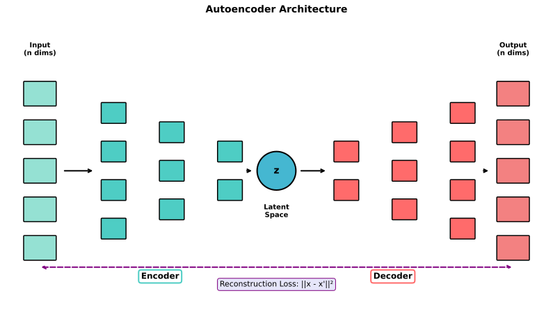
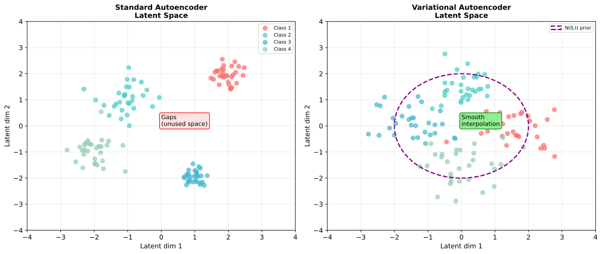
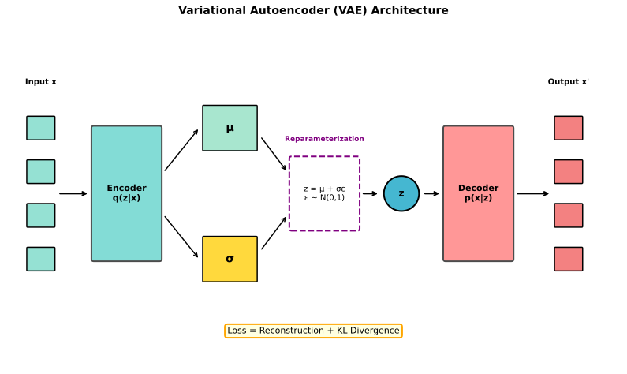
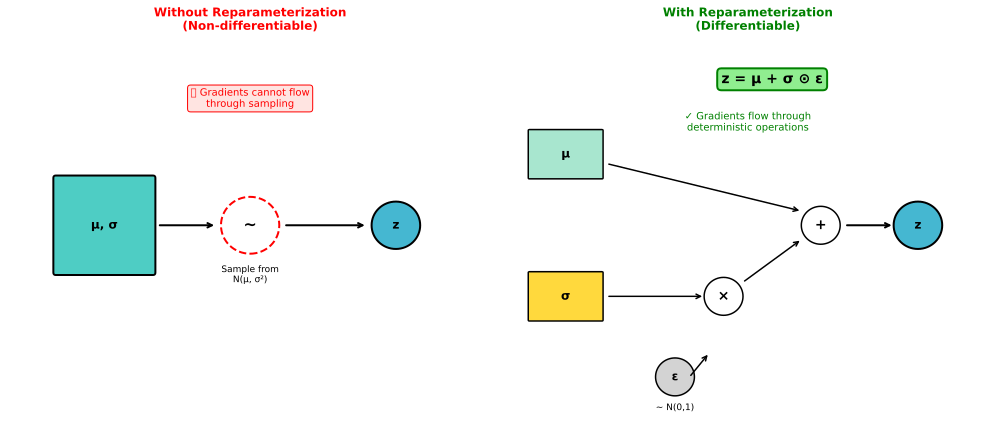
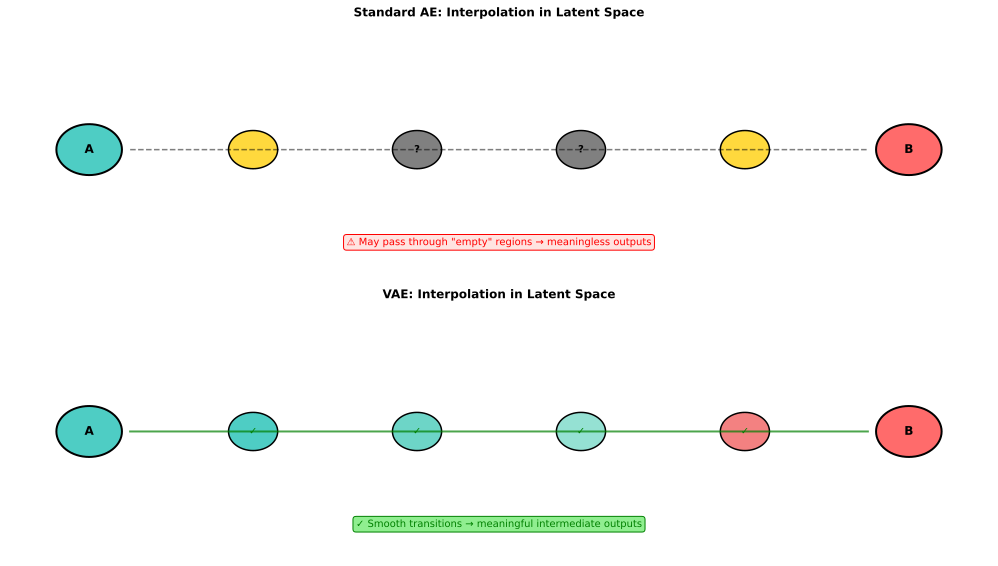

# Autoencoders & VAE

> **Learning compressed representations** — from dimensionality reduction to generative models

---

## Autoencoder Basics

An autoencoder learns to compress data into a lower-dimensional representation and reconstruct it.

### Architecture

```
Input → [Encoder] → Latent Code → [Decoder] → Reconstruction
  x         f(x)         z           g(z)          x̂
```



- **Encoder** $f$: Maps input to latent code $z = f(x)$
- **Latent/Bottleneck**: Low-dimensional representation
- **Decoder** $g$: Reconstructs from latent code $\hat{x} = g(z)$

### Loss Function

**Reconstruction loss**: Minimize difference between input and output

$$L = ||x - \hat{x}||^2 = ||x - g(f(x))||^2$$

For images, can also use perceptual loss or binary cross-entropy.

### Why the Bottleneck?

Without the bottleneck, the network could just learn the identity function. The bottleneck forces the network to learn a **compressed representation** — keeping only the most important features.

| Autoencoder Type | Bottleneck | Result |
|-----------------|------------|--------|
| **Undercomplete** | $\dim(z) < \dim(x)$ | Compression |
| **Overcomplete** | $\dim(z) > \dim(x)$ | Needs regularization |

---

## Autoencoder Applications

### Dimensionality Reduction

Like PCA but non-linear:
```python
encoder = train_autoencoder(data)
embeddings = encoder(data)  # Low-dimensional representations
```

**Advantage over PCA**: Can capture non-linear relationships.

### Denoising Autoencoders (DAE)

Train to reconstruct clean input from corrupted input:
```python
noisy_x = x + noise
loss = ||x - decoder(encoder(noisy_x))||²
```

Forces the network to learn robust features that ignore noise.

### Anomaly Detection

1. Train autoencoder on normal data
2. High reconstruction error = anomaly

```python
error = ||x - autoencoder(x)||²
if error > threshold:
    flag_as_anomaly(x)
```

---

## The Problem with Standard Autoencoders

Standard autoencoders have **unstructured latent spaces**:
- Gaps between encoded points
- No meaningful interpolation
- Can't sample new data points



**Key limitation**: Great for compression, poor for generation.

---

## Variational Autoencoders (VAE)

VAEs add **probabilistic structure** to the latent space, enabling generation of new samples.

### Key Idea

Instead of encoding to a point, encode to a **distribution**:
- Encoder outputs $\mu$ and $\sigma$ (mean and std of Gaussian)
- Sample $z$ from this distribution
- Decoder reconstructs from $z$

### Architecture



```
x → Encoder → (μ, σ) → Sample z ~ N(μ, σ²) → Decoder → x̂
```

### VAE Loss (ELBO)

$$L = \underbrace{-\mathbb{E}_{q(z|x)}[\log p(x|z)]}_{\text{Reconstruction}} + \underbrace{D_{KL}(q(z|x) || p(z))}_{\text{Regularization}}$$

**Reconstruction term**: How well does the decoder reconstruct?
**KL term**: How close is the encoded distribution to the prior (standard Gaussian)?

---

## The Reparameterization Trick

**Problem**: Sampling is not differentiable. We can't backprop through $z \sim \mathcal{N}(\mu, \sigma^2)$.

**Solution**: Reparameterize the sampling:
$$z = \mu + \sigma \cdot \epsilon, \quad \epsilon \sim \mathcal{N}(0, 1)$$



Now:
- $\epsilon$ is a random constant (not a function of parameters)
- $\mu$ and $\sigma$ are deterministic functions of the encoder
- Gradients flow through $\mu$ and $\sigma$

### Implementation

```python
def reparameterize(mu, log_var):
    std = torch.exp(0.5 * log_var)  # σ = exp(0.5 * log(σ²))
    eps = torch.randn_like(std)      # ε ~ N(0, 1)
    return mu + std * eps            # z = μ + σ * ε
```

---

## ELBO Derivation (Simplified)

We want to maximize $\log p(x)$ but can't compute it directly.

**Evidence Lower Bound (ELBO)**:
$$\log p(x) \geq \mathbb{E}_{q(z|x)}[\log p(x|z)] - D_{KL}(q(z|x) || p(z))$$

Where:
- $p(z)$ = prior (standard Gaussian)
- $q(z|x)$ = encoder (approximate posterior)
- $p(x|z)$ = decoder (likelihood)

**Maximizing ELBO**:
- Maximizes reconstruction quality ($\log p(x|z)$)
- Minimizes distance to prior ($D_{KL}$)

### KL Divergence for Gaussians

For $q(z|x) = \mathcal{N}(\mu, \sigma^2)$ and $p(z) = \mathcal{N}(0, 1)$:

$$D_{KL} = -\frac{1}{2}\sum_{j=1}^{d}(1 + \log\sigma_j^2 - \mu_j^2 - \sigma_j^2)$$

This has a closed-form solution — no sampling needed.

---

## VAE vs Standard Autoencoder

| Aspect | Standard AE | VAE |
|--------|-------------|-----|
| **Latent** | Point $z$ | Distribution $q(z|x)$ |
| **Structure** | Unstructured | Smooth, regularized |
| **Generation** | Poor | Sample from prior |
| **Interpolation** | Gaps, artifacts | Smooth transitions |
| **Loss** | Reconstruction only | Reconstruction + KL |



---

## VAE for Generation

### Sampling New Data

```python
# Sample from prior
z = torch.randn(batch_size, latent_dim)
# Decode to generate new data
x_generated = decoder(z)
```

### Latent Space Interpolation

```python
# Encode two images
z1 = encoder(x1)
z2 = encoder(x2)
# Interpolate in latent space
for alpha in [0, 0.25, 0.5, 0.75, 1.0]:
    z_interp = (1 - alpha) * z1 + alpha * z2
    x_interp = decoder(z_interp)
```

VAE's regularized latent space ensures smooth interpolation.

---

## Advanced VAE Topics

### Beta-VAE

Add weight to KL term for disentangled representations:
$$L = \text{Reconstruction} + \beta \cdot D_{KL}$$

Higher $\beta$ → more disentangled but potentially blurrier outputs.

### Conditional VAE (CVAE)

Condition on labels for controlled generation:
```
(x, y) → Encoder → z → Decoder(z, y) → x̂
```

### VQ-VAE

Vector-quantized VAE with discrete latent codes. Used in image generation (DALL-E 1) and audio (Jukebox).

---

## Interview Questions

### Q1: "Explain the reparameterization trick."

> **The problem**: In VAE, we sample $z \sim \mathcal{N}(\mu, \sigma^2)$ where $\mu$ and $\sigma$ come from the encoder. But sampling is **not differentiable** — we can't backprop through a random sample.
>
> **The solution**: Reparameterize the sampling:
> $$z = \mu + \sigma \cdot \epsilon, \quad \epsilon \sim \mathcal{N}(0, 1)$$
>
> Now:
> - $\epsilon$ is sampled from a fixed distribution (no parameters)
> - $z$ is a deterministic function of $\mu$, $\sigma$, and $\epsilon$
> - Gradients flow through $\mu$ and $\sigma$ to the encoder
>
> **Key insight**: We moved the randomness to a parameter-free variable $\epsilon$, making the path from encoder to loss differentiable.

### Q2: "What are the two terms in the VAE loss and what do they do?"

> **VAE loss (ELBO)**:
> $$L = -\mathbb{E}[\log p(x|z)] + D_{KL}(q(z|x) || p(z))$$
>
> **Reconstruction term** ($-\mathbb{E}[\log p(x|z)]$):
> - Measures how well the decoder reconstructs the input
> - Typically MSE for images, cross-entropy for binary data
> - Encourages accurate reconstruction
>
> **KL divergence term** ($D_{KL}$):
> - Measures how close the encoder's distribution is to the prior (standard Gaussian)
> - Regularizes the latent space
> - Encourages smooth, structured latent space
>
> **Trade-off**:
> - High reconstruction weight → sharp outputs but gaps in latent space
> - High KL weight → smooth latent space but blurry outputs
> - Beta-VAE uses $\beta \cdot D_{KL}$ to control this trade-off

### Q3: "When would you use an autoencoder vs VAE?"

> **Use standard autoencoder when**:
> - Only need compression/encoding (not generation)
> - Dimensionality reduction for downstream tasks
> - Feature extraction for other models
> - Anomaly detection (reconstruction error)
>
> **Use VAE when**:
> - Need to generate new samples
> - Want meaningful interpolation in latent space
> - Need a structured latent space for manipulation
> - Semi-supervised learning with latent structure
>
> **Key difference**: Standard AE may have gaps and discontinuities in latent space. VAE's regularization ensures you can sample anywhere in latent space and get realistic outputs.
>
> **Trade-off**: VAE outputs are often blurrier than AE because KL regularization spreads the latent space, reducing reconstruction sharpness.

---

## Key Takeaways

1. **Autoencoders learn compressed representations** through encoder-decoder architecture with reconstruction loss.

2. **VAEs encode to distributions** instead of points, enabling generation.

3. **Reparameterization trick** makes VAE training possible by moving randomness outside the gradient path.

4. **ELBO combines reconstruction and regularization** — balancing output quality and latent structure.

5. **VAE's regularized latent space** enables sampling new data and meaningful interpolation.

6. **Use AE for compression, VAE for generation** — choose based on whether you need to sample new data.
