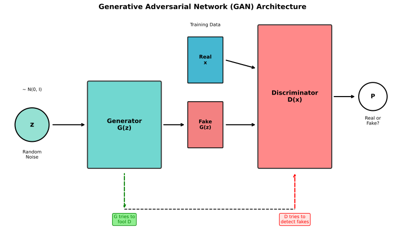
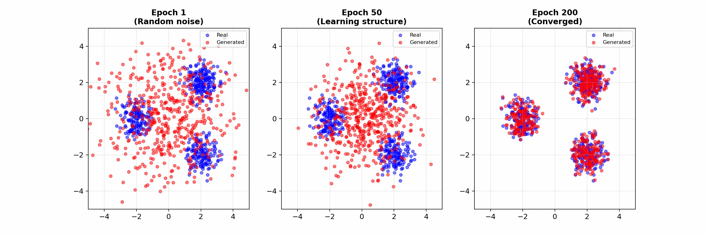
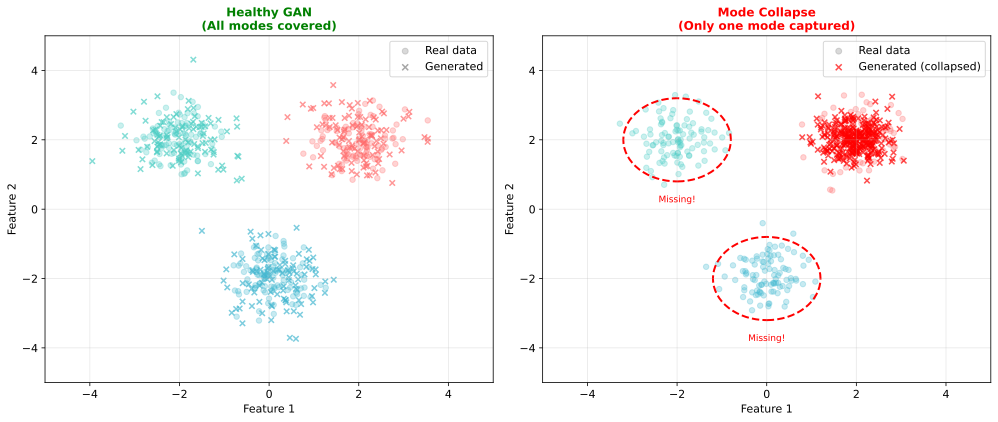
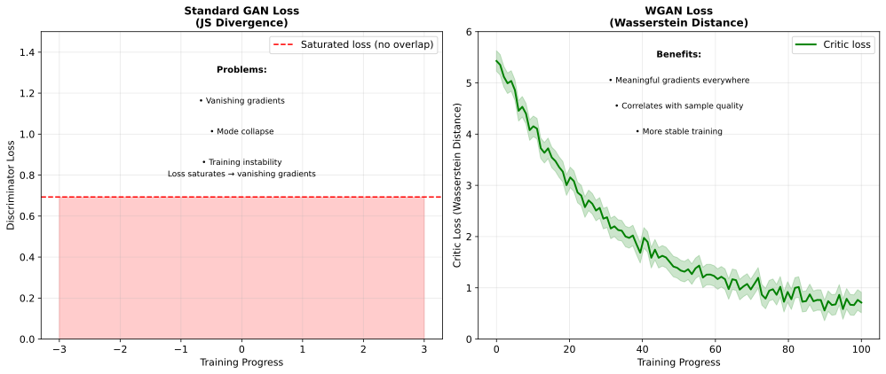

# Generative Adversarial Networks (GANs)

> **Learning through competition** — generator vs discriminator in a minimax game

---

## The GAN Framework

GANs train two networks that compete against each other:

- **Generator** $G$: Creates fake data from random noise
- **Discriminator** $D$: Distinguishes real data from fake

### The Minimax Game

$$\min_G \max_D V(D, G) = \mathbb{E}_{x \sim p_{data}}[\log D(x)] + \mathbb{E}_{z \sim p_z}[\log(1 - D(G(z)))]$$

- $D$ tries to **maximize**: Correctly classify real as real ($D(x) \rightarrow 1$) and fake as fake ($D(G(z)) \rightarrow 0$)
- $G$ tries to **minimize**: Fool $D$ into thinking fake is real ($D(G(z)) \rightarrow 1$)



### Training Flow

```
1. Sample real data x from dataset
2. Sample noise z from prior (e.g., Gaussian)
3. Generate fake data: x_fake = G(z)
4. Train D to distinguish x from x_fake
5. Train G to fool D (make D(G(z)) → 1)
6. Repeat
```

---

## Training Dynamics

### Alternating Optimization

```python
for epoch in range(epochs):
    # Train Discriminator
    real_loss = BCE(D(x_real), ones)
    fake_loss = BCE(D(G(z)), zeros)
    d_loss = real_loss + fake_loss
    d_loss.backward()
    optimizer_D.step()

    # Train Generator
    g_loss = BCE(D(G(z)), ones)  # Want D to think fake is real
    g_loss.backward()
    optimizer_G.step()
```

### Non-Saturating Generator Loss

The original $G$ loss $\log(1 - D(G(z)))$ has vanishing gradients when $D$ is strong.

**Fix**: Use $-\log(D(G(z)))$ instead:
- Same optimum
- Stronger gradients early in training



---

## Mode Collapse

The most notorious GAN problem: generator produces limited variety.

### What Happens

Instead of learning the full data distribution, the generator finds a few "safe" outputs that consistently fool the discriminator.



**Example**: Training on MNIST, generator only produces 3s and 7s, ignoring other digits.

### Why It Happens

- Discriminator gives similar feedback for all outputs
- Generator finds local optimum that works
- No incentive to explore other modes

### Solutions

| Method | How It Helps |
|--------|--------------|
| **WGAN** | Wasserstein distance provides better gradients |
| **Minibatch discrimination** | D sees batches, detects lack of diversity |
| **Unrolled GANs** | G anticipates D's future updates |
| **Feature matching** | G matches feature statistics, not just fools D |
| **Progressive growing** | Start small, gradually increase resolution |

---

## Training Instability

GANs are notoriously hard to train.

### Problems

1. **Vanishing gradients**: When D is too strong, G gets no useful gradient
2. **Oscillation**: D and G chase each other, never converging
3. **Sensitivity**: Hyperparameters matter enormously
4. **No good stopping criterion**: Hard to tell when training is "done"

### Practical Tips

| Tip | Rationale |
|-----|-----------|
| Use spectral normalization | Stabilizes D training |
| Train D more than G | Keep D slightly ahead |
| Use label smoothing | Prevent D from being overconfident |
| Add noise to D inputs | Regularization |
| Use progressive growing | Easier optimization |
| Monitor FID during training | Detect divergence |

---

## Wasserstein GAN (WGAN)

WGAN addresses training instability by changing the loss function.

### The Problem with JS Divergence

Original GAN minimizes Jensen-Shannon divergence. When distributions don't overlap:
- JS divergence saturates
- Gradients vanish
- G can't improve

### Wasserstein Distance (Earth Mover's Distance)

$$W(P_r, P_g) = \inf_{\gamma \in \Pi(P_r, P_g)} \mathbb{E}_{(x,y) \sim \gamma}[||x - y||]$$

Intuitively: minimum "work" to transform one distribution into another.

**Key property**: Provides meaningful gradients even when distributions don't overlap.

### WGAN Training

Replace discriminator with **critic** (no sigmoid, outputs real number):

$$L = \mathbb{E}_{x \sim p_{data}}[D(x)] - \mathbb{E}_{z \sim p_z}[D(G(z))]$$

Critic must be **1-Lipschitz** (bounded gradient). Enforced by:
- **Weight clipping** (original WGAN): Clip weights to [-c, c]
- **Gradient penalty** (WGAN-GP): $\lambda \mathbb{E}[(||\nabla_x D(x)||_2 - 1)^2]$

### Why WGAN Works



| Aspect | Vanilla GAN | WGAN |
|--------|-------------|------|
| Loss metric | JS divergence | Wasserstein distance |
| Gradient behavior | Can vanish | Always meaningful |
| Training stability | Sensitive | More stable |
| Mode collapse | Common | Reduced |

---

## GAN Variants

### DCGAN (Deep Convolutional GAN)

Architecture guidelines for stable training:
- Use strided convolutions (no pooling)
- Use BatchNorm in G and D
- Use ReLU in G, LeakyReLU in D
- No fully connected layers (except G input, D output)

### StyleGAN

A landmark GAN architecture for high-quality face generation:
- Mapping network transforms noise
- Style injection at each layer
- Progressive growing
- Explicit control over styles

### Conditional GAN (cGAN)

Generate specific classes by conditioning on labels:
```python
G(z, class_label) → image of that class
D(x, class_label) → real/fake for that class
```

### Pix2Pix / CycleGAN

Image-to-image translation:
- **Pix2Pix**: Paired training data (sketch → photo)
- **CycleGAN**: Unpaired data (horse → zebra)

---

## Evaluation Metrics

Evaluating GANs is notoriously difficult.

### Inception Score (IS)

$$IS = \exp(\mathbb{E}_x[D_{KL}(p(y|x) || p(y))])$$

- Higher is better
- Measures quality (confident classifications) and diversity
- **Limitation**: Doesn't compare to real data distribution

### Frechet Inception Distance (FID)

$$FID = ||\mu_r - \mu_g||^2 + \text{Tr}(\Sigma_r + \Sigma_g - 2(\Sigma_r \Sigma_g)^{1/2})$$

- Lower is better
- Compares feature distributions of real vs generated
- More reliable than IS
- **Most commonly reported metric**

### Human Evaluation

For specific applications, nothing beats human judgment:
- A/B testing: Which looks more real?
- Task-specific metrics (e.g., face landmark accuracy)

---

## Interview Questions

### Q1: "Explain mode collapse and how to address it."

> **Mode collapse**: The generator produces limited variety, ignoring some modes (clusters) of the real data distribution.
>
> **Example**: Training on MNIST, generator only outputs certain digits, not all 10.
>
> **Why it happens**:
> - Generator finds outputs that consistently fool discriminator
> - No explicit diversity objective
> - Local optimum that's hard to escape
>
> **Solutions**:
> 1. **WGAN with gradient penalty**: Wasserstein loss provides better gradients, less prone to collapse
> 2. **Minibatch discrimination**: Discriminator sees batches, can detect lack of diversity
> 3. **Feature matching**: Generator matches feature statistics, not just discriminator output
> 4. **Unrolled GANs**: Generator anticipates discriminator's future updates
> 5. **Multiple generators**: Each generates different modes
>
> **Detection**: Monitor sample diversity during training, use FID which captures mode coverage.

### Q2: "Why is WGAN more stable than vanilla GAN?"

> **Vanilla GAN** uses JS divergence, which has problems:
> - When real and generated distributions don't overlap, JS divergence is constant (maxed out)
> - Gradients vanish, generator can't improve
> - This happens early in training when G is bad
>
> **WGAN** uses Wasserstein distance (Earth Mover's Distance):
> $$W(P_r, P_g) = \inf_{\gamma} \mathbb{E}_{(x,y) \sim \gamma}[||x - y||]$$
>
> **Key properties**:
> - Continuous and differentiable almost everywhere
> - Provides meaningful gradients even when distributions don't overlap
> - Correlates with sample quality (can monitor during training)
>
> **Implementation**:
> - Replace sigmoid discriminator with linear critic
> - Enforce 1-Lipschitz constraint via gradient penalty
>
> **Result**: More stable training, reduced mode collapse, better correlation between loss and quality.

### Q3: "How do you evaluate GAN quality?"

> **FID (Frechet Inception Distance)** — most common:
> - Extract features from real and generated images using pretrained network
> - Compute mean and covariance of feature distributions
> - FID measures distance between these Gaussians
> - **Lower is better**, typically in range 1-100+
> - Good because it compares to real data distribution
>
> **Inception Score (IS)**:
> - Measures classification confidence and diversity
> - **Higher is better**
> - Limitation: Doesn't compare to real data
>
> **Human evaluation**:
> - Gold standard for perceptual quality
> - A/B tests, preference studies
> - Expensive and slow
>
> **Task-specific metrics**:
> - Face generation: Landmark accuracy, identity preservation
> - Super-resolution: PSNR, SSIM
>
> **What to report**: FID is standard. Also report sample images for qualitative assessment.

---

## Key Takeaways

1. **GANs are a minimax game** — generator creates fakes, discriminator detects them.

2. **Mode collapse is the main failure mode** — generator produces limited variety.

3. **WGAN stabilizes training** by using Wasserstein distance with gradient penalty.

4. **FID is the standard metric** — lower is better, measures distribution similarity.

5. **Training is sensitive** — requires careful hyperparameter tuning, architecture choices.

6. **Many variants exist** for different tasks: StyleGAN for faces, Pix2Pix for image translation, conditional GANs for controlled generation.
