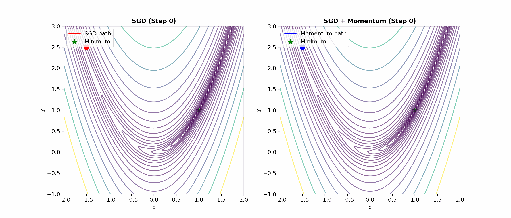
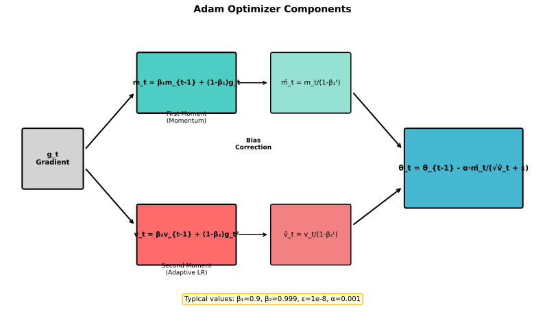
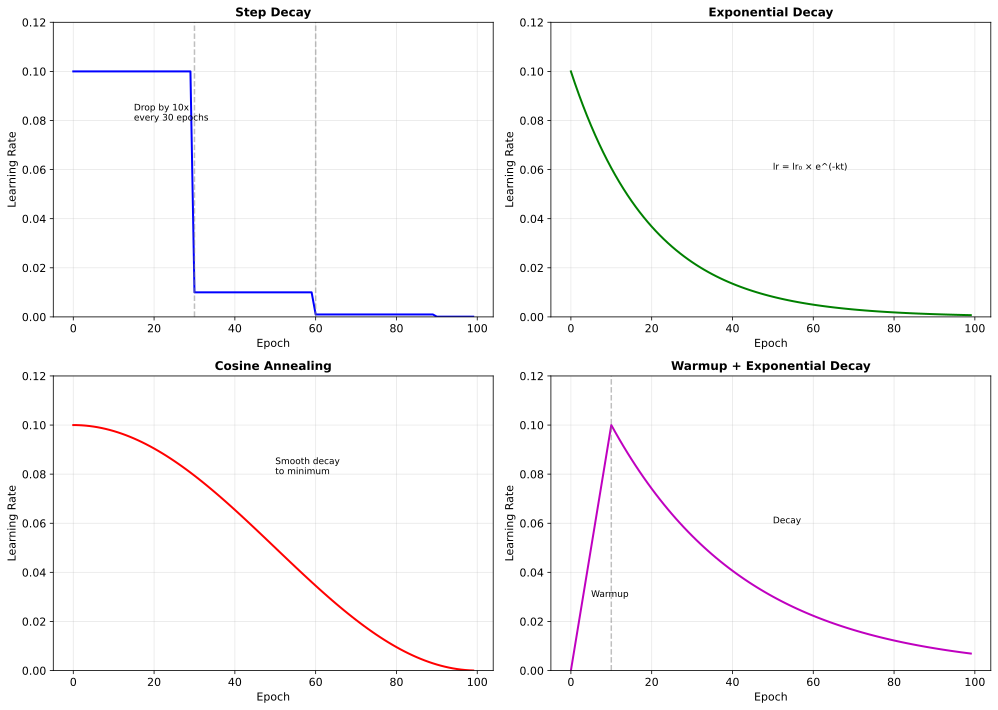
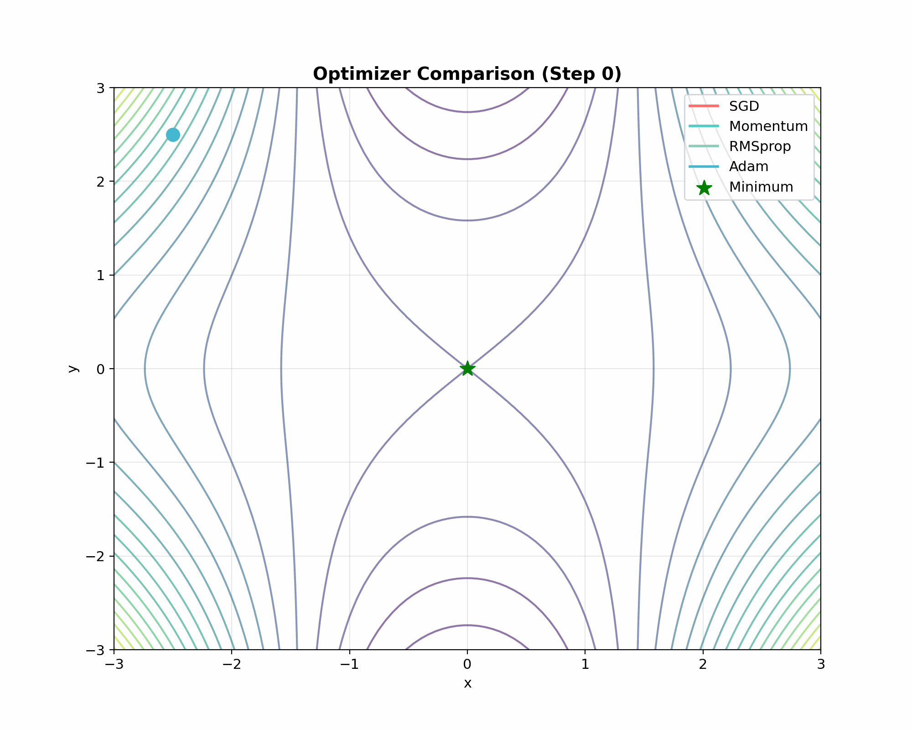

# Optimizers

> **The engine of learning** — from SGD to Adam and beyond

---

## Gradient Descent Fundamentals

All neural network training is based on gradient descent: move parameters in the direction that decreases the loss.

$$\theta^{new} = \theta^{old} - \alpha \nabla_\theta L$$

### Batch vs Stochastic vs Mini-batch

| Type | Gradient Computed On | Trade-offs |
|------|---------------------|------------|
| **Batch GD** | Entire dataset | Accurate but slow, no escape from local minima |
| **Stochastic GD** | Single sample | Fast, noisy, helps escape local minima |
| **Mini-batch GD** | Batch of samples | Best of both worlds, parallelizable |

**Mini-batch is standard** — typically 32, 64, 128, or 256 samples.

---

## Momentum

Momentum accelerates gradient descent by accumulating velocity in consistent directions.

### Intuition

Imagine a ball rolling down a hill:
- Accelerates in consistent downhill direction
- Dampens oscillations in other directions

### Algorithm

$$v_t = \beta v_{t-1} + \nabla_\theta L$$
$$\theta = \theta - \alpha v_t$$

Typical $\beta = 0.9$ (90% of previous velocity retained).



### Benefits

- **Faster convergence** in consistent gradient directions
- **Dampens oscillations** in high-curvature directions
- **Helps escape shallow local minima** (momentum carries through)

---

## Adaptive Learning Rates

Different parameters may need different learning rates. Adaptive methods adjust per-parameter.

### Adagrad

Adapts learning rate based on historical gradients:

$$G_t = G_{t-1} + g_t^2$$
$$\theta = \theta - \frac{\alpha}{\sqrt{G_t} + \epsilon} g_t$$

**Problem**: Learning rate only decreases — eventually too small.

### RMSprop

Fixes Adagrad with exponential moving average:

$$v_t = \beta v_{t-1} + (1-\beta) g_t^2$$
$$\theta = \theta - \frac{\alpha}{\sqrt{v_t} + \epsilon} g_t$$

Typical $\beta = 0.99$.

---

## Adam (Adaptive Moment Estimation)

Adam combines momentum (first moment) with RMSprop (second moment).

### Algorithm

**First moment (mean) estimate**:
$$m_t = \beta_1 m_{t-1} + (1 - \beta_1) g_t$$

**Second moment (variance) estimate**:
$$v_t = \beta_2 v_{t-1} + (1 - \beta_2) g_t^2$$

**Bias correction** (important early in training):
$$\hat{m}_t = \frac{m_t}{1 - \beta_1^t}$$
$$\hat{v}_t = \frac{v_t}{1 - \beta_2^t}$$

**Update**:
$$\theta = \theta - \alpha \frac{\hat{m}_t}{\sqrt{\hat{v}_t} + \epsilon}$$

### Default Hyperparameters

| Parameter | Default | Role |
|-----------|---------|------|
| $\alpha$ | 0.001 | Learning rate |
| $\beta_1$ | 0.9 | First moment decay |
| $\beta_2$ | 0.999 | Second moment decay |
| $\epsilon$ | 1e-8 | Numerical stability |

### Why Bias Correction?

At $t=1$: $m_1 = 0.1 \cdot g_1$ (severely underestimated if $\beta_1 = 0.9$)

Bias correction: $\hat{m}_1 = \frac{0.1 \cdot g_1}{1 - 0.9} = g_1$ (correct scale)



---

## AdamW (Decoupled Weight Decay)

AdamW fixes a subtle bug in how Adam implements L2 regularization.

### The Problem

L2 regularization adds $\lambda ||\theta||^2$ to loss. In vanilla Adam, this becomes:
$$g_t = \nabla L + \lambda \theta$$

But Adam's adaptive scaling interferes with the regularization!

### The Solution

**Decouple weight decay** from the gradient:
$$\theta = \theta - \alpha \frac{\hat{m}_t}{\sqrt{\hat{v}_t} + \epsilon} - \alpha \lambda \theta$$

Weight decay is applied directly, not through gradients.

### When to Use

- **AdamW for transformers** — standard in BERT, GPT, etc.
- **Adam for most other cases** — simpler, usually works fine
- **If using weight decay with Adam**, prefer AdamW

---

## Learning Rate Schedules

The optimal learning rate often changes during training.

### Step Decay

Reduce LR by factor at specific epochs:
```python
lr = initial_lr * (0.1 ** (epoch // 30))  # Decay by 10x every 30 epochs
```

### Exponential Decay

$$\alpha_t = \alpha_0 \cdot e^{-kt}$$

### Cosine Annealing

$$\alpha_t = \alpha_{min} + \frac{1}{2}(\alpha_{max} - \alpha_{min})(1 + \cos(\frac{t}{T}\pi))$$

Smooth decay from max to min over T steps.



### Warmup

Start with very low LR, gradually increase:
```python
if step < warmup_steps:
    lr = initial_lr * (step / warmup_steps)
else:
    lr = schedule(step - warmup_steps)
```

**Why warmup?**
- At initialization, gradients may be unstable
- High LR early can cause divergence
- Warmup lets model find stable region before large steps
- **Essential for large batch training and transformers**

### OneCycleLR

Learning rate increases then decreases over training:
- Start low (warmup)
- Peak in middle
- Decay to very low at end

Often achieves better results in fewer epochs.

---

## Optimizer Comparison

| Optimizer | Pros | Cons | Best For |
|-----------|------|------|----------|
| **SGD** | Simple, generalizes well | Slow, sensitive to LR | Vision with LR schedule |
| **SGD + Momentum** | Faster than SGD | Still needs tuning | ImageNet training |
| **Adam** | Fast, adaptive, works out of box | May generalize worse | Default, prototyping |
| **AdamW** | Proper weight decay | Slightly more complex | Transformers |
| **RAdam** | Robust early training | Less common | When Adam diverges early |

### Decision Guide

```
Transformers?
  └─ AdamW with warmup + cosine decay

CNNs for final training?
  └─ SGD + momentum + step/cosine decay

Quick prototyping?
  └─ Adam with default settings

Training unstable?
  └─ Add warmup, reduce LR, try RAdam
```



---

## Practical Recommendations

### Learning Rate Selection

1. **Start with defaults**: Adam 1e-3, SGD 0.1
2. **LR finder**: Train for short time with increasing LR, find where loss starts exploding
3. **Grid search**: Try [1e-2, 1e-3, 1e-4] and pick best

### Batch Size Considerations

- **Larger batch** → can use larger LR (linear scaling rule)
- **Larger batch** → may generalize worse (sharper minima)
- **Gradient accumulation** simulates large batches with small memory

### Common Issues

| Issue | Likely Cause | Solution |
|-------|--------------|----------|
| Loss = NaN | LR too high | Reduce LR, add gradient clipping |
| Loss plateaus | LR too low or stuck | Increase LR or use scheduler |
| Loss oscillates | LR too high | Reduce LR |
| Training diverges | No warmup | Add warmup period |

---

## Interview Questions

### Q1: "Explain how Adam works."

> **Adam combines two ideas**:
>
> **First moment (momentum)**:
> $$m_t = \beta_1 m_{t-1} + (1 - \beta_1) g_t$$
> Exponential moving average of gradients — accelerates in consistent directions.
>
> **Second moment (adaptive LR)**:
> $$v_t = \beta_2 v_{t-1} + (1 - \beta_2) g_t^2$$
> Exponential moving average of squared gradients — scales LR by gradient magnitude.
>
> **Bias correction**:
> $$\hat{m}_t = m_t / (1 - \beta_1^t), \quad \hat{v}_t = v_t / (1 - \beta_2^t)$$
> Corrects initialization bias (moments start at 0).
>
> **Update**:
> $$\theta = \theta - \alpha \frac{\hat{m}_t}{\sqrt{\hat{v}_t} + \epsilon}$$
>
> **Result**: Each parameter gets adapted learning rate based on its gradient history. Parameters with large, consistent gradients get smaller effective LR; parameters with small gradients get larger effective LR.

### Q2: "When would you use SGD over Adam?"

> **SGD with momentum often generalizes better** for computer vision:
>
> - ImageNet: Best results typically with SGD + momentum + LR schedule
> - Adam can find sharper minima, which may generalize worse
> - SGD's implicit regularization through noise may help
>
> **When to use SGD**:
> - Final training when you want best generalization
> - Large-scale vision models (ResNet, EfficientNet on ImageNet)
> - When you have time to tune LR schedule
>
> **When to use Adam**:
> - Prototyping (works out of box)
> - Transformers/NLP (AdamW is standard)
> - GANs (more stable than SGD)
> - When SGD training is unstable
>
> **Practical approach**: Start with Adam for fast iteration, try SGD for final training if needed.

### Q3: "Why is learning rate warmup important?"

> **At initialization, gradients are unreliable**:
> - Based on random weights
> - May point in wrong directions
> - Large steps can cause divergence
>
> **Warmup addresses this**:
> - Start with very low LR (e.g., 0.1x final LR)
> - Gradually increase over warmup period (e.g., 1000 steps)
> - Allows model to find stable region before taking large steps
>
> **When warmup is critical**:
> - **Large batch training**: Gradients have lower variance, can "overshoot" more easily
> - **Transformers**: Deep models with many attention layers are sensitive to early training
> - **Adam's bias correction issues**: Even with correction, early updates can be unstable
>
> **Typical warmup**:
> - Linear increase over first 5-10% of training
> - Or fixed number of steps (1000-10000)

---

## Key Takeaways

1. **Momentum accelerates convergence** by accumulating velocity in consistent directions.

2. **Adam adapts learning rates per-parameter** using first and second moment estimates.

3. **AdamW decouples weight decay** — use it for transformers.

4. **Learning rate schedules** (warmup + decay) are crucial for good results.

5. **SGD may generalize better** than Adam for vision; Adam is standard for transformers.

6. **Warmup prevents early divergence** in large batch training and deep models.
