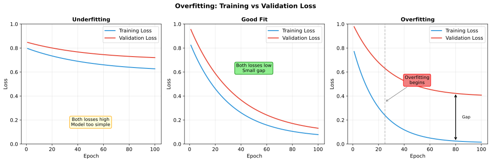
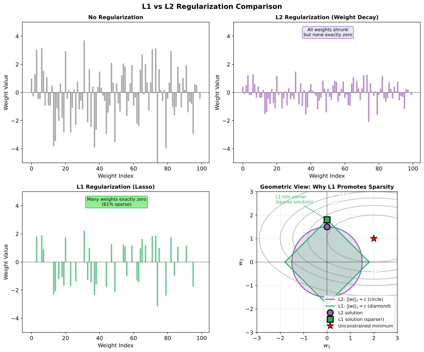
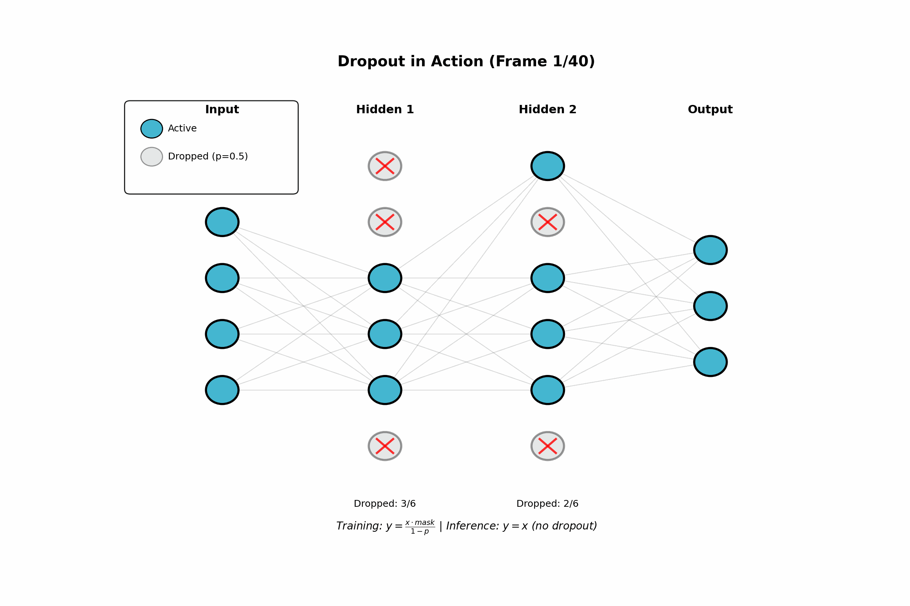
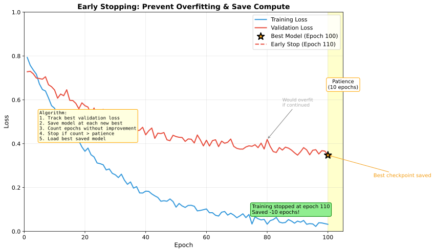

# Regularization

> **Fighting overfitting** — techniques to improve generalization

---

## Why Regularization?

Neural networks have millions of parameters — enough to memorize training data perfectly. Regularization prevents overfitting by adding constraints that encourage simpler models.

### The Overfitting Problem



| Sign | Indication |
|------|------------|
| Training loss ↓, Validation loss ↑ | Overfitting |
| Training loss high | Underfitting |
| Both losses low and close | Good fit |

### Bias-Variance Perspective

Regularization trades **bias** (underfitting) for reduced **variance** (overfitting). The goal is to find the sweet spot.

---

## L2 Regularization (Weight Decay)

Add squared magnitude of weights to the loss:

$$L_{total} = L_{data} + \lambda \sum_i w_i^2$$

### Effect on Optimization

Gradient becomes: $\nabla L = \nabla L_{data} + 2\lambda w$

Update: $w = w - \alpha(\nabla L_{data} + 2\lambda w) = (1 - 2\alpha\lambda)w - \alpha \nabla L_{data}$

The $(1 - 2\alpha\lambda)$ factor shrinks weights toward zero each step — hence "weight decay."

### Why It Works

- **Smaller weights** → smoother function → less overfitting
- **Bayesian view**: L2 regularization is equivalent to a Gaussian prior on weights
- **Prevents any single weight from dominating**

### Typical Values

- $\lambda = 1e-4$ to $1e-2$
- Start with $1e-4$, increase if overfitting persists

---

## L1 Regularization

Add absolute magnitude of weights:

$$L_{total} = L_{data} + \lambda \sum_i |w_i|$$

### L1 vs L2



| Aspect | L1 | L2 |
|--------|-----|-----|
| **Effect** | Pushes weights to exactly zero | Shrinks all weights |
| **Sparsity** | Yes (feature selection) | No |
| **Prior** | Laplace | Gaussian |
| **Gradient** | Constant magnitude | Proportional to weight |

### When to Use L1

- When you want **sparse solutions** (many zero weights)
- **Feature selection**: L1 automatically selects important features
- Often combined with L2 (**Elastic Net**): $\lambda_1 ||w||_1 + \lambda_2 ||w||_2^2$

---

## Dropout

Randomly zero out neurons during training.

### Algorithm

```python
def dropout(x, p=0.5, training=True):
    if not training:
        return x
    mask = (torch.rand_like(x) > p).float()
    return x * mask / (1 - p)  # Scale to maintain expected value
```

### Training vs Inference

| Phase | Behavior |
|-------|----------|
| **Training** | Randomly drop neurons with probability $p$ |
| **Inference** | Use all neurons (no dropout) |

The scaling by $1/(1-p)$ during training ensures expected output is unchanged at inference (called **inverted dropout**).



### Why Dropout Works

1. **Prevents co-adaptation**: Neurons can't rely on specific other neurons
2. **Ensemble effect**: Each dropout mask creates a different subnetwork
3. **Implicit regularization**: Similar to training an ensemble of models

### Typical Dropout Rates

| Layer Type | Dropout Rate |
|------------|--------------|
| After fully connected | 0.5 |
| After conv layers | 0.1-0.25 |
| In transformers (attention) | 0.1 |
| Input layer | 0.2 (if used) |

---

## Early Stopping

Stop training when validation loss stops improving.

### Algorithm

```python
best_val_loss = float('inf')
patience_counter = 0
patience = 10  # Number of epochs to wait

for epoch in range(max_epochs):
    train_loss = train_one_epoch()
    val_loss = validate()

    if val_loss < best_val_loss:
        best_val_loss = val_loss
        save_checkpoint()
        patience_counter = 0
    else:
        patience_counter += 1

    if patience_counter >= patience:
        break  # Early stop

# Load best checkpoint for final model
load_checkpoint()
```



### Considerations

- **Patience**: How many epochs to wait (typically 5-20)
- **What to monitor**: Usually validation loss, sometimes validation metric
- **Save best model**: Always save checkpoint at best validation performance

---

## Data Augmentation

Artificially increase training data by applying transformations.

### Image Augmentation

| Transform | Effect |
|-----------|--------|
| **Random crop** | Translation invariance |
| **Horizontal flip** | Mirror invariance |
| **Color jitter** | Lighting robustness |
| **Rotation** | Rotation invariance |
| **Cutout/RandomErasing** | Occlusion robustness |

### Advanced Techniques

**Mixup**: Interpolate between training examples
$$\tilde{x} = \lambda x_i + (1-\lambda) x_j$$
$$\tilde{y} = \lambda y_i + (1-\lambda) y_j$$

**CutMix**: Cut and paste patches between images

**AutoAugment**: Learned augmentation policies

### Text Augmentation

- **Back-translation**: Translate to another language and back
- **Synonym replacement**: Replace words with synonyms
- **Random insertion/deletion**: Add or remove words

---

## Other Techniques

### Label Smoothing

Instead of hard targets [0, 0, 1, 0], use soft targets [0.025, 0.025, 0.925, 0.025]:

$$y_{smooth} = (1 - \epsilon) \cdot y_{onehot} + \frac{\epsilon}{K}$$

**Why it helps**: Prevents model from being overconfident, improves calibration.

### Batch Normalization as Regularization

BatchNorm adds noise through batch statistics, acting as implicit regularization:
- Each sample's normalization depends on other samples in batch
- Different batches produce different normalizations

### Stochastic Depth

Randomly skip entire layers during training (like dropout for layers):
- Used in deep residual networks
- Reduces training time
- Regularization effect

---

## Combining Regularizers

### Typical Combinations

| Model Type | Regularization Stack |
|------------|---------------------|
| **CNN** | BatchNorm + Dropout (0.5 on FC) + Weight Decay + Data Augmentation |
| **Transformer** | LayerNorm + Dropout (0.1) + Weight Decay |
| **MLP** | Dropout (0.5) + Weight Decay |

### Diminishing Returns

Adding more regularization has diminishing returns. If model still overfits:
1. Get more data (best solution)
2. Reduce model capacity
3. Use stronger augmentation

### Tuning Strategy

1. Start with standard defaults (BatchNorm, small weight decay)
2. Monitor train/val gap
3. If overfitting: add dropout, increase weight decay
4. If underfitting: reduce regularization, increase capacity

---

## Interview Questions

### Q1: "Explain the difference between L1 and L2 regularization."

> **L2 regularization** ($\lambda \sum w^2$):
> - Gradient: $2\lambda w$ (proportional to weight)
> - Effect: Shrinks all weights toward zero, but rarely exactly zero
> - Result: Many small weights
> - Prior: Gaussian (prefers weights near zero)
>
> **L1 regularization** ($\lambda \sum |w|$):
> - Gradient: $\lambda \cdot \text{sign}(w)$ (constant magnitude)
> - Effect: Pushes weights exactly to zero
> - Result: Sparse weights (many exactly zero)
> - Prior: Laplace (sharp peak at zero)
>
> **When to use**:
> - L2: Default choice, when all features are relevant
> - L1: Feature selection, when you want sparse models
> - Elastic Net (L1 + L2): When you want some sparsity with stability

### Q2: "How does dropout prevent overfitting?"

> **Three perspectives**:
>
> 1. **Prevents co-adaptation**: Neurons can't rely on specific other neurons being present. Each neuron must learn robust features independently.
>
> 2. **Ensemble effect**: Each dropout mask creates a different subnetwork. Training with dropout is like training an ensemble of $2^n$ networks (where n = number of neurons). At inference, using all neurons approximates averaging the ensemble.
>
> 3. **Noise injection**: Dropout adds noise to hidden representations, similar to data augmentation but in feature space. This prevents the model from fitting noise in the training data.
>
> **Implementation detail**: Scale activations by $1/(1-p)$ during training so that expected values match inference (inverted dropout).
>
> **Typical rates**: 0.5 for fully connected, 0.1-0.25 for conv layers.

### Q3: "How do you choose regularization strength?"

> **Use validation performance as the guide**:
>
> 1. **Start with defaults**:
>    - Weight decay: 1e-4
>    - Dropout: 0.5 (FC), 0.1 (attention)
>
> 2. **Monitor train/val gap**:
>    - Large gap → increase regularization
>    - Both losses high → decrease regularization
>
> 3. **Grid search or random search**:
>    - Weight decay: [1e-5, 1e-4, 1e-3, 1e-2]
>    - Dropout: [0.1, 0.3, 0.5]
>
> 4. **Early stopping is almost always good**:
>    - Low cost, significant benefit
>    - Use patience of 5-20 epochs
>
> 5. **Data augmentation before other regularization**:
>    - More effective than weight penalties
>    - No cost at inference time
>
> **Red flag**: If you need very strong regularization, consider whether the model is too large for your data.

---

## Key Takeaways

1. **L2 (weight decay) shrinks weights** — default regularization for most cases.

2. **L1 creates sparse solutions** — use for feature selection.

3. **Dropout prevents co-adaptation** — essential for fully connected layers.

4. **Early stopping is free regularization** — always use validation-based stopping.

5. **Data augmentation is powerful** — often more effective than weight penalties.

6. **Combine techniques** but watch for diminishing returns — more data beats more regularization.
