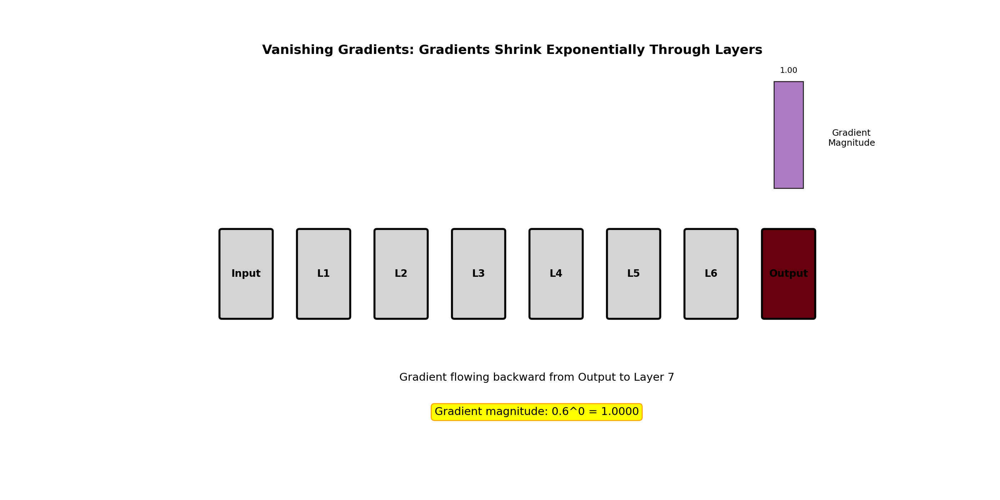
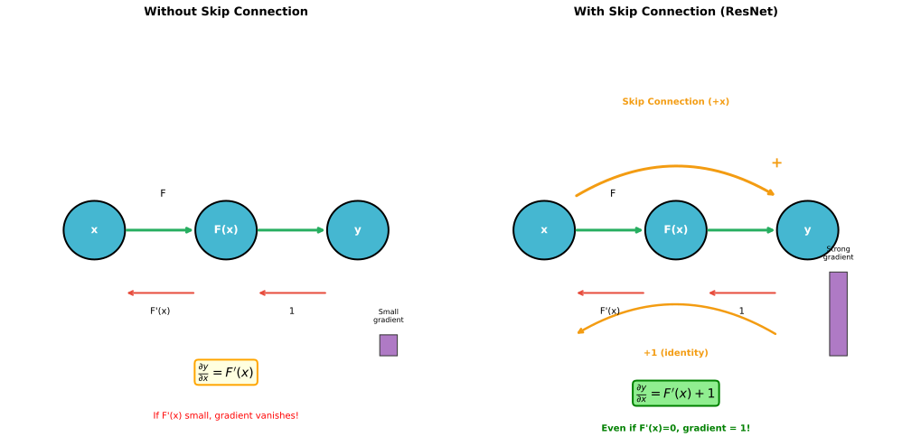

# Gradient Problems

> **Training challenges** — vanishing, exploding gradients and their solutions

---

## The Fundamental Problem

Deep networks face a fundamental training challenge: gradients must flow through many layers, and they can either **vanish** (become too small) or **explode** (become too large).

### Why It Matters

- **Vanishing gradients**: Early layers receive near-zero gradients → no learning
- **Exploding gradients**: Huge weight updates → training diverges, NaN losses

Both prevent successful training of deep networks.

---

## Vanishing Gradients

### What Happens

Gradients shrink exponentially as they propagate backward:

$$\frac{\partial L}{\partial W^{[1]}} = \frac{\partial L}{\partial a^{[L]}} \cdot \prod_{l=2}^{L} \frac{\partial a^{[l]}}{\partial a^{[l-1]}}$$

If each term $|\frac{\partial a^{[l]}}{\partial a^{[l-1]}}| < 1$, the product shrinks exponentially.



### Causes

**1. Saturating Activations (Sigmoid, Tanh)**

Sigmoid derivative: $\sigma'(x) = \sigma(x)(1 - \sigma(x)) \leq 0.25$

At saturation (large $|x|$): $\sigma'(x) \approx 0$

Multiple layers: $0.25^L \rightarrow 0$ rapidly

**2. Poor Initialization**

If weights are too small:
- Activations shrink through layers
- Pre-activations enter saturation region
- Derivatives become tiny

**3. Deep Networks**

More layers = more multiplicative factors < 1 = faster decay

### Symptoms

| Symptom | Indication |
|---------|------------|
| Early layers don't update | Near-zero gradients |
| Slow training | Only later layers learning |
| Training plateaus | Model stuck at suboptimal |

---

## Exploding Gradients

### What Happens

Gradients grow exponentially:

If each term $|\frac{\partial a^{[l]}}{\partial a^{[l-1]}}| > 1$, the product explodes.

### Causes

**1. Poor Initialization**

Weights too large → activations grow through layers → gradients multiply to huge values.

**2. Recurrent Networks**

RNNs multiply through time steps. Even small > 1 factors compound over 100+ steps.

**3. Unstable Architectures**

Networks without normalization or skip connections are prone to explosion.

### Symptoms

| Symptom | Indication |
|---------|------------|
| Loss = NaN | Numerical overflow |
| Loss spikes | Unstable updates |
| Weights become very large | Explosion in progress |
| Model output is NaN | Completely diverged |

---

## Mathematical Analysis

### The Jacobian Perspective

For a layer $a^{[l]} = g(W^{[l]} a^{[l-1]})$:

$$\frac{\partial a^{[l]}}{\partial a^{[l-1]}} = \text{diag}(g'(z^{[l]})) \cdot W^{[l]}$$

The Jacobian's eigenvalues determine gradient flow:
- All eigenvalues < 1: vanishing
- Any eigenvalue > 1: potential exploding

### For L Layers

Gradient w.r.t. first layer weights:

$$||\frac{\partial L}{\partial W^{[1]}}|| \propto \prod_{l=2}^{L} ||J^{[l]}||$$

If average $||J|| = 0.9$: after 50 layers, $0.9^{50} \approx 0.005$
If average $||J|| = 1.1$: after 50 layers, $1.1^{50} \approx 117$

---

## Detection

### Gradient Monitoring

```python
def check_gradients(model):
    for name, param in model.named_parameters():
        if param.grad is not None:
            grad_norm = param.grad.norm().item()
            print(f"{name}: grad_norm = {grad_norm:.6f}")

            if grad_norm < 1e-7:
                print(f"  WARNING: Vanishing gradient!")
            elif grad_norm > 1e3:
                print(f"  WARNING: Exploding gradient!")
```

### Activation Monitoring

```python
def check_activations(model, x):
    activations = {}
    def hook(name):
        def fn(module, input, output):
            activations[name] = output.detach()
        return fn

    # Register hooks
    for name, module in model.named_modules():
        module.register_forward_hook(hook(name))

    model(x)

    for name, act in activations.items():
        print(f"{name}: mean={act.mean():.4f}, std={act.std():.4f}")
```

### Warning Signs

| Check | Healthy | Vanishing | Exploding |
|-------|---------|-----------|-----------|
| Gradient norm | 1e-3 to 1e1 | < 1e-7 | > 1e3 or NaN |
| Activation std | ~1 | → 0 through layers | → ∞ through layers |
| Loss curve | Decreasing | Flat | NaN or spikes |

---

## Solutions for Vanishing Gradients

### 1. ReLU Activation

ReLU derivative is 1 for positive inputs — no shrinkage.

$$\text{ReLU}'(x) = \begin{cases} 1 & x > 0 \\ 0 & x \leq 0 \end{cases}$$

**Caveat**: Dying ReLU (use Leaky ReLU if this occurs)

### 2. Residual Connections (Skip Connections)

$$y = F(x) + x$$

Gradient:
$$\frac{\partial y}{\partial x} = F'(x) + 1$$

Even if $F'(x) \approx 0$, the +1 ensures gradient flows:



**Key insight**: Skip connections change multiplication to addition in gradient flow.

### 3. Proper Initialization

| Activation | Initialization | Variance |
|------------|----------------|----------|
| Sigmoid/Tanh | Xavier | $2/(n_{in} + n_{out})$ |
| ReLU | He | $2/n_{in}$ |

Maintains variance through layers, preventing shrinkage.

### 4. Batch/Layer Normalization

Normalization keeps activations in a good range:
- Prevents saturation (keeps pre-activations centered)
- Maintains gradient magnitude through layers
- Acts as a "reset" for statistics at each layer

### 5. Highway Networks / Dense Connections

**Highway**: Learnable gates control skip connections
**DenseNet**: Connect each layer to all previous layers

Both provide multiple paths for gradient flow.

---

## Solutions for Exploding Gradients

### 1. Gradient Clipping

Bound gradient magnitude:

**Clip by value**:
```python
torch.nn.utils.clip_grad_value_(parameters, clip_value)
```

**Clip by norm** (preferred):
```python
torch.nn.utils.clip_grad_norm_(parameters, max_norm=1.0)
```

Clips the global gradient norm while preserving direction.

### 2. Lower Learning Rate

Smaller updates = less amplification of instability.

```python
# If training is unstable, try reducing LR
optimizer = Adam(params, lr=1e-4)  # instead of 1e-3
```

### 3. Proper Initialization

He/Xavier initialization prevents initial explosion.

### 4. Batch Normalization

Normalizes activations, preventing them from growing unboundedly.

---

## RNNs: A Special Case

RNNs are particularly prone to gradient problems due to unrolling over many time steps.

### Why RNNs Are Worse

For T time steps:
$$\frac{\partial h_T}{\partial h_1} = \prod_{t=2}^{T} \frac{\partial h_t}{\partial h_{t-1}}$$

With T = 100+, even factors slightly different from 1 cause extreme values.

### Solutions for RNNs

1. **LSTM/GRU**: Gating mechanisms control gradient flow
2. **Gradient clipping**: Essential for RNN training (typically max_norm=1.0)
3. **Truncated BPTT**: Limit backprop to recent time steps
4. **Use transformers**: Attention provides direct paths regardless of distance

---

## Interview Questions

### Q1: "How do skip connections help with vanishing gradients?"

> **Skip connections add the input directly to the output**:
> $$y = F(x) + x$$
>
> **Gradient analysis**:
> $$\frac{\partial y}{\partial x} = \frac{\partial F(x)}{\partial x} + 1$$
>
> Even if $\frac{\partial F(x)}{\partial x} \approx 0$ (vanishing), the **+1 term ensures gradient flows**.
>
> **For a deep network with skip connections**:
> - Gradient is a **sum** over paths, not a product
> - Some paths go through identity connections (gradient = 1)
> - Early layers always receive some gradient signal
>
> **Why this matters**:
> - Without skips: $\frac{\partial L}{\partial x_1} = \prod_{l=1}^{L} J_l$ — vanishes if any $J_l$ is small
> - With skips: Gradient can flow directly through identity path
>
> **This is why ResNet can train 152 layers** while plain networks fail beyond ~20.

### Q2: "How would you diagnose gradient issues in a network?"

> **Step 1: Monitor gradient norms per layer**
> ```python
> for name, param in model.named_parameters():
>     print(f"{name}: grad_norm={param.grad.norm()}")
> ```
> - Very small (< 1e-7): vanishing
> - Very large (> 1e3) or NaN: exploding
>
> **Step 2: Check activation distributions**
> - Plot histograms of activations at each layer
> - All near 0: vanishing activations (and gradients)
> - All near -1/1 (for tanh): saturated, vanishing gradients
>
> **Step 3: Monitor training curves**
> - Loss doesn't decrease: possible vanishing
> - Loss = NaN or spikes: exploding
>
> **Step 4: Layer-wise analysis**
> - Compare gradient norms between early and late layers
> - Large ratio (early << late): vanishing
> - Early layers not updating: vanishing
>
> **Solutions based on diagnosis**:
> - Vanishing: ReLU, skip connections, normalization, He init
> - Exploding: gradient clipping, lower LR, normalization

### Q3: "Why is gradient clipping important for RNNs?"

> **RNNs unroll through many time steps**, creating very deep computation graphs. Gradients multiply at each step:
>
> $$\frac{\partial L}{\partial h_1} = \prod_{t=2}^{T} W_{hh}^T \cdot \text{diag}(\tanh'(z_t))$$
>
> **For T=100 steps**:
> - If average factor = 0.9: $0.9^{100} \approx 0$ (vanishing)
> - If average factor = 1.1: $1.1^{100} \approx 10^{4}$ (exploding)
>
> **Gradient clipping bounds the explosion**:
> ```python
> clip_grad_norm_(parameters, max_norm=1.0)
> ```
>
> - Scales gradients to have max norm of 1.0
> - Preserves gradient direction
> - Prevents catastrophic weight updates
> - Allows stable training despite occasional gradient spikes
>
> **Why essential for RNNs**:
> - Single unstable example can cause gradient explosion
> - Without clipping: one bad batch destroys learned weights
> - LSTM/GRU help with vanishing but clipping still needed for stability

---

## Key Takeaways

1. **Vanishing gradients**: Gradients shrink exponentially → early layers don't learn. Caused by saturating activations and deep networks.

2. **Exploding gradients**: Gradients grow exponentially → NaN losses. Caused by poor initialization and unstable training.

3. **ReLU replaces saturating activations** — gradient is 1 for positive inputs.

4. **Skip connections provide gradient highways** — +1 term ensures gradient flow.

5. **Gradient clipping is essential for RNNs** — prevents single bad examples from destroying training.

6. **Monitor gradients during training** — early detection prevents wasted compute.
