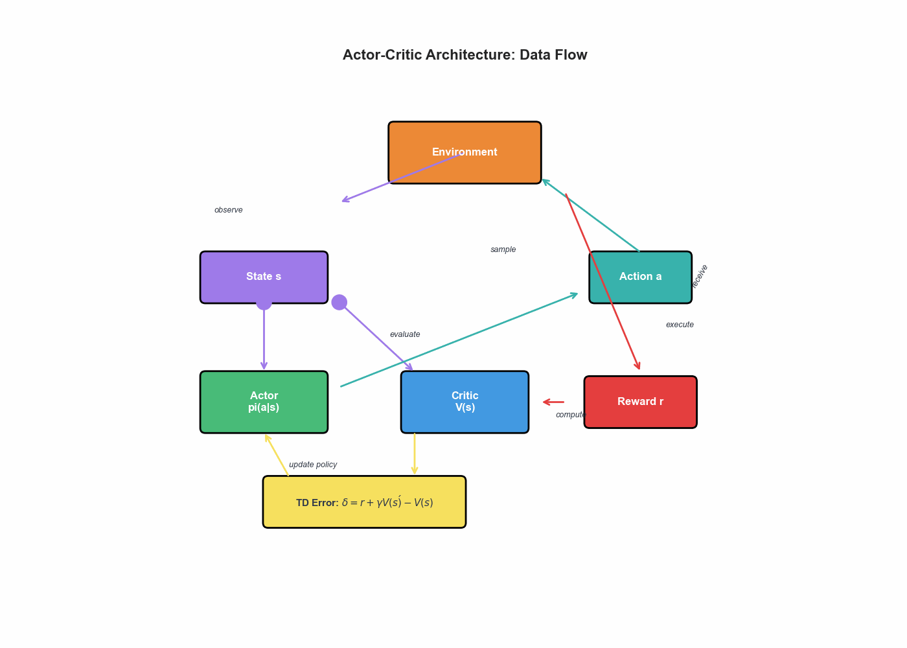
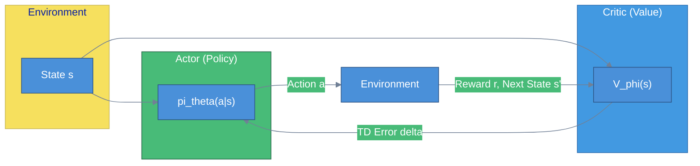
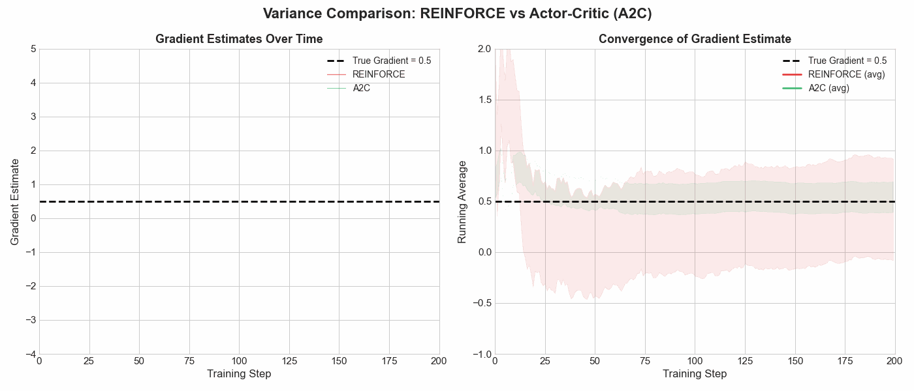
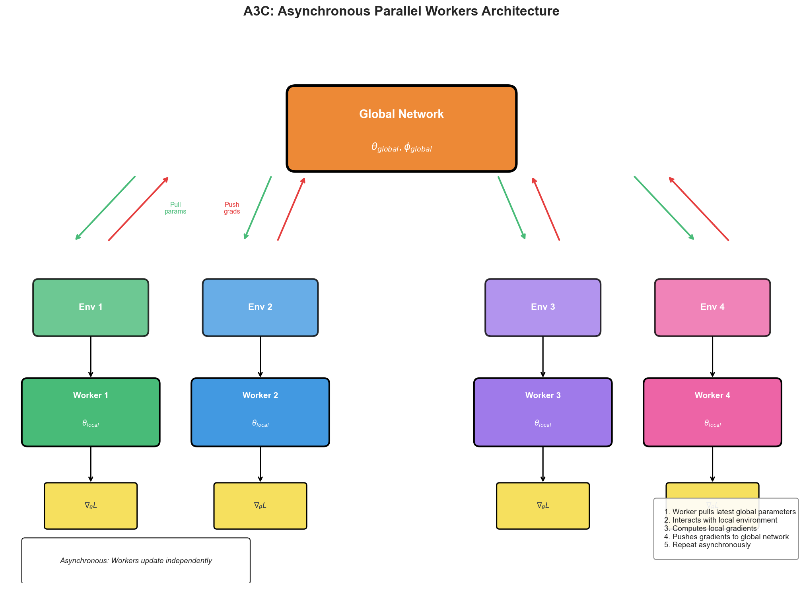
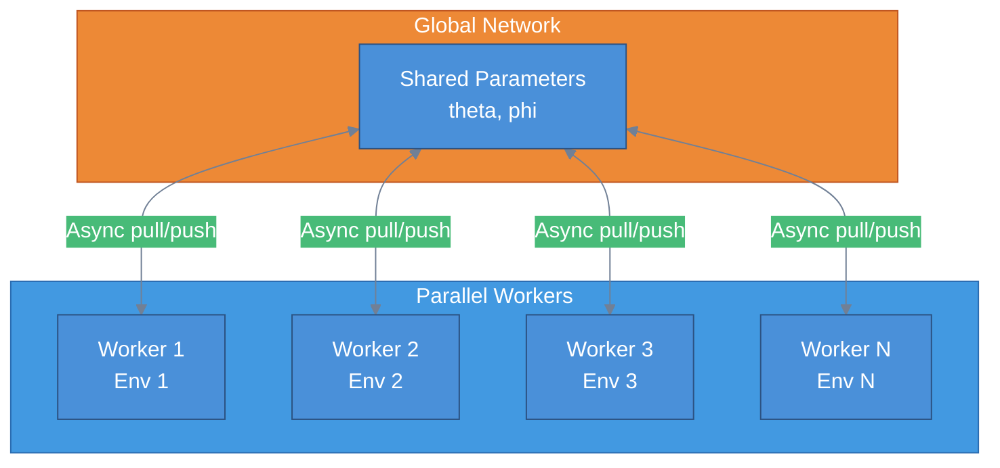

# Actor-Critic Methods

> **Best of both worlds** — combining policy gradients with value function estimation

---

## The Motivation: Why Combine Approaches?

Reinforcement learning has two fundamental paradigms for learning optimal behavior:

**Value-Based Methods** (e.g., Q-learning, DQN):
- Learn a value function $Q(s, a)$ or $V(s)$
- Derive policy implicitly: $\pi(s) = \arg\max_a Q(s, a)$
- Low variance but biased estimates
- Struggle with continuous action spaces

**Policy Gradient Methods** (e.g., REINFORCE):
- Learn a parameterized policy $\pi_\theta(a|s)$ directly
- Use Monte Carlo returns for gradient estimation
- High variance but unbiased
- Handle continuous actions naturally

Actor-Critic methods elegantly combine both approaches, using a **value function to reduce variance** while maintaining the flexibility of policy gradients.



---

## The Actor-Critic Framework

### Two Networks, One Goal

The architecture consists of two components trained simultaneously:

| Component | Role | Output | Objective |
|-----------|------|--------|-----------|
| **Actor** | Policy network | $\pi_\theta(a\|s)$ | Maximize expected return |
| **Critic** | Value network | $V_\phi(s)$ or $Q_\phi(s,a)$ | Minimize TD error |

The actor decides **what action to take**, while the critic evaluates **how good that action was**. The critic's feedback guides the actor's learning, reducing the variance inherent in pure policy gradient methods.



### The Learning Loop

At each timestep $t$:

1. **Actor** samples action $a_t \sim \pi_\theta(\cdot|s_t)$
2. Environment returns reward $r_t$ and next state $s_{t+1}$
3. **Critic** computes TD error: $\delta_t = r_t + \gamma V_\phi(s_{t+1}) - V_\phi(s_t)$
4. Update **Critic**: minimize $\delta_t^2$
5. Update **Actor**: use $\delta_t$ as advantage estimate

---

## TD Error as Advantage Estimate

### From Returns to Advantages

In vanilla REINFORCE, the policy gradient is:

$$\nabla_\theta J(\theta) = \mathbb{E}\left[\sum_t \nabla_\theta \log \pi_\theta(a_t|s_t) \cdot G_t\right]$$

where $G_t = \sum_{k=0}^{\infty} \gamma^k r_{t+k}$ is the Monte Carlo return. This has high variance because $G_t$ depends on the entire future trajectory.

**Key insight**: We can subtract a baseline $b(s_t)$ without introducing bias:

$$\nabla_\theta J(\theta) = \mathbb{E}\left[\sum_t \nabla_\theta \log \pi_\theta(a_t|s_t) \cdot (G_t - b(s_t))\right]$$

The optimal baseline is the value function $V(s_t)$, giving us the **advantage**:

$$A(s_t, a_t) = G_t - V(s_t)$$

The advantage tells us: "How much better was this action compared to the average action from this state?"

### One-Step TD Error Approximation

Computing the full return $G_t$ still requires waiting for episode completion. The **TD error** provides a one-step approximation:

$$\delta_t = r_t + \gamma V(s_{t+1}) - V(s_t)$$

This is an unbiased estimate of the advantage under certain conditions:

$$\mathbb{E}[\delta_t | s_t, a_t] = \mathbb{E}[r_t + \gamma V(s_{t+1}) | s_t, a_t] - V(s_t) = Q(s_t, a_t) - V(s_t) = A(s_t, a_t)$$

The TD error enables **online learning** without waiting for episode termination.

---

## Why Actor-Critic Reduces Variance

### The Variance Problem in REINFORCE

Consider the REINFORCE gradient with return $G_t$:

Writing $X = \nabla_\theta \log \pi$ and $Y = G_t$, the variance of the product depends on the spread of *both* factors. For independent $X$ and $Y$ the exact decomposition is:

$$\text{Var}[X Y] = \text{Var}[X]\,\text{Var}[Y] + \text{Var}[X]\,(\mathbb{E}[Y])^2 + (\mathbb{E}[X])^2\,\text{Var}[Y]$$

In practice the score function $X$ and the return $Y$ are *not* independent, so this is only illustrative — but it makes the key point clear: variance grows with both the magnitude of the return $G_t$ and the spread of the score-function term.

The variance of $G_t$ is large because it accumulates randomness from:
- Stochastic policy sampling
- Environment transitions
- Rewards across many timesteps

### How the Critic Helps

By subtracting the value baseline:

$$\text{Var}[\delta_t] = \text{Var}[r_t + \gamma V(s_{t+1}) - V(s_t)]$$

This has much lower variance because:
1. **Single-step**: Only one reward and transition, not entire trajectory
2. **Centering**: Subtracting $V(s_t)$ centers the signal around zero
3. **Bootstrapping**: $V(s_{t+1})$ provides a stable target



---

## Advantage Actor-Critic (A2C)

### Synchronous Training

A2C is the synchronous variant of A3C (described below). It runs multiple environments in parallel, collects experiences, and performs a single synchronized update.

**Algorithm**:
```
Initialize actor parameters theta, critic parameters phi
for each iteration:
    Collect trajectories from N parallel environments for T steps
    Compute advantages: A_t = sum_{k=0}^{n-1} gamma^k r_{t+k} + gamma^n V(s_{t+n}) - V(s_t)

    Actor loss: L_actor = -mean(log pi_theta(a|s) * A)
    Critic loss: L_critic = mean((V_phi(s) - V_target)^2)
    Entropy bonus: H = -mean(sum pi log pi)

    Total loss: L = L_actor + c1 * L_critic - c2 * H
    Update theta, phi using gradient descent
```

### n-Step Returns

Rather than using single-step TD, A2C typically uses **n-step returns** for lower bias:

$$G_t^{(n)} = r_t + \gamma r_{t+1} + \cdots + \gamma^{n-1} r_{t+n-1} + \gamma^n V(s_{t+n})$$

The n-step advantage becomes:

$$A_t^{(n)} = G_t^{(n)} - V(s_t)$$

| n | Bias | Variance | Use Case |
|---|------|----------|----------|
| 1 | High | Low | Fast updates, stable environments |
| 5 | Medium | Medium | General purpose (common default) |
| $\infty$ | Zero | High | Monte Carlo (episodic tasks) |

### Entropy Regularization

To encourage exploration, A2C adds an entropy bonus to the loss:

$$H(\pi_\theta) = -\sum_a \pi_\theta(a|s) \log \pi_\theta(a|s)$$

This prevents the policy from becoming too deterministic too early, promoting exploration of the action space.

---

## Asynchronous Advantage Actor-Critic (A3C)

### Parallel Workers Architecture

A3C runs multiple worker threads asynchronously, each interacting with its own environment instance. Workers compute gradients locally and update a shared global network.





### Why Asynchronous?

1. **Decorrelated updates**: Different workers experience different states, reducing correlation in gradient updates
2. **Efficient CPU utilization**: No GPU required; workers run on CPU cores
3. **Implicit exploration**: Asynchronous updates create natural variation in policies
4. **No replay buffer**: Online learning without the memory overhead of experience replay

### A3C vs A2C Trade-offs

| Aspect | A3C (Asynchronous) | A2C (Synchronous) |
|--------|-------------------|-------------------|
| Updates | Asynchronous, may conflict | Batched, consistent |
| Hardware | CPU-efficient | GPU-friendly |
| Stability | Can be unstable | More stable |
| Implementation | Complex threading | Simpler batching |
| Modern preference | Less common | Preferred |

In practice, **A2C is now preferred** because modern hardware (GPUs, TPUs) benefits more from batched synchronous updates, and the stability improvements outweigh the theoretical benefits of asynchrony.

---

## Architecture Considerations

### Shared vs Separate Networks

**Shared Architecture** (common for simple tasks):
```
State s --> [Shared Layers] --> Actor Head (policy)
                            --> Critic Head (value)
```

**Separate Architecture** (better for complex tasks):
```
State s --> [Actor Network] --> Policy
State s --> [Critic Network] --> Value
```

Shared architectures have fewer parameters and can transfer learned representations, but may suffer from interference between policy and value learning.

### Network Design Guidelines

| Consideration | Recommendation |
|---------------|----------------|
| Activation | ReLU or Tanh for hidden layers |
| Output (Actor) | Softmax for discrete, Gaussian parameters for continuous |
| Output (Critic) | Linear (unbounded value) |
| Initialization | Orthogonal init, smaller weights for output layers |
| Learning rate | Often different for actor (lower) vs critic (higher) |

### Handling Continuous Actions

For continuous action spaces, the actor outputs parameters of a Gaussian distribution:

$$\pi_\theta(a|s) = \mathcal{N}(\mu_\theta(s), \sigma_\theta(s)^2)$$

The network outputs $\mu$ and $\log \sigma$ (log for numerical stability), and actions are sampled via the reparameterization trick:

$$a = \mu_\theta(s) + \sigma_\theta(s) \cdot \epsilon, \quad \epsilon \sim \mathcal{N}(0, 1)$$

---

## Quick Reference

```
+------------------------------------------------------------------+
|                    ACTOR-CRITIC CHEAT SHEET                       |
+------------------------------------------------------------------+

CORE COMPONENTS:
  Actor:  pi_theta(a|s)    - Policy network, selects actions
  Critic: V_phi(s)         - Value network, evaluates states

TD ERROR (Advantage Estimate):
  delta_t = r_t + gamma * V(s_{t+1}) - V(s_t)

POLICY GRADIENT WITH BASELINE:
  grad_theta J = E[grad log pi_theta(a|s) * A(s,a)]

A2C LOSS FUNCTION:
  L = L_actor + c1 * L_critic - c2 * H(pi)
  where:
    L_actor  = -E[log pi * A]          (maximize advantage)
    L_critic = E[(V - V_target)^2]     (minimize TD error)
    H(pi)    = -E[sum pi log pi]       (entropy bonus)

N-STEP RETURNS:
  G_t^(n) = r_t + gamma*r_{t+1} + ... + gamma^{n-1}*r_{t+n-1} + gamma^n*V(s_{t+n})
  A_t^(n) = G_t^(n) - V(s_t)

VARIANCE REDUCTION:
  REINFORCE: Uses G_t (full return) -> High variance
  Actor-Critic: Uses delta_t (TD error) -> Lower variance

KEY HYPERPARAMETERS:
  gamma:       Discount factor (0.99 typical)
  n-steps:     Bootstrapping horizon (5 typical)
  c1:          Critic loss coefficient (0.5 typical)
  c2:          Entropy coefficient (0.01 typical)
  lr_actor:    Actor learning rate (often 1e-4)
  lr_critic:   Critic learning rate (often 1e-3)

+------------------------------------------------------------------+
```

---

## Interview Questions

### Question 1: Why does actor-critic have lower variance than REINFORCE?

**Sample Answer:**

REINFORCE uses the full Monte Carlo return $G_t = \sum_{k=0}^{\infty} \gamma^k r_{t+k}$ as the learning signal. This accumulates variance from every future timestep, including stochastic transitions and rewards across the entire trajectory.

Actor-Critic replaces this with the TD error $\delta_t = r_t + \gamma V(s_{t+1}) - V(s_t)$, which reduces variance in three ways:

1. **Single-step signal**: Only one transition contributes randomness, not the entire future trajectory

2. **Baseline subtraction**: By subtracting $V(s_t)$, we center the signal around zero. When the advantage is near zero (action was average), the gradient update is small, reducing noisy updates

3. **Bootstrapping from learned value**: The critic provides a learned estimate $V(s_{t+1})$ that summarizes expected future returns, replacing the noisy sampled return with a smoother function

The trade-off is introducing bias since $V(s)$ is an approximation, but the variance reduction typically accelerates learning significantly.

---

### Question 2: Explain the difference between A2C and A3C. Which would you choose for a project?

**Sample Answer:**

**A3C (Asynchronous Advantage Actor-Critic)**:
- Multiple workers run independently, each with its own environment
- Workers asynchronously pull global parameters, compute gradients locally, and push updates
- Updates can conflict (stale gradients) but decorrelation improves exploration
- Originally designed for CPU training

**A2C (Advantage Actor-Critic)**:
- Workers run in parallel but synchronize before updating
- Collects a batch of experiences, computes gradients together, applies one update
- More stable gradients, no staleness issues
- Better suited for GPU acceleration

**Which to choose:**

For most modern projects, I would choose **A2C** because:
1. Modern ML infrastructure favors batched GPU computation
2. The stability improvements outweigh theoretical async benefits
3. Simpler implementation without threading complexities
4. Empirically similar or better performance

I would consider A3C only if:
- Limited to CPU-only training
- Working with environments that are CPU-bound and benefit from parallel CPU workers
- Specifically researching asynchronous methods

---

### Question 3: How would you debug an actor-critic agent that fails to learn?

**Sample Answer:**

I would systematically investigate these areas:

**1. Reward Signal**
- Verify rewards are being received and have reasonable magnitude
- Check if reward is too sparse; consider reward shaping
- Normalize rewards if they vary widely across episodes

**2. Value Function Quality**
- Plot critic loss over time; it should decrease
- Check if value estimates are in the right range
- If critic is poor, actor receives noisy signals

**3. Learning Rate Balance**
- Critic often needs higher learning rate than actor
- If critic learns too slowly, it provides poor baselines
- If actor learns too fast, it may exploit incorrect value estimates

**4. Entropy and Exploration**
- Monitor entropy of policy; if it collapses to near-zero too early, increase entropy coefficient
- Check if actions are diverse early in training

**5. Network Architecture**
- Ensure outputs are properly bounded (softmax for discrete, tanh for bounded continuous)
- Try orthogonal initialization
- Check for dead ReLU neurons

**6. Advantage Computation**
- Verify n-step returns are computed correctly
- Check discount factor is applied properly
- Ensure advantages are normalized within batches

**7. Baseline Debugging**
- Temporarily remove the critic and use REINFORCE to verify the environment is learnable
- If REINFORCE works but actor-critic fails, the issue is likely in the critic or advantage computation

---

## Key Takeaways

1. **Actor-Critic combines policy and value methods**, using the critic's value estimates to reduce variance in policy gradient updates while maintaining the flexibility of direct policy optimization.

2. **TD error serves as an advantage estimate**, enabling online learning without waiting for episode completion. The advantage tells us how much better an action was compared to the state's average value.

3. **A2C is the modern standard**, using synchronous parallel environments for stable, GPU-friendly training. A3C's asynchronous approach is less common in modern implementations.

4. **Entropy regularization is crucial** for maintaining exploration. Without it, policies can converge prematurely to suboptimal deterministic behaviors.

5. **The critic-to-actor learning rate ratio matters**. The critic typically needs to learn faster to provide useful signals, but not so fast that it overfits to recent experiences.
