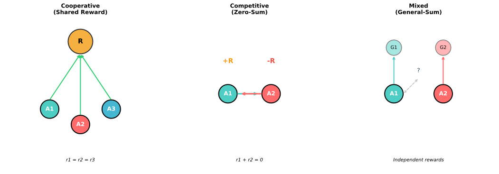
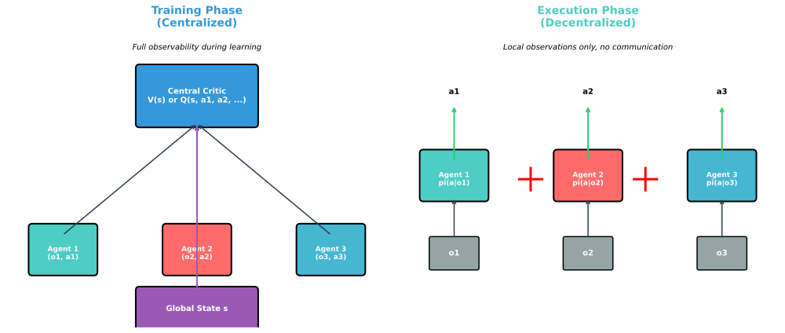
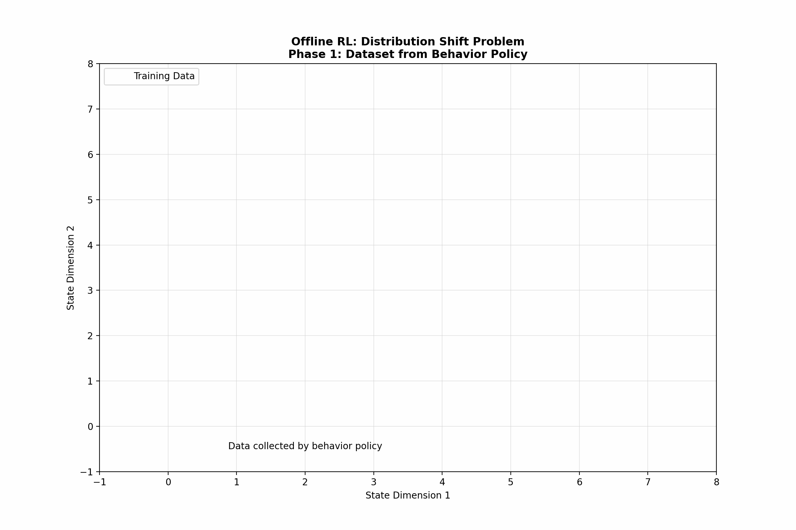
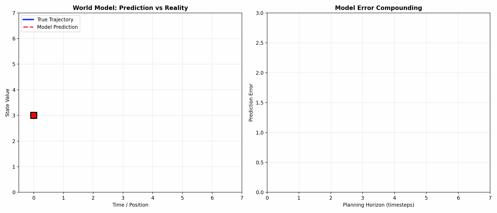

# Advanced RL Topics

> **Beyond single-agent online learning** — multi-agent, offline, and model-based RL

---

## Overview

Standard RL assumes a single agent learning through online interaction with an environment. Real-world applications often require extensions: multiple agents learning together, learning from fixed datasets without exploration, or building predictive models of the environment. This module covers these advanced paradigms that frequently appear in ML interviews.

---

## Multi-Agent Reinforcement Learning (MARL)

### The Multi-Agent Setting

In MARL, multiple agents interact within a shared environment. Each agent $i$ observes state $s_t$, takes action $a_t^i$, and receives reward $r_t^i$. The key challenge: **non-stationarity**. From agent $i$'s perspective, other agents are part of the environment, but they are also learning and changing their policies.

The joint action space grows exponentially: with $n$ agents and $|A|$ actions each, the joint space has $|A|^n$ actions.

### Cooperative vs Competitive

| Setting | Reward Structure | Examples | Challenge |
|---------|------------------|----------|-----------|
| **Cooperative** | Shared reward: $r^1 = r^2 = ... = r^n$ | Robot teams, multi-robot navigation | Credit assignment |
| **Competitive** | Zero-sum: $r^1 + r^2 = 0$ | Games (Go, Chess, Poker) | Exploitability |
| **Mixed** | General-sum: independent rewards | Traffic, markets | Equilibrium selection |



### Centralized Training, Decentralized Execution (CTDE)

The dominant paradigm in MARL addresses non-stationarity during training while maintaining practicality during deployment:

**Training Phase (Centralized):**
- Access to all agents' observations and actions
- Can use global state information
- Enables stable learning with full information

**Execution Phase (Decentralized):**
- Each agent acts only on its local observation
- No communication required between agents
- Practical for real-world deployment



### Key MARL Algorithms

**Independent Q-Learning (IQL):** Each agent learns independently, treating others as environment. Simple but ignores coordination.

**QMIX:** Learns a mixing network that combines individual Q-values into a joint Q-value, ensuring Individual-Global-Max (IGM) property:

$$Q_{tot}(s, \mathbf{a}) = f_{mix}(Q_1(s, a_1), ..., Q_n(s, a_n))$$

The mixing network must be monotonic in individual Q-values to ensure consistent argmax.

**MAPPO:** Multi-Agent PPO with a centralized critic. The critic $V(s)$ uses global state, while actors $\pi_i(a_i|o_i)$ use local observations.

---

## Offline Reinforcement Learning

### The Offline Setting

**Online RL:** Agent collects data by interacting with environment, learns from that data, collects more data, iterates.

**Offline RL:** Agent has a fixed dataset $\mathcal{D} = \{(s, a, r, s')\}$ collected by some behavior policy $\pi_\beta$. No additional interaction allowed.

This setting is critical for:
- Healthcare (can't experiment on patients)
- Autonomous driving (can't cause accidents)
- Industrial systems (can't disrupt operations)

### The Distribution Shift Problem

The fundamental challenge in offline RL is **distribution shift**. The learned policy $\pi$ may query the Q-function at state-action pairs $(s, a)$ not present in the dataset $\mathcal{D}$.

$$\text{OOD Error} = \mathbb{E}_{(s,a) \sim \pi}[Q(s,a)] - \mathbb{E}_{(s,a) \sim \mathcal{D}}[Q(s,a)]$$

Standard Q-learning assumes the agent can correct errors through exploration. Without exploration, extrapolation errors compound:

1. Q-function overestimates value for unseen action $a'$
2. Policy selects $a'$ because of overestimation
3. No data to correct the error
4. Error amplifies in subsequent bootstrapping



### Conservative Q-Learning (CQL)

CQL addresses distribution shift by adding a conservative regularizer to push down Q-values for out-of-distribution actions:

$$\mathcal{L}_{CQL} = \mathbb{E}_{s \sim \mathcal{D}}\left[\log \sum_a \exp(Q(s,a))\right] - \mathbb{E}_{(s,a) \sim \mathcal{D}}[Q(s,a)] + \mathcal{L}_{TD}$$

The first term (logsumexp) is minimized by reducing Q-values for all actions, while the second term prevents Q-values from collapsing for in-distribution actions.

**Intuition:** Learn a lower bound on the true Q-function. This ensures the policy doesn't overestimate the value of unseen actions.

### Implicit Q-Learning (IQL)

IQL avoids querying Q-values for actions not in the dataset by using expectile regression:

$$\mathcal{L}_{IQL} = \mathbb{E}_{(s,a,s') \sim \mathcal{D}}\left[L_\tau(r + \gamma V(s') - Q(s,a))\right]$$

where $L_\tau$ is the asymmetric expectile loss:

$$L_\tau(u) = |\tau - \mathbf{1}(u < 0)| \cdot u^2$$

With $\tau > 0.5$, this implicitly performs policy improvement without explicit maximization over actions.

---

## Model-Based Reinforcement Learning

### Model-Free vs Model-Based

| Aspect | Model-Free | Model-Based |
|--------|------------|-------------|
| **Learns** | Policy $\pi$ or Q-function directly | Dynamics model $\hat{T}(s'|s,a)$ |
| **Sample Efficiency** | Low (needs many interactions) | High (can plan with model) |
| **Computation** | Low per step | High (planning required) |
| **Asymptotic Performance** | Can be optimal | Limited by model accuracy |

### World Models

A world model learns to predict environment dynamics and rewards:

$$\hat{s}_{t+1} = f_\theta(s_t, a_t), \quad \hat{r}_t = g_\theta(s_t, a_t)$$

Modern world models often operate in a learned latent space:

1. **Encoder** $e_\phi$: Map observation to latent state $z_t = e_\phi(o_t)$
2. **Dynamics** $f_\theta$: Predict next latent state $\hat{z}_{t+1} = f_\theta(z_t, a_t)$
3. **Reward** $g_\psi$: Predict reward $\hat{r}_t = g_\psi(z_t, a_t)$
4. **Decoder** $d_\xi$: Reconstruct observation (optional) $\hat{o}_t = d_\xi(z_t)$



### Planning with Learned Models

Once a model is learned, several planning strategies exist:

**Model Predictive Control (MPC):**
1. At state $s_t$, sample action sequences $\{a_t, ..., a_{t+H}\}$
2. Roll out each sequence using the learned model
3. Execute first action of best sequence
4. Replan at next timestep

**Dyna-style Learning:**
- Use real data to update both model and policy
- Generate synthetic rollouts from model
- Update policy on synthetic data

**Dreamer:**
- Learn world model in latent space
- Learn policy entirely within "dreams" (model rollouts)
- Only use real environment for model learning

### Model Error Compounding

The critical challenge in model-based RL: **error compounding**. Small model errors at each step accumulate over long horizons:

$$\text{Total Error} \approx H \cdot \epsilon_{model}$$

where $H$ is the planning horizon and $\epsilon_{model}$ is per-step model error.

Mitigation strategies:
- Short planning horizons (MPC)
- Ensemble models (uncertainty quantification)
- Dyna-style mixing of real and simulated data

---

## Hierarchical Reinforcement Learning

### The Temporal Abstraction Problem

Complex tasks require reasoning at multiple timescales. Navigating a city involves high-level decisions (which route?) and low-level control (steering, braking).

### Options Framework

An **option** $\omega = (I_\omega, \pi_\omega, \beta_\omega)$ consists of:
- **Initiation set** $I_\omega$: States where option can start
- **Policy** $\pi_\omega(a|s)$: Low-level action selection
- **Termination** $\beta_\omega(s)$: Probability of ending option

The agent learns both which options to invoke (high-level policy) and the options themselves (low-level policies).

### Goal-Conditioned RL

An alternative hierarchical approach:
- **High-level policy** proposes subgoals: $g_t = \pi_{hi}(s_t)$
- **Low-level policy** achieves subgoals: $a_t = \pi_{lo}(s_t, g_t)$
- Low-level reward is distance to subgoal: $r_{lo} = -||s_{t+1} - g_t||$

---

## Inverse Reinforcement Learning (IRL)

### The Problem

In standard RL, the reward function is given. In IRL, we observe expert demonstrations and infer the reward function that explains the behavior:

$$\text{Given: } \mathcal{D}_{expert} = \{(s_0, a_0, s_1, a_1, ...)\}$$
$$\text{Find: } R(s, a) \text{ such that } \pi^* = \arg\max_\pi \mathbb{E}_\pi[\sum_t R(s_t, a_t)]$$

### Key Challenge: Ill-Posedness

Multiple reward functions can explain the same behavior:
- $R(s, a) = 0$ (constant) makes any policy optimal
- $R(s, a) = c \cdot R'(s, a)$ for any constant $c > 0$

### Maximum Entropy IRL

Resolve ambiguity by assuming the expert is noisily optimal with maximum entropy:

$$\pi^*(a|s) \propto \exp(Q^*(s, a))$$

The reward is then found by matching feature expectations:

$$\mathbb{E}_{\pi^*}[\phi(s, a)] = \mathbb{E}_{\mathcal{D}_{expert}}[\phi(s, a)]$$

### Applications

- **Autonomous driving:** Learn reward from human demonstrations
- **Robotics:** Learn manipulation objectives from expert teleoperation
- **Recommendation systems:** Infer user preferences from behavior

---

## Interview Questions

### Question 1: Why is offline RL harder than supervised learning?

**Sample Answer:**

"At first glance, offline RL seems like supervised learning: we have a fixed dataset and want to learn from it. However, there are fundamental differences:

**Distribution Shift:** In supervised learning, the test distribution matches the training distribution. In offline RL, the learned policy $\pi$ induces a different state-action distribution than the behavior policy $\pi_\beta$ that collected the data. The policy may visit states never seen during training.

**Bootstrapping Error:** Q-learning updates use the max over next actions: $Q(s,a) \leftarrow r + \gamma \max_{a'} Q(s', a')$. This max can select actions not in the dataset, and the Q-value for those actions is unreliable. In supervised learning, there's no bootstrapping from our own predictions.

**No Error Correction:** In online RL, if the policy makes a mistake, it receives a bad reward and corrects. In offline RL, mistakes cannot be corrected through additional exploration.

**Solutions like CQL** add pessimism to avoid overestimating OOD actions, while **IQL** avoids querying OOD actions entirely."

### Question 2: Explain the tradeoff between model-free and model-based RL.

**Sample Answer:**

"The fundamental tradeoff is **sample efficiency vs asymptotic performance**:

**Model-Based RL:**
- *Pros:* Much more sample-efficient because the model can generate unlimited synthetic experience. Can plan ahead before acting. Useful when real environment interaction is expensive or dangerous.
- *Cons:* Model errors compound over long horizons. The policy is limited by model accuracy. Additional computational cost for planning.

**Model-Free RL:**
- *Pros:* No model approximation error. Can achieve optimal performance given enough samples. Simpler implementation.
- *Cons:* Requires many environment interactions. Cannot leverage structure in dynamics.

**Practical Guidance:**
- Use model-based when samples are expensive (robotics, healthcare)
- Use model-free when simulation is cheap and model is hard to learn (complex physics)
- Hybrid approaches (Dyna) often work best: use model for data augmentation but don't rely on it exclusively"

### Question 3: What is the credit assignment problem in cooperative MARL?

**Sample Answer:**

"In cooperative MARL with shared rewards, all agents receive the same reward signal. The challenge: **which agent's actions actually contributed to the outcome?**

Consider a robot soccer team that scores a goal and receives $r=+1$. The goalkeeper, midfielders, and striker all receive the same reward. But maybe only the striker's actions mattered for that particular goal.

**Why It's Hard:**
- Joint action space is exponential: $|A|^n$ combinations
- Counterfactual reasoning is needed: 'What if agent 2 had done differently?'
- Can't decompose team reward into individual contributions trivially

**Solutions:**
1. **Difference Rewards:** $r_i = r_{team} - r_{team \text{ without } i}$ (requires simulator)
2. **Value Decomposition (VDN, QMIX):** Learn $Q_{tot} = f(Q_1, ..., Q_n)$ where $Q_i$ depends only on agent $i$'s information
3. **Counterfactual Baselines (COMA):** Use critic to estimate counterfactual advantage

The key insight of QMIX: ensure monotonicity so that improving individual Q-values improves the joint Q-value, enabling decentralized execution."

---

## Quick Reference Card

```
MULTI-AGENT RL
---------------------------------------------------
CTDE:        Centralized Training, Decentralized Execution
Cooperative: Shared rewards, credit assignment problem
Competitive: Zero-sum games, Nash equilibrium
QMIX:        Q_tot = f_mix(Q_1, ..., Q_n), monotonic mixing

OFFLINE RL
---------------------------------------------------
Setting:      Fixed dataset D, no exploration
Challenge:    Distribution shift, OOD extrapolation
CQL:          Pessimistic Q-values, push down OOD
IQL:          Expectile regression, implicit maximization
Key insight:  Be conservative about unseen actions

MODEL-BASED RL
---------------------------------------------------
World Model:  Learn T(s'|s,a) and R(s,a)
Planning:     MPC, Dyna, Dreamer
Tradeoff:     Sample efficiency vs model accuracy
Challenge:    Error compounding over long horizons

HIERARCHICAL RL
---------------------------------------------------
Options:      (Initiation, Policy, Termination)
Goal-Cond:    High-level sets goals, low-level achieves
Benefit:      Temporal abstraction, transfer

INVERSE RL
---------------------------------------------------
Given:        Expert demonstrations
Find:         Reward function explaining behavior
Challenge:    Ill-posed (many solutions)
MaxEnt IRL:   Match feature expectations
```

---

## Key Takeaways

1. **MARL introduces non-stationarity** because all agents are learning simultaneously. CTDE resolves this by using global information during training while maintaining decentralized execution.

2. **Offline RL's core challenge is distribution shift** — the policy may want to take actions not represented in the dataset. Conservative approaches (CQL, IQL) address this by being pessimistic about unseen actions.

3. **Model-based RL trades sample efficiency for model accuracy**. World models enable planning but errors compound over long horizons. Hybrid approaches often work best.

4. **Hierarchical RL enables temporal abstraction**, allowing agents to reason at multiple timescales through options or goal-conditioned policies.

5. **Inverse RL recovers reward functions from demonstrations**, enabling learning from experts when the reward is unknown or hard to specify.
