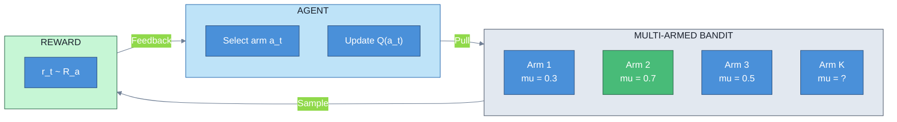
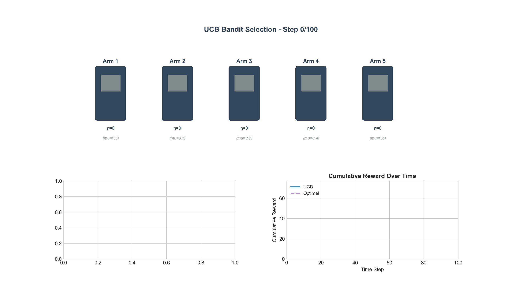
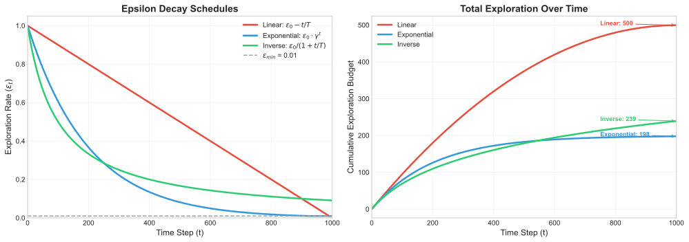
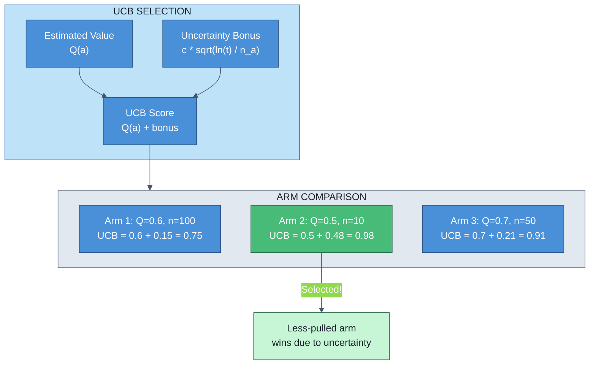
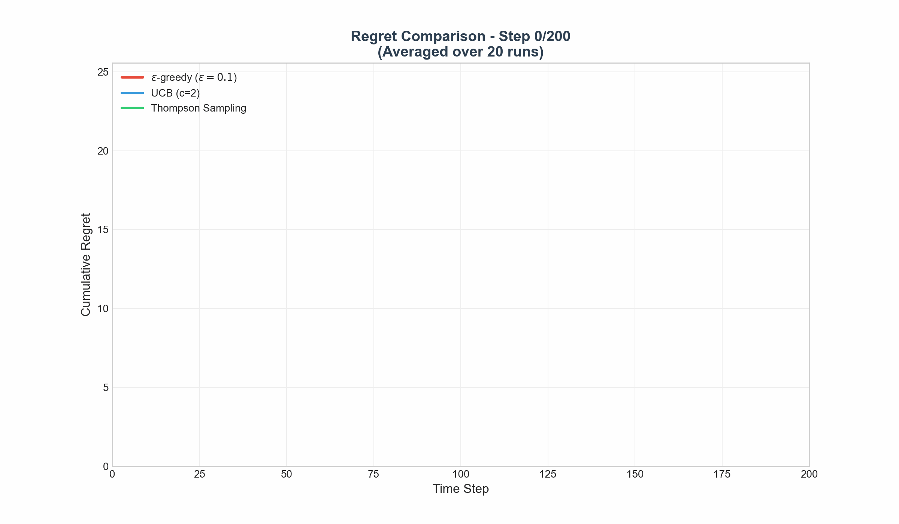
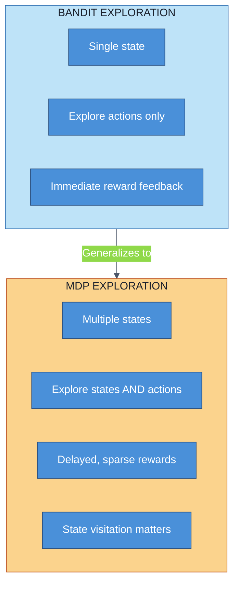

# Exploration vs Exploitation

> **The fundamental trade-off in RL** — when to try new things vs stick with what works

---

## The Core Dilemma

Every learning agent faces a fundamental question: should I exploit my current best option, or explore to potentially find something better?

- **Exploitation**: Select the action that appears best based on current knowledge
- **Exploration**: Try different actions to improve knowledge of their rewards

The key insight: **pure exploitation** converges to a suboptimal policy if the best action was never discovered; **pure exploration** wastes resources gathering information never used.

---

## Multi-Armed Bandit: The Canonical Problem

### Problem Setup

Imagine $K$ slot machines (arms), each with unknown reward distribution $R_a$. At each timestep $t$:

1. Select an arm $a_t \in \{1, 2, ..., K\}$
2. Receive reward $r_t \sim R_{a_t}$
3. Update knowledge about arm $a_t$

**Goal**: Maximize cumulative reward over $T$ timesteps.

The true mean reward for arm $a$ is $\mu_a = \mathbb{E}[R_a]$. The optimal arm is $a^* = \arg\max_a \mu_a$.

### Estimating Arm Values

After $n_a(t)$ pulls of arm $a$, we estimate its value:

$$\hat{Q}_t(a) = \frac{1}{n_a(t)} \sum_{i=1}^{t} r_i \cdot \mathbb{1}[a_i = a]$$

This is simply the sample mean of observed rewards for arm $a$.





---

## Exploration Strategies

### 1. Epsilon-Greedy

The simplest approach: with probability $\epsilon$, explore randomly; otherwise, exploit.

$$a_t = \begin{cases} \arg\max_a \hat{Q}_t(a) & \text{with probability } 1-\epsilon \\ \text{random arm} & \text{with probability } \epsilon \end{cases}$$

**Advantages**: Simple, guarantees exploration
**Disadvantages**: Explores uniformly (even clearly bad arms), fixed exploration rate

#### Decay Schedules

Fixed $\epsilon$ is suboptimal. As we gather more data, we should explore less:

| Schedule | Formula | Properties |
|----------|---------|------------|
| Linear decay | $\epsilon_t = \max(\epsilon_{\min}, \epsilon_0 - t/T)$ | Predictable, may decay too fast |
| Exponential decay | $\epsilon_t = \epsilon_0 \cdot \gamma^t$ | Common in deep RL |
| Inverse time | $\epsilon_t = \epsilon_0 / (1 + t/T)$ | Slower decay, theoretically motivated |



**Interview insight**: The optimal decay rate depends on the problem horizon $T$ and the gap between arm values.

### 2. Upper Confidence Bound (UCB)

UCB addresses a key limitation of $\epsilon$-greedy: it treats all uncertain arms equally. Instead, UCB balances the estimated value with **uncertainty**:

$$a_t = \arg\max_a \left[ \hat{Q}_t(a) + c \sqrt{\frac{\ln t}{n_a(t)}} \right]$$

The second term is the **exploration bonus**:
- Large when arm $a$ has been pulled rarely ($n_a(t)$ small)
- Shrinks as we pull arm $a$ more often
- Grows slowly with total timesteps $t$ (via $\ln t$)

**Intuition**: UCB implements "optimism in the face of uncertainty" — it assumes uncertain arms might be good until proven otherwise.



**Why $\ln t$?** This ensures the exploration bonus grows sublogarithmically, achieving optimal regret bounds.

### 3. Thompson Sampling

Thompson Sampling takes a Bayesian approach: maintain a probability distribution over each arm's mean, then sample from these posteriors.

**Algorithm**:
1. For each arm $a$, maintain posterior $P(\mu_a | \text{data})$
2. Sample $\tilde{\mu}_a \sim P(\mu_a | \text{data})$ for each arm
3. Select $a_t = \arg\max_a \tilde{\mu}_a$

For Bernoulli bandits (binary rewards), we use Beta distributions:

$$\mu_a | \text{data} \sim \text{Beta}(\alpha_a + \text{successes}_a, \beta_a + \text{failures}_a)$$

**Advantages**:
- Naturally balances exploration/exploitation through posterior sampling
- Often outperforms UCB in practice
- Easily extends to contextual bandits

**Disadvantages**:
- Requires specifying priors
- Posterior may be intractable for complex reward models

### Strategy Comparison

| Strategy | Exploration Type | Regret Bound | Computational Cost |
|----------|-----------------|--------------|-------------------|
| $\epsilon$-greedy | Uniform random | $O(\epsilon T + K/\epsilon)$ | $O(K)$ |
| UCB | Uncertainty-driven | $O(\sqrt{KT \ln T})$ | $O(K)$ |
| Thompson Sampling | Posterior sampling | $O(\sqrt{KT \ln T})$ | $O(K)$ per sample |



---

## Regret: Measuring Performance

### Definition

**Regret** quantifies the cost of learning — the cumulative difference between the optimal policy and our chosen actions:

$$\text{Regret}(T) = \sum_{t=1}^{T} \left( \mu^* - \mu_{a_t} \right) = T \mu^* - \sum_{t=1}^{T} \mu_{a_t}$$

where $\mu^* = \max_a \mu_a$ is the optimal arm's mean reward.

### Regret Bounds

**Lower bound (Lai-Robbins)**: Any consistent algorithm must have:

$$\liminf_{T \to \infty} \frac{\text{Regret}(T)}{\ln T} \geq \sum_{a: \mu_a < \mu^*} \frac{\mu^* - \mu_a}{\text{KL}(\mu_a || \mu^*)}$$

This establishes that $O(\ln T)$ regret is the best possible for problem-dependent bounds.

**Problem-independent bounds**: UCB and Thompson Sampling achieve:

$$\text{Regret}(T) = O(\sqrt{KT \ln T})$$

This scales with the square root of time — sublinear growth means we're learning effectively.

### Interpreting Regret

| Regret Growth | Interpretation |
|--------------|----------------|
| $O(T)$ | Linear — not learning (pure exploration) |
| $O(\sqrt{T})$ | Sublinear — effective learning |
| $O(\ln T)$ | Logarithmic — near-optimal |

---

## Extension to Full MDPs

The bandit problem is a special case of MDPs with a single state. In full MDPs:

### The Exploration Challenge

States compound the exploration problem:
- Must explore **actions** at each state
- Must explore **states** themselves (may need specific action sequences)
- Rewards may be sparse and delayed

### Exploration Methods in MDPs

**1. Epsilon-greedy policy**: Same principle, applied to Q-learning or policy gradient

$$\pi(a|s) = \begin{cases} 1 - \epsilon + \frac{\epsilon}{|A|} & \text{if } a = \arg\max_{a'} Q(s, a') \\ \frac{\epsilon}{|A|} & \text{otherwise} \end{cases}$$

**2. UCB for MDPs (UCRL, UCB-VI)**: Maintain confidence bounds on transition probabilities and rewards, then plan optimistically.

**3. Intrinsic motivation**: Add exploration bonuses to rewards:

$$r_t^{\text{total}} = r_t^{\text{extrinsic}} + \beta \cdot r_t^{\text{intrinsic}}$$

Common intrinsic rewards:
- **Count-based**: $r^{\text{intrinsic}}(s) = 1/\sqrt{n(s)}$ (bonus for visiting rare states)
- **Prediction error**: Reward proportional to model's surprise
- **Information gain**: Reward for reducing uncertainty about dynamics

**4. Posterior sampling for RL (PSRL)**: Thompson Sampling extended to MDPs — sample a complete MDP from the posterior and act optimally in it.



---

## Interview Questions

### Question 1: Explain the exploration-exploitation trade-off. Why can't we just exploit?

**Expected Answer**:

"Pure exploitation fails because initial estimates may be inaccurate. If the true best arm was unlucky in early samples, we might never discover it.

Consider two arms with true means $\mu_1 = 0.6$ and $\mu_2 = 0.8$. If arm 1 gets lucky and returns 1.0 first while arm 2 returns 0.5, pure exploitation locks onto arm 1 forever, accumulating linear regret.

Different strategies balance this: $\epsilon$-greedy adds random exploration, UCB explores uncertain options, and Thompson Sampling samples from posteriors."

---

### Question 2: Compare UCB and Thompson Sampling. When would you prefer one over the other?

**Expected Answer**:

"Both achieve optimal $O(\sqrt{KT \ln T})$ regret bounds but differ in approach:

**UCB**: Deterministic, explicit exploration bonus ($c\sqrt{\ln t / n_a}$), easier to analyze, requires tuning $c$.

**Thompson Sampling**: Stochastic via posterior sampling, often better empirically, requires specifying priors.

Choose **UCB** for deterministic/reproducible behavior or when theoretical guarantees matter. Choose **Thompson Sampling** for better empirical performance, especially in production systems like ad recommendation."

---

### Question 3: How does exploration differ between bandits and full MDPs? What additional challenges arise?

**Expected Answer**:

"In bandits, exploration is about trying different actions. In MDPs, this is compounded by:

1. **State space exploration**: Some states require specific action sequences to reach
2. **Credit assignment**: Rewards may be delayed by many timesteps
3. **Compounding errors**: Bad states lead to many suboptimal timesteps
4. **Curse of dimensionality**: Count-based exploration fails in large state spaces

**Solutions**: Intrinsic motivation (curiosity bonuses), optimistic initialization, model-based exploration, hierarchical methods. The key insight is that MDPs require exploring the **state-action** space, not just actions."

---

## Quick Reference Card

```
+------------------------------------------------------------------+
|              EXPLORATION VS EXPLOITATION CHEAT SHEET              |
+------------------------------------------------------------------+

CORE TRADE-OFF
  Exploit: Use current best action (greedy)
  Explore: Try other actions (information gathering)

MULTI-ARMED BANDIT
  K arms, unknown reward distributions
  Goal: Maximize sum of rewards over T pulls
  Optimal arm: a* = argmax_a mu_a

STRATEGIES
  +------------------+---------------------------+------------------+
  | Strategy         | Selection Rule            | Regret Bound     |
  +------------------+---------------------------+------------------+
  | epsilon-greedy   | Random w.p. epsilon       | O(T) or better   |
  | UCB              | Q(a) + c*sqrt(ln(t)/n_a)  | O(sqrt(KT ln T)) |
  | Thompson         | Sample from posteriors    | O(sqrt(KT ln T)) |
  +------------------+---------------------------+------------------+

REGRET DEFINITION
  Regret(T) = T*mu* - sum_{t=1}^T mu_{a_t}

  Lower bound: Omega(ln T) problem-dependent
  Optimal: O(sqrt(KT ln T)) problem-independent

UCB FORMULA
  a_t = argmax_a [ Q(a) + c * sqrt(ln(t) / n_a(t)) ]
                   ^^^^^   ^^^^^^^^^^^^^^^^^^^^^^^^^
                   exploit        explore

THOMPSON SAMPLING (Bernoulli)
  Prior: Beta(alpha, beta)
  Posterior: Beta(alpha + successes, beta + failures)
  Select: argmax_a sample_a

EPSILON DECAY SCHEDULES
  Linear:      epsilon_t = max(eps_min, eps_0 - t/T)
  Exponential: epsilon_t = eps_0 * gamma^t
  Inverse:     epsilon_t = eps_0 / (1 + t/T)

MDP EXPLORATION
  Challenge: Must explore states AND actions
  Solutions: Intrinsic rewards, optimistic init, PSRL

  Intrinsic reward examples:
    - Count-based: 1/sqrt(n(s))
    - Prediction error (curiosity)
    - Information gain

KEY INSIGHTS FOR INTERVIEWS
  1. Pure exploitation: O(T) regret (linear = bad)
  2. Pure exploration: O(T) regret (linear = bad)
  3. Good algorithms: O(sqrt(T)) or O(ln T) regret
  4. UCB: Optimism in face of uncertainty
  5. Thompson: Probability matching via posteriors

+------------------------------------------------------------------+
```

---

## Key Takeaways

1. **Exploration-exploitation is universal**: Any learning system must balance gathering information with using it optimally.

2. **Regret quantifies learning efficiency**: Sublinear regret ($o(T)$) means we're converging to optimal behavior.

3. **UCB implements optimism**: By adding uncertainty bonuses, UCB naturally explores under-sampled options while favoring high-value ones.

4. **Thompson Sampling often wins empirically**: Despite similar theoretical guarantees to UCB, Thompson Sampling typically performs better in practice.

5. **MDPs compound the exploration challenge**: State visitation, delayed rewards, and large state spaces require sophisticated exploration strategies beyond simple bandit algorithms.

6. **Decay schedules matter**: In finite-horizon problems, exploration should decrease over time as we become more confident in our estimates.

Understanding these concepts is essential for designing effective RL systems and for interview success — these questions probe your understanding of fundamental RL principles that underlie everything from recommendation systems to robotics.
