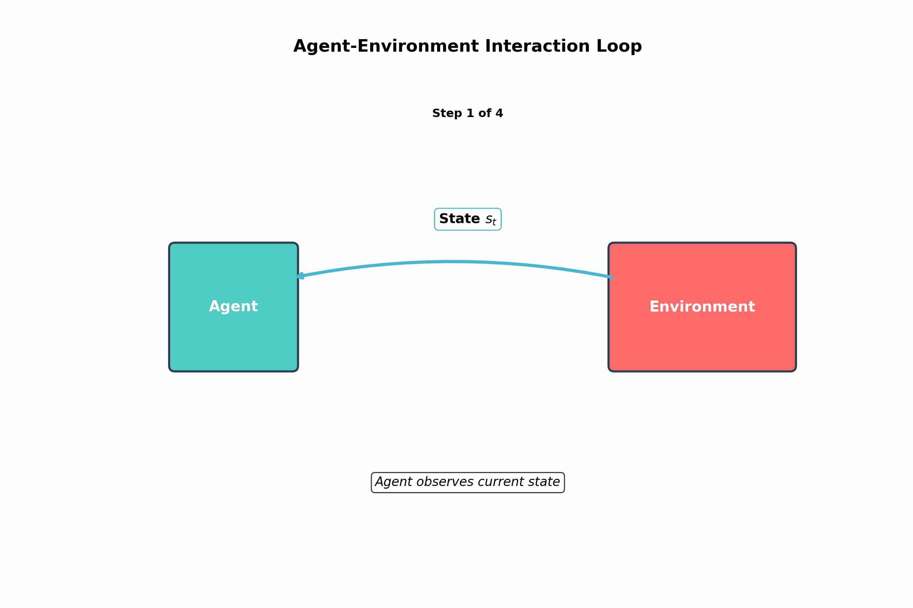
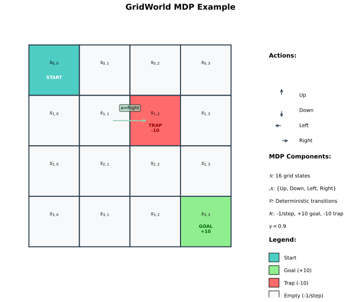
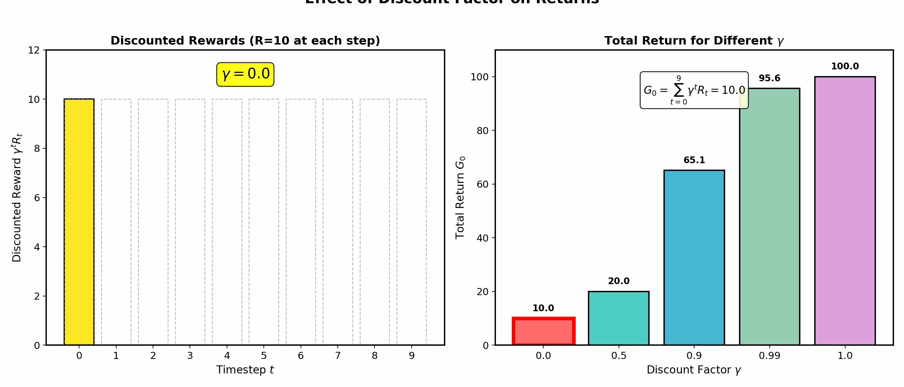

# MDP Foundations

> **The mathematical framework for RL** — states, actions, rewards, and the Markov property

---

## What is Reinforcement Learning?

Reinforcement Learning (RL) is a computational approach where an **agent** learns to make decisions by interacting with an **environment**. Unlike supervised learning, RL does not require labeled input/output pairs. Instead, the agent discovers optimal behavior through trial and error, guided by reward signals.

### The Agent-Environment Loop

The fundamental RL interaction follows a cyclic pattern:

1. **Agent** observes the current **state** $s_t$
2. Agent selects an **action** $a_t$ based on its policy
3. Environment transitions to a new **state** $s_{t+1}$
4. Agent receives a **reward** $r_{t+1}$
5. Repeat



This loop captures the essence of sequential decision-making: every action influences future states and rewards, requiring the agent to balance immediate rewards against long-term consequences.

---

## Markov Decision Process (MDP)

An MDP provides the formal mathematical framework for modeling RL problems. It defines the rules of the environment the agent interacts with.

### Formal Definition

An MDP is defined by the tuple $(\mathcal{S}, \mathcal{A}, \mathcal{P}, \mathcal{R}, \gamma)$:

| Component | Symbol | Description |
|-----------|--------|-------------|
| **State Space** | $\mathcal{S}$ | Set of all possible states the environment can be in |
| **Action Space** | $\mathcal{A}$ | Set of all possible actions the agent can take |
| **Transition Function** | $\mathcal{P}(s' \mid s, a)$ | Probability of transitioning to state $s'$ given state $s$ and action $a$ |
| **Reward Function** | $\mathcal{R}(s, a, s')$ | Reward received for transition $(s, a, s')$ |
| **Discount Factor** | $\gamma \in [0, 1]$ | How much to weight future rewards vs. immediate rewards |

### Transition Dynamics

The transition function $\mathcal{P}: \mathcal{S} \times \mathcal{A} \times \mathcal{S} \rightarrow [0, 1]$ defines the probability distribution over next states:

$$\mathcal{P}(s' \mid s, a) = \Pr(S_{t+1} = s' \mid S_t = s, A_t = a)$$

This captures the **stochastic** nature of many environments — the same action in the same state may lead to different outcomes.

### Reward Function Variants

The reward function can take several forms:

- **$\mathcal{R}(s, a, s')$**: Reward depends on transition
- **$\mathcal{R}(s, a)$**: Reward depends on state-action pair
- **$\mathcal{R}(s)$**: Reward depends only on state

All forms are mathematically equivalent (can be converted to each other).



---

## The Markov Property

The Markov property is the defining characteristic that makes MDPs tractable. It states:

$$\Pr(S_{t+1} \mid S_t, A_t, S_{t-1}, A_{t-1}, \ldots, S_0, A_0) = \Pr(S_{t+1} \mid S_t, A_t)$$

**In plain terms**: The future depends only on the current state, not on how we got there. The current state contains all relevant information for predicting what happens next.

### Why the Markov Property Matters

| Property | Implication |
|----------|-------------|
| **Memory-less** | No need to store entire history |
| **Computational tractability** | Dynamic programming becomes possible |
| **State sufficiency** | State encodes everything needed for optimal decisions |

### When Markov Property Fails

Real-world problems often violate the Markov property:
- **Partially Observable MDPs (POMDPs)**: Agent cannot fully observe the state
- **History-dependent dynamics**: Past actions affect future transitions

**Solutions**: Augment state with history, use recurrent neural networks, or model as POMDP.

---

## Policies

A **policy** $\pi$ defines the agent's behavior — it specifies how the agent selects actions.

### Deterministic Policies

A deterministic policy is a function mapping states to actions:

$$\pi: \mathcal{S} \rightarrow \mathcal{A}$$

Example: $\pi(s) = a$ means "always take action $a$ in state $s$"

### Stochastic Policies

A stochastic policy defines a probability distribution over actions given a state:

$$\pi(a \mid s) = \Pr(A_t = a \mid S_t = s)$$

**Why stochastic?**
- Exploration: Random actions help discover better strategies
- Game theory: Mixed strategies prevent exploitation by opponents
- Continuous action spaces: Often more natural representation

### Policy Comparison

| Type | Notation | Use Case |
|------|----------|----------|
| **Deterministic** | $\pi(s) = a$ | Exploitation, optimal control |
| **Stochastic** | $\pi(a \mid s)$ | Exploration, adversarial settings |

---

## Episodes vs. Continuing Tasks

RL problems fall into two categories based on their temporal structure.

### Episodic Tasks

- Environment resets to initial state after reaching a **terminal state**
- Interaction naturally breaks into **episodes**
- Each episode is independent

**Examples**: Chess games, Atari games, robot manipulation tasks

### Continuing Tasks

- No terminal states — interaction continues indefinitely
- Must handle infinite horizon
- Common in control and monitoring systems

**Examples**: Stock trading, power grid management, recommendation systems

### Mathematical Difference

For episodic tasks, the return is:
$$G_t = R_{t+1} + R_{t+2} + \cdots + R_T$$

For continuing tasks, we must use discounting to ensure finite returns:
$$G_t = R_{t+1} + \gamma R_{t+2} + \gamma^2 R_{t+3} + \cdots = \sum_{k=0}^{\infty} \gamma^k R_{t+k+1}$$

---

## Return and Discounted Return

The **return** $G_t$ quantifies the cumulative reward from time $t$ onward.

### Discounted Return Formula

$$G_t = \sum_{k=0}^{\infty} \gamma^k R_{t+k+1} = R_{t+1} + \gamma R_{t+2} + \gamma^2 R_{t+3} + \cdots$$

### Discount Factor $\gamma$

The discount factor $\gamma \in [0, 1]$ controls the trade-off between immediate and future rewards:

| $\gamma$ Value | Behavior |
|----------------|----------|
| $\gamma = 0$ | **Myopic**: Only immediate reward matters |
| $\gamma \approx 0.5$ | **Balanced**: Moderate future consideration |
| $\gamma \approx 0.99$ | **Far-sighted**: Values future nearly as much as present |
| $\gamma = 1$ | **No discounting**: Only valid for episodic tasks |



### Why Discount?

1. **Mathematical necessity**: Ensures bounded returns for infinite-horizon problems
2. **Uncertainty**: Future is less predictable than present
3. **Economic preference**: Immediate rewards are often preferred (time value)
4. **Convergence**: Helps algorithms converge faster

### Recursive Formulation

The return satisfies a useful recursive relationship:

$$G_t = R_{t+1} + \gamma G_{t+1}$$

This recursive structure is the foundation for dynamic programming methods like Bellman equations.

---

## GridWorld Example

Consider a 4x4 grid where an agent navigates to a goal state:

| Element | Description |
|---------|-------------|
| **States** | 16 grid cells $(0,0)$ to $(3,3)$ |
| **Actions** | Up, Down, Left, Right |
| **Transitions** | Deterministic (walls cause stay in place) |
| **Rewards** | -1 per step, +10 at goal, -10 at trap |
| **Discount** | $\gamma = 0.9$ |

The agent must learn to reach the goal while avoiding traps, minimizing steps taken.

---

## Interview Questions

### Q1: "Explain the Markov property and why it's important for RL."

> **The Markov property states that the future state depends only on the current state and action, not on the history of how we arrived at the current state:**
>
> $$\Pr(S_{t+1} \mid S_t, A_t, S_{t-1}, \ldots, S_0) = \Pr(S_{t+1} \mid S_t, A_t)$$
>
> **Why it matters:**
> 1. **Computational tractability**: We only need to track the current state, not the entire history
> 2. **Enables dynamic programming**: Bellman equations and value iteration rely on this property
> 3. **State sufficiency**: The optimal policy depends only on the current state
>
> **When it fails:** In partially observable environments (POMDPs), the agent cannot see the full state. Solutions include maintaining belief states or using recurrent networks to encode history.

### Q2: "What role does the discount factor play, and how do you choose it?"

> **The discount factor $\gamma \in [0, 1]$ determines how much future rewards are weighted relative to immediate rewards:**
>
> $$G_t = R_{t+1} + \gamma R_{t+2} + \gamma^2 R_{t+3} + \cdots$$
>
> **Key roles:**
> - **Mathematical**: Ensures convergence for infinite-horizon problems (geometric series)
> - **Behavioral**: $\gamma \approx 0$ makes agent myopic; $\gamma \approx 1$ makes it far-sighted
>
> **Choosing $\gamma$:**
> - **Episodic tasks**: Often $\gamma = 0.99$ or $1.0$
> - **Continuing tasks**: Must be $< 1$ for bounded returns
> - **Fast-changing environments**: Lower $\gamma$ (e.g., 0.9) emphasizes near-term
> - **Long-term planning**: Higher $\gamma$ (e.g., 0.999)
>
> **Practical tip**: Start with $\gamma = 0.99$, adjust based on task horizon.

### Q3: "Compare deterministic vs. stochastic policies. When would you use each?"

> **Deterministic policy $\pi(s) = a$**: Maps each state to exactly one action.
>
> **Stochastic policy $\pi(a \mid s)$**: Defines a probability distribution over actions for each state.
>
> | Aspect | Deterministic | Stochastic |
> |--------|---------------|------------|
> | **Exploration** | No inherent exploration | Natural exploration via randomness |
> | **Optimality** | Sufficient for most MDPs | Required for some POMDPs |
> | **Game theory** | Exploitable | Mixed strategies can be optimal |
> | **Implementation** | Simpler | More complex (sampling required) |
>
> **Use deterministic when:**
> - Deploying a trained policy (exploitation)
> - Full observability and no adversaries
>
> **Use stochastic when:**
> - Training (exploration is essential)
> - Multi-agent or adversarial settings
> - Partially observable environments

---

## Quick Reference Card

```
MDP COMPONENTS
────────────────────────────────────────────────────────
S (States)        Set of environment configurations
A (Actions)       Set of agent choices
P(s'|s,a)         Transition probability function
R(s,a,s')         Reward function
γ (gamma)         Discount factor [0,1]

MARKOV PROPERTY
────────────────────────────────────────────────────────
P(S_{t+1}|S_t,A_t,...,S_0) = P(S_{t+1}|S_t,A_t)
Future depends only on current state, not history

POLICIES
────────────────────────────────────────────────────────
Deterministic:    π(s) = a
Stochastic:       π(a|s) = P(A=a|S=s)

RETURN
────────────────────────────────────────────────────────
Episodic:         G_t = Σ R_{t+k+1}
Discounted:       G_t = Σ γ^k R_{t+k+1}
Recursive:        G_t = R_{t+1} + γ G_{t+1}

DISCOUNT FACTOR γ
────────────────────────────────────────────────────────
γ = 0:            Myopic (only immediate reward)
γ = 0.9:          Standard starting point
γ = 0.99:         Far-sighted
γ = 1:            No discount (episodic only)

TASK TYPES
────────────────────────────────────────────────────────
Episodic:         Terminal states, finite episodes
Continuing:       No termination, infinite horizon
```

---

## Key Takeaways

1. **MDPs formalize sequential decision-making** with states, actions, transitions, rewards, and discount factor.

2. **The Markov property is foundational** — it enables efficient algorithms by ensuring the current state contains all relevant information.

3. **Discount factor $\gamma$ balances present vs. future** — lower values emphasize immediate rewards, higher values encourage long-term planning.

4. **Policies define agent behavior** — deterministic for exploitation, stochastic for exploration and adversarial settings.

5. **Understanding MDPs is prerequisite** for value functions, Bellman equations, and all RL algorithms covered in subsequent modules.
