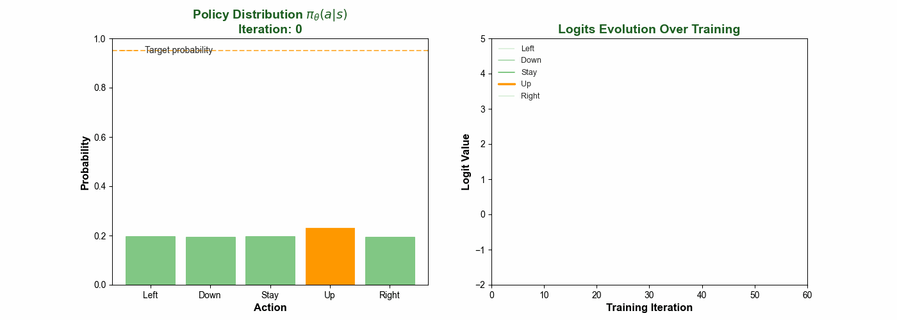
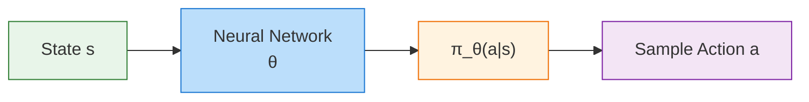
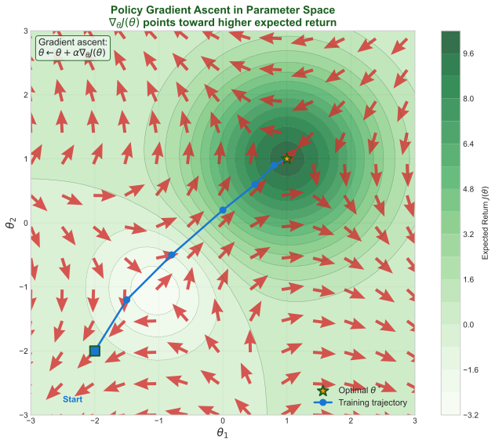
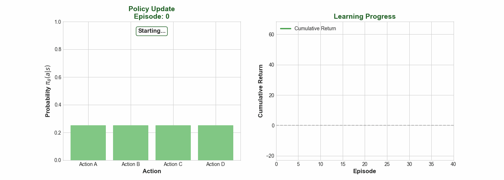
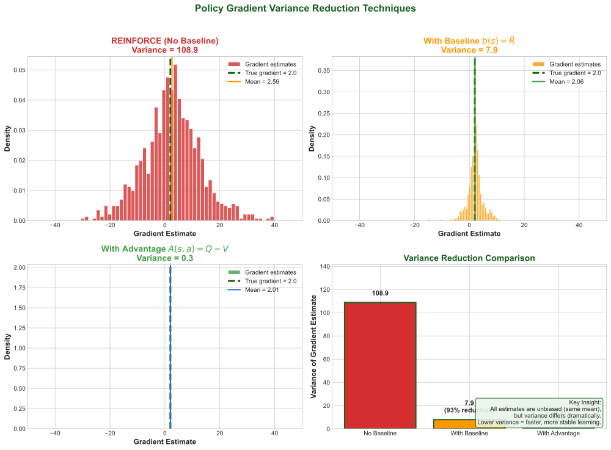
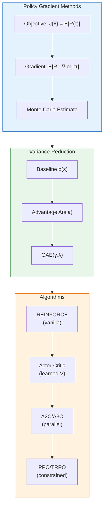

# Policy Gradients

> **Learning policies directly** — REINFORCE, the policy gradient theorem, and variance reduction

---

## One-Sentence Summary

Policy gradients optimize a parameterized policy directly by estimating gradients of expected return through sampled trajectories, avoiding the need for explicit value function maximization.

---

## Why Direct Policy Optimization?

### Limitations of Value-Based Methods

Value-based methods (Q-learning, DQN) learn an action-value function $Q(s, a)$ and derive a policy implicitly:

$$\pi(s) = \arg\max_a Q(s, a)$$

This approach has fundamental limitations:

| Issue | Description |
|-------|-------------|
| **Discrete actions only** | Argmax requires enumeration over all actions |
| **Deterministic policies** | Cannot represent stochastic behavior |
| **High-dimensional actions** | Intractable for continuous control |
| **Indirect optimization** | Optimizing $Q$ does not directly optimize policy performance |

### Advantages of Policy Gradients

Policy gradient methods parameterize the policy directly as $\pi_\theta(a|s)$ and optimize parameters $\theta$ to maximize expected return:

- **Continuous actions:** Natural representation via Gaussian policies
- **Stochastic policies:** Enable exploration and handle partial observability
- **Direct optimization:** Gradient ascent on the true objective
- **Smoother optimization:** Small $\theta$ changes yield small policy changes



*The animation shows how a policy evolves during training, with action probabilities shifting toward the optimal action as the agent learns.*

---

## Policy Parameterization

### The Policy Network

A parameterized policy $\pi_\theta(a|s)$ maps states to action distributions:



### Discrete Actions: Softmax Policy

For discrete action spaces, output logits and apply softmax:

$$\pi_\theta(a|s) = \frac{\exp(f_\theta(s, a))}{\sum_{a'} \exp(f_\theta(s, a'))}$$

where $f_\theta(s, a)$ is the network output (logit) for action $a$.

### Continuous Actions: Gaussian Policy

For continuous actions, output mean and variance of a Gaussian:

$$\pi_\theta(a|s) = \mathcal{N}(\mu_\theta(s), \sigma_\theta(s)^2)$$

The network outputs $\mu_\theta(s)$ (mean) and optionally $\log \sigma_\theta(s)$ (log standard deviation).

**Log probability for gradients:**

$$\log \pi_\theta(a|s) = -\frac{(a - \mu_\theta(s))^2}{2\sigma_\theta(s)^2} - \log \sigma_\theta(s) - \frac{1}{2}\log(2\pi)$$

---

## The Policy Gradient Theorem

### Objective Function

We want to maximize expected cumulative reward (return):

$$J(\theta) = \mathbb{E}_{\tau \sim \pi_\theta}\left[\sum_{t=0}^{T} \gamma^t r_t\right] = \mathbb{E}_{\tau \sim \pi_\theta}[R(\tau)]$$

where $\tau = (s_0, a_0, r_0, s_1, a_1, r_1, \ldots)$ is a trajectory.

### The Gradient

The key insight: we can compute the gradient of $J(\theta)$ even though the expectation is over trajectories that depend on $\theta$:

$$\nabla_\theta J(\theta) = \mathbb{E}_{\tau \sim \pi_\theta}\left[R(\tau) \sum_{t=0}^{T} \nabla_\theta \log \pi_\theta(a_t|s_t)\right]$$

### Derivation Intuition

The derivation uses the **log-derivative trick**:

$$\nabla_\theta \pi_\theta(a|s) = \pi_\theta(a|s) \nabla_\theta \log \pi_\theta(a|s)$$

Starting from the objective:

$$J(\theta) = \sum_\tau P(\tau|\theta) R(\tau)$$

Taking the gradient:

$$\nabla_\theta J(\theta) = \sum_\tau \nabla_\theta P(\tau|\theta) R(\tau)$$

Applying the log-derivative trick:

$$= \sum_\tau P(\tau|\theta) \nabla_\theta \log P(\tau|\theta) R(\tau)$$

Since $P(\tau|\theta) = p(s_0) \prod_{t} \pi_\theta(a_t|s_t) p(s_{t+1}|s_t, a_t)$, only the policy terms depend on $\theta$:

$$\nabla_\theta \log P(\tau|\theta) = \sum_{t=0}^{T} \nabla_\theta \log \pi_\theta(a_t|s_t)$$

This yields the policy gradient theorem:

$$\boxed{\nabla_\theta J(\theta) = \mathbb{E}_{\tau \sim \pi_\theta}\left[R(\tau) \sum_{t=0}^{T} \nabla_\theta \log \pi_\theta(a_t|s_t)\right]}$$

**Key insight:** The gradient is an expectation, so we can estimate it by sampling trajectories.



*Policy gradient ascent in parameter space: arrows show gradient directions pointing toward regions of higher expected return.*

---

## REINFORCE Algorithm

### Algorithm Overview

REINFORCE (Williams, 1992) is the simplest policy gradient algorithm:

```
Algorithm: REINFORCE
─────────────────────────────────────
1. Initialize policy parameters θ
2. For each episode:
   a. Generate trajectory τ = (s₀, a₀, r₀, ..., s_T)
   b. Compute return R(τ) = Σᵢ γⁱrᵢ
   c. For each timestep t:
      - Compute gradient: ĝ = R(τ) ∇_θ log π_θ(aₜ|sₜ)
      - Update: θ ← θ + α ĝ
```

### Monte Carlo Estimation

The gradient estimate uses complete episodes (Monte Carlo):

$$\hat{g} = \frac{1}{N} \sum_{n=1}^{N} R(\tau_n) \sum_{t=0}^{T} \nabla_\theta \log \pi_\theta(a_t^n | s_t^n)$$

**Properties:**
- **Unbiased:** $\mathbb{E}[\hat{g}] = \nabla_\theta J(\theta)$
- **High variance:** Single trajectory estimates are noisy
- **On-policy:** Requires fresh samples after each update

### Causality Improvement

Actions at time $t$ cannot affect rewards at earlier times. We can use **reward-to-go**:

$$\nabla_\theta J(\theta) = \mathbb{E}\left[\sum_{t=0}^{T} \nabla_\theta \log \pi_\theta(a_t|s_t) \sum_{t'=t}^{T} \gamma^{t'-t} r_{t'}\right]$$

This uses $G_t = \sum_{t'=t}^{T} \gamma^{t'-t} r_{t'}$ instead of $R(\tau)$, reducing variance.



*REINFORCE in action: the policy updates based on episode returns, gradually concentrating probability on better actions.*

---

## The Variance Problem

### Why High Variance?

Policy gradient estimates suffer from high variance because:

1. **Stochastic actions:** Randomness in action sampling
2. **Stochastic transitions:** Environment dynamics
3. **Rare events:** Important but infrequent rewards

**Consequence:** Gradient estimates swing wildly between updates, causing unstable learning.



### Baseline Subtraction

We can subtract any function $b(s)$ that does not depend on actions:

$$\nabla_\theta J(\theta) = \mathbb{E}\left[\sum_{t=0}^{T} \nabla_\theta \log \pi_\theta(a_t|s_t) (G_t - b(s_t))\right]$$

**Why this works:** The subtracted term has zero expectation:

$$\mathbb{E}_{a \sim \pi_\theta}[\nabla_\theta \log \pi_\theta(a|s) \cdot b(s)] = b(s) \sum_a \nabla_\theta \pi_\theta(a|s) = b(s) \nabla_\theta \underbrace{\sum_a \pi_\theta(a|s)}_{=1} = 0$$

### Common Baselines

| Baseline | Formula | Variance Reduction |
|----------|---------|-------------------|
| **Constant** | $b = \bar{R}$ (average return) | Moderate |
| **State-dependent** | $b(s) = V(s)$ (value function) | High |
| **Moving average** | $b = \text{EMA}(R)$ | Moderate |

**Optimal baseline:** The value function $V^\pi(s)$ is provably the variance-minimizing baseline.

---

## The Advantage Function

### Definition

The **advantage function** measures how much better an action is compared to the average:

$$A^\pi(s, a) = Q^\pi(s, a) - V^\pi(s)$$

where:
- $Q^\pi(s, a)$ = expected return starting from $(s, a)$ following $\pi$
- $V^\pi(s)$ = expected return starting from $s$ following $\pi$

### Advantage Actor-Critic Gradient

Using advantage as the weighting term:

$$\nabla_\theta J(\theta) = \mathbb{E}\left[\sum_{t=0}^{T} \nabla_\theta \log \pi_\theta(a_t|s_t) A^\pi(s_t, a_t)\right]$$

**Intuition:**
- $A > 0$: Action better than average — increase probability
- $A < 0$: Action worse than average — decrease probability
- $A = 0$: Action is average — no change

### Advantage Estimation

Since we do not know the true advantage, we estimate it:

**TD(0) Advantage Estimate:**

$$\hat{A}_t = r_t + \gamma V(s_{t+1}) - V(s_t)$$

**Generalized Advantage Estimation (GAE):**

$$\hat{A}_t^{\text{GAE}(\gamma, \lambda)} = \sum_{l=0}^{\infty} (\gamma \lambda)^l \delta_{t+l}$$

where $\delta_t = r_t + \gamma V(s_{t+1}) - V(s_t)$ is the TD error.

GAE interpolates between high-bias/low-variance ($\lambda = 0$) and low-bias/high-variance ($\lambda = 1$).

---

## Policy Gradients for Continuous Actions

### Gaussian Policy Implementation

For continuous control, we typically use a diagonal Gaussian:

$$\pi_\theta(a|s) = \mathcal{N}(\mu_\theta(s), \text{diag}(\sigma_\theta^2))$$

The network outputs:
- **Mean:** $\mu_\theta(s)$ — deterministic component
- **Log std:** $\log \sigma$ — learned or fixed

### Score Function for Gaussian

The gradient of log probability:

$$\nabla_\theta \log \pi_\theta(a|s) = \nabla_\theta \mu_\theta(s) \cdot \frac{a - \mu_\theta(s)}{\sigma^2} + \nabla_\theta \log \sigma_\theta(s) \cdot \left(\frac{(a - \mu_\theta(s))^2}{\sigma^2} - 1\right)$$

**Interpretation:**
- If $a > \mu$: Increase $\mu$ to make $a$ more likely
- Magnitude scales inversely with $\sigma^2$ (more certain = larger gradients)

### Exploration-Exploitation

| Approach | Method | Trade-off |
|----------|--------|-----------|
| **Entropy bonus** | Add $H[\pi_\theta(·\|s)]$ to objective | Encourages exploration |
| **Fixed variance** | $\sigma$ is a hyperparameter | Simpler but less adaptive |
| **Learned variance** | Network outputs $\log \sigma$ | Adapts exploration over time |

---

## Visual Summary



---

## Interview Questions

### Q1: "Why do we need the log-derivative trick in policy gradients?"

> **Answer:**
>
> The log-derivative trick converts a gradient of a probability distribution into an expectation we can sample from.
>
> **The problem:** We want $\nabla_\theta \mathbb{E}_{a \sim \pi_\theta}[R]$, but the expectation itself depends on $\theta$:
>
> $$\nabla_\theta \sum_a \pi_\theta(a) R(a)$$
>
> **The solution:** Using $\nabla_\theta \pi = \pi \nabla_\theta \log \pi$:
>
> $$= \sum_a \pi_\theta(a) \nabla_\theta \log \pi_\theta(a) R(a) = \mathbb{E}_{a \sim \pi_\theta}[R(a) \nabla_\theta \log \pi_\theta(a)]$$
>
> Now we can estimate this gradient by sampling actions from our policy. Without this trick, we would need to compute gradients through the sampling process itself, which is not differentiable.

---

### Q2: "What is the advantage function and why does it reduce variance?"

> **Answer:**
>
> The advantage function $A^\pi(s, a) = Q^\pi(s, a) - V^\pi(s)$ measures how much better action $a$ is compared to the average action under policy $\pi$ in state $s$.
>
> **Variance reduction mechanism:**
>
> 1. **Centering:** By subtracting $V(s)$, we center the reward signal around zero. Good actions get positive weights, bad actions get negative weights.
>
> 2. **Credit assignment:** Instead of weighting by absolute return (which includes rewards unrelated to the current action), we weight by relative performance.
>
> 3. **Reduced scale:** Returns can be very large or vary wildly across episodes. Advantage values are typically smaller and more consistent.
>
> **Example:** If baseline return is 100 and we get 102, raw weighting uses 102 while advantage uses +2. The smaller magnitude means less variance in gradient estimates.

---

### Q3: "Compare REINFORCE to Actor-Critic. When would you use each?"

> **Answer:**
>
> | Aspect | REINFORCE | Actor-Critic |
> |--------|-----------|--------------|
> | **Value function** | None | Learned critic $V(s)$ |
> | **Bias** | Unbiased | Biased (critic error) |
> | **Variance** | High (Monte Carlo) | Lower (TD estimates) |
> | **Sample efficiency** | Low | Higher |
> | **Complexity** | Simple | Two networks to train |
>
> **Use REINFORCE when:**
> - Episodes are short (low variance naturally)
> - Simplicity is prioritized
> - Debugging/understanding the algorithm
>
> **Use Actor-Critic when:**
> - Episodes are long (need variance reduction)
> - Sample efficiency matters
> - Continuous control tasks
> - Building toward PPO/A3C
>
> **Key insight:** Actor-Critic trades unbiasedness for variance reduction. The bias introduced by an imperfect critic is usually preferable to the high variance of REINFORCE in practice.

---

## Quick Reference Card

```
POLICY GRADIENT CORE
─────────────────────────────────────────────────────────────
Objective:     J(θ) = E_τ[R(τ)]
Gradient:      ∇J = E[R(τ) Σ_t ∇log π_θ(aₜ|sₜ)]
Log-trick:     ∇π = π ∇log π

REINFORCE
─────────────────────────────────────────────────────────────
Update:        θ ← θ + α R(τ) ∇log π_θ(a|s)
Reward-to-go:  Use Gₜ = Σ_{t'≥t} γ^(t'-t) r_{t'}
Properties:    Unbiased, high variance, on-policy

VARIANCE REDUCTION
─────────────────────────────────────────────────────────────
Baseline:      Subtract b(s) — zero expected gradient
Best baseline: V^π(s) — value function
Advantage:     A(s,a) = Q(s,a) - V(s)

CONTINUOUS ACTIONS
─────────────────────────────────────────────────────────────
Gaussian:      π(a|s) = N(μ_θ(s), σ²)
Log-prob:      -½[(a-μ)²/σ²] - log σ - ½log(2π)
Exploration:   Entropy bonus, learned σ

ALGORITHMS HIERARCHY
─────────────────────────────────────────────────────────────
REINFORCE → Actor-Critic → A2C/A3C → PPO/TRPO
(simple)     (baseline)     (parallel)  (constrained)
```

---

## Key Takeaways

1. **Policy gradients optimize policies directly** by computing gradients of expected return through sampled trajectories, enabling continuous actions and stochastic policies.

2. **The policy gradient theorem** provides an unbiased gradient estimate using the log-derivative trick: weight each action's score function by its return.

3. **Variance is the central challenge** — REINFORCE estimates are unbiased but noisy. Baselines and advantage functions dramatically reduce variance without introducing bias.

4. **The advantage function** measures relative action quality, providing both variance reduction and intuitive credit assignment.

5. **Actor-Critic methods** trade a small amount of bias (from critic errors) for significant variance reduction, forming the foundation for modern algorithms like PPO and A3C.
