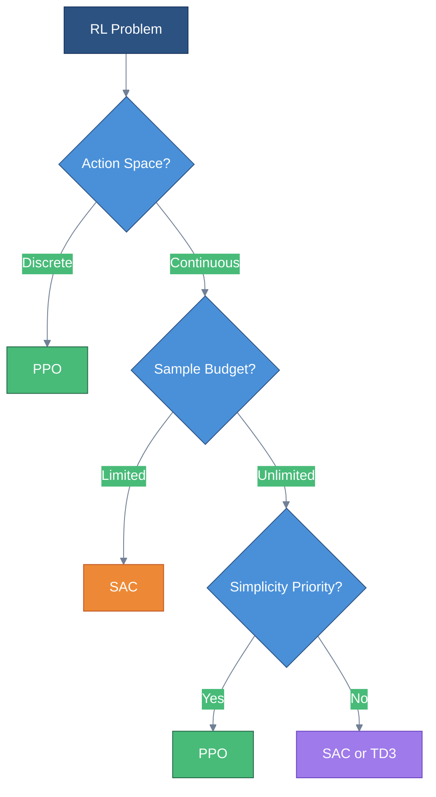

# PPO & Modern Policy Optimization

> **The industry standard** — stable, sample-efficient policy learning

---

## One-Sentence Summary

PPO constrains policy updates using a clipped surrogate objective, achieving TRPO-level stability without the computational overhead of KL-constrained optimization.

---

## Why Trust Regions Matter

### The Policy Gradient Instability Problem

Vanilla policy gradient methods suffer from a critical flaw: **unconstrained updates can catastrophically degrade performance**.

When we compute the gradient:

$$\nabla_\theta J(\theta) = \mathbb{E}_{\pi_\theta}\left[\nabla_\theta \log \pi_\theta(a|s) \cdot A^{\pi}(s, a)\right]$$

A large gradient step can push the policy far from the current distribution. Unlike supervised learning where small errors are recoverable, a bad policy update in RL compounds: the agent collects worse data, which leads to worse gradients, creating a **death spiral**.


### The Trust Region Insight

The core insight: **limit how much the policy can change per update**. If we stay within a "trust region" where our gradient estimates are reliable, training becomes stable.

Mathematically, we want to maximize the expected improvement while constraining policy divergence:

$$\text{maximize } \mathbb{E}\left[\frac{\pi_\theta(a|s)}{\pi_{\theta_{old}}(a|s)} A^{\pi_{\theta_{old}}}(s, a)\right]$$

$$\text{subject to } D_{KL}(\pi_{\theta_{old}} \| \pi_\theta) \leq \delta$$

This is the foundation of modern policy optimization.

---

## TRPO: Trust Region Policy Optimization

### The KL-Constrained Objective

TRPO (Schulman et al., 2015) formalizes the trust region idea using KL divergence as the constraint:

$$\text{maximize } \mathcal{L}(\theta) = \mathbb{E}_t\left[r_t(\theta) \hat{A}_t\right]$$

$$\text{subject to } \mathbb{E}_t\left[D_{KL}(\pi_{\theta_{old}}(\cdot|s_t) \| \pi_\theta(\cdot|s_t))\right] \leq \delta$$

Where the **probability ratio** is:

$$r_t(\theta) = \frac{\pi_\theta(a_t|s_t)}{\pi_{\theta_{old}}(a_t|s_t)}$$

### Why TRPO Works

TRPO guarantees **monotonic improvement** under certain conditions. The constraint ensures:

1. **Bounded distribution shift** — new policy stays close to old policy
2. **Valid importance sampling** — gradient estimates remain accurate
3. **Stable training** — no catastrophic policy collapse

### TRPO's Computational Burden

The problem: solving a constrained optimization requires computing the **Fisher Information Matrix** and performing **conjugate gradient descent** for each update.

```
For each policy update:
    1. Compute policy gradient g
    2. Estimate Fisher matrix F (expensive!)
    3. Solve F^{-1}g using conjugate gradient
    4. Line search to find step size satisfying KL constraint
```

This is computationally expensive and complex to implement, motivating PPO.

---

## PPO: Proximal Policy Optimization

### The Clipped Surrogate Objective

PPO (Schulman et al., 2017) achieves similar stability to TRPO with a remarkably simple change: **clip the objective function** instead of adding constraints.

The PPO-Clip objective:

$$L^{CLIP}(\theta) = \mathbb{E}_t\left[\min\left(r_t(\theta)\hat{A}_t, \text{clip}(r_t(\theta), 1-\epsilon, 1+\epsilon)\hat{A}_t\right)\right]$$

Where:
- $r_t(\theta) = \frac{\pi_\theta(a_t|s_t)}{\pi_{\theta_{old}}(a_t|s_t)}$ is the probability ratio
- $\hat{A}_t$ is the advantage estimate (typically from GAE)
- $\epsilon$ is the clipping hyperparameter (typically 0.1-0.2)


### How Clipping Provides Trust Regions

The clipping mechanism creates an **implicit trust region**:

| Scenario | $r_t(\theta)$ | Effect |
|----------|---------------|--------|
| Good action ($A_t > 0$), ratio too high | $r_t > 1 + \epsilon$ | Gradient clipped, prevents over-optimization |
| Good action ($A_t > 0$), ratio in range | $1-\epsilon \leq r_t \leq 1+\epsilon$ | Normal gradient |
| Bad action ($A_t < 0$), ratio too low | $r_t < 1 - \epsilon$ | Gradient clipped, prevents over-correction |
| Bad action ($A_t < 0$), ratio in range | $1-\epsilon \leq r_t \leq 1+\epsilon$ | Normal gradient |

The minimum in the objective ensures:
- For **positive advantages**: we clip when the ratio exceeds $1 + \epsilon$
- For **negative advantages**: we clip when the ratio drops below $1 - \epsilon$

This prevents the policy from moving too far in either direction.


### PPO in Practice

The full PPO objective includes additional terms:

$$L(\theta) = L^{CLIP}(\theta) - c_1 L^{VF}(\theta) + c_2 S[\pi_\theta](s_t)$$

Where:
- $L^{VF}$ is the value function loss (for actor-critic)
- $S[\pi_\theta]$ is an entropy bonus for exploration
- $c_1, c_2$ are coefficients (typically $c_1 = 0.5$, $c_2 = 0.01$)

**Key hyperparameters:**

| Parameter | Typical Value | Purpose |
|-----------|---------------|---------|
| $\epsilon$ (clip range) | 0.1 - 0.2 | Trust region size |
| Learning rate | $3 \times 10^{-4}$ | Step size |
| GAE $\lambda$ | 0.95 | Advantage estimation bias-variance |
| Epochs per batch | 3-10 | Number of passes over collected data |
| Mini-batch size | 64-4096 | Batch size for gradient updates |

---

## Why PPO is the Industry Standard

### Simplicity + Performance

PPO dominates practical RL for several reasons:

1. **Simple implementation** — just a few lines of clipping code
2. **First-order optimization** — standard gradient descent, no Hessian/Fisher
3. **Sample efficiency** — multiple epochs over collected data
4. **Robust to hyperparameters** — works well with default settings
5. **Parallelizable** — easy to scale across workers


### Industry Adoption

PPO (or variants) powers:
- **OpenAI Five** — Dota 2 AI
- **ChatGPT RLHF** — language model alignment
- **Robotics** — manipulation and locomotion
- **Game AI** — Atari, continuous control benchmarks

### When to Use PPO

| Use Case | Recommendation |
|----------|----------------|
| General continuous control | PPO (default choice) |
| Discrete action spaces | PPO works well |
| RLHF / LLM training | PPO (standard approach) |
| High-dimensional observations | PPO + CNN/Transformer |
| Offline RL | Consider other methods (CQL, IQL) |
| Maximum sample efficiency needed | SAC may be better |

---

## SAC: Soft Actor-Critic

### Maximum Entropy RL

SAC (Haarnoja et al., 2018) takes a different approach: instead of constraining policy updates, it encourages exploration through an **entropy bonus**.

The SAC objective maximizes expected return plus entropy:

$$J(\pi) = \sum_{t=0}^{T} \mathbb{E}_{(s_t, a_t) \sim \rho_\pi}\left[r(s_t, a_t) + \alpha \mathcal{H}(\pi(\cdot|s_t))\right]$$

Where $\mathcal{H}(\pi(\cdot|s_t)) = -\mathbb{E}_{a \sim \pi}[\log \pi(a|s_t)]$ is the policy entropy.

### Why Entropy Matters

The entropy bonus has profound effects:

1. **Exploration** — high-entropy policies try diverse actions
2. **Robustness** — stochastic policies are less brittle
3. **Multi-modality** — can maintain multiple good behaviors
4. **Stability** — prevents premature convergence to deterministic policies


### SAC Architecture

SAC is an **off-policy** actor-critic method with:
- **Two Q-networks** (for double Q-learning, reduces overestimation)
- **One policy network** (outputs mean and std of Gaussian)
- **Automatic temperature tuning** ($\alpha$ learned to hit target entropy)

### SAC vs PPO

| Aspect | PPO | SAC |
|--------|-----|-----|
| On/Off-policy | On-policy | Off-policy |
| Sample efficiency | Lower | Higher |
| Stability | Very stable | Stable |
| Exploration | Entropy bonus (optional) | Core mechanism |
| Continuous actions | Supported | Designed for |
| Discrete actions | Native support | Requires modification |
| Implementation | Simple | Moderate |

---

## Algorithm Selection Guide



### Quick Decision Matrix

| Scenario | Best Choice | Why |
|----------|-------------|-----|
| RLHF for LLMs | PPO | Standard, well-tested |
| Robotics sim-to-real | SAC | Sample efficiency |
| Game AI (discrete) | PPO | Native discrete support |
| Continuous control benchmark | SAC/TD3 | Higher final performance |
| First RL project | PPO | Simplicity, robustness |
| Real robot (limited samples) | SAC | Off-policy efficiency |

---

## Interview Questions

### Q1: "Explain why PPO uses clipping instead of a KL constraint like TRPO."

> "TRPO enforces a hard KL divergence constraint, which requires expensive second-order optimization — computing the Fisher information matrix and using conjugate gradient descent for each update.
>
> PPO achieves similar stability through a much simpler mechanism: clipping the probability ratio. The clipped objective:
>
> $$L^{CLIP}(\theta) = \mathbb{E}\left[\min\left(r_t(\theta)\hat{A}_t, \text{clip}(r_t(\theta), 1-\epsilon, 1+\epsilon)\hat{A}_t\right)\right]$$
>
> When the ratio $r_t$ moves outside $[1-\epsilon, 1+\epsilon]$, the gradient becomes zero — this implicitly creates a trust region. The key insight is that clipping is a first-order operation requiring only standard gradient descent, making PPO orders of magnitude faster to compute while maintaining similar stability guarantees.
>
> Empirically, PPO matches or exceeds TRPO performance on most benchmarks while being much simpler to implement and tune."

### Q2: "Why does SAC include an entropy bonus, and how does it differ from PPO's exploration strategy?"

> "SAC uses entropy maximization as a core objective, not just for exploration but as part of the fundamental optimization goal:
>
> $$J(\pi) = \mathbb{E}\left[\sum_t r_t + \alpha \mathcal{H}(\pi(\cdot|s_t))\right]$$
>
> This has several effects:
> 1. **Principled exploration**: High entropy means trying diverse actions proportional to their Q-values
> 2. **Robustness**: Stochastic policies handle uncertainty better than deterministic ones
> 3. **Multi-modality**: The policy can maintain multiple good solutions rather than collapsing to one
>
> PPO's exploration is typically more ad-hoc — adding a small entropy bonus ($c_2 S[\pi]$) to prevent premature convergence, but it's not central to the algorithm.
>
> The key difference: SAC is **off-policy** (uses replay buffer), so the entropy bonus helps ensure continued exploration of the state space. PPO is **on-policy** (discards old data), so exploration comes naturally from collecting new trajectories with the current policy."

### Q3: "When would you choose SAC over PPO for a production system?"

> "I'd choose SAC over PPO in these scenarios:
>
> **1. Sample efficiency is critical**: SAC is off-policy and can reuse experience from a replay buffer. If each environment interaction is expensive (real robots, expensive simulations), SAC's 2-5x better sample efficiency matters.
>
> **2. Continuous action spaces**: SAC was specifically designed for continuous control with Gaussian policies. While PPO handles continuous actions, SAC often achieves higher asymptotic performance.
>
> **3. Need for exploration in sparse rewards**: SAC's entropy maximization provides principled exploration even without reward shaping.
>
> **I'd stick with PPO when:**
> - Actions are discrete (SAC requires modifications)
> - Implementation simplicity is paramount
> - Using RLHF for language models (established practice)
> - Parallelization across many workers is needed (on-policy scales better)
>
> **Practical note**: For most problems, try PPO first. Switch to SAC if sample efficiency becomes a bottleneck or if you need better final performance on continuous control tasks."

---

## Quick Reference Card

```
PPO ESSENTIALS
---------------------------------------------------
Objective:   L^CLIP = E[min(r_t * A_t, clip(r_t, 1-e, 1+e) * A_t)]
Ratio:       r_t = pi_new(a|s) / pi_old(a|s)
Clip range:  epsilon = 0.1 - 0.2
Key insight: Clipping = implicit trust region

ALGORITHM COMPARISON
---------------------------------------------------
           | PPO         | SAC         | TRPO
-----------+-------------+-------------+------------
Policy     | On-policy   | Off-policy  | On-policy
Stability  | Very high   | High        | Very high
Efficiency | Medium      | High        | Medium
Complexity | Simple      | Medium      | Complex
Actions    | Any         | Continuous  | Any

SAC ESSENTIALS
---------------------------------------------------
Objective:  J = E[sum(r_t + alpha * H(pi))]
Entropy:    H(pi) = -E[log pi(a|s)]
Key insight: Entropy bonus enables robust exploration

HYPERPARAMETERS (PPO)
---------------------------------------------------
Clip epsilon:    0.1 - 0.2
Learning rate:   3e-4
GAE lambda:      0.95
Epochs/batch:    3 - 10
Entropy coeff:   0.01

WHEN TO USE WHAT
---------------------------------------------------
PPO:  Default choice, discrete actions, RLHF, simplicity
SAC:  Sample efficiency, continuous control, robotics
TRPO: When you need formal guarantees (rare in practice)
```

---

## Key Takeaways

1. **Trust regions prevent catastrophic policy updates** — constraining how much the policy can change per update ensures stable training and prevents death spirals.

2. **PPO's clipped objective is brilliantly simple** — instead of solving constrained optimization like TRPO, clipping the probability ratio achieves similar stability with first-order gradients only.

3. **The probability ratio $r_t(\theta)$ is the key quantity** — it measures how much the new policy differs from the old policy for each action, enabling importance sampling and stability control.

4. **SAC trades complexity for sample efficiency** — by being off-policy with entropy maximization, SAC can achieve better performance with fewer environment interactions.

5. **PPO is the industry default for good reason** — simple, stable, parallelizable, and effective across discrete and continuous domains. Start here unless you have specific reasons to choose otherwise.
