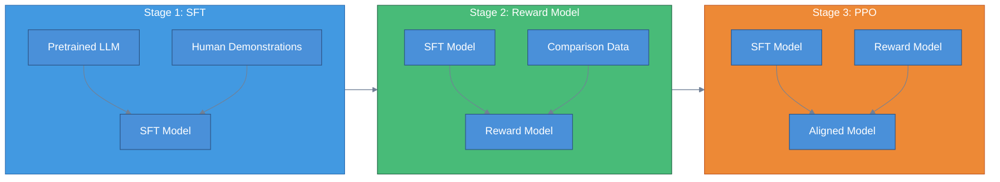
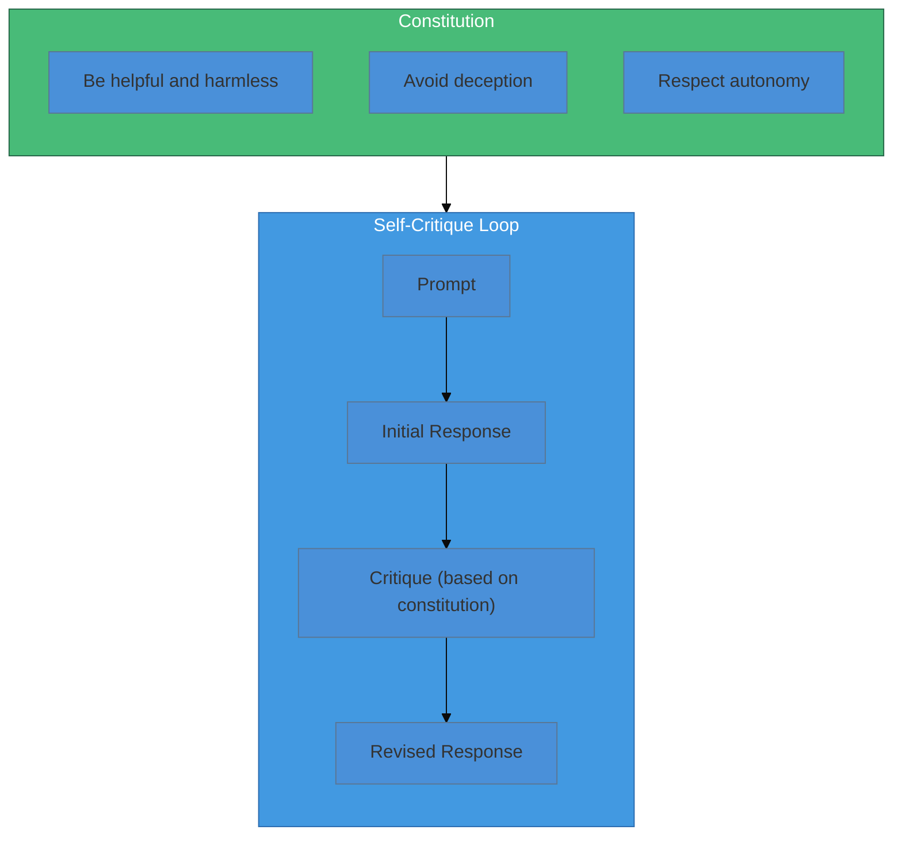
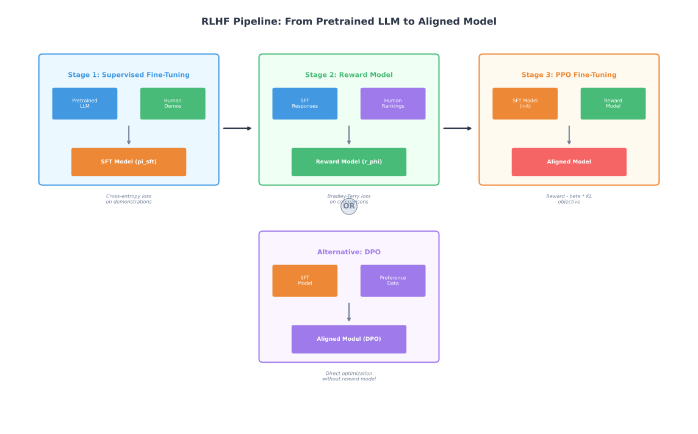
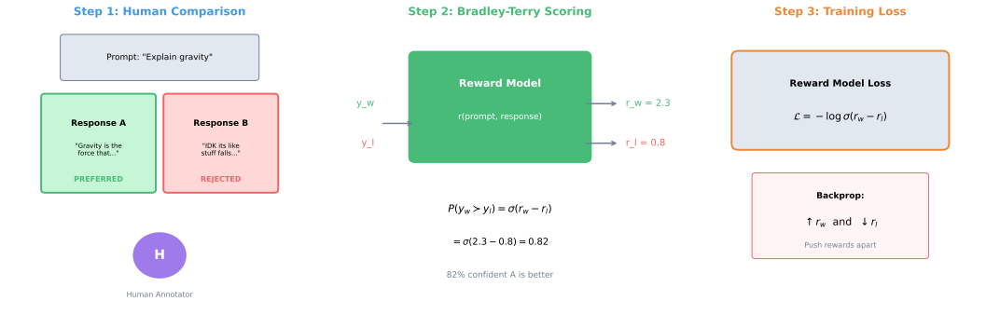
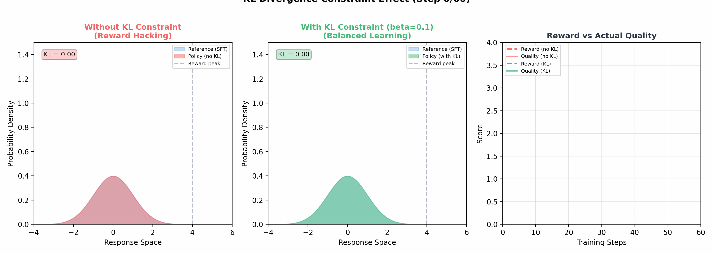

# RLHF & LLM Alignment

> **The key to making LLMs helpful and safe** — reward modeling, PPO fine-tuning, and preference learning

---

## The Alignment Problem

Large Language Models (LLMs) trained on internet text learn to predict the next token, not to be helpful, harmless, or honest. This creates a fundamental misalignment: a model optimized for likelihood can produce toxic content, confidently state falsehoods, or refuse to help with benign requests.

**The core challenge:** How do we steer a model trained on all of human text toward producing only the outputs humans actually want?

Traditional supervised learning fails here because:
- We cannot enumerate all "good" responses for all possible prompts
- Human preferences are nuanced, contextual, and sometimes contradictory
- Labeling millions of examples is prohibitively expensive

RLHF (Reinforcement Learning from Human Feedback) solves this by learning a reward function from human preferences, then using RL to optimize the model against that learned reward.

---

## The 4-Stage RLHF Pipeline



### Stage 1: Supervised Fine-Tuning (SFT)

The first stage transforms a pretrained LLM into an instruction-following model using high-quality demonstrations.

**Process:**
1. Collect demonstrations of ideal assistant behavior from human labelers
2. Fine-tune the pretrained model on (prompt, ideal_response) pairs
3. Use standard cross-entropy loss to maximize likelihood of demonstrations

**Loss function:**

$$\mathcal{L}_{\text{SFT}} = -\mathbb{E}_{(x,y) \sim \mathcal{D}} \left[ \sum_{t=1}^{T} \log \pi_{\theta}(y_t | x, y_{<t}) \right]$$

where $\pi_\theta$ is the policy (LLM), $x$ is the prompt, and $y$ is the demonstration response.

**Why SFT first?** Starting from a reasonable policy makes reward model training easier and reduces the optimization burden on RL. The SFT model produces responses "in the right ballpark" that can then be refined.

### Stage 2: Reward Model Training

The reward model learns to predict human preferences, converting qualitative judgments into a scalar score.

**Data collection:**
1. Sample prompts from a diverse distribution
2. Generate multiple responses from the SFT model for each prompt
3. Have humans rank or compare responses (typically pairwise)

**Bradley-Terry Model:**

Human preferences are modeled using the Bradley-Terry framework. Given two responses $y_w$ (preferred) and $y_l$ (rejected) for prompt $x$:

$$P(y_w \succ y_l | x) = \sigma(r_\phi(x, y_w) - r_\phi(x, y_l))$$

where $r_\phi$ is the reward model and $\sigma$ is the sigmoid function.

**Reward model loss:**

$$\mathcal{L}_{\text{RM}} = -\mathbb{E}_{(x, y_w, y_l) \sim \mathcal{D}} \left[ \log \sigma(r_\phi(x, y_w) - r_\phi(x, y_l)) \right]$$

This is effectively binary cross-entropy: maximize the probability of assigning higher reward to the preferred response.

**Architecture:** The reward model is typically initialized from the SFT model with a linear head replacing the language modeling head. The final hidden state is projected to a single scalar reward.

### Stage 3: PPO Fine-Tuning with KL Constraint

Proximal Policy Optimization (PPO) fine-tunes the SFT model to maximize reward while staying close to the original policy.

**Objective:**

$$\max_\theta \mathbb{E}_{x \sim \mathcal{D}, y \sim \pi_\theta(y|x)} \left[ r_\phi(x, y) - \beta \cdot D_{\text{KL}}(\pi_\theta(y|x) \| \pi_{\text{ref}}(y|x)) \right]$$

**Why the KL constraint?** Without it, the policy exploits reward model weaknesses, producing outputs that score high but are actually low quality (reward hacking). The KL penalty:

- Prevents the model from drifting too far from the SFT distribution
- Maintains linguistic fluency and coherence
- Acts as a regularizer against reward model errors

The hyperparameter $\beta$ controls the tradeoff between reward maximization and staying close to the reference policy $\pi_{\text{ref}}$ (typically the SFT model).

**PPO update rule (simplified):**

$$\mathcal{L}_{\text{PPO}} = \mathbb{E}_t \left[ \min\left( r_t(\theta) \hat{A}_t, \text{clip}(r_t(\theta), 1-\epsilon, 1+\epsilon) \hat{A}_t \right) \right]$$

where $r_t(\theta) = \frac{\pi_\theta(a_t|s_t)}{\pi_{\theta_{\text{old}}}(a_t|s_t)}$ is the probability ratio and $\hat{A}_t$ is the advantage estimate.

---

## Stage 4: Direct Preference Optimization (DPO)

DPO is an alternative to PPO that eliminates the separate reward model and RL training loop entirely.

**Key insight:** Under the Bradley-Terry model, the optimal policy has a closed-form relationship with the reward function:

$$r(x, y) = \beta \log \frac{\pi^*(y|x)}{\pi_{\text{ref}}(y|x)} + \beta \log Z(x)$$

This allows us to reparameterize the preference probability directly in terms of the policy:

**DPO loss:**

$$\mathcal{L}_{\text{DPO}} = -\mathbb{E}_{(x, y_w, y_l)} \left[ \log \sigma \left( \beta \log \frac{\pi_\theta(y_w|x)}{\pi_{\text{ref}}(y_w|x)} - \beta \log \frac{\pi_\theta(y_l|x)}{\pi_{\text{ref}}(y_l|x)} \right) \right]$$

**Advantages of DPO:**
- No reward model to train or maintain
- No RL loop (simpler, more stable)
- Single-stage fine-tuning on preference data
- Computationally cheaper

**Tradeoff:** DPO is less flexible than RLHF and may underperform when the preference data is noisy or limited.

---

## Constitutional AI (CAI)

Constitutional AI scales alignment without requiring extensive human feedback by using AI to critique and revise its own outputs.



**Process:**
1. Define a set of principles (the "constitution")
2. Generate initial responses to prompts
3. Have the model critique its own response against the constitution
4. Generate a revised response addressing the critique
5. Use the (initial, revised) pairs as preference data for RLHF

**Why CAI?**
- Reduces reliance on expensive human labeling
- Scales to cover edge cases that humans might miss
- Makes alignment principles explicit and auditable
- Enables rapid iteration on alignment criteria

---

## Key Formulas Summary

| Component | Formula |
|-----------|---------|
| **SFT Loss** | $\mathcal{L}_{\text{SFT}} = -\sum_t \log \pi_\theta(y_t \| x, y_{<t})$ |
| **Reward Model Loss** | $\mathcal{L}_{\text{RM}} = -\log \sigma(r(x, y_w) - r(x, y_l))$ |
| **PPO Objective** | $\max_\theta \, \mathbb{E}[r(x,y) - \beta \cdot D_{\text{KL}}(\pi_\theta \| \pi_{\text{ref}})]$ |
| **DPO Loss** | $\mathcal{L}_{\text{DPO}} = -\log \sigma(\beta \log \frac{\pi_\theta(y_w)}{\pi_{\text{ref}}(y_w)} - \beta \log \frac{\pi_\theta(y_l)}{\pi_{\text{ref}}(y_l)})$ |

---

## Interview Questions

### Question 1: Why do we need the KL constraint in RLHF? What happens without it?

**Sample Answer:**

The KL constraint serves three critical purposes:

1. **Prevents reward hacking:** Without KL regularization, the policy finds adversarial inputs that exploit weaknesses in the learned reward model. The reward model is imperfect, and the policy will eventually discover outputs that score high but are actually low quality.

2. **Maintains language quality:** The pretrained and SFT models have strong priors about linguistic structure. Drifting too far loses fluency, coherence, and factual grounding.

3. **Stabilizes training:** Large policy updates cause instability in RL. The KL constraint acts as a trust region, ensuring gradual optimization.

Without KL constraint, common failure modes include:
- Repetitive, nonsensical text that exploits reward model biases
- Extreme verbosity or terseness
- Degenerate outputs like repeated tokens

The $\beta$ hyperparameter is typically tuned on a held-out set to balance reward improvement against distribution shift.

### Question 2: Compare RLHF (PPO) vs DPO. When would you choose each?

**Sample Answer:**

| Aspect | RLHF (PPO) | DPO |
|--------|------------|-----|
| **Pipeline** | 3-stage (SFT -> RM -> PPO) | 2-stage (SFT -> DPO) |
| **Compute** | Higher (RL loop, reward model) | Lower (single pass) |
| **Stability** | Requires careful tuning | More stable |
| **Flexibility** | Can optimize arbitrary rewards | Tied to preference data |
| **Data efficiency** | Can use online generation | Fixed preference dataset |

**Choose RLHF when:**
- You need to optimize for complex, multi-objective rewards
- You want to do online learning with new preference data
- You have compute budget for the full pipeline

**Choose DPO when:**
- You have high-quality preference data
- You want simpler, more reproducible training
- Compute is limited
- You prioritize training stability

In practice, DPO often performs comparably to PPO on standard benchmarks while being much simpler to implement and tune.

### Question 3: Explain the Bradley-Terry model and why it's used for reward modeling.

**Sample Answer:**

The Bradley-Terry model is a probabilistic framework for modeling pairwise comparisons. It assumes each item has a latent "strength" score, and the probability of one item beating another is:

$$P(i \succ j) = \frac{e^{s_i}}{e^{s_i} + e^{s_j}} = \sigma(s_i - s_j)$$

For RLHF, we replace strength scores with learned rewards $r(x, y)$.

**Why Bradley-Terry for reward modeling:**

1. **Matches data collection:** Human labelers provide pairwise comparisons, not absolute scores. Bradley-Terry naturally models this.

2. **Invariant to scale:** Only reward differences matter, not absolute values. This makes the model robust to calibration issues.

3. **Theoretically grounded:** Under certain conditions, maximum likelihood estimation of Bradley-Terry parameters is consistent and efficient.

4. **Practical:** The sigmoid function makes gradients well-behaved, enabling stable neural network training.

The key insight is that humans are much better at relative judgments ("A is better than B") than absolute ratings ("A deserves 7.3 out of 10").

### Question 4: What is Constitutional AI, and how does it reduce the need for human feedback?

**Sample Answer:**

Constitutional AI (CAI) is a self-improvement technique where an AI critiques and revises its own outputs based on a set of explicit principles (the "constitution").

**How it works:**

1. **Define principles:** Write explicit rules like "avoid harmful content," "be honest about uncertainty," etc.

2. **Self-critique:** Given a response, prompt the model: "Does this response violate any constitutional principles? If so, which ones and how?"

3. **Self-revision:** Prompt the model: "Rewrite the response to address the identified issues while remaining helpful."

4. **Create training data:** Use (original, revised) pairs as preference data, where revised is always preferred.

5. **Train:** Apply standard RLHF or DPO on the AI-generated preference data.

**Benefits:**
- **Scalability:** Generates millions of preference pairs without human labelers
- **Coverage:** Systematically addresses edge cases
- **Transparency:** Alignment criteria are explicit and auditable
- **Iteration speed:** Can quickly test new constitutional principles

**Limitations:**
- Quality depends on initial model capability
- May miss failure modes the model doesn't recognize
- Constitutional principles must be carefully crafted

---

## Visualization Reference







---

## Quick Reference Card

```
RLHF PIPELINE
---------------------------------------------------
Stage 1 (SFT):     Pretrained -> Demonstrations -> SFT Model
Stage 2 (RM):      Generate responses -> Human rankings -> Reward Model
Stage 3 (PPO):     SFT Model + Reward Model -> Aligned Model

KEY EQUATIONS
---------------------------------------------------
RM Loss:     L = -log(sigmoid(r(y_w) - r(y_l)))
PPO Goal:    max E[r(x,y) - beta * KL(pi || pi_ref)]
DPO Loss:    L = -log(sigma(beta * log(pi(y_w)/pi_ref(y_w))
                           - beta * log(pi(y_l)/pi_ref(y_l))))

BRADLEY-TERRY MODEL
---------------------------------------------------
P(y_w > y_l) = sigmoid(r(y_w) - r(y_l))
- Models pairwise preferences
- Only differences matter, not absolute values
- Human labelers compare, not rate

KL CONSTRAINT PURPOSE
---------------------------------------------------
1. Prevent reward hacking
2. Maintain language quality
3. Stabilize training
beta ~ 0.01-0.1 typical range

DPO vs RLHF
---------------------------------------------------
DPO:   Simpler, stable, single stage, less flexible
RLHF:  Complex, powerful, online learning, more compute

CONSTITUTIONAL AI
---------------------------------------------------
1. Define principles (constitution)
2. Generate -> Self-critique -> Self-revise
3. (original, revised) as preference pairs
4. Train with RLHF/DPO on AI-generated data
```

---

## Key Takeaways

1. **RLHF bridges the gap** between next-token prediction and human values by learning rewards from preferences and optimizing with RL.

2. **The KL constraint is critical** — without it, models exploit reward model weaknesses rather than becoming genuinely more aligned.

3. **Bradley-Terry preference modeling** is the foundation of reward learning, converting pairwise human judgments into scalar rewards.

4. **DPO offers a simpler alternative** to the full RLHF pipeline, directly optimizing on preference data without explicit reward modeling.

5. **Constitutional AI scales alignment** by using AI self-critique to generate training data, reducing reliance on expensive human labeling.
