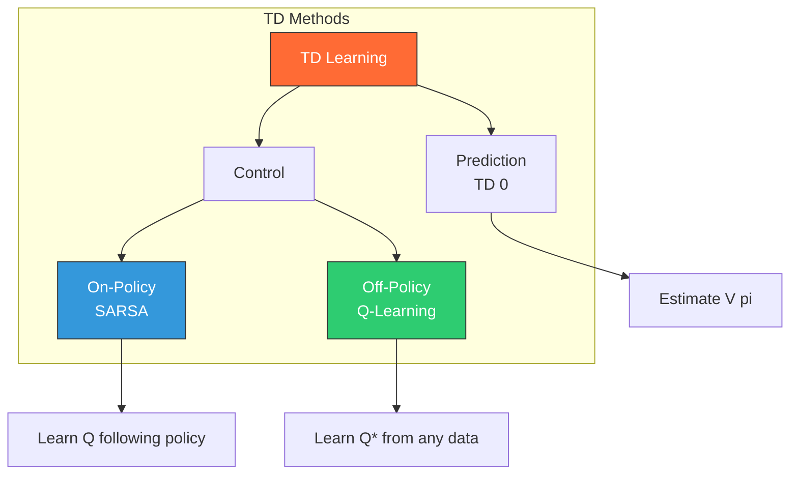

# Temporal Difference Learning

> **Learning from incomplete episodes** — Q-learning, SARSA, and bootstrapping

---

## One-Sentence Summary

Temporal Difference (TD) learning combines Monte Carlo's model-free learning with Dynamic Programming's bootstrapping to update value estimates after each step, without waiting for episode completion.

---

## Core Concept: Bootstrapping

TD learning's key insight: **update estimates based on other estimates** rather than waiting for final outcomes.

### Monte Carlo vs Dynamic Programming vs TD

| Method | Updates When | Requires Model | Uses |
|--------|--------------|----------------|------|
| **Monte Carlo** | End of episode | No | Actual returns |
| **Dynamic Programming** | Any time | Yes | Expected returns |
| **TD Learning** | Each step | No | Estimated returns |

TD combines the best of both worlds:
- **From MC**: Learn directly from experience (model-free)
- **From DP**: Update estimates using other estimates (bootstrapping)


---

## TD(0): The Foundation

### The TD Update Rule

$$V(S_t) \leftarrow V(S_t) + \alpha \left[ \underbrace{R_{t+1} + \gamma V(S_{t+1})}_{\text{TD Target}} - V(S_t) \right]$$

Where:
- $\alpha$ = learning rate
- $\gamma$ = discount factor
- $R_{t+1} + \gamma V(S_{t+1})$ = TD target (bootstrapped estimate)
- $R_{t+1} + \gamma V(S_{t+1}) - V(S_t)$ = **TD error** $(\delta_t)$

### TD Error: The Learning Signal

The TD error $\delta_t$ measures the **surprise** between our prediction and what we observe:

$$\delta_t = R_{t+1} + \gamma V(S_{t+1}) - V(S_t)$$

| TD Error | Meaning | Update Direction |
|----------|---------|------------------|
| $\delta_t > 0$ | Outcome better than expected | Increase $V(S_t)$ |
| $\delta_t < 0$ | Outcome worse than expected | Decrease $V(S_t)$ |
| $\delta_t = 0$ | Prediction was accurate | No change |


---

## SARSA: On-Policy TD Control

SARSA learns action-values (Q-values) while following the current policy.

### The SARSA Update

$$Q(S_t, A_t) \leftarrow Q(S_t, A_t) + \alpha \left[ R_{t+1} + \gamma Q(S_{t+1}, A_{t+1}) - Q(S_t, A_t) \right]$$

**Name origin**: **S**tate, **A**ction, **R**eward, **S**tate, **A**ction

### SARSA Algorithm

```
Initialize Q(s, a) arbitrarily
For each episode:
    Initialize S
    Choose A from S using policy derived from Q (e.g., epsilon-greedy)
    For each step of episode:
        Take action A, observe R, S'
        Choose A' from S' using policy derived from Q
        Q(S, A) <- Q(S, A) + alpha * [R + gamma * Q(S', A') - Q(S, A)]
        S <- S'
        A <- A'
    Until S is terminal
```

### On-Policy Behavior

SARSA is **on-policy** because it updates Q using the action $A'$ that the policy **actually selects**, including exploratory actions.

**Consequence**: SARSA learns a **safer** policy that accounts for exploration behavior.

---

## Q-Learning: Off-Policy TD Control

Q-learning learns the optimal action-values regardless of the policy being followed.

### The Q-Learning Update

$$Q(S_t, A_t) \leftarrow Q(S_t, A_t) + \alpha \left[ R_{t+1} + \gamma \max_{a} Q(S_{t+1}, a) - Q(S_t, A_t) \right]$$

**Key difference from SARSA**: Uses $\max_a Q(S', a)$ instead of $Q(S', A')$

### Q-Learning Algorithm

```
Initialize Q(s, a) arbitrarily
For each episode:
    Initialize S
    For each step of episode:
        Choose A from S using policy derived from Q (e.g., epsilon-greedy)
        Take action A, observe R, S'
        Q(S, A) <- Q(S, A) + alpha * [R + gamma * max_a Q(S', a) - Q(S, A)]
        S <- S'
    Until S is terminal
```

### Off-Policy Behavior

Q-learning is **off-policy** because:
- **Behavior policy**: The policy used to explore (e.g., epsilon-greedy)
- **Target policy**: The greedy policy it learns (always picks max Q)

These can be different, enabling learning from any exploration strategy.

---

## SARSA vs Q-Learning: The Cliff Walking Example


### The Setup

A grid world with:
- Start state (bottom-left)
- Goal state (bottom-right)
- Cliff along the bottom (stepping in = large negative reward, return to start)
- Two viable paths: safe (along top) vs optimal (along cliff edge)

### Behavioral Differences

| Algorithm | Learned Policy | Why |
|-----------|---------------|-----|
| **SARSA** | Safe path (top) | Accounts for epsilon-greedy exploration near cliff |
| **Q-Learning** | Optimal path (edge) | Learns optimal regardless of exploration danger |

**SARSA** learns the safer path because it knows that during exploration, the agent might accidentally fall off the cliff. Q-learning ignores this and learns the mathematically optimal path.

### When to Use Each

| Use SARSA When | Use Q-Learning When |
|---------------|---------------------|
| Safety matters during learning | Only final policy matters |
| Online deployment | Offline learning, then deploy |
| Robot that can damage itself | Simulation with no real consequence |
| Conservative behavior preferred | Pure optimality desired |

---

## Q-Table Evolution


The animation shows how Q-values propagate backward from the goal through the state space as the agent explores.

---

## Experience Replay

A technique that dramatically improves sample efficiency in TD learning.

### The Problem

TD updates are correlated (consecutive states are similar), leading to:
- Unstable learning
- Forgetting earlier experiences
- Inefficient use of data

### The Solution

Store experiences in a **replay buffer** and sample randomly:

$$\text{Buffer} = \{(s_1, a_1, r_1, s_1'), (s_2, a_2, r_2, s_2'), \ldots\}$$

**Benefits**:
1. **Breaks correlations**: Random sampling decorrelates updates
2. **Data efficiency**: Reuse each experience multiple times
3. **Stability**: Prevents catastrophic forgetting

### Implementation Sketch

```python
# Store experience
buffer.append((state, action, reward, next_state, done))

# Sample random batch
batch = random.sample(buffer, batch_size)

# Update Q for each experience in batch
for (s, a, r, s_next, done) in batch:
    target = r + gamma * max(Q[s_next]) * (1 - done)
    Q[s][a] += alpha * (target - Q[s][a])
```

---

## Convergence Properties

### Theoretical Guarantees

| Algorithm | Converges To | Conditions |
|-----------|-------------|------------|
| **TD(0)** | True value function | Under policy, infinite visits |
| **SARSA** | Optimal Q* | GLIE, Robbins-Monro |
| **Q-Learning** | Optimal Q* | All (s,a) visited infinitely |

**GLIE**: Greedy in the Limit with Infinite Exploration
- All state-action pairs visited infinitely often
- Policy converges to greedy as $t \to \infty$

**Robbins-Monro conditions** (on learning rate $\alpha_t$):

$$\sum_{t=1}^{\infty} \alpha_t = \infty \quad \text{and} \quad \sum_{t=1}^{\infty} \alpha_t^2 < \infty$$

Common choice: $\alpha_t = 1/t$ or fixed small $\alpha$ with decaying exploration.

### Practical Considerations

| Factor | Effect on Convergence |
|--------|----------------------|
| Learning rate too high | Oscillation, instability |
| Learning rate too low | Slow convergence |
| Exploration too high | Slow convergence, noisy Q-values |
| Exploration too low | Suboptimal policy (stuck in local optimum) |

---

## Comparison Summary



| Aspect | SARSA | Q-Learning |
|--------|-------|------------|
| **Policy** | On-policy | Off-policy |
| **Target** | $Q(S', A')$ | $\max_a Q(S', a)$ |
| **Behavior** | Conservative | Risk-neutral |
| **Data Reuse** | Limited | Experience replay friendly |
| **Convergence** | To policy's Q | To optimal Q* |

---

## Interview Questions

### Q1: "Explain the difference between SARSA and Q-Learning."

> "Both SARSA and Q-learning are TD control algorithms that learn Q-values, but they differ in their target calculation:
>
> **SARSA (on-policy)**:
> - Target: $R + \gamma Q(S', A')$ where $A'$ is the action actually taken
> - Learns Q-values for the policy being followed
> - More conservative because it accounts for exploratory actions
>
> **Q-Learning (off-policy)**:
> - Target: $R + \gamma \max_a Q(S', a)$
> - Learns optimal Q-values regardless of behavior policy
> - More sample-efficient (can use experience replay)
>
> **Example**: In cliff-walking, SARSA learns the safer path because it knows epsilon-greedy might step off the cliff. Q-learning learns the optimal path along the edge because it assumes optimal behavior."

### Q2: "What is bootstrapping in TD learning?"

> "Bootstrapping means updating estimates based on other estimates rather than waiting for actual outcomes.
>
> **Non-bootstrapping (Monte Carlo)**:
> - Wait until episode ends
> - Use actual return: $G_t = R_{t+1} + \gamma R_{t+2} + \ldots$
>
> **Bootstrapping (TD)**:
> - Update after each step
> - Use estimated return: $R_{t+1} + \gamma V(S_{t+1})$
>
> **Trade-off**:
> - MC has no bias (uses true returns) but high variance
> - TD has bias (estimates may be wrong) but lower variance
> - TD is often preferred because it learns faster and works for continuing tasks."

### Q3: "Why is experience replay important for Q-learning?"

> "Experience replay stores transitions $(s, a, r, s')$ in a buffer and samples randomly for updates.
>
> **Benefits**:
> 1. **Breaks temporal correlation**: Consecutive samples are correlated; random sampling provides i.i.d.-like data for stable learning
> 2. **Sample efficiency**: Each experience can be reused many times
> 3. **Enables off-policy learning**: Q-learning can learn from any data, including old experiences
>
> **Why Q-learning but not SARSA?**
> - Q-learning is off-policy, so it can learn from any data
> - SARSA is on-policy; old experiences may not reflect current policy's behavior
>
> **Limitation**: Requires storing potentially large buffers (memory cost)"

---

## Quick Reference Card

```
TEMPORAL DIFFERENCE LEARNING
---------------------------------------------------
TD(0):     V(S) <- V(S) + alpha * [R + gamma*V(S') - V(S)]
SARSA:     Q(S,A) <- Q(S,A) + alpha * [R + gamma*Q(S',A') - Q(S,A)]
Q-Learn:   Q(S,A) <- Q(S,A) + alpha * [R + gamma*max_a Q(S',a) - Q(S,A)]

TD ERROR (delta)
---------------------------------------------------
delta = R + gamma*V(S') - V(S)
Positive: outcome better than expected
Negative: outcome worse than expected

ON-POLICY VS OFF-POLICY
---------------------------------------------------
SARSA:     On-policy  - learns Q for behavior policy
Q-Learn:   Off-policy - learns Q* regardless of behavior

KEY PROPERTIES
---------------------------------------------------
Bootstrapping: Updates use estimates (not final returns)
Model-free:    No environment model needed
Online:        Updates after each transition

EXPERIENCE REPLAY
---------------------------------------------------
Store: (s, a, r, s', done) in buffer
Sample: Random batch for updates
Benefits: Breaks correlation, reuses data
```

---

## Further Reading

- **Sutton & Barto, Chapter 6**: Temporal-Difference Learning
- **Watkins (1989)**: Q-Learning (original paper)
- **Rummery & Niranjan (1994)**: SARSA introduction
- **Lin (1992)**: Experience Replay in RL
