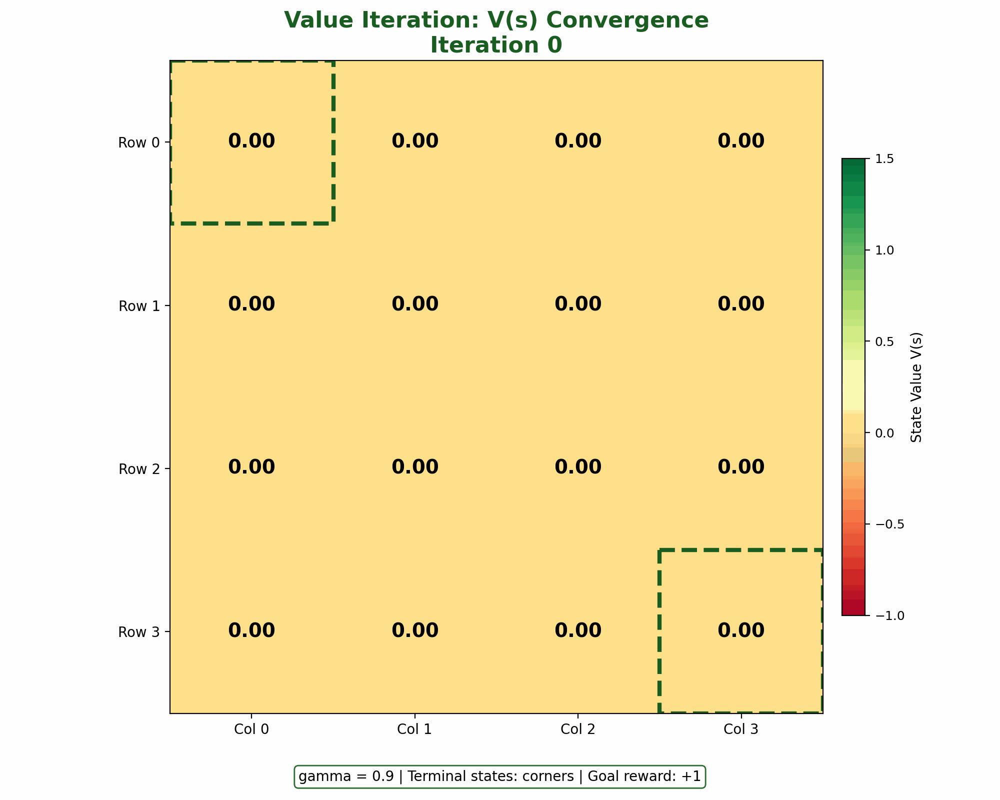
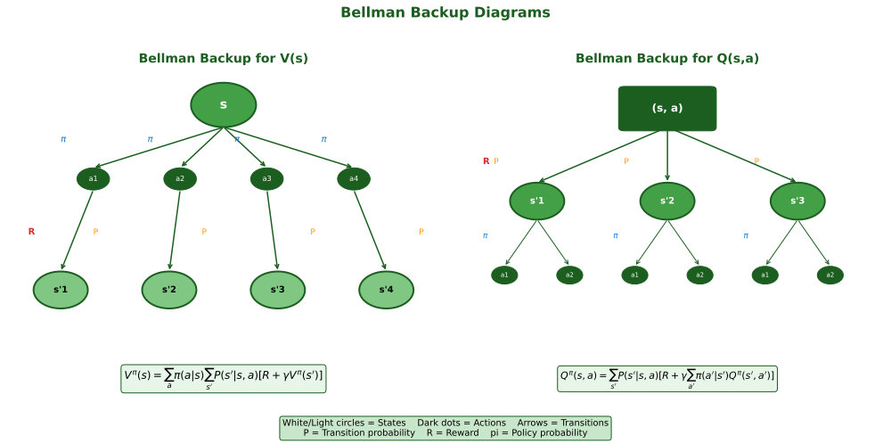
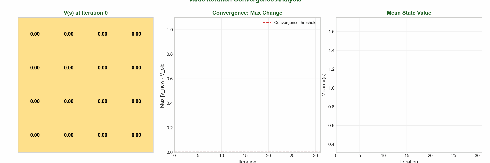

# Value Functions & Bellman Equations

> **The core mathematics of RL** — measuring how good states and actions are

---

## State Value Function V(s)

The **state value function** $V^\pi(s)$ measures the expected return starting from state $s$ and following policy $\pi$ thereafter.

$$V^\pi(s) = \mathbb{E}_\pi \left[ G_t \mid S_t = s \right] = \mathbb{E}_\pi \left[ \sum_{k=0}^{\infty} \gamma^k R_{t+k+1} \mid S_t = s \right]$$

Where $G_t$ is the return, $\gamma \in [0, 1]$ is the discount factor, and $\mathbb{E}_\pi$ denotes expectation under policy $\pi$.

Think of $V^\pi(s)$ as the "score" of a state—how valuable it is to be there. A state near the goal has high value; a state near a trap has low value.



| Property | Description |
|----------|-------------|
| Policy-dependent | Different policies yield different value functions |
| Bounded | $V^\pi(s) \in \left[\frac{R_{min}}{1-\gamma}, \frac{R_{max}}{1-\gamma}\right]$ |
| Unique | For a fixed policy, there exists a unique value function |

---

## Action Value Function Q(s, a)

The **action value function** $Q^\pi(s, a)$ measures the expected return starting from state $s$, taking action $a$, and then following policy $\pi$.

$$Q^\pi(s, a) = \mathbb{E}_\pi \left[ G_t \mid S_t = s, A_t = a \right]$$

Q-values allow action selection without a model. Given $Q^\pi(s, a)$ for all actions:

$$a^* = \arg\max_a Q^\pi(s, a)$$

This is why **Q-learning** and **DQN** focus on learning Q-values directly.

### V and Q Relationship

$$V^\pi(s) = \sum_a \pi(a|s) Q^\pi(s, a)$$

$$Q^\pi(s, a) = R(s, a) + \gamma \sum_{s'} P(s'|s, a) V^\pi(s')$$

---

## Bellman Expectation Equations

The **Bellman equations** express a recursive relationship: the value of a state depends on successor state values.

### Derivation for V(s)

Starting from $V^\pi(s) = \mathbb{E}_\pi[G_t \mid S_t = s]$ and expanding the return $G_t = R_{t+1} + \gamma G_{t+1}$:

$$V^\pi(s) = \mathbb{E}_\pi[R_{t+1} + \gamma G_{t+1} \mid S_t = s]$$

By linearity and the law of total expectation:

$$V^\pi(s) = \sum_a \pi(a|s) \sum_{s'} P(s'|s,a) \left[ R(s,a,s') + \gamma V^\pi(s') \right]$$

### Bellman Expectation Equation for Q

$$Q^\pi(s, a) = \sum_{s'} P(s'|s,a) \left[ R(s,a,s') + \gamma \sum_{a'} \pi(a'|s') Q^\pi(s', a') \right]$$

### Bellman Backup Diagram



The backup diagram shows how value "flows back" from successor states. White nodes = states; black nodes = state-action pairs.

---

## Bellman Optimality Equations

The **optimal value functions** $V^*(s)$ and $Q^*(s, a)$ represent the best possible values achievable by any policy.

$$V^*(s) = \max_\pi V^\pi(s) = \max_a Q^*(s, a)$$

**Bellman Optimality for V*:**

$$V^*(s) = \max_a \sum_{s'} P(s'|s,a) \left[ R(s,a,s') + \gamma V^*(s') \right]$$

**Bellman Optimality for Q*:**

$$Q^*(s, a) = \sum_{s'} P(s'|s,a) \left[ R(s,a,s') + \gamma \max_{a'} Q^*(s', a') \right]$$

The key difference from expectation equations: instead of averaging over actions, we take the **maximum**.

### Relationship Between V* and Q*

$$V^*(s) = \max_a Q^*(s, a) \quad \text{and} \quad Q^*(s, a) = R(s, a) + \gamma \sum_{s'} P(s'|s, a) V^*(s')$$

Once we have $Q^*$, the optimal policy is: $\pi^*(s) = \arg\max_a Q^*(s, a)$

---

## Policy Evaluation and Policy Improvement

### Policy Evaluation

Compute $V^\pi(s)$ by iteratively applying the Bellman expectation equation:

$$V_{k+1}(s) = \sum_a \pi(a|s) \sum_{s'} P(s'|s,a) \left[ R(s,a,s') + \gamma V_k(s') \right]$$

### Policy Improvement

Given $V^\pi$, construct a better policy by acting greedily:

$$\pi'(s) = \arg\max_a \sum_{s'} P(s'|s,a) \left[ R(s,a,s') + \gamma V^\pi(s') \right]$$

**Policy Improvement Theorem:** $Q^\pi(s, \pi'(s)) \geq V^\pi(s) \implies V^{\pi'}(s) \geq V^\pi(s)$

### Policy Iteration

```
1. Initialize V(s), pi(s) arbitrarily
2. Repeat until policy stable:
   a. Policy Evaluation: Compute V^pi
   b. Policy Improvement: pi' = greedy(V^pi)
   c. If pi' = pi, return (optimal); else pi <- pi'
```

---

## Value Iteration Algorithm

**Value iteration** combines evaluation and improvement into a single update:

$$V_{k+1}(s) = \max_a \sum_{s'} P(s'|s,a) \left[ R(s,a,s') + \gamma V_k(s') \right]$$

### Convergence

The Bellman optimality operator is a **contraction mapping**:

$$\| V_{k+1} - V^* \|_\infty \leq \gamma \| V_k - V^* \|_\infty$$

Convergence is geometric with rate $\gamma$.

| Aspect | Value Iteration | Policy Iteration |
|--------|-----------------|------------------|
| Update | Single sweep | Full evaluation |
| Convergence | Asymptotic | Exact in finite steps |
| Per-iteration cost | Lower | Higher |



---

## Summary Comparison

| Concept | Formula | Key Insight |
|---------|---------|-------------|
| $V^\pi(s)$ | $\mathbb{E}_\pi[G_t \mid S_t = s]$ | Expected return from state under policy |
| $Q^\pi(s,a)$ | $\mathbb{E}_\pi[G_t \mid S_t = s, A_t = a]$ | Expected return from state-action under policy |
| $V^*(s)$ | $\max_a Q^*(s,a)$ | Best achievable value from state |
| $Q^*(s,a)$ | $R + \gamma \max_{a'} Q^*(s',a')$ | Best achievable value from state-action |
| Bellman Expectation | Average over actions | Evaluates a given policy |
| Bellman Optimality | Max over actions | Finds optimal policy |

---

## Interview Questions

### Q1: When would you prefer learning V(s) vs Q(s,a)?

**Answer:**

**Prefer Q when:**
- Model-free learning (unknown transitions)
- Need direct action selection: $a^* = \arg\max_a Q(s,a)$
- Off-policy learning (Q-learning works with any data)

**Prefer V when:**
- Model is known (derive Q from V cheaply)
- Large action spaces (V has lower memory)
- Actor-Critic methods (critic often estimates V)

Key tradeoff: Q enables model-free action selection but requires $|S| \times |A|$ storage vs $|S|$ for V.

---

### Q2: Derive the Bellman equation and explain its computational benefit.

**Answer:**

From $V^\pi(s) = \mathbb{E}_\pi[G_t \mid S_t = s]$, expand $G_t = R_{t+1} + \gamma G_{t+1}$:

$$V^\pi(s) = \sum_a \pi(a|s) \sum_{s'} P(s'|s,a)[R + \gamma V^\pi(s')]$$

**Computational benefit:** Instead of simulating infinite trajectories (Monte Carlo), Bellman transforms this into a system of $n$ linear equations solvable in $O(n^3)$ or $O(n^2 k)$ via iteration. This is dynamic programming.

---

### Q3: Why does value iteration converge?

**Answer:**

The Bellman optimality operator is a **contraction**: $\| TV - TV' \|_\infty \leq \gamma \| V - V' \|_\infty$

By **Banach fixed-point theorem**, repeated application converges to the unique fixed point $V^*$.

**Convergence rate:** Error decreases as $\gamma^k$. At $\gamma = 0.9$, ~44 iterations for 100x reduction; at $\gamma = 0.99$, ~460 iterations.

**Stopping criterion:** When $\max_s |V_{k+1}(s) - V_k(s)| < \epsilon$, we have $\|V_k - V^*\|_\infty < \frac{\epsilon}{1-\gamma}$.

---

## Quick Reference Card

```
+============================================================================+
|                     VALUE FUNCTIONS CHEAT SHEET                            |
+============================================================================+
| VALUE FUNCTIONS                                                            |
|   V^pi(s) = E_pi[G_t | S_t = s]       Q^pi(s,a) = E_pi[G_t | S_t=s, A_t=a] |
|   V*(s) = max_a Q*(s,a)               Q*(s,a) = R + gamma max_a' Q*(s',a') |
+----------------------------------------------------------------------------+
| BELLMAN EQUATIONS                                                          |
|   Expectation: Average over actions   Optimality: Max over actions         |
|   V = sum_a pi(a|s) [R + gamma V']    V* = max_a [R + gamma V*']           |
+----------------------------------------------------------------------------+
| ALGORITHMS                                                                 |
|   Policy Iteration: Evaluate -> Improve -> Repeat (exact convergence)      |
|   Value Iteration: V_k+1 = max_a [R + gamma V_k] (asymptotic convergence) |
+----------------------------------------------------------------------------+
| CONVERGENCE: ||V_k - V*|| <= gamma^k ||V_0 - V*||                         |
|   gamma=0.9: ~44 iters for 100x reduction | gamma=0.99: ~460 iters        |
+============================================================================+
```

---

## Key Takeaways

1. **Value functions quantify long-term reward** — $V(s)$ for states, $Q(s,a)$ for state-action pairs. They convert the complex problem of sequential decision-making into a tractable optimization.

2. **Bellman equations provide recursive structure** — The value of a state depends only on immediate rewards and values of successor states. This enables dynamic programming solutions.

3. **Expectation vs. Optimality** — Bellman expectation equations average over a policy; Bellman optimality equations maximize. This distinction separates policy evaluation from policy optimization.

4. **Value iteration is a contraction** — Convergence is guaranteed with rate $\gamma$. Lower discount factors mean faster convergence but more myopic policies.

5. **Q-values enable model-free learning** — By learning $Q^*$ directly, algorithms like Q-learning can find optimal policies without knowing transition probabilities.

These concepts form the mathematical foundation for both tabular RL methods and modern deep RL approaches like DQN, A3C, and PPO.
