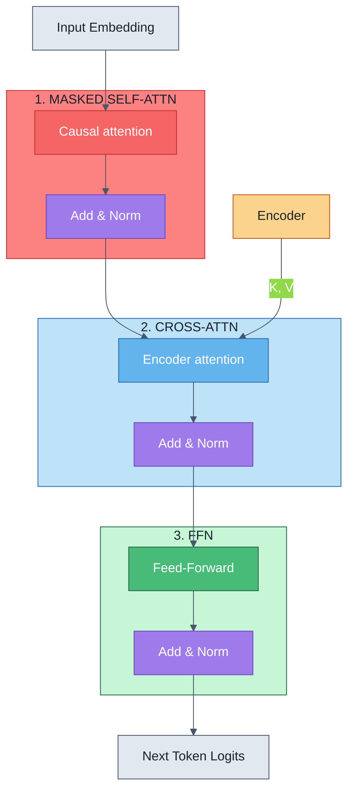
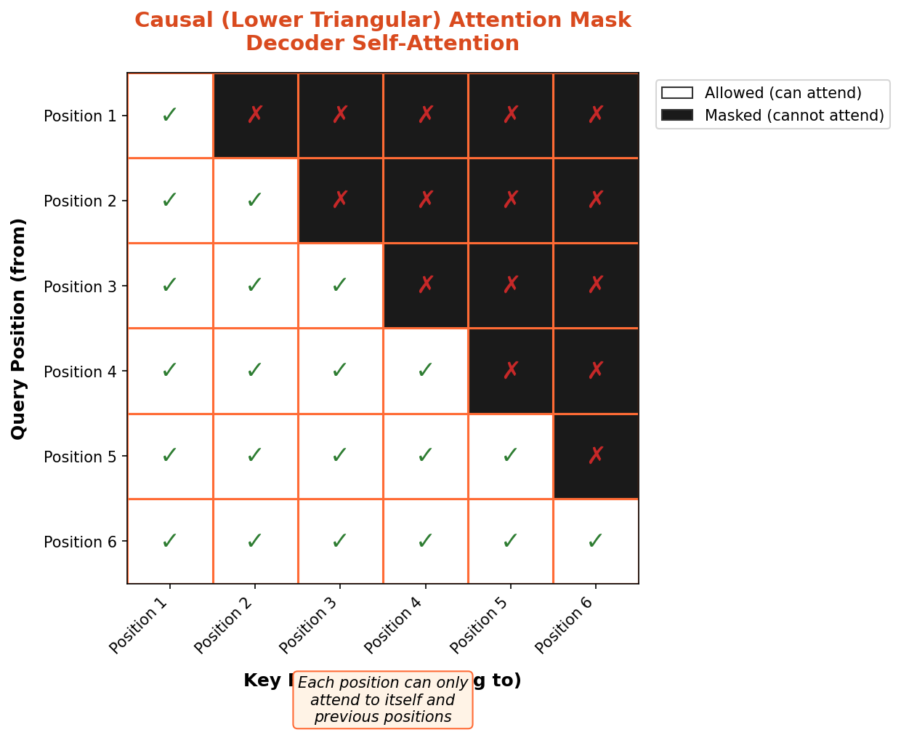
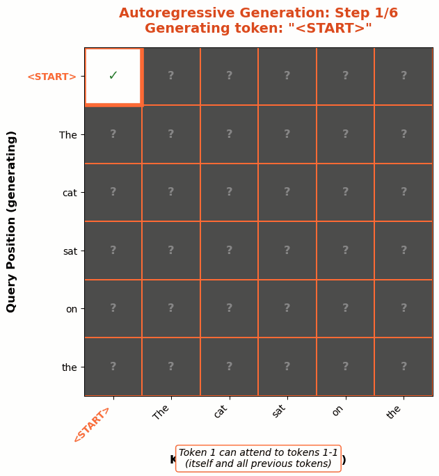
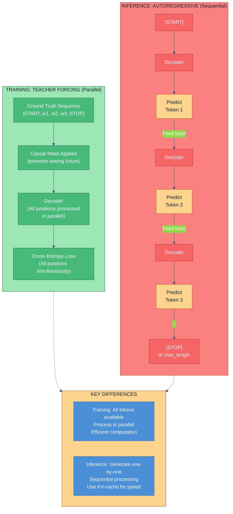
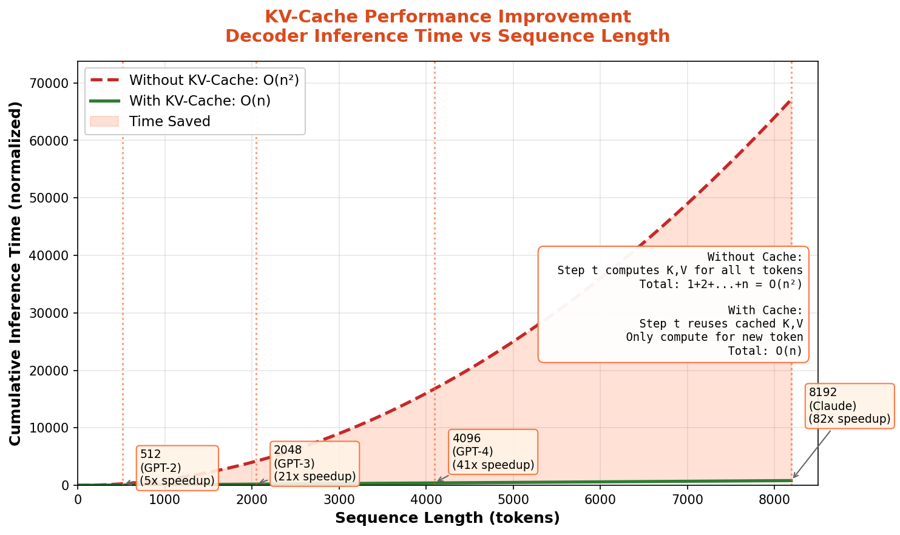
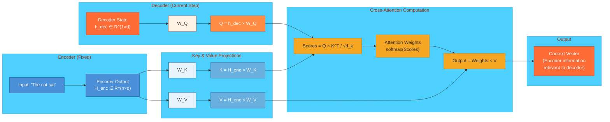
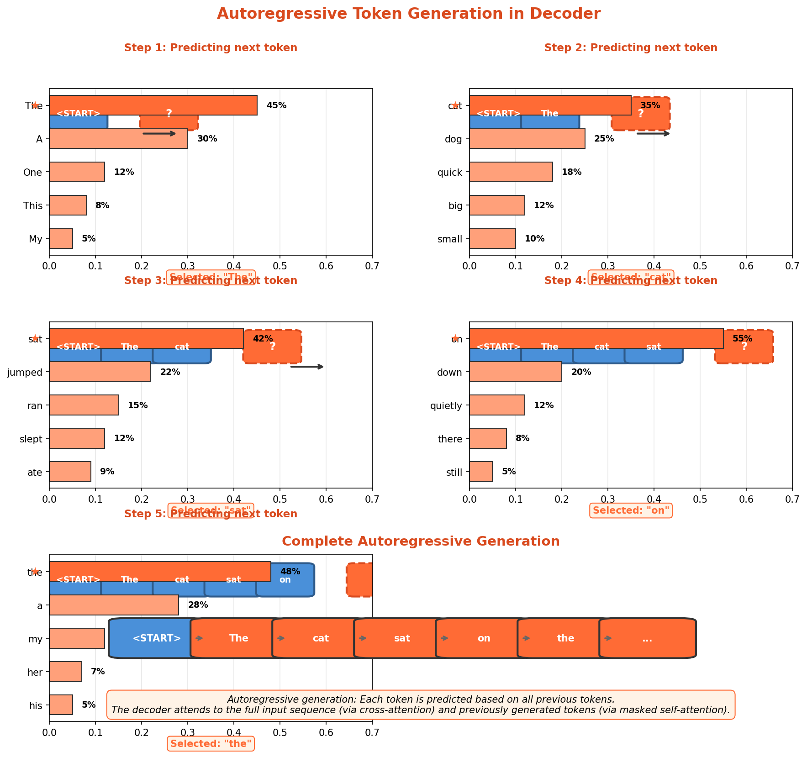
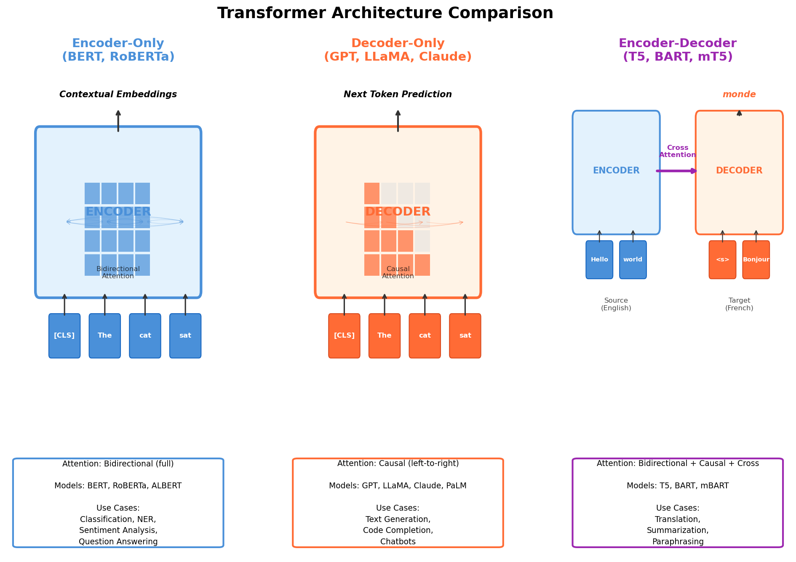

# Decoder Architecture

> The decoder predicts output tokens one at a time, using causal masking to maintain the autoregressive constraint and cross-attention to incorporate encoder context.

## Three-Layer Decoder Block Overview

Unlike the encoder from Module 5, which processes the entire input sequence bidirectionally, the decoder operates **autoregressively** and must maintain causality: each output token depends only on previously generated tokens, not future ones. The standard decoder block contains three main layers:



**Key differences from the encoder:**
- **Causal masking** in self-attention prevents attending to future positions
- **Cross-attention** layer allows the decoder to attend to encoder outputs
- Each position processes sequentially during inference (though training uses teacher forcing)
- Output is fed back as input for the next token generation step

## Causal (Masked) Self-Attention

### The Autoregressive Constraint

The decoder must satisfy a fundamental constraint: **position i can only attend to positions j where j ≤ i**. This ensures that when predicting token t, the model only uses information from tokens 1 through t-1 and the encoder.

Why is this necessary? Because during inference, future tokens don't exist yet. The model generates one token at a time, and each new token must depend only on what came before.

### Mask Implementation

Causal masking is implemented by modifying the attention scores before the softmax operation. For an attention score matrix of shape (seq_len, seq_len), we create a triangular mask:

```python
# Create causal mask (lower triangular matrix)
seq_len = 5
mask = torch.tril(torch.ones((seq_len, seq_len)))
# mask[i, j] = 1 if j <= i (can attend), 0 if j > i (cannot attend)

# Apply mask during attention computation:
# Before softmax, set masked positions to -∞
scores = Q @ K.T / sqrt(d_k)
scores = scores.masked_fill(mask == 0, float('-inf'))
attention_weights = softmax(scores, dim=-1)
```

**Visualization of causal mask for sequence length 5:**
```
Position: 0 1 2 3 4
       0 [✓ ✗ ✗ ✗ ✗]
       1 [✓ ✓ ✗ ✗ ✗]
       2 [✓ ✓ ✓ ✗ ✗]
       3 [✓ ✓ ✓ ✓ ✗]
       4 [✓ ✓ ✓ ✓ ✓]
```

Where ✓ means "can attend to" and ✗ means "masked out."





### Training vs. Inference

**Training with Teacher Forcing:**
```python
# During training, we have the ground truth sequence [START, w1, w2, w3, STOP]
# We can pass all positions through the decoder at once (parallel processing)
decoder_output = decoder(encoder_output, target_tokens)
# The causal mask ensures position i only attends to positions < i

# Loss computed on all positions simultaneously
loss = cross_entropy(decoder_output, target_tokens)
```

**Inference (Autoregressive Generation):**
```python
output_tokens = [START_TOKEN]
while True:
    # Pass all accumulated tokens
    logits = decoder(encoder_output, output_tokens)

    # Take the logits of the last position only
    next_token_logits = logits[-1, :]
    next_token = argmax(next_token_logits)

    output_tokens.append(next_token)
    if next_token == STOP_TOKEN or len(output_tokens) > max_length:
        break

return output_tokens
```

This difference is critical: training is efficient (all positions in parallel), but inference is sequential (one token at a time).



### KV-Cache: Optimization for Fast Inference

Computing attention from scratch at each generation step is wasteful. Position 5 recomputes attention over positions 1-4, which we already computed at step 4. The KV-cache solves this:

```python
# Instead of recomputing K and V for all previous positions,
# we cache them and only compute K and V for the new token

cache = {}  # Dictionary of cached K, V for each layer

for step in range(max_length):
    new_token_ids = output_tokens[-1:]  # Only the newest token

    for layer_idx in range(num_layers):
        Q = compute_query(new_token_ids)

        if layer_idx not in cache:
            cache[layer_idx] = {'K': None, 'V': None}

        K_new = compute_key(new_token_ids)
        V_new = compute_value(new_token_ids)

        # Concatenate with previous K, V
        K = torch.cat([cache[layer_idx]['K'], K_new], dim=1)
        V = torch.cat([cache[layer_idx]['V'], V_new], dim=1)

        # Normal attention computation
        attention_output = scaled_dot_product_attention(Q, K, V)

        # Update cache
        cache[layer_idx]['K'] = K
        cache[layer_idx]['V'] = V
```

**Impact on performance:**
- Without cache: O(n²) computation per token (n = sequence length so far)
- With cache: O(n) computation per token
- Typical speedup: 4-10x faster inference on long sequences
- Trade-off: Uses memory to store K, V for all previous tokens



## Cross-Attention

The cross-attention layer allows the decoder to incorporate information from the encoder's output. This is what makes sequence-to-sequence models work.

### Mechanism

In cross-attention:
- **Q (Query)**: Comes from the decoder (what the decoder is looking for)
- **K, V (Keys, Values)**: Come from the encoder (what information is available)

$$\text{CrossAttention}(Q_{decoder}, K_{encoder}, V_{encoder}) = \text{softmax}\left(\frac{Q_{decoder} K_{encoder}^T}{\sqrt{d_k}}\right) V_{encoder}$$

The decoder can now attend to any position in the encoder output without causal restrictions, since the encoder is fixed and non-autoregressive.

### Intuition

Think of translation: "The cat sat on the mat" → "Le chat s'est assis sur le tapis"

As the decoder generates each French word, it attends to the encoder's understanding of the entire English sentence. The cross-attention layer asks: "Given what I just generated, what parts of the encoder's representation do I need?"

**Key observation:** While decoder self-attention is causal, cross-attention is **not** causal. The decoder can attend to any encoder position.



## Autoregressive Generation

### Generation Process

```python
def generate(encoder_output, max_length=100, strategy='greedy'):
    batch_size = encoder_output.shape[0]

    # Initialize with start token
    current_tokens = torch.full((batch_size, 1), START_TOKEN_ID, dtype=torch.long)
    finished = torch.zeros(batch_size, dtype=torch.bool)

    for step in range(max_length):
        # Decode one token
        logits = decoder(encoder_output, current_tokens)
        next_token_logits = logits[:, -1, :]  # Shape: (batch_size, vocab_size)

        if strategy == 'greedy':
            next_tokens = next_token_logits.argmax(dim=-1, keepdim=True)
        elif strategy == 'beam_search':
            next_tokens = beam_search_step(next_token_logits, beam_width=5)
        elif strategy == 'sampling':
            probs = softmax(next_token_logits / temperature, dim=-1)
            next_tokens = torch.multinomial(probs, num_samples=1)

        # Update finished sequences
        finished |= (next_tokens == END_TOKEN_ID).squeeze(-1)
        next_tokens[finished] = PAD_TOKEN_ID

        # Append new tokens
        current_tokens = torch.cat([current_tokens, next_tokens], dim=1)

        if finished.all():
            break

    return current_tokens
```



### Decoding Strategies

| Strategy | Method | Quality | Speed | Use Case |
|----------|--------|---------|-------|----------|
| **Greedy** | argmax(logits) | Low | Fastest | Baselines, quick inference |
| **Beam Search** | Keep top-k sequences | Medium-High | Slow | Best quality, machine translation |
| **Sampling** | Sample from distribution | Medium | Fast | Diverse outputs, creative tasks |
| **Top-k/Nucleus** | Sample from filtered distribution | Medium-High | Fast | Balanced quality and diversity |

## Encoder vs. Decoder vs. Encoder-Decoder

Different architectures suit different tasks:

| Architecture | Example | Masking | Use Case |
|---|---|---|---|
| **Encoder-Only** (BERT) | Classification, NER | Bidirectional (none) | Understand input without generating output |
| **Decoder-Only** (GPT, Llama) | Text generation | Causal masking | Autoregressive generation only |
| **Encoder-Decoder** (T5, BART) | Translation, summarization | Encoder: none, Decoder: causal | Conditioning generation on input context |

**When to use each:**
- **Encoder-only**: Classification, question answering, sentiment analysis
- **Decoder-only**: Open-ended generation, language modeling
- **Encoder-decoder**: Seq2seq tasks where output depends on input (translation, summarization, paraphrasing)



## KV-Cache for Efficient Inference (In-Depth)

### Why Cache K and V?

During inference, the bottleneck is **memory bandwidth**, not computation. Computing attention scores involves many small operations that don't fully utilize GPU cores. Recomputing K and V for all previous tokens is redundant memory movement.

### Trade-offs

**Without cache:**
- Memory: Only store input + model parameters
- Computation: Recompute K, V at each step
- Latency per token: O(seq_len) (grows as sequence gets longer)

**With cache:**
- Memory: Store K, V for all previous tokens (~2x more for 1st layer, less for deeper layers)
- Computation: Only compute K, V for new token
- Latency per token: Constant O(1) (independent of sequence length)

**Typical requirements:**
- Caching for 2048-token context: ~4GB extra memory (for large models like LLaMA-7B)
- Speedup: 5-20x faster depending on sequence length

### Implementation Considerations

```python
class DecoderWithCache(nn.Module):
    def forward(self, x, encoder_output, past_cache=None):
        new_cache = []

        # Self-attention with cache
        residual = x
        attn_out, self_cache = self.self_attn(x, past_cache[0] if past_cache else None)
        new_cache.append(self_cache)
        x = self.norm1(residual + attn_out)  # Residual

        # Cross-attention (no cache needed, encoder is fixed)
        residual = x
        cross_out = self.cross_attn(x, encoder_output, encoder_output)
        x = self.norm2(residual + cross_out)  # Residual

        # Feed-forward
        residual = x
        ffn_out = self.ffn(x)
        x = self.norm3(residual + ffn_out)  # Residual

        return x, new_cache
```

Production systems often use quantization with KV-cache to reduce memory requirements while maintaining inference speed.

## Interview Questions

### Q1: Explain why causal masking is necessary in the decoder. What happens if you remove it?

**Answer:**
Causal masking enforces the **autoregressive constraint**: each token can only depend on previously generated tokens. This is necessary because:

1. **During inference**, future tokens don't exist yet. The model generates one token at a time, and each token must be computable from previous tokens alone.

2. **Without causal masking**, the model would "cheat" during training by attending to future tokens. This creates a train-test mismatch: the training objective doesn't match inference reality.

3. **Concrete example**: Translating "Hello world" to French. At position 1 (generating "Bonjour"), if we allow attention to position 2 (which should be "monde"), the model learns to use information that won't be available during inference.

If you remove causal masking:
- The model would perform better on training loss (it has access to all information)
- It would fail catastrophically at inference (it tries to attend to non-existent tokens)

### Q2: How does KV-cache reduce inference latency? What are the trade-offs?

**Answer:**
**The Problem**: Without caching, computing the attention output for step t requires:
- Computing K and V from all previous tokens (1 to t)
- Computing Q from the new token
- This is O(t) operations, growing with sequence length

**The Solution**: Store K and V from previous steps:
```
Step 1: Compute K₁, V₁, Q₁ → Output
Step 2: Reuse K₁, V₁ + compute K₂, V₂, Q₂ → Output
Step 3: Reuse K₁, K₂, V₁, V₂ + compute K₃, V₃, Q₃ → Output
```

**Latency improvement**: From O(n²) total (n steps of O(n) work) to O(n) total.

**Trade-offs**:
- **Memory**: Must store all previous K, V. For a 7B model with 2K context, ~4GB extra.
- **Batch processing**: Harder to batch different sequence lengths (need variable cache sizes).
- **Implementation complexity**: Cache management adds engineering burden.

**Decision**: Always use in production for autoregressive inference. The latency gains far outweigh memory costs.

### Q3: Why is cross-attention necessary? Can't the decoder just work with the encoder output directly?

**Answer:**
Cross-attention is necessary for **flexible alignment** between encoder and decoder representations.

Consider a translation task: "The cat sat on the mat" → "Le chat s'est assis sur le tapis"

If the decoder only had the final encoder representation:
- It's a fixed vector summarizing the entire input
- As the decoder generates each word, it can't dynamically decide which parts of the input are relevant
- Word alignment information is lost

**With cross-attention**:
- The decoder can query different parts of the encoder for different words
- When generating "chat" (cat), it attends heavily to the "cat" part of the encoder
- This allows the model to learn explicit alignments

**Why not just concatenate encoder output?**
- Cross-attention learns what to attend to—it's learned alignment, not fixed
- This is far more flexible and generalizes better than fixed representations

### Q4: What is the difference between teacher forcing and autoregressive generation? When do we use each?

**Answer:**
**Teacher Forcing** (during training):
- We have the correct sequence: "The cat sat on the mat"
- We feed all tokens simultaneously to the decoder
- The decoder learns to predict position i given ground truth positions 1 to i-1
- All positions computed in parallel (very efficient)

**Autoregressive Generation** (during inference):
- We don't have ground truth
- We generate one token at a time
- Each token is fed back as input for the next prediction
- Sequential process (not parallelizable)

**The Problem**: This is a **train-test mismatch**. During training with teacher forcing:
- Position 2 always sees correct token at position 1
- Position 3 always sees correct tokens at positions 1-2
- The model learns to depend on perfect previous predictions

During inference:
- Position 2 sees the predicted token from position 1 (possibly wrong)
- Position 3 sees predicted tokens from positions 1-2 (possibly wrong)
- Errors compound, creating worse performance than training

**Solutions**:
1. **Scheduled sampling**: Gradually replace ground truth with predictions during training
2. **Exposure bias training**: Mix teacher-forced and predicted tokens during training
3. **Beam search**: Keep multiple hypotheses to reduce the impact of early errors

## Quick Reference Card

### Decoder Block Structure
```
Masked Self-Attn → LayerNorm → Cross-Attn → LayerNorm → FFN → LayerNorm
```

### Key Equations
**Causal Mask Application:**
$$\text{Mask}[i,j] = \begin{cases} 0 & \text{if } j \leq i \\ -\infty & \text{if } j > i \end{cases}$$

**Cross-Attention:**
$$\text{Attention}(Q_{dec}, K_{enc}, V_{enc}) = \text{softmax}\left(\frac{Q_{dec} K_{enc}^T}{\sqrt{d_k}} + M\right) V_{enc}$$

### Generation Pseudocode
```
output = [START]
while len(output) < max_len:
    logits = decoder(encoder_output, output)
    next_token = sample(logits[-1])
    output.append(next_token)
    if next_token == END:
        break
```

### Architecture Comparison
| Feature | Encoder | Decoder |
|---------|---------|---------|
| Masking | None (bidirectional) | Causal (autoregressive) |
| Self-Attention | ✓ | ✓ (masked) |
| Cross-Attention | ✗ | ✓ |
| Input | Full sequence | One token at a time (inference) |
| Processing | Parallel | Parallel (train), Sequential (inference) |

### When to Use
- **Encoder-only**: BERT, RoBERTa → Classification
- **Decoder-only**: GPT, Llama → Generation
- **Encoder-Decoder**: T5, BART → Seq2seq (translation, summarization)

### Performance Optimizations
1. **KV-Cache**: 5-20x faster inference (memory trade-off)
2. **Flash Attention**: 2-4x faster attention computation
3. **Quantization**: 4-8x smaller model with minimal quality loss
4. **Batch inference**: Group requests for better GPU utilization

### Common Pitfalls
- Forgetting causal mask → train-test mismatch
- Not using KV-cache → slow inference
- Training only with teacher forcing → exposure bias
- Beam search width too large → quadratic memory growth
