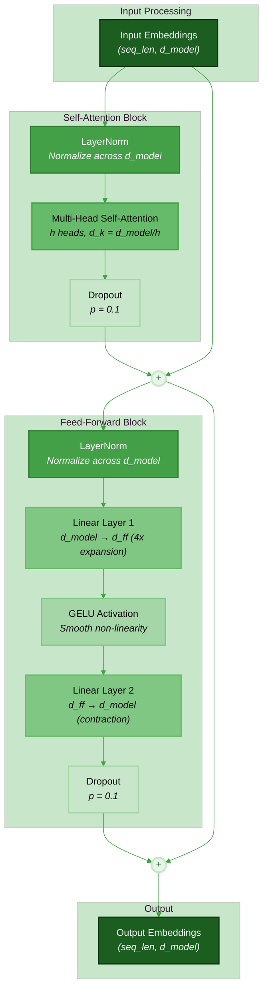
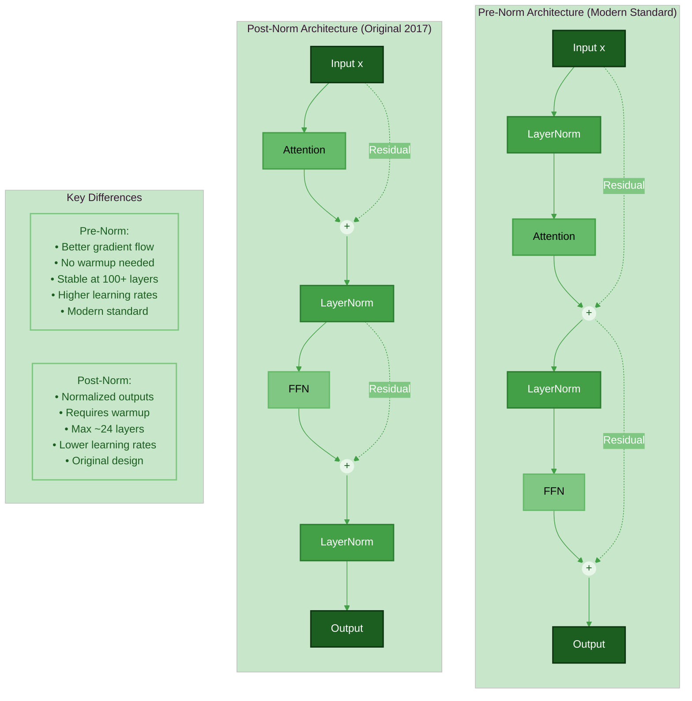
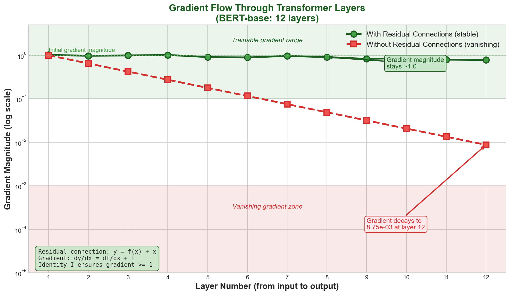
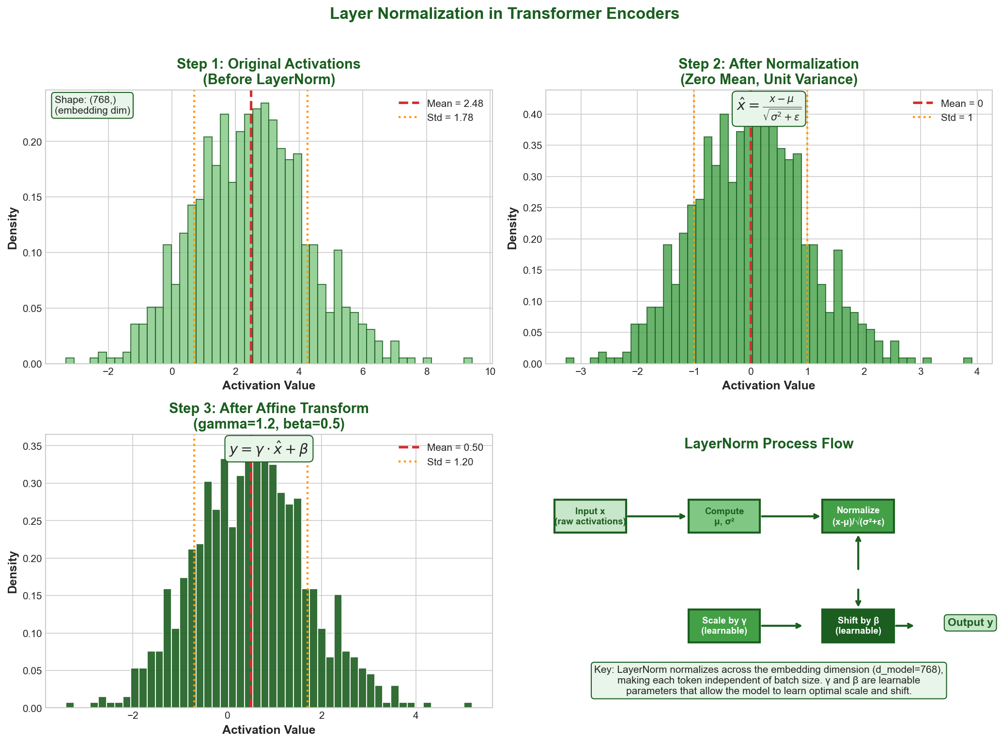
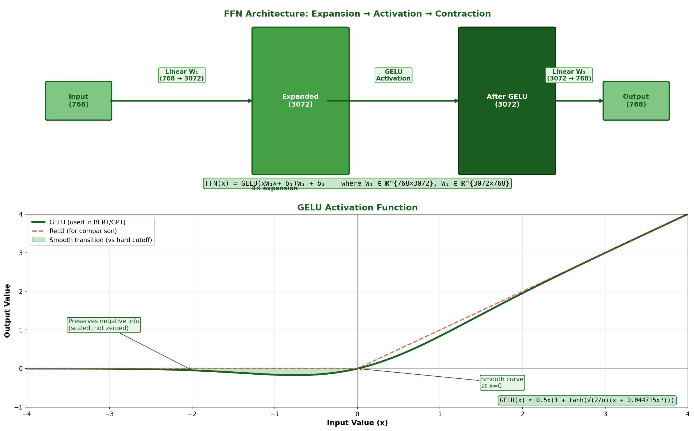
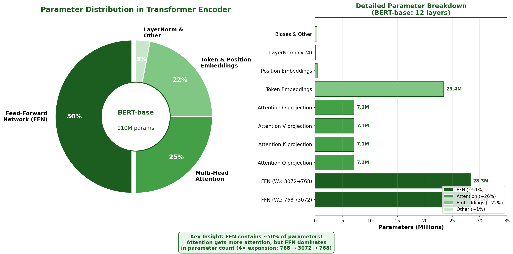
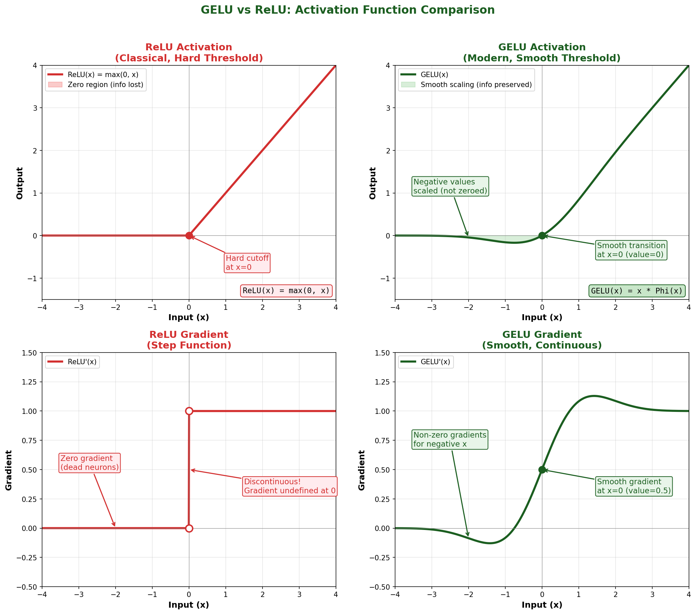
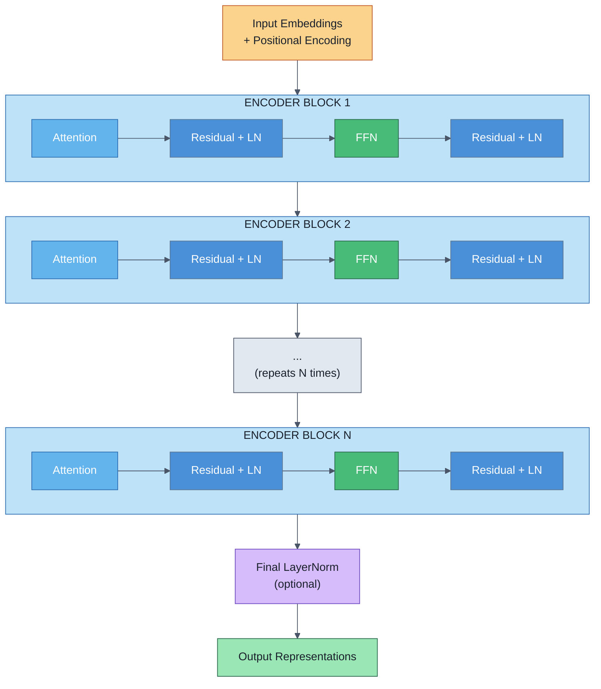

# Encoder Architecture

> **One-Sentence Summary:** The Transformer encoder block combines multi-head self-attention, position-wise feed-forward networks, residual connections, and layer normalization in a carefully orchestrated sequence that enables deep networks to learn rich representations while maintaining gradient flow and training stability.

## Complete Encoder Block Overview

### The Full Data Flow

The Transformer encoder is elegantly composed by stacking multiple identical blocks. Each block processes its input through a precise sequence of operations:



### Two Architectural Variants: Post-Norm vs. Pre-Norm

There are two established variants, differing only in normalization placement:

**Post-Norm (Original Transformer, 2017):**

$$\begin{align}
z_1 &= \text{LayerNorm}(x + \text{Attention}(x)) \\
z_2 &= \text{LayerNorm}(z_1 + \text{FFN}(z_1))
\end{align}$$

**Pre-Norm (Modern standard, especially for large models):**

$$\begin{align}
z_1 &= x + \text{Attention}(\text{LayerNorm}(x)) \\
z_2 &= z_1 + \text{FFN}(\text{LayerNorm}(z_1))
\end{align}$$

The key difference: normalization applied *before* the sub-layer (pre-norm) versus *after* (post-norm). This seemingly small change has significant implications for training dynamics, which we'll explore in the [Layer Normalization](#layer-normalization) section.



### Why This Order?

The encoder block's component ordering is not arbitrary. Each decision serves a critical function:

1. **Multi-Head Self-Attention First**: Allows each position to gather information from all other positions. This is the information exchange phase.

2. **Residual Connection Around Attention**: Preserves the original input information while adding attentional context. Critical for deep networks where gradients must flow.

3. **Layer Normalization Before Each Sub-Layer**: Stabilizes training by normalizing the distribution of activations. Pre-norm has become standard because it improves gradient flow in very deep networks.

4. **Feed-Forward Network Second**: Applies position-wise transformations to each token independently. This is the information processing phase.

5. **Residual Connection Around FFN**: Again preserves information while adding processed features.

This design ensures:
- **Information mixing** through attention
- **Information processing** through FFN
- **Gradient preservation** through residual connections
- **Stable training** through normalization

## Residual Connections

### The Mathematical Pattern

Residual connections follow the simple but powerful pattern:

$$y = f(x) + x$$

where $f$ represents a sub-layer (attention or FFN) and the output is the sum of the transformed input and the original input.

### Why Residual Connections Are Critical

**Problem They Solve: Vanishing Gradients in Deep Networks**

During backpropagation through $N$ layers, gradients multiply:

$$\frac{\partial L}{\partial x} = \frac{\partial L}{\partial y_N} \cdot \frac{\partial y_N}{\partial y_{N-1}} \cdots \frac{\partial y_1}{\partial x}$$

If each Jacobian $\frac{\partial y_i}{\partial y_{i-1}}$ has spectral norm less than 1, the product of $N$ such matrices shrinks exponentially. For 12+ layer transformers (BERT-base is 12 layers, BERT-large is 24), this causes vanishing gradients without residuals.

With residual connections:

$$\frac{\partial(f(x) + x)}{\partial x} = \frac{\partial f(x)}{\partial x} + I$$

The identity matrix $I$ guarantees that even if $\frac{\partial f(x)}{\partial x}$ shrinks, there's always a direct gradient path with magnitude at least 1. This is why deep transformers (100+ layers) remain trainable with residuals.

**Empirical Evidence:**
- BERT-base (12 layers): Trained successfully with residuals and normalization
- Transformers without residuals: Fails to train beyond 3-4 layers
- Ultra-deep networks (1000+ layers): Only feasible with residuals and careful normalization

### Post-Norm vs. Pre-Norm Architecture

The placement of normalization dramatically affects gradient flow:

| Aspect | Post-Norm | Pre-Norm |
|--------|-----------|----------|
| **Normalization location** | After residual addition: $\text{LN}(x + f(x))$ | Before sub-layer: $x + f(\text{LN}(x))$ |
| **Original reference** | "Attention is All You Need" (2017) | Proposed in "On Layer Normalization in the Transformer Architecture" |
| **Gradient flow** | Somewhat attenuated through normalization | Stronger through residual path |
| **Training stability** | Requires warmup and lower learning rates | Stable even with higher learning rates |
| **Depth scale** | Struggles with 24+ layers | Stable with 100+ layers |
| **Modern practice** | Less common | Preferred in GPT, BERT-v2, modern models |
| **Output distribution** | Normalized | Not normalized (raw residual sum) |

**Pre-norm advantage for depth:**

In pre-norm, the residual path $x → x + f(...)$ is unobstructed. Gradients can flow directly from output to input without passing through normalization, which applies a contraction (like multiplication by a diagonal matrix with values $< 1$).

**Pre-norm disadvantage:**

The final layer outputs unnormalized activations. This requires explicit normalization before output projection (or the output head handles it).

### Benefits: Training Stability and Gradient Flow

**Training Stability:**
- With residuals, loss landscapes are smoother (fewer sharp cliffs)
- Models train without the instability that requires careful learning rate scheduling
- Residuals act like a built-in momentum mechanism

**Better Gradients in Deep Layers:**
- Without residuals: gradient at layer 1 = $\text{tiny value} \times \text{gradient at layer 24}$
- With residuals: gradient at layer 1 = $\text{gradient at layer 24} + \text{contribution from each intermediate layer}$

This is why 24-layer BERT-large trains successfully, but a hypothetical 24-layer transformer without residuals would fail completely.



## Layer Normalization

### Definition and Mathematics

Layer normalization normalizes across the **feature dimension** (embedding dimension), not the batch dimension:

$$y = \gamma \odot \frac{x - \mu}{\sqrt{\sigma^2 + \epsilon}} + \beta$$

where:
- $\mu = \frac{1}{d} \sum_{i=1}^{d} x_i$ (mean across feature dimension)
- $\sigma^2 = \frac{1}{d} \sum_{i=1}^{d} (x_i - \mu)^2$ (variance across feature dimension)
- $\gamma, \beta$ (learnable affine parameters, shape: $[d_{model}]$)
- $\epsilon$ (small constant for numerical stability, e.g., $1e-6$)

The key insight: **each token is normalized independently**, unlike batch normalization which normalizes across the batch dimension.

### LayerNorm vs. BatchNorm

| Aspect | LayerNorm | BatchNorm |
|--------|-----------|-----------|
| **Normalization axis** | Feature dimension (across embedding) | Batch dimension |
| **Affected by batch size** | No (independent per token) | Yes (requires sufficient batch size) |
| **Inference behavior** | Same as training | Uses running statistics |
| **Variable sequence lengths** | Handles naturally | Requires same lengths |
| **Transformer suitability** | Excellent | Poor |
| **RNN/LSTM suitability** | Good | Poor |
| **CV (CNNs) suitability** | Acceptable | Excellent |

**Why LayerNorm for Transformers:**

1. **Batch-size independent**: Works the same whether you use batch size 1 or 1024. Critical when sequence length varies.
2. **No train-test mismatch**: Unlike BatchNorm, no difference between training and inference behavior.
3. **Each token normalized independently**: Respects the transformer's parallel structure where tokens are processed independently.

### Pre-Norm vs. Post-Norm (Revisited)

The normalization placement profoundly affects the model's behavior:

**Post-Norm Architecture:**
```
x → Attention → [+ x] → LayerNorm → Attention Output
```

- Output of attention block is normalized
- Next block receives well-scaled, normalized inputs
- But gradient backpropagation through LayerNorm contracts values
- Requires careful training (learning rate warmup, special initialization)

**Pre-Norm Architecture:**
```
x → LayerNorm → Attention → [+ x] → next block
```

- Attention input is normalized (stabilized)
- Residual connection preserves unnormalized output (better gradient flow)
- Next block receives somewhat un-normalized input (less stable but better gradients)
- Training is more stable; allows higher learning rates

**Practical implication:**

Modern large-scale models (GPT-2, GPT-3, PaLM) use pre-norm. The original Transformer used post-norm but required careful training protocols. This is why when reproducing original Transformer papers, practitioners often switch to pre-norm.

### Formula and Practical Implications

The normalization formula $y = \gamma \odot \frac{x - \mu}{\sqrt{\sigma^2 + \epsilon}} + \beta$ has important implications:

1. **Epsilon ($\epsilon$)**: Prevents division by zero. Typical value: $1e-5$ to $1e-6$. Too large ($1e-3$) dampens gradients; too small causes numerical instability.

2. **Learnable affine parameters ($\gamma, \beta$)**: Allow the model to learn any scale and shift. This expressiveness is crucial—without $\gamma, \beta$, normalization would be a fixed operation.

3. **Per-token normalization**: Unlike batch normalization, each token has independent mean and variance computed from its embedding dimension. This respects the transformer's treatment of tokens as independent units.

4. **Output scale**: The output has mean 0 and standard deviation roughly 1 (scaled by $\gamma$). This keeps activations in a numerically stable range throughout the network.



## Feed-Forward Network (Position-wise)

### Architecture and Formula

The feed-forward network is applied identically to each token position. Despite the name "position-wise," it's the same computation for all positions, making it highly parallelizable:

$$\text{FFN}(x) = \max(0, xW_1 + b_1)W_2 + b_2$$

Or with GELU activation (modern standard):

$$\text{FFN}(x) = \text{GELU}(xW_1 + b_1)W_2 + b_2$$

**Dimensions:**
- Input: $[seq\_len, d_{model}]$
- After first projection: $[seq\_len, d_{ff}]$ (expanded)
- After second projection: $[seq\_len, d_{model}]$ (contracted back)

**Typical configuration:**
$$d_{ff} = 4 \times d_{model}$$

For BERT-base ($d_{model} = 768$): $d_{ff} = 3072$

### Why Expand Then Contract?

The two-layer FFN acts as a bottleneck and expansion mechanism:

**Expansion ($d_{model} → d_{ff}$):**
- Projects input to a higher-dimensional space
- Creates more capacity for non-linear transformations
- Similar to hidden layers in standard neural networks
- Allows the network to discover complex feature combinations

**Contraction ($d_{ff} → d_{model}$):**
- Projects back to the model's working dimension
- Ensures output shape matches input for residual connections
- Forces the model to compress important features into $d_{model}$ dimensions

This expansion-contraction pattern is found throughout deep learning:
- Vision transformers use similar patterns
- The expansion factor $4$ is empirically optimal (research shows diminishing returns beyond $4 \times$)



### Parameter Count: FFN Dominates

A crucial observation: **the FFN contains the majority of parameters in a transformer**.

**Parameter breakdown for BERT-base ($d_{model} = 768$, 12 layers):**

| Component | Params per Layer | Total (12 layers) | % of Total |
|-----------|---|---|---|
| Multi-head attention | $4 \times 768^2 = 2.4M$ | $28.8M$ | ~25% |
| Feed-forward | $2 \times 768 \times 3072 = 4.7M$ | $56.4M$ | ~50% |
| Embeddings | - | $23.9M$ | ~20% |
| Output layer | - | $0.6M$ | ~1% |
| **Total** | - | **110M** | **100%** |

The FFN uses twice as many parameters as the attention mechanism! This is often surprising to practitioners who focus heavily on attention (the more novel component) while neglecting the equally important FFN.



**Why so many parameters?**

1. **High-rank transformations**: Matrix $W_1$ ($d_{model} \times d_{ff}$) has rank up to $d_{model}$, allowing rank-$d_{model}$ transformations
2. **Non-linearity**: The activation function (ReLU, GELU) applied to expanded dimensions enables powerful non-linear feature learning
3. **Position-wise application**: Applied independently to each token, the FFN must encode general linguistic/conceptual knowledge applicable everywhere

### GELU vs. ReLU Activation

Modern transformers universally use GELU (Gaussian Error Linear Unit) instead of ReLU:

$$\text{GELU}(x) = x \cdot \Phi(x)$$

where $\Phi(x)$ is the Gaussian cumulative distribution function.

Approximation:
$$\text{GELU}(x) \approx 0.5x(1 + \tanh(\sqrt{2/\pi}(x + 0.044715x^3)))$$

**ReLU:**
$$\text{ReLU}(x) = \max(0, x)$$

**Comparison:**

| Aspect | ReLU | GELU |
|--------|------|------|
| **Form** | Hard threshold | Smooth S-curve |
| **Gradient at 0** | Undefined (0 to 1) | Smooth (0.5) |
| **Negative values** | Zero out completely | Scaled down smoothly |
| **Information loss** | Kills negative activations | Preserves some information |
| **Gradient flow** | Sharp boundaries | Smooth gradients |
| **Modern usage** | Older architectures | Modern LLMs (BERT, GPT) |
| **Empirical performance** | Slightly worse for NLP | Better for language tasks |

**Why GELU for transformers:**

GELU's smooth activation preserves more information, particularly beneficial for language tasks where subtle distinctions matter. The smooth gradients also improve training stability in very deep networks.



## Stacking Multiple Encoders

### Composing N Layers

A complete transformer encoder consists of $N$ identical (or nearly identical) blocks, typically $N = 12$ to $24$:



### Information Flow Through Layers

Each layer refines the representations:

**Layer 1-3 (Early layers):**
- Local patterns (adjacent words, basic syntax)
- Position-specific attention patterns
- Character-level and subword information

**Layer 4-8 (Middle layers):**
- Syntactic structures (parts of speech, phrase boundaries)
- Named entity recognition
- More abstract relationships

**Layer 9-12 (Deep layers):**
- Semantic roles
- Document-level understanding
- Task-specific representations

This **hierarchical feature learning** mirrors:
- Convolutional neural networks (texture → objects → scenes)
- Traditional NLP pipelines (tokens → phrases → sentences → meaning)

Research on BERT demonstrates that different layers learn different linguistic levels of abstraction. The early layers are so specialized for syntax that freezing them and fine-tuning only deeper layers sometimes works (layer-wise fine-tuning).

### Why Increasing Depth Helps

**More capacity for refinement:**
Each layer has an opportunity to refine and transform representations. Early layers handle simple patterns; deeper layers combine those patterns into complex understanding.

**Hierarchical abstraction:**
Just as humans understand text through multiple levels of abstraction (letters → words → sentences → paragraphs → discourse), transformers build hierarchical representations through depth.

**Empirical scaling laws:**
- BERT-base: 12 layers (110M params)
- BERT-large: 24 layers (340M params)
- GPT-3 (175B): 96 layers (optimized across many dimensions)

Doubling depth provides measurable improvements on benchmark tasks, though with diminishing returns beyond 24 layers for typical training compute budgets.

**Tradeoff: Depth vs. Width**
Researchers debate optimal architecture:
- Deeper + narrower: More refinement steps, better abstractions (favored for NLP)
- Shallower + wider: Higher capacity per layer, less computation (sometimes better for vision)

For language, depth is typically preferred because sequential processing of linguistic meaning benefits from multiple refinement stages.

## Implementation Notes and Code Examples

### Pseudocode for Single Encoder Block

```python
class EncoderBlock:
    def __init__(self, d_model, num_heads, d_ff, dropout=0.1):
        self.attention = MultiHeadAttention(d_model, num_heads)
        self.ffn = FeedForwardNetwork(d_model, d_ff)
        self.norm1 = LayerNorm(d_model)
        self.norm2 = LayerNorm(d_model)
        self.dropout1 = Dropout(dropout)
        self.dropout2 = Dropout(dropout)

    def forward(self, x, mask=None):
        # Pre-norm variant (modern standard)

        # Attention block with residual
        normed_x = self.norm1(x)
        attn_output = self.attention(normed_x, normed_x, normed_x, mask)
        attn_output = self.dropout1(attn_output)
        x = x + attn_output

        # Feed-forward block with residual
        normed_x = self.norm2(x)
        ffn_output = self.ffn(normed_x)
        ffn_output = self.dropout2(ffn_output)
        x = x + ffn_output

        return x
```

### Stacking Multiple Blocks

```python
class TransformerEncoder:
    def __init__(self, d_model, num_heads, num_layers, d_ff, dropout=0.1):
        self.blocks = [
            EncoderBlock(d_model, num_heads, d_ff, dropout)
            for _ in range(num_layers)
        ]
        self.final_norm = LayerNorm(d_model)

    def forward(self, x, mask=None):
        for block in self.blocks:
            x = block(x, mask)
        x = self.final_norm(x)  # Final normalization for stability
        return x
```

### Key Implementation Details

1. **Dropout**: Applied after attention and FFN outputs (before residual addition). Typical rate: 0.1-0.2
2. **Masking**: For padding, create mask before feeding to encoder:
   ```python
   # Create padding mask
   padding_mask = (tokens == pad_token_id).unsqueeze(1).unsqueeze(2)
   # Pass to attention: replaces scores[padding_mask] with -inf
   ```
3. **Initialize weights**:
   - Linear layers: Xavier uniform or Kaiming normal
   - $\gamma$ (LayerNorm scale): 1.0
   - $\beta$ (LayerNorm bias): 0.0

4. **Attention computation within FFN**: The FFN operations are **not attention-based**. They're learned point-wise transformations. This is sometimes confused with self-attention.

## Parameter and Computation Analysis

### Parameter Distribution

For a 12-layer BERT-base ($d_{model} = 768$, $d_{ff} = 3072$, 12 heads):

**Per-layer parameters:**
- Attention: $4 \times d_{model}^2 = 4 \times 768^2 = 2.4M$
- LayerNorm (2 instances): $2 \times d_{model} = 1.5K$ (negligible)
- FFN: $d_{model} \times d_{ff} + d_{ff} \times d_{model} = 4.7M$
- **Total per layer**: ~7.1M

**Across 12 layers**: $12 \times 7.1M = 85.2M$

**Overhead components**:
- Token embeddings: $30K \times 768 = 23M$ (assuming 30K vocabulary)
- Positional embeddings: $512 \times 768 = 0.4M$ (for max sequence length 512)
- Output projection: $768 \times 768 = 0.6M$
- **Total**: ~24M

**Total BERT-base parameters**: ~110M

This distribution is typical across transformers: FFN dominates, but attention is what drives the expressive power.

### Computational Complexity

**Time Complexity per layer:**
- Attention: $O(L^2 \times d_{model})$ (quadratic in sequence length $L$)
- FFN: $O(L \times d_{model} \times d_{ff}) = O(L \times d_{model}^2)$ (linear in $L$)
- **Dominant term**: Attention (quadratic)

For $L = 512$, $d_{model} = 768$:
- Attention: ~200M operations per layer
- FFN: ~1.2B operations per layer
- FFN actually requires more computation than attention!

**Why?** The expansion factor makes FFN operations volume-heavy. Though attention has higher asymptotic complexity in $L$, for typical sequence lengths, FFN computation dominates.

## Interview Questions

### Question 1: Walk me through the complete forward pass of a single encoder block. Why is each component necessary?

**Sample Answer:**

I'll trace an input $x$ through a complete encoder block using pre-norm architecture (modern standard):

**Input**: $x \in \mathbb{R}^{[L, d_{model}]}$ where $L$ is sequence length and $d_{model} = 768$ (BERT-base)

**Step 1: Attention block**
```
x → LayerNorm(x) → MultiHeadAttention → Dropout → Residual Add
```

Mathematically:
$$x' = x + \text{Dropout}(\text{MultiHeadAttention}(\text{LayerNorm}(x)))$$

**Why LayerNorm first?** Pre-norm stabilizes the attention mechanism. The normalized input has mean 0 and variance ~1, preventing exploding/vanishing attention scores.

**Why multi-head attention?** From Module 3, multiple heads allow parallel specialization. Some heads track local syntax, others capture long-range dependencies.

**Why dropout?** Regularization. Randomly zeroing activations prevents co-adaptation and improves generalization.

**Why residual connection?** Critical for deep networks. The gradient path $\frac{\partial(x + f(x))}{\partial x}$ includes a direct identity connection, preventing vanishing gradients even in 12-layer networks.

**Step 2: Feed-forward block**
```
x' → LayerNorm(x') → FFN(two linear layers with GELU) → Dropout → Residual Add
```

Mathematically:
$$x'' = x' + \text{Dropout}(\text{FFN}(\text{LayerNorm}(x')))$$

where:
$$\text{FFN}(x) = \text{GELU}(xW_1 + b_1)W_2 + b_2$$

**Why two linear layers?** The expansion ($d_{model} → d_{ff}$) creates capacity for non-linear transformations. Most transformer parameters (50% of total) live here.

**Why GELU over ReLU?** GELU has smooth gradients and preserves more information about negative activations. Research shows it's better for language tasks.

**Why another residual connection?** Same reason as attention—maintains gradient flow through the FFN transformation.

**Output**: $x'' \in \mathbb{R}^{[L, d_{model}]}$ (same shape as input, ready to feed to next block)

**Why this order?**

The progression Attention → Residual → Normalization → FFN → Residual is carefully designed:
1. Attention allows information mixing across positions
2. Residuals preserve original information while adding attentional context
3. Normalization stabilizes learned feature distributions
4. FFN applies position-wise transformations using most of the model's parameters
5. Final residual ensures deep stacking remains trainable

**Alternative (Post-Norm) would be:**
$$\text{LayerNorm}(x + \text{Attention}(x)) → \text{LayerNorm}(\cdot + \text{FFN}(\cdot))$$

Post-norm was in the original paper but requires careful training (learning rate warmup, specific initialization). Pre-norm is more stable and is now standard.

### Question 2: Why does increasing $d_{ff}$ from $2 \times d_{model}$ to $4 \times d_{model}$ help, but $8 \times d_{model}$ doesn't?

**Sample Answer:**

This question touches on both model capacity and information compression. Let me analyze the trade-offs:

**Expansion factor trade-offs:**

| Factor | Params | Capacity | Performance | Notes |
|--------|--------|----------|-------------|-------|
| 1× | Minimal | Bottleneck | Poor | No expansion; FFN becomes identity-like |
| 2× | Lower | Constrained | Suboptimal | Insufficient feature exploration |
| 4× | Baseline | Balanced | Optimal | Sweet spot; used everywhere (BERT, GPT) |
| 8× | High | Excessive | Marginal gain | Diminishing returns; 2× compute cost |
| 16× | Very high | Redundant | No improvement | Overfitting risk; wasteful |

**Why 4×?**

1. **Information theory perspective**: The expansion creates a high-dimensional space where the non-linearity (GELU) can express complex functions. With $d_{ff} = 4 \times d_{model}$, we have sufficient capacity to:
   - Learn multiple independent features
   - Capture non-linear interactions
   - Apply gating-like mechanisms through the learned weights

2. **Empirical optimization**: Researchers have extensively tested different expansion factors. The value 4× appears optimal across:
   - BERT (Devlin et al., 2018): Uses 4×
   - GPT (Radford et al., 2018): Uses 4×
   - Transformer-XL: Uses 4×
   - Modern LLMs consistently use 4×

3. **Parameter efficiency**: At 4×, the FFN accounts for ~50% of transformer parameters. This allocation balances:
   - Sufficient capacity in the FFN (information processing)
   - Reasonable overhead (not becoming the entire model)

4. **Bottleneck principle**: The compression back to $d_{model}$ acts as an information bottleneck. The model must compress important features into $d_{model}$ dimensions. Expansion to 4× provides enough room for the activation function to work while compression remains meaningful.

**Why not 8×?**

1. **Redundancy**: With 8× expansion in a dimension already 768, the FFN becomes almost full-rank with minimal compression. The learned weights tend to encode redundant information.

2. **Computational cost**: 8× means $2 \times$ the computation (proportional to expansion factor). Typical configurations are:
   - 4× expansion: ~60% of transformer compute in FFN
   - 8× expansion: ~75% of transformer compute in FFN

   The improvement doesn't justify the overhead.

3. **Regularization effect**: Smaller expansion factors ($2-4×$) create mild regularization through compression. Larger factors lose this effect.

4. **Empirical diminishing returns**: Scaling laws (like those in "Scaling Laws for Neural Language Models") show that beyond 4×, the improvement is sublinear.

**Practical recommendation:**

For new architectures, stick with 4× unless you have specific reasons (e.g., extremely large batch size where regularization is less important). Research has converged on this value.

### Question 3: Compare pre-norm and post-norm architectures. When would you use each, and what are the training implications?

**Sample Answer:**

This is a nuanced architectural decision with significant training implications:

**Post-Norm (Original Transformer, 2017):**

Architecture:
$$\begin{align}
z_1 &= \text{LayerNorm}(x + \text{Attention}(x)) \\
z_2 &= \text{LayerNorm}(z_1 + \text{FFN}(z_1))
\end{align}$$

**Characteristics:**
- Normalization applied *after* residual connection
- Output of each sub-layer is normalized
- Next layer receives well-distributed, normalized input

**Advantages:**
1. Outputs are normalized (helps downstream tasks)
2. Slightly better final layer representations (normalized)
3. Conceptually clean: process information, then normalize

**Disadvantages:**
1. Normalization contracts gradient magnitudes
2. Deep networks suffer from vanishing gradients despite residuals
3. Requires careful training:
   - Learning rate warmup (typically 10,000 steps)
   - Special initialization (Xavier with specific scaling)
   - Lower base learning rates
   - More careful hyperparameter tuning

**Training stability issues:**
- Loss curves are noisier
- Occasional training divergence
- Requires monitoring for instability

**Typical results:**
- BERT-base (12 layers, post-norm): Trainable with care
- BERT-large (24 layers, post-norm): Requires warmup and specific hyperparameters
- 48+ layers with post-norm: Extremely difficult to train

**Pre-Norm (Modern standard, adopted ~2019):**

Architecture:
$$\begin{align}
z_1 &= x + \text{Attention}(\text{LayerNorm}(x)) \\
z_2 &= z_1 + \text{FFN}(\text{LayerNorm}(z_1))
\end{align}$$

**Characteristics:**
- Normalization applied *before* sub-layer
- Sub-layer input is normalized, but output is not
- Residual addition preserves un-normalized values

**Advantages:**
1. Superior gradient flow (direct residual path)
2. Trainable without warmup
3. Higher learning rates possible
4. Stable even at 24+ layers
5. Empirically better for very deep networks
6. Emerging from research on gradient flow

**Disadvantages:**
1. Final outputs not normalized (need final LayerNorm before output projection)
2. Intermediate representations less controlled
3. Slightly less polished than post-norm outputs

**Training stability:**
- Smoother loss curves
- Training is reliable across hyperparameters
- Can use higher learning rates (e.g., 1e-3 vs 5e-4)
- No warmup needed

**Typical results:**
- GPT-2 (uses pre-norm): Very stable
- GPT-3 (uses pre-norm with modifications): Scales to 96 layers
- Modern BERT variants: Often use pre-norm
- All recent LLMs: Pre-norm standard

**When to use each:**

| Scenario | Use | Reason |
|----------|-----|--------|
| Reproducing original Transformer (2017) | Post-norm | Historical accuracy |
| Building new system | Pre-norm | Better training stability |
| Very deep network (48+ layers) | Pre-norm | Only feasible with pre-norm |
| Production system | Pre-norm | Simpler hyperparameter tuning |
| Academic research on architectures | Compare both | Understanding trade-offs |

**Training protocol differences:**

**Post-Norm training:**
```
- Base learning rate: 5e-4 to 1e-3
- Warmup: 10,000 steps (LR: 0 → 1e-3)
- Optimizer: Adam with weight decay
- Initialization: Xavier with careful scaling
- Monitoring: Watch for gradient explosion
```

**Pre-Norm training:**
```
- Base learning rate: 1e-3 to 5e-3 (higher!)
- Warmup: None required, but optional
- Optimizer: Adam with weight decay
- Initialization: Standard Xavier works well
- Monitoring: Generally stable
```

**Empirical evidence:**

Research papers comparing them:
- "On Layer Normalization in the Transformer Architecture" (Xu et al., 2019): Shows pre-norm's gradient advantages
- "Don't Stop Pretraining" (Mosbach et al., 2020): Pre-norm models transfer better
- GPT-3 paper: Uses pre-norm variants with additional stability modifications

**My recommendation:**

For production systems and research, use **pre-norm**. It's easier to train, scales better, and is becoming the de facto standard. Only use post-norm if you're specifically reproducing original Transformer results or have a particular reason (e.g., comparing to historical baselines).

The architectural evolution from post-norm to pre-norm is a perfect example of how seemingly small changes (normalization placement) have profound practical implications (trainability, scaling).

## Quick Reference Card

```
╔═══════════════════════════════════════════════════════════════════════════════╗
║                   ENCODER ARCHITECTURE CHEAT SHEET                            ║
╚═══════════════════════════════════════════════════════════════════════════════╝

┌─ COMPLETE BLOCK DATA FLOW ─────────────────────────────────────────────────┐
│                                                                              │
│  Pre-Norm Variant (Modern Standard):                                        │
│  ──────────────────────────────────                                         │
│                                                                              │
│  Input (L, d_model)                                                         │
│      ↓                                                                      │
│  LayerNorm → MultiHeadAttention → Dropout → + (Residual)                   │
│      ↓                                                                      │
│  LayerNorm → FFN(GELU) → Dropout → + (Residual)                            │
│      ↓                                                                      │
│  Output (L, d_model)                                                        │
│                                                                              │
│  Post-Norm Variant (Original 2017):                                         │
│  ────────────────────────────────                                          │
│  Input → Attention → + (Residual) → LayerNorm                              │
│      → FFN → + (Residual) → LayerNorm → Output                             │
│                                                                              │
│  Key Difference: When normalization applied (before vs. after residual)     │
│  Result: Pre-norm has better gradient flow; post-norm needs warmup         │
│                                                                              │
└──────────────────────────────────────────────────────────────────────────────┘

┌─ RESIDUAL CONNECTIONS ─────────────────────────────────────────────────────┐
│                                                                              │
│  Formula: y = f(x) + x                                                     │
│                                                                              │
│  Why critical:                                                              │
│   • Gradient path: d(f(x)+x)/dx = df/dx + I  (includes identity)           │
│   • Prevents vanishing gradients in deep networks (12-24 layers)           │
│   • Without residuals: >3 layers nearly impossible to train                │
│                                                                              │
│  Empirical evidence:                                                        │
│   BERT-base (12 layers): ✓ Trainable with residuals                        │
│   BERT-large (24 layers): ✓ Trainable with residuals                       │
│   24 layers without residuals: ✗ Fails completely                          │
│                                                                              │
│  Gradient benefit in deep networks:                                         │
│   Without residuals: ∇_layer_1 ~ 10^-8 × ∇_layer_24 (exponential decay)   │
│   With residuals: ∇_layer_1 ~ (contributions from all layers)             │
│                                                                              │
└──────────────────────────────────────────────────────────────────────────────┘

┌─ LAYER NORMALIZATION ──────────────────────────────────────────────────────┐
│                                                                              │
│  Formula: y = γ ⊙ (x - μ) / √(σ² + ε) + β                                  │
│                                                                              │
│  where:                                                                     │
│   μ = mean across embedding dimension (d_model)                            │
│   σ² = variance across embedding dimension                                 │
│   γ, β = learnable scale and shift (shape: [d_model])                      │
│   ε ≈ 1e-6 (numerical stability)                                           │
│                                                                              │
│  Key properties:                                                            │
│   • Normalizes PER TOKEN (not per batch) → independent of batch size       │
│   • Same computation at train and test time (unlike BatchNorm)             │
│   • Each token has mean 0, std ~1 after normalization                      │
│   • Learnable affine params (γ, β) allow any scale/shift                   │
│                                                                              │
│  LayerNorm vs BatchNorm:                                                    │
│   LayerNorm:  Normalizes across feature dim  ✓ Works with variable lengths│
│   BatchNorm:  Normalizes across batch dim    ✗ Needs large batch size     │
│                                                                              │
│  Pre-Norm vs Post-Norm:                                                    │
│   Pre-Norm:   x + f(LayerNorm(x))   → Better gradients, modern standard   │
│   Post-Norm:  LayerNorm(x + f(x))   → Better outputs, needs warmup        │
│                                                                              │
└──────────────────────────────────────────────────────────────────────────────┘

┌─ FEED-FORWARD NETWORK (Position-Wise) ─────────────────────────────────────┐
│                                                                              │
│  Formula: FFN(x) = GELU(xW₁ + b₁)W₂ + b₂                                   │
│                                                                              │
│  Dimensions:                                                                │
│   Input:  (L, d_model) where L = seq_len, d_model = 768 (BERT-base)       │
│   Expand: (L, d_ff)    where d_ff = 4 × d_model = 3072                    │
│   Output: (L, d_model)                                                     │
│                                                                              │
│  Why 4× expansion?                                                          │
│   • 2×: Too constrained, insufficient capacity                             │
│   • 4×: Sweet spot (empirically optimal across BERT, GPT, modern LLMs)    │
│   • 8×: Diminishing returns, 2× compute cost with <5% improvement         │
│   • Compression back to d_model acts as regularization                     │
│                                                                              │
│  Parameter breakdown (BERT-base, 12 layers):                               │
│   Attention:    ~26% of params                                             │
│   FFN:          ~50% of params  ← DOMINATES!                              │
│   Embeddings:   ~21% of params                                             │
│   Other:        ~3% of params                                              │
│                                                                              │
│  Why GELU over ReLU?                                                       │
│   ReLU:   max(0, x)           → Hard cutoff, kills negative info          │
│   GELU:   x × Φ(x)            → Smooth, preserves info better             │
│   Result: GELU performs ~1-2% better on NLP tasks                         │
│                                                                              │
└──────────────────────────────────────────────────────────────────────────────┘

┌─ STACKING MULTIPLE ENCODERS ───────────────────────────────────────────────┐
│                                                                              │
│  Typical Configuration:                                                     │
│   BERT-base:  12 layers                                                    │
│   BERT-large: 24 layers                                                    │
│   GPT-2:      12-24 layers                                                 │
│   GPT-3:      96 layers                                                    │
│                                                                              │
│  Information Flow:                                                          │
│   Layer 1-3:   Local patterns (syntax, adjacent words)                     │
│   Layer 4-8:   Abstract patterns (entities, roles)                         │
│   Layer 9-12:  High-level understanding (semantics, tasks)                 │
│                                                                              │
│  Why depth helps:                                                           │
│   • More refinement steps for representations                              │
│   • Hierarchical feature learning (like CNNs)                              │
│   • Better performance (empirically validated)                             │
│   • Different layers learn different linguistic levels                     │
│                                                                              │
│  Depth vs. Width trade-off:                                                │
│   Depth:  Preferred for NLP (sequential meaning processing)               │
│   Width:  Preferred for vision (spatial pattern processing)               │
│                                                                              │
│  Scaling pattern:                                                           │
│   Increasing depth → consistent improvement (with diminishing returns)     │
│   Beyond 24 layers → careful design needed (pre-norm, stability tweaks)   │
│                                                                              │
└──────────────────────────────────────────────────────────────────────────────┘

┌─ PRE-NORM VS POST-NORM ARCHITECTURES ──────────────────────────────────────┐
│                                                                              │
│  Pre-Norm (Modern Standard):                    Post-Norm (Original):      │
│  ──────────────────────────                     ─────────────────────      │
│  x → LN → Attn → + x                            x → Attn → + x → LN       │
│  x → LN → FFN  → + x                            x → FFN  → + x → LN       │
│                                                                              │
│  Gradient Flow:    Better                       Gradient Flow: Attenuated  │
│  Training Stability: Excellent (no warmup)      Training Stability: Fair   │
│  Max Depth: 100+ layers possible                Max Depth: ~24 layers      │
│  Learning Rate: Higher (1e-3 to 5e-3)         Learning Rate: Lower (5e-4) │
│  Warmup Required: No                            Warmup Required: Yes       │
│  Modern Usage: Standard (GPT, new models)       Modern Usage: Historical   │
│                                                                              │
│  When to use Pre-Norm: Almost always!                                      │
│  When to use Post-Norm: Only reproducing 2017 paper or specific needs     │
│                                                                              │
└──────────────────────────────────────────────────────────────────────────────┘

┌─ PARAMETER COUNT ANALYSIS (BERT-base) ──────────────────────────────────────┐
│                                                                              │
│  Per Layer:                                                                 │
│   Attention (Q,K,V,O):  4 × 768² = 2.4M                                    │
│   LayerNorm (×2):       ~negligible                                        │
│   FFN (W₁, W₂):         768 × 3072 + 3072 × 768 = 4.7M                    │
│   Total:                ~7.1M per layer                                    │
│                                                                              │
│  Across 12 Layers:      12 × 7.1M = 85.2M                                  │
│                                                                              │
│  Other Components:                                                          │
│   Token Embeddings:     30K × 768 = 23M                                    │
│   Positional Emb:       512 × 768 = 0.4M                                   │
│   Output Projection:    768 × 768 = 0.6M                                   │
│   Total Overhead:       ~24M                                               │
│                                                                              │
│  Grand Total: ~110M parameters                                             │
│                                                                              │
│  Key Insight: FFN (50%) >> Attention (25%) in parameter count             │
│              But attention is more novel/important conceptually             │
│                                                                              │
└──────────────────────────────────────────────────────────────────────────────┘

┌─ COMPUTATIONAL COMPLEXITY ─────────────────────────────────────────────────┐
│                                                                              │
│  Per Layer:                                                                 │
│   Attention:  O(L² × d_model)    where L = sequence length                 │
│   FFN:        O(L × d_model × d_ff) = O(L × d_model²)  [d_ff = 4×d_model]│
│                                                                              │
│  For L=512, d_model=768:                                                   │
│   Attention ops:  ~200M FLOPs                                              │
│   FFN ops:        ~1.2B FLOPs    ← FFN actually more expensive!           │
│                                                                              │
│  Why? d_ff = 4 × d_model makes FFN volume-heavy                            │
│  Most compute actually in FFN, not attention (counterintuitive!)           │
│                                                                              │
│  Complexity per transformer:  O(N × L² × d_model) where N = num layers    │
│  Bottleneck: Attention is quadratic in sequence length                    │
│  Solution: Linear attention variants (Linformer, Performer) for long seq  │
│                                                                              │
└──────────────────────────────────────────────────────────────────────────────┘

┌─ IMPLEMENTATION CHECKLIST ─────────────────────────────────────────────────┐
│                                                                              │
│  Building an Encoder Block:                                                 │
│                                                                              │
│  ✓ Choose architecture: Pre-norm (recommended) or post-norm                 │
│  ✓ Instantiate LayerNorm modules (d_model dimension)                        │
│  ✓ Instantiate MultiHeadAttention (num_heads must divide d_model)          │
│  ✓ Instantiate FFN: 2-layer network with d_ff = 4 × d_model               │
│  ✓ Add Dropout after attention and FFN outputs (~0.1 rate)                 │
│  ✓ Implement residual connections explicitly (x + f(x))                    │
│  ✓ Create padding mask for variable-length sequences                       │
│  ✓ Pass mask to attention (sets padding positions to -inf before softmax)  │
│  ✓ Initialize weights with Xavier uniform or Kaiming normal                │
│  ✓ Set LayerNorm γ=1, β=0 initially                                        │
│  ✓ Stack N blocks (typically 12-24)                                        │
│  ✓ Add final LayerNorm after all blocks (pre-norm) or skip (post-norm)    │
│                                                                              │
│  Testing:                                                                   │
│  ✓ Verify input/output shapes match                                        │
│  ✓ Check gradients flow through all layers (no NaN/Inf)                    │
│  ✓ Verify LayerNorm actually reduces variance (check activation stats)     │
│  ✓ Ensure attention weights sum to 1 per position                          │
│  ✓ Profile memory usage for target batch size and sequence length          │
│                                                                              │
│  Hyperparameter Defaults (Pre-Norm):                                        │
│  • Learning rate: 1e-3 to 5e-3 (no warmup usually needed)                  │
│  • Dropout: 0.1 for standard, 0.15 for aggressive regularization           │
│  • d_ff expansion: 4 × d_model (empirically optimal)                       │
│  • num_heads: d_model / 64 (typically 8-12 for d_model 512-768)           │
│  • num_layers: 12-24 (rarely more without specialized techniques)          │
│                                                                              │
└──────────────────────────────────────────────────────────────────────────────┘

┌─ CONNECTING TO OTHER MODULES ──────────────────────────────────────────────┐
│                                                                              │
│  Module 1: Attention Fundamentals                                           │
│           • Foundation: single attention head, dot-product, softmax        │
│           • Used in multi-head attention                                   │
│                                                                              │
│  Module 2: Self-Attention Mechanics                                         │
│           • Q, K, V all from same source                                   │
│           • Enables tokens to attend to all other tokens                   │
│           • Core of attention in encoder blocks                            │
│                                                                              │
│  Module 3: Multi-Head Attention                                             │
│           • Multiple parallel attention mechanisms                          │
│           • Each head specializes in different patterns                    │
│           • First component in encoder blocks                              │
│                                                                              │
│  Module 4: Positional Encoding                                              │
│           • Injects sequence position information                           │
│           • Added to token embeddings before encoder                        │
│           • Critical since attention is permutation-invariant              │
│                                                                              │
│  Module 5: Encoder Architecture (CURRENT)                                  │
│           • Combines Modules 1-4 with residuals, normalization, FFN       │
│           • Repeats N times to form full encoder                           │
│           • Powers BERT, encoder part of Transformers                      │
│                                                                              │
│  Module 6+: Decoders, Full Transformers, Advanced Architectures            │
│           • Decoder uses similar blocks with causal masking                │
│           • Combined encoder-decoder for sequence-to-sequence              │
│           • Specialized variants (sparse attention, linear complexity)     │
│                                                                              │
└──────────────────────────────────────────────────────────────────────────────┘

┌─ KEY FORMULAS AT A GLANCE ─────────────────────────────────────────────────┐
│                                                                              │
│  Encoder Block (Pre-Norm):                                                  │
│  ────────────────────────────                                              │
│  x' = x + Attention(LayerNorm(x))                                          │
│  x'' = x' + FFN(LayerNorm(x'))                                             │
│                                                                              │
│  Layer Normalization:                                                       │
│  ──────────────────────                                                    │
│  y = γ ⊙ (x - μ) / √(σ² + ε) + β                                           │
│                                                                              │
│  Feed-Forward Network:                                                      │
│  ──────────────────────                                                    │
│  FFN(x) = GELU(xW₁ + b₁)W₂ + b₂                                            │
│  where W₁ ∈ ℝ^(d_model × 4d_model), W₂ ∈ ℝ^(4d_model × d_model)           │
│                                                                              │
│  Multi-Head Attention (reminder):                                           │
│  ──────────────────────────────────                                        │
│  MultiHead(Q,K,V) = Concat(head₁,...,headₕ)Wᴼ                             │
│  headᵢ = Attention(QWᵢᵠ, KWᵢᴷ, VWᵢᵛ)                                        │
│                                                                              │
│  Full Stack (N layers):                                                     │
│  ─────────────────────                                                     │
│  x₀ = TokenEmbed + PositionalEmbed                                         │
│  For i = 1 to N:                                                           │
│      xᵢ = EncoderBlock(xᵢ₋₁)                                                │
│  output = FinalLayerNorm(xₙ)  [pre-norm variant]                          │
│                                                                              │
└──────────────────────────────────────────────────────────────────────────────┘
```

## Key Takeaways

1. **The encoder block is a carefully orchestrated composition** of multi-head attention, residual connections, layer normalization, and feed-forward networks. Each component serves a specific purpose: attention for information mixing, residuals for gradient flow, normalization for training stability, and FFN for information processing.

2. **Residual connections are essential for depth**. They provide direct gradient paths through the network, making deep architectures (12-24+ layers) trainable. Without residuals, networks struggle beyond 3-4 layers.

3. **Layer normalization stabilizes training** and is applied across the feature dimension, making it independent of batch size—critical for transformer architectures that handle variable-length sequences.

4. **The feed-forward network dominates in parameter count** (~50% of transformer parameters), but attention is the novel, expressive component. The 4× expansion factor is empirically optimal across all major models (BERT, GPT, modern LLMs).

5. **Pre-norm vs. post-norm is a crucial architectural choice** with significant training implications. Pre-norm offers better gradient flow and trainability without warmup, making it the modern standard, while post-norm requires careful training protocols.

6. **Information flows hierarchically through layers**: early layers learn local syntactic patterns, middle layers learn semantic relationships, and deep layers learn task-specific understanding. This mirrors how humans process language.

7. **Stacking identical blocks creates scalable architectures**. The repeating structure, combined with residuals and normalization, allows scaling from 12 layers (BERT-base) to 96 layers (GPT-3) without fundamental architectural changes.

8. **The encoder architecture is foundational** to understanding modern transformers. Combined with positional encoding (Module 4), multi-head attention (Module 3), and self-attention mechanics (Module 2), it forms the basis of BERT, GPT, and virtually all state-of-the-art language models.

This module represents the synthesis of Modules 1-4 into a complete, trainable, scalable architecture. The lessons here—residual connections, normalization, and careful component composition—extend far beyond transformers to deep learning architecture design in general.
