# Model Variants & Scaling

> **One-Sentence Summary:** Transformer architectures come in three main families (encoder-only, decoder-only, encoder-decoder) optimized for different tasks, with recent research showing that model and data size should scale proportionally according to compute-optimal principles for maximum efficiency.

## Overview

The transformer architecture, introduced in "Attention is All You Need" (2017), has spawned numerous variants tailored for specific use cases. Rather than trying to build a single universal model, the field has evolved toward architectural specialization while maintaining the core attention mechanism. Understanding which variant to use, and how to scale it effectively, is critical for both interview preparation and production ML systems.

---

## Encoder-Only Models: BERT Family

### Architecture and Training Objectives

Encoder-only models consist of a stack of transformer encoder layers (self-attention + feed-forward networks) without any causal masking. They process the entire input sequence bidirectionally, allowing each token to attend to all other tokens, past and future.

**Primary Training Objectives:**

- **Masked Language Modeling (MLM):** Replace 15% of tokens with [MASK], and predict the original token using surrounding context
- **Next Sentence Prediction (NSP):** Binary classification of whether sentence B follows sentence A in the corpus

These objectives train the model to develop rich contextual representations rather than generative capabilities.

### Use Cases

Encoder-only models excel at:
- **Text Classification:** Sentiment analysis, topic modeling, intent detection
- **Named Entity Recognition (NER):** Token-level sequence labeling
- **Semantic Similarity:** Sentence embeddings and retrieval tasks
- **Feature Extraction:** Using hidden states as representations for downstream tasks

### Notable Variants

| Model | Release | Parameters | Key Innovation |
|-------|---------|------------|-----------------|
| BERT | 2018 | 110M / 340M | Bidirectional pretraining with MLM + NSP |
| RoBERTa | 2019 | 125M / 355M | Improved training procedures, removed NSP |
| ALBERT | 2019 | 12M - 223M | Parameter sharing, factorized embeddings |
| DeBERTa | 2020 | 140M / 400M | Disentangled attention mechanism |
| ELECTRA | 2020 | 110M / 335M | Discriminative pretraining (generator-discriminator) |

**Parameter Counts in Context:**
- BERT-base: 110M parameters (~440MB)
- BERT-large: 340M parameters (~1.2GB)
- These lightweight models enable deployment on consumer hardware

### BERT's Impact on Industry

BERT revolutionized NLP by demonstrating that large-scale bidirectional pretraining transfers exceptionally well to downstream tasks. Fine-tuning BERT on labeled data often required only 1-5% of labeled examples compared to traditional supervised learning approaches. This efficiency made state-of-the-art NLP accessible to organizations without massive annotation budgets.

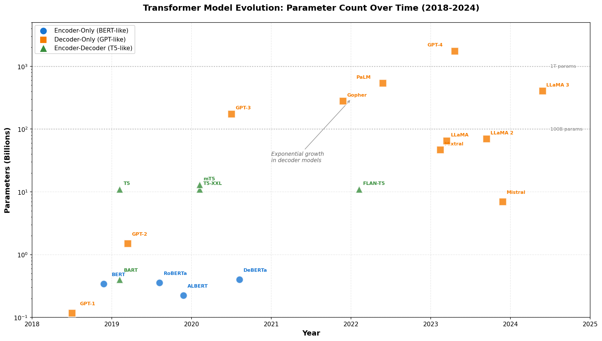

---

## Decoder-Only Models: GPT Family

### Architecture and Training Objective

Decoder-only models consist of transformer decoder layers with **causal masking**: each token can only attend to previous tokens and itself. This architectural choice naturally suits next-token prediction.

**Primary Training Objective:**

- **Causal Language Modeling (CLM):** Predict the next token given all previous tokens

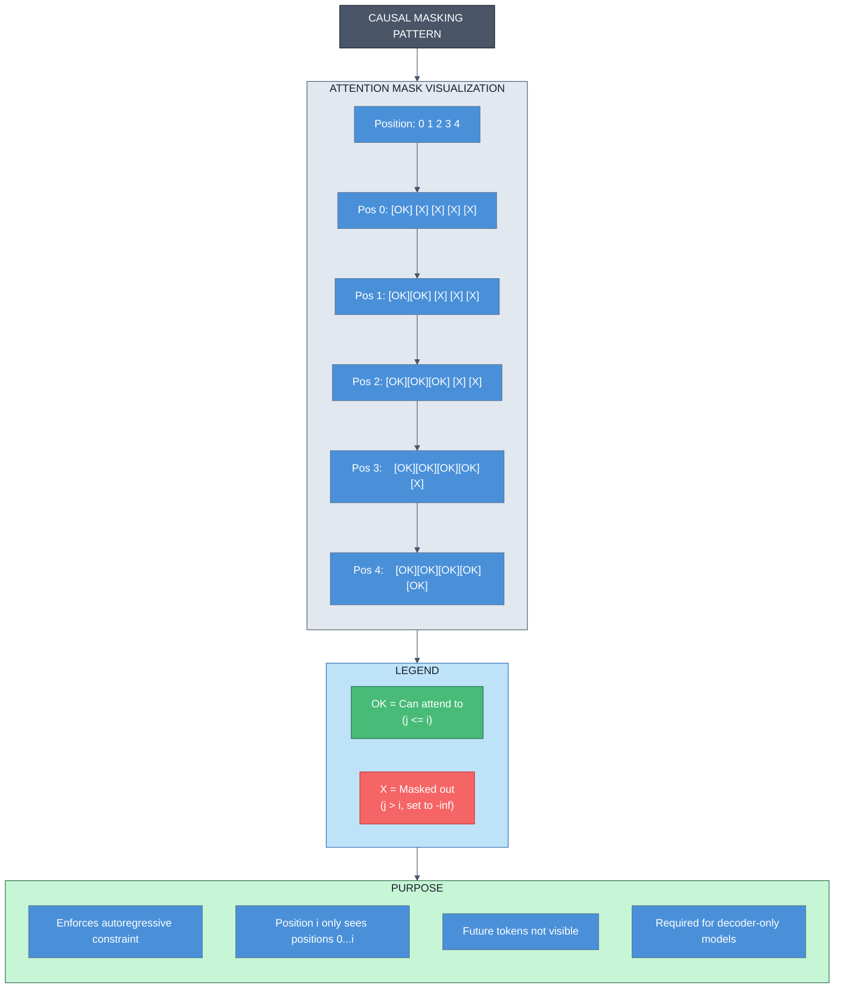

Despite this single objective, decoder-only models develop remarkable capabilities through scaling.

### The GPT Evolution

| Model | Release | Parameters | Context Window | Training Tokens |
|-------|---------|------------|-----------------|-----------------|
| GPT | 2018 | 110M | 512 | ~1B |
| GPT-2 | 2019 | 1.5B | 1024 | ~40B |
| GPT-3 | 2020 | 175B | 2048 | ~300B |
| GPT-3.5 | 2022 | 175B* | 4096 | With RLHF tuning |
| GPT-4 | 2023 | Unknown | 8192 | With multimodal training |

*Same base model, refined through instruction tuning and RLHF

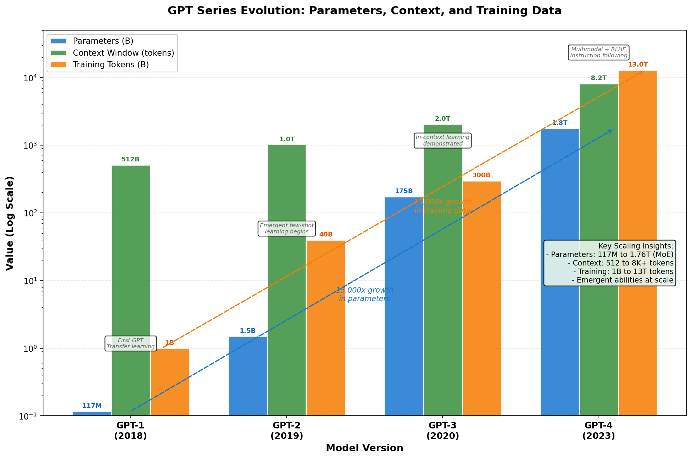

### Emergent Capabilities Through Scale

A remarkable discovery: decoder-only models at scale (GPT-2 at 1.5B, GPT-3 at 175B) exhibit **emergent capabilities** not present in smaller models:

- **Few-Shot Learning:** GPT-3 can solve novel tasks from just 2-3 examples in the prompt (in-context learning)
- **Reasoning:** Demonstrates chain-of-thought reasoning with appropriate prompting
- **Code Generation:** Writes functional code across multiple programming languages
- **Instruction Following:** Responds to natural language instructions without explicit fine-tuning

These capabilities don't appear smoothly; they emerge suddenly at certain scale thresholds.

### Alignment Techniques

Modern decoder-only models use additional training procedures to improve safety and usefulness:

- **Instruction Tuning:** Fine-tune on datasets of (instruction, response) pairs
- **Reinforcement Learning from Human Feedback (RLHF):** Use human preferences to fine-tune model behavior
- **Constitutional AI:** Align models using AI feedback based on constitutional principles

### Use Cases

Decoder-only models excel at:
- **Text Generation:** Creative writing, content creation, code generation
- **In-Context Learning:** Solving novel tasks from examples in the prompt
- **Question Answering:** Open-form QA with reasoning
- **Dialogue:** Multi-turn conversation systems

---

## Encoder-Decoder Models: T5 and BART

### Architecture

Encoder-decoder models feature the complete transformer architecture: an encoder stack processes the input bidirectionally, and a decoder stack generates output with causal masking. Cross-attention layers allow the decoder to attend to encoder outputs.

```mermaid
%%{init: {'theme': 'base', 'themeVariables': {'primaryColor': '#4a90d9', 'primaryTextColor': '#fff', 'lineColor': '#4a5568'}}}%%

flowchart LR
    subgraph input["INPUT"]
        IN["Input Sequence<br/>[The] [cat] [sat] [on] [mat]"]
    end

    subgraph encoder["ENCODER"]
        direction TB
        ENC["ENCODER<br/>(Bidirectional)<br/>No masking"]
    end

    subgraph cross["CROSS-ATTENTION"]
        direction TB
        CA["Cross-Attention<br/>K, V from encoder<br/>Q from decoder"]
    end

    subgraph decoder["DECODER"]
        direction TB
        DEC["DECODER<br/>(Causal)<br/>Autoregressive"]
    end

    subgraph output["OUTPUT"]
        OUT["Output Sequence<br/>[generated] [tokens]"]
    end

    IN --> ENC
    ENC -->|"Encoder<br/>Representations"| CA
    CA --> DEC
    DEC --> OUT
    OUT -->|"Feed back<br/>for next token"| DEC

    style input fill:#fbd38d,stroke:#c05621,color:#1a202c
    style encoder fill:#bee3f8,stroke:#2b6cb0,color:#1a202c
    style cross fill:#d6bcfa,stroke:#6b46c1,color:#1a202c
    style decoder fill:#fc8181,stroke:#c53030,color:#1a202c
    style output fill:#c6f6d5,stroke:#276749,color:#1a202c

    style IN fill:#ed8936,stroke:#c05621,color:#fff
    style ENC fill:#63b3ed,stroke:#2b6cb0,color:#fff
    style CA fill:#9f7aea,stroke:#6b46c1,color:#fff
    style DEC fill:#f56565,stroke:#c53030,color:#fff
    style OUT fill:#48bb78,stroke:#276749,color:#fff
```

### Training Objectives

- **Sequence-to-Sequence (Seq2Seq) Loss:** Encoder is trained to construct useful representations; decoder is trained for conditional language modeling given encoder outputs
- The model learns to solve tasks framed as text-to-text: input → encoder → decoder → output

### T5: Text-to-Text Transfer Transformer

T5 (2019) frames all NLP tasks as text-to-text problems:

- **Machine Translation:** "translate English to German: [text]" → [translated text]
- **Summarization:** "summarize: [document]" → [summary]
- **Question Answering:** "question: [Q] context: [C]" → [answer]
- **Sentiment:** "sentiment: [text]" → "positive/negative"

This unification enables a single architecture and training procedure across diverse tasks.

**T5 Variants:**
- T5-base: 220M parameters
- T5-large: 770M parameters
- T5-3B: 3 billion parameters
- T5-11B: 11 billion parameters

### BART: Bidirectional and Auto-Regressive Transformers

BART (2019) combines encoder and decoder training:
- **Corruption:** Randomly corrupt input (deletion, permutation, infilling)
- **Reconstruction:** Decode back to original text (denoising autoencoder objective)
- Strong performance on text generation tasks: summarization, paraphrase, translation

### Use Cases

Encoder-decoder models excel at:
- **Machine Translation:** Bilingual or multilingual translation
- **Summarization:** Document summarization with faithful abstraction
- **Question Answering:** Context-aware answer generation
- **Paraphrase Generation:** Stylistic or semantic variations
- **Semantic Parsing:** Convert text to structured representations

**Why Encoder-Decoder?** These models allow separate optimization of understanding (encoder) and generation (decoder), naturally suited to tasks with distinct input and output.

---

## Scaling Laws and Compute-Optimal Training

### The Scaling Hypothesis

Model performance follows predictable patterns with respect to three variables:
1. **Model parameters (N):** Total trainable weights
2. **Training tokens (D):** Total tokens processed during training
3. **Compute (C):** FLOPs used for training

More of each → better performance, but the relationship is not obvious.

### Early Scaling: Parameter-Centric (Suboptimal)

Early work (2020-2021) focused primarily on scaling model parameters:
- GPT-3 used 175B parameters with ~300B training tokens
- This led to **token-deficient** models: spending compute on parameters rather than data
- 175B-parameter models undertrained relative to their capacity

### Chinchilla Optimality and Compute-Optimal Scaling

Research by DeepMind (2022) on optimal scaling revealed fundamental principles:

**Chinchilla Scaling Law:**

```
For a fixed compute budget C:

N* ≈ C / (6D*)          (optimal model size)
D* ≈ C / 6              (optimal data size)

Where N is parameters, D is tokens, and C is compute

Implication: N_tokens ≈ 20 × N_params

For example:
- 70B parameters should train on ~1.4 trillion tokens
- 7B parameters should train on ~140B tokens
```

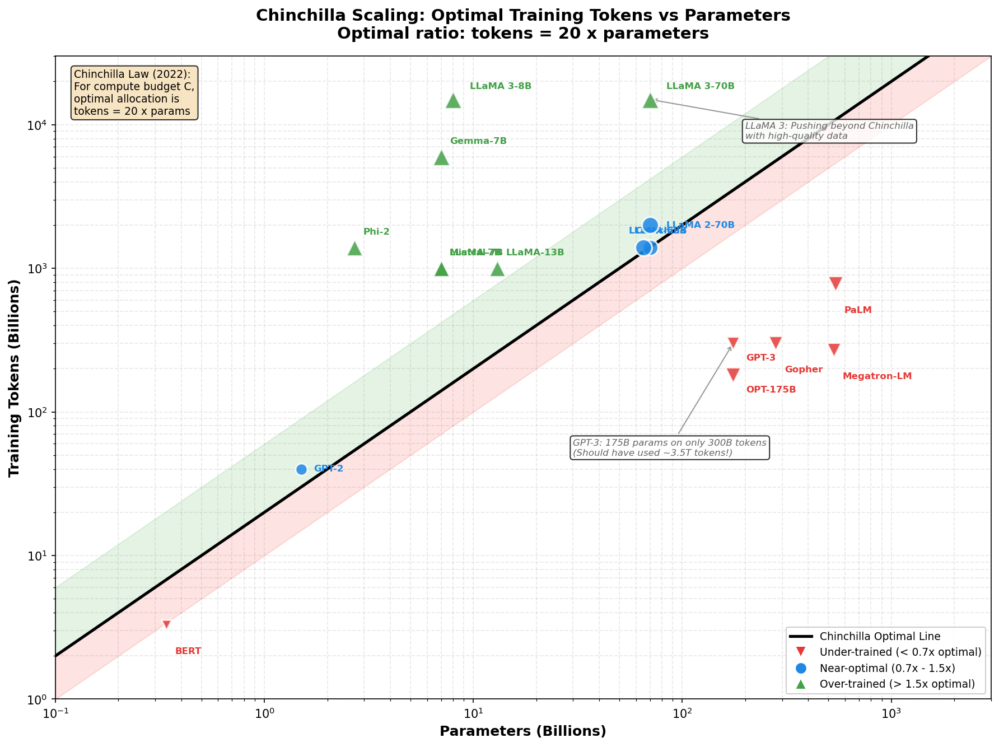

**Key Insight:** Model size and training tokens should increase proportionally. Previous scaling mostly increased parameters while keeping token count relatively constant.

### Practical Implications

1. **Retraining Existing Models:** Models like Galactica (120B params on 1.5T tokens), LLaMA (70B params on 1.4T tokens) followed near-optimal scaling
2. **Compute Budget Planning:** When deciding on model size, budget roughly equal compute for parameters and data
3. **Smaller Models Can Be Competitive:** A well-trained 7B parameter model often outperforms an under-trained 70B parameter model
4. **Data Quality Matters:** The scaling laws assume high-quality training data; low-quality data invalidates the relationship

### Scaling Curves

[*Visualization would show: Log-log plots of model size vs. performance, with curves showing power-law relationships and the compute-optimal frontier*]

The relationship approximately follows:

```
Loss ≈ a/N^α + b/D^β + c/C^γ

Where:
- α ≈ 0.07 (loss decreases with model size)
- β ≈ 0.10 (loss decreases with more data)
- Exponents increase with hyperparameter optimization
```

---

## Efficient Transformers: Scaling to Longer Sequences

### The Quadratic Attention Problem

Standard transformer attention scales as O(n²) in both memory and computation, where n is sequence length:

```
Attention(Q, K, V) = softmax(QK^T / √d_k) V

For n tokens and d_model dimensions:
- Computation: O(n² × d_model)
- Memory: O(n²) for attention matrix
```

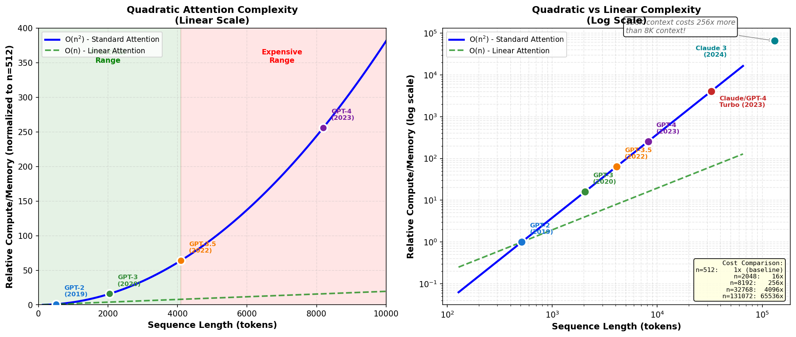

This limits effective context to ~2048-4096 tokens in practice. Processing 32K tokens becomes prohibitively expensive.

### Approaches to Efficiency

| Approach | Method | Trade-off |
|----------|--------|-----------|
| **Sparse Attention** | Attend only to local windows or patterns | Limited long-range dependency learning |
| **Local Attention** | Attend to ±k neighbor positions | Poor global context |
| **Linear Attention** | Approximate softmax with kernel | Lower expressiveness |
| **Compression** | Reduce sequence before attention (e.g., summarize) | Information loss |
| **Hierarchical** | Attend at multiple levels (local → global) | Training complexity |

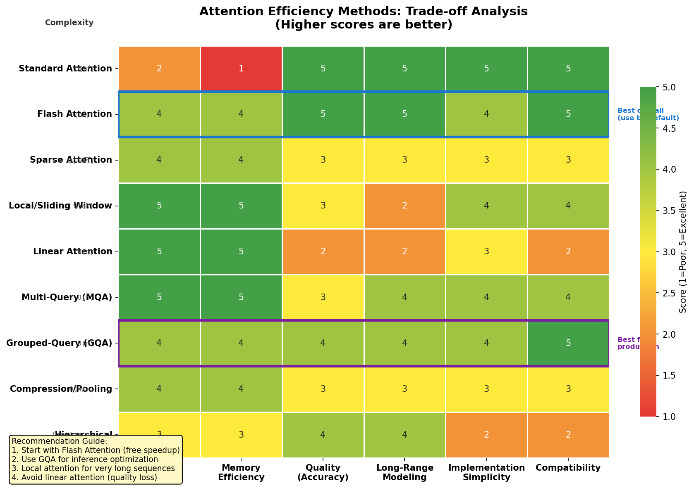

### Flash Attention

Flash Attention (2022) is not a new architecture but a **hardware-optimized implementation** of standard attention:

- Reorder attention computation to maximize GPU cache efficiency
- Reduces memory bandwidth, not algorithmic complexity
- Provides 2-4x speedup with identical accuracy
- Now standard in most modern transformer libraries
- Important distinction: It speeds up O(n²) attention but doesn't change the complexity

### Recent Innovations

- **ALiBi (Attention with Linear Biases):** Use position-dependent biases instead of learned embeddings; enables length extrapolation
- **Rope (Rotary Position Embeddings):** Encode positions using rotations in complex plane; excellent extrapolation properties
- **RoPE + Long Context:** Models like LLaMA extended to 32K context with position interpolation

---

## Architecture Modifications and Recent Innovations

### Attention Mechanism Variants

**Multi-Query Attention (MQA):**
- Standard: Each head has separate Q, K, V projections
- MQA: Heads share K and V, only Q is separate
- Benefit: 10-20% speedup with minimal quality loss
- Trade-off: Slightly reduced model expressiveness

**Grouped-Query Attention (GQA):**
- Middle ground: Multiple heads share groups of K, V
- Better balance of quality and efficiency than MQA
- Standard in recent models (Llama 2, Mistral)

```mermaid
%%{init: {'theme': 'base', 'themeVariables': {'primaryColor': '#4a90d9', 'primaryTextColor': '#fff', 'lineColor': '#4a5568'}}}%%

flowchart TB
    subgraph standard["STANDARD MULTI-HEAD ATTENTION"]
        direction LR
        S_Q1["Q1"]
        S_K1["K1"]
        S_V1["V1"]
        S_Q2["Q2"]
        S_K2["K2"]
        S_V2["V2"]
        S_Q3["Q3"]
        S_K3["K3"]
        S_V3["V3"]

        S_NOTE["Each head has separate Q, K, V<br/>Maximum expressiveness<br/>Highest memory usage"]
    end

    subgraph mqa["MULTI-QUERY ATTENTION (MQA)"]
        direction LR
        M_Q1["Q1"]
        M_Q2["Q2"]
        M_Q3["Q3"]
        M_K["K<br/>(shared)"]
        M_V["V<br/>(shared)"]

        M_NOTE["Q separate per head<br/>K, V shared across all heads<br/>10-20% faster, slight quality loss"]
    end

    subgraph gqa["GROUPED-QUERY ATTENTION (GQA)"]
        direction LR
        G_Q1["Q1"]
        G_Q2["Q2"]
        G_K1["K<br/>(group 1)"]
        G_V1["V<br/>(group 1)"]
        G_Q3["Q3"]
        G_Q4["Q4"]
        G_K2["K<br/>(group 2)"]
        G_V2["V<br/>(group 2)"]

        G_NOTE["Q separate, K/V shared in groups<br/>Better quality than MQA<br/>Used in Llama 2, Mistral"]
    end

    standard --> mqa
    mqa --> gqa

    style standard fill:#bee3f8,stroke:#2b6cb0,color:#1a202c
    style mqa fill:#fbd38d,stroke:#c05621,color:#1a202c
    style gqa fill:#c6f6d5,stroke:#276749,color:#1a202c

    style S_Q1 fill:#f56565,stroke:#c53030,color:#fff
    style S_Q2 fill:#f56565,stroke:#c53030,color:#fff
    style S_Q3 fill:#f56565,stroke:#c53030,color:#fff
    style S_K1 fill:#63b3ed,stroke:#2b6cb0,color:#fff
    style S_K2 fill:#63b3ed,stroke:#2b6cb0,color:#fff
    style S_K3 fill:#63b3ed,stroke:#2b6cb0,color:#fff
    style S_V1 fill:#48bb78,stroke:#276749,color:#fff
    style S_V2 fill:#48bb78,stroke:#276749,color:#fff
    style S_V3 fill:#48bb78,stroke:#276749,color:#fff

    style M_Q1 fill:#f56565,stroke:#c53030,color:#fff
    style M_Q2 fill:#f56565,stroke:#c53030,color:#fff
    style M_Q3 fill:#f56565,stroke:#c53030,color:#fff
    style M_K fill:#9f7aea,stroke:#6b46c1,color:#fff
    style M_V fill:#9f7aea,stroke:#6b46c1,color:#fff

    style G_Q1 fill:#f56565,stroke:#c53030,color:#fff
    style G_Q2 fill:#f56565,stroke:#c53030,color:#fff
    style G_Q3 fill:#f56565,stroke:#c53030,color:#fff
    style G_Q4 fill:#f56565,stroke:#c53030,color:#fff
    style G_K1 fill:#63b3ed,stroke:#2b6cb0,color:#fff
    style G_V1 fill:#48bb78,stroke:#276749,color:#fff
    style G_K2 fill:#63b3ed,stroke:#2b6cb0,color:#fff
    style G_V2 fill:#48bb78,stroke:#276749,color:#fff
```

### Position Embeddings

**Original (Sinusoidal):**
- Fixed trigonometric patterns, doesn't extrapolate well beyond training length
- Basis: $PE_{(pos, 2i)} = \sin(pos / 10000^{2i/d})$

**Rotary Position Embeddings (RoPE):**
- Encodes relative position through rotations
- Excellent generalization to longer sequences
- Standard in recent models (LLaMA, GPT-4)

**Attention with Linear Biases (ALiBi):**
- Add position-dependent bias directly to attention logits
- No learned parameters for positions
- Enables training on shorter sequences but evaluating on longer ones

### Activation Functions

**ReLU (Original):**
- Simple: max(0, x)
- Risk: "dead neurons" on negative values

**GELU (Gaussian Error Linear Unit):**
- Smooth approximation: $x \cdot \Phi(x)$ where Φ is standard normal CDF
- Learned to be optimal in transformers
- Standard in BERT, GPT-2+

**SwiGLU and GeGLU (Gated Variants):**
- Replace single linear layer with gated structure
- Better representation learning with roughly same compute
- Reduces hidden dimension while maintaining quality

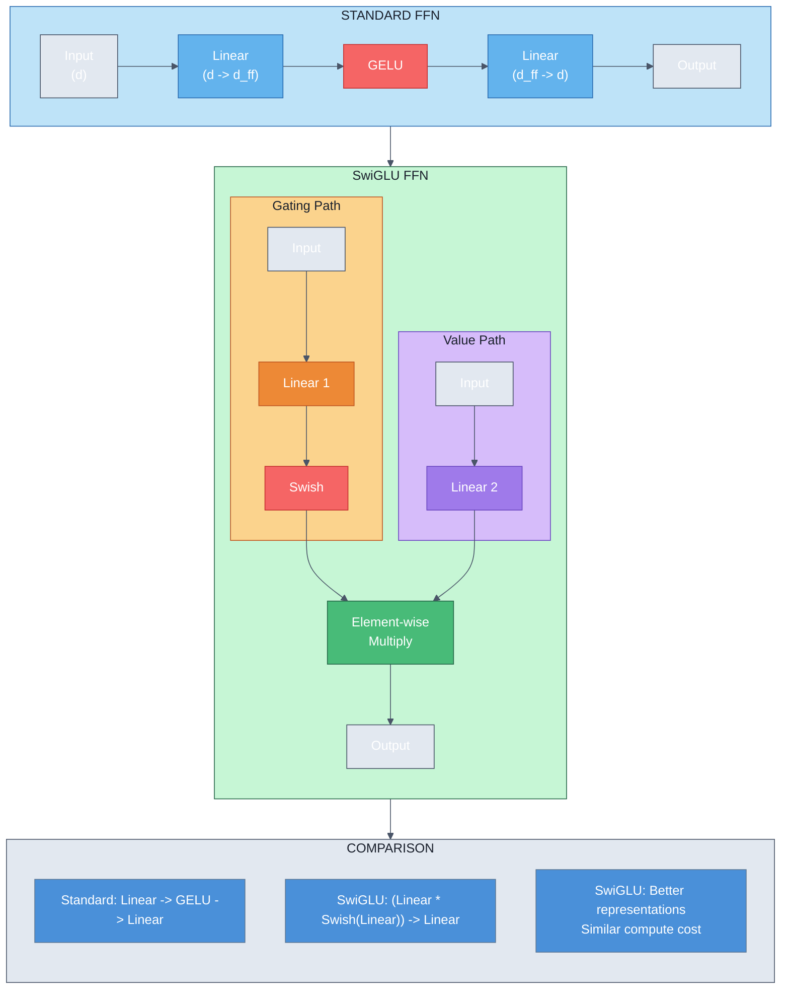

### Normalization Schemes

**LayerNorm:**
- Traditional: normalize across feature dimension
- Stable but can limit learning dynamics

**RMSNorm (Root Mean Square Norm):**
- Simpler: $\frac{x}{\text{RMS}(x)} \cdot \gamma$ (no beta term)
- Used in T5, LLaMA
- Slightly faster, similar expressiveness

---

## Architecture Comparison: When to Use What

| Task | Best Family | Specific Model | Reason |
|------|-------------|-----------------|--------|
| Classification | Encoder-Only | RoBERTa, DeBERTa | Bidirectional context, fine-tuning efficient |
| Text Generation | Decoder-Only | GPT-3, Llama, Mistral | Efficient generation, in-context learning |
| Summarization | Encoder-Decoder | BART, T5 | Faithfulness, separate understanding/generation |
| Machine Translation | Encoder-Decoder | T5-large, mBART | Cross-lingual representation learning |
| Semantic Search | Encoder-Only | Sentence-BERT | Efficient embedding generation |
| Long Document Understanding | Encoder-Only (long-context) | Longformer, BigBird | Sparse attention for length |
| In-Domain Few-Shot | Decoder-Only | Fine-tuned GPT | Few-shot generalization |

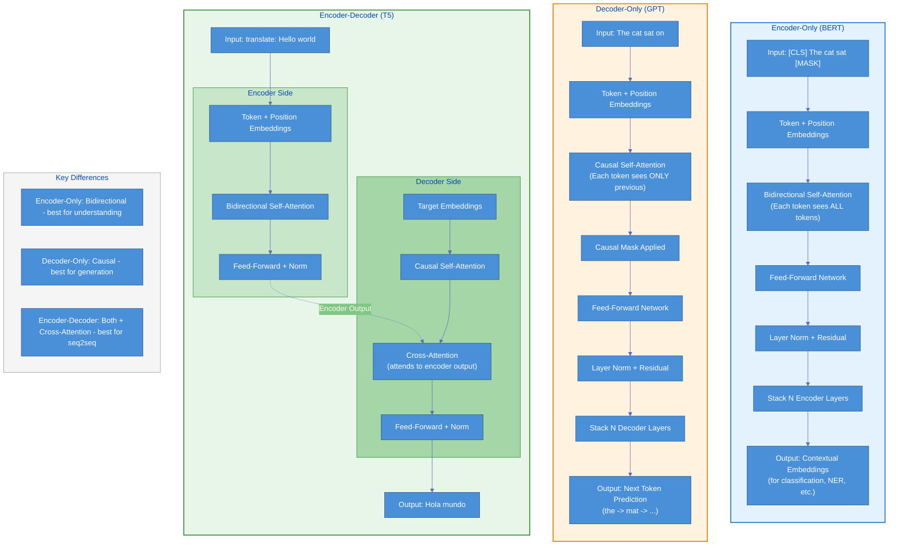

---

## Production Considerations

### Model Selection Framework

1. **Task Type:** Is this generative (decoder-only) or classification (encoder-only)?
2. **Compute Budget:** How much inference cost can you sustain?
3. **Latency Requirements:** Real-time (encoder-only), batch (either)?
4. **Accuracy vs. Speed:** Fine-tuned small model or prompt-based large model?
5. **Data Privacy:** Open-source (LLaMA) or proprietary (GPT-4)?

### Scaling Decisions

- **For research:** Follow compute-optimal scaling (equal budget for params and data)
- **For production:** Consider smaller, efficient models (7B-13B) unless you have specific requirements for capability
- **For fine-tuning:** Start with intermediate models (base sizes); larger models don't always fine-tune better
- **For inference:** Smaller models with MQA/GQA are preferable to massive models with standard attention

---

## Interview Questions & Answers

### Q1: Explain the difference between encoder-only and decoder-only models. When would you use each?

**Answer:**

**Encoder-Only Models (BERT, RoBERTa):**
- Process input bidirectionally (each token sees all other tokens)
- Trained with MLM objective (predict masked tokens)
- Excel at understanding tasks: classification, NER, semantic similarity
- Compute is "understanding-heavy"
- Cannot efficiently generate arbitrary text (no causal masking)

**Decoder-Only Models (GPT, LLaMA):**
- Process input causally (each token sees only previous tokens)
- Trained with CLM objective (predict next token)
- Excel at generation tasks: text creation, code generation, few-shot learning
- Must generate autoregressively (slower inference)
- Demonstrate emergent reasoning and in-context learning at scale

**When to Use:**
- **Encoder-Only:** Customer sentiment analysis, document categorization, named entity recognition, semantic search
- **Decoder-Only:** Customer chatbot, code completion, content generation, novel problem solving
- **Encoder-Decoder:** Machine translation, document summarization, question answering where input and output are distinct

**Key Insight:** The architectural choice directly influences what the model learns during pretraining, which determines downstream applicability.

---

### Q2: What is "compute-optimal scaling" and how does it differ from prior scaling approaches?

**Answer:**

**Prior Approach (Pre-2022):**
- Scale primarily on model parameters (more is better)
- Keep training tokens relatively fixed
- Result: 175B parameter GPT-3 on ~300B tokens was under-trained
- Inefficient allocation of compute budget

**Compute-Optimal Scaling (Chinchilla, 2022):**
The key finding: For a fixed compute budget, optimal performance requires scaling parameters and training tokens equally (roughly):

```
N_tokens ≈ 20 × N_params

Examples:
- 7B parameters × 20 = 140B tokens (LLaMA scaling)
- 70B parameters × 20 = 1.4T tokens (optimal for that size)
```

**Practical Implications:**

1. **Smaller Models Can Outperform Larger Ones:** A well-trained 7B model beats an undertrained 70B model
2. **Data Scarcity Changes Model Size:** If you have only 100B high-quality tokens, optimal model is ~5B parameters
3. **Inference Efficiency:** Deploy 7B parameter models instead of 70B—they're competitive when properly trained
4. **Token Quality Matters:** This law assumes high-quality diverse training data; noisy data violates the relationship

**Why It Matters:** Organizations spent billions scaling parameters. This research showed half of that compute should have gone to better data instead.

---

### Q3: What are the advantages and limitations of Multi-Query Attention (MQA) vs. Grouped-Query Attention (GQA)?

**Answer:**

**Standard Attention:**
```
Query:  Q_h1, Q_h2, Q_h3, ... (separate for each head)
Key:    K_h1, K_h2, K_h3, ... (separate for each head)
Value:  V_h1, V_h2, V_h3, ... (separate for each head)

Attention heads learn different representation patterns.
Maximum expressiveness, but high memory and compute.
```

**Multi-Query Attention (MQA):**
```
Query:  Q_h1, Q_h2, Q_h3, ... (separate)
Key:    K_shared (all heads use same K)
Value:  V_shared (all heads use same V)

Advantages:
- 10-20% faster inference (smaller KV cache)
- Lower memory footprint
- Suitable for deployment

Limitations:
- Reduced expressiveness (shared KV bottleneck)
- Quality sometimes 1-2% lower than standard attention
- K and V projections miss fine-grained distinctions
```

**Grouped-Query Attention (GQA):**
```
Query:  Q_h1, Q_h2, Q_h3, Q_h4, ... (separate per head)
Key/Value: Share among groups
- Group 1: Q_h1, Q_h2 share K_1, V_1
- Group 2: Q_h3, Q_h4 share K_2, V_2

Advantages:
- Better quality than MQA (groups add expressiveness)
- Still faster than standard attention (smaller KV cache)
- Good balance of quality and efficiency
- Used in Llama 2, Mistral 7B

Limitations:
- Slightly slower than MQA
- Slightly lower quality than standard attention
```

**Practical Decision Tree:**
- **Standard Attention:** Maximum quality, sufficient compute (ChatGPT-scale)
- **GQA:** Production systems (Llama 2, Mistral) - best trade-off
- **MQA:** Extreme latency constraints, edge deployment

---

### Q4: Why did RoPE (Rotary Position Embeddings) become the standard, and what problems does it solve?

**Answer:**

**Problem with Original Sinusoidal Embeddings:**
```
PE(pos, i) = sin(pos / 10000^(2i/d))

Issues:
1. Poor length extrapolation: train on 2048 tokens, test on 4096?
   Model performs poorly because embeddings are out-of-distribution
2. No relative position information is learned—only positional patterns
3. Cannot efficiently extend to longer sequences without retraining
```

**Rotary Position Embeddings (RoPE):**

Encodes position through rotation matrices in complex plane:
```
Position encoding rotates query/key vectors by angle θ = pos × base^(-2i/d)

Key insights:
1. Encodes relative positions naturally (relative rotation is position difference)
2. Self-attention's dot-product becomes: (Q·Rotation_θ) · (K·Rotation_φ)^T
   = Q·K^T evaluated at relative position θ-φ
3. Extrapolates to longer sequences naturally
```

**Advantages Over Sinusoidal:**

1. **Length Extrapolation:** Models trained on 2048 tokens work on 4096+ with minimal degradation
2. **Relative Position Learning:** Naturally encodes relative distance between tokens
3. **No Learned Parameters:** Deterministic (can be applied without training)
4. **Simplicity:** Elegant mathematical formulation

**Practical Impact:**
- LLaMA trained on 2048 context extended to 8K with position interpolation
- Some models now support 32K-100K contexts without retraining
- Standard in modern models: LLaMA, GPT-4, Mistral

**Why Matters in Interviews:** Shows understanding that architectural choices have downstream implications for generalization and practical deployment constraints.

---

## Quick Reference Card

### Model Architecture Summary

**Encoder-Only (BERT-like)**
- Use for: Classification, NER, semantic understanding
- Training: MLM + NSP (bidirectional)
- Inference: Single forward pass
- Best for: Efficiency, fine-tuning with limited labels
- Examples: BERT, RoBERTa, DeBERTa, ELECTRA

**Decoder-Only (GPT-like)**
- Use for: Generation, in-context learning, reasoning
- Training: Causal Language Modeling
- Inference: Autoregressive (token-by-token)
- Best for: Open-ended tasks, few-shot learning
- Examples: GPT-3, GPT-4, LLaMA, Mistral

**Encoder-Decoder (T5, BART)**
- Use for: Translation, summarization, structured generation
- Training: Seq2seq with encoder + decoder objectives
- Inference: Encoder once, decoder autoregressively
- Best for: Constrained generation, faithful transformation
- Examples: T5, BART, mBART, mT5

### Scaling Laws Quick Reference

```
Chinchilla Optimal Scaling:
- Training tokens ≈ 20 × Parameters
- Example: 7B model → train on 140B tokens
- Violates: Undertrained large models

Compute Allocation (for fixed budget):
- 1/3 compute → parameters
- 1/3 compute → data
- 1/3 compute → training (hardware efficiency)
```

### Efficiency Innovations Checklist

- [ ] Flash Attention (implementation speedup, use it)
- [ ] Multi-Query Attention (faster inference, slight quality loss)
- [ ] Grouped-Query Attention (better balance than MQA)
- [ ] RoPE Position Embeddings (length extrapolation)
- [ ] SwiGLU Activation (better representations)
- [ ] RMSNorm (simpler than LayerNorm)

### Model Selection Decision Tree

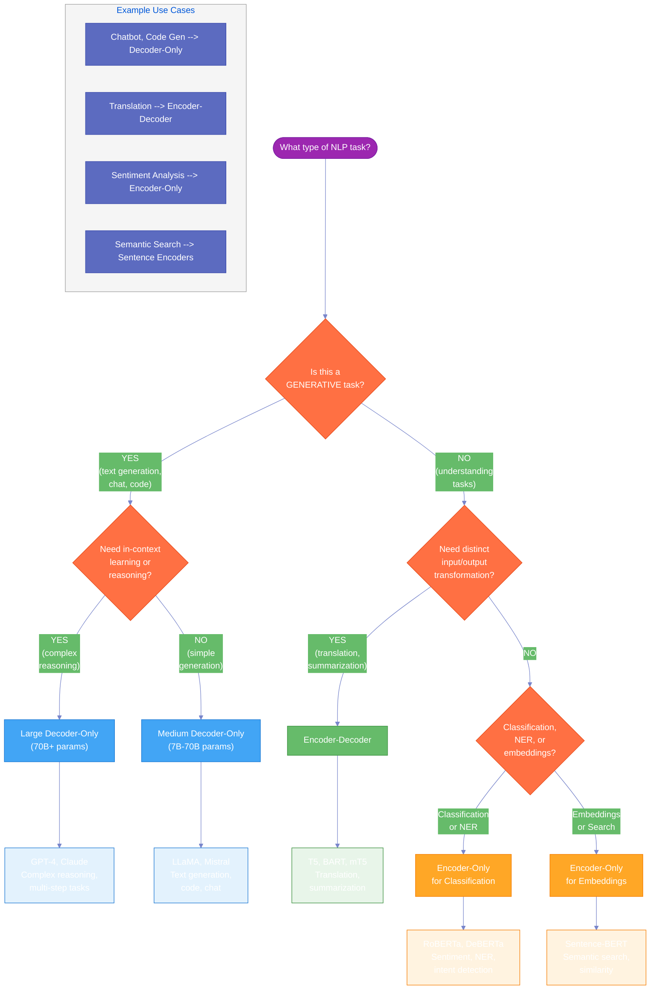

### Parameter Counts at a Glance

| Model Size | Parameters | Typical Use | Hardware |
|-----------|------------|------------|----------|
| Tiny | 1-7M | Mobile, edge | CPU/GPU |
| Small | 7-13B | Efficient inference, fine-tuning | Single GPU |
| Medium | 13-70B | Production deployment | Multi-GPU |
| Large | 70-405B | Maximum capability, research | A100 clusters |

### Key Takeaways

1. **Encoder-only, decoder-only, encoder-decoder** each excel at different task types
2. **Scaling matters, but data matters equally**—spend compute on both parameters and tokens
3. **Efficiency innovations** (MQA, GQA, Flash Attention) enable deployment of capable models
4. **Recent architectural choices** (RoPE, SwiGLU, RMSNorm) are near-universal now
5. **For production:** Small, efficient models (7B-13B) beat large undertrained models

---

## Further Reading

- Devlin et al., "BERT: Pre-training of Deep Bidirectional Transformers" (2018)
- Radford et al., "Language Models are Unsupervised Multitask Learners" - GPT-2 (2019)
- Brown et al., "Language Models are Few-Shot Learners" - GPT-3 (2020)
- Raffel et al., "Exploring the Limits of Transfer Learning with a Unified Text-to-Text Transformer" - T5 (2019)
- Hoffmann et al., "Training Compute-Optimal Large Language Models" - Chinchilla (2022)
- Su et al., "RoFormer: Enhanced Transformer with Rotary Position Embedding" (2021)
- Jiang et al., "Open LLaMA" and associated scaling studies (2023)
