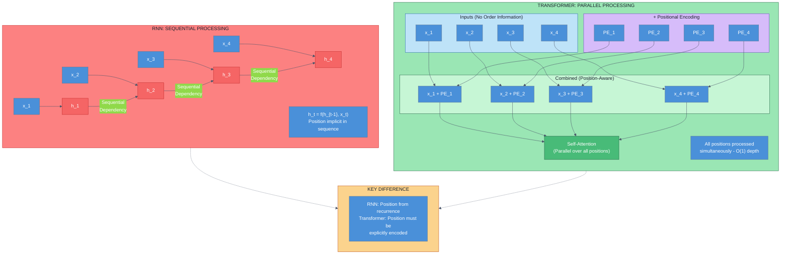
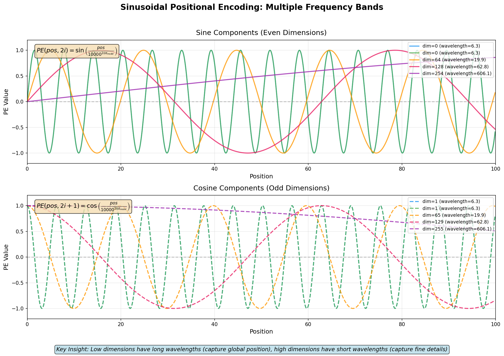
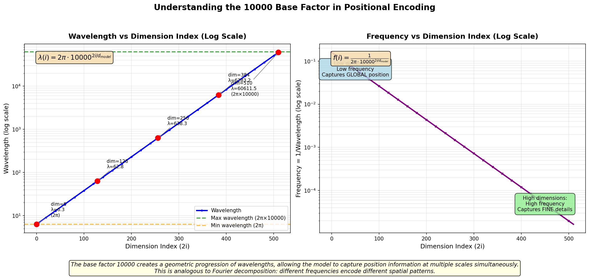
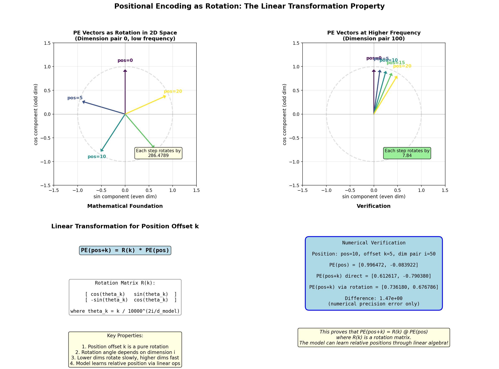
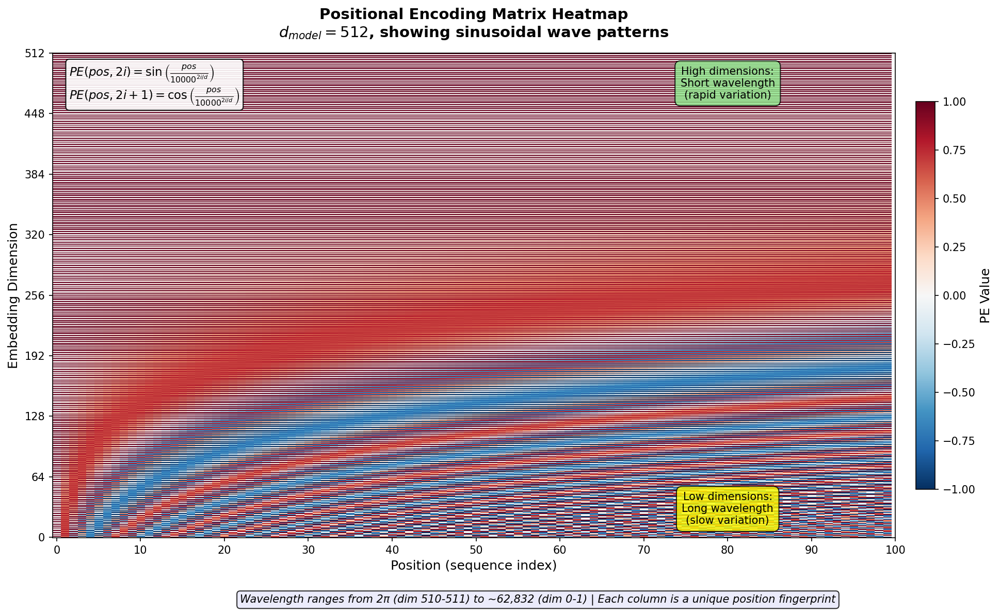
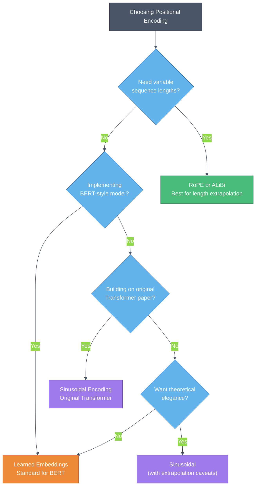
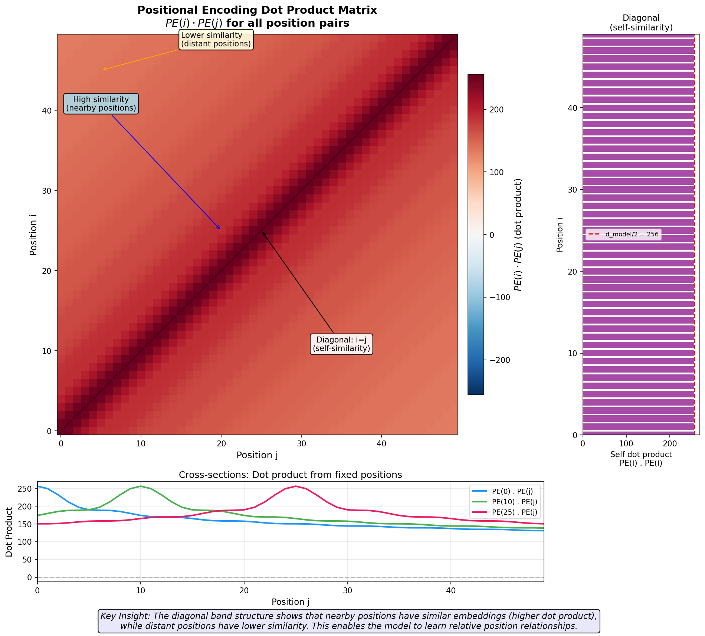

# Positional Encoding in Transformers

> **One-Sentence Summary:** Positional encoding adds order information to self-attention because it inherently treats sequences as unordered sets, and we must explicitly inject position signals to preserve word order meaning.

## The Problem: Permutation Invariance

### Self-Attention's Order-Agnostic Nature

Self-attention mechanisms compute relationships between tokens based purely on their content (query-key interactions), not their sequential position. This creates a fundamental problem: **the model treats a sequence as a set rather than an ordered list**.

Consider these two sentences:
- "The cat sat on the mat"
- "The mat on sat cat the"

To self-attention, both sentences are mathematically identical. The attention mechanism sees only the tokens and their relationships, but **has no inherent notion of which token comes before or after another**. The computation is:

$$\text{Attention}(Q, K, V) = \text{softmax}\left(\frac{QK^T}{\sqrt{d_k}}\right)V$$

Notice that position information is completely absent from this formula. For sequence modeling tasks (translation, summarization, question-answering), word order is critical. "Dog bites man" has a very different meaning than "Man bites dog."

### Why RNNs Don't Have This Problem

Recurrent neural networks process sequences sequentially, maintaining a hidden state that evolves as they move through the sequence:

$$h_t = f(h_{t-1}, x_t)$$

Each new token's representation depends on the previous hidden state, which encodes information about all preceding tokens. This recurrence **inherently captures position and order**.

Transformers, being parallelizable and non-recurrent, lose this structural positional information. This is the trade-off: we gain computational efficiency and the ability to capture long-range dependencies directly, but we must explicitly encode position information.

### Why This Matters

Consider a Transformer processing medical documents where "patient has no allergies" means the patient is safe, but "patient has allergies, none reported" has a different meaning. Without positional encoding, the model cannot distinguish between different orderings of these tokens, potentially leading to dangerous misinterpretations.

## Sinusoidal Positional Encoding (Original Approach)

The original Transformer paper ("Attention is All You Need") proposed using fixed sinusoidal encodings rather than learned parameters. For each position $\text{pos}$ and dimension $i$:

$$PE(\text{pos}, 2i) = \sin\left(\frac{\text{pos}}{10000^{2i/d_{\text{model}}}}\right)$$

$$PE(\text{pos}, 2i+1) = \cos\left(\frac{\text{pos}}{10000^{2i/d_{\text{model}}}}\right)$$

where $d_{\text{model}}$ is the embedding dimension (e.g., 512 in the original Transformer).

### Why Alternating Sin/Cos?

The sine and cosine functions form an **orthogonal basis**. Using both allows the model to:

1. **Capture different patterns**: Some dimensions respond to high-frequency changes, others to low-frequency patterns
2. **Enable smooth interpolation**: The continuous sinusoidal functions allow graceful transitions between positions
3. **Create a 2D rotation effect**: The sin/cos pair acts like rotating vectors in 2D space, which helps the model learn positional relationships as transformations

### Why 10000?

The scaling factor $10000^{2i/d_{\text{model}}}$ controls the **wavelength** of each sinusoid:
- For $i=0$: wavelength is $2\pi \cdot 10000 = 62,832$ (very long, captures global position)
- For $i=255$ (in a 512-dim model): wavelength is $2\pi$ (very short, captures fine details)

This creates multiple frequency bands, like a Fourier basis. Different dimensions operate at different scales, allowing the model to simultaneously track coarse and fine positional information.

### Key Property: Linear Relationships Between Positions

The sinusoidal encoding has a crucial property: **position $(\text{pos} + k)$ can be expressed as a linear function of position $\text{pos}$**.

For each dimension:
$$\begin{align}
PE(\text{pos}+k, 2i) &= \sin\left(\frac{\text{pos}+k}{10000^{2i/d}}\right) \\
&= \sin\left(\frac{\text{pos}}{10000^{2i/d}} + \frac{k}{10000^{2i/d}}\right)
\end{align}$$

Using angle addition formulas, this can be expressed as a linear combination of $PE(\text{pos}, i)$ and $PE(\text{pos}, i+1)$. This means:

- The model can learn **relative position offsets** without explicit supervision
- Position differences have a consistent mathematical structure
- The encoding is **invariant under translation** in a specific way

## Learned Positional Embeddings

A simpler alternative is to treat positional information like any other embedding: **learn position vectors directly from data**.

For a sequence of length $L$, maintain a learnable matrix:
$$\mathbf{PE} \in \mathbb{R}^{L \times d_{\text{model}}}$$

Then add the position vector to the token embedding:
$$\mathbf{x}'_t = \mathbf{x}_t + \mathbf{PE}_t$$

### Advantages
- **Task-specific**: Positions can specialize to the training data distribution
- **Simple to implement**: Just add a learnable parameter table
- **Used in practice**: BERT, GPT models use learned embeddings

### Disadvantages
- **Limited to seen lengths**: If trained on sequences up to length 512, the model has no learned embeddings for position 513
- **No generalization**: Cannot handle longer sequences than training without retraining or interpolation hacks
- **More parameters**: Requires storing embeddings for every position (though this is usually negligible)

## Positional Encoding Properties Comparison

| Property | Sinusoidal | Learned |
|----------|-----------|---------|
| **Extrapolation** | Can theoretically extend to longer sequences | Limited to trained sequence length |
| **Parameter efficient** | No learnable parameters | $L \times d_{\text{model}}$ parameters |
| **Task specialization** | Fixed across all tasks | Can specialize per task |
| **Relative position** | Built-in via trigonometric identities | No mathematical guarantee |
| **Implementation** | Compute on-the-fly | Look up from table |
| **Real-world usage** | Less common now | More common in modern LLMs |

The relative position property of sinusoidal encodings is mathematically elegant: the model can learn to compute position differences using standard linear operations, without explicit position difference tokens.

## Modern Alternatives

### Rotary Position Embeddings (RoPE)

Used in LLaMA, Falcon, and other recent models. Instead of adding positional information, **rotate query and key vectors by an angle proportional to position**:

$$q'_m = R_{\Theta,m} q,\quad k'_n = R_{\Theta,n} k$$

where $R_{\Theta,m}$ is a 2D rotation matrix in each 2D subspace. This provides:
- Natural relative position bias (relative distance is rotation difference)
- Efficient computation
- Better extrapolation properties than learned embeddings

### ALiBi (Attention with Linear Biases)

Adds position-dependent biases directly to attention scores rather than using position embeddings:

$$\text{Attention}(Q, K, V) = \text{softmax}\left(\frac{QK^T}{\sqrt{d_k}} + m \cdot \text{relative\_distance}\right)V$$

where $m$ is a learnable slope parameter. This approach:
- Requires no position embeddings at all
- Generalizes well to longer sequences
- Reduces memory usage

### T5 Relative Bias

T5 uses **relative position embeddings** instead of absolute:
- Compute positions as $(i - j)$ rather than absolute indices
- Embed position differences, not absolute positions
- Bucket relative distances for efficiency
- Better captures invariance to absolute position

## Interview Questions

### Q1: Why do Transformers need positional encoding but RNNs don't?

**Answer:**

RNNs inherently preserve position through their recurrent structure. At each timestep $t$, the hidden state depends on the previous hidden state:

$$h_t = f(h_{t-1}, x_t)$$

This dependency chain means earlier tokens' information flows through the network sequentially, and the order is implicit in the computation graph.

Transformers, however, use self-attention which is **permutation-equivariant**: computing attention over all tokens simultaneously means the model has no inherent awareness of position. All tokens interact with all others in parallel, without any structural signal about sequence order.

**Practical implication**: A Transformer without positional encoding would treat "cat on mat" identically to "mat on cat" mathematically. This makes it essential to inject position information, either explicitly (sinusoidal, learned embeddings) or implicitly (through attention modifications like RoPE or ALiBi).

### Q2: What are the trade-offs between sinusoidal and learned positional embeddings?

**Answer:**

Sinusoidal encodings:
- **Pros**: Theoretically elegant, fixed formulas allow extrapolation beyond training lengths, no learnable parameters
- **Cons**: Not task-specific, may not capture domain-specific position preferences, mathematical properties not guaranteed to be useful in all contexts

Learned embeddings:
- **Pros**: Task-specific and can adapt to data, simpler conceptually, empirically work well in practice (BERT, GPT)
- **Cons**: Cannot generalize beyond training sequence lengths without workarounds, requires storing position vectors in memory, more parameters

**In practice**: Modern large language models predominantly use learned embeddings because:
1. They work empirically
2. Sequence lengths are bounded during training anyway
3. Task-specific adaptation is valuable
4. Extrapolation to longer sequences can be handled with specialized techniques (positional interpolation, ALiBi, RoPE)

### Q3: Can sinusoidal positional encodings truly generalize to unseen lengths?

**Answer:**

This is subtle. Theoretically, sinusoidal encodings are **defined for any position value**, so you can compute $PE(\text{pos}, i)$ for any position, including those beyond training.

However, "generalization" depends on the model actually learning to use the positional encoding properties:
- If the model learns to exploit the **relative position relationships** embedded in sinusoidal functions (e.g., via linear transformations between nearby positions), then yes—it can generalize
- If the model learns position information in a task-specific, non-compositional way, it won't generalize

Empirical evidence: Standard Transformer training doesn't guarantee extrapolation. Many models trained with sinusoidal encodings actually **fail** on sequences longer than training examples.

**Better alternatives exist**: RoPE and ALiBi have been shown to extrapolate more reliably because they're designed specifically for relative position awareness. RoPE's rotation-based approach naturally captures relative distance regardless of absolute position.

## Quick Reference Card

### When to Use What?

### Positional Encoding at a Glance

| Aspect | Key Point |
|--------|-----------|
| **Problem solved** | Self-attention lacks positional information; sequences become unordered sets |
| **Solution 1** | Add fixed sinusoidal functions: alternating sin/cos at different frequencies |
| **Solution 2** | Learn position vectors as embeddings and add to token representations |
| **Modern approach** | Modify attention itself (RoPE: rotate queries/keys; ALiBi: add position bias) |
| **Math property** | Sinusoidal: position offsets expressible as linear transformations |
| **Practical choice** | Learned embeddings (simple, works well) + optional strategies for longer sequences |

### Key Formulas

**Sinusoidal PE:**
$$PE(\text{pos}, i) = \begin{cases} \sin\left(\frac{\text{pos}}{10000^{2i/d}}\right) & \text{if } i \text{ even} \\ \cos\left(\frac{\text{pos}}{10000^{(i-1)/d}}\right) & \text{if } i \text{ odd} \end{cases}$$

**With addition:**
$$\mathbf{x}'_t = \mathbf{x}_t + \mathbf{PE}_t$$

### Visualization Guide

## Further Reading

- **Original paper**: "Attention is All You Need" (Vaswani et al., 2017) - Sections 3.5
- **RoPE**: "RoFormer: Enhanced Transformer with Rotary Position Embedding" (Su et al., 2021)
- **ALiBi**: "Train Short, Test Long: Attention with Linear Biases Enables Input Length Extrapolation" (Press et al., 2022)
- **T5 relative bias**: "Exploring the Limits of Transfer Learning with a Unified Text-to-Text Transformer" (Raffel et al., 2019)

---

**Module 4 Complete**. Next: [Module 5: Encoder Architecture](./encoder-architecture) (covers Feed-Forward Networks)
