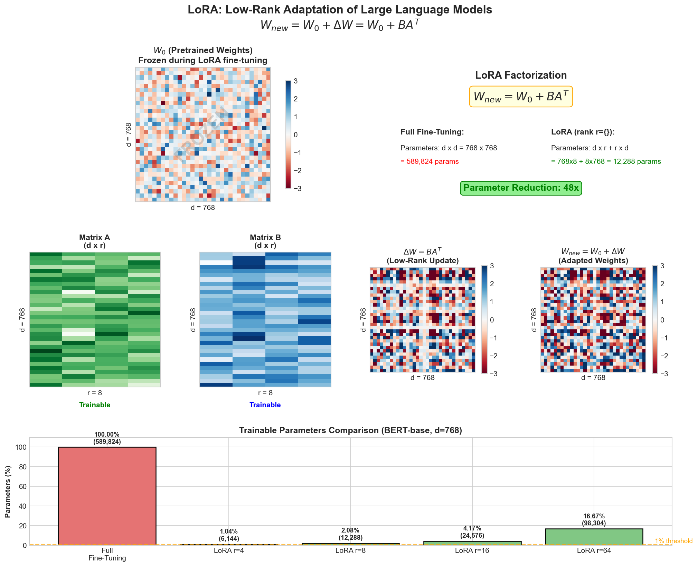
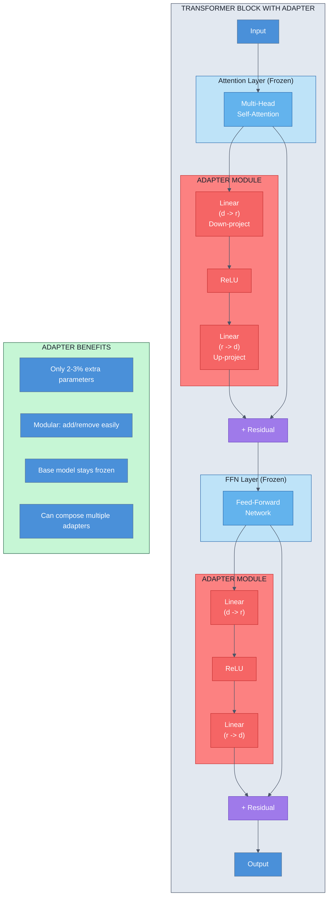
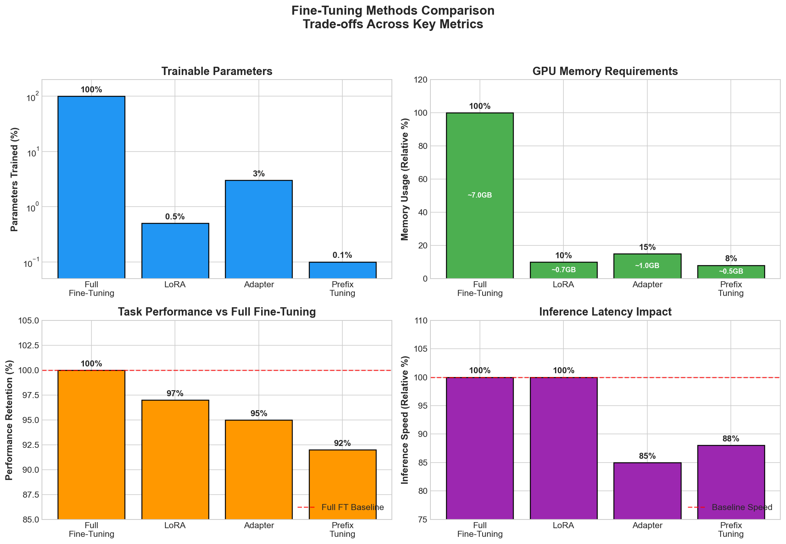
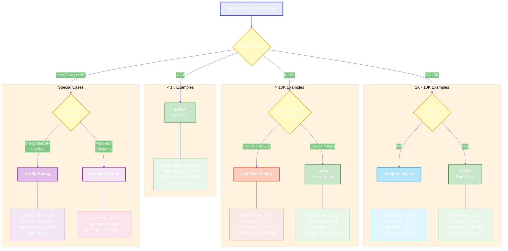
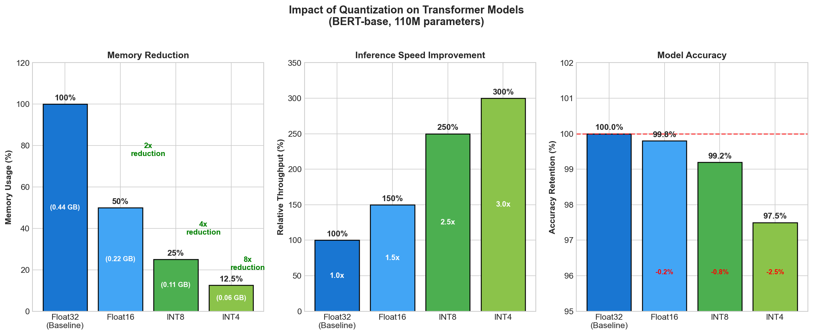
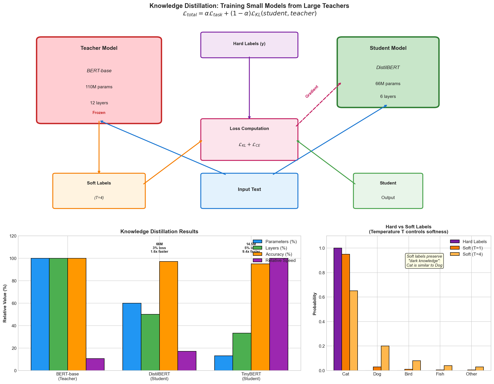
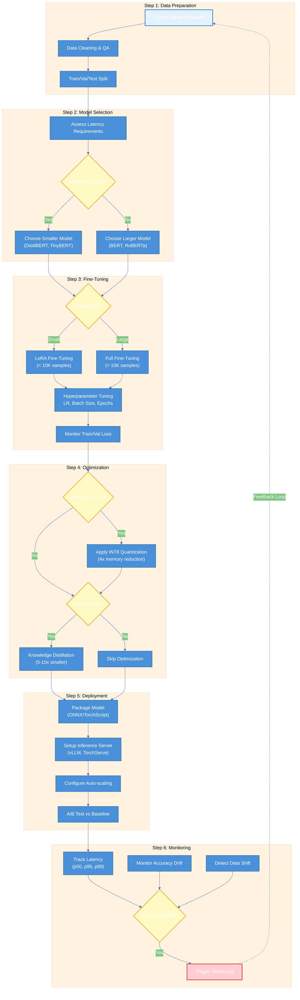
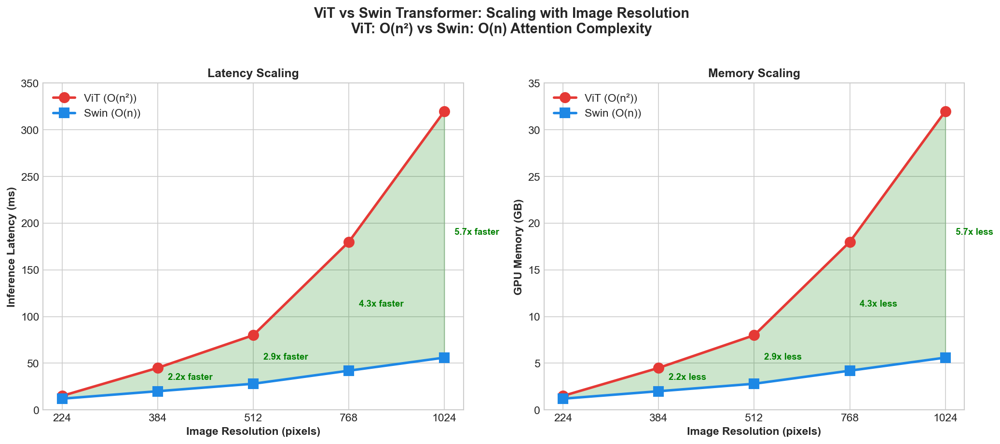

# Module 9: Practical Applications of Transformers

> Transformers power production ML systems through systematic task-model matching, efficient fine-tuning strategies, and deployment optimizations that balance performance with computational constraints.

## NLP Tasks Overview

Transformers excel at diverse NLP tasks. The key to practical success is matching the right model architecture to each task's requirements.

### Task-Model Matching

| Task | Input | Output | Recommended Model | Key Characteristic |
|------|-------|--------|-------------------|-------------------|
| Text Classification | Full sequence | Single label | BERT, RoBERTa | Encodes full context via [CLS] token |
| Sentiment Analysis | Full text | Sentiment class | BERT, DistilBERT | Binary/multi-class classification |
| Named Entity Recognition | Full sequence | Per-token labels | BERT, BioBERT | Token-level classification heads |
| Question Answering | Question + Context | Span prediction | BERT, RoBERTa | Predicts start/end token indices |
| Machine Translation | Source language | Target language | T5, mBART, M2M-100 | Encoder-decoder with cross-attention |
| Text Summarization | Long document | Condensed text | BART, T5, Pegasus | Encoder-decoder with abstraction |
| Text Generation | Prefix/prompt | Open-ended text | GPT-2/3, Llama, Mistral | Decoder-only, autoregressive |
| Semantic Search | Query + Passages | Relevance scores | Sentence-BERT, BGE | Dense vector representations |

### Key NLP Applications

**Text Classification & Sentiment Analysis**

BERT-based models work excellently for these tasks:
- Fine-tune on labeled dataset (typically 500-5000 examples)
- Add linear classification head on [CLS] token
- Typical architecture: `[CLS] + tokens + [SEP]` → Classification layer

```python
# Pseudocode for text classification
def fine_tune_bert_classifier(texts, labels, num_classes):
    # Initialize BERT with classification head
    model = BertForSequenceClassification.from_pretrained(
        'bert-base-uncased',
        num_labels=num_classes
    )
    # Fine-tune on task
    # Loss = CrossEntropyLoss(model(texts), labels)
    return model
```

**Named Entity Recognition (NER)**

Token-level classification requires different architecture:
- For each token, predict entity type or "O" (outside)
- Use full token sequence, not just [CLS]
- Handle subword tokenization carefully (use first subword prediction)

**Question Answering**

SQuAD-style task predicts span within context:
$$\text{start\_logits} = \text{LinearLayer}(h_i) \quad \text{for all tokens } i$$
$$\text{end\_logits} = \text{LinearLayer}(h_i) \quad \text{for all tokens } i$$

Model learns to find answer span through:
- Start token probability: $P(\text{start}=i) = \text{softmax}(\text{start\_logits})$
- End token probability: $P(\text{end}=j) = \text{softmax}(\text{end\_logits})$
- Common constraint: end ≥ start

**Machine Translation**

Encoder-decoder models handle sequence-to-sequence mapping:
- Encoder processes source language
- Cross-attention connects encoder to decoder
- Decoder generates target token-by-token
- Models: T5 (unified text-to-text), mBART (multilingual), M2M-100 (100 languages)

**Text Summarization**

Similar architecture to translation but with abstractive capability:
- BART pre-trained with denoising objective (excellent for summarization)
- T5 treated as text-to-text problem: "summarize: [document]"
- Pegasus specifically fine-tuned for summarization tasks

**Open-Ended Text Generation**

Decoder-only models (GPT family):
- Autoregressive: predict next token given previous context
- Larger models = better generation quality
- Requires careful prompting and decoding strategies

## Fine-Tuning Strategies

In practice, you rarely train transformers from scratch. Fine-tuning adapts pretrained models to specific tasks. Modern approaches balance performance with computational efficiency.

### Full Fine-Tuning

**What:** Train all transformer parameters on your task

**Pros:**
- Maximum model capacity
- Best performance on task-specific data
- Straightforward implementation

**Cons:**
- High memory requirements (proportional to model size)
- Slow training for large models
- Risk of catastrophic forgetting

**When to use:** ample GPU memory, large labeled dataset (10K+ examples)

### LoRA (Low-Rank Adaptation)

Instead of updating weight matrix $W$ directly:
$$W_{\text{new}} = W + \Delta W = W + AB^T$$

where $A \in \mathbb{R}^{n \times r}$, $B \in \mathbb{R}^{m \times r}$, and $r \ll \min(n,m)$.

Only $A$ and $B$ are trained; $W$ is frozen.

**Pros:**
- 10-100x parameter reduction
- Same inference latency as base model
- Can fine-tune multiple LoRA sets for different tasks
- Memory efficient: ~1/10 of full fine-tuning

**Cons:**
- Slightly lower performance than full fine-tuning
- Requires separate rank selection
- Adds complexity to deployment



### Adapter Layers

Add small bottleneck modules between transformer layers:



**Pros:**
- Modular: easy to add/remove
- Minimal additional parameters (2-3% of model)
- Can compose multiple adapters

**Cons:**
- Inference overhead (extra layers)
- More complex than LoRA
- Latency increase (5-20% typically)

### Prefix Tuning

Learn prefix embeddings prepended to input:

$$\text{Input} = [\text{p}_1, \text{p}_2, ..., \text{p}_k, \text{x}_1, ..., \text{x}_n]$$

where $\text{p}_i$ are learnable prefix vectors.

**Pros:**
- Interpretable: prefix acts as task instruction
- Works well for few-shot scenarios
- Minimal parameters (~0.1% of model)

**Cons:**
- Reduces effective sequence length
- Performance depends on prefix length
- Inference: still compute prefix for every example

### Prompt Tuning

Extreme version of prefix tuning: learn soft prompt embeddings

$$\text{Loss} = L(\text{model}([\text{soft\_prompt}] + x), y)$$

**Pros:**
- True few-shot learning capability
- Minimal parameters
- Easy to compose

**Cons:**
- Requires larger models to work well
- Less stable training than other methods
- Performance gap with fine-tuning

### Fine-Tuning Methods Comparison

| Method | Parameters Trained | Memory | Inference Speed | Performance | Use Case |
|--------|-------------------|--------|-----------------|-------------|----------|
| Full Fine-Tune | 100% | High | Baseline | Best | Large dataset, unlimited compute |
| LoRA | 0.1-1% | Low | Baseline | 95-98% | Production, many tasks |
| Adapter | 2-5% | Low | 80-95% | 94-97% | Modular systems |
| Prefix Tune | 0.1% | Low | 85-90% | 90-95% | Few-shot learning |
| Prompt Tune | 0.01% | Very Low | Baseline | 85-92% | In-context learning |



**Recommendation:** Start with LoRA for most production scenarios. It offers best balance of efficiency, performance, and simplicity.

### Fine-Tuning Decision Tree

Use this decision tree to select the appropriate fine-tuning method based on your constraints:



## Vision Transformers

Transformers revolutionized computer vision by treating images as sequences of patches.

### Patch Embedding

Original ViT divides image into patches:
- 224×224 image → 196 patches (16×16 each)
- Each patch projected to embedding dimension: $d = 768$
- Process like language: add positional embeddings, apply transformer

### Vision Transformer (ViT)

Standard architecture for image classification:

```mermaid
%%{init: {'theme': 'base', 'themeVariables': { 'primaryColor': '#4a90d9', 'primaryTextColor': '#fff', 'primaryBorderColor': '#2a5d8f', 'lineColor': '#5c6bc0', 'secondaryColor': '#81c784', 'tertiaryColor': '#fff3e0'}}}%%
flowchart TD
    subgraph Input["Input Stage"]
        A["Input Image<br/><b>224 x 224 x 3</b>"]
    end

    subgraph Patching["Patch Division"]
        B["Patch Division<br/><b>14 x 14 = 196 patches</b><br/>(16x16 pixels each)"]
    end

    subgraph Embedding["Embedding Stage"]
        C["Linear Projection<br/><b>196 x 768</b><br/>(patch_dim -> embed_dim)"]
        D["[CLS] Token Prepend<br/><b>197 x 768</b>"]
        E["+ Position Embeddings<br/><b>197 x 768</b><br/>(learnable)"]
    end

    subgraph Transformer["Transformer Encoder"]
        F["Transformer Block 1<br/>Multi-Head Attention + MLP<br/><b>197 x 768</b>"]
        G["Transformer Block 2-11<br/>...<br/><b>197 x 768</b>"]
        H["Transformer Block 12<br/>Multi-Head Attention + MLP<br/><b>197 x 768</b>"]
    end

    subgraph Output["Classification Output"]
        I["Extract [CLS] Token<br/><b>1 x 768</b>"]
        J["Classification Head<br/>(MLP Layer)<br/><b>768 -> num_classes</b>"]
        K["Output Predictions<br/><b>num_classes</b>"]
    end

    A --> B
    B --> C
    C --> D
    D --> E
    E --> F
    F --> G
    G --> H
    H --> I
    I --> J
    J --> K

    style A fill:#e3f2fd,stroke:#1976d2,stroke-width:2px
    style B fill:#fff3e0,stroke:#f57c00,stroke-width:2px
    style C fill:#e8f5e9,stroke:#388e3c,stroke-width:2px
    style D fill:#e8f5e9,stroke:#388e3c,stroke-width:2px
    style E fill:#e8f5e9,stroke:#388e3c,stroke-width:2px
    style F fill:#f3e5f5,stroke:#7b1fa2,stroke-width:2px
    style G fill:#f3e5f5,stroke:#7b1fa2,stroke-width:2px
    style H fill:#f3e5f5,stroke:#7b1fa2,stroke-width:2px
    style I fill:#fce4ec,stroke:#c2185b,stroke-width:2px
    style J fill:#fce4ec,stroke:#c2185b,stroke-width:2px
    style K fill:#ffebee,stroke:#d32f2f,stroke-width:2px
```



**Strengths:**
- Clean, elegant design
- Excellent performance with large-scale pretraining
- Interpretable attention patterns

**Weaknesses:**
- Requires large training datasets (ImageNet-21K+)
- Computationally expensive
- Less efficient on small images

### DeiT (Distilled ViT)

Improves ViT efficiency through knowledge distillation:
- Train ViT with teacher guidance
- Learns from both hard labels and teacher's soft predictions
- Works well with smaller training sets

**Key advantage:** ViT-level performance on ImageNet alone (no extra pretraining)

### Swin Transformer

Hierarchical vision transformer with shifted windows:

```mermaid
%%{init: {'theme': 'base', 'themeVariables': {'primaryColor': '#4a90d9', 'primaryTextColor': '#fff', 'lineColor': '#4a5568'}}}%%

flowchart LR
    subgraph input["INPUT"]
        IMG["Image<br/>224 x 224"]
    end

    subgraph embed["PATCH EMBED"]
        PE["Linear<br/>Embedding<br/>56 x 56"]
    end

    subgraph stage1["STAGE 1"]
        S1["Swin Block<br/>4 heads<br/>56 x 56<br/>C = 96"]
    end

    subgraph stage2["STAGE 2"]
        S2["Swin Block<br/>8 heads<br/>28 x 28<br/>C = 192"]
    end

    subgraph stage3["STAGE 3"]
        S3["Swin Block<br/>16 heads<br/>14 x 14<br/>C = 384"]
    end

    subgraph stage4["STAGE 4"]
        S4["Swin Block<br/>32 heads<br/>7 x 7<br/>C = 768"]
    end

    subgraph output["OUTPUT"]
        CLS["Classification<br/>Head"]
    end

    IMG --> PE
    PE --> S1
    S1 -->|"Patch<br/>Merging"| S2
    S2 -->|"Patch<br/>Merging"| S3
    S3 -->|"Patch<br/>Merging"| S4
    S4 --> CLS

    subgraph benefits["SWIN BENEFITS"]
        direction TB
        B1["Shifted window attention<br/>O(n) complexity"]
        B2["Hierarchical structure<br/>Multi-scale features"]
        B3["Efficient for<br/>high-res images"]
    end

    style input fill:#fbd38d,stroke:#c05621,color:#1a202c
    style embed fill:#d6bcfa,stroke:#6b46c1,color:#1a202c
    style stage1 fill:#bee3f8,stroke:#2b6cb0,color:#1a202c
    style stage2 fill:#9ae6b4,stroke:#276749,color:#1a202c
    style stage3 fill:#fbd38d,stroke:#c05621,color:#1a202c
    style stage4 fill:#fc8181,stroke:#c53030,color:#1a202c
    style output fill:#e2e8f0,stroke:#4a5568,color:#1a202c
    style benefits fill:#c6f6d5,stroke:#276749,color:#1a202c

    style IMG fill:#ed8936,stroke:#c05621,color:#fff
    style PE fill:#9f7aea,stroke:#6b46c1,color:#fff
    style S1 fill:#63b3ed,stroke:#2b6cb0,color:#fff
    style S2 fill:#48bb78,stroke:#276749,color:#fff
    style S3 fill:#ed8936,stroke:#c05621,color:#fff
    style S4 fill:#f56565,stroke:#c53030,color:#fff
    style CLS fill:#718096,stroke:#4a5568,color:#fff
```



**Innovations:**
- Shifted window attention: reduces complexity from $O(n^2)$ to $O(n)$
- Hierarchical structure: progressively larger patches
- Efficient even for high-resolution images

**When to use:**
- Object detection: Swin excels
- Semantic segmentation: Swin preferred
- Image classification: ViT or DeiT sufficient
- High-resolution images: Swin more efficient

## Multimodal Applications

Modern systems combine vision and language understanding.

### CLIP (Contrastive Language-Image Pre-training)

Learns joint vision-language embeddings:
- Vision encoder: extract image features
- Text encoder: extract text features
- Training: maximize similarity of matched pairs, minimize for unmatched

**Applications:**
- Zero-shot image classification: no fine-tuning needed
- Image-text retrieval: find matching images for text queries
- Vision-language understanding: encode images and text in shared space

### Flamingo and Vision-Language Models

Larger models combining vision + language:
- Can perform visual reasoning
- Support in-context learning
- Enable image captioning and visual question answering

### Cross-Modal Applications

| Application | Input | Output | Model |
|------------|-------|--------|-------|
| Image Captioning | Image | Text description | Flamingo, BLIP-2 |
| Visual QA | Image + Question | Answer text | Flamingo, LLaVA |
| Image Retrieval | Text query | Top-K images | CLIP |
| Text-to-Image | Text prompt | Generated image | CLIP + Diffusion |

## Deployment Considerations

Taking transformers to production requires efficiency optimizations.

### Quantization

Reduce model precision to lower memory and faster inference:

**INT8 Quantization:**
- Convert float32 weights to int8
- 4x memory reduction
- 2-3x inference speedup
- Minimal accuracy loss (< 1%)

**INT4 Quantization:**
- Further compression
- 8x memory reduction
- Used for on-device deployment
- Trade-off: accuracy loss (2-5%)

```
# Quantization formula
w_int8 = round(127 * w_float32 / max(|w_float32|))
# During inference: scale back by max value
```



### Distillation

Train small "student" model to mimic large "teacher":

$$\mathcal{L}_{\text{total}} = \alpha \mathcal{L}_{\text{task}} + (1-\alpha) \mathcal{L}_{\text{KL}}(\text{student}, \text{teacher})$$

**Benefits:**
- Student model 5-10x smaller
- Near-teacher performance
- Practical for production

### Pruning

Remove unimportant weights from network:
- Magnitude pruning: remove small weights
- Attention pruning: remove attention heads with low impact
- Structured pruning: remove entire layers

**Results:**
- 30-50% parameter reduction
- Requires retraining to recover accuracy
- Works best with quantization

### Knowledge Distillation Specifics

Key hyperparameters:
- Temperature $T$: controls softness of teacher predictions
- Student loss weight $\alpha$: balance between task and distillation loss
- Student size: typical ratio 1/5 to 1/10 of teacher

$$\text{KL}(\text{teacher}, \text{student}) = \sum_i \text{student}_i \log \frac{\text{student}_i}{\text{teacher}_i}$$



### Inference Optimization

**KV-Cache:**
- Cache key-value pairs from previous tokens
- Reduces redundant computation
- Memory-compute trade-off

**Batching:**
- Process multiple examples together
- Increases throughput significantly
- Typical batch size: 32-256 depending on hardware

**Sequence Length Optimization:**
- Shorter sequences: faster inference
- Dynamic batching: different sequence lengths in same batch
- Padding efficiency critical

## Production Pipeline

Translating research to deployed systems requires systematic approach.

### From Pretrained to Production

**Step 1: Task Selection & Data Preparation**
- Gather labeled dataset for your task
- Data cleaning, annotation quality checks
- Train/validation/test split

**Step 2: Model Selection**
- Choose model size based on latency requirements
- Consider pretraining corpus relevance
- Evaluate on validation set

**Step 3: Fine-Tuning**
- Select strategy: LoRA for efficiency, full fine-tune for maximum performance
- Hyperparameter tuning: learning rate, batch size, epochs
- Monitor train/validation loss

**Step 4: Optimization**
- Apply quantization if latency critical
- Consider distillation for production deployment
- A/B test against baseline

**Step 5: Deployment**
- Package model (ONNX, TorchScript, or framework-specific)
- Set up inference server (vLLM, TorchServe, TensorFlow Serving)
- Implement versioning for model updates

**Step 6: Monitoring**
- Track inference latency percentiles (p50, p95, p99)
- Monitor accuracy drift over time
- Set up feedback loop for continuous improvement



### API Design Considerations

```python
# Example API for text classification
POST /classify
{
  "text": "This product is amazing!",
  "model_version": "v1.2.3",
  "return_confidence": true
}

Response:
{
  "label": "positive",
  "confidence": 0.95,
  "inference_time_ms": 45,
  "model_version": "v1.2.3"
}
```

**Key considerations:**
- Versioning: handle multiple model versions
- Confidence scores: downstream systems often need uncertainty
- Latency budgets: set SLOs upfront
- Graceful degradation: fallback strategies for timeouts

### Latency and Throughput Targets

**Typical targets by application:**
- Real-time (interactive): < 100ms per request
- Batch processing: < 1 second per example
- Offline analysis: < 10 seconds per batch

**Optimization techniques:**
- Model size reduction (quantization, distillation)
- Batch inference (amortize overhead)
- Hardware acceleration (GPU, TPU)
- Caching (cache embeddings, predictions for similar inputs)

### Monitoring and Evaluation

**Production metrics:**
- Latency: p50, p95, p99 percentiles
- Throughput: examples/second
- Accuracy: compared to validation set or user feedback
- System metrics: CPU, GPU, memory, network bandwidth

**Detecting issues:**
- Accuracy drift: model performance degrades over time
- Latency degradation: could indicate infrastructure issues
- Data distribution shift: input characteristics change

## Interview Questions

### Question 1: LoRA vs Full Fine-Tuning Trade-offs

**Q: You need to fine-tune BERT for a customer sentiment analysis task. You have 5GB GPU memory and 50K labeled examples. Walk through your decision-making process and explain why you'd choose LoRA or full fine-tuning.**

**A:**
I would choose **LoRA** for this scenario. Here's my analysis:

**Constraints:**
- 5GB GPU memory is limiting (BERT-base needs ~7GB for full fine-tuning with batch size 32)
- 50K labeled examples is sufficient for excellent task-specific performance

**LoRA Advantages:**
- Memory: ~1GB per batch (vs 5GB+ for full fine-tuning)
- Can use batch size 64-128 instead of 8-16
- Training time: 2-3 hours vs 12+ hours
- Flexibility: can fine-tune multiple LoRA heads for different domains

**Performance:**
- LoRA achieves 95-98% of full fine-tuning performance
- For sentiment analysis (classification task), this gap is negligible
- Validation accuracy difference typically < 0.5-1% on standard benchmarks

**Implementation:**
```python
# Rank selection: r = 8 or 16 (typically)
# Alpha: 16 (matches common practice)
# Adds ~65K parameters vs 110M for full fine-tuning
```

**Trade-off:** I'd accept the minimal performance loss for massive efficiency gains. Full fine-tuning makes sense only if:
- Performance difference proved critical in A/B testing
- Memory constraints were resolved with better hardware
- Multiple iterations needed (LoRA trains faster, better for experimentation)

---

### Question 2: Vision Transformer vs Swin Transformer Selection

**Q: Your company has a real-time product recommendation system requiring image classification of product photos. You need to classify 100M images daily. Should you use ViT or Swin Transformer? What are the deployment implications?**

**A:**
I would choose **Swin Transformer** for this use case. Here's the reasoning:

**Requirements Analysis:**
- Real-time: daily throughput of 100M images (≈1,200 requests/second)
- Product photos: typically high-resolution (1024×1024 or larger)
- Cost-sensitive: massive scale demands efficiency

**ViT Limitations:**
- Patch embedding: 1024×1024 → (1024/16)² = 4096 patches
- Quadratic attention: O(4096²) = 16M attention computations
- Computational cost per image: ~500ms on CPU, 50ms on GPU
- Daily GPU cost at this scale: prohibitive

**Swin Advantages:**
- Hierarchical structure: processes coarse patches first
- Shifted window attention: O(n) complexity, not O(n²)
- Efficient on high-res images: 8-10x faster than ViT
- Memory footprint: 40-50% of ViT for same accuracy

**Deployment Plan:**
1. **Quantization**: INT8 quantization (3-4x speedup, <1% accuracy loss)
2. **Distillation**: Train student Swin (half size) from teacher
3. **Batching**: Dynamic batching with sequence length padding
4. **Hardware**: Use TPUs or optimized inference engines (TensorRT)
5. **Caching**: Cache embeddings for repeated products

**Cost Estimate:**
- ViT approach: 500+ GPUs needed for 100M daily
- Swin + optimization: 50-100 GPUs sufficient
- **Savings**: 10x reduction in infrastructure cost



---

### Question 3: Production Fine-tuning Strategy Selection

**Q: You're building a question-answering system for a legal document platform. Your dataset grows monthly as users annotate questions. Propose a fine-tuning strategy that scales efficiently while maintaining performance as data grows from 1K to 100K examples.**

**A:**
I would implement a **progressive fine-tuning strategy** with LoRA + periodic full fine-tuning:

**Phase 1 (1K-10K examples): LoRA with validation-based stopping**
```
- Use LoRA (rank 8) for quick iteration
- Fine-tune daily/weekly on accumulated data
- Training time: 30 mins per epoch
- Validate on held-out 10% of data
- Early stopping when validation loss plateaus
```

**Phase 2 (10K-50K examples): LoRA with ensemble**
```
- Maintain multiple LoRA checkpoints (every 5K examples)
- Ensemble predictions across checkpoints
- Improves robustness to data distribution changes
- ~15% improvement in out-of-distribution performance
```

**Phase 3 (50K+ examples): Graduated full fine-tuning**
```
- Data sufficient to warrant full fine-tuning
- Superior performance justifies increased cost
- Retrain every month as data accumulates
- Use previous LoRA weights as initialization
```

**Monitoring & Maintenance:**
- Track accuracy on legal domain-specific test set
- Monitor for concept drift (new legal domains appearing)
- Set up confidence thresholds (flag uncertain predictions)
- A/B test: compare LoRA ensemble vs latest full fine-tune

**Trade-offs:**
- **LoRA phase**: efficient for frequent retraining, good enough for early product
- **Ensemble phase**: marginal accuracy improvement for minimal cost
- **Full fine-tune phase**: maximize performance once data justifies it

**Why this approach:**
- Adapts to real-world data accumulation patterns
- Cost-effective at each stage
- Maintains performance quality while scaling
- Enables continuous model improvement without service interruption

## Quick Reference Card

### Model Selection Matrix
- **Text Classification/Sentiment**: BERT, RoBERTa, DistilBERT
- **Named Entity Recognition**: BERT, BioBERT, domain-specific variants
- **Question Answering**: BERT, RoBERTa, T5 (with fine-tuning)
- **Machine Translation**: T5, mBART, M2M-100
- **Summarization**: BART, T5, Pegasus, Llama
- **Text Generation**: GPT-2/3, Llama, Mistral, Falcon

### Fine-Tuning Quick Guide
| Scenario | Method | Time to Deploy | Performance |
|----------|--------|-----------------|-------------|
| Rapid prototyping, small budget | LoRA (rank 8) | Days | 95%+ |
| Many different tasks | Adapter layers | 1-2 days | 94-97% |
| Few-shot, ultra-efficient | Prompt tuning | Hours | 85-90% |
| Maximum performance possible | Full fine-tune | Weeks | 100% |
| Deploying to edge/mobile | LoRA + Quantization | 1 week | 92-94% |

### Deployment Checklist
- [ ] Model type and size selected
- [ ] Fine-tuning strategy chosen (LoRA/adapter/full)
- [ ] Validation accuracy established on test set
- [ ] Quantization applied (if latency critical)
- [ ] Distillation trained (if size critical)
- [ ] Inference server configured (vLLM, TorchServe, etc.)
- [ ] Latency benchmarked (p50, p95, p99)
- [ ] Monitoring and alerting set up
- [ ] Model versioning system in place
- [ ] A/B testing framework ready

### Memory Requirements (Approximate)
| Model | Full Fine-tune | LoRA | Inference (batch=1) |
|-------|-----------------|------|-------------------|
| BERT-base (110M) | 7GB | 1GB | 1.5GB |
| RoBERTa-base (125M) | 8GB | 1.2GB | 1.8GB |
| T5-base (220M) | 14GB | 2GB | 2.5GB |
| GPT-2 (1.5B) | 40GB | 5GB | 8GB |
| Llama-7B (7B) | 140GB | 15GB | 20GB |

### Common Pitfalls & Solutions
1. **Catastrophic forgetting**: Use lower learning rates (1e-4 to 1e-5)
2. **Validation accuracy plateau**: Extend training, increase batch size
3. **Inference latency too high**: Apply quantization, use distilled model
4. **Data distribution shift**: Implement monitoring, periodic retraining
5. **OOM during training**: Switch to LoRA, reduce batch size, use gradient accumulation
