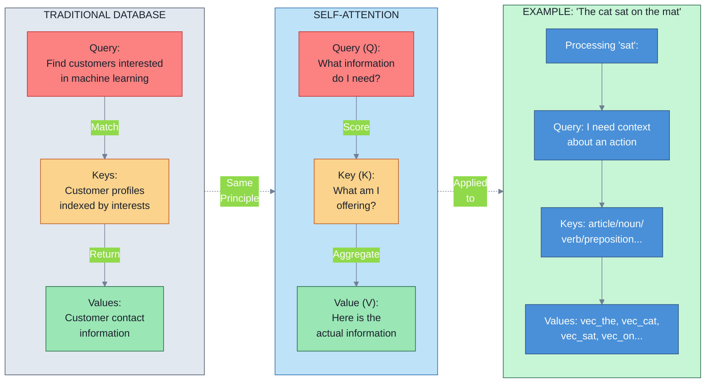
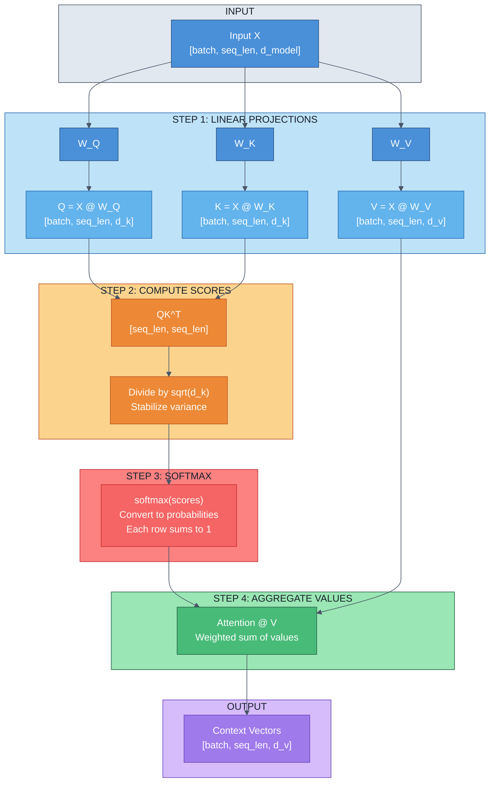
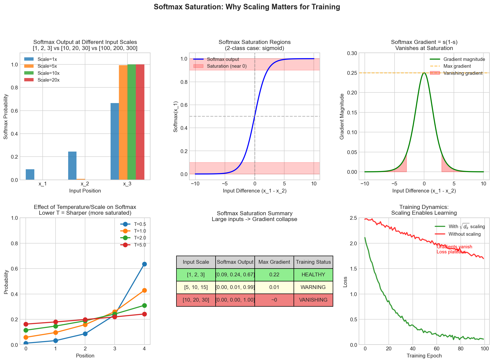
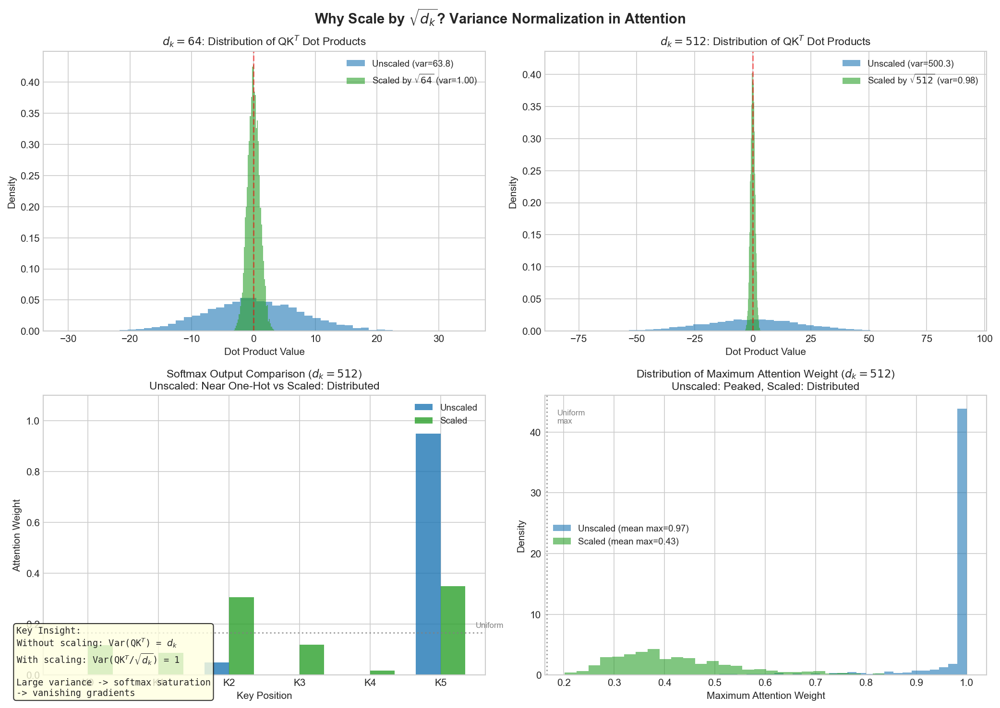
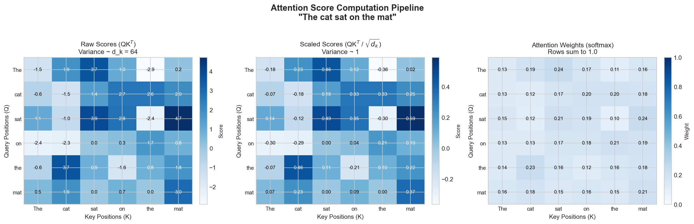

# Self-Attention Mechanics

> Self-attention enables each token to directly compare itself with all other tokens in a sequence, learning what to attend to through learned query, key, and value projections—the foundation of all transformer operations.

## One-Sentence Summary

Self-attention is a learnable information retrieval system where queries find relevant keys to extract values, using scaled dot-products to compute attention weights that determine how much each token influences every other token.

---

## Query, Key, Value: The Retrieval System Intuition

### Database Lookup Analogy

Before diving into mathematics, let's build intuition using a database metaphor:

**Traditional Database Search:**
1. You have a **query**: "Find customers interested in machine learning"
2. A database has **keys**: Customer profiles indexed by interests
3. The database returns **values**: Customer contact information

**Self-Attention Works the Same Way:**
- **Query (Q)**: "What information do I need right now?" (asked by one token)
- **Key (K)**: "What am I offering?" (declared by all tokens in the sequence)
- **Value (V)**: "Here's the actual information" (the data to aggregate)

In the sentence "The cat sat on the mat", when processing the token "sat":
- **Query**: "I need context about an action"
- **Keys**: [The, cat, sat, on, the, mat] each declare "I'm an article/noun/verb/preposition/..."
- **Values**: [vec_the, vec_cat, vec_sat, vec_on, vec_the, vec_mat] are the actual representations

The attention mechanism learns to match the query against keys, giving highest scores to relevant ones, then aggregates their values.



### Learned Projections: Why W_Q, W_K, W_V?

In self-attention, we don't use embeddings directly. Instead, we project them:

$$Q = XW_Q, \quad K = XW_K, \quad V = XW_V$$

Where:
- **X** is the input sequence [batch_size, seq_len, d_model]
- **W_Q, W_K, W_V** are learnable weight matrices [d_model, d_k] (or [d_model, d_v])
- **Q, K, V** are the projected representations

**Why three different projections?**

> **Critical Insight**: Each projection serves a different computational purpose. Keys and queries operate in the *matching space* (where dot-products make sense), while values operate in the *output space* (where we accumulate information).

- **Query projection (W_Q)**: Maps tokens to "what I'm looking for"
- **Key projection (W_K)**: Maps tokens to "what I offer to be matched against" (same dimensional space as queries)
- **Value projection (W_V)**: Maps tokens to "actual information to aggregate" (can be different dimension than Q/K)

Without separate projections, tokens would attend based on superficial similarity in the embedding space rather than task-specific relationships. The model learns W_Q and W_K such that related concepts produce high dot-products.

### Connection to Modern Retrieval Systems

Modern dense retrieval systems (semantic search, RAG) use the same principle:
- **Query encoder**: Produces a query vector from user input
- **Document encoder**: Produces key vectors and value vectors from a corpus
- **Dot-product similarity**: Finds the most relevant documents (exactly like attention scores)
- **Weighted retrieval**: Returns ranked results (exactly like attention-weighted aggregation)

Self-attention is essentially a learned retrieval system where both the retriever and the database are the same sequence.

---

## Scaled Dot-Product Attention: The Core Formula

### The Complete Formula

$$\text{Attention}(Q,K,V) = \text{softmax}\left(\frac{QK^T}{\sqrt{d_k}}\right)V$$

Let's break this into components:

| Component | Meaning | Dimensions |
|-----------|---------|------------|
| $QK^T$ | Similarity scores between queries and keys | [seq_len, seq_len] |
| $\frac{1}{\sqrt{d_k}}$ | Scaling factor | scalar |
| $\text{softmax}(\cdot)$ | Converts scores to probability distribution | [seq_len, seq_len] |
| Output: $\text{softmax}(...) \cdot V$ | Weighted aggregation of values | [seq_len, d_v] |

**Step-by-step interpretation:**

1. **Compute similarities** ($QK^T$): For each query, compute dot-product with all keys
   - High dot-product = query and key are similar
   - In sequence "cat sat mat": query for "sat" gets high dot-product with key for "cat"

2. **Scale** ($\frac{1}{\sqrt{d_k}}$): Normalize before softmax

3. **Apply softmax**: Convert to probability distribution summing to 1
   - Each attention weight is now between 0 and 1

4. **Aggregate values**: Weight each value by its attention weight
   - Result: context-aware representation mixing information from all tokens



### Why We Scale by √d_k: The Critical Section

This is the most important mathematical detail in transformers. Most practitioners use this formula without understanding why. Let's fix that.

#### The Variance Problem

When we compute $QK^T$, we're taking dot-products of vectors. If Q and K are initialized from distributions with mean 0 and variance 1:

- Each element: $Q_{ij}, K_{ij} \sim N(0, 1)$
- Dot-product: $(QK^T)_{ij} = \sum_{r=1}^{d_k} Q_{ir} \cdot K_{jr}$
- **Expected value of each dot-product**: 0 (sum of zero-mean variables)
- **Variance of each dot-product**: $d_k \cdot \text{Var}(Q_{ir}) \cdot \text{Var}(K_{jr}) = d_k$

**This is the key insight:** With d_k=512 (typical), the variance of $QK^T$ entries would be 512!

#### Why This Causes Problems

Large variances in $QK^T$ entries create extreme attention patterns:

1. **Softmax saturation**: When inputs are very large or very small:
$$\text{softmax}(x) = \frac{e^{x_i}}{\sum_j e^{x_j}}$$

For $x = [10, 20, 30]$: softmax ≈ [0.0, 0.0, 1.0] (almost one-hot)
For $x = [0.1, 0.2, 0.3]$: softmax ≈ [0.30, 0.33, 0.37] (distributed)



2. **Vanishing gradients**: The softmax gradient is:
$$\frac{\partial \text{softmax}(x_i)}{\partial x_i} = \text{softmax}(x_i)(1 - \text{softmax}(x_i))$$

When softmax is near 0 or 1, this gradient approaches 0, preventing learning!

3. **Loss of attention flexibility**: If one attention weight is 0.999 and others are near 0, the model can't easily shift attention during training.

#### The Solution: Scaling

By dividing by $\sqrt{d_k}$:

$$\text{Attention}(Q,K,V) = \text{softmax}\left(\frac{QK^T}{\sqrt{d_k}}\right)V$$

The variance of $\frac{QK^T}{\sqrt{d_k}}$ becomes:
$$\text{Var}\left(\frac{QK^T}{\sqrt{d_k}}\right) = \frac{1}{d_k} \cdot \text{Var}(QK^T) = \frac{1}{d_k} \cdot d_k = 1$$

Now the attention scores have unit variance, softmax produces distributed probabilities, and gradients flow properly!



#### Numerical Comparison

```
Example: d_k = 64, attention scores before softmax

WITHOUT scaling (variance = 64):
    Scores: [45.2, 48.1, 51.9, 44.3]
    Softmax: [0.0001, 0.0003, 0.9995, 0.0001]  <- Nearly one-hot, dead gradients

WITH scaling by √64 = 8 (variance = 1):
    Scores: [5.65, 6.01, 6.49, 5.54]
    Softmax: [0.15, 0.19, 0.42, 0.24]  <- Distributed, healthy gradients
```

> **Key Takeaway**: The scaling factor $\sqrt{d_k}$ controls attention sharpness. Without it, attention becomes too peaked (one token dominates). With it, attention stays distributed for better learning dynamics.

---

## Step-by-Step Computation Example

Let's walk through a concrete example with actual numbers. Consider a 4-token sequence with d_model=8, d_k=4, d_v=4.

### Setup

Input embeddings (simplified):
```
Tokens: ["I", "love", "machine", "learning"]
X shape: [batch=1, seq_len=4, d_model=8]

X = [
  [0.1, 0.2, ..., 0.8],  # "I"
  [0.3, 0.1, ..., 0.2],  # "love"
  [0.2, 0.4, ..., 0.5],  # "machine"
  [0.9, 0.1, ..., 0.3]   # "learning"
]
```

Weight matrices (4x4):
```
W_Q, W_K, W_V: [d_model=8, d_k=4] (simplified random init)
```

### Step 1: Project to Q, K, V

```
Q = X @ W_Q           # [1, 4, 4]
K = X @ W_K           # [1, 4, 4]
V = X @ W_V           # [1, 4, 4]

Example Q (after projection):
Q = [
  [0.5, -0.2, 0.3, 0.1],   # Query for "I"
  [0.2,  0.4, 0.1, -0.1],  # Query for "love"
  [0.1,  0.3, 0.5, 0.2],   # Query for "machine"
  [0.6,  0.1, 0.0, 0.4]    # Query for "learning"
]

K and V similarly shaped
```

### Step 2: Compute Similarity Scores

```
QK^T = Q @ K.T        # [1, 4, 4] @ [1, 4, 4] -> [1, 4, 4]

Attention scores (before scaling):
[
  [1.2,  0.8, 0.5, 0.9],   # "I" comparing to all tokens
  [0.6,  1.5, 0.3, 0.7],   # "love" comparing to all tokens
  [0.4,  0.7, 1.8, 0.6],   # "machine" comparing to all tokens
  [1.1,  0.9, 0.4, 1.6]    # "learning" comparing to all tokens
]
```



### Step 3: Scale by √d_k

```
√d_k = √4 = 2

Scores_scaled = QK^T / 2
[
  [0.6,  0.4,  0.25, 0.45],
  [0.3,  0.75, 0.15, 0.35],
  [0.2,  0.35, 0.9,  0.3],
  [0.55, 0.45, 0.2,  0.8]
]
```

### Step 4: Apply Softmax

For row 0 ("I" token):
```
exp([0.6, 0.4, 0.25, 0.45]) = [1.822, 1.492, 1.284, 1.568]
sum = 6.166

softmax = [0.296, 0.242, 0.208, 0.254]
```

All rows after softmax:
```
Attention weights:
[
  [0.296, 0.242, 0.208, 0.254],    # "I" attention distribution
  [0.245, 0.398, 0.152, 0.205],    # "love" attention distribution
  [0.168, 0.216, 0.491, 0.125],    # "machine" attention distribution
  [0.301, 0.273, 0.131, 0.295]     # "learning" attention distribution
]

Note: Each row sums to 1.0
```

### Step 5: Aggregate Values

```
Output = Attention_weights @ V   # [1, 4, 4] @ [1, 4, 4] -> [1, 4, 4]

For "I" token (first row):
Output[0] = 0.296*V[0] + 0.242*V[1] + 0.208*V[2] + 0.254*V[3]
          = weighted combination of all value vectors
          = [context-aware representation for "I"]

Final Output shape: [1, 4, 4]
```

### Summary Table

| Step | Operation | Input Shape | Output Shape | Key Insight |
|------|-----------|------------|------------|------------|
| 1 | X → Q,K,V | [1,4,8] | [1,4,4] | Learn task-specific projections |
| 2 | Q @ K^T | [1,4,4] | [1,4,4] | Compute pairwise similarities |
| 3 | Divide by √4 | [1,4,4] | [1,4,4] | Stabilize attention sharpness |
| 4 | Softmax | [1,4,4] | [1,4,4] | Normalize to probabilities |
| 5 | @ V | [1,4,4] | [1,4,4] | Aggregate information |

---

## Computational Complexity Analysis

### Time Complexity

The most computationally expensive operation is computing $QK^T$:

$$\text{Time: } O(n^2 \cdot d_k)$$

Where:
- **n** = sequence length
- **d_k** = dimension of keys
- **Why n²?** Every token compares to every other token: n × n comparisons
- **Why d_k?** Each comparison is a dot-product of d_k-dimensional vectors

**Practical implications:**
- Doubling sequence length → 4x computation (quadratic scaling)
- Doubling d_k → 2x computation (linear scaling)
- Typical BERT (seq_len=512, d_k=64): 512² × 64 ≈ 16M operations per forward pass
- Long document (seq_len=4096, d_k=64): 4096² × 64 ≈ 1B operations (prohibitive)

### Space Complexity

The attention scores matrix $QK^T$ must be stored:

$$\text{Space: } O(n^2 \cdot \text{precision})$$

- With float32: 512² tokens = 262K weights = 1MB (manageable)
- With 4096² tokens = 16.7M weights = 67MB per layer (for multi-head: 500MB+)

**This is why long-context transformers are memory-limited.**

### Why This Matters for Production

| Scenario | seq_len | Operations | Latency | Memory |
|----------|---------|------------|---------|--------|
| Web search query | 128 | 1M | <1ms | 64KB |
| Document analysis | 512 | 17M | 5-10ms | 1MB |
| Long document | 2048 | 270M | 50-100ms | 16MB |
| Very long document | 4096 | 1B | 200-400ms | 67MB |

**For production ML systems:**
- This quadratic complexity is the primary bottleneck in scaling transformers
- Solutions: sparse attention, local attention, linear attention (beyond Module 2)
- Practitioners often use seq_len=512 even for longer documents due to compute constraints

---

## Multi-Head Attention (Building on Single-Head)

The formula we've discussed is **single-head attention**. In practice, transformers use **multi-head attention**, which runs the attention operation h times in parallel with different learned projections:

$$\text{MultiHead}(Q,K,V) = \text{Concat}(\text{head}_1, ..., \text{head}_h)W^O$$

Where each head:
$$\text{head}_i = \text{Attention}(QW^Q_i, KW^K_i, VW^V_i)$$

**Intuition:** Different heads learn different types of relationships:
- Head 1: Focus on adjacent tokens (local context)
- Head 2: Focus on subject-verb relationships (syntactic)
- Head 3: Focus on semantic similarity across the sequence

This diversity is crucial for the model's expressiveness and is why transformers use multiple heads instead of one large head.

---

## Interview Questions

### Question 1: Why Scale by √d_k?

**Expected Answer Structure:**

"When computing dot-products of random vectors with variance 1, the result has variance equal to the vector dimension d_k. With d_k=512, this creates:

1. **Extreme attention distributions**: The softmax becomes nearly one-hot, with some weights near 1.0 and others near 0.0
2. **Vanishing gradients**: The softmax gradient is σ(1-σ), which approaches 0 when σ is near 0 or 1
3. **Poor training dynamics**: The model can't easily redistribute attention weights during backpropagation

Dividing by √d_k normalizes the variance back to 1, keeping attention scores moderate. This ensures softmax produces distributed probabilities with healthy gradients for learning. Mathematically:

Var(QK^T/√d_k) = (1/d_k) × Var(QK^T) = (1/d_k) × d_k = 1

The scaling factor literally prevents gradient collapse."

**Follow-up:** What if you used d_k instead of √d_k?
- Answer: Variance would be 1/512 ≈ 0.002, creating too-uniform attention (all weights ≈ 0.25), losing the model's ability to focus selectively.

---

### Question 2: What Happens Without Scaling?

**Expected Answer Structure:**

"Without scaling, three problems occur:

1. **During initialization:**
   - Attention scores have variance d_k (e.g., 64)
   - Softmax produces near-one-hot distributions
   - All tokens except one contribute negligible information

2. **During training:**
   - Vanishing gradients: ∂softmax(x)/∂x = σ(x)(1-σ(x)) ≈ 0 when σ(x) ≈ 1
   - Difficult to learn: Model can't shift attention weights through backprop
   - Training becomes unstable with plateaued loss

3. **Practical example:**
   - With scaling: softmax([0.6, 0.4, 0.25, 0.45]) = [0.30, 0.24, 0.21, 0.25]
   - Without scaling: softmax([1.2, 0.8, 0.5, 0.9]) ≈ [0.34, 0.23, 0.17, 0.26]
   - Even worse with d_k=512: softmax([600, 400, 250, 450]) ≈ [1.0, 0.0, 0.0, 0.0]

The scaling factor is empirically essential for transformer training to converge."

---

### Question 3: Complexity Analysis Question

**Expected Answer Structure:**

"Self-attention has O(n² d_k) time complexity:

- **n² factor**: Each token attends to all other tokens. Attention matrix is [seq_len × seq_len].
- **d_k factor**: Computing QK^T involves d_k-dimensional dot-products.
- **Comparison to RNNs**: RNNs process sequentially (O(n d²)), making them O(n) in length but harder to parallelize.

**Practical implications:**
- BERT uses seq_len=512: 512² × 64 = 16.7M FLOPs per head per forward pass
- For long documents (4096 tokens): 1.07B FLOPs (orders of magnitude slower)

**Production concern:**
- Attention is the computational bottleneck in transformers
- Long sequences hit memory limits (O(n²) space for attention scores) before compute limits
- This is why modern research focuses on linear attention, sparse attention, or token pruning for long-context tasks.

**Trade-off question:** Could we use O(n) attention?
- Yes, through approximations (local attention: only attend to nearby tokens, linear attention: avoid softmax)
- Trade-off: Reduced ability to capture long-range dependencies
- Research area: many papers trying to maintain expressiveness with better complexity"

---

### Question 4: How Would You Optimize Attention for Long Sequences?

**Expected Answer Structure:**

"Multiple approaches exist, ranked by effectiveness vs. complexity:

1. **Local Attention**: Each token attends only to a window around it (e.g., ±128 tokens)
   - Complexity: O(n × window_size) instead of O(n²)
   - Trade-off: Loses long-range dependencies
   - Best for: Sequence labeling, local pattern detection

2. **Sparse Attention Patterns**: Use structured patterns instead of dense attention
   - Strided attention: Attend to positions [i, i+stride, i+2stride, ...]
   - Block-sparse: Attend to specific blocks of the sequence
   - Complexity: O(n × √n) or better depending on pattern
   - Examples: BigBird, Longformer

3. **Hierarchical/Multi-scale Attention**: Process in stages
   - First compress sequence (downsample)
   - Apply attention to compressed sequence
   - Expand results back
   - Trade-off: Information loss during compression

4. **Linear Attention Approximations**: Replace softmax with simpler function
   - Kernel methods to compute attention in O(n d²) time
   - Complexity: Same as RNNs but parallel
   - Trade-off: Approximation error (doesn't attend to relevant tokens perfectly)

5. **Token Pruning**: Remove unimportant tokens before attention
   - Identify and remove tokens that won't significantly affect output
   - Complexity: O(n² ) for remaining tokens
   - Trade-off: Need good heuristic for token importance

**For interview:** "I'd start with sparse attention (structured, proven), then consider linear approximations or token pruning for extreme length. The right choice depends on the task: local patterns favor local attention, while document retrieval might benefit from hierarchical approaches."

---

## Quick Reference Card

### The Core Formula
$$\text{Attention}(Q,K,V) = \text{softmax}\left(\frac{QK^T}{\sqrt{d_k}}\right)V$$

### Dimensions
- Input: [batch, seq_len, d_model]
- Q, K: [batch, seq_len, d_k]
- V: [batch, seq_len, d_v]
- Output: [batch, seq_len, d_v]
- Attention weights: [batch, seq_len, seq_len]

### Key Hyperparameters
| Parameter | Role | Typical Value |
|-----------|------|---------------|
| d_k | Dimension of queries/keys | d_model / num_heads |
| d_v | Dimension of values | d_model / num_heads |
| num_heads | Number of parallel heads | 8-16 |
| seq_len | Maximum sequence length | 512-2048 |

### The Intuition Chain
1. **Project** input to Q, K, V (learn task-specific representations)
2. **Compute** QK^T (find which tokens are relevant to each other)
3. **Scale** by 1/√d_k (keep variances reasonable)
4. **Softmax** (convert to probability distribution)
5. **Aggregate** values (weighted sum based on attention)

### Complexity Summary
- **Time**: O(n² d_k) - quadratic in sequence length
- **Space**: O(n²) for attention score matrix
- **Bottleneck**: Cannot exceed ~4096 tokens on typical GPUs without optimization
- **Fix**: Sparse attention, local attention, or linear approximations

### Critical Intuitions
- **Without scaling**: Attention becomes too sharp (one-hot), gradients vanish
- **Q vs K**: Operate in matching space (same dimension)
- **V**: Operates in output space (can differ)
- **Parallel heads**: Different heads learn different relationship types

### Common Mistakes
1. ❌ Forgetting the scaling factor (training fails)
2. ❌ Using same dimension for Q and V (wasteful)
3. ❌ Underestimating complexity (4096² is not feasible on single GPU)
4. ❌ Treating all attention weights equally (actually highly peaked)

### What Enables Modules 3-6
- **Module 3 (Multi-Head Attention)**: How parallel heads learn different relationship types
- **Module 4 (Positional Encoding)**: Addresses "how does attention know sequence order?"
- **Module 5 (Encoder Architecture)**: Why self-attention needs companion layers (incl. feed-forward networks)
- **Module 6 (Decoder Architecture)**: Causal masking, cross-attention across two sequences, and autoregressive generation

---

## Summary

Self-attention is the heart of transformers. The elegant scaled dot-product formula encodes a deceptively simple idea: learn to match what you're looking for (queries) against what's available (keys), then aggregate the relevant information (values). The scaling factor, easily overlooked, is crucial for training stability and deserves deep understanding.

The O(n²) complexity is both the strength (captures all relationships) and weakness (limits sequence length). Understanding this trade-off is essential for productionizing transformers.

**Next steps:**
- Implement this in code (if you haven't already)
- Trace through a real example with d_model=768 and seq_len=512
- Experiment: Remove scaling and observe training instability
- Read the original "Attention is All You Need" paper, Section 3.2.2

This foundation is your key to understanding advanced transformers. Each module builds directly on these concepts.
