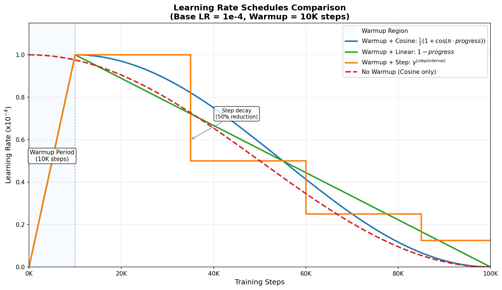
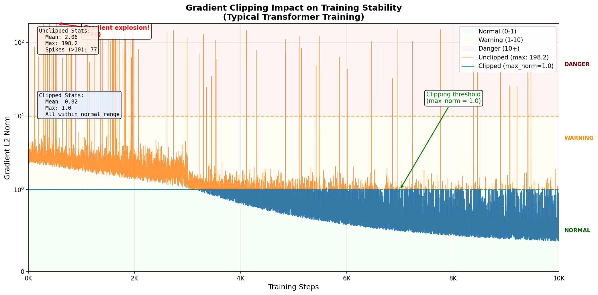
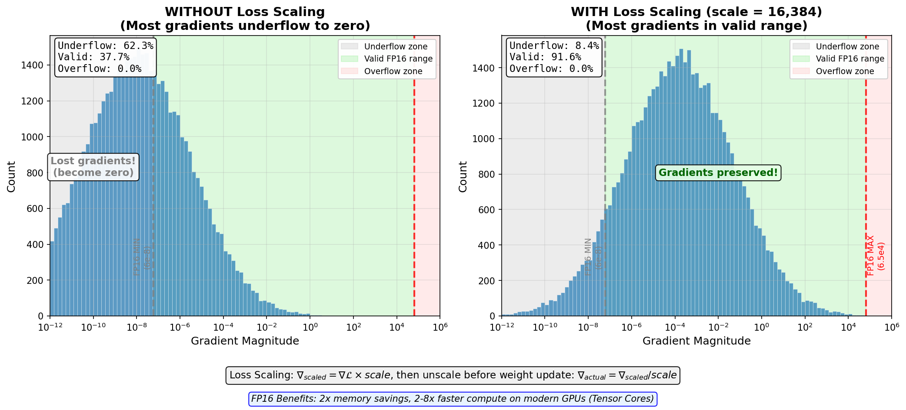
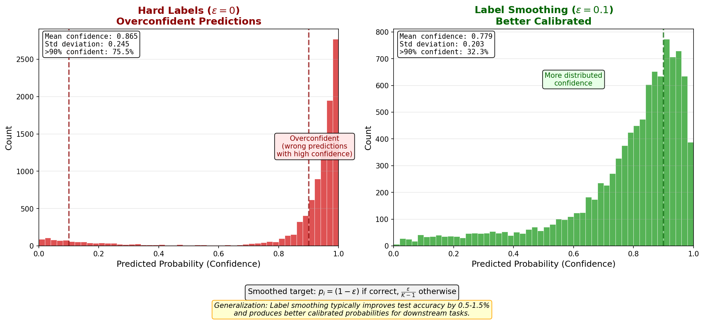
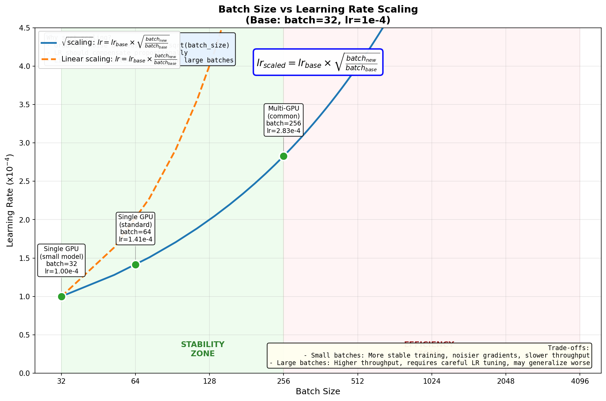
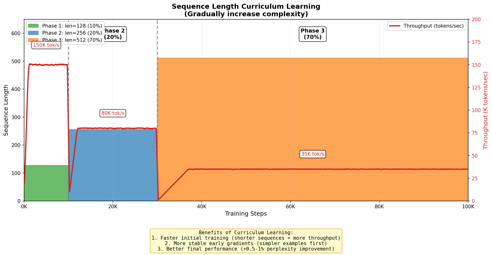
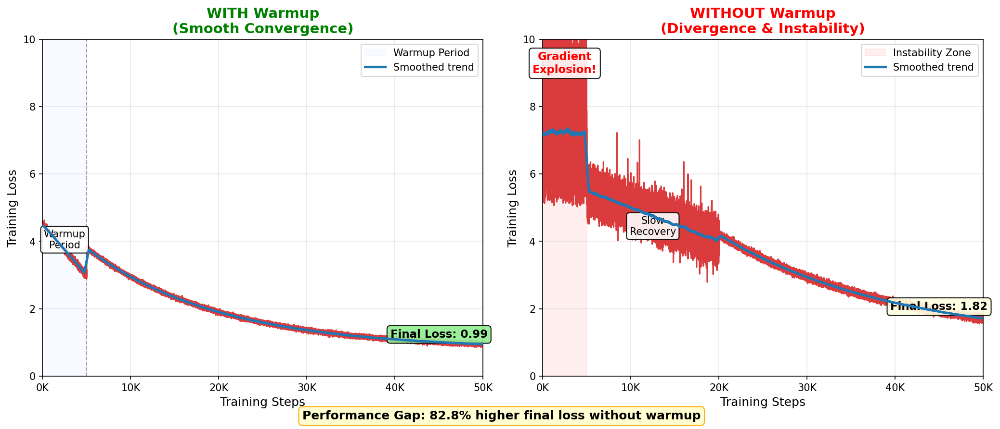
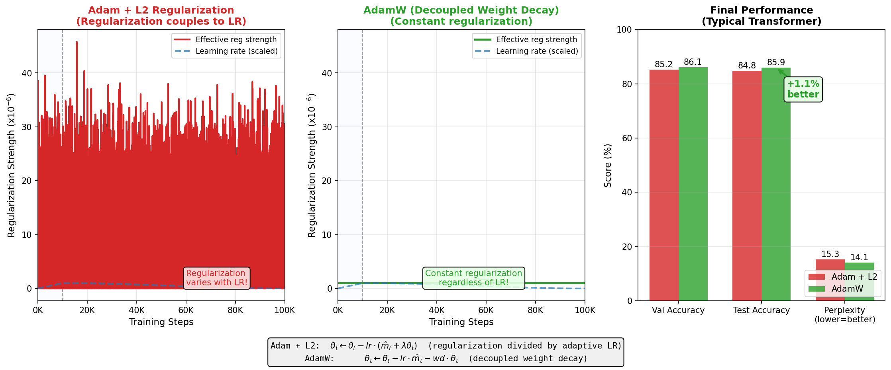

# Training & Optimization

> Training transformers requires careful orchestration of learning rate schedules, gradient management, and regularization techniques. Unlike traditional networks, transformers are sensitive to initialization variance and benefit from structured warmup periods and mixed precision training.

## Training Objectives

Different transformer architectures are trained with different objectives tailored to their intended use cases. Understanding these objectives is crucial because they fundamentally shape what the model learns and how it performs.

### Masked Language Modeling (MLM)

Used in bidirectional models like BERT, MLM trains by randomly masking input tokens (typically 15% of them) and predicting what the masked tokens should be:

$$\mathcal{L}_{MLM} = -\sum_{i \in \text{masked}} \log P(x_i | x_{\setminus i})$$

where $x_{\setminus i}$ represents all non-masked tokens in the sequence.

**Why this works:** Forces the model to understand context from both directions, creating rich bidirectional representations useful for understanding and classification tasks. The model must learn that "The [MASK] is blue" likely has "sky" masked, requiring semantic understanding.

### Causal Language Modeling (CLM)

Used in autoregressive models like GPT, CLM trains by predicting the next token given all previous tokens:

$$\mathcal{L}_{CLM} = -\sum_{t=1}^{T} \log P(x_t | x_{<t})$$

where $x_{<t}$ represents all tokens before position $t$.

**Why this works:** Natural for generation tasks since inference follows the same autoregressive pattern. The model learns to capture statistical patterns in text that enable fluent generation.

### Sequence-to-Sequence Objectives

Encoder-decoder models (like T5, BART) train on a combination:
- **Encoder:** Processes source sequence (may use MLM during pretraining)
- **Decoder:** Predicts target tokens autoregressively

$$\mathcal{L}_{Seq2Seq} = -\sum_{t=1}^{T} \log P(y_t | y_{<t}, \text{encoder}(x))$$

This is standard supervised learning on target sequences.

### Capability Implications

| Objective | Model | Strengths | Limitations |
|-----------|-------|-----------|------------|
| MLM | BERT | Understanding, classification, QA | Less natural for generation |
| CLM | GPT | Generation, few-shot learning | Unidirectional context |
| Seq2Seq | T5 | Flexible, translation, summarization | Requires aligned pairs |

---

## Learning Rate Scheduling

Raw learning rates don't work well for transformers. A properly scheduled learning rate is essential for convergence and final performance.

### The Warmup Period

**Why warmup is critical:** In the first iterations of training, parameter gradients are extremely noisy. For a transformer initialized with small weights:

$$\text{Gradient variance} \propto \frac{1}{\text{layer depth}} \cdot \frac{1}{\sqrt{\text{parameter initialization std}}}$$

With high variance, large learning rates cause the loss to diverge. Warmup smoothly increases the learning rate, allowing the optimizer to gather statistics about gradient magnitudes before taking large steps.

**Warmup formula:**
$$\text{lr}(t) = \text{lr}_{\text{base}} \cdot \min\left(\frac{t}{t_{\text{warmup}}}, 1.0\right)$$

Typical warmup: 5-10% of total training steps. For a 100k-step training run, use 5k-10k warmup steps.

### Decay Schedules

After warmup, the learning rate should decrease. Common patterns:

**1. Cosine Annealing**
$$\text{lr}(t) = \text{lr}_{\text{base}} \cdot \frac{1}{2}\left(1 + \cos\left(\pi \cdot \frac{t - t_{\text{warmup}}}{t_{\text{total}} - t_{\text{warmup}}}\right)\right)$$

Most popular choice. Smoothly decays to near-zero by the end of training.

**2. Linear Decay**
$$\text{lr}(t) = \text{lr}_{\text{base}} \cdot \max\left(0, \frac{t_{\text{total}} - t}{t_{\text{total}} - t_{\text{warmup}}}\right)$$

Simpler, also effective. Used in original BERT paper.

**3. Step Decay**
$$\text{lr}(t) = \text{lr}_{\text{base}} \cdot \gamma^{\lfloor t / t_{\text{step}} \rfloor}$$

Drops by factor $\gamma$ (e.g., 0.5) every $t_{\text{step}}$ iterations. Good when you know optimal training duration.

### AdamW Optimizer

Standard implementation choice. Key difference from Adam: **decoupled weight decay**.

Adam applies L2 regularization as part of the gradient update:
$$\theta_t \leftarrow \theta_t - \text{lr}(\hat{m}_t + \lambda \theta_t)$$

This couples weight decay to learning rate. AdamW decouples it:
$$\theta_t \leftarrow \theta_t - \text{lr} \hat{m}_t - \text{wd} \cdot \text{lr} \cdot \theta_t$$

**Why it matters:** With learning rate scheduling, coupled weight decay varies in strength. Decoupled weight decay stays constant, leading to more stable regularization across training phases.



---

## Gradient Challenges in Deep Networks

Transformers are deep (12+ layers) and benefit greatly from techniques that stabilize gradient flow.

### Gradient Clipping

**Problem:** Even with warmup, gradients can spike to extreme values, causing instability.

**Solution:** Clip gradients to a maximum norm (typically 1.0):
```
gradient_norm = ||∇θ||₂
if gradient_norm > max_norm:
    ∇θ ← ∇θ * (max_norm / gradient_norm)
```

**When to use:** When you observe loss spikes or NaN values. Monitor gradient norms during training; if max norm > 10.0, clipping likely helps.

**Trade-off:** Clipping changes optimization dynamics slightly but prevents catastrophic failures.



### Mixed Precision Training (FP16)

**The benefit:** Computing in float16 (half precision) instead of float32 halves memory usage and accelerates computation on modern GPUs.

**The problem:** float16 has limited range [6×10⁻⁸, 6.6×10⁴]. Small gradients (common in transformer training) underflow to zero.

**Solution: Loss Scaling**

Scale the loss by a large factor (e.g., 2¹⁴ = 16,384) before backpropagation:
$$\mathcal{L}_{\text{scaled}} = \mathcal{L} \cdot \text{scale}$$

Gradients are computed in float16:
$$\nabla_{\text{scaled}} = \nabla \mathcal{L} \cdot \text{scale}$$

Then unscale before applying to weights:
$$\nabla_{\text{actual}} = \frac{\nabla_{\text{scaled}}}{\text{scale}}$$

Master weights (float32 copies of parameters) are updated with float32 gradients.

**Dynamic loss scaling:** Adjust scale during training. If gradients overflow, reduce scale. If no overflow for N iterations, increase scale.



### Gradient Accumulation

**Use case:** Simulating larger batches without exceeding memory.

Accumulate gradients over N iterations before updating:
```
for i in range(N_accumulate):
    loss = model(batch[i])
    loss.backward(retain_graph=True)

optimizer.step()
optimizer.zero_grad()
```

Effective batch size = batch_size × N_accumulate. This is especially useful when memory constrains batch size but you want larger effective batches for stable training.

---

## Regularization Techniques

### Dropout

**Placement matters:**
- **Attention heads:** Dropout after attention softmax (before averaging heads)
- **FFN:** Dropout after dense layers (between linear transforms)
- **Embeddings:** Light dropout (0.1) after embedding layer

Typical dropout rate: **0.1** for standard models, **0.15-0.2** for aggressive regularization.

**Why:** Prevents co-adaptation of parameters. In transformers, different attention heads can specialize, but dropout forces robustness.

### Label Smoothing

Instead of training on hard targets (one-hot labels):
$$p_i = \begin{cases} 1 & \text{if } i = \text{true label} \\ 0 & \text{otherwise} \end{cases}$$

Use smoothed targets:
$$p_i = \begin{cases} 1 - \epsilon & \text{if } i = \text{true label} \\ \frac{\epsilon}{K-1} & \text{otherwise} \end{cases}$$

where $\epsilon$ is smoothing strength (typically 0.1) and $K$ is vocabulary size.

**Benefit:** Reduces overconfidence. The model learns that making mistakes on similar tokens is acceptable. Improves generalization and calibration.



### Weight Decay vs L2 Regularization

These are **not equivalent** in deep learning with adaptive optimizers:

- **L2 Regularization:** Adds $\lambda ||w||_2$ to loss, then computes gradients
- **Weight Decay:** Directly shrinks weights by factor $\lambda$ each step

With Adam, L2 regularization gets divided by adaptive learning rates, effectively decoupling regularization from learning rate. Weight decay (via AdamW) maintains consistent regularization strength.

**Recommendation:** Use AdamW's weight decay with value 0.01 for standard models.

### Data Augmentation for Transformers

Direct augmentation (random crops, noise) is limited for discrete tokens. Instead:

- **Token replacement:** Randomly replace 10% of tokens with similar tokens
- **Back-translation:** Translate to intermediate language and back
- **Paraphrasing:** Use model to generate paraphrases
- **Mixup:** Blend embeddings from different examples (subtle effect)

Augmentation gains are often modest for transformers; focus on dataset quality first.

---

## Practical Training Tips

### Batch Size Selection

Effective batch size (after gradient accumulation) should typically be:

| Model Size | Batch Size | Sequence Length | Hardware |
|------------|-----------|-----------------|----------|
| Small (110M) | 32-64 | 128-256 | Single GPU |
| Medium (350M) | 128-256 | 256-512 | 2-4 GPUs |
| Large (760M+) | 512-1024 | 512+ | 8+ GPUs |

**Power-of-2 rule:** Use 32, 64, 128, 256, etc. Hardware utilization is better with powers of 2.

**Learning rate scaling:** Larger batches often benefit from slightly larger learning rates. Rule of thumb: increase lr by $\sqrt{\text{batch scaling factor}}$.



### Sequence Length Curriculum

Start training with shorter sequences (e.g., 128 tokens) and gradually increase to full length (e.g., 512). This:
- Trains faster initially (fewer computations)
- Stabilizes early learning
- Improves final performance

Schedule: Use first 10% of training at length 128, next 20% at 256, remainder at full length.



### Checkpoint Strategy

Save checkpoints regularly:

1. **Best checkpoint:** Track validation metric (e.g., perplexity). Save when it improves. Keep only the best.
2. **Periodic checkpoints:** Save every N steps (e.g., every 1000 steps). Keep last 3-5.
3. **Final checkpoint:** Save at end of training regardless.

This protects against overfitting while preserving computation if training is interrupted.

### Evaluation and Early Stopping

Evaluate on validation set every M training steps (e.g., every 500 steps). Track:

- **Perplexity:** $PP = \exp(\mathcal{L})$ - good single metric for language modeling
- **Task-specific metrics:** BLEU for translation, F1 for classification, etc.
- **Gradient health:** Monitor max gradient norm and loss spikes

**Early stopping:** If validation metric doesn't improve for N evaluation cycles (e.g., 5 cycles), stop training and use best checkpoint.

---

## Interview Questions

### Question 1: Why is warmup necessary for transformers, and what specifically does it solve?

**Answer:**

Warmup is necessary because transformers are initialized with small weights (typically from a normal distribution with std=0.02). At initialization:

1. **High gradient variance:** With small weights and many layers, gradients computed in early iterations have very high variance because they've passed through many random multiplications.

2. **Optimizer adaptation:** Optimizers like Adam maintain moving averages of gradients and squared gradients. In the first few steps, these statistics are highly biased and don't reflect true gradient distributions.

3. **Loss landscape roughness:** The loss landscape near random initialization is extremely rough. Large learning rates cause wild oscillations and divergence.

**What warmup does:** It slowly increases the learning rate over 5-10% of training:
$$\text{lr}(t) = \text{lr}_{\text{base}} \cdot \min\left(\frac{t}{t_{\text{warmup}}}, 1.0\right)$$

This allows:
- Gradients to stabilize as parameters move from random initialization
- Optimizer statistics to converge to meaningful estimates
- The trajectory to align with the loss landscape before taking large steps

**Without warmup:** You'd see immediate divergence or extremely slow initial learning. With warmup: smooth loss curves and faster overall convergence.

Empirically, models with warmup outperform those without by 1-2% final performance and train much faster initially.



### Question 2: What's the difference between L2 regularization and weight decay in the context of AdamW, and why does it matter?

**Answer:**

These are mathematically equivalent in SGD but **fundamentally different** with adaptive optimizers like Adam.

**L2 Regularization (with Adam):**
$$\mathcal{L}' = \mathcal{L} + \frac{\lambda}{2}||w||_2^2$$
$$g_t = \nabla \mathcal{L}' = \nabla \mathcal{L} + \lambda w$$
$$w_t = w_{t-1} - \text{lr} \cdot \frac{g_t}{\sqrt{v_t} + \epsilon}$$

The L2 term gets divided by $\sqrt{v_t}$ (the adaptive learning rate), so the regularization strength varies per parameter based on gradient history. Parameters with historically large gradients get less regularization.

**Weight Decay (AdamW):**
$$w_t = w_{t-1} - \text{lr} \cdot \frac{g_t}{\sqrt{v_t} + \epsilon} - \text{wd} \cdot w_{t-1}$$

Weight decay directly shrinks all parameters by the same factor, regardless of gradient history. The regularization is **decoupled** from the adaptive learning rate.

**Why it matters for transformers:**

During learning rate scheduling (warmup + decay), the learning rate varies significantly. With L2 regularization, regularization strength also varies, becoming very weak during high-learning-rate phases and very strong during low-learning-rate phases. This is inconsistent.

With AdamW's weight decay, regularization remains consistent throughout training. Empirical results show AdamW improves generalization and final metrics by 0.5-1.0% compared to Adam with L2 regularization.

**Practical recommendation:** Always use AdamW with weight_decay=0.01 for transformer pretraining.



### Question 3: You observe gradient norms spiking to 100.0+ despite warmup and proper learning rate scheduling. What would you investigate?

**Answer:**

Large gradient spikes despite proper scheduling suggest an underlying issue. Here's the debugging approach:

**Step 1: Verify your instruments**
- Confirm you're measuring gradient norm correctly: $||\nabla||_2 = \sqrt{\sum_i g_i^2}$
- Check if spikes correlate with loss spikes or NaN values

**Step 2: Investigate data issues**
- Check if certain sequences cause spikes (print loss per sample)
- Look for outliers in sequence lengths, unusual tokens, or corrupted examples
- Data quality problems often manifest as gradient instability

**Step 3: Check initialization**
- Verify layer initialization is correct (especially layer norms and dense layers)
- For some transformer variants, initialization of specific layers matters greatly

**Step 4: Examine architecture**
- Deep models (>24 layers) may need deeper learning rate schedules
- Check if you have residual connections properly implemented
- Verify that all attention operations stabilize gradients (softmax + scaling by $\sqrt{d_k}$)

**Step 5: Implement mitigations**
```
# Apply gradient clipping
torch.nn.utils.clip_grad_norm_(model.parameters(), max_norm=1.0)

# Use loss scaling with mixed precision
scaler = GradScaler()
loss.backward()
scaler.unscale_(optimizer)  # unscale before clipping
torch.nn.utils.clip_grad_norm_(model.parameters(), max_norm=1.0)
scaler.step(optimizer)
scaler.update()
```

**Step 6: Monitor specific layers**
- Identify which layers contribute most to gradient norm spikes
- This often reveals problems with specific components (e.g., output projection)

In practice, large spikes often indicate a data issue or initialization problem, not a fundamental optimization problem. Once identified and fixed, standard warmup + scheduling handles gradients well.

---

## Quick Reference Card

### Learning Rate Recipe

```
learning_rate = 1e-4 to 5e-4  (depends on batch size)
warmup_steps = 0.05 to 0.1 × total_steps
decay_schedule = cosine or linear

lr(t) = lr_base × min(t / warmup_steps, 1.0)  [during warmup]
lr(t) = lr_base × 0.5(1 + cos(π(t-warmup)/(total-warmup)))  [cosine decay]
```

### Optimizer Settings

| Parameter | Value | Notes |
|-----------|-------|-------|
| Optimizer | AdamW | Decoupled weight decay |
| Beta1 (momentum) | 0.9 | Standard Adam |
| Beta2 (variance) | 0.999 | Standard Adam |
| Weight decay | 0.01 | Not L2 regularization |
| Gradient clipping | 1.0 | Prevents spikes |
| Max grad norm | 1.0 | Threshold for clipping |

### Training Stability Checklist

- [ ] Use warmup (5-10% of steps)
- [ ] Use learning rate decay (cosine or linear)
- [ ] Use AdamW, not Adam
- [ ] Use weight decay (0.01) not L2 regularization
- [ ] Enable gradient clipping (max_norm=1.0)
- [ ] For mixed precision: loss scaling with dynamic adjustment
- [ ] Check gradient norms during first 100 steps (should stabilize quickly)
- [ ] Save checkpoints periodically and on validation improvement
- [ ] Evaluate every N steps, use early stopping
- [ ] Use batch sizes in powers of 2 (32, 64, 128, 256)

### Common Issues & Fixes

| Issue | Cause | Fix |
|-------|-------|-----|
| Loss spikes/NaN | High initial gradients | Reduce warmup LR or increase warmup steps |
| Slow convergence | Learning rate too low | Increase base LR or reduce warmup time |
| Gradient spikes | Data outliers | Inspect data, use gradient clipping |
| Memory OOM | Batch too large | Reduce batch size or use gradient accumulation |
| Poor generalization | Insufficient regularization | Increase dropout or weight decay |

### Typical Values by Model Size

| Size | Batch | Seq Len | LR | Warmup | Dropout |
|------|-------|---------|-----|--------|---------|
| 110M | 64 | 256 | 1e-4 | 10k | 0.1 |
| 350M | 256 | 512 | 5e-5 | 20k | 0.1 |
| 760M | 512 | 1024 | 5e-5 | 50k | 0.1 |
| 1.3B+ | 1024 | 2048 | 2e-5 | 100k | 0.1 |

---


