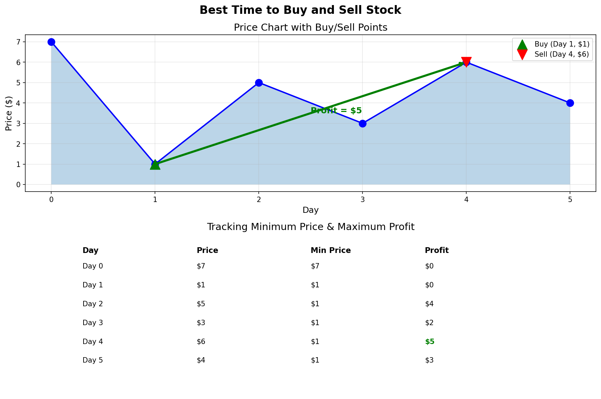

# Best Time to Buy and Sell Stock

## Problem Statement

You are given an array `prices` where `prices[i]` is the price of a given stock on the `i`th day.

You want to maximize your profit by choosing a **single day** to buy one stock and choosing a **different day in the future** to sell that stock.

Return the **maximum profit** you can achieve from this transaction. If you cannot achieve any profit, return `0`.

## Examples

### Example 1
```
Input: prices = [7, 1, 5, 3, 6, 4]
Output: 5
Explanation: Buy on day 2 (price = 1) and sell on day 5 (price = 6).
Profit = 6 - 1 = 5.
Note: Buying on day 2 and selling on day 1 is not allowed
because you must buy before you sell.
```

### Example 2
```
Input: prices = [7, 6, 4, 3, 1]
Output: 0
Explanation: No transaction is done because prices only decrease.
Maximum profit is 0.
```

### Example 3
```
Input: prices = [2, 4, 1]
Output: 2
Explanation: Buy on day 1 (price = 2) and sell on day 2 (price = 4).
Profit = 4 - 2 = 2.
```

## Visual Explanation



## Approach: One Pass with Minimum Tracking

Key insight: For each day, we want to know the minimum price before it. Then the maximum profit selling on that day is `current_price - min_price_before`.

### Algorithm
1. Initialize `min_price = infinity`, `max_profit = 0`
2. For each price in the array:
   - Update `min_price` if current price is lower
   - Calculate potential profit: `current_price - min_price`
   - Update `max_profit` if this profit is higher
3. Return `max_profit`

## Solution

```python
def maxProfit(prices: list[int]) -> int:
    """
    Find maximum profit from a single buy-sell transaction.

    Time Complexity: O(n)
    Space Complexity: O(1)
    """
    if not prices:
        return 0

    min_price = float('inf')
    max_profit = 0

    for price in prices:
        # Update minimum price seen so far
        min_price = min(min_price, price)
        # Calculate profit if we sell today
        profit = price - min_price
        # Update maximum profit
        max_profit = max(max_profit, profit)

    return max_profit


# Alternative: Using Kadane's Algorithm perspective
def maxProfit_kadane(prices: list[int]) -> int:
    """
    Kadane's algorithm variant: treat as maximum subarray of daily changes.

    The problem is equivalent to finding maximum subarray sum of
    price differences: [prices[1]-prices[0], prices[2]-prices[1], ...]

    Time Complexity: O(n)
    Space Complexity: O(1)
    """
    if len(prices) < 2:
        return 0

    max_profit = 0
    current_profit = 0

    for i in range(1, len(prices)):
        daily_change = prices[i] - prices[i - 1]
        # Either start fresh or continue accumulating
        current_profit = max(0, current_profit + daily_change)
        max_profit = max(max_profit, current_profit)

    return max_profit
```

::: info Complexity: Time O(n) · Space O(1)
- **Time:** Single pass through the prices array, performing constant-time min/max comparisons at each step
- **Space:** Only two variables (`min_price` and `max_profit`) regardless of input size
:::

::: info Complexity (Kadane's Variant): Time O(n) · Space O(1)
- **Time:** Single pass computing daily price changes, each iteration does O(1) work
- **Space:** Only two tracking variables (`current_profit` and `max_profit`) used
:::

## Step-by-Step Trace

For `prices = [7, 1, 5, 3, 6, 4]`:

| Day | Price | min_price | Profit Today | max_profit |
|-----|-------|-----------|--------------|------------|
| 0 | 7 | 7 | 0 | 0 |
| 1 | 1 | 1 | 0 | 0 |
| 2 | 5 | 1 | 4 | 4 |
| 3 | 3 | 1 | 2 | 4 |
| 4 | 6 | 1 | 5 | **5** |
| 5 | 4 | 1 | 3 | 5 |

**Result:** Maximum profit = 5

## Complexity Analysis

| Metric | Complexity |
|--------|------------|
| **Time** | O(n) - Single pass through the array |
| **Space** | O(1) - Only using two variables |

## Edge Cases

1. **Empty array**: `[]` -> Return 0
2. **Single price**: `[5]` -> Return 0 (can't buy and sell)
3. **Descending prices**: `[5, 4, 3, 2, 1]` -> Return 0
4. **Ascending prices**: `[1, 2, 3, 4, 5]` -> Return 4 (buy first, sell last)
5. **All same prices**: `[3, 3, 3, 3]` -> Return 0
6. **Two prices**: `[2, 5]` -> Return 3

## Variations of This Problem

### Buy and Sell Stock II (Multiple Transactions)
```python
def maxProfit_multiple(prices: list[int]) -> int:
    """Allow unlimited transactions."""
    profit = 0
    for i in range(1, len(prices)):
        if prices[i] > prices[i - 1]:
            profit += prices[i] - prices[i - 1]
    return profit
```

::: info Complexity: Time O(n) · Space O(1)
- **Time:** Single pass collecting all positive daily gains
- **Space:** Only one accumulator variable for total profit
:::

### Buy and Sell Stock III (At Most 2 Transactions)
```python
def maxProfit_two_transactions(prices: list[int]) -> int:
    """At most 2 transactions."""
    buy1 = buy2 = float('inf')
    profit1 = profit2 = 0

    for price in prices:
        buy1 = min(buy1, price)
        profit1 = max(profit1, price - buy1)
        buy2 = min(buy2, price - profit1)
        profit2 = max(profit2, price - buy2)

    return profit2
```

::: info Complexity: Time O(n) · Space O(1)
- **Time:** Single pass updating four state variables (buy1, profit1, buy2, profit2) with O(1) operations each
- **Space:** Fixed four variables to track two transaction states
:::

## Common Mistakes

1. **Selling before buying** - Must maintain temporal order
2. **Using O(n^2) brute force** - Check all pairs is inefficient
3. **Not handling empty/single element arrays**
4. **Confusing this with "multiple transactions" variant**

## Related Problems

::: details Best Time to Buy and Sell Stock II (LeetCode 122)
**Problem:** Maximize profit with unlimited transactions (can buy/sell multiple times).

**Key Insight:** Collect ALL positive daily gains. Equivalent to sum of all positive price differences.

**Approach:** Add (prices[i] - prices[i-1]) whenever it's positive.

**Complexity:** O(n) time, O(1) space
:::

::: details Best Time to Buy and Sell Stock III (LeetCode 123)
**Problem:** Maximize profit with at most 2 transactions.

**Key Insight:** Track 4 states: first buy, first sell, second buy, second sell.

**Approach:** For each price, update: buy1 = min(buy1, price), profit1 = max(profit1, price - buy1), buy2 = min(buy2, price - profit1), profit2 = max(profit2, price - buy2).

**Complexity:** O(n) time, O(1) space
:::

::: details Best Time to Buy and Sell Stock IV (LeetCode 188)
**Problem:** Maximize profit with at most k transactions.

**Key Insight:** Generalize Stock III with DP. If k >= n/2, reduce to Stock II.

**Approach:** DP with dp[i][j] = max profit using at most i transactions up to day j. Or track buy[i] and sell[i] for i-th transaction.

**Complexity:** O(n*k) time, O(k) space
:::

::: details Best Time to Buy and Sell Stock with Cooldown (LeetCode 309)
**Problem:** Maximize profit with cooldown (must wait 1 day after selling before buying).

**Key Insight:** State machine with 3 states: held, sold (cooldown), reset (can buy).

**Approach:** Track max profit in each state. held = max(held, reset - price), sold = held + price, reset = max(reset, sold).

**Complexity:** O(n) time, O(1) space
:::

::: details Best Time to Buy and Sell Stock with Transaction Fee (LeetCode 714)
**Problem:** Maximize profit with transaction fee deducted from each trade.

**Key Insight:** Similar to Stock II but subtract fee when selling.

**Approach:** Track cash (not holding) and hold (holding stock). cash = max(cash, hold + price - fee), hold = max(hold, cash - price).

**Complexity:** O(n) time, O(1) space
:::

## Key Takeaways

- Track the minimum seen so far to calculate best profit at each point
- This is a classic example of transforming a "find best pair" problem into O(n)
- The Kadane's algorithm perspective shows connection to Maximum Subarray
- Understanding this problem helps with more complex stock trading variants
