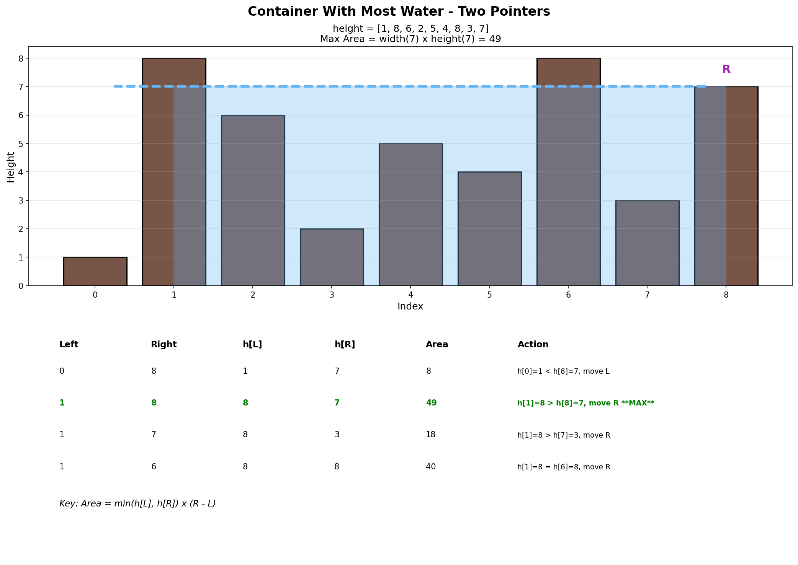
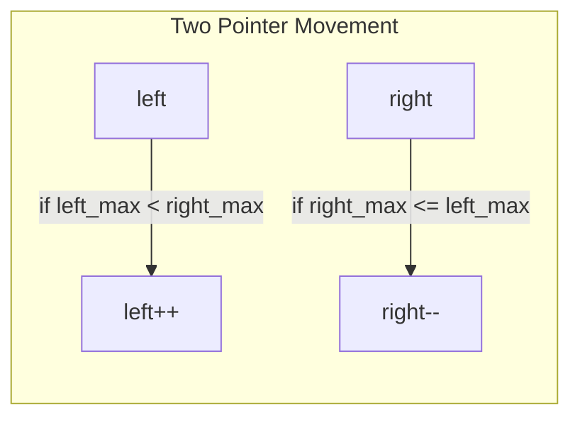

# Container With Most Water

## Problem Statement

You are given an integer array `height` of length `n`. There are `n` vertical lines drawn such that the two endpoints of the `i`th line are `(i, 0)` and `(i, height[i])`.

Find two lines that together with the x-axis form a container, such that the container contains the most water.

Return the **maximum amount of water** a container can store.

**Note:** You may not slant the container.

## Examples

### Example 1
```
Input: height = [1, 8, 6, 2, 5, 4, 8, 3, 7]
Output: 49
Explanation: The vertical lines at indices 1 and 8 (height 8 and 7)
form the container with the most water.
Area = min(8, 7) * (8 - 1) = 7 * 7 = 49
```

### Example 2
```
Input: height = [1, 1]
Output: 1
Explanation: Area = min(1, 1) * (1 - 0) = 1
```

## Visual Explanation



## Key Insight: Two Pointers

The area between two lines is determined by:
- **Width**: Distance between the two lines
- **Height**: The minimum of the two line heights

Start with the widest possible container (left and right ends), then try to find taller lines by moving pointers inward.

**Critical insight**: Always move the pointer pointing to the shorter line. Why?
- The area is limited by the shorter line
- Moving the shorter line might find a taller line and increase area
- Moving the taller line can only decrease or maintain area

## Solution

```python
def maxArea(height: list[int]) -> int:
    """
    Find maximum water container using two pointers.

    Time Complexity: O(n)
    Space Complexity: O(1)
    """
    left = 0
    right = len(height) - 1
    max_water = 0

    while left < right:
        # Calculate current area
        width = right - left
        h = min(height[left], height[right])
        current_water = width * h
        max_water = max(max_water, current_water)

        # Move the pointer at shorter height
        if height[left] < height[right]:
            left += 1
        else:
            right -= 1

    return max_water


# Brute force for comparison (don't use in interview)
def maxArea_bruteforce(height: list[int]) -> int:
    """
    Check all pairs - O(n^2).
    """
    max_water = 0
    n = len(height)

    for i in range(n):
        for j in range(i + 1, n):
            width = j - i
            h = min(height[i], height[j])
            max_water = max(max_water, width * h)

    return max_water
```

::: info Complexity (Two Pointers): Time O(n) · Space O(1)
- **Time:** Each pointer moves inward at most n times total; the while loop runs at most n-1 iterations
- **Space:** Only three variables (`left`, `right`, `max_water`) regardless of array size
:::

::: info Complexity (Brute Force): Time O(n^2) · Space O(1)
- **Time:** Nested loops check all n*(n-1)/2 pairs of lines
- **Space:** Only one tracking variable for maximum water
:::

## Step-by-Step Trace

For `height = [1, 8, 6, 2, 5, 4, 8, 3, 7]`:

| left | right | height[left] | height[right] | width | area | max_water | Move |
|------|-------|--------------|---------------|-------|------|-----------|------|
| 0 | 8 | 1 | 7 | 8 | 8 | 8 | left++ |
| 1 | 8 | 8 | 7 | 7 | 49 | **49** | right-- |
| 1 | 7 | 8 | 3 | 6 | 18 | 49 | right-- |
| 1 | 6 | 8 | 8 | 5 | 40 | 49 | right-- |
| 1 | 5 | 8 | 4 | 4 | 16 | 49 | right-- |
| 1 | 4 | 8 | 5 | 3 | 15 | 49 | right-- |
| 1 | 3 | 8 | 2 | 2 | 4 | 49 | right-- |
| 1 | 2 | 8 | 6 | 1 | 6 | 49 | right-- |
| 1 | 1 | - | - | - | - | 49 | stop |

**Result:** Maximum water = 49

## Why Two Pointers Work

Proof of correctness:
1. We start with maximum width
2. At each step, we move the pointer at the shorter line
3. The line we're moving away from cannot be part of a better solution because:
   - Any container using it would have the same or smaller height
   - Any container using it would have smaller width
4. Therefore, we never miss the optimal solution

## Complexity Analysis

| Approach | Time | Space |
|----------|------|-------|
| Two Pointers | O(n) | O(1) |
| Brute Force | O(n^2) | O(1) |

## Edge Cases

1. **Two elements**: `[1, 1]` -> Area = 1
2. **Ascending heights**: `[1, 2, 3, 4]` -> Area = 4 (indices 0, 3)
3. **Descending heights**: `[4, 3, 2, 1]` -> Area = 4 (indices 0, 3)
4. **Same heights**: `[5, 5, 5, 5]` -> Area = 15 (indices 0, 3)
5. **One tall, rest short**: `[1, 1, 100, 1, 1]` -> Area = 4

## Common Mistakes

1. **Moving wrong pointer** - Must move the shorter one
2. **Calculating area incorrectly** - Use min(heights), not max or sum
3. **Off-by-one in width** - Width = right - left (not right - left + 1)
4. **Forgetting edge cases** - Minimum 2 elements needed

## Difference from Trapping Rain Water

| Container With Most Water | Trapping Rain Water |
|--------------------------|---------------------|
| Only 2 lines matter | All lines matter |
| Water on top of bars | Water between bars |
| Area = min(h[i], h[j]) * (j - i) | Water trapped in each position |
| Choose best pair | Sum of all trapped water |

```
Container:       Trapping:
   |~~~~|           |
   |    |           |~~|  |
   | ~~ |   vs    ~~|~~|~~|
---+----+---      --+--+--+--
```

## Related Problems

::: details Trapping Rain Water (LeetCode 42)
**Problem:** Given elevation map, compute how much water can be trapped after rain.

**Key Insight:** Water at each position = min(maxLeft, maxRight) - height. Different from Container because we sum water at ALL positions, not just between two lines.

**Approach:** Two pointers from ends, process side with smaller max. Or use prefix/suffix arrays.



**Complexity:** O(n) time, O(1) space with two pointers
:::

::: details Largest Rectangle in Histogram (LeetCode 84)
**Problem:** Find largest rectangle area in histogram where each bar has width 1.

**Key Insight:** For each bar, find how far left and right it can extend as the minimum height. Use monotonic stack.

**Approach:** Maintain monotonic increasing stack. When a shorter bar appears, calculate areas for taller bars in stack.

**Complexity:** O(n) time, O(n) space
:::

::: details Maximal Rectangle (LeetCode 85)
**Problem:** Find largest rectangle containing only 1s in a binary matrix.

**Key Insight:** Build histogram row by row, then apply Largest Rectangle in Histogram.

**Approach:** For each row, calculate heights (consecutive 1s above). Apply histogram algorithm to each row.

**Complexity:** O(m*n) time, O(n) space
:::

## Key Takeaways

- Two pointers from ends is optimal for this "maximize area" problem
- Always move the pointer at the shorter line
- The greedy choice is provably correct
- Don't confuse with trapping rain water (different problem)
- Area formula: width * min(left_height, right_height)
