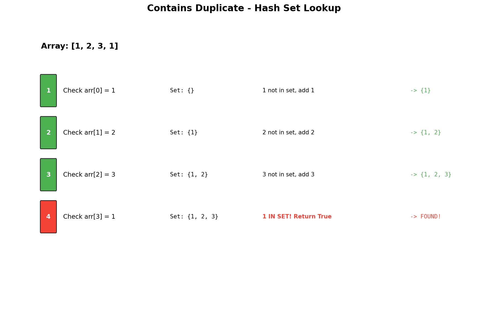

# Contains Duplicate

## Problem Statement

Given an integer array `nums`, return `true` if any value appears **at least twice** in the array, and return `false` if every element is distinct.

## Examples

### Example 1
```
Input: nums = [1, 2, 3, 1]
Output: true
Explanation: The element 1 appears twice.
```

### Example 2
```
Input: nums = [1, 2, 3, 4]
Output: false
Explanation: All elements are distinct.
```

### Example 3
```
Input: nums = [1, 1, 1, 3, 3, 4, 3, 2, 4, 2]
Output: true
Explanation: Multiple elements appear more than once.
```

## Visual Explanation



## Multiple Approaches

### Approach 1: Hash Set (Optimal)
- Use a set to track seen elements
- O(1) average lookup time

### Approach 2: Sorting
- Sort and check adjacent elements
- Modifies the array

### Approach 3: Brute Force
- Compare every pair
- O(n^2) time - not recommended

## Solution

```python
def containsDuplicate(nums: list[int]) -> bool:
    """
    Check if array contains any duplicates using a hash set.

    Time Complexity: O(n)
    Space Complexity: O(n)
    """
    seen = set()

    for num in nums:
        if num in seen:
            return True
        seen.add(num)

    return False


# One-liner using set length comparison
def containsDuplicate_oneliner(nums: list[int]) -> bool:
    """
    If set has fewer elements than array, duplicates exist.

    Time Complexity: O(n)
    Space Complexity: O(n)
    """
    return len(nums) != len(set(nums))


# Sorting approach (modifies array)
def containsDuplicate_sorting(nums: list[int]) -> bool:
    """
    Sort and check adjacent elements.

    Time Complexity: O(n log n)
    Space Complexity: O(1) if in-place sort, O(n) otherwise
    """
    nums.sort()

    for i in range(1, len(nums)):
        if nums[i] == nums[i - 1]:
            return True

    return False


# Brute force (for reference - do not use)
def containsDuplicate_bruteforce(nums: list[int]) -> bool:
    """
    Check every pair - NOT RECOMMENDED.

    Time Complexity: O(n^2)
    Space Complexity: O(1)
    """
    n = len(nums)
    for i in range(n):
        for j in range(i + 1, n):
            if nums[i] == nums[j]:
                return True
    return False
```

::: info Complexity (Hash Set): Time O(n) · Space O(n)
- **Time:** Single pass with O(1) average hash set lookup/insert operations per element
- **Space:** Worst case stores all n elements when no duplicates exist
:::

::: info Complexity (One-liner): Time O(n) · Space O(n)
- **Time:** O(n) to build the set, O(1) for length comparisons
- **Space:** Creates a complete set of up to n elements; no early termination benefit
:::

::: info Complexity (Sorting): Time O(n log n) · Space O(1) to O(n)
- **Time:** Dominated by sort operation; linear scan afterward is O(n)
- **Space:** O(1) if in-place sort allowed (Timsort uses O(n) auxiliary space internally in Python)
:::

::: info Complexity (Brute Force): Time O(n^2) · Space O(1)
- **Time:** Nested loops compare each pair; n*(n-1)/2 comparisons total
- **Space:** No additional data structures used
:::

## Comparison of Approaches

| Approach | Time | Space | Pros | Cons |
|----------|------|-------|------|------|
| Hash Set | O(n) | O(n) | Fastest, early termination | Extra space |
| One-liner | O(n) | O(n) | Concise | Builds full set first |
| Sorting | O(n log n) | O(1)* | No extra space | Modifies array |
| Brute Force | O(n^2) | O(1) | Simple | Too slow |

*Note: Python's sort uses O(n) space internally

## Step-by-Step Trace (Hash Set)

For `nums = [1, 2, 3, 1]`:

| Index | Value | seen (before) | In seen? | Action |
|-------|-------|---------------|----------|--------|
| 0 | 1 | `{}` | No | Add 1 |
| 1 | 2 | `{1}` | No | Add 2 |
| 2 | 3 | `{1, 2}` | No | Add 3 |
| 3 | 1 | `{1, 2, 3}` | **Yes** | Return True |

## Complexity Analysis

### Hash Set Approach (Recommended)

| Metric | Complexity |
|--------|------------|
| **Time** | O(n) - Single pass, O(1) hash operations |
| **Space** | O(n) - Worst case stores all elements |

### Sorting Approach

| Metric | Complexity |
|--------|------------|
| **Time** | O(n log n) - Dominated by sorting |
| **Space** | O(1) to O(n) - Depends on sort implementation |

## Edge Cases

1. **Empty array**: `[]` -> Return `false`
2. **Single element**: `[1]` -> Return `false`
3. **Two same elements**: `[1, 1]` -> Return `true`
4. **Two different elements**: `[1, 2]` -> Return `false`
5. **All same elements**: `[5, 5, 5, 5]` -> Return `true`
6. **Large array, no duplicates**: `[1, 2, ..., n]` -> Return `false`
7. **Negative numbers**: `[-1, -1]` -> Return `true`

## Variations

### Contains Duplicate II (Within K Distance)
```python
def containsNearbyDuplicate(nums: list[int], k: int) -> bool:
    """
    Return true if nums[i] == nums[j] and abs(i-j) <= k.
    """
    index_map = {}

    for i, num in enumerate(nums):
        if num in index_map and i - index_map[num] <= k:
            return True
        index_map[num] = i

    return False
```

::: info Complexity: Time O(n) · Space O(min(n, k))
- **Time:** Single pass with O(1) hash map operations per element
- **Space:** Map stores at most min(n, k+1) entries since we track indices within distance k
:::

### Contains Duplicate III (Within K Distance and T Value Difference)
```python
def containsNearbyAlmostDuplicate(nums: list[int], k: int, t: int) -> bool:
    """
    Return true if nums[i] and nums[j] differ by at most t
    and indices differ by at most k.
    Uses bucket sort concept.
    """
    if t < 0:
        return False

    buckets = {}
    bucket_size = t + 1

    for i, num in enumerate(nums):
        bucket_id = num // bucket_size

        # Check same bucket
        if bucket_id in buckets:
            return True

        # Check adjacent buckets
        if bucket_id - 1 in buckets and num - buckets[bucket_id - 1] <= t:
            return True
        if bucket_id + 1 in buckets and buckets[bucket_id + 1] - num <= t:
            return True

        buckets[bucket_id] = num

        # Remove old buckets outside window
        if i >= k:
            old_bucket = nums[i - k] // bucket_size
            del buckets[old_bucket]

    return False
```

::: info Complexity: Time O(n) · Space O(min(n, k))
- **Time:** Single pass; bucket operations (insert, delete, lookup) are O(1)
- **Space:** At most k+1 buckets maintained due to sliding window cleanup
:::

## Common Mistakes

1. **Using list instead of set** - O(n) lookup instead of O(1)
2. **Not considering empty arrays** - Handle edge case
3. **Modifying input when not allowed** - Sorting changes the array
4. **Using brute force** - O(n^2) will fail on large inputs

## Related Problems

::: details Contains Duplicate II (LeetCode 219)
**Problem:** Check if there are two distinct indices i and j where nums[i] == nums[j] AND abs(i - j) <= k.

**Key Insight:** Use hash map to store most recent index of each number, check distance on duplicates.

**Approach:** For each number, if already in map and distance <= k, return true. Update map with current index.

**Complexity:** O(n) time, O(min(n, k)) space
:::

::: details Contains Duplicate III (LeetCode 220)
**Problem:** Check if there are indices i, j where abs(i - j) <= k AND abs(nums[i] - nums[j]) <= t.

**Key Insight:** Use bucket sort concept - numbers in same or adjacent buckets could satisfy condition.

**Approach:** Create buckets of size t+1. Check same bucket and adjacent buckets. Remove old buckets outside window k.

**Complexity:** O(n) time, O(min(n, k)) space
:::

::: details Find the Duplicate Number (LeetCode 287)
**Problem:** Find duplicate in array of n+1 integers where each is in [1, n], without modifying array.

**Key Insight:** Treat array as linked list where value points to next index. Use Floyd's cycle detection.

**Approach:** Fast/slow pointers to find cycle, then find cycle entrance (the duplicate).

**Complexity:** O(n) time, O(1) space
:::

::: details Two Sum (LeetCode 1)
**Problem:** Find two indices whose values sum to target.

**Key Insight:** Use hash map to check for complement in O(1).

**Approach:** For each number, check if (target - num) exists in map. If not, add current number to map.

**Complexity:** O(n) time, O(n) space
:::

## Key Takeaways

- Hash sets provide O(1) average lookup for duplicate detection
- The one-liner `len(nums) != len(set(nums))` is Pythonic but less efficient for early termination
- Consider trade-offs between time, space, and whether input modification is allowed
- This is a fundamental pattern used in many other problems
