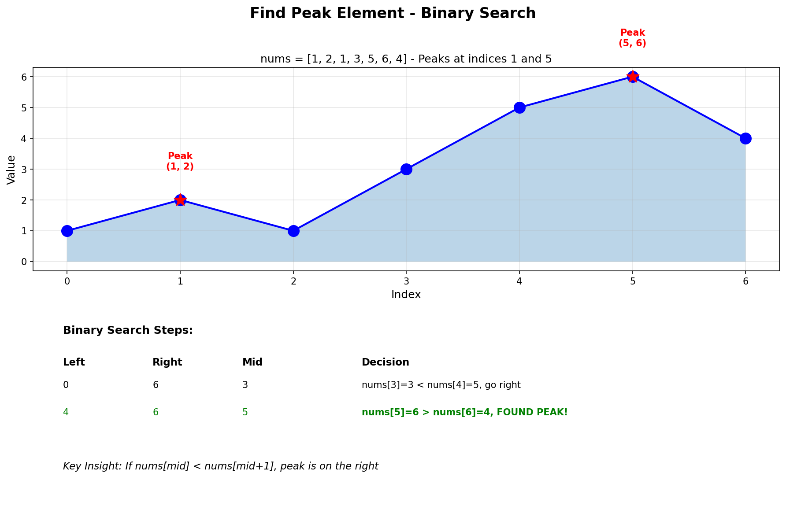
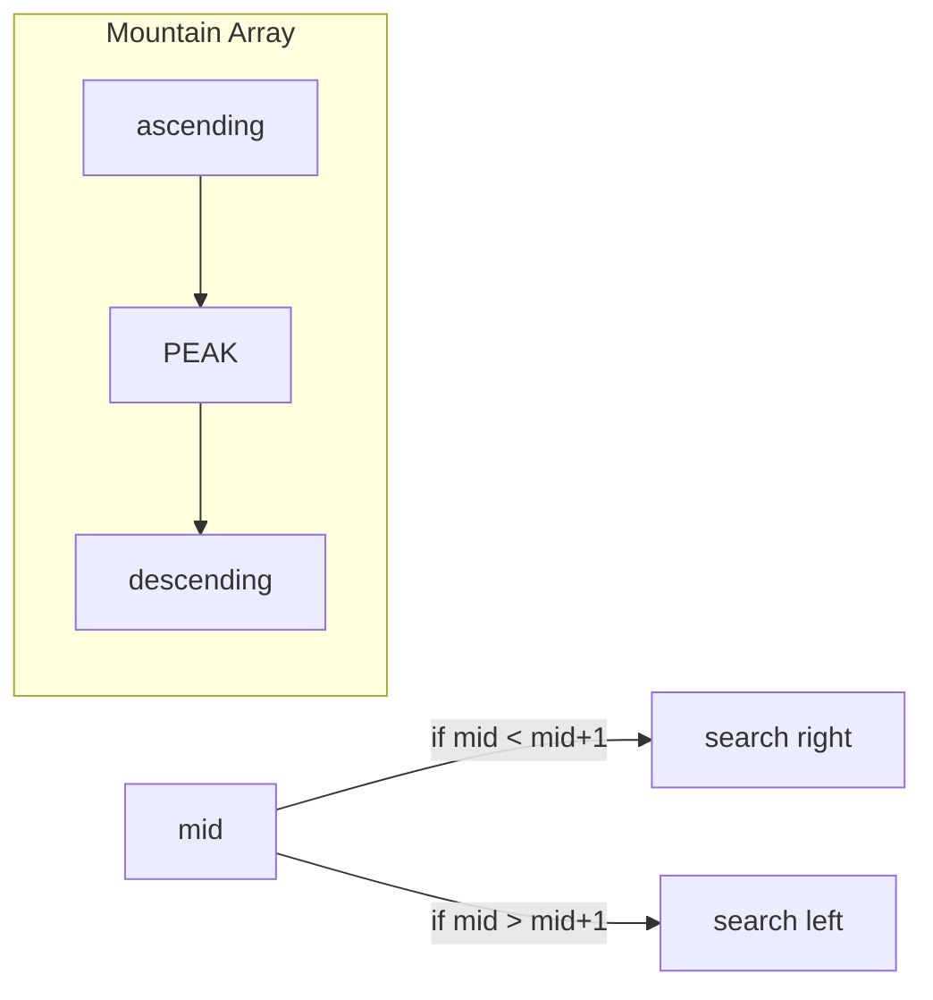

# Find Peak Element

## Problem Statement

A peak element is an element that is strictly greater than its neighbors.

Given a **0-indexed** integer array `nums`, find a peak element, and return its index. If the array contains multiple peaks, return the index to **any of the peaks**.

You may imagine that `nums[-1] = nums[n] = -infinity`. In other words, an element is always considered to be strictly greater than a neighbor that is outside the array.

You must write an algorithm that runs in **O(log n)** time.

## Examples

### Example 1
```text
Input: nums = [1, 2, 3, 1]
Output: 2
Explanation: 3 is a peak element and your function should return index 2.
```

### Example 2
```text
Input: nums = [1, 2, 1, 3, 5, 6, 4]
Output: 5
Explanation: Your function can return either index 1 (peak value 2)
or index 5 (peak value 6).
```

### Example 3
```text
Input: nums = [1]
Output: 0
Explanation: Single element is always a peak.
```

## Visual Explanation



## Key Insight: Binary Search

Even though the array is not sorted, we can use binary search because:
1. **Boundary condition**: nums[-1] = nums[n] = -infinity
2. If `nums[mid] < nums[mid + 1]`, there must be a peak on the right side
3. If `nums[mid] < nums[mid - 1]`, there must be a peak on the left side
4. We're guaranteed to find a peak because we're "climbing" toward it

Think of it like climbing a hill - if you always go upward, you'll reach a peak.

## Solution

```python
def findPeakElement(nums: list[int]) -> int:
    """
    Find a peak element using binary search.

    Time Complexity: O(log n)
    Space Complexity: O(1)
    """
    left, right = 0, len(nums) - 1

    while left < right:
        mid = (left + right) // 2

        if nums[mid] < nums[mid + 1]:
            # Peak must be on the right side
            left = mid + 1
        else:
            # Peak is at mid or on the left side
            right = mid

    return left


# Recursive version
def findPeakElement_recursive(nums: list[int]) -> int:
    """
    Recursive binary search approach.
    """
    def search(left: int, right: int) -> int:
        if left == right:
            return left

        mid = (left + right) // 2

        if nums[mid] < nums[mid + 1]:
            return search(mid + 1, right)
        else:
            return search(left, mid)

    return search(0, len(nums) - 1)


# Linear scan (for comparison - O(n))
def findPeakElement_linear(nums: list[int]) -> int:
    """
    Linear scan - O(n) time.
    """
    for i in range(len(nums) - 1):
        if nums[i] > nums[i + 1]:
            return i
    return len(nums) - 1
```

::: info Complexity (Binary Search Iterative): Time O(log n) · Space O(1)
- **Time:** Search space halves each iteration; at most log2(n) iterations
- **Space:** Only three variables (`left`, `right`, `mid`) used regardless of input size
:::

::: info Complexity (Binary Search Recursive): Time O(log n) · Space O(log n)
- **Time:** Same halving logic as iterative; log2(n) recursive calls
- **Space:** Recursion stack depth is O(log n) due to binary division
:::

::: info Complexity (Linear Scan): Time O(n) · Space O(1)
- **Time:** Worst case traverses entire array when peak is at the end
- **Space:** No additional data structures used
:::

## Step-by-Step Trace

For `nums = [1, 2, 1, 3, 5, 6, 4]`:

| Step | left | right | mid | nums[mid] | nums[mid+1] | Comparison | Action |
|------|------|-------|-----|-----------|-------------|------------|--------|
| 1 | 0 | 6 | 3 | 3 | 5 | 3 < 5 | left = 4 |
| 2 | 4 | 6 | 5 | 6 | 4 | 6 > 4 | right = 5 |
| 3 | 4 | 5 | 4 | 5 | 6 | 5 < 6 | left = 5 |
| 4 | 5 | 5 | - | - | - | left == right | return 5 |

**Result:** Peak at index 5 (value 6)

## Why Binary Search Works

```text
Case 1: nums[mid] < nums[mid + 1]
        We're on an "upward slope" going right
        A peak must exist to the right (including mid+1)

              ?
             /
            /
           mid  mid+1

Case 2: nums[mid] > nums[mid + 1]
        We're on a "downward slope" or at a peak
        A peak exists at mid or to the left

        mid
         \
          \
           mid+1

Because nums[-1] = nums[n] = -infinity, we're guaranteed to find a peak.
```

## Complexity Analysis

| Approach | Time | Space |
|----------|------|-------|
| Binary Search | O(log n) | O(1) |
| Recursive BS | O(log n) | O(log n) |
| Linear Scan | O(n) | O(1) |

## Edge Cases

1. **Single element**: `[1]` -> Return 0 (always a peak)
2. **Two elements, ascending**: `[1, 2]` -> Return 1
3. **Two elements, descending**: `[2, 1]` -> Return 0
4. **Strictly increasing**: `[1, 2, 3, 4]` -> Return 3 (last element)
5. **Strictly decreasing**: `[4, 3, 2, 1]` -> Return 0 (first element)
6. **All same**: Not possible per problem (no two adjacent elements are equal)
7. **Peak in middle**: `[1, 3, 1]` -> Return 1

## Variations

### Find Peak Element in 2D Matrix (Kth Peak)
```python
def findPeakGrid(mat: list[list[int]]) -> list[int]:
    """
    Find peak in 2D matrix where peak is greater than all 4 neighbors.
    """
    def findMaxInColumn(col: int) -> int:
        max_row = 0
        for row in range(len(mat)):
            if mat[row][col] > mat[max_row][col]:
                max_row = row
        return max_row

    left, right = 0, len(mat[0]) - 1

    while left < right:
        mid = (left + right) // 2
        max_row = findMaxInColumn(mid)

        if mat[max_row][mid] < mat[max_row][mid + 1]:
            left = mid + 1
        else:
            right = mid

    return [findMaxInColumn(left), left]
```

::: info Complexity: Time O(m log n) · Space O(1)
- **Time:** Binary search on columns (log n iterations), each finding column max in O(m) time
- **Space:** Only constant variables used for pointers and indices
:::

### Find All Peaks
```python
def findAllPeaks(nums: list[int]) -> list[int]:
    """
    Find all peak elements - O(n).
    """
    if len(nums) == 1:
        return [0]

    peaks = []

    # Check first element
    if nums[0] > nums[1]:
        peaks.append(0)

    # Check middle elements
    for i in range(1, len(nums) - 1):
        if nums[i] > nums[i - 1] and nums[i] > nums[i + 1]:
            peaks.append(i)

    # Check last element
    if nums[-1] > nums[-2]:
        peaks.append(len(nums) - 1)

    return peaks
```

::: info Complexity: Time O(n) · Space O(k)
- **Time:** Single pass checking each element against its neighbors
- **Space:** Output list stores k peaks; worst case k = O(n/2) for alternating arrays
:::

## Common Mistakes

1. **Using `left <= right`** - Should be `left < right` to avoid infinite loop
2. **Checking `nums[mid-1]`** - Can cause index out of bounds; focus on mid+1
3. **Not handling edge elements** - Problem guarantees -infinity at boundaries
4. **Returning wrong value** - Return left (or right) when they converge

## Related Problems

::: details Find Minimum in Rotated Sorted Array (LeetCode 153)
**Problem:** Find minimum in rotated sorted array.

**Key Insight:** Similar binary search on non-standard array. Minimum is where rotation occurred.

**Approach:** If nums[mid] > nums[right], minimum in right half. Otherwise in left half (including mid).

**Complexity:** O(log n) time, O(1) space
:::

::: details Search in Rotated Sorted Array (LeetCode 33)
**Problem:** Search for target in rotated sorted array.

**Key Insight:** Binary search with modified logic - determine which half is sorted, check if target in that range.

**Approach:** If left half sorted and target in range, search left. Otherwise search right (and vice versa).

**Complexity:** O(log n) time, O(1) space
:::

::: details Peak Index in a Mountain Array (LeetCode 852)
**Problem:** Find peak in array that strictly increases then strictly decreases (guaranteed mountain).

**Key Insight:** Simpler than Find Peak Element - guaranteed single peak, strictly monotonic.

**Approach:** Binary search - if nums[mid] < nums[mid+1], on ascending side, go right. Otherwise go left.



**Complexity:** O(log n) time, O(1) space
:::

## Key Takeaways

- Binary search can work on non-sorted arrays if there's a decidable condition
- The key insight: following the "upward slope" guarantees finding a peak
- The -infinity boundary condition ensures a peak always exists
- This is a template for "binary search on answer" problems
- Both iterative and recursive approaches work; iterative is more space-efficient
