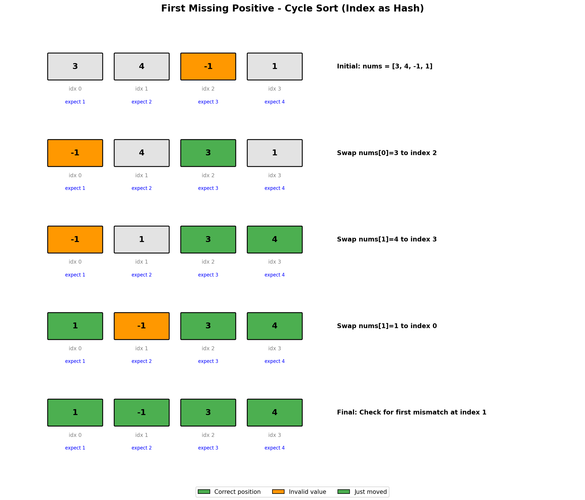

# First Missing Positive

## Problem Statement

Given an unsorted integer array `nums`, return the smallest missing positive integer.

You must implement an algorithm that runs in **O(n)** time and uses **O(1)** auxiliary space.

## Examples

### Example 1
```text
Input: nums = [1, 2, 0]
Output: 3
Explanation: The numbers 1 and 2 are present, so the answer is 3.
```

### Example 2
```text
Input: nums = [3, 4, -1, 1]
Output: 2
Explanation: 1 is present but 2 is missing.
```

### Example 3
```text
Input: nums = [7, 8, 9, 11, 12]
Output: 1
Explanation: The smallest positive integer 1 is missing.
```

## Visual Explanation



## Key Insight: Cycle Sort / Index as Hash

The crucial observation:
1. The answer is always in range `[1, n+1]` where `n = len(nums)`
2. We can use the array itself as a hash table
3. Place number `i` at index `i-1` (if `1 <= i <= n`)
4. After placement, scan for the first index where `nums[i] != i+1`

This achieves O(n) time and O(1) space by using **cyclic sort** technique.

## Solution

```python
def firstMissingPositive(nums: list[int]) -> int:
    """
    Find first missing positive using cycle sort (in-place hash).

    Time Complexity: O(n) - each element placed at most once
    Space Complexity: O(1) - in-place modification
    """
    n = len(nums)

    # Place each number i at index i-1 (if valid)
    for i in range(n):
        # Keep swapping until current position has correct number or invalid
        while 1 <= nums[i] <= n and nums[nums[i] - 1] != nums[i]:
            # Swap nums[i] to its correct position
            correct_idx = nums[i] - 1
            nums[i], nums[correct_idx] = nums[correct_idx], nums[i]

    # Find first position where nums[i] != i + 1
    for i in range(n):
        if nums[i] != i + 1:
            return i + 1

    # All positions are correct, answer is n + 1
    return n + 1


# Alternative: Mark with negative (modifies array differently)
def firstMissingPositive_marking(nums: list[int]) -> int:
    """
    Mark presence using negative sign.
    """
    n = len(nums)

    # Step 1: Replace non-positive and out-of-range with n+1
    for i in range(n):
        if nums[i] <= 0 or nums[i] > n:
            nums[i] = n + 1

    # Step 2: Mark presence by negating
    for i in range(n):
        num = abs(nums[i])
        if num <= n:
            nums[num - 1] = -abs(nums[num - 1])

    # Step 3: Find first positive (unmarked)
    for i in range(n):
        if nums[i] > 0:
            return i + 1

    return n + 1


# Brute force with set (O(n) time but O(n) space)
def firstMissingPositive_set(nums: list[int]) -> int:
    """
    Using hash set - O(n) space.
    """
    num_set = set(nums)
    i = 1
    while i in num_set:
        i += 1
    return i
```

::: info Complexity (Cycle Sort): Time O(n) · Space O(1)
- **Time:** Each element is swapped at most once to its final position; total swaps bounded by n
- **Space:** In-place modification using the input array as a hash table
:::

::: info Complexity (Marking): Time O(n) · Space O(1)
- **Time:** Three separate O(n) passes: sanitize values, mark presence, find first positive
- **Space:** In-place modification; sign bit used as presence marker
:::

::: info Complexity (Hash Set): Time O(n) · Space O(n)
- **Time:** O(n) to build set, O(n) worst case to find first missing positive
- **Space:** Set stores up to n elements from the input array
:::

## Step-by-Step Trace (Cycle Sort)

For `nums = [3, 4, -1, 1]`:

| i | nums[i] | Valid? | Action | Array State |
|---|---------|--------|--------|-------------|
| 0 | 3 | Yes (1<=3<=4) | Swap 3 to idx 2 | [-1, 4, 3, 1] |
| 0 | -1 | No (-1<1) | Move to i=1 | [-1, 4, 3, 1] |
| 1 | 4 | Yes (1<=4<=4) | Swap 4 to idx 3 | [-1, 1, 3, 4] |
| 1 | 1 | Yes (1<=1<=4) | Swap 1 to idx 0 | [1, -1, 3, 4] |
| 1 | -1 | No (-1<1) | Move to i=2 | [1, -1, 3, 4] |
| 2 | 3 | At correct pos | Move to i=3 | [1, -1, 3, 4] |
| 3 | 4 | At correct pos | Done | [1, -1, 3, 4] |

Final scan:
- Index 0: nums[0]=1 == 0+1 ✓
- Index 1: nums[1]=-1 != 1+1 ✗ -> Return 2

## Why Answer is in [1, n+1]

```text
Consider array of length n:

Case 1: All of 1, 2, ..., n are present
        Answer = n + 1

Case 2: At least one of 1, 2, ..., n is missing
        Answer is the smallest missing one (<= n)

Therefore, we only need to check [1, n] and return n+1 if all present.

Example:
n = 4, nums = [1, 2, 3, 4] -> Answer = 5 (n+1)
n = 4, nums = [5, 6, 7, 8] -> Answer = 1
n = 4, nums = [1, 3, 4, 5] -> Answer = 2
```

## Complexity Analysis

| Approach | Time | Space |
|----------|------|-------|
| Cycle Sort | O(n) | O(1) |
| Marking | O(n) | O(1) |
| Hash Set | O(n) | O(n) |

Why is cycle sort O(n)? Each element is swapped at most once to its final position.

## Edge Cases

1. **Empty array**: `[]` -> 1
2. **All negative**: `[-1, -2, -3]` -> 1
3. **All positive consecutive**: `[1, 2, 3]` -> 4
4. **Single element**: `[1]` -> 2, `[2]` -> 1
5. **Duplicates**: `[1, 1, 1]` -> 2
6. **Large numbers**: `[100, 200, 300]` -> 1

## Common Mistakes

1. **Not handling duplicates** - Check if `nums[nums[i]-1] != nums[i]` to avoid infinite loop
2. **Modifying array incorrectly** - Be careful with swap indices
3. **Off-by-one errors** - Index is `i`, expected value is `i+1`
4. **Forgetting range check** - Only place numbers in `[1, n]`

## Related Problems

::: details Find All Numbers Disappeared in an Array (LeetCode 448)
**Problem:** Find all numbers in [1, n] missing from array of n integers.

**Key Insight:** Same cycle sort / index marking pattern. Use array as hash map.

**Approach:** Mark presence by negating value at index (num-1). Numbers at positive indices are missing.

**Complexity:** O(n) time, O(1) space
:::

::: details Find the Duplicate Number (LeetCode 287)
**Problem:** Find duplicate in n+1 integers where each is in [1, n], without modifying array.

**Key Insight:** Treat array as linked list - values are pointers. Duplicate creates cycle.

**Approach:** Floyd's cycle detection (tortoise and hare). Find cycle, then find entrance.

**Complexity:** O(n) time, O(1) space
:::

::: details Set Mismatch (LeetCode 645)
**Problem:** Array should be [1, n] but one number duplicated and one missing. Find both.

**Key Insight:** Use marking technique to find duplicate. Sum math to find missing.

**Approach:** Mark visited by negating. Find duplicate (already negative when visiting). Use sum difference for missing.

**Complexity:** O(n) time, O(1) space
:::

::: details Missing Number (LeetCode 268)
**Problem:** Find missing number from [0, n] in array of n distinct numbers.

**Key Insight:** Use XOR or sum formula (Gauss formula: n*(n+1)/2).

**Approach:** XOR all indices and values - duplicate cancels, missing remains. Or: expected_sum - actual_sum.

**Complexity:** O(n) time, O(1) space
:::

## Key Takeaways

- **Cycle sort** is powerful for in-place rearrangement problems
- The array can serve as its own hash map (index = value - 1)
- Always ask: "What's the range of possible answers?"
- The constraint O(1) space + O(n) time often hints at in-place array manipulation
- The swap condition `nums[nums[i]-1] != nums[i]` prevents infinite loops with duplicates
