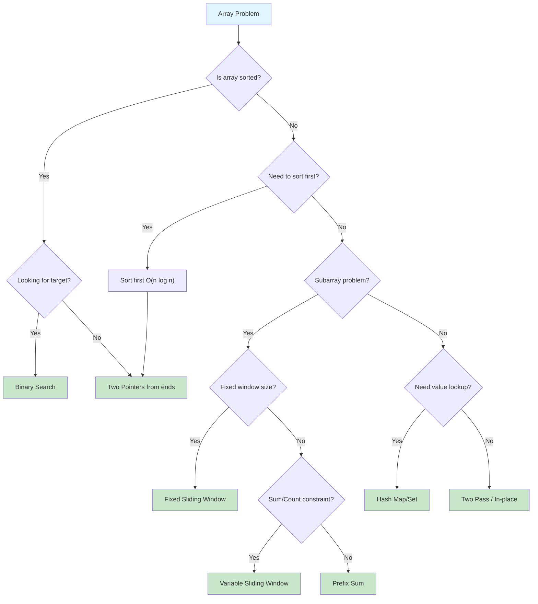
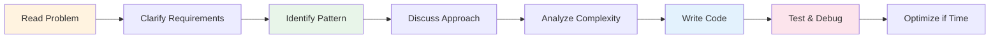

# Arrays

> **The fundamental data structure for sequential data**

---

## Overview

An **array** is a collection of elements of the same data type stored in **contiguous memory locations**. This fundamental data structure forms the backbone of most programming operations and is essential for SDE interviews.

### What is an Array?

Arrays store elements sequentially in memory, where each element can be accessed directly using its **index**. For example, an array of ten 32-bit integers with indices 0-9 stored starting at memory address 2000 would have elements at addresses 2000, 2004, 2008, ..., 2036. The element at index `i` has address: `base_address + (i * element_size)`.

### Memory Layout

```
Memory Address:  2000   2004   2008   2012   2016   2020
                +------+------+------+------+------+------+
Array:          |  10  |  20  |  30  |  40  |  50  |  60  |
                +------+------+------+------+------+------+
Index:            0      1      2      3      4      5
```

**Key Characteristics:**
- **Contiguous allocation**: Elements stored next to each other in memory
- **Fixed size**: Traditional arrays have a fixed size declared at initialization
- **Homogeneous**: All elements must be of the same data type
- **Zero-indexed**: Most languages use 0-based indexing

### When to Use Arrays

| Use Case | Why Arrays Work Well |
|----------|---------------------|
| **Sequential data access** | O(1) access by index |
| **Fixed-size collections** | Memory-efficient, no overhead |
| **Cache-friendly operations** | Spatial locality improves performance |
| **Matrix/grid problems** | Natural 2D representation |
| **Implementing other structures** | Foundation for stacks, queues, heaps |

### When to Consider Alternatives

| Limitation | Better Alternative |
|------------|-------------------|
| Frequent insertions/deletions in middle | Linked List |
| Unknown or highly variable size | Dynamic Array / List |
| Need fast lookups by value | Hash Table |
| Ordered data with frequent updates | Balanced BST |

---

## Document Structure

| Problem | Difficulty | Pattern | Link |
|---------|------------|---------|------|
| Move Zeros | Easy | Two Pointer | [Link](./move-zeros) |
| Remove Duplicates from Sorted Array | Easy | Two Pointer | [Link](./remove-duplicates) |
| Best Time to Buy and Sell Stock | Easy | One Pass | [Link](./buy-sell-stock) |
| Contains Duplicate | Easy | Hash Set | [Link](./contains-duplicate) |
| Two Sum | Easy | Hash Map | [Link](./two-sum) |
| Maximum Subarray (Kadane's) | Medium | Dynamic Programming | [Link](./maximum-subarray) |
| Three Sum | Medium | Two Pointer + Sort | [Link](./three-sum) |
| Container With Most Water | Medium | Two Pointer | [Link](./container-water) |
| Product of Array Except Self | Medium | Prefix/Suffix | [Link](./product-except-self) |
| Merge Intervals | Medium | Sorting + Greedy | [Link](./merge-intervals) |
| Rotate Array | Medium | Reverse Technique | [Link](./rotate-array) |
| Find Peak Element | Medium | Binary Search | [Link](./find-peak) |
| Search in Rotated Sorted Array | Medium | Binary Search | [Link](./search-rotated) |
| Subarray Sum Equals K | Medium | Prefix Sum + Hash | [Link](./subarray-sum-k) |
| Sliding Window Maximum | Hard | Monotonic Deque | [Link](./sliding-window-max) |
| Trapping Rain Water | Hard | Two Pointer / Stack | [Link](./trapping-rain-water) |
| First Missing Positive | Hard | Index Marking | [Link](./first-missing-positive) |
| Median of Two Sorted Arrays | Hard | Binary Search | [Link](./median-two-arrays) |

---

## Array Operations Complexity

| Operation | Time Complexity | Space Complexity | Notes |
|-----------|-----------------|------------------|-------|
| Access by index | O(1) | O(1) | Direct memory calculation |
| Search (unsorted) | O(n) | O(1) | Linear scan required |
| Search (sorted) | O(log n) | O(1) | Binary search |
| Insert at end | O(1) amortized | O(1) | O(n) when resizing needed |
| Insert at beginning | O(n) | O(1) | Shift all elements right |
| Insert at middle | O(n) | O(1) | Shift elements after position |
| Delete at end | O(1) | O(1) | Simply decrease length |
| Delete at beginning | O(n) | O(1) | Shift all elements left |
| Delete at middle | O(n) | O(1) | Shift elements after position |
| Copy array | O(n) | O(n) | Must copy each element |
| Resize (dynamic) | O(n) | O(n) | Copy to new array |

### Static vs Dynamic Arrays

| Feature | Static Array | Dynamic Array (Python List) |
|---------|--------------|----------------------------|
| Size | Fixed at creation | Grows/shrinks automatically |
| Memory | Exact allocation | Over-allocates for growth |
| Insert (end) | N/A or O(n) | O(1) amortized |
| Memory overhead | None | ~12.5% extra capacity |

---

## Common Array Patterns

### Pattern Selection Flowchart



### Pattern Quick Reference

| Pattern | When to Use | Example Problems | Time Complexity |
|---------|-------------|------------------|-----------------|
| **Two Pointers** | Sorted array, pair finding | Two Sum II, 3Sum, Container Water | O(n) |
| **Sliding Window** | Contiguous subarray/substring | Max Sum Subarray, Longest Substring | O(n) |
| **Prefix Sum** | Range sum queries, subarray sums | Subarray Sum Equals K, Range Sum | O(n) preprocessing |
| **Binary Search** | Sorted array, find target/boundary | Search Rotated, Peak Element | O(log n) |
| **Hash Map/Set** | Value lookup, frequency counting | Two Sum, Contains Duplicate | O(n) with O(n) space |
| **In-place Swap** | Rearrange without extra space | Move Zeros, Dutch National Flag | O(n) |
| **Kadane's Algorithm** | Maximum subarray sum | Maximum Subarray | O(n) |
| **Monotonic Stack/Deque** | Next greater/smaller, sliding max | Sliding Window Maximum | O(n) |

---

## Python Array Tips

### List vs Array Module vs NumPy

```python
# Python List (most common for interviews)
arr = [1, 2, 3, 4, 5]           # Dynamic, heterogeneous allowed
arr.append(6)                   # O(1) amortized
arr.pop()                       # O(1) from end
arr.insert(0, 0)                # O(n) - shifts elements

# array module (typed, more memory efficient)
import array
arr = array.array('i', [1, 2, 3])  # 'i' = signed int

# NumPy (for numerical computing, rarely in interviews)
import numpy as np
arr = np.array([1, 2, 3])       # Vectorized operations
```

### Essential List Methods

```python
# Creation
arr = [0] * n                   # Array of n zeros
arr = [[0] * cols for _ in range(rows)]  # 2D array (CORRECT)
arr = [[0] * cols] * rows       # WRONG - creates references!

# Slicing
arr[start:end]                  # Elements from start to end-1
arr[start:end:step]             # With step
arr[::-1]                       # Reverse array
arr[::2]                        # Every other element

# Common Operations
arr.append(x)                   # Add to end - O(1) amortized
arr.pop()                       # Remove from end - O(1)
arr.pop(0)                      # Remove from front - O(n)
arr.insert(i, x)                # Insert at index - O(n)
arr.remove(x)                   # Remove first occurrence - O(n)
arr.index(x)                    # Find index of x - O(n)
arr.count(x)                    # Count occurrences - O(n)
arr.sort()                      # In-place sort - O(n log n)
sorted(arr)                     # Returns new sorted list
arr.reverse()                   # In-place reverse - O(n)
reversed(arr)                   # Returns iterator

# List Comprehensions (Pythonic)
squares = [x**2 for x in range(10)]
evens = [x for x in arr if x % 2 == 0]
flattened = [x for row in matrix for x in row]
```

### Common Interview Idioms

```python
# Two Pointers Template
def two_pointer_template(arr):
    left, right = 0, len(arr) - 1
    while left < right:
        # Process arr[left] and arr[right]
        if condition:
            left += 1
        else:
            right -= 1

# Sliding Window Template (Variable Size)
def sliding_window_template(arr, target):
    left = 0
    window_sum = 0
    result = 0

    for right in range(len(arr)):
        window_sum += arr[right]  # Expand window

        while window_sum > target:  # Shrink window
            window_sum -= arr[left]
            left += 1

        result = max(result, right - left + 1)

    return result

# Prefix Sum Template
def prefix_sum_template(arr):
    prefix = [0]
    for num in arr:
        prefix.append(prefix[-1] + num)
    # Sum of arr[i:j] = prefix[j] - prefix[i]
    return prefix
```

---

## Interview Focus Areas

Based on recent SDE interview patterns (2025-2026), these array topics are most frequently tested:

### High Priority Topics

1. **Two Sum Variants** - The classic "find pairs that sum to target" appears in multiple forms
2. **Subarray Problems** - Finding contiguous subarrays with specific properties (max sum, equals K)
3. **Merge Intervals** - Combining overlapping intervals, meeting room scheduling
4. **Sliding Window** - Both fixed and variable window sizes
5. **Binary Search on Arrays** - Especially in rotated/modified sorted arrays

### Common Google Array Questions (2025-2026)

| Question Type | Example Problem | Key Insight |
|--------------|-----------------|-------------|
| Pair Sum | "Find two indices where values sum to target" | Hash map for O(n) |
| Maximum Subarray | "Find contiguous subarray with largest sum" | Kadane's algorithm |
| Merge Intervals | "Merge all overlapping intervals" | Sort by start, then merge |
| Split Array | "Count ways to split array so concatenation is sorted" | Recent OA question |
| Array Manipulation | "Flip at most one element to minimize absolute sum" | Consider each flip |

### What Interviewers Look For

1. **Clarifying Questions**
   - Are there duplicates?
   - Can I modify the input array?
   - What about empty arrays or single elements?
   - Are values bounded? Positive only?

2. **Problem-Solving Approach**
   - Start with brute force, then optimize
   - Discuss time/space tradeoffs
   - Consider edge cases before coding

3. **Code Quality**
   - Clean, readable code
   - Meaningful variable names
   - Handle edge cases explicitly

4. **Testing**
   - Walk through example inputs
   - Test edge cases (empty, single element, all same values)
   - Verify with larger inputs mentally

### Interview Strategy for Array Problems



---

## Practice Progression

### Week 1: Foundations

| Day | Focus | Problems |
|-----|-------|----------|
| 1 | Basic Operations | Two Sum, Contains Duplicate, Remove Duplicates |
| 2 | Two Pointers | Move Zeros, Three Sum, Container With Most Water |
| 3 | Sliding Window | Max Sum Subarray Size K, Longest Substring Without Repeating |

### Week 2: Intermediate

| Day | Focus | Problems |
|-----|-------|----------|
| 4 | Prefix Sum | Subarray Sum Equals K, Product Except Self |
| 5 | Binary Search | Search in Rotated, Find Peak, First Bad Version |
| 6 | Sorting-Based | Merge Intervals, Meeting Rooms, Sort Colors |

### Week 3: Advanced

| Day | Focus | Problems |
|-----|-------|----------|
| 7 | Monotonic Stack | Next Greater Element, Trapping Rain Water |
| 8 | Advanced Patterns | Sliding Window Maximum, First Missing Positive |
| 9 | Mixed Practice | Random selection from all patterns |

---

## Quick Reference Card

### Time Complexity Cheat Sheet

```
Access:     O(1)     - arr[i]
Search:     O(n)     - unsorted, O(log n) sorted
Insert:     O(n)     - worst case, O(1) amortized at end
Delete:     O(n)     - worst case, O(1) at end
Sort:       O(n log n) - comparison-based
```

### Pattern Recognition Triggers

| If you see... | Think about... |
|--------------|----------------|
| "Sorted array" | Binary Search, Two Pointers |
| "Subarray" | Sliding Window, Prefix Sum |
| "Pairs that sum" | Hash Map, Two Pointers |
| "Contiguous" | Sliding Window, Kadane's |
| "In-place" | Two Pointers, Swap technique |
| "Next greater/smaller" | Monotonic Stack |
| "K largest/smallest" | Heap, QuickSelect |

---

## Resources

### Recommended Practice

- [LeetCode Array Problems](https://leetcode.com/tag/array/)
- [NeetCode Array Playlist](https://neetcode.io/roadmap)
- [Grind 75 - Array Section](https://www.techinterviewhandbook.org/grind75)

### Further Reading

- [GeeksforGeeks - Array Data Structure Guide](https://www.geeksforgeeks.org/array-data-structure/)
- [Google SDE Sheet - GeeksforGeeks](https://www.geeksforgeeks.org/google-sde-sheet-interview-questions-and-answers/)
- [Educative - Google Coding Interview Questions](https://www.educative.io/blog/google-coding-interview-questions)

---

*Last updated: January 2026*

*Arrays are the foundation of technical interviews. Master the patterns here, and you'll find that many "hard" problems become manageable applications of these core techniques.*
