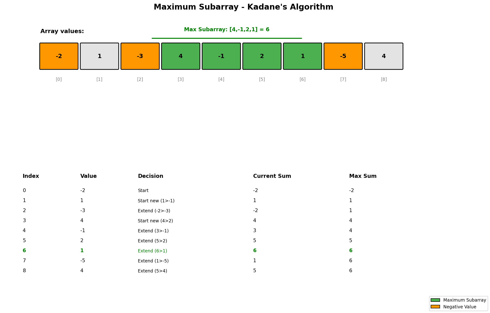

# Maximum Subarray (Kadane's Algorithm)

## Problem Statement

Given an integer array `nums`, find the subarray with the largest sum, and return its sum.

A **subarray** is a contiguous non-empty sequence of elements within an array.

## Examples

### Example 1
```text
Input: nums = [-2, 1, -3, 4, -1, 2, 1, -5, 4]
Output: 6
Explanation: The subarray [4, -1, 2, 1] has the largest sum = 6.
```

### Example 2
```text
Input: nums = [1]
Output: 1
Explanation: The subarray [1] has the largest sum = 1.
```

### Example 3
```text
Input: nums = [5, 4, -1, 7, 8]
Output: 23
Explanation: The subarray [5, 4, -1, 7, 8] has the largest sum = 23 (entire array).
```

## Visual Explanation



## Key Insight: Kadane's Algorithm

The core idea is: at each position, decide whether to:
1. **Extend** the current subarray by adding the current element
2. **Start fresh** with just the current element

If the current running sum is negative, it's better to start fresh because a negative prefix can only decrease the sum of any future subarray.

## Solution

```python
def maxSubArray(nums: list[int]) -> int:
    """
    Find maximum subarray sum using Kadane's Algorithm.

    Time Complexity: O(n)
    Space Complexity: O(1)
    """
    current_sum = nums[0]
    max_sum = nums[0]

    for i in range(1, len(nums)):
        # Either extend current subarray or start new one
        current_sum = max(nums[i], current_sum + nums[i])
        max_sum = max(max_sum, current_sum)

    return max_sum
```

::: info Complexity: Time O(n) · Space O(1)
- **Time:** Single pass through the array, performing constant-time operations (max, addition) at each element
- **Space:** Only two variables (`current_sum`, `max_sum`) regardless of input size
:::

```python
# Alternative formulation
def maxSubArray_v2(nums: list[int]) -> int:
    """
    Equivalent logic: if current_sum becomes negative, reset it.
    """
    current_sum = 0
    max_sum = float('-inf')

    for num in nums:
        current_sum += num
        max_sum = max(max_sum, current_sum)
        if current_sum < 0:
            current_sum = 0

    return max_sum
```

::: info Complexity: Time O(n) · Space O(1)
- **Time:** Single linear scan with constant-time comparisons and updates per element
- **Space:** Uses only three scalar variables (`current_sum`, `max_sum`, and loop variable)
:::

```python
# Return the actual subarray indices
def maxSubArray_indices(nums: list[int]) -> tuple[int, int, int]:
    """
    Return (max_sum, start_index, end_index).
    """
    current_sum = nums[0]
    max_sum = nums[0]
    start = end = temp_start = 0

    for i in range(1, len(nums)):
        if nums[i] > current_sum + nums[i]:
            current_sum = nums[i]
            temp_start = i
        else:
            current_sum = current_sum + nums[i]

        if current_sum > max_sum:
            max_sum = current_sum
            start = temp_start
            end = i

    return max_sum, start, end
```

::: info Complexity: Time O(n) · Space O(1)
- **Time:** One pass through the array; each index involves constant-time comparisons and pointer updates
- **Space:** Only five scalar variables (`current_sum`, `max_sum`, `start`, `end`, `temp_start`) used
:::

```python
# Divide and Conquer approach (for learning)
def maxSubArray_divideConquer(nums: list[int]) -> int:
    """
    Divide and conquer approach.

    Time Complexity: O(n log n)
    Space Complexity: O(log n) - recursion stack
    """
    def helper(left: int, right: int) -> int:
        if left > right:
            return float('-inf')
        if left == right:
            return nums[left]

        mid = (left + right) // 2

        # Max sum in left half
        left_max = helper(left, mid)
        # Max sum in right half
        right_max = helper(mid + 1, right)

        # Max sum crossing the midpoint
        left_cross = float('-inf')
        current = 0
        for i in range(mid, left - 1, -1):
            current += nums[i]
            left_cross = max(left_cross, current)

        right_cross = float('-inf')
        current = 0
        for i in range(mid + 1, right + 1):
            current += nums[i]
            right_cross = max(right_cross, current)

        cross_max = left_cross + right_cross

        return max(left_max, right_max, cross_max)

    return helper(0, len(nums) - 1)
```

::: info Complexity: Time O(n log n) · Space O(log n)
- **Time:** Recursion divides array in half (log n levels), and at each level we do O(n) work scanning for crossing subarrays
- **Space:** Recursion stack depth is O(log n) due to balanced partitioning at each step
:::

## Step-by-Step Trace

For `nums = [-2, 1, -3, 4, -1, 2, 1, -5, 4]`:

| i | nums[i] | current_sum (before) | Decision | current_sum (after) | max_sum |
|---|---------|---------------------|----------|---------------------|---------|
| 0 | -2 | - | Initial | -2 | -2 |
| 1 | 1 | -2 | max(1, -1) = 1 | 1 | 1 |
| 2 | -3 | 1 | max(-3, -2) = -2 | -2 | 1 |
| 3 | 4 | -2 | max(4, 2) = 4 | 4 | 4 |
| 4 | -1 | 4 | max(-1, 3) = 3 | 3 | 4 |
| 5 | 2 | 3 | max(2, 5) = 5 | 5 | 5 |
| 6 | 1 | 5 | max(1, 6) = 6 | 6 | **6** |
| 7 | -5 | 6 | max(-5, 1) = 1 | 1 | 6 |
| 8 | 4 | 1 | max(4, 5) = 5 | 5 | 6 |

**Result:** Maximum sum = 6, subarray = [4, -1, 2, 1]

## Complexity Analysis

| Approach | Time | Space |
|----------|------|-------|
| Kadane's Algorithm | O(n) | O(1) |
| Divide and Conquer | O(n log n) | O(log n) |
| Brute Force | O(n^2) | O(1) |

## Edge Cases

1. **Single element**: `[5]` -> 5
2. **All negative**: `[-3, -2, -1]` -> -1 (must include at least one element)
3. **All positive**: `[1, 2, 3]` -> 6 (entire array)
4. **Contains zero**: `[0, -1, 0]` -> 0
5. **Large negative followed by large positive**: `[-100, 50]` -> 50

## Variations

### Maximum Product Subarray
```python
def maxProduct(nums: list[int]) -> int:
    """
    Find maximum product subarray.
    Track both max and min because negative * negative = positive.
    """
    max_prod = min_prod = result = nums[0]

    for i in range(1, len(nums)):
        if nums[i] < 0:
            max_prod, min_prod = min_prod, max_prod

        max_prod = max(nums[i], max_prod * nums[i])
        min_prod = min(nums[i], min_prod * nums[i])
        result = max(result, max_prod)

    return result
```

::: info Complexity: Time O(n) · Space O(1)
- **Time:** Single pass through array, with constant-time min/max operations and swaps per element
- **Space:** Three variables (`max_prod`, `min_prod`, `result`) maintained regardless of input size
:::

### Maximum Circular Subarray Sum
```python
def maxSubarraySumCircular(nums: list[int]) -> int:
    """
    Array is circular - end connects to beginning.
    """
    total = sum(nums)

    # Case 1: Max subarray is not circular (normal Kadane)
    max_sum = current_max = nums[0]
    # Case 2: Max subarray wraps around (total - min_subarray)
    min_sum = current_min = nums[0]

    for i in range(1, len(nums)):
        current_max = max(nums[i], current_max + nums[i])
        max_sum = max(max_sum, current_max)

        current_min = min(nums[i], current_min + nums[i])
        min_sum = min(min_sum, current_min)

    # If all elements are negative, min_sum = total
    if max_sum < 0:
        return max_sum

    return max(max_sum, total - min_sum)
```

::: info Complexity: Time O(n) · Space O(1)
- **Time:** Two Kadane passes (for max and min) merged into one loop, plus O(n) for computing total sum
- **Space:** Only constant variables (`total`, `max_sum`, `min_sum`, `current_max`, `current_min`)
:::

## Common Mistakes

1. **Initializing max_sum to 0** - Should be first element or -infinity
2. **Not handling all-negative arrays** - Must return the largest negative
3. **Confusing subarray with subsequence** - Subarray must be contiguous
4. **Off-by-one errors** in divide and conquer

## Related Problems

::: details Maximum Product Subarray (LeetCode 152)
**Problem:** Find subarray with largest product (multiplication instead of sum).

**Key Insight:** Track both max AND min product because negative times negative = positive.

**Approach:** Maintain maxProd and minProd ending at current position. When encountering negative, swap them before updating.

**Complexity:** O(n) time, O(1) space
:::

::: details Maximum Sum Circular Subarray (LeetCode 918)
**Problem:** Find maximum subarray sum where array is circular (end connects to beginning).

**Key Insight:** Answer is either max normal subarray OR total sum minus min subarray (wrapping case).

**Approach:** Run Kadane's for max and min subarray. Return max(maxSum, totalSum - minSum). Handle all-negative case.

**Complexity:** O(n) time, O(1) space
:::

::: details Best Time to Buy and Sell Stock (LeetCode 121)
**Problem:** Find maximum profit from single buy-sell transaction.

**Key Insight:** Equivalent to maximum subarray of daily price differences. Track minimum price seen.

**Approach:** For each price, calculate profit if selling today (price - minPriceSoFar). Track max profit.

**Complexity:** O(n) time, O(1) space
:::

::: details Maximum Sum of Two Non-Overlapping Subarrays (LeetCode 1031)
**Problem:** Find maximum sum of two non-overlapping subarrays of given lengths L and M.

**Key Insight:** Use prefix sums and track best L-length subarray seen so far while scanning M-length subarrays.

**Approach:** Compute prefix sums. For each position, track best subarray of one length that ends before current subarray of other length.

**Complexity:** O(n) time, O(n) space
:::

## Key Takeaways

- Kadane's Algorithm is the optimal O(n) solution
- The key decision: extend or start fresh based on running sum
- A negative running sum is always worth discarding
- This pattern extends to many "maximum contiguous" problems
- Divide and conquer is useful for understanding but less efficient
