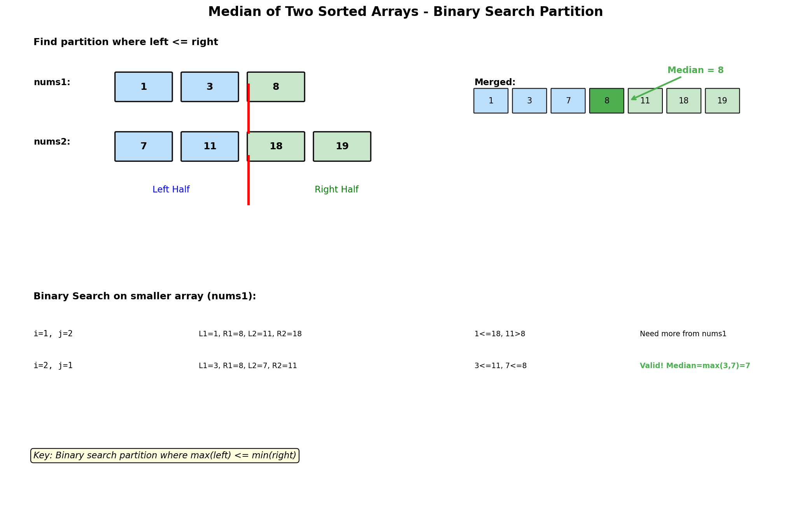

# Median of Two Sorted Arrays

## Problem Statement

Given two sorted arrays `nums1` and `nums2` of size `m` and `n` respectively, return the **median** of the two sorted arrays.

The overall run time complexity should be **O(log(m+n))**.

## Examples

### Example 1
```text
Input: nums1 = [1, 3], nums2 = [2]
Output: 2.0
Explanation: merged array = [1, 2, 3] and median is 2.
```

### Example 2
```text
Input: nums1 = [1, 2], nums2 = [3, 4]
Output: 2.5
Explanation: merged array = [1, 2, 3, 4] and median is (2 + 3) / 2 = 2.5.
```

### Example 3
```text
Input: nums1 = [0, 0], nums2 = [0, 0]
Output: 0.0
```

## Visual Explanation



## Key Insight: Binary Search on Partition

Instead of merging arrays (O(m+n)), we binary search on where to partition.

For combined array to have left half and right half:
- Left half should have `(m + n + 1) // 2` elements
- If we take `i` elements from nums1, we take `half_len - i` from nums2

Valid partition condition:
- `nums1[i-1] <= nums2[j]` (left of nums1 <= right of nums2)
- `nums2[j-1] <= nums1[i]` (left of nums2 <= right of nums1)

## Solution

::: code-group

```python [Python]
def findMedianSortedArrays(nums1: list[int], nums2: list[int]) -> float:
    """
    Find median using binary search on partition.

    Time Complexity: O(log(min(m, n)))
    Space Complexity: O(1)
    """
    # Ensure nums1 is the smaller array
    if len(nums1) > len(nums2):
        nums1, nums2 = nums2, nums1

    m, n = len(nums1), len(nums2)
    half_len = (m + n + 1) // 2

    left, right = 0, m

    while left <= right:
        # Partition positions
        i = (left + right) // 2  # Partition in nums1
        j = half_len - i          # Partition in nums2

        # Elements around partitions
        nums1_left = float('-inf') if i == 0 else nums1[i - 1]
        nums1_right = float('inf') if i == m else nums1[i]
        nums2_left = float('-inf') if j == 0 else nums2[j - 1]
        nums2_right = float('inf') if j == n else nums2[j]

        if nums1_left <= nums2_right and nums2_left <= nums1_right:
            # Found valid partition
            if (m + n) % 2 == 1:
                # Odd total: median is max of left side
                return float(max(nums1_left, nums2_left))
            else:
                # Even total: median is average of max left and min right
                return (max(nums1_left, nums2_left) +
                        min(nums1_right, nums2_right)) / 2
        elif nums1_left > nums2_right:
            # nums1 partition is too far right
            right = i - 1
        else:
            # nums1 partition is too far left
            left = i + 1

    raise ValueError("Input arrays are not sorted")
```

```java [Java]
public double findMedianSortedArrays(int[] nums1, int[] nums2) {
    // Ensure nums1 is the smaller array
    if (nums1.length > nums2.length) {
        int[] tmp = nums1; nums1 = nums2; nums2 = tmp;
    }

    int m = nums1.length, n = nums2.length;
    int halfLen = (m + n + 1) / 2;

    int left = 0, right = m;

    while (left <= right) {
        // Partition positions
        int i = left + (right - left) / 2;  // Partition in nums1
        int j = halfLen - i;          // Partition in nums2

        // Elements around partitions
        int nums1Left  = (i == 0) ? Integer.MIN_VALUE : nums1[i - 1];
        int nums1Right = (i == m) ? Integer.MAX_VALUE : nums1[i];
        int nums2Left  = (j == 0) ? Integer.MIN_VALUE : nums2[j - 1];
        int nums2Right = (j == n) ? Integer.MAX_VALUE : nums2[j];

        if (nums1Left <= nums2Right && nums2Left <= nums1Right) {
            // Found valid partition
            if ((m + n) % 2 == 1) {
                // Odd total: median is max of left side
                return Math.max(nums1Left, nums2Left);
            } else {
                // Even total: median is average of max left and min right
                return (Math.max(nums1Left, nums2Left) +
                        (double) Math.min(nums1Right, nums2Right)) / 2.0;
            }
        } else if (nums1Left > nums2Right) {
            // nums1 partition is too far right
            right = i - 1;
        } else {
            // nums1 partition is too far left
            left = i + 1;
        }
    }

    throw new IllegalArgumentException("Input arrays are not sorted");
}
```

:::

::: info Complexity: Time O(log(min(m, n))) · Space O(1)
- **Time:** Binary search on the smaller array; each iteration halves the search space. We always search the smaller array to minimize iterations.
- **Space:** Only constant variables for partition indices and boundary elements (`i`, `j`, `nums1_left`, etc.)
:::

```python
# Simpler O(m+n) approach for understanding
def findMedianSortedArrays_merge(nums1: list[int], nums2: list[int]) -> float:
    """
    Merge and find median - O(m+n) time.
    """
    merged = []
    i = j = 0

    while i < len(nums1) and j < len(nums2):
        if nums1[i] <= nums2[j]:
            merged.append(nums1[i])
            i += 1
        else:
            merged.append(nums2[j])
            j += 1

    merged.extend(nums1[i:])
    merged.extend(nums2[j:])

    n = len(merged)
    if n % 2 == 1:
        return float(merged[n // 2])
    else:
        return (merged[n // 2 - 1] + merged[n // 2]) / 2
```

::: info Complexity: Time O(m + n) · Space O(m + n)
- **Time:** Linear merge of both arrays element by element until fully merged
- **Space:** Creates a new merged array storing all (m + n) elements
:::

```python
# Optimized: stop at median position
def findMedianSortedArrays_optimized_merge(nums1: list[int], nums2: list[int]) -> float:
    """
    Only merge until median position - O((m+n)/2) time.
    """
    m, n = len(nums1), len(nums2)
    total = m + n
    target = total // 2

    i = j = 0
    prev = curr = 0

    for _ in range(target + 1):
        prev = curr
        if i < m and (j >= n or nums1[i] <= nums2[j]):
            curr = nums1[i]
            i += 1
        else:
            curr = nums2[j]
            j += 1

    if total % 2 == 1:
        return float(curr)
    else:
        return (prev + curr) / 2
```

::: info Complexity: Time O((m + n) / 2) · Space O(1)
- **Time:** Only iterates up to the median position (half the total elements) rather than merging the entire arrays
- **Space:** Uses only constant variables (`prev`, `curr`, `i`, `j`) without creating a merged array
:::

## Step-by-Step Trace

For `nums1 = [1, 3]`, `nums2 = [2]`:

```text
m = 2, n = 1, half_len = (2+1+1)//2 = 2

Binary search on nums1 partition:

Iteration 1:
  left = 0, right = 2
  i = 1 (take 1 element from nums1)
  j = 2 - 1 = 1 (take 1 element from nums2)

  nums1: [1 | 3]
  nums2: [2 |  ]

  nums1_left = 1, nums1_right = 3
  nums2_left = 2, nums2_right = inf

  Check: 1 <= inf ✓, 2 <= 3 ✓
  Valid partition!

  Total = 3 (odd)
  Median = max(nums1_left, nums2_left) = max(1, 2) = 2.0
```

## Complexity Analysis

| Approach | Time | Space |
|----------|------|-------|
| Binary Search | O(log(min(m,n))) | O(1) |
| Full Merge | O(m+n) | O(m+n) |
| Partial Merge | O((m+n)/2) | O(1) |

## Edge Cases

1. **Empty array**: `[]` and `[1]` -> 1.0
2. **Different sizes**: `[1,2]` and `[3,4,5,6]`
3. **One element each**: `[1]` and `[2]` -> 1.5
4. **No overlap**: `[1,2]` and `[3,4]` -> 2.5
5. **Full overlap**: `[1,3]` and `[2,4]` -> 2.5
6. **Duplicates**: `[1,1,1]` and `[1,1,1]` -> 1.0

## Common Mistakes

1. **Not handling empty partitions** - Use -inf and inf for boundaries
2. **Wrong half_len calculation** - Use `(m + n + 1) // 2` for correct left side
3. **Binary search on wrong array** - Search on smaller array for O(log(min))
4. **Off-by-one errors** - Partition index `i` means `i` elements on left
5. **Integer vs float** - Return float for even length case

## Why Binary Search Works

```text
If we partition both arrays:

nums1:  [...left1...] | [...right1...]
nums2:  [...left2...] | [...right2...]

Valid if:
1. max(left1) <= min(right2)  -- left1 elements are smaller than right2
2. max(left2) <= min(right1)  -- left2 elements are smaller than right1

If condition 1 fails (left1 too big): move partition left in nums1
If condition 2 fails (left2 too big): move partition right in nums1

Since arrays are sorted, binary search converges to valid partition.
```

## Related Problems

::: details Merge Sorted Array (LeetCode 88)
**Problem:** Merge nums2 into nums1 (nums1 has extra space at end).

**Key Insight:** Merge from the END to avoid overwriting - fill largest elements first.

**Approach:** Three pointers: one at end of nums1 values, one at end of nums2, one at end of merged area. Compare and place larger.

**Complexity:** O(m + n) time, O(1) space
:::

::: details Kth Smallest Element in a Sorted Matrix (LeetCode 378)
**Problem:** Find kth smallest in matrix where rows and columns are sorted.

**Key Insight:** Binary search on VALUE (not index). Count elements <= mid.

**Approach:** Binary search range [matrix[0][0], matrix[n-1][n-1]]. For each mid, count elements <= mid using staircase traversal.

**Complexity:** O(n * log(max - min)) time, O(1) space
:::

::: details Find K-th Smallest Pair Distance (LeetCode 719)
**Problem:** Find kth smallest absolute difference among all pairs.

**Key Insight:** Binary search on distance value. Count pairs with distance <= mid.

**Approach:** Sort array. Binary search on distance [0, max-min]. For each mid, count pairs with distance <= mid using two pointers.

**Complexity:** O(n log n + n log(max-min)) time, O(1) space
:::

## Key Takeaways

- This is one of the hardest array problems - requires deep understanding
- **Binary search on partition** is the key insight
- Always binary search on the **smaller** array for O(log(min(m,n)))
- Handle edge cases with -inf and +inf for empty partitions
- The valid partition condition ensures correct left/right split
- Understanding this problem helps with many "kth element" problems
