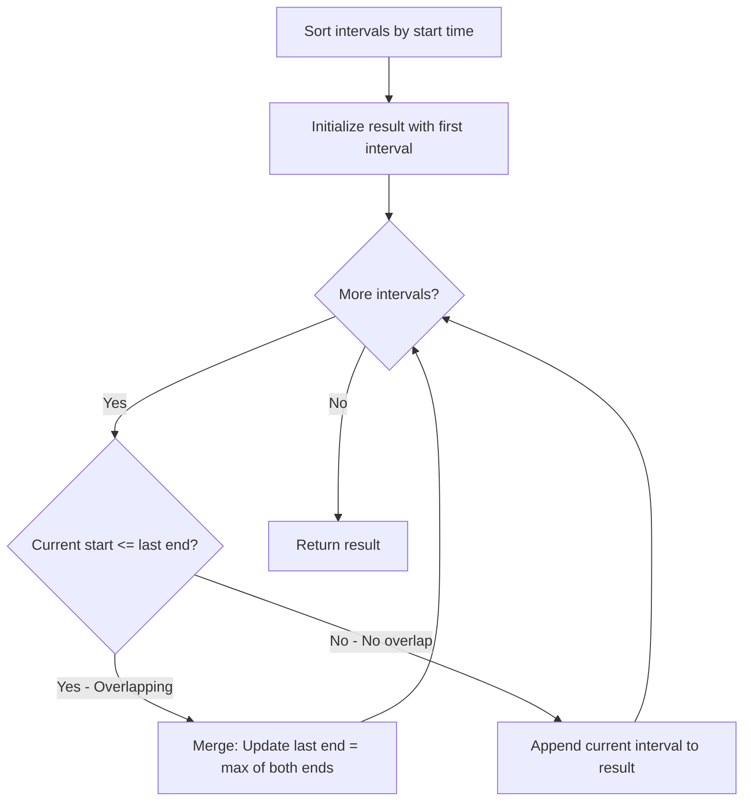
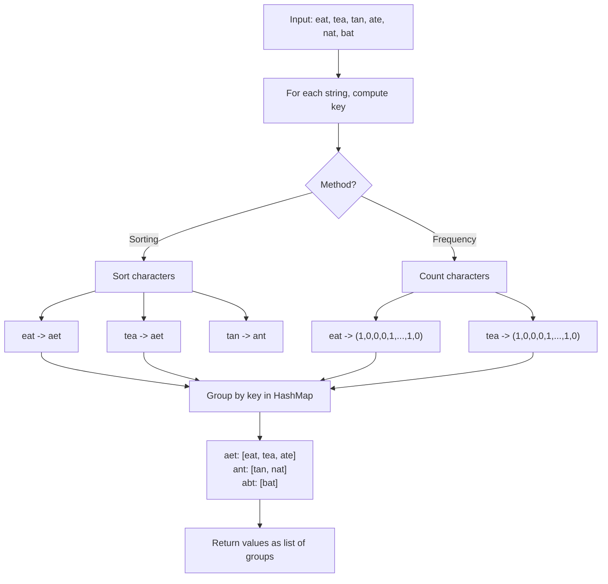

```mermaid
gantt
    title Merge Intervals Visualization
    dateFormat X
    axisFormat %s

    section Input
    [1,3]     :a, 1, 3
    [2,6]     :b, 2, 6
    [8,10]    :c, 8, 10
    [15,18]   :d, 15, 18

    section After Merge
    [1,6]     :done, e, 1, 6
    [8,10]    :done, f, 8, 10
    [15,18]   :done, g, 15, 18
```

# Merge Intervals & Group Anagrams

> **Classic array manipulation problems frequently asked in interviews and top tech companies**

These two problems represent fundamental patterns in coding interviews: **interval manipulation** and **hash-based grouping**. Mastering these patterns unlocks solutions to dozens of related problems.

---

## Merge Intervals

### Problem Statement

Given an array of intervals where `intervals[i] = [starti, endi]`, merge all overlapping intervals, and return an array of the non-overlapping intervals that cover all the intervals in the input.

**LeetCode #56 - Medium**

### Example

```
Input: [[1,3],[2,6],[8,10],[15,18]]
Output: [[1,6],[8,10],[15,18]]

Explanation: Since intervals [1,3] and [2,6] overlap, merge them into [1,6].
```

```
Input: [[1,4],[4,5]]
Output: [[1,5]]

Explanation: Intervals [1,4] and [4,5] are considered overlapping (they share endpoint 4).
```

### Approach

**Key Insight:** Sorting intervals by start time guarantees that we can detect overlaps in a single linear scan without checking every possible pair.

**Algorithm Steps:**
1. **Sort** the intervals by their start times - O(n log n)
2. **Initialize** result with the first interval
3. **Iterate** through remaining intervals:
   - If current interval overlaps with the last merged interval (start <= last_end), merge them by updating the end to max(last_end, current_end)
   - Otherwise, add the current interval to result
4. **Return** the merged intervals

**Overlap Detection:** Two intervals `[a, b]` and `[c, d]` overlap if `c <= b` (when sorted by start time).

### Mermaid Diagram





### Solution (Python)

```python
def merge(intervals: list[list[int]]) -> list[list[int]]:
    """
    Merge all overlapping intervals.

    Time: O(n log n) for sorting
    Space: O(n) for result (O(log n) for sorting in-place)
    """
    if not intervals:
        return []

    # Sort by start time
    intervals.sort(key=lambda x: x[0])
    result = [intervals[0]]

    for start, end in intervals[1:]:
        last_end = result[-1][1]

        if start <= last_end:  # Overlapping
            result[-1][1] = max(last_end, end)
        else:
            result.append([start, end])

    return result
```

::: info Complexity: Time O(n log n) · Space O(n)
- **Time:** Sorting dominates at O(n log n); the subsequent linear merge scan is O(n)
- **Space:** Result array stores up to n intervals; sorting uses O(log n) auxiliary space
:::

```python
# Alternative: More explicit version
def merge_verbose(intervals: list[list[int]]) -> list[list[int]]:
    """Same logic with clearer variable names."""
    if not intervals:
        return []

    # Sort intervals by start time
    sorted_intervals = sorted(intervals, key=lambda x: x[0])
    merged = []

    for interval in sorted_intervals:
        # If merged is empty or no overlap with last interval
        if not merged or interval[0] > merged[-1][1]:
            merged.append(interval)
        else:
            # Overlap exists - merge by extending the end time
            merged[-1][1] = max(merged[-1][1], interval[1])

    return merged
```

::: info Complexity: Time O(n log n) · Space O(n)
- **Time:** Sorting step is O(n log n); merging loop iterates through all n intervals in O(n)
- **Space:** Merged array can hold all n intervals in worst case (no overlaps)
:::

### Complexity

| Aspect | Complexity | Explanation |
|--------|------------|-------------|
| **Time** | O(n log n) | Dominated by sorting; merging is O(n) |
| **Space** | O(n) | For storing the result array |

**Note:** If intervals are already sorted, time complexity reduces to O(n).

### Google Follow-ups

#### 1. What if intervals are already sorted?

If pre-sorted, skip the sorting step and achieve O(n) time complexity:

```python
def merge_sorted(intervals: list[list[int]]) -> list[list[int]]:
    """Assumes intervals are already sorted by start time."""
    if not intervals:
        return []

    result = [intervals[0]]
    for start, end in intervals[1:]:
        if start <= result[-1][1]:
            result[-1][1] = max(result[-1][1], end)
        else:
            result.append([start, end])
    return result
```

::: info Complexity: Time O(n) · Space O(n)
- **Time:** Linear scan through intervals since they are already sorted (no sorting step needed)
- **Space:** Result array stores up to n intervals
:::

#### 2. Insert a new interval into sorted non-overlapping intervals

This is LeetCode #57 (Insert Interval) - a common interview question:

```python
def insert(intervals: list[list[int]], newInterval: list[int]) -> list[list[int]]:
    """
    Insert a new interval into sorted non-overlapping intervals.
    Merge if necessary.
    """
    result = []
    i = 0
    n = len(intervals)

    # Add all intervals that come before newInterval
    while i < n and intervals[i][1] < newInterval[0]:
        result.append(intervals[i])
        i += 1

    # Merge all overlapping intervals with newInterval
    while i < n and intervals[i][0] <= newInterval[1]:
        newInterval[0] = min(newInterval[0], intervals[i][0])
        newInterval[1] = max(newInterval[1], intervals[i][1])
        i += 1
    result.append(newInterval)

    # Add remaining intervals
    while i < n:
        result.append(intervals[i])
        i += 1

    return result
```

::: info Complexity: Time O(n) · Space O(n)
- **Time:** Three sequential while loops each traverse at most n intervals total (amortized O(n))
- **Space:** Result array stores up to n + 1 intervals (all original plus the new one)
:::

#### 3. Find minimum meeting rooms needed (Meeting Rooms II)

This is LeetCode #253 - frequently asked in interviews:

```python
import heapq

def minMeetingRooms(intervals: list[list[int]]) -> int:
    """
    Find minimum number of meeting rooms required.
    Uses min-heap to track end times of ongoing meetings.
    """
    if not intervals:
        return 0

    # Sort by start time
    intervals.sort(key=lambda x: x[0])

    # Min-heap to track end times of meetings in progress
    heap = []
    heapq.heappush(heap, intervals[0][1])

    for start, end in intervals[1:]:
        # If earliest ending meeting ends before this one starts
        if heap[0] <= start:
            heapq.heappop(heap)  # Reuse that room
        heapq.heappush(heap, end)

    return len(heap)
```

::: info Complexity: Time O(n log n) · Space O(n)
- **Time:** Sorting is O(n log n); each of n meetings does at most one heap push and pop, each O(log n)
- **Space:** Heap can grow to hold all n meeting end times if all meetings overlap
:::

```python
# Alternative: Sweep Line Algorithm
def minMeetingRooms_sweepline(intervals: list[list[int]]) -> int:
    """
    Sweep line approach - process start and end events chronologically.
    """
    events = []
    for start, end in intervals:
        events.append((start, 1))   # Meeting starts
        events.append((end, -1))    # Meeting ends

    events.sort()  # Sort by time, ends before starts if same time

    max_rooms = 0
    current_rooms = 0
    for time, delta in events:
        current_rooms += delta
        max_rooms = max(max_rooms, current_rooms)

    return max_rooms
```

::: info Complexity: Time O(n log n) · Space O(n)
- **Time:** Creating 2n events is O(n); sorting events is O(n log n); single sweep is O(n)
- **Space:** Events list stores 2n tuples (start and end event for each meeting)
:::

#### 4. Employee Free Time

Find common free time slots across all employees:

```python
def employeeFreeTime(schedule: list[list[list[int]]]) -> list[list[int]]:
    """Find free time common to all employees."""
    # Flatten and sort all intervals
    all_intervals = []
    for employee in schedule:
        all_intervals.extend(employee)
    all_intervals.sort(key=lambda x: x[0])

    # Merge overlapping work times
    merged = [all_intervals[0]]
    for start, end in all_intervals[1:]:
        if start <= merged[-1][1]:
            merged[-1][1] = max(merged[-1][1], end)
        else:
            merged.append([start, end])

    # Gaps between merged intervals are free times
    free_time = []
    for i in range(1, len(merged)):
        free_time.append([merged[i-1][1], merged[i][0]])

    return free_time
```

::: info Complexity: Time O(n log n) · Space O(n)
- **Time:** Flattening all intervals is O(n); sorting is O(n log n); merging and finding gaps are O(n)
- **Space:** Merged list and free_time list each can hold up to O(n) intervals
:::

---

## Group Anagrams

### Problem Statement

Given an array of strings `strs`, group the anagrams together. You can return the answer in any order.

An **anagram** is a word or phrase formed by rearranging the letters of a different word or phrase, using all the original letters exactly once.

**LeetCode #49 - Medium**

### Example

```
Input: ["eat","tea","tan","ate","nat","bat"]
Output: [["bat"],["nat","tan"],["ate","eat","tea"]]

Explanation:
- "ate", "eat", "tea" are anagrams (same letters rearranged)
- "nat", "tan" are anagrams
- "bat" has no anagram in the list
```

```
Input: [""]
Output: [[""]]
```

```
Input: ["a"]
Output: [["a"]]
```

### Approach

**Key Insight:** Two strings are anagrams if and only if they have the same characters with the same frequencies. We can use this as a unique "signature" to group strings.

**Two Main Approaches:**

1. **Sorted String as Key:** Sort each string - anagrams produce identical sorted strings
2. **Character Count as Key:** Count character frequencies - anagrams have identical frequency distributions

### Mermaid Diagram



### Solution (Python)

```python
from collections import defaultdict

def groupAnagrams(strs: list[str]) -> list[list[str]]:
    """
    Group anagrams using sorted string as key.

    Time: O(n * k log k) where n = number of strings, k = max string length
    Space: O(n * k) for storing all strings in hash map
    """
    groups = defaultdict(list)

    for s in strs:
        # Use sorted string as key - all anagrams produce same sorted string
        key = ''.join(sorted(s))
        groups[key].append(s)

    return list(groups.values())
```

::: info Complexity: Time O(n * k log k) · Space O(n * k)
- **Time:** For each of n strings, sorting k characters takes O(k log k), giving O(n * k log k) total
- **Space:** Hash map stores all n strings; each string and its sorted key use O(k) space
:::

```python
def groupAnagrams_v2(strs: list[str]) -> list[list[str]]:
    """
    Alternative: Use character count tuple as key.
    More efficient for long strings since counting is O(k) vs sorting O(k log k).

    Time: O(n * k) where n = number of strings, k = max string length
    Space: O(n * k)
    """
    groups = defaultdict(list)

    for s in strs:
        # Create frequency count array for 26 lowercase letters
        count = [0] * 26
        for c in s:
            count[ord(c) - ord('a')] += 1
        # Use tuple as key (lists are not hashable)
        groups[tuple(count)].append(s)

    return list(groups.values())
```

::: info Complexity: Time O(n * k) · Space O(n * k)
- **Time:** For each of n strings, counting k characters takes O(k), giving O(n * k) total
- **Space:** Hash map stores all n strings plus 26-element count tuples for keys
:::

```python
def groupAnagrams_v3(strs: list[str]) -> list[list[str]]:
    """
    Alternative: Use Counter for cleaner code.
    Slightly less efficient but more readable.
    """
    from collections import Counter

    groups = defaultdict(list)

    for s in strs:
        # frozenset of Counter items as key
        # Note: This doesn't work if characters can repeat different times
        # Use tuple(sorted(Counter(s).items())) instead
        key = tuple(sorted(Counter(s).items()))
        groups[key].append(s)

    return list(groups.values())
```

::: info Complexity: Time O(n * k log k) · Space O(n * k)
- **Time:** Counter creation is O(k) per string, but sorted() on items adds O(u log u) where u is unique chars (up to k)
- **Space:** Hash map stores all n strings; Counter objects and their sorted tuples use O(k) space each
:::

### Complexity

| Method | Time | Space | Best For |
|--------|------|-------|----------|
| **Sorting** | O(n * k log k) | O(n * k) | Short strings, simple implementation |
| **Counting** | O(n * k) | O(n * k) | Long strings, performance critical |

Where:
- `n` = number of strings
- `k` = maximum length of a string

### Google Follow-ups

#### 1. How would you handle Unicode characters?

For Unicode, we cannot use a fixed 26-element array. Use a dictionary or Counter instead:

```python
from collections import Counter, defaultdict

def groupAnagrams_unicode(strs: list[str]) -> list[list[str]]:
    """
    Handle Unicode characters using Counter.
    Works for any character set.
    """
    groups = defaultdict(list)

    for s in strs:
        # Counter works with any characters
        # Convert to sorted tuple of items for consistent hashing
        char_count = Counter(s)
        key = tuple(sorted(char_count.items()))
        groups[key].append(s)

    return list(groups.values())
```

::: info Complexity: Time O(n * k log k) · Space O(n * k)
- **Time:** For each string, Counter is O(k), and sorting items is O(u log u) where u is unique characters
- **Space:** Hash map stores n strings and Counter-based tuple keys proportional to character diversity
:::

```python
# Example with Unicode
strs = ["cafe", "face", "cafe", "face"]  # e with accent
# Each unique character is counted separately
```

**Additional Unicode Considerations:**
- **Normalization:** Different Unicode representations of the same character (e.g., e vs e with combining accent)
- **Case folding:** Some languages have complex case rules
- **Solution:** Use `unicodedata.normalize()` before processing

```python
import unicodedata

def normalize_string(s: str) -> str:
    """Normalize Unicode string for consistent comparison."""
    return unicodedata.normalize('NFC', s.lower())
```

#### 2. What if strings are very long?

For very long strings:

1. **Use counting instead of sorting:** O(k) vs O(k log k)
2. **Stream processing:** If strings are too long to fit in memory
3. **Probabilistic hashing:** Use polynomial hash for approximate grouping

```python
def groupAnagrams_long_strings(strs: list[str]) -> list[list[str]]:
    """
    Optimized for very long strings using character counting.
    Avoids the O(k log k) sorting overhead.
    """
    groups = defaultdict(list)

    for s in strs:
        # Count characters in O(k) time
        count = [0] * 26
        for c in s:
            count[ord(c) - ord('a')] += 1
        groups[tuple(count)].append(s)

    return list(groups.values())
```

::: info Complexity: Time O(n * k) · Space O(n * k)
- **Time:** Character counting for each of n strings is O(k); no sorting needed with fixed 26-element array
- **Space:** Hash map stores n strings; each key is a 26-element tuple (constant per string)
:::

#### 3. Find all anagrams in a string (Sliding Window)

Related problem - LeetCode #438:

```python
def findAnagrams(s: str, p: str) -> list[int]:
    """
    Find all start indices of p's anagrams in s.
    Uses sliding window with character count comparison.
    """
    if len(p) > len(s):
        return []

    p_count = [0] * 26
    s_count = [0] * 26
    result = []

    # Initialize counts for first window
    for i in range(len(p)):
        p_count[ord(p[i]) - ord('a')] += 1
        s_count[ord(s[i]) - ord('a')] += 1

    if s_count == p_count:
        result.append(0)

    # Slide window
    for i in range(len(p), len(s)):
        # Add new character
        s_count[ord(s[i]) - ord('a')] += 1
        # Remove old character
        s_count[ord(s[i - len(p)]) - ord('a')] -= 1

        if s_count == p_count:
            result.append(i - len(p) + 1)

    return result
```

::: info Complexity: Time O(n) · Space O(1)
- **Time:** Initialization is O(p) for pattern; sliding window through s is O(n - p), comparing 26-element arrays is O(1)
- **Space:** Two fixed 26-element count arrays regardless of input size
:::

#### 4. Generalized Abbreviation (Related Interview Question)

This problem was asked alongside Group Anagrams in a Google phone screen:

```python
def generateAbbreviations(word: str) -> list[str]:
    """
    Generate all possible abbreviations of a word.
    Example: "word" -> ["word", "1ord", "w1rd", "wo1d", "wor1",
                        "2rd", "w2d", "wo2", "1o1d", ...]
    """
    result = []

    def backtrack(pos: int, current: str, count: int):
        if pos == len(word):
            if count > 0:
                current += str(count)
            result.append(current)
            return

        # Abbreviate current character
        backtrack(pos + 1, current, count + 1)

        # Keep current character
        if count > 0:
            current += str(count)
        backtrack(pos + 1, current + word[pos], 0)

    backtrack(0, "", 0)
    return result
```

::: info Complexity: Time O(n * 2^n) · Space O(n)
- **Time:** 2^n possible abbreviations (each character can be abbreviated or kept); each abbreviation takes O(n) to build
- **Space:** Recursion stack depth is O(n); result stores 2^n strings but is considered output space
:::

---

## Common Patterns and Techniques

### Hash Map Grouping Pattern

Both problems demonstrate the power of using hash maps with computed keys:

```python
# Generic pattern for grouping by computed key
def group_by_key(items, key_func):
    groups = defaultdict(list)
    for item in items:
        key = key_func(item)
        groups[key].append(item)
    return list(groups.values())

# Usage for Group Anagrams
result = group_by_key(strs, lambda s: ''.join(sorted(s)))
```

### Interval Processing Pattern

The Merge Intervals problem introduces the interval processing pattern used in many problems:

1. **Sort by start time**
2. **Track current/merged state**
3. **Update state based on overlap condition**
4. **Handle edge cases (empty, single, touching intervals)**

---

## Past Interview References

Based on documented interview experiences:

1. **Merge Intervals Variation:** "Given a sorted list of disjoint intervals and a new interval, merge them into a sorted list of disjoint intervals." - This tests understanding of the insert operation with pre-sorted input.

2. **Meeting Rooms II:** Frequently asked as a follow-up to understand if candidates can extend interval concepts to resource allocation problems.

3. **Group Anagrams + Generalized Abbreviation:** Asked together in a Google phone screen - tests both hashing skills and backtracking.

4. **Real-World Applications Discussed:**
   - Calendar scheduling and conflict detection
   - CPU task scheduling
   - Genomic range queries
   - Spell checkers and word games (anagrams)

---

## Key Takeaways

| Problem | Core Technique | Key Insight |
|---------|---------------|-------------|
| **Merge Intervals** | Sort + Linear Scan | Sorting by start enables O(n) merge |
| **Group Anagrams** | Hash Map Grouping | Anagrams share a canonical form |

**Interview Tips:**
1. Start with the sorting approach for both - it is easier to explain and implement
2. Discuss time/space trade-offs before optimizing
3. Consider edge cases: empty input, single element, all overlapping/all anagrams
4. Mention real-world applications to demonstrate deeper understanding

---

## Sources

- [Merge Intervals - LeetCode](https://leetcode.com/problems/merge-intervals/)
- [56. Merge Intervals - In-Depth Explanation (Algo.Monster)](https://algo.monster/liteproblems/56)
- [Interval Cheatsheet - Tech Interview Handbook](https://www.techinterviewhandbook.org/algorithms/interval/)
- [Master the Merge Intervals Pattern (Medium)](https://medium.com/@piyushkashyap045/master-the-merge-intervals-pattern-your-secret-weapon-for-coding-interviews-aec54eb9023b)
- [Google Interview Question - Merge Intervals (Glassdoor)](https://www.glassdoor.com/Interview/Recently-I-attended-the-interview-at-Google-and-I-was-asked-You-are-given-a-sorted-list-of-disjoint-intervals-and-an-inter-QTN_345488.htm)
- [Group Anagrams - LeetCode](https://leetcode.com/problems/group-anagrams/)
- [49. Group Anagrams - In-Depth Explanation (Algo.Monster)](https://algo.monster/liteproblems/49)
- [Google Phone Screen - Group Anagrams (LeetCode Discuss)](https://leetcode.com/discuss/post/432366/google-phone-screen-group-anagrams-generalized-abbreviation/)
- [Mastering Anagram Problems (AlgoCademy)](https://algocademy.com/blog/mastering-anagram-problems-techniques-and-strategies-for-efficient-solutions/)
- [Group Anagrams - NeetCode](https://neetcode.io/solutions/group-anagrams)
