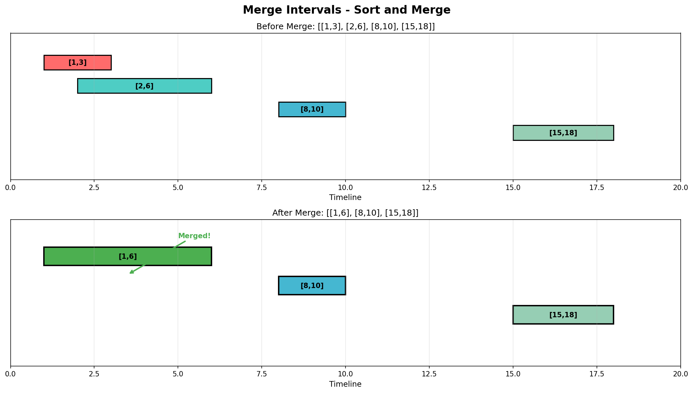

# Merge Intervals

## Problem Statement

Given an array of `intervals` where `intervals[i] = [start_i, end_i]`, merge all overlapping intervals, and return an array of the non-overlapping intervals that cover all the intervals in the input.

## Examples

### Example 1
```text
Input: intervals = [[1,3], [2,6], [8,10], [15,18]]
Output: [[1,6], [8,10], [15,18]]
Explanation: Since intervals [1,3] and [2,6] overlap, merge them into [1,6].
```

### Example 2
```text
Input: intervals = [[1,4], [4,5]]
Output: [[1,5]]
Explanation: Intervals [1,4] and [4,5] are considered overlapping
(they share endpoint 4).
```

### Example 3
```text
Input: intervals = [[1,4], [0,4]]
Output: [[0,4]]
Explanation: After sorting by start time, intervals become [[0,4], [1,4]].
These overlap and merge to [0,4].
```

## Visual Explanation



## Key Insight

Two intervals `[a, b]` and `[c, d]` overlap if and only if `c <= b` (assuming they're sorted by start time).

Algorithm:
1. **Sort** intervals by start time
2. **Iterate** through sorted intervals
3. **Merge** if current interval overlaps with previous
4. **Start new** interval if no overlap

## Solution

::: code-group

```python [Python]
def merge(intervals: list[list[int]]) -> list[list[int]]:
    """
    Merge overlapping intervals.

    Time Complexity: O(n log n) - due to sorting
    Space Complexity: O(n) - for the result (O(log n) for sort)
    """
    if not intervals:
        return []

    # Sort by start time
    intervals.sort(key=lambda x: x[0])

    merged = [intervals[0]]

    for i in range(1, len(intervals)):
        current = intervals[i]
        last_merged = merged[-1]

        # Check for overlap
        if current[0] <= last_merged[1]:
            # Merge: extend the end of last interval
            last_merged[1] = max(last_merged[1], current[1])
        else:
            # No overlap: add current as new interval
            merged.append(current)

    return merged
```

```java [Java]
public int[][] merge(int[][] intervals) {
    if (intervals == null || intervals.length == 0) return new int[0][0];

    // Sort by start time
    Arrays.sort(intervals, (a, b) -> a[0] - b[0]);

    List<int[]> merged = new ArrayList<>();
    merged.add(intervals[0]);

    for (int i = 1; i < intervals.length; i++) {
        int[] current = intervals[i];
        int[] lastMerged = merged.get(merged.size() - 1);

        // Check for overlap
        if (current[0] <= lastMerged[1]) {
            // Merge: extend the end of last interval
            lastMerged[1] = Math.max(lastMerged[1], current[1]);
        } else {
            // No overlap: add current as new interval
            merged.add(current);
        }
    }

    return merged.toArray(new int[0][]);
}
```

:::

::: info Complexity: Time O(n log n) · Space O(n)
- **Time:** Sorting dominates at O(n log n); the merge loop is a single O(n) pass through sorted intervals
- **Space:** Result array can hold up to n intervals (worst case: no overlaps); sorting uses O(log n) auxiliary space
:::

```python
# Alternative: Using a more explicit approach
def merge_explicit(intervals: list[list[int]]) -> list[list[int]]:
    """
    More explicit merge logic.
    """
    if not intervals:
        return []

    intervals.sort()
    merged = []
    current_start, current_end = intervals[0]

    for start, end in intervals[1:]:
        if start <= current_end:
            # Overlapping - extend current interval
            current_end = max(current_end, end)
        else:
            # Non-overlapping - save current and start new
            merged.append([current_start, current_end])
            current_start, current_end = start, end

    # Don't forget the last interval
    merged.append([current_start, current_end])

    return merged
```

::: info Complexity: Time O(n log n) · Space O(n)
- **Time:** Sorting is O(n log n); single pass through intervals with constant-time comparisons per interval
- **Space:** Merged array stores the result intervals; tracking variables use O(1) additional space
:::

## Step-by-Step Trace

For `intervals = [[1,3], [2,6], [8,10], [15,18]]`:

| Step | Current | Last Merged | Overlaps? | Action | Merged |
|------|---------|-------------|-----------|--------|--------|
| Init | - | - | - | Add [1,3] | [[1,3]] |
| 1 | [2,6] | [1,3] | 2 <= 3 Yes | Extend to [1,6] | [[1,6]] |
| 2 | [8,10] | [1,6] | 8 <= 6 No | Add [8,10] | [[1,6], [8,10]] |
| 3 | [15,18] | [8,10] | 15 <= 10 No | Add [15,18] | [[1,6], [8,10], [15,18]] |

## Complexity Analysis

| Metric | Complexity |
|--------|------------|
| **Time** | O(n log n) - Dominated by sorting |
| **Space** | O(n) - Result array; O(log n) for sort |

## Edge Cases

1. **Empty input**: `[]` -> `[]`
2. **Single interval**: `[[1,5]]` -> `[[1,5]]`
3. **No overlaps**: `[[1,2], [4,5]]` -> `[[1,2], [4,5]]`
4. **All overlap**: `[[1,10], [2,5], [3,7]]` -> `[[1,10]]`
5. **Touching endpoints**: `[[1,4], [4,5]]` -> `[[1,5]]`
6. **Nested intervals**: `[[1,10], [3,5]]` -> `[[1,10]]`
7. **Unsorted input**: `[[3,4], [1,2]]` -> `[[1,2], [3,4]]`

## Variations

### Insert Interval
```python
def insert(intervals: list[list[int]], newInterval: list[int]) -> list[list[int]]:
    """
    Insert a new interval into a sorted list of non-overlapping intervals.
    """
    result = []
    i = 0
    n = len(intervals)

    # Add all intervals that come before newInterval
    while i < n and intervals[i][1] < newInterval[0]:
        result.append(intervals[i])
        i += 1

    # Merge overlapping intervals
    while i < n and intervals[i][0] <= newInterval[1]:
        newInterval[0] = min(newInterval[0], intervals[i][0])
        newInterval[1] = max(newInterval[1], intervals[i][1])
        i += 1
    result.append(newInterval)

    # Add all intervals that come after
    while i < n:
        result.append(intervals[i])
        i += 1

    return result
```

::: info Complexity: Time O(n) · Space O(n)
- **Time:** Three sequential while loops each advance through at most n intervals total (single pass overall)
- **Space:** Result array stores up to n + 1 intervals (all original plus the new merged interval)
:::

### Interval List Intersections
```python
def intervalIntersection(A: list[list[int]], B: list[list[int]]) -> list[list[int]]:
    """
    Find intersections of two lists of intervals.
    """
    result = []
    i = j = 0

    while i < len(A) and j < len(B):
        # Find intersection
        start = max(A[i][0], B[j][0])
        end = min(A[i][1], B[j][1])

        if start <= end:
            result.append([start, end])

        # Move pointer with smaller end
        if A[i][1] < B[j][1]:
            i += 1
        else:
            j += 1

    return result
```

::: info Complexity: Time O(m + n) · Space O(min(m, n))
- **Time:** Each pointer advances at most m or n times respectively; total iterations bounded by m + n
- **Space:** Result can contain at most min(m, n) intersections (each intersection consumes one interval from each list)
:::

### Meeting Rooms (Can Attend All Meetings?)
```python
def canAttendMeetings(intervals: list[list[int]]) -> bool:
    """
    Return true if a person can attend all meetings (no overlaps).
    """
    intervals.sort()

    for i in range(1, len(intervals)):
        if intervals[i][0] < intervals[i - 1][1]:
            return False

    return True
```

::: info Complexity: Time O(n log n) · Space O(1)
- **Time:** Sorting is O(n log n); checking adjacent pairs for overlap is a single O(n) pass
- **Space:** Sorting is done in-place; only loop variables used (no auxiliary data structures)
:::

### Meeting Rooms II (Minimum Rooms Needed)
```python
import heapq

def minMeetingRooms(intervals: list[list[int]]) -> int:
    """
    Find minimum number of meeting rooms needed.
    """
    if not intervals:
        return 0

    intervals.sort()
    heap = []  # Min-heap of end times

    for start, end in intervals:
        if heap and heap[0] <= start:
            heapq.heappop(heap)
        heapq.heappush(heap, end)

    return len(heap)
```

::: info Complexity: Time O(n log n) · Space O(n)
- **Time:** Sorting is O(n log n); each meeting does at most one heap push/pop, each O(log n), totaling O(n log n)
- **Space:** Heap can grow to n elements if all meetings overlap (e.g., all start at the same time)
:::

## Common Mistakes

1. **Forgetting to sort** - Intervals may not be in order
2. **Wrong overlap condition** - Should be `current[0] <= last[1]`
3. **Not updating end correctly** - Use `max(last[1], current[1])`
4. **Forgetting last interval** in explicit approach
5. **Modifying input** - May need to copy if input shouldn't change

## Related Problems

::: details Insert Interval (LeetCode 57)
**Problem:** Insert a new interval into a sorted list of non-overlapping intervals, merging if necessary.

**Key Insight:** Three phases - add intervals before, merge overlapping, add intervals after.

**Approach:** Iterate through intervals. Add non-overlapping before new interval, merge overlapping ones, then add remaining.

**Complexity:** O(n) time, O(n) space
:::

::: details Interval List Intersections (LeetCode 986)
**Problem:** Find intersections of two lists of sorted, disjoint intervals.

**Key Insight:** Use two pointers, one for each list. Intersection exists when max(starts) <= min(ends).

**Approach:** Compare intervals from both lists. Move pointer of interval that ends first.

**Complexity:** O(m + n) time, O(1) space (excluding output)
:::

::: details Meeting Rooms (LeetCode 252)
**Problem:** Determine if a person can attend all meetings (no overlaps).

**Key Insight:** Sort by start time, check if any meeting starts before previous one ends.

**Approach:** Sort intervals, check adjacent pairs for overlap.

**Complexity:** O(n log n) time, O(1) space
:::

::: details Meeting Rooms II (LeetCode 253)
**Problem:** Find minimum number of meeting rooms required.

**Key Insight:** Track concurrent meetings using min-heap of end times or sweep line.

**Approach:** Sort by start time, use min-heap to track earliest ending meeting. If new meeting starts after heap top, reuse room.

**Complexity:** O(n log n) time, O(n) space
:::

::: details Non-overlapping Intervals (LeetCode 435)
**Problem:** Find minimum intervals to remove to make remaining intervals non-overlapping.

**Key Insight:** Greedy - always keep interval that ends earliest to leave room for more.

**Approach:** Sort by end time. If overlap, remove the one ending later. Count removals.

**Complexity:** O(n log n) time, O(1) space
:::

::: details Employee Free Time (LeetCode 759)
**Problem:** Find common free time intervals for all employees given their schedules.

**Key Insight:** Merge all schedules, then find gaps between merged intervals.

**Approach:** Flatten all intervals, sort, merge overlapping. Free time is gaps between merged intervals.

**Complexity:** O(n log n) time, O(n) space
:::

## Key Takeaways

- **Always sort by start time** before processing intervals
- Overlap condition: `next_start <= current_end`
- When merging: extend `end` to `max(current_end, next_end)`
- This is a fundamental pattern for all interval problems
- Consider edge case of touching endpoints (usually treated as overlapping)
