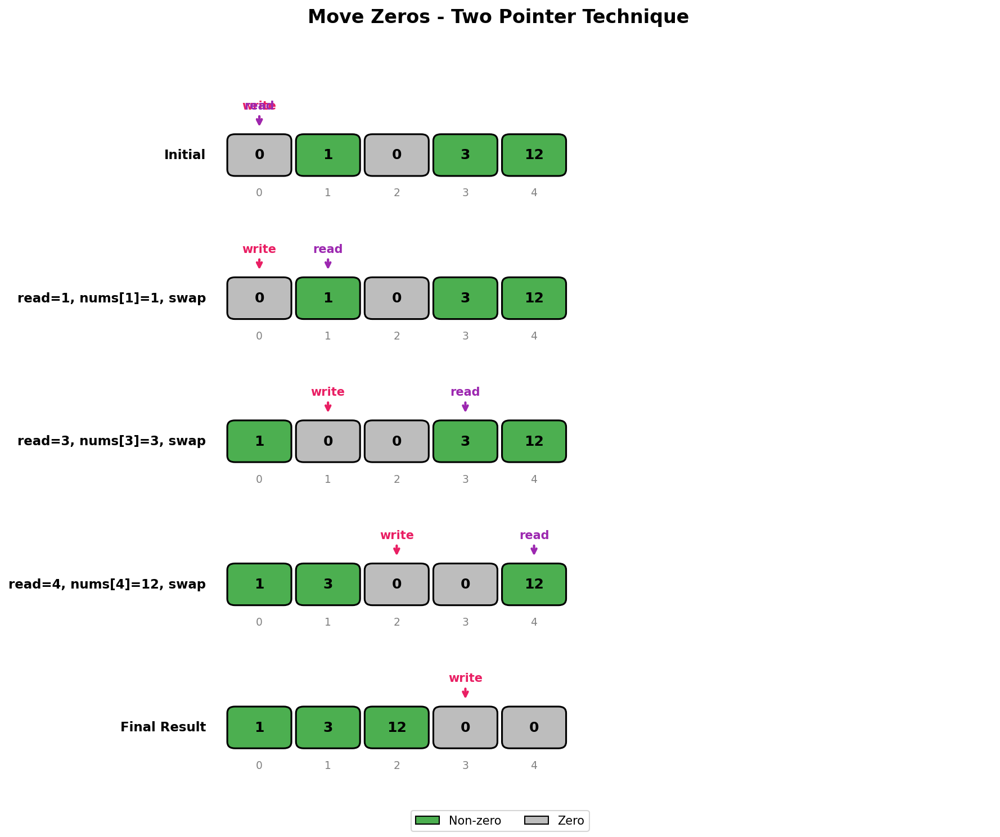
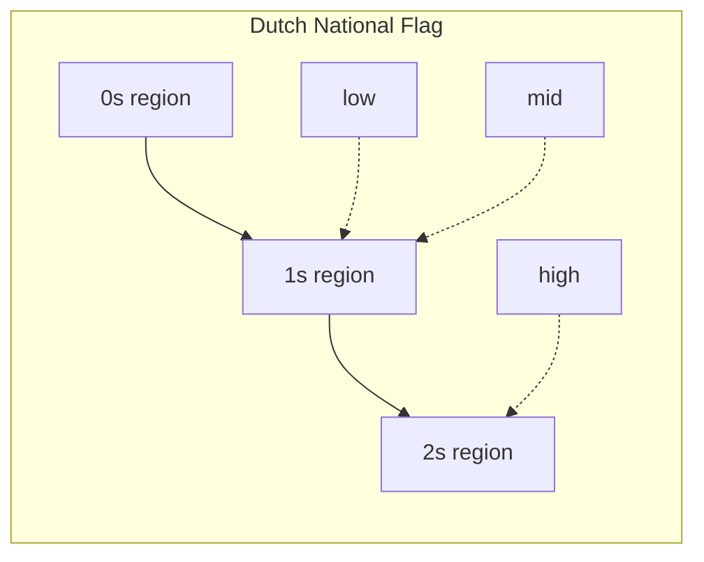

# Move Zeros

## Problem Statement

Given an integer array `nums`, move all `0`s to the end of it while maintaining the relative order of the non-zero elements.

**Note:** You must do this in-place without making a copy of the array.

## Examples

### Example 1
```
Input: nums = [0, 1, 0, 3, 12]
Output: [1, 3, 12, 0, 0]
```

### Example 2
```
Input: nums = [0]
Output: [0]
```

### Example 3
```
Input: nums = [1, 2, 3]
Output: [1, 2, 3]
```

## Visual Explanation



## Approach: Two Pointers

The key insight is to use two pointers:
- `write_ptr`: Points to the position where the next non-zero element should be placed
- `read_ptr`: Scans through the array looking for non-zero elements

### Algorithm
1. Initialize `write_ptr = 0`
2. Iterate through the array with `read_ptr`
3. When a non-zero element is found, swap it with the element at `write_ptr` and increment `write_ptr`
4. All zeros naturally bubble to the end

## Solution

```python
def moveZeroes(nums: list[int]) -> None:
    """
    Move all zeros to the end while maintaining relative order of non-zeros.
    Modifies nums in-place.

    Time Complexity: O(n)
    Space Complexity: O(1)
    """
    write_ptr = 0

    for read_ptr in range(len(nums)):
        if nums[read_ptr] != 0:
            # Swap non-zero element to the write position
            nums[write_ptr], nums[read_ptr] = nums[read_ptr], nums[write_ptr]
            write_ptr += 1
```

::: info Complexity: Time O(n) · Space O(1)
- **Time:** Single pass through the array; each element is visited exactly once with O(1) swap operation
- **Space:** In-place modification using only two pointer variables (`write_ptr`, `read_ptr`)
:::

```python
# Alternative: Two-pass approach (easier to understand)
def moveZeroes_twopass(nums: list[int]) -> None:
    """
    Two-pass solution: first move non-zeros, then fill zeros.
    """
    write_ptr = 0

    # First pass: move all non-zero elements to front
    for num in nums:
        if num != 0:
            nums[write_ptr] = num
            write_ptr += 1

    # Second pass: fill remaining positions with zeros
    while write_ptr < len(nums):
        nums[write_ptr] = 0
        write_ptr += 1
```

::: info Complexity: Time O(n) · Space O(1)
- **Time:** Two passes through the array: first pass copies non-zeros, second fills zeros; total is O(n) + O(k) where k is zero count
- **Space:** In-place modification using only a single pointer variable (`write_ptr`)
:::

## Step-by-Step Trace

For `nums = [0, 1, 0, 3, 12]`:

| Step | read_ptr | write_ptr | Action | Array State |
|------|----------|-----------|--------|-------------|
| 1 | 0 | 0 | nums[0]=0, skip | [0, 1, 0, 3, 12] |
| 2 | 1 | 0 | nums[1]=1, swap | [1, 0, 0, 3, 12] |
| 3 | 2 | 1 | nums[2]=0, skip | [1, 0, 0, 3, 12] |
| 4 | 3 | 1 | nums[3]=3, swap | [1, 3, 0, 0, 12] |
| 5 | 4 | 2 | nums[4]=12, swap | [1, 3, 12, 0, 0] |

## Complexity Analysis

| Metric | Complexity |
|--------|------------|
| **Time** | O(n) - Single pass through the array |
| **Space** | O(1) - In-place modification, only using pointers |

## Edge Cases

1. **Empty array**: `[]` -> `[]`
2. **No zeros**: `[1, 2, 3]` -> `[1, 2, 3]`
3. **All zeros**: `[0, 0, 0]` -> `[0, 0, 0]`
4. **Single element**: `[0]` -> `[0]` or `[1]` -> `[1]`
5. **Zeros at end**: `[1, 2, 0, 0]` -> `[1, 2, 0, 0]`
6. **Large array**: Handle efficiently with O(n) time

## Common Mistakes

1. **Creating a new array** - The problem requires in-place modification
2. **Not maintaining order** - Non-zero elements must keep their relative order
3. **Off-by-one errors** - Careful with pointer increments

## Related Problems

::: details Remove Element (LeetCode 27)
**Problem:** Remove all occurrences of a value in-place, return new length.

**Key Insight:** Same two-pointer pattern as Move Zeros, but filtering a specific value.

**Approach:** Write pointer advances only when current element is NOT the target value. Copy non-target elements forward.

**Complexity:** O(n) time, O(1) space
:::

::: details Remove Duplicates from Sorted Array (LeetCode 26)
**Problem:** Remove duplicates in-place from sorted array, return new length.

**Key Insight:** Since sorted, duplicates are adjacent. Write pointer tracks position for next unique element.

**Approach:** Compare current with previous written element. If different, write it and advance write pointer.

**Complexity:** O(n) time, O(1) space
:::

::: details Sort Colors (LeetCode 75)
**Problem:** Sort array with only 0s, 1s, and 2s in-place (Dutch National Flag).

**Key Insight:** Three-way partitioning with three pointers: low (0s), mid (current), high (2s).

**Approach:** If nums[mid]==0, swap with low and advance both. If nums[mid]==2, swap with high and decrement high. If nums[mid]==1, just advance mid.



**Complexity:** O(n) time, O(1) space, single pass
:::

## Key Takeaways

- Two-pointer technique is powerful for in-place array manipulation
- The "read-write" pointer pattern is common for filtering/partitioning arrays
- Swapping maintains relative order while moving elements to correct positions
