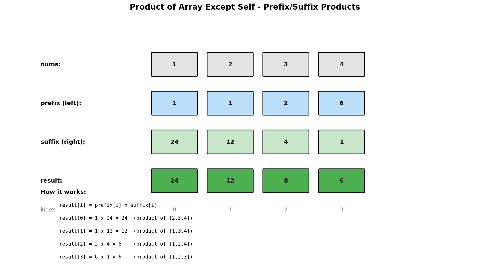

# Product of Array Except Self

## Problem Statement

Given an integer array `nums`, return an array `answer` such that `answer[i]` is equal to the product of all the elements of `nums` except `nums[i]`.

The product of any prefix or suffix of `nums` is **guaranteed** to fit in a **32-bit** integer.

You must write an algorithm that runs in **O(n)** time and **without using the division operation**.

## Examples

### Example 1
```text
Input: nums = [1, 2, 3, 4]
Output: [24, 12, 8, 6]
Explanation:
- answer[0] = 2 * 3 * 4 = 24
- answer[1] = 1 * 3 * 4 = 12
- answer[2] = 1 * 2 * 4 = 8
- answer[3] = 1 * 2 * 3 = 6
```

### Example 2
```text
Input: nums = [-1, 1, 0, -3, 3]
Output: [0, 0, 9, 0, 0]
Explanation: Only answer[2] is non-zero because it doesn't include 0.
```

## Visual Explanation



## Key Insight

For each index i:
`answer[i] = (product of nums[0..i-1]) * (product of nums[i+1..n-1])`

We can compute this in two passes:
1. **Left pass**: Build prefix products (products to the left of each index)
2. **Right pass**: Multiply by suffix products (products to the right of each index)

## Solution

::: code-group

```python [Python]
def productExceptSelf(nums: list[int]) -> list[int]:
    """
    Calculate product of all elements except self.

    Time Complexity: O(n)
    Space Complexity: O(1) - excluding output array
    """
    n = len(nums)
    answer = [1] * n

    # Left pass: answer[i] = product of all elements to the left
    prefix = 1
    for i in range(n):
        answer[i] = prefix
        prefix *= nums[i]

    # Right pass: multiply by product of all elements to the right
    suffix = 1
    for i in range(n - 1, -1, -1):
        answer[i] *= suffix
        suffix *= nums[i]

    return answer
```

```java [Java]
public int[] productExceptSelf(int[] nums) {
    int n = nums.length;
    int[] answer = new int[n];

    // Left pass: answer[i] = product of all elements to the left
    int prefix = 1;
    for (int i = 0; i < n; i++) {
        answer[i] = prefix;
        prefix *= nums[i];
    }

    // Right pass: multiply by product of all elements to the right
    int suffix = 1;
    for (int i = n - 1; i >= 0; i--) {
        answer[i] *= suffix;
        suffix *= nums[i];
    }

    return answer;
}
```

:::

::: info Complexity: Time O(n) · Space O(1)
- **Time:** Two sequential passes through the array: left-to-right builds prefixes, right-to-left multiplies suffixes
- **Space:** O(1) extra space (excluding the output array which is required); only `prefix` and `suffix` variables used
:::

```python
# Two arrays approach (easier to understand)
def productExceptSelf_twoArrays(nums: list[int]) -> list[int]:
    """
    Use separate prefix and suffix arrays.

    Time Complexity: O(n)
    Space Complexity: O(n)
    """
    n = len(nums)
    prefix = [1] * n
    suffix = [1] * n

    # Build prefix products
    for i in range(1, n):
        prefix[i] = prefix[i - 1] * nums[i - 1]

    # Build suffix products
    for i in range(n - 2, -1, -1):
        suffix[i] = suffix[i + 1] * nums[i + 1]

    # Combine
    return [prefix[i] * suffix[i] for i in range(n)]
```

::: info Complexity: Time O(n) · Space O(n)
- **Time:** Three separate O(n) passes: build prefix array, build suffix array, combine into result
- **Space:** Two auxiliary arrays of size n (`prefix` and `suffix`) plus the output array
:::

```python
# With division (not allowed by problem, but for reference)
def productExceptSelf_division(nums: list[int]) -> list[int]:
    """
    Using division - NOT ALLOWED by problem constraints.
    Also fails with zeros.
    """
    total_product = 1
    zero_count = 0

    for num in nums:
        if num == 0:
            zero_count += 1
        else:
            total_product *= num

    result = []
    for num in nums:
        if zero_count > 1:
            result.append(0)
        elif zero_count == 1:
            result.append(0 if num != 0 else total_product)
        else:
            result.append(total_product // num)

    return result
```

::: info Complexity: Time O(n) · Space O(1)
- **Time:** Two passes: first computes total product while counting zeros O(n), second builds result O(n)
- **Space:** Only constant variables (`total_product`, `zero_count`) plus the output array
:::

## Step-by-Step Trace

For `nums = [1, 2, 3, 4]`:

### Left Pass (Build Prefix Products)
| i | nums[i] | prefix (before) | answer[i] | prefix (after) |
|---|---------|-----------------|-----------|----------------|
| 0 | 1 | 1 | 1 | 1 |
| 1 | 2 | 1 | 1 | 2 |
| 2 | 3 | 2 | 2 | 6 |
| 3 | 4 | 6 | 6 | 24 |

After left pass: `answer = [1, 1, 2, 6]`

### Right Pass (Multiply by Suffix Products)
| i | nums[i] | suffix (before) | answer[i] (before) | answer[i] (after) | suffix (after) |
|---|---------|-----------------|-------------------|-------------------|----------------|
| 3 | 4 | 1 | 6 | 6 | 4 |
| 2 | 3 | 4 | 2 | 8 | 12 |
| 1 | 2 | 12 | 1 | 12 | 24 |
| 0 | 1 | 24 | 1 | 24 | 24 |

Final: `answer = [24, 12, 8, 6]`

## Complexity Analysis

| Approach | Time | Space |
|----------|------|-------|
| Optimal (single output array) | O(n) | O(1)* |
| Two arrays | O(n) | O(n) |
| Division | O(n) | O(1) |

*O(1) extra space excluding the output array

## Edge Cases

1. **Two elements**: `[2, 3]` -> `[3, 2]`
2. **Contains zero**: `[1, 0, 2]` -> `[0, 2, 0]`
3. **Multiple zeros**: `[0, 0, 1]` -> `[0, 0, 0]`
4. **All ones**: `[1, 1, 1, 1]` -> `[1, 1, 1, 1]`
5. **Negative numbers**: `[-1, 2, -3]` -> `[-6, 3, -2]`
6. **Single element**: Not valid per constraints (n >= 2)

## Handling Zeros

```text
Case 1: No zeros
  - Normal calculation works

Case 2: Exactly one zero
  - Only the position with zero has non-zero result
  - All other positions have result = 0

Case 3: Multiple zeros
  - All positions have result = 0
```

## Common Mistakes

1. **Using division** - Problem explicitly forbids it
2. **Not handling zeros** - Zeros make most products zero
3. **Wrong initialization** - Prefix/suffix start at 1, not 0
4. **Off-by-one errors** - Careful with loop bounds

## Related Problems

::: details Trapping Rain Water (LeetCode 42)
**Problem:** Calculate water trapped in elevation map.

**Key Insight:** Same prefix/suffix pattern - water at position i depends on max heights on both sides.

**Approach:** Compute maxLeft and maxRight arrays (or use two pointers). Water = min(maxLeft, maxRight) - height.

**Complexity:** O(n) time, O(1) space with two pointers
:::

::: details Maximum Product Subarray (LeetCode 152)
**Problem:** Find contiguous subarray with largest product.

**Key Insight:** Different pattern - track running product. Handle negatives by tracking both max and min.

**Approach:** Maintain maxProd and minProd at each position. Swap when encountering negative numbers.

**Complexity:** O(n) time, O(1) space
:::

::: details Subarray Product Less Than K (LeetCode 713)
**Problem:** Count subarrays where product of all elements is less than k.

**Key Insight:** Use sliding window - expand right, shrink left when product >= k.

**Approach:** Maintain window [left, right] with product < k. Each new right position adds (right - left + 1) new valid subarrays.

**Complexity:** O(n) time, O(1) space
:::

## Key Takeaways

- Prefix and suffix products are a powerful technique
- The O(1) space solution cleverly uses the output array
- This pattern of "compute from both directions" appears in many problems
- Division is tempting but fails with zeros and is disallowed here
