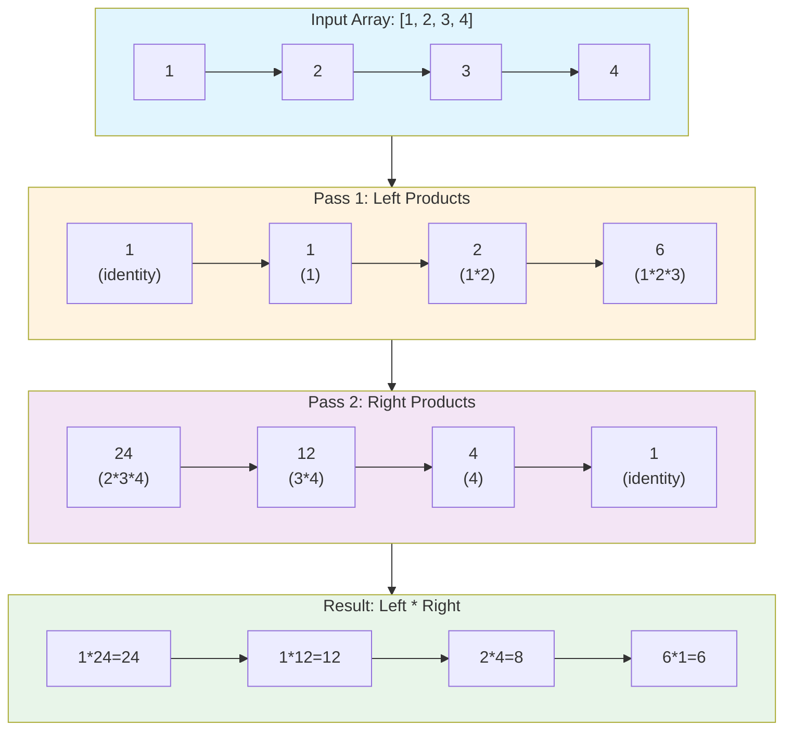
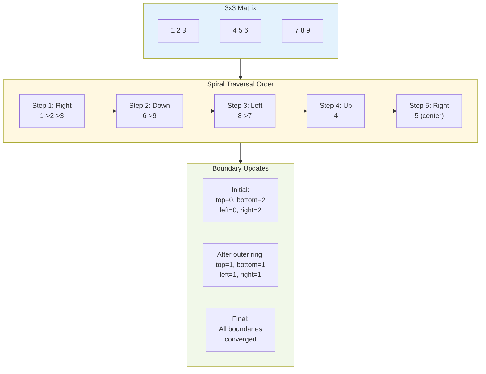
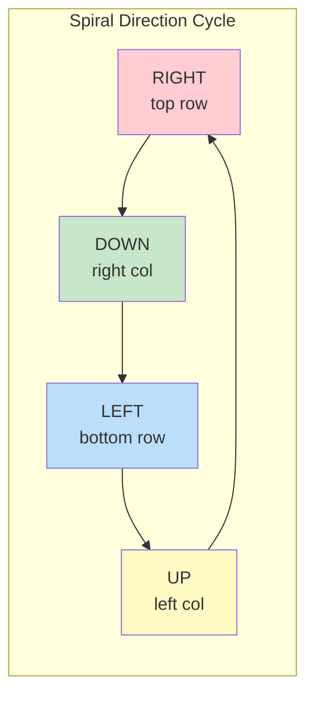

# Product of Array Except Self & Spiral Matrix

> **Array manipulation without division and 2D traversal**

These two problems are fundamental array manipulation challenges frequently asked in interviews and other top tech companies. Product of Array Except Self tests your ability to compute results with constraints (no division), while Spiral Matrix evaluates your understanding of 2D array traversal and boundary management.

---

## Product of Array Except Self

### Problem Statement

Given an integer array `nums`, return an array `answer` such that `answer[i]` is equal to the product of all the elements of `nums` except `nums[i]`.

**Constraints:**
- You must write an algorithm that runs in O(n) time
- You cannot use the division operation
- The product of any prefix or suffix of nums is guaranteed to fit in a 32-bit integer

**LeetCode:** [Problem 238 - Product of Array Except Self](https://leetcode.com/problems/product-of-array-except-self/)

### Example

```
Input: nums = [1, 2, 3, 4]
Output: [24, 12, 8, 6]

Explanation:
- answer[0] = 2 * 3 * 4 = 24 (product of all except nums[0])
- answer[1] = 1 * 3 * 4 = 12 (product of all except nums[1])
- answer[2] = 1 * 2 * 4 = 8  (product of all except nums[2])
- answer[3] = 1 * 2 * 3 = 6  (product of all except nums[3])
```

```
Input: nums = [-1, 1, 0, -3, 3]
Output: [0, 0, 9, 0, 0]
```

### Approach

**Key Insight:** For each index `i`, the product of all elements except `nums[i]` equals:
- (Product of all elements to the LEFT of i) * (Product of all elements to the RIGHT of i)

**Algorithm:**
1. **First Pass (Left to Right):** Build an array where `result[i]` contains the product of all elements to the left of index `i`
2. **Second Pass (Right to Left):** Multiply each `result[i]` by the product of all elements to the right of index `i`

This approach cleverly avoids division by computing prefix and suffix products separately.

### Mermaid Diagram



### Solution (Python)

```python
def productExceptSelf(nums: list[int]) -> list[int]:
    """
    Calculate product of array except self without using division.

    Strategy: result[i] = (product of all left elements) * (product of all right elements)

    Time: O(n), Space: O(1) excluding output array
    """
    n = len(nums)
    result = [1] * n

    # Pass 1: Calculate left products
    # result[i] = product of nums[0] * nums[1] * ... * nums[i-1]
    left_product = 1
    for i in range(n):
        result[i] = left_product
        left_product *= nums[i]

    # Pass 2: Multiply by right products
    # result[i] *= product of nums[i+1] * nums[i+2] * ... * nums[n-1]
    right_product = 1
    for i in range(n - 1, -1, -1):
        result[i] *= right_product
        right_product *= nums[i]

    return result
```

::: info Complexity: Time O(n) · Space O(1)
- **Time:** Two sequential passes through the array - first pass computes left products, second pass multiplies by right products
- **Space:** Only uses two variables (`left_product`, `right_product`) plus the output array, which is not counted per problem constraints
:::

```python
# Alternative: Using separate prefix/suffix arrays (more intuitive but O(n) space)
def productExceptSelf_verbose(nums: list[int]) -> list[int]:
    """More intuitive version with explicit prefix/suffix arrays."""
    n = len(nums)

    # prefix[i] = product of nums[0..i-1]
    prefix = [1] * n
    for i in range(1, n):
        prefix[i] = prefix[i-1] * nums[i-1]

    # suffix[i] = product of nums[i+1..n-1]
    suffix = [1] * n
    for i in range(n - 2, -1, -1):
        suffix[i] = suffix[i+1] * nums[i+1]

    # result[i] = prefix[i] * suffix[i]
    return [prefix[i] * suffix[i] for i in range(n)]
```

::: info Complexity: Time O(n) · Space O(n)
- **Time:** Three O(n) passes - building prefix array, building suffix array, and computing final result
- **Space:** Uses two additional arrays of size n (`prefix` and `suffix`) to store intermediate products
:::

### Solution (Java)

```java
class Solution {
    public int[] productExceptSelf(int[] nums) {
        int n = nums.length;
        int[] result = new int[n];

        // Initialize with 1s and build left products
        result[0] = 1;
        for (int i = 1; i < n; i++) {
            result[i] = result[i - 1] * nums[i - 1];
        }

        // Multiply by right products
        int rightProduct = 1;
        for (int i = n - 1; i >= 0; i--) {
            result[i] *= rightProduct;
            rightProduct *= nums[i];
        }

        return result;
    }
}
```

::: info Complexity: Time O(n) · Space O(1)
- **Time:** Two passes through the array - forward pass builds prefix products in result array, backward pass multiplies by suffix products
- **Space:** Only uses one additional variable (`rightProduct`) since the result array stores intermediate prefix products
:::

### Complexity

| Metric | Value | Explanation |
|--------|-------|-------------|
| **Time** | O(n) | Two passes through the array |
| **Space** | O(1) | Only using the output array (not counted per problem statement) |

### Edge Cases to Consider

1. **Array with zeros:**
   - One zero: All products except at zero's index become 0
   - Multiple zeros: All products become 0

2. **Negative numbers:** Handle normally - signs will be correct

3. **Single element:** Return [1] (empty product)

4. **Two elements:** [a, b] -> [b, a]

### Google Follow-ups

1. **What if the array contains zeros?**
   - With one zero: Only the position with zero gets a non-zero product
   - With multiple zeros: All products are zero
   - Solution handles this automatically without special cases

2. **How would you handle potential integer overflow for large products?**
   - Use `long` or `BigInteger` in Java
   - In Python, integers have arbitrary precision
   - Consider using logarithms: `log(a*b) = log(a) + log(b)`, then `exp()` at the end
   - Modular arithmetic if problem allows: keep products mod some large prime

3. **Can you do it with a single pass?**
   - Not possible to achieve O(1) space with a true single pass
   - Need at least partial information from both directions

4. **What if you could use division?**
   - Calculate total product, then divide by each element
   - Handle zeros specially (count them)
   - Time: O(n), Space: O(1)

---

## Spiral Matrix

### Problem Statement

Given an `m x n` matrix, return all elements of the matrix in spiral order.

The spiral order starts from the top-left corner and moves:
1. Right across the top row
2. Down the right column
3. Left across the bottom row
4. Up the left column
5. Repeat inward until all elements are visited

**LeetCode:** [Problem 54 - Spiral Matrix](https://leetcode.com/problems/spiral-matrix/)

### Example

```
Input: matrix = [[1,2,3],
                 [4,5,6],
                 [7,8,9]]
Output: [1,2,3,6,9,8,7,4,5]

Traversal visualization:
1 -> 2 -> 3
          |
          v
4 -> 5    6
^         |
|         v
7 <- 8 <- 9
```

```
Input: matrix = [[1,2,3,4],
                 [5,6,7,8],
                 [9,10,11,12]]
Output: [1,2,3,4,8,12,11,10,9,5,6,7]
```

### Approach

**Layer-by-Layer (Boundary) Method:**

Think of the matrix as concentric rectangular layers. We peel off each layer by traversing its four sides, then shrink the boundaries inward.

**Four Boundaries:**
- `top`: The topmost unvisited row
- `bottom`: The bottommost unvisited row
- `left`: The leftmost unvisited column
- `right`: The rightmost unvisited column

**Algorithm:**
1. Traverse right along `top` row, then increment `top`
2. Traverse down along `right` column, then decrement `right`
3. Traverse left along `bottom` row (if `top <= bottom`), then decrement `bottom`
4. Traverse up along `left` column (if `left <= right`), then increment `left`
5. Repeat until all elements are visited

### Mermaid Diagram





### Solution (Python)

```python
def spiralOrder(matrix: list[list[int]]) -> list[int]:
    """
    Return all elements of matrix in spiral order.

    Strategy: Use four boundaries (top, bottom, left, right) and
    traverse in a spiral pattern, shrinking boundaries after each direction.

    Time: O(m*n), Space: O(1) excluding output
    """
    if not matrix or not matrix[0]:
        return []

    result = []
    top, bottom = 0, len(matrix) - 1
    left, right = 0, len(matrix[0]) - 1

    while top <= bottom and left <= right:
        # Traverse RIGHT along top row
        for col in range(left, right + 1):
            result.append(matrix[top][col])
        top += 1

        # Traverse DOWN along right column
        for row in range(top, bottom + 1):
            result.append(matrix[row][right])
        right -= 1

        # Traverse LEFT along bottom row (if rows remain)
        if top <= bottom:
            for col in range(right, left - 1, -1):
                result.append(matrix[bottom][col])
            bottom -= 1

        # Traverse UP along left column (if columns remain)
        if left <= right:
            for row in range(bottom, top - 1, -1):
                result.append(matrix[row][left])
            left += 1

    return result
```

::: info Complexity: Time O(m * n) · Space O(1)
- **Time:** Each of the m*n matrix elements is visited exactly once during the spiral traversal
- **Space:** Only uses four boundary variables (`top`, `bottom`, `left`, `right`) - the output list is not counted as auxiliary space
:::

```python
# Alternative: Direction-based simulation
def spiralOrder_simulation(matrix: list[list[int]]) -> list[int]:
    """Alternative approach using direction vectors and visited tracking."""
    if not matrix:
        return []

    m, n = len(matrix), len(matrix[0])
    visited = [[False] * n for _ in range(m)]

    # Direction vectors: right, down, left, up
    dr = [0, 1, 0, -1]
    dc = [1, 0, -1, 0]

    result = []
    r, c, d = 0, 0, 0  # row, col, direction

    for _ in range(m * n):
        result.append(matrix[r][c])
        visited[r][c] = True

        # Try to continue in current direction
        nr, nc = r + dr[d], c + dc[d]

        # If can't continue, change direction
        if not (0 <= nr < m and 0 <= nc < n and not visited[nr][nc]):
            d = (d + 1) % 4
            nr, nc = r + dr[d], c + dc[d]

        r, c = nr, nc

    return result
```

::: info Complexity: Time O(m * n) · Space O(m * n)
- **Time:** Visits each cell exactly once using direction vectors to simulate spiral movement
- **Space:** Creates an m*n `visited` matrix to track which cells have been processed
:::

### Solution (Java)

```java
class Solution {
    public List<Integer> spiralOrder(int[][] matrix) {
        List<Integer> result = new ArrayList<>();
        if (matrix == null || matrix.length == 0) {
            return result;
        }

        int top = 0, bottom = matrix.length - 1;
        int left = 0, right = matrix[0].length - 1;

        while (top <= bottom && left <= right) {
            // Traverse right
            for (int col = left; col <= right; col++) {
                result.add(matrix[top][col]);
            }
            top++;

            // Traverse down
            for (int row = top; row <= bottom; row++) {
                result.add(matrix[row][right]);
            }
            right--;

            // Traverse left (if rows remain)
            if (top <= bottom) {
                for (int col = right; col >= left; col--) {
                    result.add(matrix[bottom][col]);
                }
                bottom--;
            }

            // Traverse up (if columns remain)
            if (left <= right) {
                for (int row = bottom; row >= top; row--) {
                    result.add(matrix[row][left]);
                }
                left++;
            }
        }

        return result;
    }
}
```

::: info Complexity: Time O(m * n) · Space O(1)
- **Time:** Visits each of the m*n matrix elements exactly once while traversing in spiral order
- **Space:** Only uses four integer boundary variables - no additional data structures proportional to input size
:::

### Complexity

| Metric | Value | Explanation |
|--------|-------|-------------|
| **Time** | O(m * n) | Visit each element exactly once |
| **Space** | O(1) | Only boundary variables (output not counted) |

### Edge Cases to Consider

1. **Empty matrix:** Return empty list
2. **Single row:** `[[1,2,3]]` -> `[1,2,3]`
3. **Single column:** `[[1],[2],[3]]` -> `[1,2,3]`
4. **Single element:** `[[5]]` -> `[5]`
5. **Non-square matrix:** Handle m != n correctly

### Google Follow-ups

1. **Generate a spiral matrix from 1 to n^2 (Spiral Matrix II)**
   ```python
   def generateMatrix(n: int) -> list[list[int]]:
       matrix = [[0] * n for _ in range(n)]
       top, bottom, left, right = 0, n - 1, 0, n - 1
       num = 1

       while top <= bottom and left <= right:
           for col in range(left, right + 1):
               matrix[top][col] = num
               num += 1
           top += 1

           for row in range(top, bottom + 1):
               matrix[row][right] = num
               num += 1
           right -= 1

           for col in range(right, left - 1, -1):
               matrix[bottom][col] = num
               num += 1
           bottom -= 1

           for row in range(bottom, top - 1, -1):
               matrix[row][left] = num
               num += 1
           left += 1

       return matrix
   ```

   ::: info Complexity: Time O(n^2) · Space O(1)
   - **Time:** Four traversals (right, down, left, up) per layer, visiting each cell once across all n^2 cells
   - **Space:** Only uses boundary variables and a counter - matrix is filled in-place
   :::

2. **Rotate matrix 90 degrees clockwise**
   ```python
   def rotate(matrix: list[list[int]]) -> None:
       n = len(matrix)
       # Transpose
       for i in range(n):
           for j in range(i + 1, n):
               matrix[i][j], matrix[j][i] = matrix[j][i], matrix[i][j]
       # Reverse each row
       for row in matrix:
           row.reverse()
   ```

   ::: info Complexity: Time O(n^2) · Space O(1)
   - **Time:** Transpose requires O(n^2) swaps visiting each upper-triangular element, plus O(n^2) for reversing all rows
   - **Space:** In-place rotation using only temporary swap variables
   :::

3. **Spiral Matrix III: Start from given position and spiral outward**
   - Track direction changes and step counts
   - Steps increase: 1,1,2,2,3,3,4,4...

4. **Anti-clockwise spiral traversal**
   - Change order: down first, then right, up, left
   - Or simply reverse the result of clockwise traversal

---

## Comparison of Both Problems

| Aspect | Product of Array Except Self | Spiral Matrix |
|--------|------------------------------|---------------|
| **Pattern** | Prefix/Suffix computation | Boundary shrinking |
| **Key Insight** | Split problem into left/right | Layer-by-layer traversal |
| **Main Challenge** | Avoiding division | Handling edge cases |
| **Common Mistake** | Forgetting to multiply (not add) | Off-by-one in boundaries |
| **Space Optimization** | Use output array for prefix | Only need boundary variables |

---

## Past Interview Reference

These problems are commonly asked in technical interviews because they test:

1. **Product of Array Except Self:**
   - Ability to work within constraints (no division)
   - Understanding of prefix/suffix patterns
   - Space optimization techniques
   - Edge case handling (zeros)

2. **Spiral Matrix:**
   - 2D array manipulation skills
   - Careful boundary management
   - Loop invariant maintenance
   - Direction handling in grid problems

**Interview Tips:**
- Always clarify constraints before coding
- Walk through examples to verify understanding
- Consider edge cases (empty input, single element)
- Discuss time/space tradeoffs
- Mention potential follow-up variations

---

## Sources

- [LeetCode 238 - Product of Array Except Self](https://leetcode.com/problems/product-of-array-except-self/)
- [Product of Array Except Self - AlgoMap](https://algomap.io/problems/product-of-array-except-self)
- [Product of Array Except Self - In-Depth Explanation (Algo.Monster)](https://algo.monster/liteproblems/238)
- [Product of Array Except Self - GeeksforGeeks](https://www.geeksforgeeks.org/dsa/a-product-array-puzzle/)
- [LeetCode 54 - Spiral Matrix](https://leetcode.com/problems/spiral-matrix/)
- [Spiral Matrix - AlgoMap](https://algomap.io/problems/spiral-matrix)
- [Spiral Matrix - In-Depth Explanation (Algo.Monster)](https://algo.monster/liteproblems/54)
- [Mastering the Spiral Matrix Problem - Medium](https://medium.com/@yaduvanshineelam09/mastering-the-spiral-matrix-problem-on-leetcode-3be6bd897f27)
