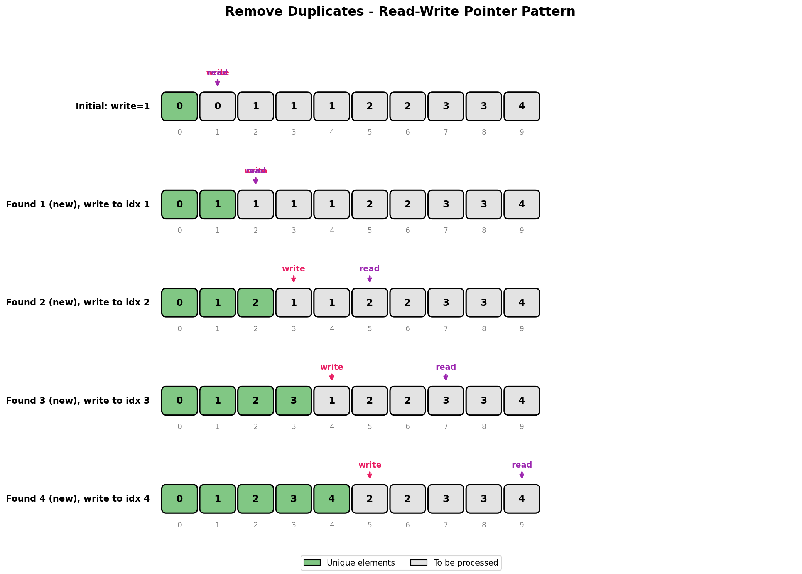

# Remove Duplicates from Sorted Array

## Problem Statement

Given an integer array `nums` sorted in **non-decreasing order**, remove the duplicates **in-place** such that each unique element appears only **once**. The **relative order** of the elements should be kept the same.

Return the number of unique elements in `nums`.

**Note:** You must modify the array in-place with O(1) extra memory.

## Examples

### Example 1
```text
Input: nums = [1, 1, 2]
Output: 2, nums = [1, 2, _]
Explanation: Your function should return k = 2, with the first two elements
of nums being 1 and 2 respectively. It does not matter what you leave beyond
the returned k (hence they are underscores).
```

### Example 2
```text
Input: nums = [0, 0, 1, 1, 1, 2, 2, 3, 3, 4]
Output: 5, nums = [0, 1, 2, 3, 4, _, _, _, _, _]
Explanation: Your function should return k = 5, with the first five elements
of nums being 0, 1, 2, 3, and 4 respectively.
```

## Visual Explanation



## Approach: Two Pointers

Since the array is sorted, duplicates are adjacent. We use:
- `write_ptr`: Position to write the next unique element
- `read_ptr`: Scans through to find new unique elements

### Algorithm
1. If array is empty, return 0
2. Initialize `write_ptr = 1` (first element is always unique)
3. For each `read_ptr` from 1 to n-1:
   - If `nums[read_ptr] != nums[write_ptr - 1]`, it's a new unique element
   - Write it to `write_ptr` and increment `write_ptr`
4. Return `write_ptr` as the count of unique elements

## Solution

```python
def removeDuplicates(nums: list[int]) -> int:
    """
    Remove duplicates from sorted array in-place.
    Returns the number of unique elements.

    Time Complexity: O(n)
    Space Complexity: O(1)
    """
    if not nums:
        return 0

    write_ptr = 1  # First element is always unique

    for read_ptr in range(1, len(nums)):
        # Found a new unique element
        if nums[read_ptr] != nums[write_ptr - 1]:
            nums[write_ptr] = nums[read_ptr]
            write_ptr += 1

    return write_ptr
```

::: info Complexity: Time O(n) · Space O(1)
- **Time:** Single pass through the array with the read pointer, each element is examined exactly once
- **Space:** Only uses two pointer variables (`write_ptr`, `read_ptr`) regardless of array size
:::

```python
# Variation: Allow at most K duplicates
def removeDuplicates_k(nums: list[int], k: int = 2) -> int:
    """
    Remove duplicates allowing at most k occurrences of each element.

    Time Complexity: O(n)
    Space Complexity: O(1)
    """
    if len(nums) <= k:
        return len(nums)

    write_ptr = k

    for read_ptr in range(k, len(nums)):
        # Compare with element k positions back
        if nums[read_ptr] != nums[write_ptr - k]:
            nums[write_ptr] = nums[read_ptr]
            write_ptr += 1

    return write_ptr
```

::: info Complexity: Time O(n) · Space O(1)
- **Time:** Single pass through the array starting from index k, comparing each element with the one k positions back
- **Space:** Only uses constant extra space for two pointers - modifies the array in-place
:::

## Step-by-Step Trace

For `nums = [0, 0, 1, 1, 1, 2, 2, 3, 3, 4]`:

| read_ptr | nums[read_ptr] | nums[write_ptr-1] | Action | write_ptr |
|----------|----------------|-------------------|--------|-----------|
| 1 | 0 | 0 | Skip (duplicate) | 1 |
| 2 | 1 | 0 | Write, increment | 2 |
| 3 | 1 | 1 | Skip (duplicate) | 2 |
| 4 | 1 | 1 | Skip (duplicate) | 2 |
| 5 | 2 | 1 | Write, increment | 3 |
| 6 | 2 | 2 | Skip (duplicate) | 3 |
| 7 | 3 | 2 | Write, increment | 4 |
| 8 | 3 | 3 | Skip (duplicate) | 4 |
| 9 | 4 | 3 | Write, increment | 5 |

**Result:** `k = 5`, `nums = [0, 1, 2, 3, 4, ...]`

## Complexity Analysis

| Metric | Complexity |
|--------|------------|
| **Time** | O(n) - Single pass through the array |
| **Space** | O(1) - Only using constant extra space for pointers |

## Edge Cases

1. **Empty array**: `[]` -> Return 0
2. **Single element**: `[1]` -> Return 1
3. **All same elements**: `[1, 1, 1, 1]` -> Return 1, `nums = [1, ...]`
4. **No duplicates**: `[1, 2, 3, 4]` -> Return 4, array unchanged
5. **Two elements, same**: `[1, 1]` -> Return 1
6. **Two elements, different**: `[1, 2]` -> Return 2

## Common Mistakes

1. **Starting write_ptr at 0** - Should start at 1 since first element is always kept
2. **Comparing wrong elements** - Compare current with last written, not previous read
3. **Forgetting empty array check** - Handle edge case first
4. **Not understanding "in-place"** - No new array creation allowed

## Related Problems

::: details Remove Element (LeetCode 27)
**Problem:** Remove all instances of a specific value from array in-place.

**Key Insight:** Similar two-pointer approach, but check against target value instead of previous element.

**Approach:** Write pointer copies elements that don't match target. Return write pointer as new length.

**Complexity:** O(n) time, O(1) space
:::

::: details Move Zeroes (LeetCode 283)
**Problem:** Move all zeros to end while maintaining relative order of non-zeros.

**Key Insight:** Same read-write pointer pattern, filtering zeros specifically.

**Approach:** Write pointer tracks position for next non-zero. Swap non-zeros to write position.

**Complexity:** O(n) time, O(1) space
:::

::: details Remove Duplicates from Sorted Array II (LeetCode 80)
**Problem:** Remove duplicates allowing at most 2 occurrences of each element.

**Key Insight:** Generalize pattern by comparing with element k positions back instead of 1.

**Approach:** Compare nums[read] with nums[write - k]. If different, write and advance. Works for any k.

**Complexity:** O(n) time, O(1) space
:::

## Key Takeaways

- The "read-write pointer" pattern is essential for in-place array modification
- Sorted arrays simplify duplicate detection (they're adjacent)
- The variation with k duplicates uses the same pattern with minor modification
- Return value and array modification are both important parts of the solution
