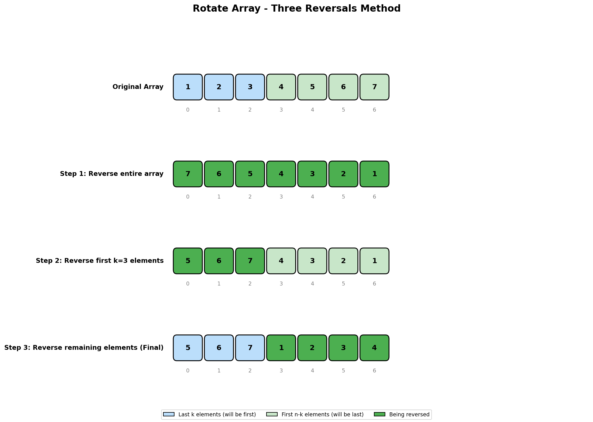
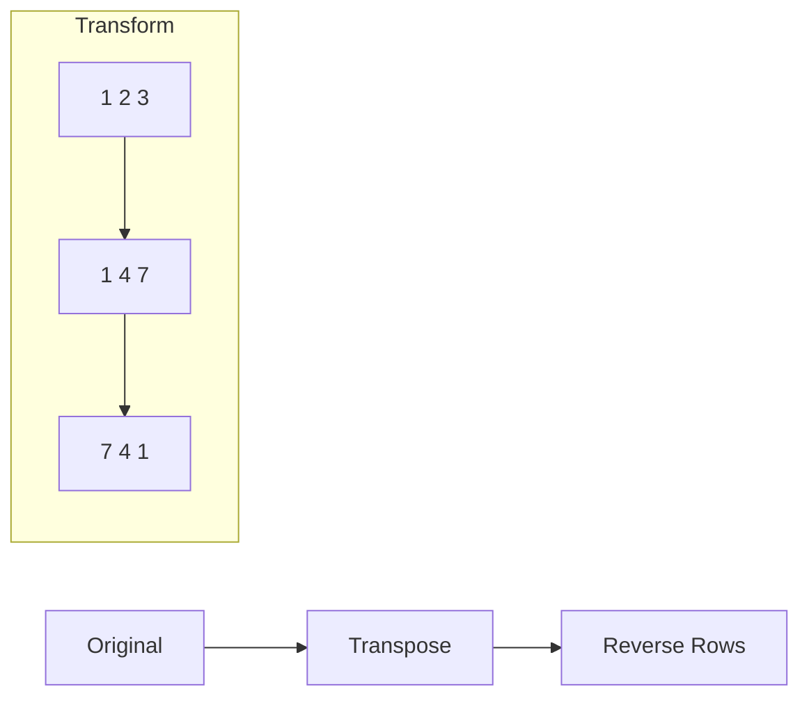

# Rotate Array

## Problem Statement

Given an integer array `nums`, rotate the array to the right by `k` steps, where `k` is non-negative.

**Follow up:**
- Try to come up with as many solutions as you can. There are at least three different ways to solve this problem.
- Could you do it in-place with O(1) extra space?

## Examples

### Example 1
```text
Input: nums = [1, 2, 3, 4, 5, 6, 7], k = 3
Output: [5, 6, 7, 1, 2, 3, 4]
Explanation:
rotate 1 step to the right: [7, 1, 2, 3, 4, 5, 6]
rotate 2 step to the right: [6, 7, 1, 2, 3, 4, 5]
rotate 3 steps to the right: [5, 6, 7, 1, 2, 3, 4]
```

### Example 2
```text
Input: nums = [-1, -100, 3, 99], k = 2
Output: [3, 99, -1, -100]
Explanation:
rotate 1 step to the right: [99, -1, -100, 3]
rotate 2 steps to the right: [3, 99, -1, -100]
```

## Visual Explanation



## Multiple Approaches

### Approach 1: Three Reversals (Optimal)
- Reverse entire array
- Reverse first k elements
- Reverse remaining elements
- O(n) time, O(1) space

### Approach 2: Extra Array
- Create new array with rotated elements
- O(n) time, O(n) space

### Approach 3: Cyclic Replacements
- Move elements in cycles
- O(n) time, O(1) space

## Solution

::: code-group

```python [Python]
def rotate(nums: list[int], k: int) -> None:
    """
    Rotate array right by k steps using three reversals.

    Time Complexity: O(n)
    Space Complexity: O(1)
    """
    n = len(nums)
    k = k % n  # Handle k >= n

    def reverse(start: int, end: int) -> None:
        while start < end:
            nums[start], nums[end] = nums[end], nums[start]
            start += 1
            end -= 1

    # Three reversals
    reverse(0, n - 1)      # Reverse entire array
    reverse(0, k - 1)      # Reverse first k elements
    reverse(k, n - 1)      # Reverse remaining elements
```

```java [Java]
public void rotate(int[] nums, int k) {
    int n = nums.length;
    k = k % n;  // Handle k >= n

    reverse(nums, 0, n - 1);   // Reverse entire array
    reverse(nums, 0, k - 1);   // Reverse first k elements
    reverse(nums, k, n - 1);   // Reverse remaining elements
}

private void reverse(int[] nums, int start, int end) {
    while (start < end) {
        int tmp = nums[start];
        nums[start] = nums[end];
        nums[end] = tmp;
        start++;
        end--;
    }
}
```

:::

::: info Complexity: Time O(n) · Space O(1)
- **Time:** Three reversal operations, each visiting a subset of elements - total of 2n element swaps across all reversals
- **Space:** In-place reversal using only swap operations with no additional arrays
:::

```python
# Extra array approach
def rotate_extra_array(nums: list[int], k: int) -> None:
    """
    Use extra array.

    Time Complexity: O(n)
    Space Complexity: O(n)
    """
    n = len(nums)
    k = k % n
    rotated = nums[-k:] + nums[:-k]
    nums[:] = rotated  # Copy back to original
```

::: info Complexity: Time O(n) · Space O(n)
- **Time:** Slicing creates a new list in O(n), then copying back to original in O(n)
- **Space:** Creates a temporary array of size n to hold the rotated elements before copying back
:::

```python
# Cyclic replacements approach
def rotate_cyclic(nums: list[int], k: int) -> None:
    """
    Use cyclic replacements.

    Time Complexity: O(n)
    Space Complexity: O(1)
    """
    n = len(nums)
    k = k % n
    count = 0  # Number of elements placed

    start = 0
    while count < n:
        current = start
        prev = nums[start]

        while True:
            next_idx = (current + k) % n
            nums[next_idx], prev = prev, nums[next_idx]
            current = next_idx
            count += 1

            if current == start:
                break

        start += 1
```

::: info Complexity: Time O(n) · Space O(1)
- **Time:** Each element is moved exactly once to its final position, resulting in exactly n placements
- **Space:** Only uses a constant number of variables (`start`, `current`, `prev`, `count`) for tracking cycle state
:::

```python
# Python one-liner (creates new list)
def rotate_pythonic(nums: list[int], k: int) -> None:
    """
    Pythonic approach using slicing.
    """
    k = k % len(nums)
    nums[:] = nums[-k:] + nums[:-k]
```

::: info Complexity: Time O(n) · Space O(n)
- **Time:** Slicing operations `nums[-k:]` and `nums[:-k]` each take O(n), concatenation takes O(n)
- **Space:** Creates two temporary slices and a new concatenated list before assigning back
:::

## Step-by-Step Trace (Three Reversals)

For `nums = [1, 2, 3, 4, 5, 6, 7]`, `k = 3`:

```text
n = 7, k = 3

Step 1: reverse(0, 6) - Reverse entire array
Before: [1, 2, 3, 4, 5, 6, 7]
After:  [7, 6, 5, 4, 3, 2, 1]

Step 2: reverse(0, 2) - Reverse first 3 elements
Before: [7, 6, 5, 4, 3, 2, 1]
After:  [5, 6, 7, 4, 3, 2, 1]

Step 3: reverse(3, 6) - Reverse last 4 elements
Before: [5, 6, 7, 4, 3, 2, 1]
After:  [5, 6, 7, 1, 2, 3, 4]

Result: [5, 6, 7, 1, 2, 3, 4] ✓
```

## Cyclic Replacements Trace

For `nums = [1, 2, 3, 4, 5, 6]`, `k = 2`:

```text
Cycle starting at index 0:
  0 -> 2 -> 4 -> 0 (back to start)
  Move: 1 to index 2, 3 to index 4, 5 to index 0

  [1,2,3,4,5,6] -> [5,2,1,4,3,6]

Cycle starting at index 1:
  1 -> 3 -> 5 -> 1 (back to start)
  Move: 2 to index 3, 4 to index 5, 6 to index 1

  [5,2,1,4,3,6] -> [5,6,1,2,3,4]

Result: [5, 6, 1, 2, 3, 4] ✓
```

## Complexity Analysis

| Approach | Time | Space | Notes |
|----------|------|-------|-------|
| Three Reversals | O(n) | O(1) | Best for in-place |
| Extra Array | O(n) | O(n) | Simple but uses space |
| Cyclic Replacements | O(n) | O(1) | Tricky to implement |

## Edge Cases

1. **k = 0**: No rotation needed
2. **k = n**: Same as k = 0 (full rotation)
3. **k > n**: Use k = k % n
4. **Single element**: `[1]`, k = 5 -> `[1]`
5. **Two elements**: `[1, 2]`, k = 1 -> `[2, 1]`
6. **All same elements**: `[1, 1, 1]`, k = 2 -> `[1, 1, 1]`

## Left vs Right Rotation

```python
# Right rotation by k = Left rotation by (n - k)
def rotate_left(nums: list[int], k: int) -> None:
    """Rotate left by k steps."""
    n = len(nums)
    k = k % n

    def reverse(start, end):
        while start < end:
            nums[start], nums[end] = nums[end], nums[start]
            start += 1
            end -= 1

    reverse(0, k - 1)      # Reverse first k
    reverse(k, n - 1)      # Reverse rest
    reverse(0, n - 1)      # Reverse all
```

::: info Complexity: Time O(n) · Space O(1)
- **Time:** Three reversal operations, each processing a portion of the array - total 2n element swaps
- **Space:** In-place modification using only swap operations within the reverse helper function
:::

## Common Mistakes

1. **Forgetting k % n** - k can be larger than array length
2. **Modifying during iteration** - Cyclic approach needs careful tracking
3. **Off-by-one in reverse** - End index is inclusive
4. **Confusing left and right rotation** - Right rotation moves elements toward higher indices

## Related Problems

::: details Rotate String (LeetCode 796)
**Problem:** Check if string s can become goal after some rotations.

**Key Insight:** s rotated is always a substring of s + s.

**Approach:** Check if goal is substring of (s + s) and lengths are equal.

**Complexity:** O(n) time, O(n) space
:::

::: details Rotate List (LeetCode 61)
**Problem:** Rotate linked list to the right by k places.

**Key Insight:** Connect tail to head (make circular), then cut at appropriate position.

**Approach:** Find length, connect tail to head. New tail is at (length - k % length) from head. Cut there.

**Complexity:** O(n) time, O(1) space
:::

::: details Rotate Image (LeetCode 48)
**Problem:** Rotate n x n matrix 90 degrees clockwise in-place.

**Key Insight:** Rotation = transpose + reverse each row. Or rotate four cells at a time.

**Approach:** First transpose matrix (swap [i][j] with [j][i]), then reverse each row.



**Complexity:** O(n^2) time, O(1) space
:::

## Key Takeaways

- The **three reversals** method is elegant and O(1) space
- Always handle k >= n by taking k % n
- The reversal approach works because `reverse(reverse(A) + reverse(B)) = B + A`
- Cyclic replacement is theoretically interesting but harder to implement correctly
- Python's slicing makes this trivial but uses O(n) space
