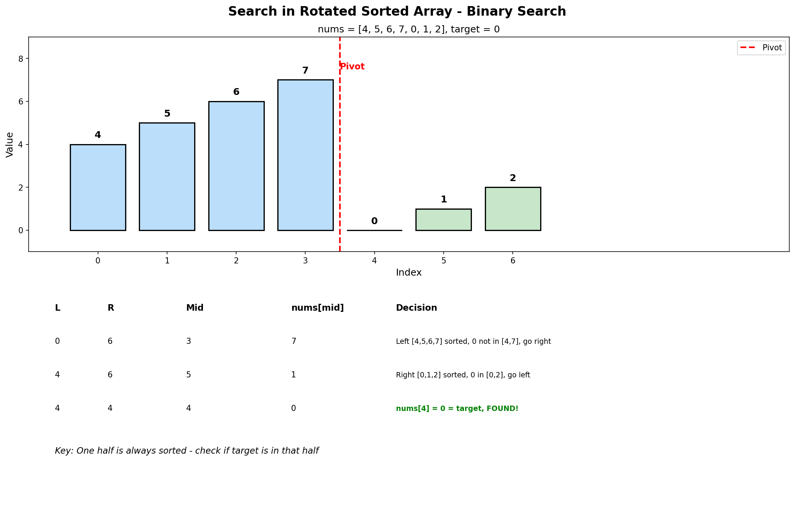

# Search in Rotated Sorted Array

## Problem Statement

There is an integer array `nums` sorted in ascending order (with **distinct** values).

Prior to being passed to your function, `nums` is **possibly rotated** at an unknown pivot index `k` (1 <= k < nums.length) such that the resulting array is `[nums[k], nums[k+1], ..., nums[n-1], nums[0], nums[1], ..., nums[k-1]]` (0-indexed).

Given the array `nums` **after** the possible rotation and an integer `target`, return the index of `target` if it is in `nums`, or `-1` if it is not in `nums`.

You must write an algorithm with **O(log n)** runtime complexity.

## Examples

### Example 1
```text
Input: nums = [4, 5, 6, 7, 0, 1, 2], target = 0
Output: 4
```

### Example 2
```text
Input: nums = [4, 5, 6, 7, 0, 1, 2], target = 3
Output: -1
```

### Example 3
```text
Input: nums = [1], target = 0
Output: -1
```

## Visual Explanation



## Key Insight

In a rotated sorted array:
1. **At least one half is always sorted** after splitting at mid
2. We can easily check if target lies within a sorted range
3. Use this to decide which half to search

How to determine which half is sorted:
- If `nums[left] <= nums[mid]`: left half is sorted
- Otherwise: right half is sorted

## Solution

```python
def search(nums: list[int], target: int) -> int:
    """
    Search in rotated sorted array using binary search.

    Time Complexity: O(log n)
    Space Complexity: O(1)
    """
    left, right = 0, len(nums) - 1

    while left <= right:
        mid = (left + right) // 2

        if nums[mid] == target:
            return mid

        # Determine which half is sorted
        if nums[left] <= nums[mid]:
            # Left half is sorted
            if nums[left] <= target < nums[mid]:
                # Target is in the sorted left half
                right = mid - 1
            else:
                # Target is in the right half
                left = mid + 1
        else:
            # Right half is sorted
            if nums[mid] < target <= nums[right]:
                # Target is in the sorted right half
                left = mid + 1
            else:
                # Target is in the left half
                right = mid - 1

    return -1
```

::: info Complexity: Time O(log n) · Space O(1)
- **Time:** Binary search halves the search space each iteration - at most log(n) comparisons needed
- **Space:** Only uses three pointer variables (`left`, `right`, `mid`) with no recursion or auxiliary data structures
:::

```python
# Alternative: Find pivot first, then binary search
def search_two_step(nums: list[int], target: int) -> int:
    """
    Step 1: Find the pivot (smallest element)
    Step 2: Binary search in the appropriate half
    """
    def find_pivot() -> int:
        left, right = 0, len(nums) - 1

        while left < right:
            mid = (left + right) // 2
            if nums[mid] > nums[right]:
                left = mid + 1
            else:
                right = mid

        return left

    def binary_search(left: int, right: int) -> int:
        while left <= right:
            mid = (left + right) // 2
            if nums[mid] == target:
                return mid
            elif nums[mid] < target:
                left = mid + 1
            else:
                right = mid - 1
        return -1

    n = len(nums)
    pivot = find_pivot()

    # Determine which half to search
    if target >= nums[pivot] and target <= nums[n - 1]:
        return binary_search(pivot, n - 1)
    else:
        return binary_search(0, pivot - 1)
```

::: info Complexity: Time O(log n) · Space O(1)
- **Time:** Two binary searches - O(log n) to find pivot, O(log n) to search in the appropriate half
- **Space:** Constant space using only pointer variables in both helper functions
:::

## Step-by-Step Trace

For `nums = [4, 5, 6, 7, 0, 1, 2]`, `target = 0`:

| Step | left | right | mid | nums[mid] | Sorted Half | Target Range? | Action |
|------|------|-------|-----|-----------|-------------|---------------|--------|
| 1 | 0 | 6 | 3 | 7 | Left [4,5,6,7] | 0 not in [4,7) | left = 4 |
| 2 | 4 | 6 | 5 | 1 | Right [0,1,2] | 0 not in (1,2] | right = 4 |
| 3 | 4 | 4 | 4 | 0 | Found! | - | return 4 |

**Result:** Index 4

## Decision Tree

```text
At each step:
1. Is nums[mid] == target? -> Return mid

2. Is left half sorted? (nums[left] <= nums[mid])
   YES -> Is target in [nums[left], nums[mid])?
          YES -> Search left (right = mid - 1)
          NO  -> Search right (left = mid + 1)
   NO  -> Right half is sorted
          Is target in (nums[mid], nums[right]]?
          YES -> Search right (left = mid + 1)
          NO  -> Search left (right = mid - 1)
```

## Complexity Analysis

| Metric | Complexity |
|--------|------------|
| **Time** | O(log n) - Binary search |
| **Space** | O(1) - Constant extra space |

## Edge Cases

1. **Single element**: `[1]`, target = 1 -> Return 0
2. **Not rotated**: `[1, 2, 3, 4, 5]` - Works as normal binary search
3. **Fully rotated**: Same as not rotated
4. **Target not found**: Return -1
5. **Target at pivot**: `[4, 5, 1, 2, 3]`, target = 1 -> Return 2
6. **Target at ends**: Check both boundaries work

## Variations

### Search in Rotated Sorted Array II (with duplicates)
```python
def search_with_duplicates(nums: list[int], target: int) -> bool:
    """
    Handle arrays with duplicate elements.
    Worst case: O(n) when all elements are same except one.
    """
    left, right = 0, len(nums) - 1

    while left <= right:
        mid = (left + right) // 2

        if nums[mid] == target:
            return True

        # Handle duplicates: can't determine sorted half
        if nums[left] == nums[mid] == nums[right]:
            left += 1
            right -= 1
        elif nums[left] <= nums[mid]:
            # Left half is sorted
            if nums[left] <= target < nums[mid]:
                right = mid - 1
            else:
                left = mid + 1
        else:
            # Right half is sorted
            if nums[mid] < target <= nums[right]:
                left = mid + 1
            else:
                right = mid - 1

    return False
```

::: info Complexity: Time O(log n) average, O(n) worst case · Space O(1)
- **Time:** Usually O(log n), but degrades to O(n) when many duplicates exist (e.g., `[1,1,1,1,1,0,1,1]`) requiring linear shrinking
- **Space:** Only constant pointer variables used regardless of duplicates
:::

### Find Minimum in Rotated Sorted Array
```python
def findMin(nums: list[int]) -> int:
    """
    Find the minimum element (pivot point).
    """
    left, right = 0, len(nums) - 1

    while left < right:
        mid = (left + right) // 2

        if nums[mid] > nums[right]:
            # Minimum is in right half
            left = mid + 1
        else:
            # Minimum is at mid or in left half
            right = mid

    return nums[left]
```

::: info Complexity: Time O(log n) · Space O(1)
- **Time:** Binary search converges to the minimum element, halving search space each iteration
- **Space:** Only uses two pointer variables for the search bounds
:::

### Find Rotation Count
```python
def findRotationCount(nums: list[int]) -> int:
    """
    Find how many times array was rotated.
    This is the same as finding index of minimum element.
    """
    return findMin_index(nums)
```

## Common Mistakes

1. **Wrong comparison for sorted half** - Use `<=` not `<` for `nums[left] <= nums[mid]`
2. **Incorrect target range checks** - Be careful with inclusive/exclusive bounds
3. **Not handling duplicates** - In variant with duplicates, need special handling
4. **Infinite loop** - Ensure proper boundary updates

## Related Problems

::: details Find Minimum in Rotated Sorted Array (LeetCode 153)
**Problem:** Find minimum element in rotated sorted array (no duplicates).

**Key Insight:** Minimum is the pivot point where rotation occurred.

**Approach:** Binary search - if nums[mid] > nums[right], minimum is in right half. Otherwise in left half (including mid).

**Complexity:** O(log n) time, O(1) space
:::

::: details Find Minimum in Rotated Sorted Array II (LeetCode 154)
**Problem:** Find minimum in rotated sorted array with duplicates.

**Key Insight:** Duplicates make it impossible to determine sorted half when nums[left] == nums[mid] == nums[right].

**Approach:** When all three equal, shrink by one (left++ or right--). Otherwise apply normal logic.

**Complexity:** O(log n) average, O(n) worst case
:::

::: details Search in Rotated Sorted Array II (LeetCode 81)
**Problem:** Search for target in rotated array with duplicates.

**Key Insight:** Same challenge - can't determine sorted half when all boundaries equal.

**Approach:** When nums[left] == nums[mid] == nums[right], increment left and decrement right. Otherwise apply standard logic.

**Complexity:** O(log n) average, O(n) worst case
:::

::: details Find Peak Element (LeetCode 162)
**Problem:** Find any local peak in array where neighbors are smaller.

**Key Insight:** Binary search works even on unsorted array - always climb toward higher values.

**Approach:** If nums[mid] < nums[mid+1], peak is on right. Otherwise peak is at mid or left.

**Complexity:** O(log n) time, O(1) space
:::

## Key Takeaways

- In rotated sorted array, **one half is always sorted**
- Determine the sorted half, then check if target is in that range
- The key is identifying which half to search based on sorted property
- With duplicates, worst case degrades to O(n) but average is still O(log n)
- This is a classic interview problem - understand the intuition deeply
