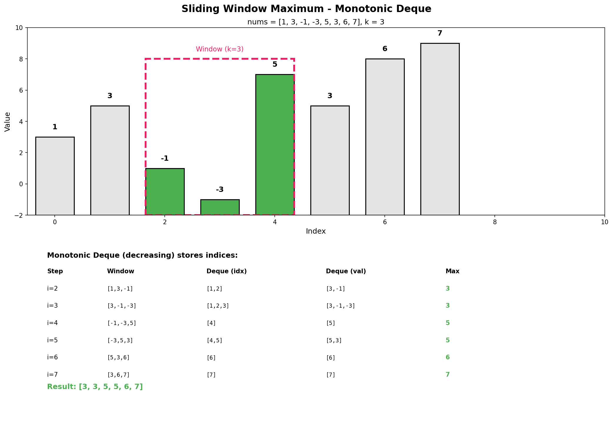

# Sliding Window Maximum

## Problem Statement

You are given an array of integers `nums`, there is a sliding window of size `k` which is moving from the very left of the array to the very right. You can only see the `k` numbers in the window. Each time the sliding window moves right by one position.

Return the **max** sliding window.

## Examples

### Example 1
```
Input: nums = [1, 3, -1, -3, 5, 3, 6, 7], k = 3
Output: [3, 3, 5, 5, 6, 7]
Explanation:
Window position                Max
---------------               -----
[1  3  -1] -3  5  3  6  7       3
 1 [3  -1  -3] 5  3  6  7       3
 1  3 [-1  -3  5] 3  6  7       5
 1  3  -1 [-3  5  3] 6  7       5
 1  3  -1  -3 [5  3  6] 7       6
 1  3  -1  -3  5 [3  6  7]      7
```

### Example 2
```
Input: nums = [1], k = 1
Output: [1]
```

### Example 3
```
Input: nums = [1, -1], k = 1
Output: [1, -1]
```

## Visual Explanation



## Key Insight: Monotonic Deque

A **monotonic decreasing deque** maintains elements in decreasing order:
1. The front always holds the maximum element's index
2. When adding a new element, remove all smaller elements from the back
3. When the window slides, remove elements outside the window from the front

Why does this work?
- If a newer element is larger, older smaller elements can never be the maximum
- The deque only stores "candidates" that could become maximum as window slides

## Solution

::: code-group

```python [Python]
from collections import deque

def maxSlidingWindow(nums: list[int], k: int) -> list[int]:
    """
    Find maximum in each sliding window using monotonic deque.

    Time Complexity: O(n) - each element added/removed at most once
    Space Complexity: O(k) - deque stores at most k elements
    """
    if not nums or k == 0:
        return []

    result = []
    dq = deque()  # Store indices

    for i, num in enumerate(nums):
        # Remove indices outside the current window
        while dq and dq[0] < i - k + 1:
            dq.popleft()

        # Remove indices with values smaller than current
        # (they can never be maximum)
        while dq and nums[dq[-1]] < num:
            dq.pop()

        dq.append(i)

        # Window is complete, record maximum
        if i >= k - 1:
            result.append(nums[dq[0]])

    return result
```

```java [Java]
public int[] maxSlidingWindow(int[] nums, int k) {
    if (nums == null || nums.length == 0 || k == 0) return new int[0];

    int n = nums.length;
    int[] result = new int[n - k + 1];
    Deque<Integer> dq = new ArrayDeque<>();  // Store indices

    for (int i = 0; i < n; i++) {
        // Remove indices outside the current window
        while (!dq.isEmpty() && dq.peekFirst() < i - k + 1) {
            dq.pollFirst();
        }

        // Remove indices with values smaller than current
        // (they can never be maximum)
        while (!dq.isEmpty() && nums[dq.peekLast()] < nums[i]) {
            dq.pollLast();
        }

        dq.offerLast(i);

        // Window is complete, record maximum
        if (i >= k - 1) {
            result[i - k + 1] = nums[dq.peekFirst()];
        }
    }

    return result;
}
```

:::

::: info Complexity: Time O(n) · Space O(k)
- **Time:** Each element is added to and removed from the deque at most once - amortized O(1) per element across n elements
- **Space:** Deque stores at most k indices at any time since elements outside the window are removed
:::

```python
# Using max-heap (less efficient but simpler concept)
import heapq

def maxSlidingWindow_heap(nums: list[int], k: int) -> list[int]:
    """
    Using max-heap. O(n log n) worst case.
    """
    result = []
    # Max-heap: store (-value, index) for max-heap behavior
    heap = []

    for i in range(len(nums)):
        heapq.heappush(heap, (-nums[i], i))

        # Remove elements outside window
        while heap[0][1] <= i - k:
            heapq.heappop(heap)

        # Window is complete
        if i >= k - 1:
            result.append(-heap[0][0])

    return result
```

::: info Complexity: Time O(n log n) · Space O(n)
- **Time:** Each element is pushed once O(log n), and lazy deletion may process each element again on pop - worst case O(n log n)
- **Space:** Heap can grow to size n since we use lazy deletion instead of eagerly removing outdated elements
:::

```python
# Brute force for comparison
def maxSlidingWindow_bruteforce(nums: list[int], k: int) -> list[int]:
    """
    Brute force: O(n*k).
    """
    return [max(nums[i:i+k]) for i in range(len(nums) - k + 1)]
```

::: info Complexity: Time O(n * k) · Space O(1)
- **Time:** For each of (n - k + 1) windows, finding the maximum requires scanning k elements
- **Space:** Only creates the output list - no auxiliary data structures used during computation
:::

## Step-by-Step Trace

For `nums = [1, 3, -1, -3, 5, 3, 6, 7]`, `k = 3`:

| i | num | Remove outdated | Remove smaller | Deque (indices) | Values | Result |
|---|-----|-----------------|----------------|-----------------|--------|--------|
| 0 | 1 | - | - | [0] | [1] | - |
| 1 | 3 | - | [0] | [1] | [3] | - |
| 2 | -1 | - | - | [1, 2] | [3, -1] | [3] |
| 3 | -3 | - | - | [1, 2, 3] | [3, -1, -3] | [3, 3] |
| 4 | 5 | [1] | [2, 3] | [4] | [5] | [3, 3, 5] |
| 5 | 3 | - | - | [4, 5] | [5, 3] | [3, 3, 5, 5] |
| 6 | 6 | - | [5] | [6] | [6] | [3, 3, 5, 5, 6] |
| 7 | 7 | - | [6] | [7] | [7] | [3, 3, 5, 5, 6, 7] |

**Result:** `[3, 3, 5, 5, 6, 7]`

## Complexity Analysis

| Approach | Time | Space |
|----------|------|-------|
| Monotonic Deque | O(n) | O(k) |
| Max-Heap | O(n log n) | O(n) |
| Brute Force | O(n * k) | O(1) |

Why is deque O(n)? Each element is added and removed from the deque at most once.

## Edge Cases

1. **k = 1**: Each element is its own maximum
2. **k = n**: Return single element, the global maximum
3. **All same elements**: `[5, 5, 5, 5]`, k = 2 -> `[5, 5, 5]`
4. **Descending array**: `[5, 4, 3, 2, 1]` - deque always has size 1
5. **Ascending array**: `[1, 2, 3, 4, 5]` - deque fills up to k

## Variations

### Sliding Window Minimum
```python
def minSlidingWindow(nums: list[int], k: int) -> list[int]:
    """
    Find minimum in each sliding window.
    Use monotonic INCREASING deque instead.
    """
    result = []
    dq = deque()

    for i, num in enumerate(nums):
        # Remove outdated
        while dq and dq[0] < i - k + 1:
            dq.popleft()

        # Remove larger elements (opposite condition)
        while dq and nums[dq[-1]] > num:
            dq.pop()

        dq.append(i)

        if i >= k - 1:
            result.append(nums[dq[0]])

    return result
```

::: info Complexity: Time O(n) · Space O(k)
- **Time:** Same amortized analysis as max version - each element added/removed from deque at most once
- **Space:** Deque holds at most k indices representing the current window's candidates
:::

### Shortest Subarray with Sum at Least K
```python
def shortestSubarray(nums: list[int], k: int) -> int:
    """
    Find shortest subarray with sum >= k.
    Uses monotonic deque on prefix sums.
    """
    n = len(nums)
    prefix = [0] * (n + 1)
    for i in range(n):
        prefix[i + 1] = prefix[i] + nums[i]

    result = float('inf')
    dq = deque()  # Monotonic increasing deque of indices

    for i in range(n + 1):
        # Check if we can form valid subarray
        while dq and prefix[i] - prefix[dq[0]] >= k:
            result = min(result, i - dq.popleft())

        # Maintain monotonic increasing property
        while dq and prefix[i] <= prefix[dq[-1]]:
            dq.pop()

        dq.append(i)

    return result if result != float('inf') else -1
```

::: info Complexity: Time O(n) · Space O(n)
- **Time:** Each index is added to and removed from the deque at most once - O(n) total operations
- **Space:** Prefix sum array of size n+1, plus deque that can hold up to n+1 indices in worst case
:::

## Common Mistakes

1. **Storing values instead of indices** - Need indices to check if element is in window
2. **Wrong deque ordering** - Must be monotonic DECREASING for max
3. **Forgetting to check window bounds** - Must remove elements outside window
4. **Off-by-one errors** - Window starts producing results at index k-1
5. **Using wrong end of deque** - Remove from front for outdated, back for smaller

## Related Problems

::: details Sliding Window Minimum
**Problem:** Find minimum in each sliding window (opposite of maximum).

**Key Insight:** Use monotonic INCREASING deque instead of decreasing.

**Approach:** Same algorithm, but remove elements LARGER than current (they can never be minimum).

**Complexity:** O(n) time, O(k) space
:::

::: details Shortest Subarray with Sum at Least K (LeetCode 862)
**Problem:** Find shortest subarray with sum >= K (can have negative numbers).

**Key Insight:** Monotonic deque on prefix sums. Can't use simple sliding window due to negatives.

**Approach:** For prefix sum at i, find smallest j where prefix[i] - prefix[j] >= K. Maintain monotonic increasing deque of prefix sum indices.

**Complexity:** O(n) time, O(n) space
:::

::: details Jump Game VI (LeetCode 1696)
**Problem:** Max score to reach end, can jump 1 to k steps, score = sum of visited elements.

**Key Insight:** DP with sliding window maximum. dp[i] = nums[i] + max(dp[i-k:i]).

**Approach:** Use monotonic deque to maintain max of last k dp values efficiently.

**Complexity:** O(n) time, O(k) space
:::

::: details Constrained Subsequence Sum (LeetCode 1425)
**Problem:** Max sum of subsequence where adjacent elements are at most k indices apart.

**Key Insight:** Similar to Jump Game VI - DP with monotonic deque optimization.

**Approach:** dp[i] = nums[i] + max(0, max(dp[i-k:i])). Use deque to maintain max efficiently.

**Complexity:** O(n) time, O(k) space
:::

::: details Longest Continuous Subarray With Absolute Diff <= Limit (LeetCode 1438)
**Problem:** Find longest subarray where max - min <= limit.

**Key Insight:** Need to track both max AND min in sliding window. Use two deques.

**Approach:** Maintain monotonic decreasing deque for max, monotonic increasing for min. Shrink window when max - min > limit.

**Complexity:** O(n) time, O(n) space
:::

## Key Takeaways

- **Monotonic deque** is the key data structure for sliding window extrema
- Each element is processed (added/removed) at most once -> O(n)
- Store indices, not values, to track window boundaries
- For maximum: monotonic decreasing; for minimum: monotonic increasing
- The front of deque always holds the answer for current window
- This pattern appears in many dynamic programming optimization problems
