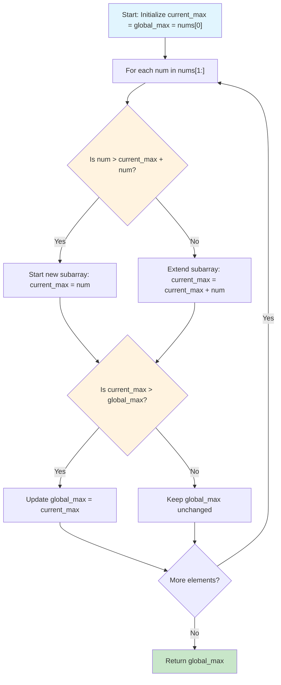
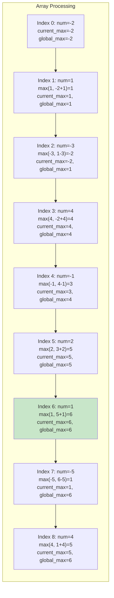
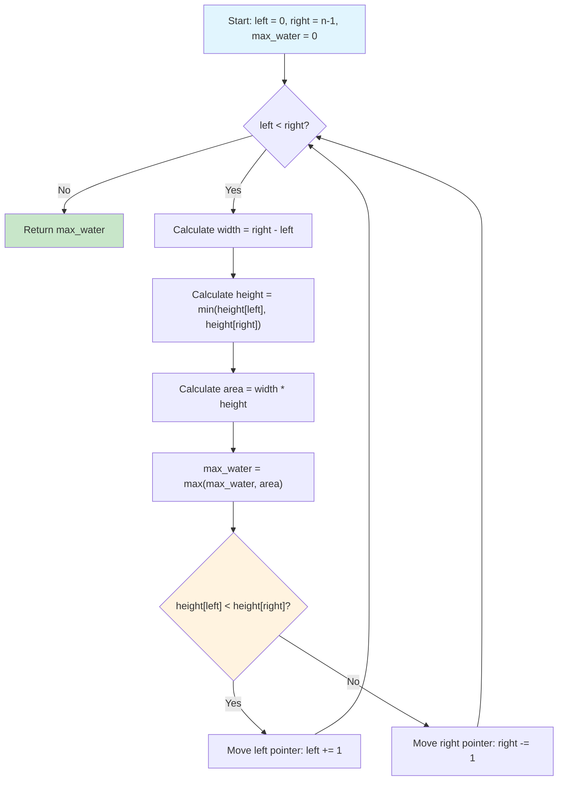
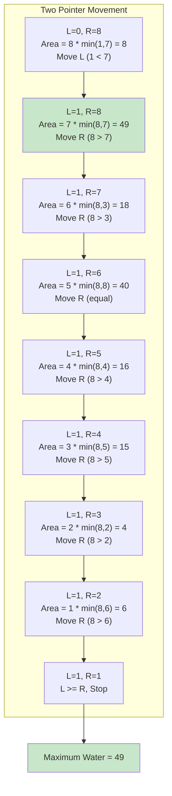

# Maximum Subarray Sum & Container with Most Water

> **Kadane's algorithm and two-pointer optimization**

---

## Maximum Subarray Sum (Kadane's Algorithm)

### Problem Statement

Given an integer array `nums`, find the contiguous subarray (containing at least one number) which has the largest sum and return its sum.

This is **LeetCode Problem 53** and a classic dynamic programming problem that appears frequently in technical interviews at Google and other top tech companies.

### Example

```
Input: nums = [-2, 1, -3, 4, -1, 2, 1, -5, 4]
Output: 6
Explanation: The subarray [4, -1, 2, 1] has the largest sum = 6
```

```
Input: nums = [1]
Output: 1
```

```
Input: nums = [5, 4, -1, 7, 8]
Output: 23
Explanation: The entire array [5, 4, -1, 7, 8] has the largest sum = 23
```

### Approach: Kadane's Algorithm

**Dynamic Programming Insight:**

At each position `i`, we decide: should we extend the previous subarray or start fresh from the current element?

```
current_max = max(num, current_max + num)
```

**Key Insight:** If the running sum becomes negative, it's better to discard it and start a new subarray. However, sometimes we include a negative number to connect surrounding positive numbers (e.g., `[6, -2, 7]` has max sum 11, including the -2).

**Algorithm Steps:**
1. Initialize `current_max` and `global_max` with the first element
2. Iterate through the array starting from index 1
3. At each element, decide whether to:
   - Start a new subarray from current element, OR
   - Extend the existing subarray
4. Update `global_max` if `current_max` is larger
5. Return `global_max`

### Mermaid Diagram



**Visual Trace for `[-2, 1, -3, 4, -1, 2, 1, -5, 4]`:**



### Solution (Python)

```python
def maxSubArray(nums: list[int]) -> int:
    """
    Find the contiguous subarray with the largest sum.

    Uses Kadane's Algorithm - a dynamic programming approach that
    decides at each position whether to extend the current subarray
    or start a new one.

    Args:
        nums: List of integers (at least one element)

    Returns:
        Maximum sum of any contiguous subarray

    Time Complexity: O(n) - single pass through the array
    Space Complexity: O(1) - only two variables used
    """
    current_max = global_max = nums[0]

    for num in nums[1:]:
        # Decision: extend current subarray or start new one
        current_max = max(num, current_max + num)
        global_max = max(global_max, current_max)

    return global_max
```

::: info Complexity: Time O(n) · Space O(1)
- **Time:** Single pass through the array, making one comparison and one update per element
- **Space:** Only two variables (`current_max`, `global_max`) maintained regardless of input size
:::

```python
# Variant: Return the actual subarray indices
def maxSubArrayWithIndices(nums: list[int]) -> tuple[int, int, int]:
    """
    Find the maximum subarray sum along with its start and end indices.

    Args:
        nums: List of integers (at least one element)

    Returns:
        Tuple of (max_sum, start_index, end_index)

    Time Complexity: O(n)
    Space Complexity: O(1)
    """
    current_max = global_max = nums[0]
    start = end = temp_start = 0

    for i in range(1, len(nums)):
        # If starting fresh is better, update temp_start
        if nums[i] > current_max + nums[i]:
            current_max = nums[i]
            temp_start = i
        else:
            current_max = current_max + nums[i]

        # If we found a new global maximum, record the indices
        if current_max > global_max:
            global_max = current_max
            start = temp_start
            end = i

    return global_max, start, end
```

::: info Complexity: Time O(n) · Space O(1)
- **Time:** Single pass tracking both sum and index boundaries - constant work per element
- **Space:** Uses five variables (`current_max`, `global_max`, `start`, `end`, `temp_start`) for tracking state
:::

```python
# Variant: Handle the case where we need to return the subarray itself
def maxSubArrayElements(nums: list[int]) -> list[int]:
    """
    Return the actual elements of the maximum subarray.

    Args:
        nums: List of integers

    Returns:
        List containing the maximum sum subarray elements
    """
    max_sum, start, end = maxSubArrayWithIndices(nums)
    return nums[start:end + 1]
```

::: info Complexity: Time O(n) · Space O(k) where k is subarray length
- **Time:** Calls maxSubArrayWithIndices in O(n), then creates a slice of the result subarray
- **Space:** Output list of size k (length of maximum subarray), which can be up to n in worst case
:::

```python
# Example usage and verification
if __name__ == "__main__":
    test_cases = [
        [-2, 1, -3, 4, -1, 2, 1, -5, 4],  # Expected: 6, subarray [4, -1, 2, 1]
        [1],                               # Expected: 1, subarray [1]
        [5, 4, -1, 7, 8],                  # Expected: 23, entire array
        [-1, -2, -3, -4],                  # Expected: -1, subarray [-1]
    ]

    for nums in test_cases:
        result = maxSubArray(nums)
        sum_val, start, end = maxSubArrayWithIndices(nums)
        subarray = maxSubArrayElements(nums)
        print(f"Array: {nums}")
        print(f"Max Sum: {result}, Subarray: {subarray} (indices {start} to {end})")
        print()
```

### Complexity

| Metric | Value | Explanation |
|--------|-------|-------------|
| **Time** | O(n) | Single pass through the array |
| **Space** | O(1) | Only two variables regardless of input size |

### Why Kadane's Algorithm Works

Kadane's algorithm is a form of **dynamic programming** where:
- **Optimal Substructure:** The maximum subarray ending at position `i` depends only on the maximum subarray ending at position `i-1`
- **State Transition:** `dp[i] = max(nums[i], dp[i-1] + nums[i])`
- **No Need for DP Array:** Since we only need the previous state, we optimize to O(1) space

### Google Follow-ups

1. **What if you need exactly k elements?**
   - Use sliding window: maintain a window of size k and track the sum
   - Time: O(n), Space: O(1)

2. **Maximum Product Subarray?**
   - Track both max and min products (negative * negative = positive)
   - `max_prod = max(num, max_prod * num, min_prod * num)`
   - `min_prod = min(num, max_prod * num, min_prod * num)`

3. **Circular Array?**
   - Answer is `max(normal_kadane, total_sum - min_subarray_sum)`
   - If all elements negative, return normal Kadane result

4. **What if the array is streamed (online algorithm)?**
   - Kadane's algorithm naturally handles streaming data
   - Maintain running `current_max` and `global_max`

5. **Maximum subarray sum with at most one deletion?**
   - Use two DP arrays: `forward[i]` and `backward[i]`
   - Answer: max of Kadane result OR `forward[i-1] + backward[i+1]` for each i

---

## Container with Most Water

### Problem Statement

You are given an integer array `height` of length `n`. There are `n` vertical lines drawn such that the two endpoints of the `i`th line are `(i, 0)` and `(i, height[i])`.

Find two lines that together with the x-axis form a container, such that the container contains the most water.

Return the maximum amount of water a container can store.

**Note:** You may not slant the container.

This is **LeetCode Problem 11** and a classic two-pointer optimization problem.

### Example

```
Input: height = [1, 8, 6, 2, 5, 4, 8, 3, 7]
Output: 49
Explanation: The vertical lines at indices 1 (height=8) and 8 (height=7)
form a container with width 7 and height min(8,7)=7, giving area = 7 * 7 = 49
```

```
Input: height = [1, 1]
Output: 1
```

### Visual Representation

```
     |              |
     |              |  |
     |  |           |  |
     |  |     |     |  |
     |  |     |  |  |  |
     |  |     |  |  |  |  |
     |  |  |  |  |  |  |  |
  |  |  |  |  |  |  |  |  |
  1  8  6  2  5  4  8  3  7   <- heights
  0  1  2  3  4  5  6  7  8   <- indices

  Container between index 1 and 8:
  Width = 8 - 1 = 7
  Height = min(8, 7) = 7
  Area = 7 * 7 = 49
```

### Approach: Two Pointers

**Key Insight:** Start with the widest possible container (pointers at both ends) and systematically explore narrower containers that might be taller.

**Why Move the Shorter Line?**

When we move a pointer, we reduce the width by 1. The only way to potentially increase the area is to find a taller line. Moving the taller line inward can **never** improve the area because:
- The width decreases
- The height is limited by the shorter line (which we kept)

Therefore, we always move the pointer pointing to the **shorter line**, hoping to find a taller one.

**Algorithm:**
1. Initialize `left = 0`, `right = n - 1`, `max_water = 0`
2. While `left < right`:
   - Calculate area: `width * min(height[left], height[right])`
   - Update `max_water` if this area is larger
   - Move the pointer with the smaller height inward
3. Return `max_water`

### Mermaid Diagram



**Visual Trace for `[1, 8, 6, 2, 5, 4, 8, 3, 7]`:**



### Solution (Python)

```python
def maxArea(height: list[int]) -> int:
    """
    Find two lines that form a container holding the most water.

    Uses the two-pointer technique starting from the widest container
    and moving inward, always moving the shorter line.

    Args:
        height: List of non-negative integers representing line heights

    Returns:
        Maximum area of water that can be contained

    Time Complexity: O(n) - each element visited at most once
    Space Complexity: O(1) - only a few variables used
    """
    left, right = 0, len(height) - 1
    max_water = 0

    while left < right:
        # Calculate the area for current container
        width = right - left
        h = min(height[left], height[right])
        max_water = max(max_water, width * h)

        # Move the pointer with the shorter line
        # Moving the taller line can never increase area
        if height[left] < height[right]:
            left += 1
        else:
            right -= 1

    return max_water
```

::: info Complexity: Time O(n) · Space O(1)
- **Time:** Two pointers start at opposite ends and move toward center - each element visited at most once
- **Space:** Only three variables (`left`, `right`, `max_water`) used for computation
:::

```python
# Variant: Return the indices of the optimal container
def maxAreaWithIndices(height: list[int]) -> tuple[int, int, int]:
    """
    Find the maximum area container and return its indices.

    Args:
        height: List of non-negative integers

    Returns:
        Tuple of (max_area, left_index, right_index)
    """
    left, right = 0, len(height) - 1
    max_water = 0
    best_left, best_right = 0, len(height) - 1

    while left < right:
        width = right - left
        h = min(height[left], height[right])
        area = width * h

        if area > max_water:
            max_water = area
            best_left, best_right = left, right

        if height[left] < height[right]:
            left += 1
        else:
            right -= 1

    return max_water, best_left, best_right
```

::: info Complexity: Time O(n) · Space O(1)
- **Time:** Same two-pointer approach - pointers converge from both ends in at most n-1 steps
- **Space:** Uses five variables to track current state and best result indices
:::

```python
# Example usage
if __name__ == "__main__":
    test_cases = [
        [1, 8, 6, 2, 5, 4, 8, 3, 7],  # Expected: 49
        [1, 1],                        # Expected: 1
        [4, 3, 2, 1, 4],               # Expected: 16
        [1, 2, 1],                     # Expected: 2
    ]

    for height in test_cases:
        result = maxArea(height)
        area, l, r = maxAreaWithIndices(height)
        print(f"Heights: {height}")
        print(f"Max Area: {result}, Container at indices ({l}, {r})")
        print(f"Width: {r-l}, Height: {min(height[l], height[r])}")
        print()
```

### Complexity

| Metric | Value | Explanation |
|--------|-------|-------------|
| **Time** | O(n) | Each element visited at most once |
| **Space** | O(1) | Only a few pointer variables used |

### Why Moving the Shorter Line Works (Proof)

**Claim:** When we have pointers at positions `left` and `right`, moving the taller line can never lead to a better solution.

**Proof by Contradiction:**

Suppose `height[left] < height[right]`. The current area is:
```
area = (right - left) * height[left]
```

If we move `right` to `right - 1`:
- The width becomes `(right - 1 - left) < (right - left)` (decreased)
- The height is `min(height[left], height[right-1]) <= height[left]` (cannot increase)

Since width decreases and height cannot increase, the area cannot improve.

Therefore, we should move the shorter line (`left`), which at least has the **potential** to find a taller line and increase the area.

### Google Follow-ups

1. **What about Trapping Rain Water?**
   - Different problem: calculate water trapped between bars
   - Use two-pointer approach with `left_max` and `right_max`
   - Water at position i = `min(left_max, right_max) - height[i]`

2. **3D Container Problem?**
   - Given a 2D elevation map, calculate volume of water after rain
   - Use BFS/priority queue from boundaries inward
   - Time: O(mn log(mn))

3. **What if lines have thickness?**
   - Subtract the thickness from the width calculation
   - Adjust area formula accordingly

4. **Can you find the top k containers?**
   - Would need to explore more configurations
   - Consider using a heap to track top k areas

5. **What if you can remove one line?**
   - Try removing each line that's between optimal boundaries
   - See if a wider container becomes possible

---

## Comparison: Maximum Subarray vs Container with Most Water

| Aspect | Maximum Subarray | Container with Most Water |
|--------|-----------------|---------------------------|
| **Pattern** | Dynamic Programming | Two Pointers |
| **Key Decision** | Extend or restart subarray | Which pointer to move |
| **Optimization** | Track local and global max | Start wide, narrow down |
| **State** | `current_max` at each position | Pointers from both ends |
| **Why It Works** | Negative prefix hurts; discard it | Moving taller line cannot help |

---

## Past Google Interview Reference

These problems are frequently asked in Google interviews:

**Maximum Subarray:**
- Often asked with follow-ups about returning indices
- Variants include maximum product subarray, circular arrays
- Tests understanding of dynamic programming optimization

**Container with Most Water:**
- Tests two-pointer technique mastery
- Often confused with "Trapping Rain Water" (different problem!)
- Follow-ups may involve 3D versions or additional constraints

**Common Interview Tips:**
1. Start with the brute force approach (O(n^2)) to show understanding
2. Explain the optimization insight clearly
3. Walk through an example step by step
4. Discuss edge cases (empty array, single element, all same heights)
5. Know the time/space complexity and be able to justify it

---

## Sources

- [Maximum Subarray Sum - Kadane's Algorithm - GeeksforGeeks](https://www.geeksforgeeks.org/dsa/largest-sum-contiguous-subarray/)
- [Maximum subarray problem - Wikipedia](https://en.wikipedia.org/wiki/Maximum_subarray_problem)
- [Kadane's Algorithm - Codecademy](https://www.codecademy.com/article/kadanes-algorithm-find-maximum-subarray-sum-in-an-array)
- [Kadane's Algorithm - How and Why Does it Work? - Medium](https://medium.com/@rsinghal757/kadanes-algorithm-dynamic-programming-how-and-why-does-it-work-3fd8849ed73d)
- [Container With Most Water - LeetCode](https://leetcode.com/problems/container-with-most-water/)
- [Container with Most Water - GeeksforGeeks](https://www.geeksforgeeks.org/dsa/container-with-most-water/)
- [Container With Most Water - Two Pointers - Hello Interview](https://www.hellointerview.com/learn/code/two-pointers/container-with-most-water)
- [Container With Most Water - In-Depth Explanation - Algo Monster](https://algo.monster/liteproblems/11)
