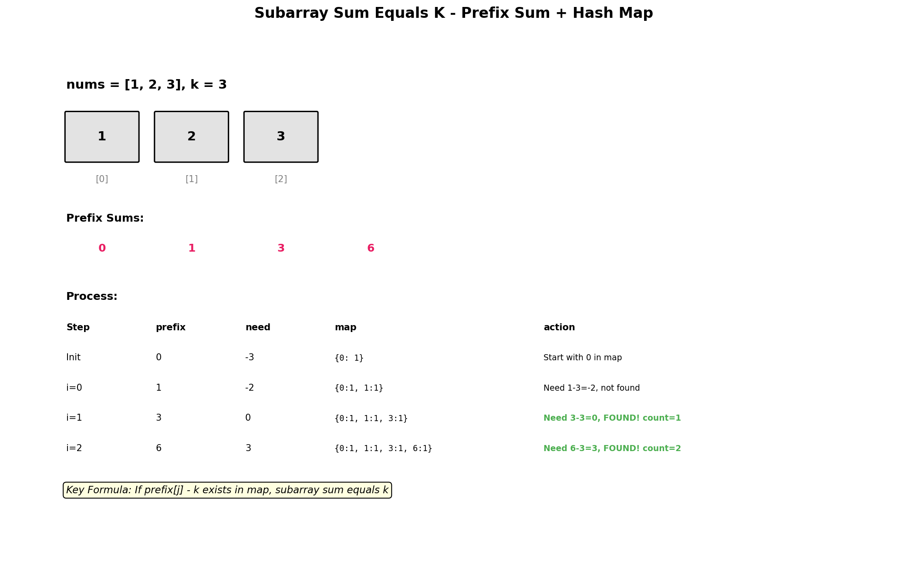

# Subarray Sum Equals K

## Problem Statement

Given an array of integers `nums` and an integer `k`, return the total number of subarrays whose sum equals to `k`.

A **subarray** is a contiguous non-empty sequence of elements within an array.

## Examples

### Example 1
```txt
Input: nums = [1, 1, 1], k = 2
Output: 2
Explanation: Subarrays [1,1] at indices (0,1) and (1,2) both sum to 2.
```

### Example 2
```txt
Input: nums = [1, 2, 3], k = 3
Output: 2
Explanation: Subarrays [1,2] and [3] both sum to 3.
```

### Example 3
```txt
Input: nums = [1, -1, 0], k = 0
Output: 3
Explanation: Subarrays [1,-1], [-1,0,1] (full array actually sums to 0),
and [0] all sum to 0.
```

## Visual Explanation



## Key Insight: Prefix Sum + Hash Map

The naive O(n^2) approach checks all subarrays. We can optimize using:
1. **Prefix sums**: `sum(i, j) = prefix[j] - prefix[i-1]`
2. **Hash map**: Store frequency of each prefix sum
3. For each position, count how many previous prefix sums satisfy: `current_prefix - k`

## Solution

```python
from collections import defaultdict

def subarraySum(nums: list[int], k: int) -> int:
    """
    Count subarrays with sum equal to k using prefix sum + hash map.

    Time Complexity: O(n)
    Space Complexity: O(n)
    """
    count = 0
    prefix_sum = 0
    # Map: prefix_sum -> frequency
    # Initialize with 0:1 to handle subarrays starting from index 0
    prefix_count = defaultdict(int)
    prefix_count[0] = 1

    for num in nums:
        prefix_sum += num

        # If (prefix_sum - k) exists, those positions form valid subarrays
        if prefix_sum - k in prefix_count:
            count += prefix_count[prefix_sum - k]

        # Add current prefix sum to map
        prefix_count[prefix_sum] += 1

    return count
```

::: info Complexity
- **Time:** Single pass through the array; each element is processed exactly once with O(1) hash map operations (lookup and insert)
- **Space:** Hash map stores at most n+1 unique prefix sums (including the initial 0), where n is the array length
:::

```python
# Without defaultdict
def subarraySum_v2(nums: list[int], k: int) -> int:
    """
    Same approach with regular dict.
    """
    count = 0
    prefix_sum = 0
    prefix_count = {0: 1}

    for num in nums:
        prefix_sum += num
        complement = prefix_sum - k

        count += prefix_count.get(complement, 0)
        prefix_count[prefix_sum] = prefix_count.get(prefix_sum, 0) + 1

    return count
```

::: info Complexity
- **Time:** Single pass through array with O(1) dictionary operations per element
- **Space:** Dictionary stores up to n distinct prefix sums
:::

```python
# Brute force for comparison (O(n^2))
def subarraySum_bruteforce(nums: list[int], k: int) -> int:
    """
    Check all subarrays - O(n^2).
    """
    count = 0
    n = len(nums)

    for i in range(n):
        current_sum = 0
        for j in range(i, n):
            current_sum += nums[j]
            if current_sum == k:
                count += 1

    return count
```

::: info Complexity
- **Time:** Nested loops iterate over all O(n^2) subarray start/end pairs; inner loop accumulates sum incrementally
- **Space:** Only uses constant extra variables (count, current_sum, loop indices)
:::

## Step-by-Step Trace

For `nums = [1, 2, 3]`, `k = 3`:

| Index | num | prefix_sum | prefix_sum - k | prefix_count[complement] | count | prefix_count (after) |
|-------|-----|------------|----------------|--------------------------|-------|---------------------|
| - | - | 0 | - | - | 0 | `{0: 1}` |
| 0 | 1 | 1 | -2 | 0 | 0 | `{0: 1, 1: 1}` |
| 1 | 2 | 3 | 0 | 1 | 1 | `{0: 1, 1: 1, 3: 1}` |
| 2 | 3 | 6 | 3 | 1 | 2 | `{0: 1, 1: 1, 3: 1, 6: 1}` |

**Result:** Count = 2

## Why We Initialize with prefix_count[0] set to 1

Consider `nums` is `[3]` and `k` is `3`:

**Without initialization:**
- After processing: prefix_sum becomes 3
- We look for complement (3 - 3) which is 0
- But prefix_count is empty, so we miss the valid subarray!

**With prefix_count[0] initialized to 1:**
- After processing: prefix_sum becomes 3
- We look for complement 0 in prefix_count
- Found! The count of 0 is 1, so we correctly count `[3]`

The initial `0 -> 1` entry represents the "empty prefix" before the array starts.

## Complexity Analysis

| Approach | Time | Space |
|----------|------|-------|
| Prefix Sum + Hash Map | O(n) | O(n) |
| Brute Force | O(n^2) | O(1) |

## Edge Cases

1. **Single element equals k**: `[5]`, k = 5 -> 1
2. **Negative numbers**: `[-1, 1, 0]`, k = 0 -> 3
3. **All zeros, k = 0**: `[0, 0, 0]` -> 6 (all subarrays)
4. **No valid subarrays**: `[1, 2, 3]`, k = 10 -> 0
5. **Multiple same prefix sums**: Need to count all occurrences
6. **k = 0**: Special case where we look for same prefix sum appearing twice

## Variations

### Maximum Size Subarray Sum Equals K
```python
def maxSubArrayLen(nums: list[int], k: int) -> int:
    """
    Find the longest subarray with sum equal to k.
    """
    prefix_sum = 0
    # Store first occurrence of each prefix sum
    prefix_index = {0: -1}
    max_len = 0

    for i, num in enumerate(nums):
        prefix_sum += num

        if prefix_sum - k in prefix_index:
            max_len = max(max_len, i - prefix_index[prefix_sum - k])

        # Only store first occurrence (for maximum length)
        if prefix_sum not in prefix_index:
            prefix_index[prefix_sum] = i

    return max_len
```

::: info Complexity
- **Time:** Single pass through array; hash map lookups and insertions are O(1) average
- **Space:** Hash map stores first occurrence index of each unique prefix sum, at most n entries
:::

### Subarray Sum Divisible by K
```python
def subarraysDivByK(nums: list[int], k: int) -> int:
    """
    Count subarrays whose sum is divisible by k.
    """
    count = 0
    prefix_sum = 0
    remainder_count = defaultdict(int)
    remainder_count[0] = 1

    for num in nums:
        prefix_sum += num
        remainder = prefix_sum % k
        # Handle negative remainders in Python
        remainder = (remainder + k) % k

        count += remainder_count[remainder]
        remainder_count[remainder] += 1

    return count
```

::: info Complexity
- **Time:** Single pass through array with O(1) operations per element
- **Space:** Hash map stores at most k distinct remainders (0 to k-1), so space is O(min(n, k))
:::

### Contiguous Array (Equal 0s and 1s)
```python
def findMaxLength(nums: list[int]) -> int:
    """
    Find longest subarray with equal number of 0s and 1s.
    Treat 0 as -1, then find longest subarray with sum = 0.
    """
    prefix_sum = 0
    prefix_index = {0: -1}
    max_len = 0

    for i, num in enumerate(nums):
        prefix_sum += 1 if num == 1 else -1

        if prefix_sum in prefix_index:
            max_len = max(max_len, i - prefix_index[prefix_sum])
        else:
            prefix_index[prefix_sum] = i

    return max_len
```

::: info Complexity
- **Time:** Single pass through array; each element processed once with O(1) hash map operations
- **Space:** Hash map stores first occurrence of each unique prefix sum (values range from -n to n)
:::

## Common Mistakes

1. **Forgetting to initialize {0: 1}** - Misses subarrays starting from index 0
2. **Adding prefix before checking** - Must check first, then add to map
3. **Confusing with Two Sum** - Similar pattern but counting all pairs, not just one
4. **Not handling negative numbers** - Algorithm works fine, but think about it

## Related Problems

::: details Two Sum (LeetCode 1)
**Problem:** Find two indices whose values sum to target.

**Key Insight:** Foundation pattern - hash map stores complements for O(1) lookup.

**Approach:** For each number, check if (target - num) exists. This problem uses same idea with prefix sums.

**Complexity:** O(n) time, O(n) space
:::

::: details Subarray Sum Divisible by K (LeetCode 974)
**Problem:** Count subarrays whose sum is divisible by k.

**Key Insight:** If prefix[i] % k == prefix[j] % k, then subarray (i,j] sum is divisible by k.

**Approach:** Track frequency of (prefix_sum % k). Handle negative remainders carefully in some languages.

**Complexity:** O(n) time, O(k) space
:::

::: details Continuous Subarray Sum (LeetCode 523)
**Problem:** Check if subarray of length >= 2 exists with sum divisible by k.

**Key Insight:** Same remainder pattern, but need length >= 2.

**Approach:** Track first occurrence index of each remainder. If same remainder seen with gap >= 2, return true.

**Complexity:** O(n) time, O(min(n, k)) space
:::

::: details Maximum Size Subarray Sum Equals K (LeetCode 325)
**Problem:** Find longest subarray with sum equal to k.

**Key Insight:** Same prefix sum pattern, but track FIRST occurrence of each prefix (for max length).

**Approach:** Store first index of each prefix sum. For current prefix, check if (prefix - k) exists, track max length.

**Complexity:** O(n) time, O(n) space
:::

::: details Binary Subarrays With Sum (LeetCode 930)
**Problem:** Count subarrays with sum equal to goal in binary array.

**Key Insight:** Same as Subarray Sum Equals K with binary array constraint.

**Approach:** Prefix sum + hash map counting occurrences. Or use sliding window (at most goal) - (at most goal-1).

**Complexity:** O(n) time, O(n) space or O(1) with sliding window
:::

## Key Takeaways

- The prefix sum + hash map pattern is essential for O(n) subarray sum problems
- Initialize with `{0: 1}` to handle subarrays starting from index 0
- This pattern can be adapted for many variants (divisibility, longest, etc.)
- The key equation: `prefix[j] - prefix[i] = k` means we look for `prefix[i] = prefix[j] - k`
- Unlike Two Sum, we count ALL matching prefix sums, not just the first
