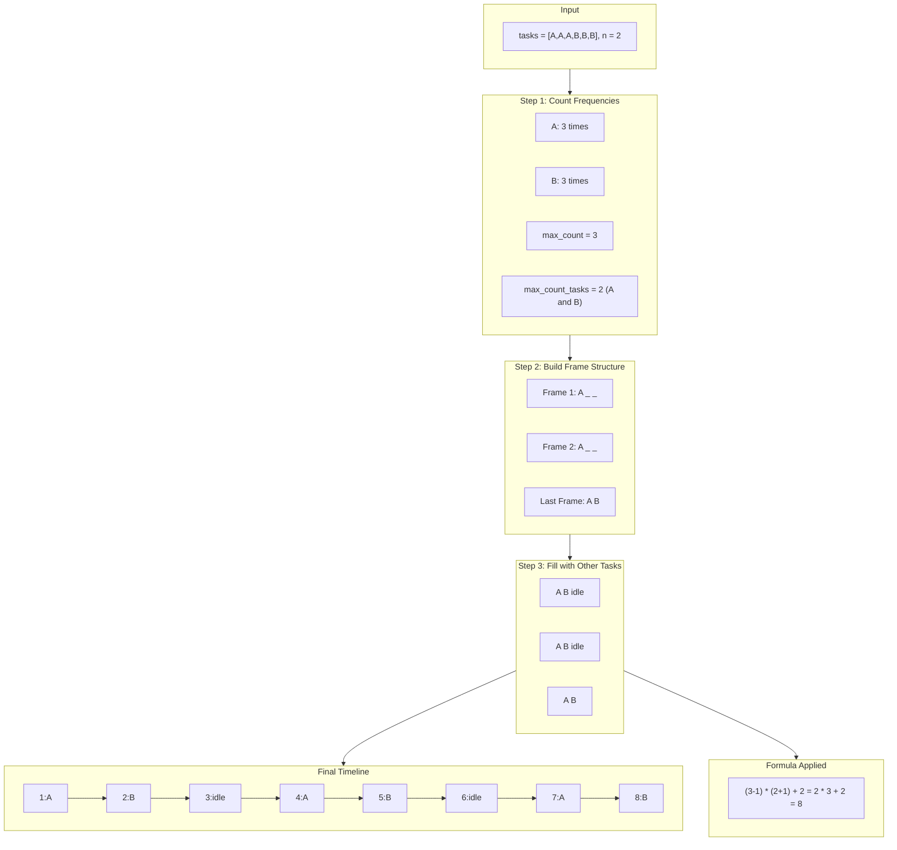
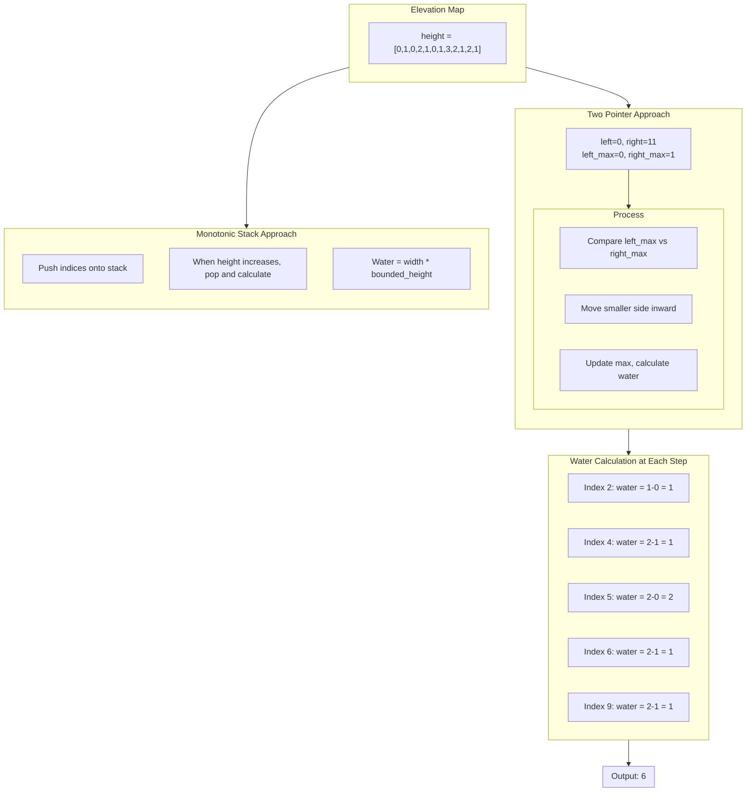
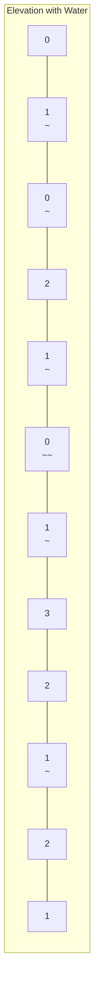

# Task Scheduler & Trapping Rain Water

> **Greedy scheduling and two-pointer elevation problems**

These two problems represent fundamental algorithm patterns frequently asked in interviews: greedy scheduling with frequency counting and elevation-based water trapping with two pointers or monotonic stacks.

---

## Task Scheduler

### Problem Statement

Given a character array `tasks` representing CPU tasks (where each character represents a different task type) and an integer `n` representing the cooldown period between identical tasks, return the minimum number of time units the CPU needs to finish all tasks.

**Constraints:**
- Each task takes exactly 1 unit of time to execute
- The CPU can be idle
- The same task must have at least `n` units of cooldown between executions

### Example

```
Input: tasks = ["A","A","A","B","B","B"], n = 2
Output: 8

Explanation: A -> B -> idle -> A -> B -> idle -> A -> B
             1    2    3      4    5    6      7    8

After executing task A, we must wait 2 time units before executing A again.
The sequence optimally interleaves A and B with one idle slot each cycle.
```

**Example 2:**
```
Input: tasks = ["A","A","A","B","B","B"], n = 0
Output: 6

Explanation: No cooldown needed, any order works: A -> B -> A -> B -> A -> B
```

**Example 3:**
```
Input: tasks = ["A","A","A","A","A","A","B","C","D","E","F","G"], n = 2
Output: 16

Explanation: A -> B -> C -> A -> D -> E -> A -> F -> G -> A -> idle -> idle -> A -> idle -> idle -> A
```

### Approach

**Key Insight: The Most Frequent Task Determines Structure**

The greedy approach is based on a critical observation: the task with the maximum frequency dictates the minimum time required. We can think of the schedule as having "frames" or "cycles" where:

1. Each frame has `n + 1` slots (one execution of the max task plus `n` cooldown slots)
2. We need `max_count - 1` complete frames
3. The last partial frame contains all tasks that have the maximum frequency

**Formula Derivation:**
```
minimum_time = (max_count - 1) * (n + 1) + num_tasks_with_max_count
```

However, if we have many different tasks, we might not need any idle time at all. So the final answer is:
```
result = max(len(tasks), (max_count - 1) * (n + 1) + max_count_tasks)
```

**Why Greedy Works:**
- By prioritizing the most frequent tasks, we minimize idle slots
- The formula captures the worst-case structure needed
- Other tasks fill in the gaps, reducing or eliminating idle time

### Mermaid Diagram



### Solution (Python)

#### Approach 1: Greedy with Math Formula (Optimal)

```python
from collections import Counter

def leastInterval(tasks: list[str], n: int) -> int:
    """
    Calculate minimum time to complete all tasks with cooldown constraint.

    Key insight: The most frequent task determines the structure.
    We create 'frames' of size (n+1) and fill gaps with other tasks.

    Time: O(m) where m = len(tasks)
    Space: O(1) - at most 26 different task types
    """
    if n == 0:
        return len(tasks)

    # Count frequency of each task
    counts = Counter(tasks)

    # Find the maximum frequency
    max_count = max(counts.values())

    # Count how many tasks have the maximum frequency
    max_count_tasks = sum(1 for c in counts.values() if c == max_count)

    # Formula: (max_count - 1) frames of size (n + 1) + tasks with max frequency
    # But if we have many tasks, we might not need idle time at all
    formula_result = (max_count - 1) * (n + 1) + max_count_tasks

    return max(len(tasks), formula_result)
```

::: info Complexity: Time O(m) · Space O(1)
- **Time:** Single pass through tasks array to count frequencies, plus O(26) operations to find max and count tasks with max frequency
- **Space:** Counter stores at most 26 task types (A-Z), which is constant regardless of input size
:::

#### Approach 2: Max-Heap Simulation

```python
from collections import Counter
import heapq

def leastInterval_heap(tasks: list[str], n: int) -> int:
    """
    Simulate task scheduling using a max-heap.
    Always pick the task with most remaining occurrences.

    Time: O(m * n) in worst case
    Space: O(26) = O(1)
    """
    counts = Counter(tasks)
    # Python has min-heap, so negate for max-heap behavior
    max_heap = [-cnt for cnt in counts.values()]
    heapq.heapify(max_heap)

    time = 0

    while max_heap:
        temp = []  # Tasks to re-add after cooldown
        cycle = n + 1  # Each cycle is n+1 time units

        # Process up to (n+1) tasks in this cycle
        while cycle > 0 and max_heap:
            cnt = heapq.heappop(max_heap)
            if cnt + 1 < 0:  # Still has remaining occurrences
                temp.append(cnt + 1)
            time += 1
            cycle -= 1

        # Re-add tasks that still have work remaining
        for item in temp:
            heapq.heappush(max_heap, item)

        # If there are still tasks, we spent a full cycle
        # (including idle time if cycle > 0)
        if max_heap:
            time += cycle  # Add idle time

    return time
```

::: info Complexity: Time O(m * n) · Space O(1)
- **Time:** In worst case, simulates each time unit; total time can be up to m * n when most frequent task dominates with large cooldown
- **Space:** Heap and temp list each hold at most 26 elements (one per task type), which is constant
:::

#### Approach 3: Queue-based Simulation

```python
from collections import Counter, deque
import heapq

def leastInterval_queue(tasks: list[str], n: int) -> int:
    """
    Use a queue to track when tasks become available again.
    More explicit about cooldown tracking.

    Time: O(m * n)
    Space: O(26) = O(1)
    """
    counts = Counter(tasks)
    max_heap = [-cnt for cnt in counts.values()]
    heapq.heapify(max_heap)

    time = 0
    cooldown_queue = deque()  # (count, available_time)

    while max_heap or cooldown_queue:
        time += 1

        if max_heap:
            cnt = heapq.heappop(max_heap) + 1  # Execute task, decrement count
            if cnt < 0:  # Still has remaining work
                cooldown_queue.append((cnt, time + n))

        # Check if any task is ready to be scheduled again
        if cooldown_queue and cooldown_queue[0][1] == time:
            heapq.heappush(max_heap, cooldown_queue.popleft()[0])

    return time
```

::: info Complexity: Time O(m * n) · Space O(1)
- **Time:** Simulates each time unit; while loop runs until all tasks complete, potentially O(m * n) iterations in worst case
- **Space:** Heap holds at most 26 task counts, queue holds at most 26 (count, time) pairs - both bounded by alphabet size
:::

### Complexity Analysis

| Approach | Time Complexity | Space Complexity | Notes |
|----------|-----------------|------------------|-------|
| Math Formula | O(m) | O(1) | m = len(tasks), constant space for 26 letters |
| Max-Heap | O(m * n) | O(1) | Simulates each time unit |
| Queue | O(m * n) | O(1) | More explicit cooldown tracking |

**Why O(1) Space?**
- Maximum 26 unique task types (A-Z)
- Counter and heap both bounded by 26

### Edge Cases

```python
def test_edge_cases():
    # Single task type
    assert leastInterval(["A"], 2) == 1

    # No cooldown
    assert leastInterval(["A","A","A","B","B","B"], 0) == 6

    # Large cooldown, few task types
    assert leastInterval(["A","A","B","B"], 3) == 8  # A B idle idle A B idle idle? No: A B idle idle A B

    # Many task types, small cooldown (no idle needed)
    assert leastInterval(["A","B","C","D","E","F"], 2) == 6
```

### Related Problems

- **Reorganize String (LeetCode 767)**: Rearrange so no two identical letters are adjacent (cooldown = 1)
- **Rearrange String k Distance Apart (LeetCode 358)**: Same concept with distance k
- **Maximum Number of Tasks You Can Assign (LeetCode 2071)**: Worker-task assignment variant

---

## Trapping Rain Water

### Problem Statement

Given `n` non-negative integers representing an elevation map where the width of each bar is 1, compute how much water it can trap after raining.

**Constraints:**
- Water can only be trapped between bars (not at edges)
- The amount of water at any position depends on the minimum of the maximum heights on both sides
- Each bar has width 1

### Example

```
Input: height = [0,1,0,2,1,0,1,3,2,1,2,1]
Output: 6

Visual representation:
       #
   #   ##.#
 # ## ######
 ___________
[0,1,0,2,1,0,1,3,2,1,2,1]

Water trapped (shown as ~):
       #
   #~~~##~#
 #~##~######
[0,1,0,2,1,0,1,3,2,1,2,1]

Water at each index:
Index 2: min(1,3) - 0 = 1
Index 4: min(2,3) - 1 = 1
Index 5: min(2,3) - 0 = 2
Index 6: min(2,3) - 1 = 1
Index 9: min(3,2) - 1 = 1
Total = 6
```

**Example 2:**
```
Input: height = [4,2,0,3,2,5]
Output: 9
```

### Approaches

#### Core Insight

For any position `i`, water trapped = `min(left_max, right_max) - height[i]`

Where:
- `left_max` = maximum height to the left of position i
- `right_max` = maximum height to the right of position i

### Mermaid Diagram





### Solution 1: Two Pointer (Optimal)

```python
def trap(height: list[int]) -> int:
    """
    Two-pointer approach - optimal O(n) time, O(1) space.

    Key insight: We only need to know the smaller of left_max and right_max
    to calculate water at current position. Process from the side with
    smaller max since that's the limiting factor.

    Time: O(n)
    Space: O(1)
    """
    if not height:
        return 0

    left, right = 0, len(height) - 1
    left_max, right_max = height[left], height[right]
    water = 0

    while left < right:
        if left_max < right_max:
            # Left side is the limiting factor
            left += 1
            left_max = max(left_max, height[left])
            water += left_max - height[left]
        else:
            # Right side is the limiting factor (or equal)
            right -= 1
            right_max = max(right_max, height[right])
            water += right_max - height[right]

    return water
```

::: info Complexity: Time O(n) · Space O(1)
- **Time:** Each index is visited exactly once as pointers move inward; while loop runs n-1 times total
- **Space:** Only uses constant extra variables (left, right, left_max, right_max, water)
:::

**Why This Works:**

1. If `left_max < right_max`: The water at `left` is bounded by `left_max` (the right side is guaranteed to be at least `right_max`, which is higher)
2. We always process the side with the smaller max because that's the constraint
3. By the time we reach any position, we've already seen its limiting boundary

### Solution 2: Monotonic Stack

```python
def trap_stack(height: list[int]) -> int:
    """
    Monotonic decreasing stack approach.

    Maintain a stack of indices where heights are decreasing.
    When we find a taller bar, we can calculate trapped water
    for the bars in the "valley".

    Time: O(n) - each element pushed and popped at most once
    Space: O(n) - stack can hold all elements
    """
    stack = []  # Stack of indices
    water = 0

    for i, h in enumerate(height):
        # While current height is greater than stack top
        while stack and height[stack[-1]] < h:
            bottom = height[stack.pop()]  # Valley bottom

            if stack:  # Need a left wall
                # Width between current index and left wall
                width = i - stack[-1] - 1
                # Height is bounded by min of two walls minus bottom
                bounded_height = min(h, height[stack[-1]]) - bottom
                water += width * bounded_height

        stack.append(i)

    return water
```

::: info Complexity: Time O(n) · Space O(n)
- **Time:** Each index is pushed and popped from stack at most once, so total operations are O(n)
- **Space:** Stack can hold up to n indices in worst case (monotonically decreasing heights)
:::

**Stack Intuition:**

1. We maintain indices of a "staircase going down"
2. When we see a bar taller than the top, we've found a valley
3. Pop the valley bottom and calculate water bounded by the two walls

### Solution 3: Precomputed Arrays (Educational)

```python
def trap_precompute(height: list[int]) -> int:
    """
    Precompute left_max and right_max arrays.

    More intuitive but uses O(n) extra space.
    Good for understanding the concept.

    Time: O(n)
    Space: O(n)
    """
    if not height:
        return 0

    n = len(height)

    # left_max[i] = max height from 0 to i (inclusive)
    left_max = [0] * n
    left_max[0] = height[0]
    for i in range(1, n):
        left_max[i] = max(left_max[i-1], height[i])

    # right_max[i] = max height from i to n-1 (inclusive)
    right_max = [0] * n
    right_max[n-1] = height[n-1]
    for i in range(n-2, -1, -1):
        right_max[i] = max(right_max[i+1], height[i])

    # Calculate water at each position
    water = 0
    for i in range(n):
        water += min(left_max[i], right_max[i]) - height[i]

    return water
```

::: info Complexity: Time O(n) · Space O(n)
- **Time:** Three separate O(n) passes: building left_max array, building right_max array, and calculating water
- **Space:** Two auxiliary arrays of size n each store the precomputed maximum heights
:::

### Complexity Comparison

| Approach | Time | Space | Pros | Cons |
|----------|------|-------|------|------|
| Two Pointer | O(n) | O(1) | Optimal space | Less intuitive |
| Monotonic Stack | O(n) | O(n) | Horizontal layers | More code |
| Precomputed Arrays | O(n) | O(n) | Most intuitive | Extra space |

### Google Follow-ups

#### 1. Trapping Rain Water II (2D Grid) - LeetCode 407

**Problem:** Given an m x n matrix representing a 2D elevation map, return the volume of water trapped.

**Solution:** Use BFS + Min-Heap

```python
import heapq

def trapRainWater2D(heightMap: list[list[int]]) -> int:
    """
    2D version uses BFS from boundaries with a min-heap.

    Key insight: Process cells from lowest boundary first.
    Water level at any cell is limited by lowest surrounding boundary.

    Time: O(m*n*log(m*n))
    Space: O(m*n)
    """
    if not heightMap or not heightMap[0]:
        return 0

    m, n = len(heightMap), len(heightMap[0])
    visited = [[False] * n for _ in range(m)]
    min_heap = []

    # Add all boundary cells to heap
    for i in range(m):
        for j in range(n):
            if i == 0 or i == m-1 or j == 0 or j == n-1:
                heapq.heappush(min_heap, (heightMap[i][j], i, j))
                visited[i][j] = True

    water = 0
    directions = [(0, 1), (0, -1), (1, 0), (-1, 0)]

    while min_heap:
        h, row, col = heapq.heappop(min_heap)

        for dr, dc in directions:
            nr, nc = row + dr, col + dc

            if 0 <= nr < m and 0 <= nc < n and not visited[nr][nc]:
                visited[nr][nc] = True
                # Water trapped = boundary height - cell height (if positive)
                water += max(0, h - heightMap[nr][nc])
                # New boundary is max of current boundary and cell height
                heapq.heappush(min_heap, (max(h, heightMap[nr][nc]), nr, nc))

    return water
```

::: info Complexity: Time O(m*n*log(m*n)) · Space O(m*n)
- **Time:** Min-heap operations (push/pop) cost O(log(m*n)); each of the m*n cells is processed once
- **Space:** Visited matrix uses O(m*n); heap can hold up to O(m+n) boundary cells initially, growing as BFS expands
:::

#### 2. Container With Most Water vs Trapping Rain Water

| Aspect | Container With Most Water (LC 11) | Trapping Rain Water (LC 42) |
|--------|-----------------------------------|----------------------------|
| **Goal** | Find MAX single container area | Find TOTAL water trapped |
| **Bars** | Lines (endpoints of container) | Bars with width 1 |
| **Formula** | `min(h[i], h[j]) * (j - i)` | `sum(min(left_max, right_max) - h[i])` |
| **Output** | One number (max area) | One number (total volume) |
| **Difficulty** | Medium | Hard |
| **Key Difference** | Ignores bars between lines | Considers every bar |

**Interview Tip:** If asked about the difference, emphasize that Container With Most Water finds the best pair of boundaries, while Trapping Rain Water sums up water trapped at each individual position.

#### 3. Other Follow-up Questions

- **What if bars have different widths?**
  - Multiply water at each position by bar width

- **What if we can remove one bar?**
  - Try removing each bar, calculate water, track maximum increase

- **Streaming heights (online algorithm)?**
  - Use stack approach, process each height as it arrives

### Edge Cases

```python
def test_trap_edge_cases():
    # Empty array
    assert trap([]) == 0

    # Single element
    assert trap([5]) == 0

    # Two elements (no water can be trapped)
    assert trap([1, 2]) == 0

    # Monotonically increasing (no water)
    assert trap([1, 2, 3, 4, 5]) == 0

    # Monotonically decreasing (no water)
    assert trap([5, 4, 3, 2, 1]) == 0

    # Valley in the middle
    assert trap([3, 0, 3]) == 3

    # All same height
    assert trap([2, 2, 2, 2]) == 0
```

---

## Past Interview Reference

These problems are frequently asked in interviews, often with variations:

### Task Scheduler Variations
- **Google Cloud Scheduler**: Design a system with cooldown constraints
- **Thread Pool Management**: Task execution with dependencies
- **Rate Limiting**: API calls with minimum intervals

### Trapping Rain Water Variations
- **2D Rain Trapping**: Asked in Google L5+ interviews
- **Streaming Version**: Real-time water calculation
- **Remove One Bar**: Optimization to maximize water

### Common Interview Patterns

1. **Start with brute force**: Show you understand the problem
2. **Optimize space**: Two-pointer from precomputed arrays
3. **Discuss trade-offs**: Stack vs two-pointer
4. **Handle follow-ups**: 2D version, streaming, modifications

### References and Sources
- [LeetCode 621: Task Scheduler](https://leetcode.com/problems/task-scheduler/)
- [Task Scheduler - Step-by-Step Guide (SparkCodeHub)](https://www.sparkcodehub.com/leetcode/621/task-scheduler)
- [Task Scheduler - In-Depth Explanation (AlgoMonster)](https://algo.monster/liteproblems/621)
- [Task Scheduler - Detailed Explanation (Design Gurus)](https://www.designgurus.io/answers/detail/621-task-scheduler-563hnj)
- [LeetCode 42: Trapping Rain Water](https://leetcode.com/problems/trapping-rain-water/)
- [Trapping Rain Water - In-Depth Explanation (AlgoMonster)](https://algo.monster/liteproblems/42)
- [Trapping Rain Water - GeeksforGeeks](https://www.geeksforgeeks.org/dsa/trapping-rain-water/)
- [Trapping Rain Water - Hello Interview](https://www.hellointerview.com/learn/code/two-pointers/trapping-rain-water)
- [LeetCode 407: Trapping Rain Water II](https://leetcode.com/problems/trapping-rain-water-ii/)
- [Trapping Rain Water II - In-Depth Explanation (AlgoMonster)](https://algo.monster/liteproblems/407)
- [Container With Most Water vs Trapping Rain Water (GeeksforGeeks)](https://www.geeksforgeeks.org/dsa/container-with-most-water/)

---

## Summary

| Problem | Key Technique | Time | Space | Key Insight |
|---------|---------------|------|-------|-------------|
| Task Scheduler | Greedy + Math | O(n) | O(1) | Most frequent task determines frame structure |
| Trapping Rain Water | Two Pointers | O(n) | O(1) | Process from side with smaller max |
| Trapping Rain Water | Monotonic Stack | O(n) | O(n) | Calculate horizontal layers |
| Trapping Rain Water II | BFS + Min-Heap | O(mn log mn) | O(mn) | Process from lowest boundary |

Both problems demonstrate the power of greedy algorithms and clever pointer manipulation to achieve optimal time complexity while minimizing space usage.
