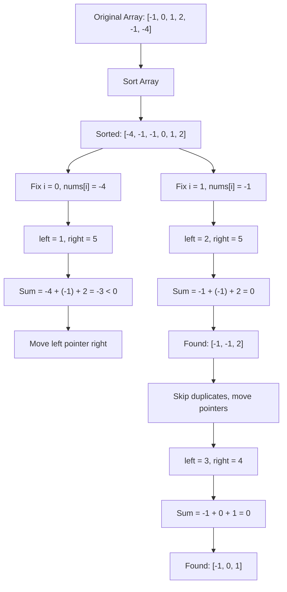

# Three Sum

> **Find all unique triplets that sum to zero**

---

## Problem Statement

Given an integer array `nums`, return all the triplets `[nums[i], nums[j], nums[k]]` such that:
- `i != j`, `i != k`, and `j != k`
- `nums[i] + nums[j] + nums[k] == 0`

The solution set **must not contain duplicate triplets**.

**LeetCode:** [Problem 15 - 3Sum](https://leetcode.com/problems/3sum/)

---

## Examples

### Example 1
```text
Input: nums = [-1, 0, 1, 2, -1, -4]
Output: [[-1, -1, 2], [-1, 0, 1]]
```
**Explanation:**
- `nums[0] + nums[1] + nums[2] = (-1) + 0 + 1 = 0`
- `nums[1] + nums[2] + nums[4] = 0 + 1 + (-1) = 0`
- `nums[0] + nums[3] + nums[4] = (-1) + 2 + (-1) = 0`

The distinct triplets are `[-1, 0, 1]` and `[-1, -1, 2]`.

Note that the order of the output and the order of the triplets does not matter.

### Example 2
```text
Input: nums = [0, 1, 1]
Output: []
```
**Explanation:** The only possible triplet does not sum up to 0.

### Example 3
```text
Input: nums = [0, 0, 0]
Output: [[0, 0, 0]]
```
**Explanation:** The only possible triplet sums up to 0.

---

## Approach

### Brute Force (O(n^3))

The most direct approach is to use three nested loops to check every possible combination of three elements.

```python
def threeSum_brute(nums: list[int]) -> list[list[int]]:
    n = len(nums)
    result = set()

    for i in range(n):
        for j in range(i + 1, n):
            for k in range(j + 1, n):
                if nums[i] + nums[j] + nums[k] == 0:
                    triplet = tuple(sorted([nums[i], nums[j], nums[k]]))
                    result.add(triplet)

    return [list(t) for t in result]
```

::: info Complexity: Time O(n^3) · Space O(n)
- **Time:** Three nested loops check all O(n^3) combinations of triplets; sorting each triplet adds O(3 log 3) = O(1) per combination
- **Space:** Set stores unique triplets; in worst case with many valid triplets, could store O(n^2) results
:::

**Why it's too slow:**
- Time Complexity: O(n^3) - three nested loops
- For an array of 3000 elements, this is 27 billion operations
- Using a set to avoid duplicates adds additional overhead
- Not acceptable for interview scenarios

### Optimal: Sort + Two Pointers (O(n^2))

The key insight is to reduce this to a **Two Sum** problem. By sorting the array first, we can:
1. Fix one element at a time
2. Use the two-pointer technique to find the other two elements
3. Efficiently skip duplicates

**Algorithm Steps:**

1. **Sort the array** - This enables the two-pointer approach and simplifies duplicate handling
2. **Iterate through the array** - Fix `nums[i]` as the first element of the triplet
3. **Skip duplicates** - If `nums[i] == nums[i-1]`, skip to avoid duplicate triplets
4. **Two-pointer search** - Use `left` and `right` pointers to find pairs that sum to `-nums[i]`
5. **Adjust pointers based on sum:**
   - If sum < 0: move `left` right (need larger values)
   - If sum > 0: move `right` left (need smaller values)
   - If sum == 0: record triplet, skip duplicates, move both pointers

**Key Optimization:** If `nums[i] > 0`, we can break early since all remaining elements will be positive, making it impossible to sum to zero.

### Mermaid Diagram



**Visual Walkthrough:**

```text
Sorted Array: [-4, -1, -1, 0, 1, 2]
               ^
               i

Step 1: i=0, nums[i]=-4
        [-4, -1, -1, 0, 1, 2]
          i   L            R
        Sum = -4 + (-1) + 2 = -3 < 0, move L right

        [-4, -1, -1, 0, 1, 2]
          i       L        R
        Sum = -4 + (-1) + 2 = -3 < 0, move L right
        ... continues until L >= R

Step 2: i=1, nums[i]=-1
        [-4, -1, -1, 0, 1, 2]
              i   L        R
        Sum = -1 + (-1) + 2 = 0 (FOUND!)
        Record [-1, -1, 2], skip duplicates, move both pointers

        [-4, -1, -1, 0, 1, 2]
              i      L  R
        Sum = -1 + 0 + 1 = 0 (FOUND!)
        Record [-1, 0, 1]

Step 3: i=2, nums[i]=-1 (same as nums[1], SKIP!)

Step 4: i=3, nums[i]=0
        Only 2 elements remain, not enough for triplet
```

---

## Solution

::: code-group

```python [Python]
def threeSum(nums: list[int]) -> list[list[int]]:
    nums.sort()
    result = []

    for i in range(len(nums) - 2):
        # Early termination: if smallest number is positive, no solution possible
        if nums[i] > 0:
            break

        # Skip duplicates for first element
        if i > 0 and nums[i] == nums[i - 1]:
            continue

        left, right = i + 1, len(nums) - 1

        while left < right:
            total = nums[i] + nums[left] + nums[right]

            if total < 0:
                left += 1
            elif total > 0:
                right -= 1
            else:
                result.append([nums[i], nums[left], nums[right]])

                # Skip duplicates for second element
                while left < right and nums[left] == nums[left + 1]:
                    left += 1
                # Skip duplicates for third element
                while left < right and nums[right] == nums[right - 1]:
                    right -= 1

                left += 1
                right -= 1

    return result
```

```java [Java]
public List<List<Integer>> threeSum(int[] nums) {
    Arrays.sort(nums);
    List<List<Integer>> result = new ArrayList<>();

    for (int i = 0; i < nums.length - 2; i++) {
        // Early termination
        if (nums[i] > 0) break;

        // Skip duplicates for first element
        if (i > 0 && nums[i] == nums[i - 1]) continue;

        int left = i + 1, right = nums.length - 1;

        while (left < right) {
            int sum = nums[i] + nums[left] + nums[right];

            if (sum < 0) {
                left++;
            } else if (sum > 0) {
                right--;
            } else {
                result.add(Arrays.asList(nums[i], nums[left], nums[right]));

                while (left < right && nums[left] == nums[left + 1]) left++;
                while (left < right && nums[right] == nums[right - 1]) right--;

                left++;
                right--;
            }
        }
    }

    return result;
}
```

:::

::: info Complexity: Time O(n^2) · Space O(1) excluding output
- **Time:** Sorting takes O(n log n); outer loop runs O(n) times, inner two-pointer search takes O(n) per iteration, giving O(n^2) total. `Arrays.sort(int[])` is a dual-pivot quicksort in Java — not stable, but sort stability is not required here.
- **Space:** Only uses constant extra variables (pointers, total); sorting is in-place (O(log n) stack in Java); output array not counted in space analysis
:::

### Solution (C++)

```cpp
vector<vector<int>> threeSum(vector<int>& nums) {
    sort(nums.begin(), nums.end());
    vector<vector<int>> result;

    for (int i = 0; i < (int)nums.size() - 2; i++) {
        if (nums[i] > 0) break;
        if (i > 0 && nums[i] == nums[i - 1]) continue;

        int left = i + 1, right = nums.size() - 1;

        while (left < right) {
            int sum = nums[i] + nums[left] + nums[right];

            if (sum < 0) {
                left++;
            } else if (sum > 0) {
                right--;
            } else {
                result.push_back({nums[i], nums[left], nums[right]});

                while (left < right && nums[left] == nums[left + 1]) left++;
                while (left < right && nums[right] == nums[right - 1]) right--;

                left++;
                right--;
            }
        }
    }

    return result;
}
```

::: info Complexity: Time O(n^2) · Space O(1) excluding output
- **Time:** std::sort uses O(n log n); outer loop O(n) times inner two-pointer O(n) gives O(n^2) total
- **Space:** In-place sorting with O(log n) stack space; constant extra variables for pointers
:::

---

## Complexity Analysis

### Time Complexity: O(n^2)

| Operation | Complexity |
|-----------|------------|
| Sorting   | O(n log n) |
| Outer loop (i) | O(n) |
| Inner two-pointer search | O(n) |
| **Total** | O(n log n) + O(n) * O(n) = **O(n^2)** |

### Space Complexity: O(1) or O(n)

- **O(1)** - excluding the output array (only using pointers and variables)
- **O(n)** or **O(log n)** - if counting the space used by the sorting algorithm (depends on implementation)

---

## Edge Cases

| Case | Input | Output | Notes |
|------|-------|--------|-------|
| Empty array | `[]` | `[]` | No elements to form triplets |
| Less than 3 elements | `[1, 2]` | `[]` | Cannot form a triplet |
| All zeros | `[0, 0, 0]` | `[[0, 0, 0]]` | Only valid triplet |
| All same positive | `[1, 1, 1]` | `[]` | Cannot sum to zero |
| All same negative | `[-1, -1, -1]` | `[]` | Cannot sum to zero |
| No solution exists | `[1, 2, 3, 4]` | `[]` | All positive, no triplet sums to 0 |
| Multiple duplicates | `[-1, -1, -1, 2, 2]` | `[[-1, -1, 2]]` | Must handle duplicate skipping |
| Large array with many duplicates | See constraints | Varies | Test duplicate handling efficiency |

**Constraints to consider:**
- `3 <= nums.length <= 3000`
- `-10^5 <= nums[i] <= 10^5`

---

## Follow-up Questions (Google Style)

### 1. What if we want 4Sum? Can you generalize to kSum?

**Answer:** Yes! The pattern generalizes to **kSum** using recursion:

```python
def kSum(nums: list[int], target: int, k: int) -> list[list[int]]:
    nums.sort()
    result = []

    def helper(start: int, k: int, target: int, path: list[int]):
        # Base case: 2Sum
        if k == 2:
            left, right = start, len(nums) - 1
            while left < right:
                total = nums[left] + nums[right]
                if total < target:
                    left += 1
                elif total > target:
                    right -= 1
                else:
                    result.append(path + [nums[left], nums[right]])
                    while left < right and nums[left] == nums[left + 1]:
                        left += 1
                    while left < right and nums[right] == nums[right - 1]:
                        right -= 1
                    left += 1
                    right -= 1
            return

        # Recursive case
        for i in range(start, len(nums) - k + 1):
            if i > start and nums[i] == nums[i - 1]:
                continue
            # Pruning
            if nums[i] * k > target or nums[-1] * k < target:
                break
            helper(i + 1, k - 1, target - nums[i], path + [nums[i]])

    helper(0, k, target, [])
    return result
```

::: info Complexity: Time O(n^(k-1)) · Space O(k)
- **Time:** Recursion depth is k-2 levels (until base case 2Sum); each level iterates O(n) elements, giving O(n^(k-1)) total
- **Space:** Recursion stack depth is O(k); path array stores up to k elements; sorting uses O(log n) extra space
:::

**Time Complexity:** O(n^(k-1)) for kSum

### 2. What if the array is too large to fit in memory?

**Answer:** For distributed/external sorting scenarios:

1. **External Sort:** Use external merge sort to sort data on disk
2. **Chunk Processing:**
   - Divide array into chunks that fit in memory
   - Sort each chunk
   - Use a multi-way merge approach
3. **Hash-based Partitioning:**
   - Partition numbers by their value range
   - Process partitions that could potentially sum to zero together
4. **MapReduce:**
   - Map: Emit potential pairs with their sum
   - Reduce: Find third element that completes the triplet
5. **Sampling:** For approximate solutions, use reservoir sampling

### 3. How would you handle it if the array was already sorted?

**Answer:** Skip the sorting step! Time complexity becomes pure O(n^2):

```python
def threeSumSorted(nums: list[int]) -> list[list[int]]:
    # No sorting needed - already sorted
    result = []

    for i in range(len(nums) - 2):
        if nums[i] > 0:
            break
        if i > 0 and nums[i] == nums[i - 1]:
            continue

        left, right = i + 1, len(nums) - 1
        # ... rest is the same
```

### 4. What if we need to find triplets summing to a target other than 0?

**Answer:** Simple modification - adjust the target comparison:

```python
def threeSumTarget(nums: list[int], target: int) -> list[list[int]]:
    nums.sort()
    result = []

    for i in range(len(nums) - 2):
        # Adjust: look for pairs summing to (target - nums[i])
        remaining = target - nums[i]
        # ... use two pointers to find pairs summing to 'remaining'
```

### 5. What if we only need to return one valid triplet (or check if one exists)?

**Answer:** Return early upon finding the first triplet:

```python
def hasThreeSum(nums: list[int]) -> bool:
    nums.sort()

    for i in range(len(nums) - 2):
        if i > 0 and nums[i] == nums[i - 1]:
            continue

        left, right = i + 1, len(nums) - 1

        while left < right:
            total = nums[i] + nums[left] + nums[right]
            if total == 0:
                return True  # Early return
            elif total < 0:
                left += 1
            else:
                right -= 1

    return False
```

::: info Complexity: Time O(n^2) · Space O(1)
- **Time:** Same O(n log n) sort plus O(n^2) two-pointer search; early return does not change worst-case complexity
- **Space:** Only constant extra variables used beyond in-place sort
:::

### 6. What if each element can be used multiple times?

**Answer:** This changes the problem significantly:

```python
def threeSumWithRepeat(nums: list[int]) -> bool:
    """Check if any three numbers (with repetition allowed) sum to 0"""
    num_set = set(nums)

    for a in nums:
        for b in nums:
            if -(a + b) in num_set:
                return True
    return False
```

::: info Complexity: Time O(n^2) · Space O(n)
- **Time:** Two nested loops over the array elements, each O(n), with O(1) set lookup per iteration
- **Space:** Set stores all unique elements from the array, requiring O(n) space
:::

---

## Related Problems

| Problem | Difficulty | Key Concept |
|---------|------------|-------------|
| [Two Sum](https://leetcode.com/problems/two-sum/) | Easy | Hash map lookup |
| [3Sum Closest](https://leetcode.com/problems/3sum-closest/) | Medium | Two pointers with closest tracking |
| [4Sum](https://leetcode.com/problems/4sum/) | Medium | Generalize 3Sum pattern |
| [Two Sum II - Input Array Is Sorted](https://leetcode.com/problems/two-sum-ii-input-array-is-sorted/) | Medium | Two pointers on sorted array |
| [3Sum Smaller](https://leetcode.com/problems/3sum-smaller/) | Medium | Count triplets instead of listing |
| [Valid Triangle Number](https://leetcode.com/problems/valid-triangle-number/) | Medium | Similar two-pointer technique |

---

## Past Interview Reference

The 3Sum problem is a classic interview question frequently asked at top tech companies including Google. Based on interview experiences shared online:

**Interview Context:**
- This problem is commonly asked as a follow-up to Two Sum
- Interviewers expect candidates to recognize the two-pointer optimization
- Handling duplicates correctly is a key evaluation point
- Follow-up questions about kSum generalization are common

**What Interviewers Look For:**
1. **Problem decomposition:** Recognizing 3Sum as an extension of 2Sum
2. **Optimization thinking:** Moving from O(n^3) brute force to O(n^2) optimal
3. **Edge case handling:** Proper duplicate management
4. **Code cleanliness:** Clean, readable implementation
5. **Communication:** Explaining the approach before coding

**Common Mistakes to Avoid:**
- Forgetting to skip duplicates (returning duplicate triplets)
- Off-by-one errors in loop bounds
- Not sorting the array first
- Using a hash set approach when two pointers is expected
- Missing the early termination optimization (`nums[i] > 0`)

**Interview Tips:**
- Start by discussing the brute force approach and its limitations
- Explain why sorting helps before implementing
- Walk through a small example to demonstrate the algorithm
- Mention time and space complexity proactively
- Be prepared for follow-up questions about 4Sum or kSum

---

## Quick Reference

```text
3Sum Algorithm Summary:
1. Sort the array
2. For each element nums[i]:
   a. Skip if duplicate
   b. Use two pointers (left, right) to find pairs summing to -nums[i]
   c. Move pointers based on sum comparison
   d. Skip duplicates when triplet found

Time: O(n^2)  |  Space: O(1)
```

---

## Sources

- [3Sum - LeetCode Official Problem](https://leetcode.com/problems/3sum/)
- [NeetCode 3Sum Solution & Explanation](https://neetcode.io/solutions/3sum)
- [3Sum Interview Guide - FizzBuzzed](https://fizzbuzzed.com/top-interview-questions-1/)
- [Google Interview - The 3Sum Problem - Finxter](https://blog.finxter.com/google-interview-the-3-sum-problem/)
- [Three Sum - Hello Interview](https://www.hellointerview.com/learn/code/two-pointers/3-sum)
- [Mastering 3Sum - Sean Coughlin's Tech Blog](https://blog.seancoughlin.me/mastering-the-3sum-problem-a-guide-for-leetcode-and-coding-interviews)
- [Google Interview Experiences 2024-2025 - LeetCode Discuss](https://leetcode.com/discuss/post/6469509/google-latest-interview-experiences-coll-r4zm/)
- [Google Interview Experience 2024 (L3) - Medium](https://medium.com/@sahilg.2931/google-interview-experience-2024-sde-2-4d56a88685bd)

---
