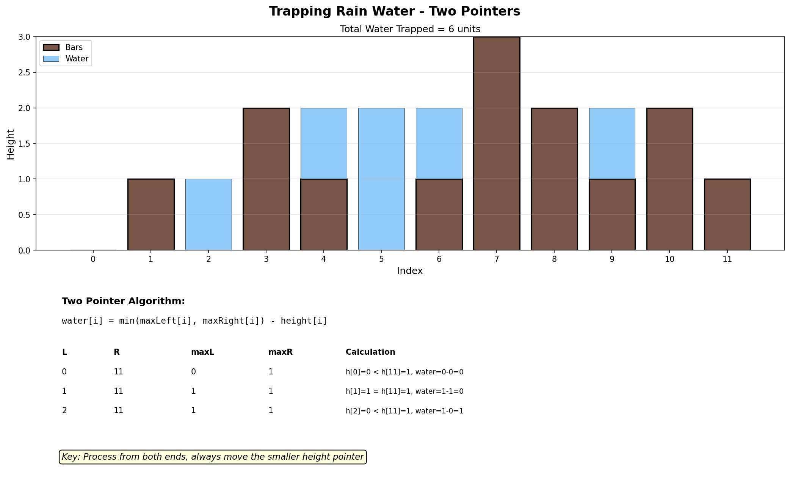
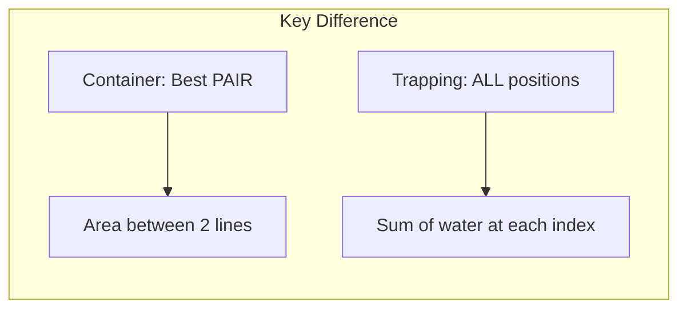

# Trapping Rain Water

## Problem Statement

Given `n` non-negative integers representing an elevation map where the width of each bar is `1`, compute how much water it can trap after raining.

## Examples

### Example 1
```
Input: height = [0, 1, 0, 2, 1, 0, 1, 3, 2, 1, 2, 1]
Output: 6
Explanation: The elevation map (black) and water (blue) are shown below.
```

### Example 2
```
Input: height = [4, 2, 0, 3, 2, 5]
Output: 9
```

## Visual Explanation



## Key Insight

For each position `i`, the water trapped is determined by:
1. The tallest bar to the left (maxLeft)
2. The tallest bar to the right (maxRight)
3. Water level = min(maxLeft, maxRight)
4. Water trapped = max(0, water_level - height[i])

## Multiple Approaches

### Approach 1: Two Pointers (Optimal)
- O(n) time, O(1) space
- Process from both ends simultaneously

### Approach 2: Prefix/Suffix Arrays
- O(n) time, O(n) space
- Pre-compute maxLeft and maxRight arrays

### Approach 3: Monotonic Stack
- O(n) time, O(n) space
- Process "horizontal layers" of water

## Solution

```python
def trap(height: list[int]) -> int:
    """
    Calculate trapped rain water using two pointers.

    Time Complexity: O(n)
    Space Complexity: O(1)
    """
    if not height:
        return 0

    left, right = 0, len(height) - 1
    left_max, right_max = 0, 0
    water = 0

    while left < right:
        if height[left] < height[right]:
            # Left side is the limiting factor
            if height[left] >= left_max:
                left_max = height[left]
            else:
                water += left_max - height[left]
            left += 1
        else:
            # Right side is the limiting factor
            if height[right] >= right_max:
                right_max = height[right]
            else:
                water += right_max - height[right]
            right -= 1

    return water
```

::: info Complexity: Time O(n) · Space O(1)
- **Time:** Single pass through array; each position is visited exactly once as left and right pointers converge
- **Space:** Only uses constant extra variables (left, right, left_max, right_max, water)
:::

```python
# Prefix/Suffix Arrays approach (easier to understand)
def trap_arrays(height: list[int]) -> int:
    """
    Using prefix and suffix max arrays.

    Time Complexity: O(n)
    Space Complexity: O(n)
    """
    if not height:
        return 0

    n = len(height)
    max_left = [0] * n
    max_right = [0] * n

    # Fill max_left: max height to the left of each index
    max_left[0] = height[0]
    for i in range(1, n):
        max_left[i] = max(max_left[i - 1], height[i])

    # Fill max_right: max height to the right of each index
    max_right[n - 1] = height[n - 1]
    for i in range(n - 2, -1, -1):
        max_right[i] = max(max_right[i + 1], height[i])

    # Calculate water at each position
    water = 0
    for i in range(n):
        water_level = min(max_left[i], max_right[i])
        water += water_level - height[i]

    return water
```

::: info Complexity: Time O(n) · Space O(n)
- **Time:** Three separate O(n) passes: building max_left array, building max_right array, and computing water at each position
- **Space:** Two auxiliary arrays of size n store precomputed maximum heights from left and right
:::

```python
# Monotonic stack approach
def trap_stack(height: list[int]) -> int:
    """
    Using monotonic decreasing stack.
    Process water layer by layer (horizontal).

    Time Complexity: O(n)
    Space Complexity: O(n)
    """
    stack = []  # Stores indices
    water = 0

    for i, h in enumerate(height):
        # Process water trapped between stack top and current bar
        while stack and height[stack[-1]] < h:
            bottom = stack.pop()
            if not stack:
                break

            # Calculate water above 'bottom', bounded by left and current
            left_idx = stack[-1]
            width = i - left_idx - 1
            bounded_height = min(height[left_idx], h) - height[bottom]
            water += width * bounded_height

        stack.append(i)

    return water
```

::: info Complexity: Time O(n) · Space O(n)
- **Time:** Each index is pushed onto stack once and popped at most once, giving O(2n) = O(n) total operations
- **Space:** Stack stores indices; in worst case (monotonically decreasing heights), all n indices are stored
:::

## Step-by-Step Trace (Two Pointers)

For `height = [0, 1, 0, 2, 1, 0, 1, 3, 2, 1, 2, 1]`:

| Step | left | right | left_max | right_max | Condition | Action | Water |
|------|------|-------|----------|-----------|-----------|--------|-------|
| 1 | 0 | 11 | 0 | 0 | h[0]=0 < h[11]=1 | l_max=0, left++ | 0 |
| 2 | 1 | 11 | 0 | 0 | h[1]=1 < h[11]=1 | l_max=1, left++ | 0 |
| 3 | 2 | 11 | 1 | 0 | h[2]=0 < h[11]=1 | water+=1-0, left++ | 1 |
| 4 | 3 | 11 | 1 | 0 | h[3]=2 >= h[11]=1 | r_max=1, right-- | 1 |
| 5 | 3 | 10 | 1 | 1 | h[3]=2 >= h[10]=2 | r_max=2, right-- | 1 |
| ... | ... | ... | ... | ... | ... | ... | ... |

**Final result:** 6

## Why Two Pointers Work

```
Key insight: Water at position i depends on:
- left_max: maximum height to the left
- right_max: maximum height to the right
- Water level = min(left_max, right_max)

At any step:
- If height[left] < height[right]:
  - The water at 'left' is bounded by left_max (since right side is taller)
  - We can safely calculate water at 'left' and move on

- If height[right] <= height[left]:
  - The water at 'right' is bounded by right_max (since left side is taller)
  - We can safely calculate water at 'right' and move on

We always process the side with the smaller bar because that's the limiting factor.
```

## Complexity Analysis

| Approach | Time | Space |
|----------|------|-------|
| Two Pointers | O(n) | O(1) |
| Prefix/Suffix Arrays | O(n) | O(n) |
| Monotonic Stack | O(n) | O(n) |

## Edge Cases

1. **Empty array**: `[]` -> 0
2. **No trapping possible**: `[1, 2, 3, 4]` or `[4, 3, 2, 1]` -> 0
3. **Single bar**: `[5]` -> 0
4. **Two bars**: `[5, 5]` -> 0
5. **All same height**: `[3, 3, 3, 3]` -> 0
6. **Valley**: `[3, 0, 3]` -> 3

## Comparison with Container With Most Water

| Trapping Rain Water | Container With Most Water |
|---------------------|---------------------------|
| Water trapped ON/BETWEEN bars | Water held BY two bars |
| Consider all bars | Only consider two bars |
| Sum of water at each position | Area between two lines |
| Need to know both max_left and max_right | Only min of two heights matters |

```
Trapping Rain Water:        Container With Most Water:
   |                            |
   |~~|                         |~~~~~~~~|
   |~~|~~|              vs      |        |
  -+--+--+-                    -+--------+-
```

## Related Problems

::: details Container With Most Water (LeetCode 11)
**Problem:** Find two lines that form container holding most water.

**Key Insight:** Different problem - only care about TWO lines forming container, not water trapped at all positions.

**Approach:** Two pointers from ends. Area = min(heights) * width. Move pointer at shorter line.



**Complexity:** O(n) time, O(1) space
:::

::: details Product of Array Except Self (LeetCode 238)
**Problem:** Return array where each element is product of all other elements.

**Key Insight:** Same prefix/suffix pattern - compute from both directions.

**Approach:** First pass builds prefix products, second pass multiplies by suffix products.

**Complexity:** O(n) time, O(1) space (excluding output)
:::

::: details Largest Rectangle in Histogram (LeetCode 84)
**Problem:** Find largest rectangle area in histogram.

**Key Insight:** For each bar, find extent it can be the minimum height. Use monotonic stack.

**Approach:** Monotonic increasing stack. When smaller bar found, calculate areas for taller bars that must end.

**Complexity:** O(n) time, O(n) space
:::

::: details Pour Water (LeetCode 755)
**Problem:** Simulate water pouring at index K, water flows to lowest adjacent position.

**Key Insight:** Simulation problem - water seeks lowest point, prefers left, then right.

**Approach:** For each water unit: try flowing left to find lower position, then right, then stay at K.

**Complexity:** O(V * n) time where V = water volume
:::

## Key Takeaways

- The **two pointer** approach is optimal: O(1) space
- Water at each position = min(maxLeft, maxRight) - height
- The limiting factor is always the smaller of the two maximums
- This is a classic example where the prefix/suffix pattern applies
- Three different approaches (two pointers, arrays, stack) each have their intuition
- Understanding WHY each approach works is crucial for similar problems
