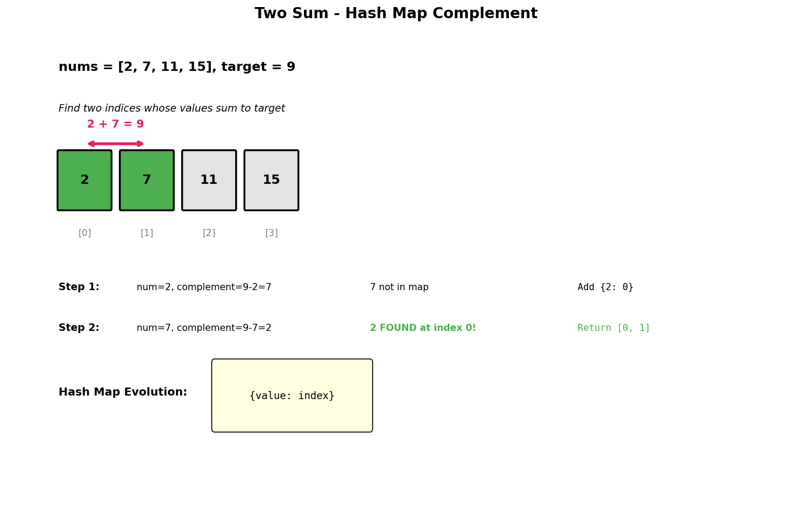

# Two Sum

## Problem Statement

Given an array of integers `nums` and an integer `target`, return **indices of the two numbers** such that they add up to `target`.

You may assume that each input would have **exactly one solution**, and you may not use the same element twice.

You can return the answer in any order.

## Examples

### Example 1
```
Input: nums = [2, 7, 11, 15], target = 9
Output: [0, 1]
Explanation: nums[0] + nums[1] = 2 + 7 = 9, so we return [0, 1].
```

### Example 2
```
Input: nums = [3, 2, 4], target = 6
Output: [1, 2]
Explanation: nums[1] + nums[2] = 2 + 4 = 6
```

### Example 3
```
Input: nums = [3, 3], target = 6
Output: [0, 1]
Explanation: Both 3s add up to 6.
```

## Visual Explanation



## Multiple Approaches

### Approach 1: Hash Map (Optimal)
- Store each number's index in a hash map
- For each number, check if its complement exists
- O(n) time, O(n) space

### Approach 2: Two Pointers (If Array is Sorted)
- Sort the array and use two pointers
- Note: Loses original indices, need extra handling
- O(n log n) time, O(n) space

### Approach 3: Brute Force
- Check every pair
- O(n^2) time, O(1) space

## Solution

```python
def twoSum(nums: list[int], target: int) -> list[int]:
    """
    Find two indices that sum to target using hash map.

    Time Complexity: O(n)
    Space Complexity: O(n)
    """
    num_to_index = {}

    for i, num in enumerate(nums):
        complement = target - num

        if complement in num_to_index:
            return [num_to_index[complement], i]

        num_to_index[num] = i

    return []  # No solution found (shouldn't happen per problem statement)
```

::: info Complexity: Time O(n) · Space O(n)
- **Time:** Single pass through array; each element requires O(1) hash map lookup and O(1) insertion
- **Space:** Hash map stores at most n-1 elements (all elements except the one currently being checked)
:::

```python
# Two-pass hash map (easier to understand)
def twoSum_twopass(nums: list[int], target: int) -> list[int]:
    """
    Two-pass approach: first build map, then search.

    Time Complexity: O(n)
    Space Complexity: O(n)
    """
    # First pass: build the hash map
    num_to_index = {num: i for i, num in enumerate(nums)}

    # Second pass: find complement
    for i, num in enumerate(nums):
        complement = target - num
        # Ensure we don't use the same element twice
        if complement in num_to_index and num_to_index[complement] != i:
            return [i, num_to_index[complement]]

    return []
```

::: info Complexity: Time O(n) · Space O(n)
- **Time:** First pass O(n) builds the hash map; second pass O(n) searches for complements; total 2n = O(n)
- **Space:** Hash map stores all n elements with their indices
:::

```python
# Two pointers approach (for sorted array variant)
def twoSum_sorted(nums: list[int], target: int) -> list[int]:
    """
    Two pointers for sorted array (returns 1-indexed for LeetCode variant).

    Time Complexity: O(n)
    Space Complexity: O(1)
    """
    left, right = 0, len(nums) - 1

    while left < right:
        current_sum = nums[left] + nums[right]

        if current_sum == target:
            return [left + 1, right + 1]  # 1-indexed
        elif current_sum < target:
            left += 1
        else:
            right -= 1

    return []
```

::: info Complexity: Time O(n) · Space O(1)
- **Time:** Single pass through sorted array; left and right pointers each move at most n times total
- **Space:** Only uses constant extra variables (left, right pointers and current_sum)
:::

```python
# Brute force (for reference)
def twoSum_bruteforce(nums: list[int], target: int) -> list[int]:
    """
    Check every pair - O(n^2).
    """
    n = len(nums)
    for i in range(n):
        for j in range(i + 1, n):
            if nums[i] + nums[j] == target:
                return [i, j]
    return []
```

::: info Complexity: Time O(n^2) · Space O(1)
- **Time:** Nested loops check all O(n^2/2) unique pairs in the array; each comparison is O(1)
- **Space:** Only uses constant extra variables for loop indices
:::

## Step-by-Step Trace

For `nums = [2, 7, 11, 15]`, `target = 9`:

| i | num | complement | num_to_index (before) | Found? | Action |
|---|-----|------------|----------------------|--------|--------|
| 0 | 2 | 7 | {} | No | Add {2: 0} |
| 1 | 7 | 2 | {2: 0} | Yes! | Return [0, 1] |

For `nums = [3, 2, 4]`, `target = 6`:

| i | num | complement | num_to_index (before) | Found? | Action |
|---|-----|------------|----------------------|--------|--------|
| 0 | 3 | 3 | {} | No | Add {3: 0} |
| 1 | 2 | 4 | {3: 0} | No | Add {2: 1} |
| 2 | 4 | 2 | {3: 0, 2: 1} | Yes! | Return [1, 2] |

## Complexity Analysis

| Approach | Time | Space |
|----------|------|-------|
| Hash Map | O(n) | O(n) |
| Two Pointers (sorted) | O(n) | O(1) |
| Brute Force | O(n^2) | O(1) |

## Edge Cases

1. **Two elements**: `[3, 3]`, target = 6 -> `[0, 1]`
2. **Negative numbers**: `[-1, 2, 3]`, target = 2 -> `[0, 2]`
3. **Zero in array**: `[0, 4, 3, 0]`, target = 0 -> `[0, 3]`
4. **Target is double**: `[3, 2, 4]`, target = 6 (not `[0, 0]`)
5. **Large numbers**: Handle integer overflow in other languages

## Variations

### Three Sum (Find triplets summing to 0)
```python
def threeSum(nums: list[int]) -> list[list[int]]:
    """
    Find all unique triplets that sum to zero.
    """
    nums.sort()
    result = []

    for i in range(len(nums) - 2):
        if i > 0 and nums[i] == nums[i - 1]:
            continue

        left, right = i + 1, len(nums) - 1

        while left < right:
            total = nums[i] + nums[left] + nums[right]

            if total == 0:
                result.append([nums[i], nums[left], nums[right]])
                while left < right and nums[left] == nums[left + 1]:
                    left += 1
                while left < right and nums[right] == nums[right - 1]:
                    right -= 1
                left += 1
                right -= 1
            elif total < 0:
                left += 1
            else:
                right -= 1

    return result
```

::: info Complexity: Time O(n^2) · Space O(1) excluding output
- **Time:** Sorting O(n log n) plus outer loop O(n) with inner two-pointer O(n), giving O(n^2) total
- **Space:** In-place sorting; constant extra variables for pointers; output array excluded
:::

### Four Sum
```python
def fourSum(nums: list[int], target: int) -> list[list[int]]:
    """
    Find all unique quadruplets that sum to target.
    """
    nums.sort()
    result = []
    n = len(nums)

    for i in range(n - 3):
        if i > 0 and nums[i] == nums[i - 1]:
            continue

        for j in range(i + 1, n - 2):
            if j > i + 1 and nums[j] == nums[j - 1]:
                continue

            left, right = j + 1, n - 1

            while left < right:
                total = nums[i] + nums[j] + nums[left] + nums[right]

                if total == target:
                    result.append([nums[i], nums[j], nums[left], nums[right]])
                    while left < right and nums[left] == nums[left + 1]:
                        left += 1
                    while left < right and nums[right] == nums[right - 1]:
                        right -= 1
                    left += 1
                    right -= 1
                elif total < target:
                    left += 1
                else:
                    right -= 1

    return result
```

::: info Complexity: Time O(n^3) · Space O(1) excluding output
- **Time:** Two nested outer loops O(n^2) each containing inner two-pointer search O(n), giving O(n^3) total
- **Space:** In-place sorting uses O(log n); constant variables for indices and pointers; output excluded
:::

## Common Mistakes

1. **Using same element twice**: `nums[i] + nums[i]` is not valid
2. **Returning values instead of indices**: Problem asks for indices
3. **Not handling duplicates properly** in variations
4. **Using two-pass when one-pass is cleaner**

## Related Problems

::: details Two Sum II - Input Array Is Sorted (LeetCode 167)
**Problem:** Given a 1-indexed sorted array, find two numbers that add up to target.

**Key Insight:** Since array is sorted, use two pointers instead of hash map.

**Approach:** Initialize left=0, right=n-1. If sum < target, move left right. If sum > target, move right left.

**Complexity:** O(n) time, O(1) space
:::

::: details 3Sum (LeetCode 15)
**Problem:** Find all unique triplets in array that sum to zero.

**Key Insight:** Sort array, then for each element, use two pointers on remaining elements.

**Approach:** Fix first element, use Two Sum II approach for remaining two. Skip duplicates carefully.

**Complexity:** O(n^2) time, O(1) space (excluding output)
:::

::: details 4Sum (LeetCode 18)
**Problem:** Find all unique quadruplets that sum to target.

**Key Insight:** Extend 3Sum pattern with one more nested loop.

**Approach:** Fix two elements with nested loops, then use two pointers for remaining two.

**Complexity:** O(n^3) time, O(1) space (excluding output)
:::

::: details Two Sum III - Data Structure Design (LeetCode 170)
**Problem:** Design a data structure that supports add and find operations for two-sum queries.

**Key Insight:** Trade-off between add() and find() efficiency using hash map.

**Approach:** Store number frequencies in hash map. For find(value), check if complement exists.

**Complexity:** O(1) add, O(n) find with O(n) space
:::

::: details Subarray Sum Equals K (LeetCode 560)
**Problem:** Count subarrays with sum equal to k.

**Key Insight:** Use prefix sum + hash map to find subarrays in O(n).

**Approach:** Track prefix sums and their frequencies. For each position, count how many previous prefix sums equal (current_prefix - k).

**Complexity:** O(n) time, O(n) space
:::

## Key Takeaways

- Hash maps transform O(n^2) pair problems into O(n)
- The "complement" technique: look for `target - current`
- One-pass is sufficient since we check before adding to map
- This is one of the most important patterns in interview problems
- For sorted arrays, two pointers is more space-efficient
