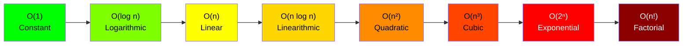
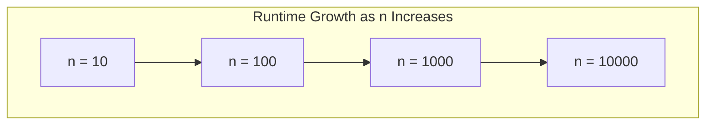

# Understanding Big O Notation & Time Complexity

> **The language of algorithm efficiency** - Master this, and you speak the same language as every top-tier tech interviewer.

---

## What is Big O?

### Formal Definition

Big O notation is a mathematical notation that describes the **limiting behavior** of a function when the argument tends towards infinity. In computer science, it classifies algorithms according to how their run time or space requirements grow as the input size grows.

**Mathematical Definition:**
```
f(n) = O(g(n)) if there exist positive constants c and n₀ such that:
0 <= f(n) <= c * g(n) for all n >= n₀
```

### The Intuition

Think of Big O as answering the question: **"How does my algorithm's performance scale?"**

- It describes the **worst-case scenario**
- It focuses on the **growth rate**, not exact runtime
- It **ignores constants** and **lower-order terms**
- It gives us a common language to compare algorithms

**Key Insight:** Big O doesn't tell you how fast your algorithm runs in seconds. It tells you how the runtime **changes** as input size increases.

### Why It Matters

| Without Big O | With Big O |
|---------------|------------|
| "My code runs in 2.3 seconds" | "My code runs in $O(n \log n)$" |
| Machine-dependent | Machine-independent |
| Input-specific | Scalability-focused |
| Hard to compare | Easy to compare |

---

## Common Time Complexities

### Mermaid Chart: Complexity Hierarchy



### Complexity Growth Visualization



### Visual Comparison Table

| Complexity | n=10 | n=100 | n=1,000 | n=10,000 | n=100,000 |
|------------|------|-------|---------|----------|-----------|
| **O(1)** | 1 | 1 | 1 | 1 | 1 |
| **O(log n)** | 3.3 | 6.6 | 10 | 13.3 | 16.6 |
| **O(n)** | 10 | 100 | 1,000 | 10,000 | 100,000 |
| **O(n log n)** | 33 | 664 | 10,000 | 133,000 | 1,660,000 |
| **O(n²)** | 100 | 10,000 | 1,000,000 | 100,000,000 | 10,000,000,000 |
| **O(2ⁿ)** | 1,024 | 1.27 × 10³⁰ | Overflow | Overflow | Overflow |
| **O(n!)** | 3,628,800 | Overflow | Overflow | Overflow | Overflow |

### Performance Classification

| Complexity | Name | Performance | Typical Use Cases |
|------------|------|-------------|-------------------|
| $O(1)$ | Constant | **Excellent** | Hash table lookup, array access |
| $O(\log n)$ | Logarithmic | **Excellent** | Binary search, balanced BST operations |
| $O(n)$ | Linear | **Good** | Simple search, single traversal |
| $O(n \log n)$ | Linearithmic | **Good** | Efficient sorting (merge sort, quicksort) |
| $O(n^2)$ | Quadratic | **Fair** | Simple sorting, nested iterations |
| $O(n^3)$ | Cubic | **Poor** | Matrix multiplication (naive) |
| $O(2^n)$ | Exponential | **Terrible** | Recursive Fibonacci, power set |
| $O(n!)$ | Factorial | **Catastrophic** | Permutations, traveling salesman (brute force) |

---

## Complexity by Data Structure

### Arrays

| Operation | Average Case | Worst Case | Notes |
|-----------|-------------|------------|-------|
| **Access by index** | $O(1)$ | $O(1)$ | Direct memory address calculation |
| **Search (unsorted)** | $O(n)$ | $O(n)$ | Must check each element |
| **Search (sorted)** | $O(\log n)$ | $O(\log n)$ | Binary search |
| **Insert at end** | $O(1)$ | $O(n)$ | Amortized $O(1)$ for dynamic arrays |
| **Insert at beginning** | $O(n)$ | $O(n)$ | Must shift all elements |
| **Insert at middle** | $O(n)$ | $O(n)$ | Must shift subsequent elements |
| **Delete at end** | $O(1)$ | $O(1)$ | No shifting required |
| **Delete at beginning** | $O(n)$ | $O(n)$ | Must shift all elements |
| **Delete at middle** | $O(n)$ | $O(n)$ | Must shift subsequent elements |

### Hash Tables (Hash Maps)

| Operation | Average Case | Worst Case | Notes |
|-----------|-------------|------------|-------|
| **Access** | $O(1)$ | $O(n)$ | Worst case: all keys collide |
| **Search** | $O(1)$ | $O(n)$ | Worst case: all keys in one bucket |
| **Insert** | $O(1)$ | $O(n)$ | Amortized $O(1)$ with good hash function |
| **Delete** | $O(1)$ | $O(n)$ | Depends on collision resolution |

**Pro Tip:** Hash tables are probably the most commonly used data structure in coding interviews. A hash map with a doubly-linked list can achieve $O(1)$ for both get and put operations in an LRU cache.

### Linked Lists

| Operation | Singly Linked | Doubly Linked | Notes |
|-----------|---------------|---------------|-------|
| **Access by index** | $O(n)$ | $O(n)$ | Must traverse from head |
| **Search** | $O(n)$ | $O(n)$ | Must traverse list |
| **Insert at head** | $O(1)$ | $O(1)$ | Just update pointers |
| **Insert at tail** | $O(n)$ / $O(1)$* | $O(1)$ | *$O(1)$ if tail pointer maintained |
| **Insert at middle** | $O(n)$ | $O(n)$ | Must find position first |
| **Delete at head** | $O(1)$ | $O(1)$ | Just update head pointer |
| **Delete at tail** | $O(n)$ | $O(1)$ | Singly: must find previous node |
| **Delete at middle** | $O(n)$ | $O(n)$ | Must find node first |

### Binary Search Trees (BST)

| Operation | Average Case | Worst Case (Unbalanced) | Balanced (AVL/Red-Black) |
|-----------|-------------|------------------------|--------------------------|
| **Search** | $O(\log n)$ | $O(n)$ | $O(\log n)$ |
| **Insert** | $O(\log n)$ | $O(n)$ | $O(\log n)$ |
| **Delete** | $O(\log n)$ | $O(n)$ | $O(\log n)$ |
| **Find Min/Max** | $O(\log n)$ | $O(n)$ | $O(\log n)$ |
| **In-order traversal** | $O(n)$ | $O(n)$ | $O(n)$ |

### Heaps (Priority Queues)

| Operation | Time Complexity | Notes |
|-----------|-----------------|-------|
| **Find Min/Max** | $O(1)$ | Root element |
| **Insert** | $O(\log n)$ | Bubble up |
| **Delete Min/Max** | $O(\log n)$ | Bubble down |
| **Build Heap** | $O(n)$ | Not $O(n \log n)$! |
| **Heapify** | $O(\log n)$ | Single node adjustment |

### Graphs

| Operation | Adjacency Matrix | Adjacency List |
|-----------|------------------|----------------|
| **Add Vertex** | $O(V^2)$ | $O(1)$ |
| **Add Edge** | $O(1)$ | $O(1)$ |
| **Remove Vertex** | $O(V^2)$ | $O(V + E)$ |
| **Remove Edge** | $O(1)$ | $O(E)$ |
| **Check if edge exists** | $O(1)$ | $O(\text{degree})$ |
| **Find all neighbors** | $O(V)$ | $O(\text{degree})$ |
| **Space Complexity** | $O(V^2)$ | $O(V + E)$ |

| Algorithm | Time Complexity | Space Complexity |
|-----------|-----------------|------------------|
| **BFS** | $O(V + E)$ | $O(V)$ |
| **DFS** | $O(V + E)$ | $O(V)$ |
| **Dijkstra's** | $O((V + E) \log V)$ | $O(V)$ |
| **Bellman-Ford** | $O(V \times E)$ | $O(V)$ |
| **Floyd-Warshall** | $O(V^3)$ | $O(V^2)$ |
| **Topological Sort** | $O(V + E)$ | $O(V)$ |

---

## How to Analyze Time Complexity

### Step-by-Step Method

```
┌─────────────────────────────────────────────────────────────┐
│  STEP 1: Identify the input size (n)                        │
│  └── What variable(s) affect the algorithm's runtime?       │
├─────────────────────────────────────────────────────────────┤
│  STEP 2: Count basic operations                             │
│  └── How many times does each operation execute?            │
├─────────────────────────────────────────────────────────────┤
│  STEP 3: Express as a function of n                         │
│  └── Write the total operation count as f(n)                │
├─────────────────────────────────────────────────────────────┤
│  STEP 4: Find the dominant term                             │
│  └── Which term grows fastest as n → ∞?                     │
├─────────────────────────────────────────────────────────────┤
│  STEP 5: Drop constants and lower-order terms               │
│  └── 3n² + 5n + 100 → O(n²)                                 │
└─────────────────────────────────────────────────────────────┘
```

### Simplification Rules

| Rule | Example | Result |
|------|---------|--------|
| Drop constants | $O(2n)$ | $O(n)$ |
| Drop lower-order terms | $O(n^2 + n)$ | $O(n^2)$ |
| Different inputs, different variables | $O(a + b)$ | $O(a + b)$ |
| Multiplication rule | $O(n) \times O(m)$ | $O(n \times m)$ |
| Addition rule | $O(n) + O(m)$ | $O(n + m)$ |

### Detailed Examples

#### Example 1: $O(1)$ - Constant Time

```python
def get_first_element(arr):
    if len(arr) > 0:
        return arr[0]  # Single operation, regardless of array size
    return None

# Analysis:
# - No loops
# - Fixed number of operations
# - Total: O(1)
```

::: info Complexity: Time O(1) · Space O(1)
- **Time:** Single array access operation; executes same number of operations regardless of array size
- **Space:** No additional memory allocated; only returns existing element
:::

#### Example 2: $O(n)$ - Linear Time

```python
def linear_search(arr, target):
    for item in arr:        # Loop runs n times
        if item == target:  # O(1) comparison
            return True
    return False

# Analysis:
# - Single loop iterates n times
# - Each iteration: O(1) work
# - Total: n × O(1) = O(n)
```

::: info Complexity: Time O(n) · Space O(1)
- **Time:** Worst case examines all n elements when target not found or at end
- **Space:** Only loop variable and boolean return; no auxiliary data structures
:::

#### Example 3: $O(n^2)$ - Quadratic Time

::: code-group

```python [Python]
def bubble_sort(arr):
    n = len(arr)
    for i in range(n):              # Outer loop: n iterations
        for j in range(n - 1):      # Inner loop: n-1 iterations
            if arr[j] > arr[j + 1]: # O(1) comparison
                arr[j], arr[j + 1] = arr[j + 1], arr[j]  # O(1) swap
    return arr

# Analysis:
# - Outer loop: n iterations
# - Inner loop: n-1 iterations per outer iteration
# - Total operations: n × (n-1) = n² - n
# - Drop lower-order term: O(n²)
```

```java [Java]
int[] bubbleSort(int[] arr) {
    int n = arr.length;
    for (int i = 0; i < n; i++) {
        for (int j = 0; j < n - 1; j++) {
            if (arr[j] > arr[j + 1]) {
                int tmp = arr[j]; arr[j] = arr[j + 1]; arr[j + 1] = tmp;
            }
        }
    }
    return arr;
}
```

:::

::: info Complexity: Time O(n^2) · Space O(1)
- **Time:** Nested loops result in n*(n-1) comparisons; grows quadratically with input size
- **Space:** Sorts in-place using only temporary variable for swapping
:::

#### Example 4: $O(\log n)$ - Logarithmic Time

::: code-group

```python [Python]
def binary_search(arr, target):
    left, right = 0, len(arr) - 1

    while left <= right:                    # Loop runs log₂(n) times
        mid = (left + right) // 2           # O(1)
        if arr[mid] == target:              # O(1)
            return mid
        elif arr[mid] < target:             # O(1)
            left = mid + 1
        else:
            right = mid - 1
    return -1

# Analysis:
# - Each iteration cuts search space in half
# - Starting with n elements: n → n/2 → n/4 → ... → 1
# - Number of halvings until 1: log₂(n)
# - Total: O(log n)
```

```java [Java]
int binarySearch(int[] arr, int target) {
    int left = 0, right = arr.length - 1;
    while (left <= right) {
        int mid = left + (right - left) / 2; // avoids overflow vs (left+right)/2
        if (arr[mid] == target) return mid;
        else if (arr[mid] < target) left = mid + 1;
        else right = mid - 1;
    }
    return -1;
}
```

:::

::: info Complexity: Time O(log n) · Space O(1)
- **Time:** Search space halves each iteration; after k iterations, size is n/2^k; reaches 1 when k = log n
- **Space:** Only three pointer variables (left, right, mid) regardless of array size
:::

#### Example 5: $O(n \log n)$ - Linearithmic Time

::: code-group

```python [Python]
def merge_sort(arr):
    if len(arr) <= 1:
        return arr

    mid = len(arr) // 2
    left = merge_sort(arr[:mid])    # Recursively sort left half
    right = merge_sort(arr[mid:])   # Recursively sort right half

    return merge(left, right)       # Merge: O(n)

def merge(left, right):
    result = []
    i = j = 0
    while i < len(left) and j < len(right):
        if left[i] <= right[j]:
            result.append(left[i])
            i += 1
        else:
            result.append(right[j])
            j += 1
    result.extend(left[i:])
    result.extend(right[j:])
    return result

# Analysis:
# - Divide: Split array in half (log n levels of recursion)
# - Conquer: Merge operation at each level is O(n)
# - Total: O(n) work × O(log n) levels = O(n log n)
```

```java [Java]
int[] mergeSort(int[] arr) {
    if (arr.length <= 1) return arr;
    int mid = arr.length / 2;
    int[] left = mergeSort(Arrays.copyOfRange(arr, 0, mid));
    int[] right = mergeSort(Arrays.copyOfRange(arr, mid, arr.length));
    return merge(left, right);
}

int[] merge(int[] left, int[] right) {
    int[] result = new int[left.length + right.length];
    int i = 0, j = 0, k = 0;
    while (i < left.length && j < right.length) {
        if (left[i] <= right[j]) result[k++] = left[i++];
        else result[k++] = right[j++];
    }
    while (i < left.length) result[k++] = left[i++];
    while (j < right.length) result[k++] = right[j++];
    return result;
}
```

:::

::: info Complexity: Time O(n log n) · Space O(n)
- **Time:** Recursion tree has log n levels; each level processes all n elements during merge
- **Space:** Each merge creates new arrays; at any time O(n) space for temporary storage plus O(log n) call stack
:::

#### Example 6: $O(2^n)$ - Exponential Time

```python
def fibonacci_recursive(n):
    if n <= 1:
        return n
    return fibonacci_recursive(n - 1) + fibonacci_recursive(n - 2)

# Analysis:
# - Each call spawns 2 recursive calls
# - Recursion tree has depth n
# - Total nodes in tree ≈ 2ⁿ
# - Total: O(2ⁿ)
```

::: info Complexity: Time O(2^n) · Space O(n)
- **Time:** Each call branches twice, creating tree with ~2^n nodes; massive redundant computation
- **Space:** Maximum recursion depth is n, so call stack holds n frames simultaneously
:::

::: code-group

```python [Python]
# Better approach - O(n) with memoization:
def fibonacci_memo(n, memo={}):
    if n in memo:
        return memo[n]
    if n <= 1:
        return n
    memo[n] = fibonacci_memo(n - 1, memo) + fibonacci_memo(n - 2, memo)
    return memo[n]
```

```java [Java]
// Better approach - O(n) with memoization:
int fibMemo(int n, Map<Integer, Integer> memo) {
    if (memo.containsKey(n)) return memo.get(n);
    if (n <= 1) return n;
    int result = fibMemo(n - 1, memo) + fibMemo(n - 2, memo);
    memo.put(n, result);
    return result;
}
```

:::

::: info Complexity: Time O(n) · Space O(n)
- **Time:** Each fib(i) computed exactly once and cached; n unique subproblems
- **Space:** Memo dictionary stores n values plus O(n) call stack depth
:::

#### Example 7: Multiple Input Variables

```python
def print_pairs(arr1, arr2):
    for item1 in arr1:        # O(a) where a = len(arr1)
        for item2 in arr2:    # O(b) where b = len(arr2)
            print(item1, item2)

# Analysis:
# - WRONG: O(n²) - This assumes both arrays have same size
# - CORRECT: O(a × b) - Use different variables for different inputs
```

::: info Complexity: Time O(a * b) · Space O(1)
- **Time:** Outer loop runs a times, inner loop runs b times for each; total a*b iterations
- **Space:** No auxiliary storage; just loop variables (print output not counted)
:::

---

## Common Patterns

### Pattern Recognition Cheat Sheet

| Pattern | Complexity | Example Algorithm | Code Pattern |
|---------|------------|-------------------|--------------|
| **Single loop** | $O(n)$ | Linear search | `for i in range(n)` |
| **Two sequential loops** | $O(n)$ | Two passes | `for...` then `for...` |
| **Nested loops (same array)** | $O(n^2)$ | Bubble sort | `for i... for j...` |
| **Nested loops (diff arrays)** | $O(n \times m)$ | Matrix operations | `for i in a... for j in b...` |
| **Divide and conquer** | $O(n \log n)$ | Merge sort | Split, recurse, combine |
| **Binary search pattern** | $O(\log n)$ | Binary search | Halve search space |
| **Three nested loops** | $O(n^3)$ | 3Sum (brute force) | Triple nested loops |
| **Recursion with branching** | $O(\text{branches}^{\text{depth}})$ | Fibonacci | Multiple recursive calls |
| **All subsets** | $O(2^n)$ | Power set | Include/exclude each element |
| **All permutations** | $O(n!)$ | Permutations | Arrange all elements |

### Loop Analysis Patterns

```python
# Pattern 1: Simple Loop - O(n)
for i in range(n):
    # O(1) work

# Pattern 2: Half Loop - O(n)  (still linear!)
for i in range(n // 2):
    # O(1) work

# Pattern 3: Nested Loops - O(n²)
for i in range(n):
    for j in range(n):
        # O(1) work

# Pattern 4: Triangular Loop - O(n²)
for i in range(n):
    for j in range(i, n):  # or range(i)
        # O(1) work
# Note: n + (n-1) + (n-2) + ... + 1 = n(n+1)/2 = O(n²)

# Pattern 5: Logarithmic Loop - O(log n)
i = n
while i > 0:
    # O(1) work
    i = i // 2

# Pattern 6: Nested with Log - O(n log n)
for i in range(n):       # O(n)
    j = n
    while j > 0:         # O(log n)
        # O(1) work
        j = j // 2
```

::: info Complexity Summary for Loop Patterns
- **Pattern 1-2:** O(n) - constant factor (1/2) dropped; linear growth
- **Pattern 3-4:** O(n^2) - triangular sum n(n+1)/2 simplifies to quadratic
- **Pattern 5:** O(log n) - halving means log n iterations until i reaches 0
- **Pattern 6:** O(n log n) - n outer iterations times log n inner iterations
:::

### Recursion Analysis

```python
# Pattern 1: Linear Recursion - O(n)
def linear_rec(n):
    if n <= 0:
        return
    linear_rec(n - 1)  # Single recursive call
```

::: info Complexity: Time O(n) · Space O(n)
- **Time:** Makes exactly n recursive calls before reaching base case
- **Space:** Call stack depth is n; each frame holds local state
:::

```python
# Pattern 2: Binary Recursion (like Fibonacci) - O(2ⁿ)
def binary_rec(n):
    if n <= 1:
        return n
    return binary_rec(n - 1) + binary_rec(n - 2)
```

::: info Complexity: Time O(2^n) · Space O(n)
- **Time:** Two recursive calls per invocation creates exponential tree; overlapping subproblems recomputed
- **Space:** Maximum stack depth is n (following the n-1 branch all the way down)
:::

```python
# Pattern 3: Divide and Conquer - O(n log n)
def divide_conquer(arr):
    if len(arr) <= 1:
        return arr
    mid = len(arr) // 2
    left = divide_conquer(arr[:mid])   # T(n/2)
    right = divide_conquer(arr[mid:])  # T(n/2)
    return merge(left, right)          # O(n)
# Recurrence: T(n) = 2T(n/2) + O(n) → O(n log n)
```

::: info Complexity: Time O(n log n) · Space O(n)
- **Time:** Two half-size subproblems plus O(n) merge; Master Theorem gives O(n log n)
- **Space:** O(n) for merge arrays at each level; O(log n) recursion depth
:::

### Master Theorem Quick Reference

For recurrences of the form: **$T(n) = aT(n/b) + O(n^d)$**

| Condition | Complexity |
|-----------|------------|
| $d > \log_b(a)$ | $O(n^d)$ |
| $d = \log_b(a)$ | $O(n^d \log n)$ |
| $d < \log_b(a)$ | $O(n^{\log_b(a)})$ |

**Common applications:**
- Binary Search: $T(n) = T(n/2) + O(1) \rightarrow O(\log n)$
- Merge Sort: $T(n) = 2T(n/2) + O(n) \rightarrow O(n \log n)$
- Binary Tree Traversal: $T(n) = 2T(n/2) + O(1) \rightarrow O(n)$

---

## Sorting Algorithms Comparison

| Algorithm | Best Case | Average Case | Worst Case | Space | Stable? |
|-----------|-----------|--------------|------------|-------|---------|
| **Bubble Sort** | $O(n)$ | $O(n^2)$ | $O(n^2)$ | $O(1)$ | Yes |
| **Selection Sort** | $O(n^2)$ | $O(n^2)$ | $O(n^2)$ | $O(1)$ | No |
| **Insertion Sort** | $O(n)$ | $O(n^2)$ | $O(n^2)$ | $O(1)$ | Yes |
| **Merge Sort** | $O(n \log n)$ | $O(n \log n)$ | $O(n \log n)$ | $O(n)$ | Yes |
| **Quick Sort** | $O(n \log n)$ | $O(n \log n)$ | $O(n^2)$ | $O(\log n)$ | No |
| **Heap Sort** | $O(n \log n)$ | $O(n \log n)$ | $O(n \log n)$ | $O(1)$ | No |
| **Counting Sort** | $O(n + k)$ | $O(n + k)$ | $O(n + k)$ | $O(k)$ | Yes |
| **Radix Sort** | $O(nk)$ | $O(nk)$ | $O(nk)$ | $O(n + k)$ | Yes |
| **Bucket Sort** | $O(n + k)$ | $O(n + k)$ | $O(n^2)$ | $O(n)$ | Yes |
| **Tim Sort** | $O(n)$ | $O(n \log n)$ | $O(n \log n)$ | $O(n)$ | Yes |

**Note:** Python's built-in `sort()` and `sorted()` use Tim Sort.

---

## Interview Expectations

### What Interviewers Expect You to Know

1. **Instant Recognition**: Identify time complexity of common operations without thinking
2. **Analysis Skills**: Derive complexity of novel algorithms during the interview
3. **Optimization Mindset**: Know when an algorithm can be improved and by how much
4. **Trade-off Discussion**: Understand time vs. space trade-offs
5. **Best/Average/Worst**: Know when each matters and be able to discuss all three

### Interview Best Practices

Based on guidance from top tech interview resources:

**Be Proactive:**
- Mention complexity analysis without being prompted
- State the complexity of your solution before the interviewer asks

**Explain Your Reasoning:**
- Walk through your thought process
- "This is O(n) because we iterate through the array once..."

**Use Precise Terminology:**
- Use Big O notation correctly
- Distinguish between O(n) and O(n²)

**Consider All Cases:**
- Discuss best, average, and worst-case scenarios when relevant
- "Best case is O(n) when already sorted, worst case is O(n²)"

**Propose Optimizations:**
- If you identify improvement opportunities, mention them
- "We could optimize this from O(n²) to O(n log n) using a sorted data structure"

### Common Interviewer Traps

1. **Multiple Input Variables**
   - Don't assume all inputs have the same size
   - Use different variables (n, m, k) for different inputs

2. **Hidden Loops**
   - String concatenation in loops: `str += char` is $O(n)$ per operation
   - List slicing: `arr[1:]` is $O(n)$
   - `in` operator on lists: $O(n)$, not $O(1)$

3. **Amortized vs. Worst Case**
   - Dynamic array append: Amortized $O(1)$, Worst $O(n)$
   - Know when to mention amortized analysis

4. **Log Base Doesn't Matter**
   - $O(\log_2 n) = O(\log_{10} n) = O(\log n)$
   - Log bases differ by a constant factor

### The Complexity Discussion Framework

When asked about complexity in an interview, use this structure:

```
1. STATE the complexity: "This algorithm runs in O(n log n) time"

2. EXPLAIN why: "We iterate through n elements, and for each
   element, we perform a binary search which is O(log n)"

3. DISCUSS space: "Space complexity is O(n) for the auxiliary array"

4. MENTION alternatives: "We could reduce space to O(1) by using
   an in-place algorithm, but that would change our approach"

5. CONSIDER trade-offs: "The O(n^2) solution is simpler to implement
   and might be acceptable for small inputs"
```

---

## Practice Problems by Complexity

### $O(1)$ - Constant

::: details Two Sum with Hash Map (LeetCode 1)
**Problem:** Find two numbers in an array that add up to a target.

**Key Insight:** Use hash map for O(1) lookups. Store complement = target - num as we iterate.

**Approach:** For each number, check if complement exists in map. If not, store current number.

**Complexity:** Time O(n), Space O(n) - but each lookup is O(1)
:::

::: details Design HashMap (LeetCode 706)
**Problem:** Implement a HashMap with O(1) average case operations.

**Key Insight:** Use array with hash function for direct indexing. Handle collisions with chaining or open addressing.

**Approach:** Hash key to bucket index, use linked list or probing for collisions.

**Complexity:** Time O(1) average for put/get/remove, Space O(n)
:::

### $O(\log n)$ - Logarithmic

::: details Binary Search (LeetCode 704)
**Problem:** Find target in sorted array, return index or -1.

**Key Insight:** Cut search space in half each iteration by comparing with middle element.

**Approach:** Maintain left and right pointers. Compare mid with target, adjust bounds accordingly.

**Complexity:** Time O(log n), Space O(1)
:::

::: details Search in Rotated Sorted Array (LeetCode 33)
**Problem:** Search in a sorted array that has been rotated at an unknown pivot.

**Key Insight:** One half is always sorted. Determine which half, check if target is in sorted half.

**Approach:** Find sorted half, check if target lies in it. Eliminate half of search space each step.

**Complexity:** Time O(log n), Space O(1)
:::

### $O(n)$ - Linear

::: details Maximum Subarray (LeetCode 53)
**Problem:** Find contiguous subarray with maximum sum.

**Key Insight:** At each position, either extend current subarray or start fresh (Kadane's algorithm).

**Approach:** Track current sum and max seen. If current sum goes negative, reset to 0.

**Complexity:** Time O(n), Space O(1)
:::

::: details Merge Two Sorted Lists (LeetCode 21)
**Problem:** Merge two sorted linked lists into one sorted list.

**Key Insight:** Compare heads of both lists, take smaller one, advance that pointer.

**Approach:** Use dummy head, iterate comparing and linking nodes until one list exhausted.

**Complexity:** Time O(n+m), Space O(1)
:::

### $O(n \log n)$ - Linearithmic

::: details Sort an Array (LeetCode 912)
**Problem:** Sort an array in ascending order without built-in functions in O(n log n).

**Key Insight:** Use divide-and-conquer (merge sort) or heap-based approach (heap sort).

**Approach:** Merge sort: divide in half, sort recursively, merge. Heap sort: build heap, extract max.

**Complexity:** Time O(n log n), Space O(n) for merge sort, O(1) for heap sort
:::

::: details Kth Largest Element (LeetCode 215)
**Problem:** Find the kth largest element in an unsorted array.

**Key Insight:** Partial sorting suffices - use quickselect or min-heap of size k.

**Approach:** Quickselect: partition around pivot, recurse on side containing k. Or maintain min-heap of k elements.

**Complexity:** Time O(n) average for quickselect, O(n log k) for heap. Space O(1) or O(k)
:::

### $O(n^2)$ - Quadratic

::: details 3Sum (LeetCode 15)
**Problem:** Find all unique triplets that sum to zero.

**Key Insight:** Sort array, fix first element, use two-pointer on remaining.

**Approach:** For each i, use two pointers (j, k) from i+1 and end. Skip duplicates.

**Complexity:** Time O(n^2), Space O(1) extra (output doesn't count)
:::

::: details Longest Palindromic Substring (LeetCode 5)
**Problem:** Find the longest palindromic substring.

**Key Insight:** Expand around center for each position. Check both odd and even length palindromes.

**Approach:** For each index, expand outward while characters match. Track longest found.

**Complexity:** Time O(n^2), Space O(1)
:::

### $O(2^n)$ - Exponential

::: details Subsets (LeetCode 78)
**Problem:** Generate all subsets (power set) of an array.

**Key Insight:** Each element has binary choice: include or exclude. Total 2^n subsets.

**Approach:** Backtracking or iterative: for each element, add it to all existing subsets.

**Complexity:** Time O(n * 2^n), Space O(n * 2^n) for output
:::

::: details Word Break II (LeetCode 140)
**Problem:** Return all possible sentences from string using dictionary words.

**Key Insight:** Exponential possibilities in worst case. Use memoization to avoid recomputation.

**Approach:** Backtracking with memoization. At each position, try all dictionary words that match prefix.

**Complexity:** Time O(2^n) worst case, Space O(2^n) for output
:::

### $O(n!)$ - Factorial

::: details Permutations (LeetCode 46)
**Problem:** Generate all permutations of an array.

**Key Insight:** n! permutations exist. Use backtracking with swap or visited array.

**Approach:** Fix each element at first position, recursively permute rest. Swap back after recursion.

**Complexity:** Time O(n * n!), Space O(n) for recursion stack
:::

::: details N-Queens (LeetCode 51)
**Problem:** Place n queens on n x n chessboard so no two attack each other.

**Key Insight:** Place one queen per row, track attacked columns and diagonals.

**Approach:** Backtracking. For each row, try each column if not attacked. Use sets for O(1) conflict check.

**Complexity:** Time O(n!), Space O(n)
:::

---

## Quick Reference Card

```
╔══════════════════════════════════════════════════════════════════╗
║                    BIG O QUICK REFERENCE                         ║
╠══════════════════════════════════════════════════════════════════╣
║                                                                  ║
║  EXCELLENT PERFORMANCE                                           ║
║  ├── O(1)      : Hash lookup, array access                       ║
║  └── O(log n)  : Binary search, balanced tree operations         ║
║                                                                  ║
║  GOOD PERFORMANCE                                                ║
║  ├── O(n)      : Single pass, linear search                      ║
║  └── O(n log n): Efficient sorting (merge, heap, quick)          ║
║                                                                  ║
║  ACCEPTABLE FOR SMALL INPUTS                                     ║
║  ├── O(n²)     : Nested loops, simple sorting                    ║
║  └── O(n³)     : Triple nested loops                             ║
║                                                                  ║
║  AVOID IF POSSIBLE                                               ║
║  ├── O(2ⁿ)    : Exponential recursion                           ║
║  └── O(n!)     : Permutations, brute force                       ║
║                                                                  ║
╠══════════════════════════════════════════════════════════════════╣
║                    ANALYSIS RULES                                 ║
╠══════════════════════════════════════════════════════════════════╣
║                                                                  ║
║  1. Drop constants:     O(2n) → O(n)                             ║
║  2. Drop lower terms:   O(n² + n) → O(n²)                        ║
║  3. Different inputs:   O(n + m), not O(2n)                      ║
║  4. Sequential:         O(n) + O(m) = O(n + m)                   ║
║  5. Nested:             O(n) × O(m) = O(n × m)                   ║
║                                                                  ║
╚══════════════════════════════════════════════════════════════════╝
```

---

## Additional Resources

### Recommended Reading

- **"Cracking the Coding Interview" Chapter 6** - Excellent complexity practice problems
- **Introduction to Algorithms (CLRS)** - The definitive academic reference
- **Algorithm Design Manual** - Practical algorithm analysis

### Online Practice

- LeetCode complexity tags
- GeeksforGeeks time complexity practice
- InterviewBit time complexity course

### Key Takeaways

1. **Big O is about growth rate**, not absolute performance
2. **Always consider the worst case** unless asked otherwise
3. **Use different variables** for different inputs
4. **Practice recognizing patterns** - it becomes intuitive
5. **Discuss complexity proactively** in interviews

---

## Sources

- [Big O Notation Tutorial - GeeksforGeeks](https://www.geeksforgeeks.org/dsa/analysis-algorithms-big-o-analysis/)
- [Big O Cheat Sheet - freeCodeCamp](https://www.freecodecamp.org/news/big-o-cheat-sheet-time-complexity-chart/)
- [Big O Notation and Time Complexity Guide - DataCamp](https://www.datacamp.com/tutorial/big-o-notation-time-complexity)
- [Big O Notation - Interview Cake](https://www.interviewcake.com/article/java/big-o-notation-time-and-space-complexity)
- [Demystifying Big-O Notation - Design Gurus](https://www.designgurus.io/blog/big-o-algorithm-complexity)
- [Time Complexity - Interviews.school](https://interviews.school/timecomplexity/)
- [Understanding Time Complexity - AlgoCademy](https://algocademy.com/blog/understanding-time-complexity-a-crucial-skill-for-coding-interviews/)
- [Data Structures and Algorithms Study Cheatsheets - Tech Interview Handbook](https://www.techinterviewhandbook.org/algorithms/study-cheatsheet/)
- [Big O Notation - Wikipedia](https://en.wikipedia.org/wiki/Big_O_notation)
- [Time Complexity - InterviewBit](https://www.interviewbit.com/courses/programming/time-complexity/)

---

*Last updated: January 2026*
