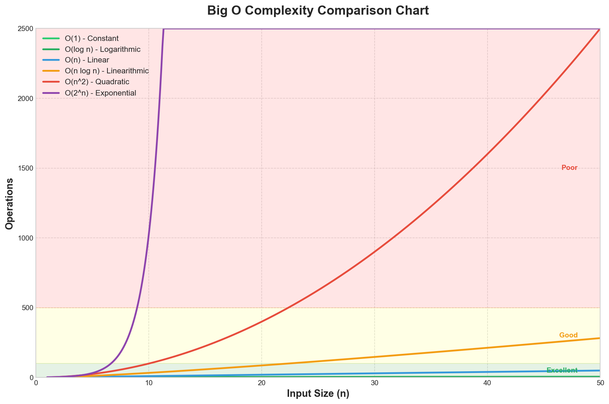

# Algorithm Complexity Analysis

> **Master the language of algorithm efficiency** - Understanding complexity is fundamental to acing technical interviews and writing scalable code.

---

## Overview

This section covers everything you need to know about algorithm complexity analysis for coding interviews:

- **[Big O Notation & Time Complexity](./big-o-time.md)** - Comprehensive guide to understanding and analyzing time complexity
- **[Space Complexity & Optimization](./space-optimization.md)** - Memory analysis and optimization techniques

---

## Complexity Comparison Chart

The following chart visualizes how different time complexities scale as input size increases:

**Key Takeaway:** The chart clearly shows why algorithm choice matters. An O(n^2) algorithm becomes impractical much faster than O(n log n) as input grows.

---

## Big O Cheat Sheet

### Common Time Complexities (Best to Worst)

| Complexity | Name | Performance | Description | Example |
|------------|------|-------------|-------------|---------|
| O(1) | Constant | Excellent | Same time regardless of input size | Hash table lookup, array access by index |
| O(log n) | Logarithmic | Excellent | Halves the problem space each step | Binary search, balanced BST operations |
| O(n) | Linear | Good | Time grows proportionally with input | Linear search, single array traversal |
| O(n log n) | Linearithmic | Good | Optimal comparison-based sorting | Merge sort, heap sort, quick sort (avg) |
| O(n^2) | Quadratic | Fair | Nested iterations over input | Bubble sort, insertion sort, checking all pairs |
| O(n^3) | Cubic | Poor | Triple nested loops | Naive matrix multiplication, Floyd-Warshall |
| O(2^n) | Exponential | Terrible | Doubles with each additional input | Recursive Fibonacci, generating all subsets |
| O(n!) | Factorial | Catastrophic | All permutations of input | Traveling salesman (brute force), permutations |

### Growth Rate Comparison

| n | O(1) | O(log n) | O(n) | O(n log n) | O(n^2) | O(2^n) |
|---|------|----------|------|------------|--------|--------|
| 10 | 1 | 3.3 | 10 | 33 | 100 | 1,024 |
| 100 | 1 | 6.6 | 100 | 664 | 10,000 | 1.27 x 10^30 |
| 1,000 | 1 | 10 | 1,000 | 10,000 | 1,000,000 | Overflow |
| 10,000 | 1 | 13.3 | 10,000 | 133,000 | 100,000,000 | Overflow |
| 100,000 | 1 | 16.6 | 100,000 | 1,660,000 | 10,000,000,000 | Overflow |

---

## Data Structure Operations

### Arrays

| Operation | Average | Worst | Notes |
|-----------|---------|-------|-------|
| Access by index | O(1) | O(1) | Direct memory calculation |
| Search (unsorted) | O(n) | O(n) | Linear scan required |
| Search (sorted) | O(log n) | O(log n) | Binary search |
| Insert at end | O(1)* | O(n) | *Amortized for dynamic arrays |
| Insert at beginning | O(n) | O(n) | Shift all elements |
| Delete at end | O(1) | O(1) | No shifting needed |
| Delete at beginning | O(n) | O(n) | Shift all elements |

### Hash Tables (HashMap/HashSet)

| Operation | Average | Worst | Notes |
|-----------|---------|-------|-------|
| Access/Search | O(1) | O(n) | Worst case: all keys collide |
| Insert | O(1) | O(n) | Amortized with good hash function |
| Delete | O(1) | O(n) | Depends on collision handling |

### Linked Lists

| Operation | Singly Linked | Doubly Linked |
|-----------|---------------|---------------|
| Access by index | O(n) | O(n) |
| Search | O(n) | O(n) |
| Insert at head | O(1) | O(1) |
| Insert at tail | O(n) / O(1)* | O(1) |
| Delete at head | O(1) | O(1) |
| Delete at tail | O(n) | O(1) |

*O(1) if tail pointer is maintained

### Binary Search Trees

| Operation | Average (Balanced) | Worst (Unbalanced) |
|-----------|-------------------|-------------------|
| Search | O(log n) | O(n) |
| Insert | O(log n) | O(n) |
| Delete | O(log n) | O(n) |
| Find Min/Max | O(log n) | O(n) |

### Heaps (Priority Queues)

| Operation | Time Complexity | Notes |
|-----------|-----------------|-------|
| Find Min/Max | O(1) | Root element |
| Insert | O(log n) | Bubble up |
| Extract Min/Max | O(log n) | Bubble down |
| Build Heap | O(n) | Not O(n log n)! |

### Graphs

| Operation | Adjacency Matrix | Adjacency List |
|-----------|------------------|----------------|
| Add Vertex | O(V^2) | O(1) |
| Add Edge | O(1) | O(1) |
| Remove Edge | O(1) | O(E) |
| Check Edge | O(1) | O(degree) |
| Space | O(V^2) | O(V + E) |
| BFS/DFS | O(V^2) | O(V + E) |

---

## Sorting Algorithm Complexity

| Algorithm | Best | Average | Worst | Space | Stable |
|-----------|------|---------|-------|-------|--------|
| **Bubble Sort** | O(n) | O(n^2) | O(n^2) | O(1) | Yes |
| **Selection Sort** | O(n^2) | O(n^2) | O(n^2) | O(1) | No |
| **Insertion Sort** | O(n) | O(n^2) | O(n^2) | O(1) | Yes |
| **Merge Sort** | O(n log n) | O(n log n) | O(n log n) | O(n) | Yes |
| **Quick Sort** | O(n log n) | O(n log n) | O(n^2) | O(log n) | No |
| **Heap Sort** | O(n log n) | O(n log n) | O(n log n) | O(1) | No |
| **Counting Sort** | O(n + k) | O(n + k) | O(n + k) | O(k) | Yes |
| **Radix Sort** | O(nk) | O(nk) | O(nk) | O(n + k) | Yes |
| **Tim Sort** | O(n) | O(n log n) | O(n log n) | O(n) | Yes |

**Notes:**
- k = range of input values (for counting/radix sort)
- Tim Sort is Python's built-in sorting algorithm
- Quick Sort's O(n^2) worst case occurs with poor pivot selection
- Merge Sort guarantees O(n log n) but requires extra space

---

## Quick Analysis Rules

### Simplification Rules

| Rule | Example | Result |
|------|---------|--------|
| Drop constants | O(2n) | O(n) |
| Drop lower-order terms | O(n^2 + n) | O(n^2) |
| Different inputs = different variables | O(a + b) | O(a + b) |
| Sequential operations add | O(n) + O(m) | O(n + m) |
| Nested operations multiply | O(n) * O(m) | O(n * m) |

### Common Patterns

| Code Pattern | Time Complexity |
|--------------|-----------------|
| Single loop through n elements | O(n) |
| Two sequential loops | O(n) |
| Nested loops (same array) | O(n^2) |
| Nested loops (different arrays) | O(n * m) |
| Loop with halving (while n > 0: n //= 2) | O(log n) |
| Recursive binary division + merge | O(n log n) |
| Generating all subsets | O(2^n) |
| Generating all permutations | O(n!) |

---

## Interview Tips

1. **Always state complexity proactively** - Don't wait for the interviewer to ask
2. **Explain your reasoning** - "This is O(n) because we traverse the array once..."
3. **Consider all cases** - Discuss best, average, and worst case when relevant
4. **Watch for hidden costs**:
   - String concatenation in loops: O(n) per operation
   - List slicing: O(n)
   - `in` operator on lists: O(n), not O(1)
5. **Propose optimizations** - Show you can identify improvement opportunities

---

## Related Topics

- [Big O Notation & Time Complexity](./big-o-time.md) - Deep dive into time complexity analysis
- [Space Complexity & Optimization](./space-optimization.md) - Memory efficiency and tradeoffs

---

*Last updated: January 2026*
