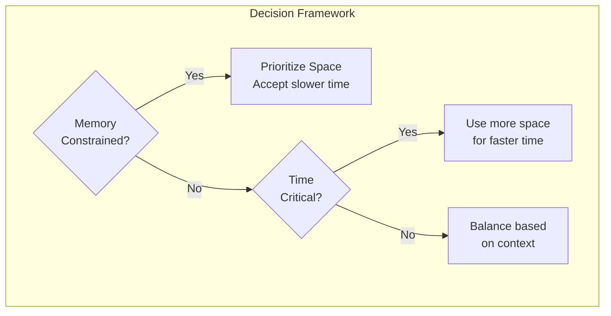
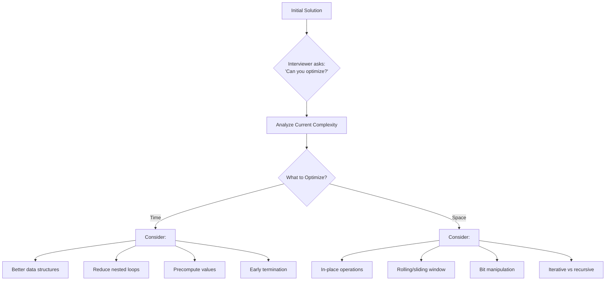

# Space Complexity & Algorithm Optimization

> **Memory efficiency and optimization strategies**

---

## Understanding Space Complexity

Space complexity measures the total amount of memory an algorithm needs to run as a function of the input size. It is crucial for understanding how efficiently an algorithm uses memory resources and is a key consideration in coding interviews.

### What Counts as Space?

| Component | Description | Typically Counted? |
|-----------|-------------|-------------------|
| **Input Space** | Memory used to store the input data | Usually excluded |
| **Auxiliary Space** | Extra memory used during execution | **Yes - primary measure** |
| **Recursion Stack** | Memory for function call frames | Yes |
| **Output Space** | Memory for storing results | Depends on context |

**Key Formula:**
```
Space Complexity = Auxiliary Space + Input Space
```

However, in most interview contexts, we focus on **auxiliary space** - the extra space used beyond the input.

### Common Space Complexities

| Complexity | Name | Example |
|------------|------|---------|
| $O(1)$ | Constant | Swapping two variables, in-place array reversal |
| $O(\log n)$ | Logarithmic | Balanced BST operations, binary search recursion |
| $O(n)$ | Linear | Creating a copy of an array, hash map for lookup |
| $O(n \log n)$ | Linearithmic | Merge sort (due to auxiliary arrays) |
| $O(n^2)$ | Quadratic | 2D matrix, adjacency matrix for graph |
| $O(2^n)$ | Exponential | Storing all subsets of a set |

---

## Space Analysis Examples

### $O(1)$ Space - In-Place Algorithm

:::code-group

```python [Python]
def reverse_in_place(arr):
    """
    Reverses array in-place using two pointers.
    Space: O(1) - only uses two pointer variables
    """
    left, right = 0, len(arr) - 1
    while left < right:
        arr[left], arr[right] = arr[right], arr[left]
        left += 1
        right -= 1
    return arr
```

```java [Java]
int[] reverseInPlace(int[] arr) {
    int left = 0, right = arr.length - 1;
    while (left < right) {
        int tmp = arr[left]; arr[left] = arr[right]; arr[right] = tmp;
        left++; right--;
    }
    return arr;
}
```

:::

::: info Complexity: Time O(n) · Space O(1)
- **Time:** Iterates through half the array (n/2 swaps), which simplifies to O(n)
- **Space:** Only two integer pointers used regardless of array size
:::

```python
def find_max(arr):
    """
    Finds maximum element.
    Space: O(1) - single variable regardless of input size
    """
    max_val = float('-inf')
    for num in arr:
        max_val = max(max_val, num)
    return max_val
```

::: info Complexity: Time O(n) · Space O(1)
- **Time:** Single pass through all n elements with O(1) comparison per element
- **Space:** Single variable to track maximum, constant regardless of input size
:::

### $O(n)$ Space - Linear

```python
def reverse_with_copy(arr):
    """
    Creates a new reversed array.
    Space: O(n) - new array of same size as input
    """
    return arr[::-1]  # Creates new array
```

::: info Complexity: Time O(n) · Space O(n)
- **Time:** Slice operation copies all n elements in reverse order
- **Space:** Creates a new array containing all n elements
:::

:::code-group

```python [Python]
def two_sum_hash(arr, target):
    """
    Finds two numbers that sum to target.
    Space: O(n) - hash map may store up to n elements
    """
    seen = {}  # Hash map for O(1) lookup
    for i, num in enumerate(arr):
        complement = target - num
        if complement in seen:
            return [seen[complement], i]
        seen[num] = i
    return []
```

```java [Java]
int[] twoSumHash(int[] arr, int target) {
    Map<Integer, Integer> seen = new HashMap<>();
    for (int i = 0; i < arr.length; i++) {
        int complement = target - arr[i];
        if (seen.containsKey(complement)) return new int[]{seen.get(complement), i};
        seen.put(arr[i], i);
    }
    return new int[]{};
}
```

:::

::: info Complexity: Time O(n) · Space O(n)
- **Time:** Single pass with O(1) hash operations per element
- **Space:** Hash map stores up to n elements in worst case (no pair found)
:::

### $O(n)$ Space - Recursion Stack

```python
def factorial(n):
    """
    Calculates n! recursively.
    Space: O(n) - n stack frames on call stack
    """
    if n <= 1:
        return 1
    return n * factorial(n - 1)  # Each call adds a stack frame
```

::: info Complexity: Time O(n) · Space O(n)
- **Time:** Makes n recursive calls, each doing O(1) multiplication
- **Space:** Call stack grows to depth n, with each frame storing local variables
:::

:::code-group

```python [Python]
def binary_search_recursive(arr, target, left, right):
    """
    Binary search using recursion.
    Space: O(log n) - log n stack frames due to halving
    """
    if left > right:
        return -1

    mid = (left + right) // 2
    if arr[mid] == target:
        return mid
    elif arr[mid] < target:
        return binary_search_recursive(arr, target, mid + 1, right)
    else:
        return binary_search_recursive(arr, target, left, mid - 1)
```

```java [Java]
int binarySearchRecursive(int[] arr, int target, int left, int right) {
    if (left > right) return -1;
    int mid = left + (right - left) / 2;
    if (arr[mid] == target) return mid;
    else if (arr[mid] < target) return binarySearchRecursive(arr, target, mid + 1, right);
    else return binarySearchRecursive(arr, target, left, mid - 1);
}
```

:::

::: info Complexity: Time O(log n) · Space O(log n)
- **Time:** Search space halves each iteration, giving log n comparisons
- **Space:** Recursion depth is log n since input halves each call
:::

### $O(n^2)$ Space - Quadratic

:::code-group

```python [Python]
def create_adjacency_matrix(n, edges):
    """
    Creates adjacency matrix for graph.
    Space: O(n^2) - n x n matrix
    """
    matrix = [[0] * n for _ in range(n)]
    for u, v in edges:
        matrix[u][v] = 1
        matrix[v][u] = 1  # Undirected graph
    return matrix
```

```java [Java]
int[][] createAdjacencyMatrix(int n, int[][] edges) {
    int[][] matrix = new int[n][n];
    for (int[] edge : edges) {
        matrix[edge[0]][edge[1]] = 1;
        matrix[edge[1]][edge[0]] = 1; // undirected
    }
    return matrix;
}
```

:::

::: info Complexity: Time O(n^2 + E) · Space O(n^2)
- **Time:** O(n^2) to initialize matrix, O(E) to populate edges
- **Space:** n x n matrix requires n^2 cells regardless of edge count
:::

---

## Time-Space Tradeoffs

One of the most important concepts in algorithm design is understanding that optimizing for time often requires more space, and vice versa. This tradeoff is fundamental to algorithm optimization.

### Tradeoff Visualization

```mermaid
graph LR
    subgraph "Time-Space Tradeoff Spectrum"
        A[O(n^2) Time<br/>O(1) Space] -->|Trade Space| B[O(n log n) Time<br/>O(n) Space]
        B -->|Trade Space| C[O(n) Time<br/>O(n) Space]
        C -->|Trade Space| D[O(1) Time*<br/>O(n^2) Space]
    end

    style A fill:#ffcccc
    style B fill:#ffffcc
    style C fill:#ccffcc
    style D fill:#ccccff
```



### Classic Tradeoff Examples

#### 1. Hash Table for Two Sum

:::code-group

```python [Python]
# Brute Force: O(n^2) time, O(1) space
def two_sum_brute(arr, target):
    for i in range(len(arr)):
        for j in range(i + 1, len(arr)):
            if arr[i] + arr[j] == target:
                return [i, j]
    return []

# Optimized: O(n) time, O(n) space
def two_sum_hash(arr, target):
    seen = {}
    for i, num in enumerate(arr):
        if target - num in seen:
            return [seen[target - num], i]
        seen[num] = i
    return []
```

```java [Java]
// Brute Force: O(n^2) time, O(1) space
int[] twoSumBrute(int[] arr, int target) {
    for (int i = 0; i < arr.length; i++)
        for (int j = i + 1; j < arr.length; j++)
            if (arr[i] + arr[j] == target) return new int[]{i, j};
    return new int[]{};
}

// Optimized: O(n) time, O(n) space
int[] twoSumHash(int[] arr, int target) {
    Map<Integer, Integer> seen = new HashMap<>();
    for (int i = 0; i < arr.length; i++) {
        if (seen.containsKey(target - arr[i])) return new int[]{seen.get(target - arr[i]), i};
        seen.put(arr[i], i);
    }
    return new int[]{};
}
```

:::

::: info Complexity: Time O(n) · Space O(n)
- **Time:** Single pass with O(1) hash lookup per element
- **Space:** Hash map stores up to n elements
:::

**Tradeoff:** Using $O(n)$ extra space saves $O(n)$ time (from $O(n^2)$ to $O(n)$)

#### 2. DP Memoization

:::code-group

```python [Python]
# Without memoization: O(2^n) time, O(n) stack space
def fib_naive(n):
    if n <= 1:
        return n
    return fib_naive(n - 1) + fib_naive(n - 2)

# With memoization: O(n) time, O(n) space
def fib_memo(n, memo={}):
    if n in memo:
        return memo[n]
    if n <= 1:
        return n
    memo[n] = fib_memo(n - 1, memo) + fib_memo(n - 2, memo)
    return memo[n]
```

```java [Java]
// Without memoization: O(2^n) time, O(n) stack
int fibNaive(int n) {
    if (n <= 1) return n;
    return fibNaive(n - 1) + fibNaive(n - 2);
}

// With memoization: O(n) time, O(n) space
int fibMemo(int n, Map<Integer, Integer> memo) {
    if (memo.containsKey(n)) return memo.get(n);
    if (n <= 1) return n;
    int result = fibMemo(n - 1, memo) + fibMemo(n - 2, memo);
    memo.put(n, result);
    return result;
}
```

:::

::: info Complexity: Time O(n) · Space O(n)
- **Time:** Each fib(i) computed once and cached, giving n computations total
- **Space:** Memo dict stores n entries plus O(n) call stack
:::

**Tradeoff:** $O(n)$ space provides exponential time savings

#### 3. Sorting vs Hash Set for Duplicates

```python
# Sorting approach: O(n log n) time, O(1) or O(n) space
def has_duplicates_sort(arr):
    arr.sort()  # In-place: O(1) space, but modifies input
    for i in range(1, len(arr)):
        if arr[i] == arr[i - 1]:
            return True
    return False
```

::: info Complexity: Time O(n log n) · Space O(1)
- **Time:** Sorting dominates at O(n log n), linear scan adds O(n)
- **Space:** In-place sort uses O(1) auxiliary space (modifies input array)
:::

```python
# Hash set approach: O(n) time, O(n) space
def has_duplicates_hash(arr):
    seen = set()
    for num in arr:
        if num in seen:
            return True
        seen.add(num)
    return False
```

::: info Complexity: Time O(n) · Space O(n)
- **Time:** Single pass with O(1) set operations per element
- **Space:** Set stores up to n elements if no duplicates found
:::

**Tradeoff Analysis:**
| Approach | Time | Space | Modifies Input |
|----------|------|-------|----------------|
| Sorting | $O(n \log n)$ | $O(1)$* | Yes |
| Hash Set | $O(n)$ | $O(n)$ | No |

---

## Optimization Techniques

### In-Place Algorithms

In-place algorithms transform input data without requiring additional space proportional to input size.

#### When to Use In-Place:
- Memory is constrained
- Working with large datasets
- Input modification is acceptable
- Real-time systems with memory limits

#### Dutch National Flag (3-way Partition)

:::code-group

```python [Python]
def sort_colors(nums):
    """
    Sorts array containing only 0, 1, 2 in-place.
    Space: O(1) - uses only three pointers
    """
    low, mid, high = 0, 0, len(nums) - 1

    while mid <= high:
        if nums[mid] == 0:
            nums[low], nums[mid] = nums[mid], nums[low]
            low += 1
            mid += 1
        elif nums[mid] == 1:
            mid += 1
        else:  # nums[mid] == 2
            nums[mid], nums[high] = nums[high], nums[mid]
            high -= 1

    return nums
```

```java [Java]
void sortColors(int[] nums) {
    int low = 0, mid = 0, high = nums.length - 1;
    while (mid <= high) {
        if (nums[mid] == 0) {
            int tmp = nums[low]; nums[low] = nums[mid]; nums[mid] = tmp;
            low++; mid++;
        } else if (nums[mid] == 1) {
            mid++;
        } else {
            int tmp = nums[mid]; nums[mid] = nums[high]; nums[high] = tmp;
            high--;
        }
    }
}
```

:::

::: info Complexity: Time O(n) · Space O(1)
- **Time:** Single pass through array; each element examined at most twice
- **Space:** Three pointer variables only, regardless of input size
:::

#### In-Place Array Rotation

:::code-group

```python [Python]
def rotate_array(nums, k):
    """
    Rotates array by k positions in-place.
    Space: O(1) - only uses reversal helper
    """
    n = len(nums)
    k = k % n  # Handle k > n

    def reverse(start, end):
        while start < end:
            nums[start], nums[end] = nums[end], nums[start]
            start += 1
            end -= 1

    # Reverse entire array, then reverse parts
    reverse(0, n - 1)
    reverse(0, k - 1)
    reverse(k, n - 1)
```

```java [Java]
void rotateArray(int[] nums, int k) {
    int n = nums.length;
    k = k % n;
    reverse(nums, 0, n - 1);
    reverse(nums, 0, k - 1);
    reverse(nums, k, n - 1);
}

private void reverse(int[] nums, int start, int end) {
    while (start < end) {
        int tmp = nums[start]; nums[start] = nums[end]; nums[end] = tmp;
        start++; end--;
    }
}
```

:::

::: info Complexity: Time O(n) · Space O(1)
- **Time:** Three reversal passes, each touching subset of n elements (total ~2n operations)
- **Space:** Only pointer variables in reverse helper; no auxiliary arrays
:::

### Space Optimization in Dynamic Programming

DP problems often use $O(n)$ or $O(n^2)$ space, but many can be optimized.

#### Fibonacci: $O(n)$ to $O(1)$ Space

:::code-group

```python [Python]
# Before: O(n) space
def fib(n):
    if n <= 1:
        return n
    dp = [0] * (n + 1)
    dp[1] = 1
    for i in range(2, n + 1):
        dp[i] = dp[i-1] + dp[i-2]
    return dp[n]

# After: O(1) space
def fib_optimized(n):
    if n <= 1:
        return n
    prev, curr = 0, 1
    for _ in range(2, n + 1):
        prev, curr = curr, prev + curr
    return curr
```

```java [Java]
// Before: O(n) space
int fib(int n) {
    if (n <= 1) return n;
    int[] dp = new int[n + 1];
    dp[1] = 1;
    for (int i = 2; i <= n; i++) dp[i] = dp[i-1] + dp[i-2];
    return dp[n];
}

// After: O(1) space
int fibOptimized(int n) {
    if (n <= 1) return n;
    int prev = 0, curr = 1;
    for (int i = 2; i <= n; i++) { int next = prev + curr; prev = curr; curr = next; }
    return curr;
}
```

:::

::: info Complexity: Time O(n) · Space O(1)
- **Time:** Same O(n) iterations as DP version
- **Space:** Only two variables needed since fib(i) depends only on fib(i-1) and fib(i-2)
:::

#### Climbing Stairs Optimization

:::code-group

```python [Python]
# O(n) space version
def climb_stairs_dp(n):
    if n <= 2:
        return n
    dp = [0] * (n + 1)
    dp[1], dp[2] = 1, 2
    for i in range(3, n + 1):
        dp[i] = dp[i-1] + dp[i-2]
    return dp[n]

# O(1) space version
def climb_stairs_optimized(n):
    if n <= 2:
        return n
    one_back, two_back = 2, 1
    for _ in range(3, n + 1):
        one_back, two_back = one_back + two_back, one_back
    return one_back
```

```java [Java]
// O(n) space version
int climbStairsDP(int n) {
    if (n <= 2) return n;
    int[] dp = new int[n + 1];
    dp[1] = 1; dp[2] = 2;
    for (int i = 3; i <= n; i++) dp[i] = dp[i-1] + dp[i-2];
    return dp[n];
}

// O(1) space version
int climbStairsOptimized(int n) {
    if (n <= 2) return n;
    int oneBack = 2, twoBack = 1;
    for (int i = 3; i <= n; i++) { int next = oneBack + twoBack; twoBack = oneBack; oneBack = next; }
    return oneBack;
}
```

:::

::: info Complexity: Time O(n) · Space O(1)
- **Time:** Same O(n) loop iterations
- **Space:** Rolling variables replace array; only last two values needed
:::

#### 2D DP Optimization: Unique Paths

:::code-group

```python [Python]
# O(m*n) space
def unique_paths_2d(m, n):
    dp = [[1] * n for _ in range(m)]
    for i in range(1, m):
        for j in range(1, n):
            dp[i][j] = dp[i-1][j] + dp[i][j-1]
    return dp[m-1][n-1]

# O(n) space - use single row
def unique_paths_1d(m, n):
    dp = [1] * n
    for _ in range(1, m):
        for j in range(1, n):
            dp[j] += dp[j-1]
    return dp[n-1]
```

```java [Java]
// O(m*n) space
int uniquePaths2D(int m, int n) {
    int[][] dp = new int[m][n];
    for (int[] row : dp) Arrays.fill(row, 1);
    for (int i = 1; i < m; i++)
        for (int j = 1; j < n; j++)
            dp[i][j] = dp[i-1][j] + dp[i][j-1];
    return dp[m-1][n-1];
}

// O(n) space - single row
int uniquePaths1D(int m, int n) {
    int[] dp = new int[n];
    Arrays.fill(dp, 1);
    for (int i = 1; i < m; i++)
        for (int j = 1; j < n; j++)
            dp[j] += dp[j-1];
    return dp[n-1];
}
```

:::

::: info Complexity: Time O(m*n) · Space O(n)
- **Time:** Same O(m*n) operations as 2D version
- **Space:** Only one row needed; dp[j] represents "from above" before update, "current" after
:::

#### Minimum Path Sum Optimization

:::code-group

```python [Python]
# O(1) extra space by modifying input (if allowed)
def min_path_sum(grid):
    m, n = len(grid), len(grid[0])

    # Fill first row
    for j in range(1, n):
        grid[0][j] += grid[0][j-1]

    # Fill first column
    for i in range(1, m):
        grid[i][0] += grid[i-1][0]

    # Fill rest
    for i in range(1, m):
        for j in range(1, n):
            grid[i][j] += min(grid[i-1][j], grid[i][j-1])

    return grid[m-1][n-1]

# O(n) space without modifying input
def min_path_sum_optimized(grid):
    m, n = len(grid), len(grid[0])
    dp = [float('inf')] * (n + 1)
    dp[1] = 0

    for i in range(m):
        for j in range(n):
            dp[j + 1] = min(dp[j], dp[j + 1]) + grid[i][j]

    return dp[n]
```

```java [Java]
// O(1) extra space by modifying input
int minPathSum(int[][] grid) {
    int m = grid.length, n = grid[0].length;
    for (int j = 1; j < n; j++) grid[0][j] += grid[0][j-1];
    for (int i = 1; i < m; i++) grid[i][0] += grid[i-1][0];
    for (int i = 1; i < m; i++)
        for (int j = 1; j < n; j++)
            grid[i][j] += Math.min(grid[i-1][j], grid[i][j-1]);
    return grid[m-1][n-1];
}

// O(n) space without modifying input
int minPathSumOptimized(int[][] grid) {
    int m = grid.length, n = grid[0].length;
    int[] dp = new int[n + 1];
    Arrays.fill(dp, Integer.MAX_VALUE);
    dp[1] = 0;
    for (int i = 0; i < m; i++)
        for (int j = 0; j < n; j++)
            dp[j + 1] = Math.min(dp[j], dp[j + 1]) + grid[i][j];
    return dp[n];
}
```

:::

::: info Complexity: Time O(m*n) · Space O(n)
- **Time:** Same O(m*n) traversal as in-place version
- **Space:** Single row array of size n+1; preserves original grid
:::

### Bit Manipulation for Space

Using bits instead of boolean arrays can reduce space by a factor of 32 or 64.

#### Finding Single Number

```python
# Using hash map: O(n) space
def single_number_hash(nums):
    count = {}
    for num in nums:
        count[num] = count.get(num, 0) + 1
    for num, cnt in count.items():
        if cnt == 1:
            return num
```

::: info Complexity: Time O(n) · Space O(n)
- **Time:** Two passes through array (count then find)
- **Space:** Hash map stores count for each unique number, up to n/2 + 1 entries
:::

:::code-group

```python [Python]
# Using XOR: O(1) space
def single_number_xor(nums):
    """
    XOR properties: a ^ a = 0, a ^ 0 = a
    All duplicates cancel out, leaving single number
    """
    result = 0
    for num in nums:
        result ^= num
    return result
```

```java [Java]
// Using XOR: O(1) space
int singleNumberXor(int[] nums) {
    int result = 0;
    for (int num : nums) result ^= num;
    return result;
}
```

:::

::: info Complexity: Time O(n) · Space O(1)
- **Time:** Single pass with O(1) XOR operation per element
- **Space:** Single integer variable; XOR is associative so order doesn't matter
:::

#### Bit Vector for Character Tracking

```python
# Using set: O(k) space where k is unique chars
def has_unique_chars_set(s):
    seen = set()
    for char in s:
        if char in seen:
            return False
        seen.add(char)
    return True
```

::: info Complexity: Time O(n) · Space O(k)
- **Time:** Single pass with O(1) set operations
- **Space:** Set stores up to k=26 characters for lowercase alphabet
:::

:::code-group

```python [Python]
# Using bit manipulation: O(1) space (for lowercase a-z)
def has_unique_chars_bit(s):
    """
    Uses a 32-bit integer as a bit vector.
    Each bit represents whether a character has been seen.
    """
    checker = 0
    for char in s:
        val = ord(char) - ord('a')
        if checker & (1 << val):
            return False
        checker |= (1 << val)
    return True
```

```java [Java]
// Using bit manipulation: O(1) space (for lowercase a-z)
boolean hasUniqueCharsBit(String s) {
    int checker = 0;
    for (char c : s.toCharArray()) {
        int val = c - 'a';
        if ((checker & (1 << val)) != 0) return false;
        checker |= (1 << val);
    }
    return true;
}
```

:::

::: info Complexity: Time O(n) · Space O(1)
- **Time:** Single pass with O(1) bit operations per character
- **Space:** Single 32-bit integer replaces set; each bit tracks one letter
:::

#### Counting Bits with Bit Manipulation

:::code-group

```python [Python]
def count_bits(n):
    """
    Count number of 1 bits (Hamming weight).
    Space: O(1)
    """
    count = 0
    while n:
        count += n & 1
        n >>= 1
    return count

# Brian Kernighan's algorithm - faster
def count_bits_fast(n):
    """
    Each iteration removes the lowest set bit.
    Space: O(1)
    """
    count = 0
    while n:
        n &= (n - 1)  # Remove lowest set bit
        count += 1
    return count
```

```java [Java]
int countBits(int n) {
    int count = 0;
    while (n != 0) { count += n & 1; n >>>= 1; }
    return count;
}

// Brian Kernighan's algorithm
int countBitsFast(int n) {
    int count = 0;
    while (n != 0) { n &= (n - 1); count++; }
    return count;
}
```

:::

::: info Complexity: Time O(k) where k is number of set bits · Space O(1)
- **Time:** Loop runs exactly k times where k is count of 1-bits (k <= log n)
- **Space:** Single counter variable; more efficient than checking all bits
:::

### Streaming and Online Algorithms

For problems where data comes as a stream and you cannot store everything.

:::code-group

```python [Python]
class RunningMedian:
    """
    Maintains running median using two heaps.
    Space: O(n) but required for the problem
    """
    def __init__(self):
        import heapq
        self.small = []  # Max heap (inverted)
        self.large = []  # Min heap

    def add_num(self, num):
        import heapq
        heapq.heappush(self.small, -num)
        heapq.heappush(self.large, -heapq.heappop(self.small))

        if len(self.large) > len(self.small):
            heapq.heappush(self.small, -heapq.heappop(self.large))

    def find_median(self):
        if len(self.small) > len(self.large):
            return -self.small[0]
        return (-self.small[0] + self.large[0]) / 2
```

```java [Java]
class RunningMedian {
    // small = max-heap (invert sign), large = min-heap
    private PriorityQueue<Integer> small = new PriorityQueue<>(Comparator.reverseOrder());
    private PriorityQueue<Integer> large = new PriorityQueue<>();

    void addNum(int num) {
        small.offer(num);
        large.offer(small.poll());
        if (large.size() > small.size()) small.offer(large.poll());
    }

    double findMedian() {
        if (small.size() > large.size()) return small.peek();
        return (small.peek() + large.peek()) / 2.0;
    }
}
```

:::

::: info Complexity: Time O(log n) per add, O(1) per find · Space O(n)
- **Time:** add_num performs up to 3 heap operations at O(log n) each; find_median is O(1) heap peek
- **Space:** Two heaps together store all n elements seen so far
:::

---

## Interview Optimization Questions

### Common "Can You Do Better?" Follow-ups

| Problem | Initial Approach | Optimized Approach | Key Insight |
|---------|-----------------|-------------------|-------------|
| **Two Sum** | $O(n^2)$ time, $O(1)$ space | $O(n)$ time, $O(n)$ space | Hash map for $O(1)$ lookup |
| **Contains Duplicate** | $O(n^2)$ time | $O(n)$ time with hash set | Set membership is $O(1)$ |
| **Fibonacci** | $O(2^n)$ recursive | $O(n)$ time, $O(1)$ space | Only need last two values |
| **Merge K Lists** | $O(nk)$ with sequential merge | $O(n \log k)$ with heap | Priority queue optimization |
| **Product Except Self** | $O(n)$ with division | $O(n)$ without division | Prefix and suffix products |
| **Rotate Image** | $O(n^2)$ extra space | $O(1)$ in-place | Transpose + reverse |

### Strategy for Optimization Questions



### Practice Questions by Optimization Type

#### Space to Time Tradeoffs
1. **LRU Cache** - Use hash map + doubly linked list
2. **Word Break** - Memoization for repeated subproblems
3. **Longest Substring Without Repeating** - Sliding window with hash set

#### Time to Space Tradeoffs
1. **Merge Sort** - Uses $O(n)$ space for $O(n \log n)$ guaranteed time
2. **Counting Sort** - $O(k)$ space for $O(n+k)$ time when k is small
3. **Graph BFS/DFS** - $O(V)$ space for visited set

#### In-Place Optimization
1. **Remove Duplicates from Sorted Array** - Two pointers
2. **Move Zeroes** - Two pointers, maintain relative order
3. **Reverse Words in String** - Reverse entire string, then each word

### Interview Tips

1. **Always state complexities**: After presenting a solution, clearly state both time and space complexity

2. **Acknowledge tradeoffs**: "This uses $O(n)$ extra space to achieve $O(n)$ time instead of $O(n^2)$"

3. **Ask clarifying questions**:
   - "Can I modify the input array?"
   - "What are the constraints on space?"
   - "Is there a preference between optimizing time vs space?"

4. **Show optimization progression**:
   - Start with brute force (shows understanding)
   - Identify bottlenecks
   - Apply optimization technique
   - Analyze new complexity

5. **Common optimization patterns**:
   - Nested loops -> Hash map
   - Recursion -> Iteration (saves stack space)
   - Full DP array -> Rolling variables
   - Multiple passes -> Single pass with state

---

## Quick Reference: Space Complexity Cheat Sheet

### Data Structure Space Requirements

| Data Structure | Space | Notes |
|---------------|-------|-------|
| Array | $O(n)$ | Contiguous memory |
| Linked List | $O(n)$ | Extra pointer overhead |
| Hash Map/Set | $O(n)$ | May have load factor overhead |
| Binary Tree | $O(n)$ | Two pointers per node |
| Heap | $O(n)$ | Usually array-based |
| Adjacency List | $O(V + E)$ | For graphs |
| Adjacency Matrix | $O(V^2)$ | For dense graphs |

### Algorithm Space Requirements

| Algorithm | Space | Notes |
|-----------|-------|-------|
| Binary Search (iterative) | $O(1)$ | |
| Binary Search (recursive) | $O(\log n)$ | Stack frames |
| Merge Sort | $O(n)$ | Auxiliary array |
| Quick Sort | $O(\log n)$ | Stack frames (average) |
| Heap Sort | $O(1)$ | In-place |
| BFS | $O(V)$ | Queue + visited |
| DFS (iterative) | $O(V)$ | Stack + visited |
| DFS (recursive) | $O(V)$ | Call stack + visited |

---

## Sources

- [Time and Space Complexity - GeeksforGeeks](https://www.geeksforgeeks.org/dsa/time-complexity-and-space-complexity/)
- [Space Complexity - Wikipedia](https://en.wikipedia.org/wiki/Space_complexity)
- [Space Complexity in Data Structure - Scaler Topics](https://www.scaler.com/topics/data-structures/space-complexity-in-data-structure/)
- [Top techniques to approach and solve coding interview questions - Tech Interview Handbook](https://www.techinterviewhandbook.org/coding-interview-techniques/)
- [How to approach algorithm optimization questions? - Design Gurus](https://www.designgurus.io/answers/detail/how-to-approach-algorithm-optimization-questions)
- [Top 25 Algorithm Optimization Interview Questions - InterviewPrep](https://interviewprep.org/algorithm-optimization-interview-questions/)
- [How to Optimize Your Code for Interview Questions - Codementor](https://www.codementor.io/ruby-on-rails/tutorial/optimize-your-code-for-coding-interview)
